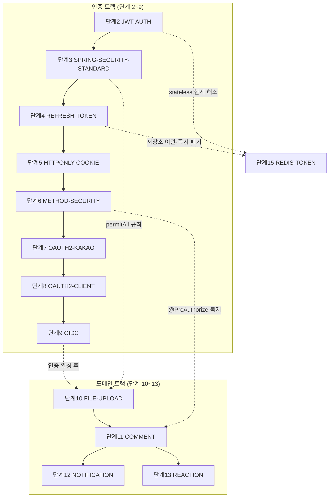

# 게시판 프로젝트 강의 맵 (MOC)

> **MOC(Map of Content)** — 이 저장소의 모든 강의 문서로 가는 허브. Obsidian에서 이 파일을 그래프 중심에 두면 어느 문서에서든 두세 클릭으로 관련 문서에 도달한다. 각 문서는 상단 frontmatter(`step`/`track`/`tags`/`requires`)로 서로 연결돼 있다.

강의용 Spring Boot 게시판을 **단계별로 쌓아 올리는** 커리큘럼이다. 크게 **인증 트랙(단계 2~9)** → **도메인 트랙(단계 10~13)** 으로 이어지고, 그 사이사이에 **보조 이론·실습** 문서가 개념을 받쳐 준다.

---

## 1. 전체 의존 지도

각 단계가 무엇을 선수로 요구하는지의 큰 흐름. (실선 = 단계 진행, 점선 = 개념 의존)

---

## 2. 단계별 목차

| 단계 | 문서 | 핵심 주제 | 상태 |
|------|------|-----------|------|
| 1 | [[INSTRUCTOR]] · [[STUDENT]] | 프로젝트 셋업·3계층 (강사용/학생용) | 완료 |
| 2 | [[JWT-AUTH]] | 세션 → JWT 전환, 클래스별 역할 | 완료 |
| 3 | [[SPRING-SECURITY-STANDARD]] | Spring Security 표준 인증/인가 | 완료 |
| 4 | [[REFRESH-TOKEN]] | Access/Refresh 분리, DB 저장 | 완료 |
| 5 | [[HTTPONLY-COOKIE]] | Refresh Token을 httpOnly 쿠키로 | 완료 |
| 6 | [[METHOD-SECURITY]] | `@PreAuthorize` + 자원 소유권 인가 | 완료 |
| 7 | [[OAUTH2-KAKAO]] | 카카오 OAuth2 수동 구현 | 완료 |
| 8 | [[OAUTH2-CLIENT]] | `spring-boot-starter-oauth2-client` 표준화 | 완료 |
| 9 | [[OIDC]] | OAuth2 위의 인증 계층(OIDC) | 완료 |
| 10 | [[FILE-UPLOAD]] | 이미지 업로드 multipart + 정적 서빙 | 완료 |
| 11 | [[COMMENT]] | 댓글/대댓글 자기참조 + soft delete | 완료 |
| 12 | [[NOTIFICATION]] | 이벤트 기반 인앱 알림 | 완료 |
| 13 | [[REACTION]] | 좋아요/싫어요 유튜브식 토글 | 완료 |
| 15 | [[REDIS-TOKEN]] · [[REDIS-TOKEN-WALKTHROUGH]] | Redis 토큰 저장소 — refresh 이관 + access 즉시 폐기 (설계/따라하기) | 완료 |
| 16 | [[DB-PERFORMANCE]] · [[DB-PERFORMANCE-LAB]] | DB 성능 — 인덱스·keyset 페이지네이션 (로드맵/실습) | 계획 |

---

## 3. 트랙별 보기

**인증 트랙** — 세션에서 시작해 JWT → OAuth2 → OIDC까지, "누구인가"를 확인하는 방법의 진화:
[[JWT-AUTH]] → [[SPRING-SECURITY-STANDARD]] → [[REFRESH-TOKEN]] → [[HTTPONLY-COOKIE]] → [[METHOD-SECURITY]] → [[OAUTH2-KAKAO]] → [[OAUTH2-CLIENT]] → [[OIDC]]

**도메인 트랙** — 인증이 완성된 뒤 게시판 기능을 쌓는다:
[[FILE-UPLOAD]] → [[COMMENT]] → ( [[NOTIFICATION]] · [[REACTION]] )

---

## 4. 보조 문서 (단계에 매이지 않는 개념·참조)

| 분류 | 문서 | 언제 읽나 |
|------|------|-----------|
| 이론 | [[HTTP-SESSION]] | JWT 이전, 세션·쿠키 개념 |
| 이론 | [[SECURITY-FILTER-CHAIN]] | Security 필터 실행 순서 이해 |
| 이론 | [[EXCEPTION-HANDLING]] | `@RestControllerAdvice` 중앙 예외 처리 |
| 이론 | [[REDIS-BASICS]] | Redis가 처음일 때 — 단계 15([[REDIS-TOKEN]]) 선수 지식 |
| 실습 | [[TESTING-GUIDE]] | 테스트 실행 방법 |
| 실습 | [[UNIT-TESTING]] | 테스트 작성법 (초급~중급) |
| 참조 | [[CURL-TEST]] | 전체 API·에러 응답 curl |
| 배포 | [[DOCKER]] | 도커 이미지·compose (자체완결/기존 DB 브리지) |
| 배포 | [[FRONTEND-DEPLOY]] | 최소 프론트(HTML/JS) + Nginx 리버스 프록시 |
| 배포 | [[DEPLOY-LIGHTSAIL]] | AWS Lightsail 서버 최초 세팅 가이드 |
| 배포 | [[CICD-GITHUB-ACTIONS]] | GitHub Actions CI/CD + Secret 설정 |
| 배포 | [[HTTPS-DOMAIN]] | HTTPS + 도메인 — Let's Encrypt·Caddy (`https://sbs.alldayai.org` 적용 완료) |
| 배포 | [[GITHUB-ACTIONS-BASICS]] | GitHub Actions 개념·키워드·명령·장단점 요약 |
| 작업계획 | [[OAUTH2-KAKAO-WORKPLAN]] · [[OAUTH2-CLIENT-WORKPLAN]] | 단계 7·8 진행 현황 |

---

## 5. 주제 태그로 찾기

Obsidian 검색창에 `tag:#태그` 로 묶어서 볼 수 있다.

- `#auth` — 인증/인가 전반 (단계 2~6 + 보조 이론)
- `#oauth2` — 소셜 로그인 (단계 7~9)
- `#domain` — 게시판 도메인 기능 (단계 10~13)
- `#jpa` — JPA 연관·N+1 관련 ([[COMMENT]], [[REACTION]])
- `#event` — 이벤트/트랜잭션 ([[NOTIFICATION]])
- `#test` — 테스트 ([[UNIT-TESTING]], [[TESTING-GUIDE]])
- `#docker` — 도커화·배포 ([[DOCKER]], [[FRONTEND-DEPLOY]])
- `#cicd` — 배포 자동화 ([[DEPLOY-LIGHTSAIL]], [[CICD-GITHUB-ACTIONS]])
- `#theory` — 보조 이론
- `#reference` — 참조 문서

---

## 6. 이 위키를 유지하는 법

새 단계를 추가할 때의 흐름:

1. 기능 구현 후 강의 문서 작성 (`docs/lecture/XXX.md`)
2. 문서 상단에 frontmatter 추가 — `step` / `track` / `tags` / `requires: ["[[선수문서]]"]` / `status`
3. 본문의 선수 지식·상호참조를 `[[위키링크]]` 로 연결
4. **이 MOC의 §2 목차와 §1 의존 지도에 새 단계 한 줄 추가**
5. `git commit + push`

> [!TIP]
> `requires` 필드와 본문 `[[위키링크]]`가 Obsidian 그래프·백링크의 원천이다. 새 문서가 무엇에 기대는지만 정확히 적으면, 그래프 뷰(⌘G)가 커리큘럼 의존 구조를 자동으로 그려 준다.
