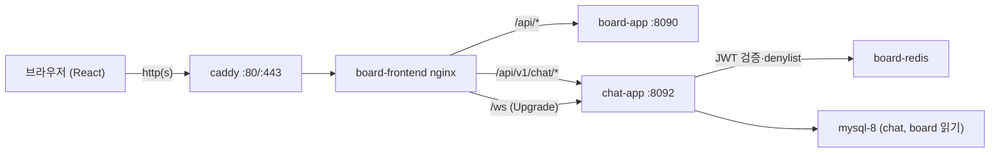
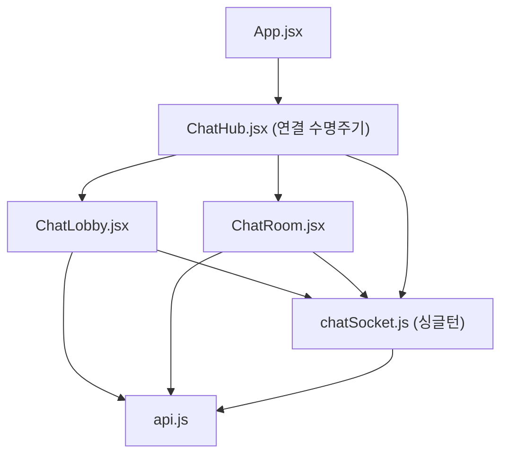
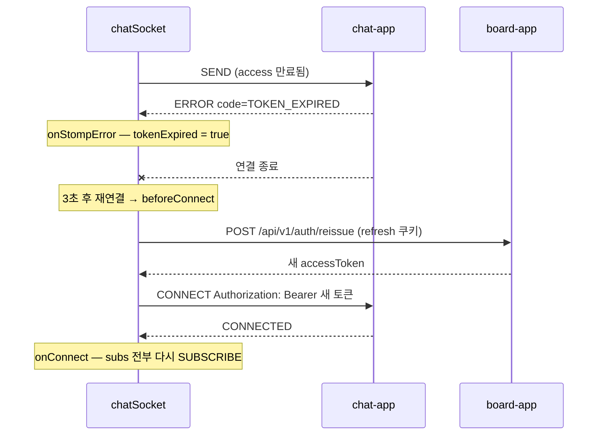

# 채팅 UI 따라하기 — STOMP 로비·방·실시간 메시지

> 전제: 채팅 서버는 별도 저장소 **chat**(`../chat`, https://github.com/icesnake72/chat)이고, board 인증(JWT·refresh 쿠키·Redis denylist)을 그대로 재사용한다. 서버 쪽 따라하기는 chat 저장소 `docs/lecture/`(1~4일차)에 있고, 본문의 "N일차"는 그 chat 강의 일차를 가리킨다. 이 문서는 그 3일차 중 **board 프론트 작업**이다 — 같은 내용이 chat 저장소 `docs/lecture/day3_frontend_walkthrough.md`에도 있다. 기준 코드: 이 저장소 커밋 `f3574de`(2026-09-20). **절 순서 = 파일을 만든 순서(import 방향)**이고, 각 절이 끝날 때마다 `npm run build`가 통과한다. 코드는 `main`의 실제 파일에서 그대로 옮겼다.

3일차 본 수업이다. board 프론트(`board/frontend`, React 18 + Vite)에 **채팅 탭**을 붙인다. 방 목록(로비)에서 방을 만들거나 고르고, 방 화면에서 이력을 읽고, STOMP로 메시지를 실시간으로 주고받는다. 서버는 이미 완성돼 있다(chat 저장소 1~2일차 + 3일차 서버 보완). 이 문서는 **board 저장소 커밋 `f3574de`**의 변경 12개 파일을 의존 순서대로 다시 쌓는다.

---

## 1. 핵심 요약

| 항목 | 내용 |
|---|---|
| 만드는 것 | 채팅 탭(헤더 네비) → 로비(방 목록·생성·실시간 갱신) → 방(이력·실시간 메시지·입장/퇴장·접속자) |
| 새 파일 | `src/chatSocket.js`, `src/components/ChatHub.jsx`, `ChatLobby.jsx`, `ChatRoom.jsx` |
| 수정 파일 | `nginx.conf`, `vite.config.js`, `package.json`, `src/api.js`, `src/App.jsx`, `src/styles.css` |
| 새 의존성 | `@stomp/stompjs` 7.x (STOMP 프레임 처리·재연결·heartbeat) |
| 인증 | board 그대로 — access token은 메모리, refresh는 httpOnly 쿠키. STOMP는 CONNECT 프레임 헤더에 Bearer |
| 검증 | 단계마다 `npm run build` → 마지막에 `board-frontend` 재빌드 → 브라우저 두 개로 E2E |

**작업 순서 (= 이 문서의 절 순서)**

| 절 | 파일 | 그 시점에 가능해지는 것 |
|---|---|---|
| 3 | `nginx.conf`, `vite.config.js` | `/api/v1/chat/*`, `/ws`가 chat-app에 닿는다 (curl 401·101) |
| 4 | `package.json` | `@stomp/stompjs` 설치 |
| 5 | `api.js` (끝에 추가) | 채팅 REST 함수 + 토큰 접근자 |
| 6 | `chatSocket.js` | 앱 전체가 공유하는 STOMP 연결 하나 |
| 7 | `ChatLobby.jsx` | 방 목록·생성·입장 |
| 8 | `ChatRoom.jsx` | 이력·실시간 메시지·전송 |
| 9 | `ChatHub.jsx` | 연결 수명주기 + 로비/방 전환 |
| 10 | `App.jsx` | 헤더 "채팅" 버튼으로 진입 |
| 11 | `styles.css` (끝 부분에 추가) | 채팅 화면 모양 |
| 12 | (실행) | 컨테이너 재빌드 후 두 브라우저 E2E |

순서의 원칙은 **import 방향**이다. 프록시(요청이 서버에 닿는 길) → 라이브러리 → `api.js` → `chatSocket.js`(api를 import) → 화면 컴포넌트(둘 다 import) → `ChatHub`(화면을 import) → `App`(Hub를 import). 아래에서 위로 쌓으면 어느 절에서 멈춰도 `npm run build`가 통과한다. 화면에 보이는 것은 10절부터다.

**런타임 구조**





**출처 범례** (각 절의 표에서 쓰는 값)

| 출처 | 뜻 |
|---|---|
| React | `useState`, `useEffect`, `useLayoutEffect`, `useRef`, `useCallback` |
| @stomp/stompjs | `Client`와 그 옵션·콜백, `subscribe`/`publish`, 프레임 객체 |
| 브라우저 API | `WebSocket`(stompjs 내부), `fetch`, `window.location`, `URLSearchParams`, `JSON` |
| nginx / Vite | 프록시 지시어, dev 서버 프록시 설정 |
| board 기존 | 이번 작업 전부터 board 프론트에 있던 것 (`jsonFetch`, `reissue`, `accessToken`, `AuthBar`, CSS 변수·`board-card` 클래스 등) |
| chat 서버 | chat-app의 REST·STOMP 계약 (2절 표) |
| N절 | 이 문서의 N절에서 만든 것 |
| 이 절 | 지금 만드는 것 |

**시간 배분** (3일차 4시간 중 서버 보완 40분 이후)

| 시간 | 절 | 확인 |
|---|---|---|
| 0:40–1:00 | 2~4 (계약 복습, 프록시, 의존성) | curl 401·101 |
| 1:00–1:40 | 5~6 (api.js, chatSocket) | `npm run build` |
| 1:40–2:50 | 7~8 (로비, 방) | `npm run build` |
| 2:50–3:20 | 9~11 (Hub, App, CSS) | frontend 재빌드 후 `http://localhost` |
| 3:20–4:00 | 12 (재빌드, E2E) | 두 브라우저 대화·입장·퇴장 |

---

## 2. 시작 전 — 서버 계약과 board 인증 구조

이번 절에서 만드는 파일은 없다. 프론트가 기대는 두 가지를 먼저 확인한다.

### 2.1 chat 서버 계약 (chat 서버 출처)

| 종류 | 경로 | 요청 / 응답 | 프론트에서 쓰는 곳 |
|---|---|---|---|
| REST | `GET /api/v1/chat/rooms?page&size` | `PagedModel { content: RoomResponse[], page }` | 로비 목록 |
| REST | `POST /api/v1/chat/rooms` | `{name, description}` → `RoomResponse` (201, 생성자는 자동 멤버) | 방 만들기 |
| REST | `POST /api/v1/chat/rooms/{id}/join` | 멱등. 이미 멤버여도 200 | 방 클릭 |
| REST | `DELETE /api/v1/chat/rooms/{id}/leave` | 멤버 탈퇴 | 나가기 |
| REST | `DELETE /api/v1/chat/rooms/{id}` | 소유자만, 204 | 방 삭제 |
| REST | `GET /api/v1/chat/rooms/{id}/members` | `MemberResponse[] {userId, username, online, joinedAt}` | 접속자 표시 |
| REST | `GET /api/v1/chat/rooms/{id}/messages?before&size` | `{messages(오래된 순), hasMore, nextBefore}` keyset | 이력·더 보기 |
| STOMP | `CONNECT` + `Authorization: Bearer …` | `CONNECTED heart-beat:10000,10000` 또는 `ERROR code=…` | `chatSocket` |
| STOMP | `SUBSCRIBE /topic/rooms` | `RoomEvent {type: ROOM_CREATED\|ROOM_DELETED\|MEMBER_COUNT, room}` | 로비 실시간 |
| STOMP | `SUBSCRIBE /topic/rooms/{id}` (멤버만) | `MessageResponse {id, roomId, type: TALK\|ENTER\|LEAVE, senderUsername, senderNickname, content, createdAt}` | 방 실시간 |
| STOMP | `SUBSCRIBE /user/queue/errors` | `{code, message}` — 연결은 유지되는 개인 에러 | 전송 실패 표시 |
| STOMP | `SEND /app/rooms/{id}/messages` | `{content}` (1~1000자) | 전송 |

`RoomResponse`는 `{id, name, description, ownerUsername, memberCount, onlineCount, createdAt}`이다. ENTER/LEAVE는 프론트가 보내지 않는다. **방 토픽을 구독하면 서버가 ENTER를, 구독을 해제하거나 연결이 끊기면 LEAVE를** 만든다(2일차 `RoomPresenceListener`).

STOMP `ERROR` 프레임의 `code` 헤더와 프론트 대응:

| code | 뜻 | 프론트 대응 |
|---|---|---|
| `TOKEN_EXPIRED` | access 만료 (1시간) | refresh 쿠키로 reissue 후 재연결 — 사용자는 모른다 |
| `LOGIN_REQUIRED` | 토큰 없음·위조·로그아웃(denylist) | 재시도하지 않고 끊는다 |
| `NOT_ROOM_MEMBER` | 비멤버가 방 토픽 구독 | 입장(join)을 먼저 하도록 화면 흐름을 짠다 |

### 2.2 board 프론트의 인증 구조 (board 기존)

`src/api.js` 앞부분에 이미 있는 것들이다. 이번 작업은 이것을 **고치지 않고 재사용**한다.

| 이름 | 종류 | 하는 일 |
|---|---|---|
| `let accessToken` | 모듈 변수 (export 안 됨) | access token을 메모리에만 보관. 새로고침하면 사라진다 |
| `reissue()` | 내부 함수 | `POST /api/v1/auth/reissue` (refresh 쿠키 자동 전송) → 성공 시 `accessToken` 갱신, `true` |
| `authFetch(url, options)` | export | Bearer 부착, 401이면 `reissue()` 후 1회 재시도 |
| `jsonFetch(url, options)` | 내부 함수 | `authFetch` + JSON 헤더, 실패 시 서버 `{code, message}`를 담은 `Error` throw |
| `silentLogin()` | export | 앱 시작 시 `reissue()`로 세션 복원 |
| `getMe()` | export | `GET /api/v1/profiles/me` → `{userId, username, nickname, …}`. `App`의 `user` 상태 |

REST는 `jsonFetch`만 쓰면 토큰 처리가 끝난다. 문제는 **STOMP CONNECT 프레임**이다. 이것은 `fetch`가 아니라서 `authFetch`를 탈 수 없고, refresh 쿠키는 `Path=/api/v1/auth`라 `/ws` 핸드셰이크에 실리지도 않는다. 그래서 5절에서 토큰 접근자를 따로 연다.

### 2.3 실행 환경

```bash
# board 디렉토리 — chat이 include로 함께 뜬다 (chat 저장소가 ../chat 에 있어야 한다)
docker compose up -d --build --wait
docker exec chat-app curl -s http://localhost:8092/actuator/health            # {"status":"UP",...}
cd frontend && npm install
git checkout -b feature/chat-ui
```

---

## 3. 프록시 — `nginx.conf`, `vite.config.js`

**왜 지금**: 프론트 코드가 `/api/v1/chat/...`과 `/ws`를 부르기 전에, 그 요청이 chat-app까지 가는 길이 있어야 한다. 이 절이 끝나면 curl만으로 확인할 수 있다.

`frontend/nginx.conf` (board 기존 파일에 두 군데 추가)

① `server` 블록 앞쪽, 기존 `set $backend board-app:8090;` 바로 아래에 한 줄:

```nginx
set $chat_backend chat-app:8092;    # 채팅 백엔드 — 같은 board-db-net의 컨테이너명
```

② 기존 `location /api/ { … }` 블록 다음, OAuth2 프록시 블록 앞에:

```nginx
# ── 채팅 프록시 ──
# location 접두어 매칭은 "가장 긴 것"이 이기므로 /api/v1/chat/ 이 위의 /api/ 보다 우선한다.
# 채팅 REST는 chat-app으로, 나머지 /api/ 는 그대로 board-app으로 간다.
location /api/v1/chat/ {
  proxy_pass http://$chat_backend;
  proxy_http_version 1.1;
  proxy_set_header Host $host;
  proxy_set_header X-Real-IP $remote_addr;
  proxy_set_header X-Forwarded-For $proxy_add_x_forwarded_for;
  proxy_set_header X-Forwarded-Proto $fwd_proto;
}

# WebSocket(STOMP) 업그레이드 — Upgrade/Connection 헤더는 hop-by-hop이라 프록시가
# 명시적으로 넘겨야 하고, 유휴 연결이 read timeout(기본 60s)에 끊기지 않게 늘린다.
# (하트비트 10s가 있어 60s로도 유지되지만, 여유를 두는 것이 관례)
location /ws {
  proxy_pass http://$chat_backend;
  proxy_http_version 1.1;
  proxy_set_header Upgrade $http_upgrade;
  proxy_set_header Connection "upgrade";
  proxy_set_header Host $host;
  proxy_set_header X-Real-IP $remote_addr;
  proxy_set_header X-Forwarded-For $proxy_add_x_forwarded_for;
  proxy_set_header X-Forwarded-Proto $fwd_proto;
  proxy_read_timeout 3600s;
  proxy_send_timeout 3600s;
}
```

| 지시어 | 출처 | 역할 |
|---|---|---|
| `set $chat_backend chat-app:8092` | nginx (board 기존 패턴) | 컨테이너명을 변수로 둔다. board가 이미 쓰는 `resolver 127.0.0.11` + 변수 패턴이라 chat-app만 재생성돼도 새 IP를 따라간다 |
| `location /api/v1/chat/` | nginx | 접두어 매칭은 **가장 긴 것**이 이긴다. 그래서 기존 `/api/`보다 먼저 잡히고, 나머지 `/api/`는 그대로 board-app으로 간다 |
| `proxy_set_header Upgrade` / `Connection "upgrade"` | nginx | `Upgrade`, `Connection`은 hop-by-hop 헤더라 프록시가 기본으로 넘기지 않는다. 명시하지 않으면 WebSocket이 일반 HTTP로 바뀌어 실패한다 |
| `proxy_http_version 1.1` | nginx | WebSocket 업그레이드는 HTTP/1.1 기능이다 (기본값 1.0) |
| `X-Forwarded-Proto $fwd_proto` | board 기존 (`map`) | caddy가 붙인 원래 스킴을 승계. chat-app은 `forward-headers-strategy: framework`로 이것을 읽는다 |
| `proxy_read_timeout 3600s` | nginx | 아무 프레임도 없는 시간이 기본 60초를 넘으면 nginx가 끊는다. heartbeat 10초면 충분하지만 여유를 둔다 |

`frontend/vite.config.js` (전체)

```javascript
import { defineConfig } from "vite";
import react from "@vitejs/plugin-react";

// 개발 서버에서 /api 를 백엔드로 프록시(로컬 npm run dev 용).
// 컨테이너 배포에서는 이 프록시가 아니라 Nginx(nginx.conf)가 프록시를 담당한다.
// 채팅: /api/v1/chat 과 /ws(WebSocket)는 chat-app(8092)으로 — 구체 경로가 먼저 매칭돼야
// 하므로 /api 보다 위에 둔다.
export default defineConfig({
  plugins: [react()],
  server: {
    proxy: {
      "/api/v1/chat": "http://localhost:8092",
      "/ws": { target: "ws://localhost:8092", ws: true },
      "/api": "http://localhost:8090",
    },
  },
});
```

| 항목 | 출처 | 역할 |
|---|---|---|
| `server.proxy` | Vite | `npm run dev`(5173)에서만 쓰는 프록시. 컨테이너 배포에서는 nginx가 담당 |
| 키 순서 | Vite | 위에서부터 매칭한다. `/api/v1/chat`을 `/api`보다 위에 두지 않으면 채팅 요청이 board-app으로 간다 |
| `ws: true` | Vite (http-proxy) | WebSocket 업그레이드를 프록시 |
| `localhost:8092` | board `docker-compose.override.yml` | dev 모드는 호스트에서 chat-app에 직접 붙으므로 override로 포트를 열어 둔다 |

> 주의: 로컬 board 스택은 board-app의 8090을 호스트에 열지 않는다(caddy 경유만). 그래서 `npm run dev`로는 로그인(`/api` → `localhost:8090`)이 안 된다. 이 문서는 화면 확인을 **frontend 컨테이너 재빌드**로 한다. dev 모드를 쓰려면 override에 board-app 포트도 열어야 한다.

```bash
cd .. && docker compose up -d --build --wait frontend      # nginx.conf는 이미지에 들어가므로 재빌드
curl -s -o /dev/null -w "%{http_code}\n" -H "Connection: Upgrade" -H "Upgrade: websocket" \
  -H "Sec-WebSocket-Version: 13" -H "Sec-WebSocket-Key: dGhlIHNhbXBsZSBub25jZQ==" \
  -H "Origin: http://localhost" http://localhost/ws                            # 101
TOKEN=$(curl -s -X POST http://localhost/api/v1/auth/login -H 'Content-Type: application/json' \
  -d '{"username":"<아이디>","password":"<비밀번호>"}' | python3 -c 'import json,sys;print(json.load(sys.stdin)["accessToken"])')
curl -s http://localhost/api/v1/chat/me -H "Authorization: Bearer $TOKEN"      # {"userId":..,"username":..,"nickname":..} — chat-app 응답
git commit -am "feat(nginx): /api/v1/chat/, /ws 를 chat-app으로 프록시 + vite dev 프록시"
```

`/ws`가 403이면 chat-app의 Origin 허용 목록 문제다. 브라우저는 기본 포트(80)를 Origin에서 생략하므로 `http://localhost`(포트 없음)가 허용돼 있어야 한다(chat 저장소 `docs/lecture/day3_server_prep_walkthrough.md`, 13절 함정 표).

---

## 4. 의존성 — `@stomp/stompjs`

**왜 지금**: 6절 `chatSocket.js`가 import한다. 설치가 먼저다.

```bash
cd frontend
npm install @stomp/stompjs@^7.3.0       # package.json dependencies 에 "@stomp/stompjs": "^7.3.0"
```

| 직접 `WebSocket`으로 하면 | `@stomp/stompjs`가 대신 해 주는 것 |
|---|---|
| 프레임 문자열 조립·파싱 (`COMMAND\nheader:value\n\nbody\0`) | `publish`, `subscribe`, 프레임 객체 |
| heartbeat 타이머·끊김 감지 | `heartbeatIncoming/Outgoing` |
| 끊기면 다시 연결 | `reconnectDelay` |
| 구독 id 발급·UNSUBSCRIBE | `subscribe()`가 돌려주는 객체의 `unsubscribe()` |

단, **재연결해도 구독을 기억하지 않는다**. 이것을 6절에서 직접 해결한다.

```bash
npm run build                            # 아직 import하는 곳이 없어도 통과
git commit -am "chore: @stomp/stompjs 추가"
```

---

## 5. `api.js` — 채팅 REST 함수와 토큰 접근자

**왜 지금**: 6~8절이 모두 이 함수들을 import한다. REST는 기존 `jsonFetch`에 얹기만 하면 된다.

`frontend/src/api.js` 파일 **맨 끝에 추가** (기존 코드는 그대로)

```javascript
// ── 채팅(chat-app: /api/v1/chat 프록시) ─────────────────────────────────────
// STOMP CONNECT 프레임은 fetch 래퍼를 못 타므로 토큰 접근자를 따로 연다.
// 노출 범위는 chatSocket.js 하나 — 다른 컴포넌트는 여전히 authFetch만 쓴다.
export function getAccessToken() {
  return accessToken;
}

// STOMP ERROR(TOKEN_EXPIRED) 재연결 직전에 호출 — 성공 시 true
export async function refreshAccessToken() {
  return reissue();
}

export async function getChatRooms(page = 0, size = 50) {
  return jsonFetch(`/api/v1/chat/rooms?page=${page}&size=${size}`);
}

export async function createChatRoom(name, description) {
  return jsonFetch("/api/v1/chat/rooms", {
    method: "POST",
    body: JSON.stringify({ name, description }),
  });
}

export async function deleteChatRoom(roomId) {
  return jsonFetch(`/api/v1/chat/rooms/${roomId}`, { method: "DELETE" });
}

// 입장은 멱등(이미 멤버면 그대로 성공) — 방 클릭 = join 후 진입으로 단순화
export async function joinChatRoom(roomId) {
  return jsonFetch(`/api/v1/chat/rooms/${roomId}/join`, { method: "POST" });
}

export async function leaveChatRoom(roomId) {
  return jsonFetch(`/api/v1/chat/rooms/${roomId}/leave`, { method: "DELETE" });
}

export async function getChatMembers(roomId) {
  return jsonFetch(`/api/v1/chat/rooms/${roomId}/members`);
}

// 이력은 keyset: 첫 호출은 before 없이 최신 50건, 이전 페이지는 응답의 nextBefore를 넘긴다.
// 응답 { messages(오래된 순), hasMore, nextBefore }
export async function getChatMessages(roomId, before = null, size = 50) {
  const params = new URLSearchParams({ size });
  if (before != null) params.set("before", before);
  return jsonFetch(`/api/v1/chat/rooms/${roomId}/messages?${params}`);
}
```

| 이름 | 출처 | 역할 |
|---|---|---|
| `accessToken`, `reissue()`, `jsonFetch()` | board 기존 (같은 파일 앞부분) | 2.2절 표 |
| `getAccessToken()` | 이 절 | CONNECT 헤더에 넣을 현재 access. 모듈 변수를 밖에 여는 유일한 통로 — 쓰는 곳은 `chatSocket.js` 하나로 제한 |
| `refreshAccessToken()` | 이 절 | 내부 `reissue()`를 밖에서 부를 수 있게 감싼 것. STOMP `TOKEN_EXPIRED` 후 재연결 직전에 호출 |
| `getChatRooms` ~ `getChatMessages` | 이 절 | 2.1절 REST 표와 1:1 |
| `URLSearchParams` | 브라우저 API | 쿼리 문자열 조립. `before`가 없을 때(첫 페이지) 파라미터를 아예 빼기 위해 |

`joinChatRoom`이 멱등이라는 점이 화면 설계를 단순하게 만든다. "이미 멤버인지" 묻지 않고 **방 클릭 = join → 입장**으로 끝낸다(7절).

```bash
npm run build
git commit -am "feat(api): 채팅 REST 함수 + STOMP용 토큰 접근자"
```

---

## 6. `chatSocket.js` — 앱 전체가 공유하는 STOMP 연결

**왜 지금**: 로비·방 컴포넌트가 둘 다 이 객체로 구독한다. 화면보다 먼저 있어야 한다.

설계 결정 세 가지:

| 결정 | 이유 |
|---|---|
| **연결은 하나, 모듈 싱글턴** (`export const chatSocket`) | 로비와 방은 같은 세션 위의 구독일 뿐이다. 화면마다 연결을 열면 서버 presence가 세션 수만큼 늘고, 화면 전환마다 CONNECT 비용이 든다 |
| **구독 등록부 `subs`** | stompjs는 재연결 후 구독을 복구하지 않는다. 등록부에 `destination`과 콜백을 들고 있다가 `onConnect`마다 다시 건다. 연결 전에 등록된 구독도 같은 방식으로 붙는다 |
| **토큰은 `beforeConnect`에서** | CONNECT 직전마다 불린다. 만료로 끊겼으면 여기서 reissue하고 헤더를 갈아 끼운다 — 재연결 루프 하나로 토큰 갱신까지 끝난다 |

`frontend/src/chatSocket.js` (새 파일)

```javascript
// STOMP 클라이언트 래퍼 — 연결 수명주기와 구독 복구를 한 곳에서 관리한다.
//
// 서버(chat-app) 계약:
//   - 핸드셰이크(/ws)는 공개, 인증은 CONNECT 프레임의 Authorization 헤더로 한다
//     (refresh 쿠키는 Path=/api/v1/auth 라 핸드셰이크에 실리지 않는 설계).
//   - SEND/SUBSCRIBE마다 만료·denylist를 재검사하므로 장수명 연결도 로그아웃이 반영된다.
//   - 거부는 ERROR 프레임(native 헤더 code) 후 연결 종료:
//       TOKEN_EXPIRED  → reissue 후 재연결하면 된다 (여기서 자동 처리)
//       LOGIN_REQUIRED → 세션이 무효(로그아웃/계정 문제) — 재시도하지 않고 끊는다
//   - @stomp/stompjs는 재연결해도 구독을 기억하지 않으므로 등록부(subs)로 복구한다.
import { Client } from "@stomp/stompjs";
import { getAccessToken, refreshAccessToken } from "./api.js";

function brokerURL() {
  const scheme = window.location.protocol === "https:" ? "wss" : "ws";
  return `${scheme}://${window.location.host}/ws`;
}

class ChatSocket {
  constructor() {
    this.client = null;
    this.subs = new Map();       // key → { destination, callback, live(StompSubscription) }
    this.nextKey = 1;
    this.tokenExpired = false;   // 직전 ERROR가 TOKEN_EXPIRED였으면 재연결 전에 reissue
    this.onState = null;         // "connected" | "connecting" | "offline" | "unauthorized"
  }

  // 화면에서 상태 배지를 그릴 수 있게 콜백 하나만 받는다
  setStateListener(fn) {
    this.onState = fn;
  }

  emit(state) {
    if (this.onState) this.onState(state);
  }

  activate() {
    if (this.client?.active) return;
    this.client = new Client({
      brokerURL: brokerURL(),
      reconnectDelay: 3000,
      heartbeatIncoming: 10000,
      heartbeatOutgoing: 10000,
      // CONNECT 직전마다 호출 — 만료로 끊겼으면 새 access를 받아 헤더를 갱신한다
      beforeConnect: async () => {
        const c = this.client;
        if (!c) return;
        if (this.tokenExpired || !getAccessToken()) {
          this.tokenExpired = false;
          const ok = await refreshAccessToken();
          if (!ok) {
            this.emit("unauthorized");
            c.deactivate();          // refresh도 죽었으면 재연결 루프를 멈춘다
            return;
          }
        }
        c.connectHeaders = { Authorization: `Bearer ${getAccessToken()}` };
      },
      onConnect: () => {
        this.emit("connected");
        // 재연결 포함 — 등록된 구독을 전부 다시 건다(방 재입장, 로비 복구)
        for (const entry of this.subs.values()) {
          entry.live = this.client.subscribe(entry.destination, entry.callback);
        }
      },
      onStompError: (frame) => {
        const code = frame.headers["code"];
        if (code === "TOKEN_EXPIRED") {
          this.tokenExpired = true;  // 서버가 곧 연결을 끊고, stompjs가 재연결한다
        } else if (code === "LOGIN_REQUIRED") {
          this.emit("unauthorized");
          this.deactivate();
        }
      },
      onWebSocketClose: () => {
        for (const entry of this.subs.values()) entry.live = null;
        if (this.client?.active) this.emit("connecting");
      },
    });
    this.emit("connecting");
    this.client.activate();
  }

  deactivate() {
    this.subs.clear();
    this.emit("offline");
    if (this.client) {
      const c = this.client;
      this.client = null;
      c.deactivate();
    }
  }

  // 구독 등록 — 연결 전이면 등록만 해두고 onConnect에서 붙는다. 해제 함수를 돌려준다.
  subscribe(destination, callback) {
    const key = this.nextKey++;
    const entry = { destination, callback, live: null };
    this.subs.set(key, entry);
    if (this.client?.connected) {
      entry.live = this.client.subscribe(destination, callback);
    }
    return () => {
      this.subs.delete(key);
      if (entry.live) entry.live.unsubscribe();  // UNSUBSCRIBE → 서버가 LEAVE 처리
    };
  }

  // JSON 페이로드 구독 헬퍼
  subscribeJson(destination, handler) {
    return this.subscribe(destination, (message) => {
      try {
        handler(JSON.parse(message.body));
      } catch {
        /* TEXT ERROR 등 JSON이 아닌 프레임은 무시 */
      }
    });
  }

  sendMessage(roomId, content) {
    if (!this.client?.connected) throw new Error("연결이 아직 준비되지 않았습니다.");
    this.client.publish({
      destination: `/app/rooms/${roomId}/messages`,
      body: JSON.stringify({ content }),
    });
  }
}

// 앱 전체가 연결 하나를 공유한다(로비·방이 같은 세션의 구독일 뿐)
export const chatSocket = new ChatSocket();
```

| 이름 | 출처 | 역할 |
|---|---|---|
| `Client` | @stomp/stompjs | STOMP 클라이언트. `activate()`로 시작, `deactivate()`로 종료(재연결도 멈춤) |
| `brokerURL` | @stomp/stompjs 옵션 | 접속 주소. 페이지와 같은 호스트의 `/ws` — 운영 https면 `wss` |
| `reconnectDelay: 3000` | @stomp/stompjs 옵션 | 끊기면 3초 뒤 재연결. `0`이면 재연결 안 함 |
| `heartbeatIncoming/Outgoing: 10000` | @stomp/stompjs 옵션 | CONNECT의 `heart-beat:10000,10000`. 서버와 같은 값 |
| `beforeConnect` | @stomp/stompjs 콜백 | 매 CONNECT 직전 (async 가능). 여기서 `connectHeaders`를 정한다 |
| `connectHeaders` | @stomp/stompjs 속성 | CONNECT 프레임 헤더. 서버는 여기서 `Authorization`을 읽는다 |
| `onConnect` | @stomp/stompjs 콜백 | CONNECTED 수신 — 최초·재연결 모두 |
| `onStompError(frame)` | @stomp/stompjs 콜백 | ERROR 프레임. `frame.headers["code"]`는 chat 서버의 `StompErrorHandler`가 넣은 값 |
| `onWebSocketClose` | @stomp/stompjs 콜백 | 소켓 종료. 살아 있는 구독 객체는 모두 무효가 되므로 `live = null` |
| `client.active` / `client.connected` | @stomp/stompjs 속성 | 활성화 상태(재연결 중 포함) / 지금 CONNECTED 상태 |
| `client.subscribe(dest, cb)` | @stomp/stompjs | SUBSCRIBE. 반환 객체의 `unsubscribe()`가 UNSUBSCRIBE |
| `client.publish({destination, body})` | @stomp/stompjs | SEND |
| `getAccessToken`, `refreshAccessToken` | 5절 | 메모리 토큰 읽기, reissue |
| `window.location` | 브라우저 API | `ws`/`wss`, 호스트 결정 |

**토큰 만료 시 흐름** — 사용자는 아무것도 하지 않는다.



reissue까지 실패하면(refresh도 만료·로그아웃) `"unauthorized"`를 알리고 `deactivate()`로 재연결 루프를 멈춘다. 안 멈추면 3초마다 401을 무한히 만든다.

`subscribe()`가 **해제 함수를 돌려주는** 형태는 React `useEffect`의 정리 함수와 바로 맞물리도록 고른 것이다(7·8절).

```bash
npm run build
git commit -am "feat(chat): chatSocket — STOMP 연결 싱글턴, 구독 복구, TOKEN_EXPIRED 자동 재연결"
```

---

## 7. `ChatLobby.jsx` — 방 목록·생성·입장

**왜 지금**: `api.js`(5절)와 `chatSocket`(6절)만 의존한다. 방 화면보다 단순하다.

`frontend/src/components/ChatLobby.jsx` (새 파일)

```jsx
import { useEffect, useState } from "react";
import { createChatRoom, getChatRooms, joinChatRoom } from "../api.js";
import { chatSocket } from "../chatSocket.js";

// 채팅 로비: 방 목록(REST) + 실시간 갱신(/topic/rooms의 RoomEvent).
// 방 클릭 = join(멱등) 후 입장 — 멤버만 /topic/rooms/{id}를 구독할 수 있는 서버 계약과 짝.
export default function ChatLobby({ user, onOpenRoom }) {
  const [rooms, setRooms] = useState([]);
  const [status, setStatus] = useState("불러오는 중…");
  const [form, setForm] = useState({ name: "", description: "" });
  const [msg, setMsg] = useState("");
  const [entering, setEntering] = useState(null);   // 더블클릭 방지용 roomId

  async function load() {
    setStatus("불러오는 중…");
    try {
      const data = await getChatRooms();            // PagedModel { content, page }
      setRooms(data.content);
      setStatus(data.content.length === 0 ? "아직 채팅방이 없습니다. 첫 방을 만들어 보세요." : "");
    } catch (err) {
      setStatus(`목록을 불러오지 못했습니다: ${err.message}`);
    }
  }

  useEffect(() => {
    if (!user) return;
    load();
    // 로비 이벤트: 생성/삭제/인원 변화가 열려 있는 모든 로비 화면에 실시간 반영된다
    const unsubscribe = chatSocket.subscribeJson("/topic/rooms", (event) => {
      setRooms((prev) => {
        if (event.type === "ROOM_CREATED") {
          if (prev.some((r) => r.id === event.room.id)) return prev;
          return [event.room, ...prev];
        }
        if (event.type === "ROOM_DELETED") {
          return prev.filter((r) => r.id !== event.room.id);
        }
        // MEMBER_COUNT — memberCount/onlineCount 최신화
        return prev.map((r) => (r.id === event.room.id ? event.room : r));
      });
    });
    return unsubscribe;
  }, [user]);

  async function handleCreate(e) {
    e.preventDefault();
    setMsg("");
    try {
      const room = await createChatRoom(form.name, form.description || null);
      setForm({ name: "", description: "" });
      onOpenRoom(room);                             // 생성자는 자동 입장 상태 — 바로 진입
    } catch (err) {
      setMsg(err.message);
    }
  }

  async function handleEnter(room) {
    if (entering) return;
    setEntering(room.id);
    setMsg("");
    try {
      await joinChatRoom(room.id);                  // 멱등 — 이미 멤버여도 성공
      onOpenRoom(room);
    } catch (err) {
      setMsg(err.message);
    } finally {
      setEntering(null);
    }
  }

  if (!user) {
    return (
      <section>
        <div className="status">채팅은 로그인 후 이용할 수 있습니다. 우측 상단에서 로그인하세요.</div>
      </section>
    );
  }

  return (
    <section>
      <div className="toolbar">
        <span className="count">
          {rooms.length > 0 && <><span className="num">{rooms.length}</span>개의 방</>}
        </span>
        <button type="button" className="btn" onClick={load}>새로고침</button>
      </div>

      {status && <div className="status" role="status">{status}</div>}
      {msg && <div className="status error">{msg}</div>}

      <ul className="board-list">
        {rooms.map((room) => (
          <li key={room.id} className="board-card clickable" onClick={() => handleEnter(room)}>
            <span className="board-id">#{room.id}</span>
            <div className="board-body">
              <p className="board-name">{room.name}</p>
              <p className="board-desc">{room.description ?? ""}</p>
              <p className="chat-room-meta">
                <span className="online-dot" aria-hidden="true" />
                <span className="num">{room.onlineCount}</span> 접속
                {" · 멤버 "}<span className="num">{room.memberCount}</span>
                {" · "}{room.ownerUsername}
              </p>
            </div>
            <span className="chevron">›</span>
          </li>
        ))}
      </ul>

      <form className="inline-form" onSubmit={handleCreate}>
        <strong>새 채팅방</strong>
        <div className="row">
          <input placeholder="방 이름 (50자 이내)" maxLength={50} required
            value={form.name} onChange={(e) => setForm({ ...form, name: e.target.value })} />
          <input placeholder="설명 (선택)" maxLength={200}
            value={form.description} onChange={(e) => setForm({ ...form, description: e.target.value })} />
          <button className="btn primary">만들기</button>
        </div>
      </form>
    </section>
  );
}
```

| 이름 | 출처 | 역할 |
|---|---|---|
| `useState`, `useEffect` | React | 목록·폼 상태, 마운트 시 로드 + 구독 |
| `createChatRoom`, `getChatRooms`, `joinChatRoom` | 5절 | REST |
| `chatSocket.subscribeJson` | 6절 | `/topic/rooms` 구독. 반환된 해제 함수를 `useEffect`가 그대로 정리 함수로 돌려준다 |
| `onOpenRoom(room)` | 9절 `ChatHub`가 넘기는 prop | 방 화면으로 전환 |
| `user` | `App`의 상태 (board 기존) | 비로그인이면 안내만 |
| `board-list`, `board-card`, `toolbar`, `inline-form`, `status` | board 기존 CSS | 게시판 목록과 같은 카드 모양을 재사용 |

포인트:

- **목록은 REST로 한 번, 이후는 이벤트로**. `ROOM_CREATED`는 앞에 추가(중복 방지), `ROOM_DELETED`는 제거, `MEMBER_COUNT`는 교체. 새로고침 버튼은 이벤트를 놓쳤을 때를 위한 안전장치다.
- **방 클릭 = `join` → 입장**. 서버는 멤버만 방 토픽 구독을 허용한다(`NOT_ROOM_MEMBER`). join이 멱등이라 이미 멤버인지 따질 필요가 없다.
- **방 생성자는 join 없이 바로 입장**. 서버가 생성과 동시에 멤버로 넣는다.
- `entering` 상태로 더블클릭에 의한 중복 join을 막는다.

```bash
npm run build
git commit -am "feat(chat): ChatLobby — 방 목록·생성·입장, /topic/rooms 실시간 갱신"
```

---

## 8. `ChatRoom.jsx` — 이력·실시간 메시지·전송

**왜 지금**: 7절과 같은 것만 의존한다. 이 문서에서 가장 큰 파일이라 로비 다음에 둔다.

`frontend/src/components/ChatRoom.jsx` (새 파일)

```jsx
import { useEffect, useLayoutEffect, useRef, useState } from "react";
import { deleteChatRoom, getChatMembers, getChatMessages, leaveChatRoom } from "../api.js";
import { chatSocket } from "../chatSocket.js";

function formatTime(iso) {
  if (!iso) return "";
  const d = new Date(iso);
  if (Number.isNaN(d.getTime())) return iso;
  const p = (n) => String(n).padStart(2, "0");
  return `${p(d.getHours())}:${p(d.getMinutes())}`;
}

// 방 화면: 이력(keyset, 위로 더 보기) + 실시간 수신(/topic/rooms/{id}) + 전송(/app/…).
// 구독하는 순간 서버가 ENTER 시스템 메시지를 만들고, 구독 해제(화면 이탈)가 LEAVE가 된다.
export default function ChatRoom({ room, user, connState, onBack }) {
  const [messages, setMessages] = useState([]);
  const [hasMore, setHasMore] = useState(false);
  const [nextBefore, setNextBefore] = useState(null);
  const [members, setMembers] = useState([]);
  const [status, setStatus] = useState("불러오는 중…");
  const [input, setInput] = useState("");
  const [msg, setMsg] = useState("");

  const listRef = useRef(null);
  // 렌더 후 스크롤 처리 지시: "bottom"(아래 고정) | {prevHeight}(위로 더 보기 위치 유지)
  const scrollPlanRef = useRef(null);
  const mine = (m) => user && m.senderUsername === user.username;
  const isOwner = user && room.ownerUsername === user.username;

  // 수신 메시지 추가 — 중복(재구독 직후 등)은 id로 걸러낸다
  function append(message) {
    setMessages((prev) => {
      if (prev.some((m) => m.id === message.id)) return prev;
      const el = listRef.current;
      const nearBottom =
        el && el.scrollHeight - el.scrollTop - el.clientHeight < 120;
      if (nearBottom || message.senderUsername === user?.username) {
        scrollPlanRef.current = "bottom";
      }
      return [...prev, message];
    });
  }

  useEffect(() => {
    let alive = true;
    (async () => {
      try {
        const [page, memberList] = await Promise.all([
          getChatMessages(room.id),
          getChatMembers(room.id),
        ]);
        if (!alive) return;
        setMessages(page.messages);
        setHasMore(page.hasMore);
        setNextBefore(page.nextBefore);
        setMembers(memberList);
        setStatus("");
        scrollPlanRef.current = "bottom";
      } catch (err) {
        if (alive) setStatus(`불러오지 못했습니다: ${err.message}`);
      }
    })();

    // 방 브로드캐스트 구독 — ENTER/LEAVE가 오면 접속자 목록도 최신화한다
    const unsubRoom = chatSocket.subscribeJson(`/topic/rooms/${room.id}`, (message) => {
      append(message);
      if (message.type === "ENTER" || message.type === "LEAVE") {
        getChatMembers(room.id).then(setMembers).catch(() => {});
      }
    });
    // 전송 거부(멤버 아님, 1000자 초과 등)는 연결 유지 채로 개인 큐로 온다
    const unsubErrors = chatSocket.subscribeJson("/user/queue/errors", (error) => {
      setMsg(`${error.message} (${error.code})`);
    });
    return () => {
      alive = false;
      unsubRoom();          // UNSUBSCRIBE → 마지막 세션이면 서버가 LEAVE 처리
      unsubErrors();
    };
  }, [room.id]);           // eslint-disable-line react-hooks/exhaustive-deps

  // 스크롤 계획 실행: 새 메시지는 아래로, "더 보기"는 보던 위치 유지
  useLayoutEffect(() => {
    const el = listRef.current;
    const plan = scrollPlanRef.current;
    if (!el || !plan) return;
    if (plan === "bottom") {
      el.scrollTop = el.scrollHeight;
    } else if (plan.prevHeight != null) {
      el.scrollTop += el.scrollHeight - plan.prevHeight;
    }
    scrollPlanRef.current = null;
  }, [messages]);

  async function loadOlder() {
    try {
      const page = await getChatMessages(room.id, nextBefore);
      scrollPlanRef.current = { prevHeight: listRef.current?.scrollHeight };
      setMessages((prev) => [...page.messages, ...prev]);
      setHasMore(page.hasMore);
      setNextBefore(page.nextBefore);
    } catch (err) {
      setMsg(err.message);
    }
  }

  function handleSend(e) {
    e.preventDefault();
    const content = input.trim();
    if (!content) return;
    if (content.length > 1000) {
      setMsg("메시지는 1000자 이하여야 합니다.");
      return;
    }
    setMsg("");
    try {
      chatSocket.sendMessage(room.id, content);   // 브로드캐스트로 돌아와 append된다
      setInput("");
    } catch (err) {
      setMsg(err.message);
    }
  }

  async function handleLeave() {
    try {
      await leaveChatRoom(room.id);
      onBack();
    } catch (err) {
      setMsg(err.message);
    }
  }

  async function handleDelete() {
    try {
      await deleteChatRoom(room.id);
      onBack();
    } catch (err) {
      setMsg(err.message);
    }
  }

  return (
    <section>
      <div className="toolbar">
        <button type="button" className="btn" onClick={onBack}>← 로비</button>
        <div className="row">
          {isOwner
            ? <button type="button" className="btn danger" onClick={handleDelete}>방 삭제</button>
            : <button type="button" className="btn" onClick={handleLeave}>나가기</button>}
        </div>
      </div>

      <div className="chat-panel">
        <div className="chat-head">
          <div>
            <h2 className="chat-title">{room.name}</h2>
            <p className="chat-desc">{room.description ?? ""}</p>
          </div>
          <span className={`chat-conn ${connState}`}>
            {connState === "connected" ? "실시간 연결됨"
              : connState === "connecting" ? "연결 중…" : "연결 끊김"}
          </span>
        </div>

        <div className="chat-members">
          {members.map((m) => (
            <span key={m.userId} className={`chat-member${m.online ? " online" : ""}`}>
              <span className="online-dot" aria-hidden="true" />{m.username}
            </span>
          ))}
        </div>

        <div className="chat-messages" ref={listRef}>
          {hasMore && (
            <button type="button" className="btn tiny chat-older" onClick={loadOlder}>
              이전 대화 더 보기
            </button>
          )}
          {status && <div className="status">{status}</div>}
          {messages.map((m) =>
            m.type === "TALK" ? (
              <div key={m.id} className={`chat-msg${mine(m) ? " mine" : ""}`}>
                {!mine(m) && <div className="chat-msg-sender">{m.senderNickname}</div>}
                <div className="chat-bubble">{m.content}</div>
                <span className="chat-msg-time num">{formatTime(m.createdAt)}</span>
              </div>
            ) : (
              <div key={m.id} className="chat-system">
                {m.senderNickname}님이 {m.type === "ENTER" ? "입장했습니다" : "나갔습니다"}
              </div>
            )
          )}
        </div>

        <form className="chat-input" onSubmit={handleSend}>
          <input
            placeholder="메시지를 입력하세요 (1000자 이내)"
            value={input}
            maxLength={1000}
            onChange={(e) => setInput(e.target.value)}
          />
          <button className="btn primary" disabled={connState !== "connected"}>전송</button>
        </form>
        {msg && <div className="status error">{msg}</div>}
      </div>
    </section>
  );
}
```

| 이름 | 출처 | 역할 |
|---|---|---|
| `useEffect` | React | 방 진입 시 이력·멤버 로드 + 구독 2개, 이탈 시 해제 |
| `useLayoutEffect` | React | **화면에 그리기 직전** 스크롤 위치 조정 — `useEffect`로 하면 한 프레임 튀어 보인다 |
| `useRef` | React | 메시지 목록 DOM(`listRef`), 렌더 사이에 넘길 스크롤 계획(`scrollPlanRef`) — 바뀌어도 리렌더가 필요 없는 값 |
| `getChatMessages`, `getChatMembers`, `leaveChatRoom`, `deleteChatRoom` | 5절 | REST |
| `chatSocket.subscribeJson`, `chatSocket.sendMessage` | 6절 | 방 토픽·개인 에러 큐 구독, SEND |
| `connState` | 9절 `ChatHub`가 넘기는 prop | 연결 배지, 전송 버튼 활성화 |
| `room`, `onBack` | 9절 `ChatHub`가 넘기는 prop | 방 정보(로비의 `RoomResponse`), 로비로 복귀 |

포인트:

- **입장·퇴장은 구독으로 표현된다**. `useEffect`가 `/topic/rooms/{id}`를 구독하는 순간 서버가 ENTER를 만들고, 정리 함수의 `unsubRoom()`(UNSUBSCRIBE)이 LEAVE가 된다. "← 로비" 버튼은 컴포넌트를 내리기만 하면 된다.
- **나가기(`leave`)와 로비로 가기는 다르다**. 로비로 가기는 접속만 끊고(LEAVE 메시지) 멤버는 유지, 나가기는 멤버십 자체를 지운다. 소유자에게는 나가기 대신 방 삭제를 보여 준다.
- **보낸 메시지를 직접 목록에 넣지 않는다**. SEND만 하고, 서버 브로드캐스트로 돌아온 것을 `append`한다. 저장된 id·시각이 붙은 진짜 메시지만 화면에 있게 된다.
- **중복 제거는 id로**. 재연결 직후 재구독 등으로 같은 메시지가 두 번 와도 한 번만 표시한다.
- **스크롤 계획**: 새 메시지는 바닥 근처(120px 이내)에 있거나 내가 보낸 것일 때만 아래로 붙인다. 위쪽을 읽는 중에 끌려 내려가지 않게 하기 위해서다. "이전 대화 더 보기"는 늘어난 높이만큼 `scrollTop`을 보정해 보던 위치를 유지한다.
- **전송 실패는 `/user/queue/errors`로** 온다(연결 유지). 1000자 검사는 서버도 하지만 프론트에서 먼저 막아 왕복을 줄인다.
- 자기 ENTER는 자기 화면에 안 올 수 있다. 서버가 ENTER를 브로드캐스트하는 시점이 구독 등록과 경합하기 때문이다(2일차 함정 표). 다른 사용자의 ENTER는 항상 온다.

```bash
npm run build
git commit -am "feat(chat): ChatRoom — keyset 이력, 실시간 수신·전송, ENTER/LEAVE, 접속자"
```

---

## 9. `ChatHub.jsx` — 연결 수명주기와 화면 전환

**왜 지금**: 로비(7절)와 방(8절)을 import한다. 둘이 다 있어야 만들 수 있다.

`frontend/src/components/ChatHub.jsx` (새 파일)

```jsx
import { useEffect, useState } from "react";
import { chatSocket } from "../chatSocket.js";
import ChatLobby from "./ChatLobby.jsx";
import ChatRoom from "./ChatRoom.jsx";

// 채팅 영역의 뿌리: STOMP 연결 수명주기를 소유한다.
// 채팅 탭에 머무는 동안 연결 하나를 유지하고(로비·방은 그 위의 구독일 뿐),
// 탭을 떠나거나 로그아웃하면 연결을 정리한다 — 서버의 DISCONNECT 처리(LEAVE)와 짝.
export default function ChatHub({ user }) {
  const [view, setView] = useState({ name: "lobby" });
  const [connState, setConnState] = useState("offline");

  useEffect(() => {
    if (!user) return;
    chatSocket.setStateListener(setConnState);
    chatSocket.activate();
    return () => {
      chatSocket.setStateListener(null);
      chatSocket.deactivate();
    };
  }, [user]);

  if (view.name === "room") {
    return (
      <ChatRoom
        room={view.room}
        user={user}
        connState={connState}
        onBack={() => setView({ name: "lobby" })}
      />
    );
  }
  return <ChatLobby user={user} onOpenRoom={(room) => setView({ name: "room", room })} />;
}
```

| 이름 | 출처 | 역할 |
|---|---|---|
| `chatSocket.setStateListener`, `activate`, `deactivate` | 6절 | 연결 상태 콜백 등록, 시작, 종료 |
| `ChatLobby`, `ChatRoom` | 7절, 8절 | 화면 |
| `useEffect([user])` | React | 로그인 사용자가 생기면 연결, 바뀌거나 탭을 떠나면 정리 |

연결을 **로비나 방이 아니라 Hub가 소유**하는 이유: 로비 ↔ 방을 오갈 때 연결이 유지돼야 한다. Hub는 채팅 탭에 있는 동안 계속 마운트돼 있으므로, 연결 하나를 열어 두고 로비·방은 그 위에서 구독만 바꾼다. 게시판 탭으로 가거나 로그아웃하면 Hub가 내려가면서 `deactivate()` → 서버는 DISCONNECT를 받아 열려 있던 방에 LEAVE를 낸다.

```bash
npm run build
git commit -am "feat(chat): ChatHub — 연결 수명주기, 로비/방 전환"
```

---

## 10. `App.jsx` — 헤더 네비게이션과 마운트

**왜 지금**: 9절의 Hub를 import한다. 이 절부터 화면에 채팅이 보인다.

`frontend/src/App.jsx` (board 기존 파일 수정. 바뀐 곳은 ① `ChatHub` import, ② 헤더의 `<nav className="main-nav">` 블록, ③ `<main>` 끝의 `view.name === "chat"` 한 줄. 전체는 다음과 같다)

```jsx
import { useCallback, useEffect, useState } from "react";
import { getMe, silentLogin } from "./api.js";
import AuthBar from "./components/AuthBar.jsx";
import Boards from "./components/Boards.jsx";
import ChatHub from "./components/ChatHub.jsx";
import Posts from "./components/Posts.jsx";
import PostDetail from "./components/PostDetail.jsx";

// 화면 전환은 라우터 없이 상태로 처리한다(배포 실습용 최소 구조).
//   boards(게시판 목록) → posts(글 목록/작성) → post(글 상세/댓글/반응)
export default function App() {
  const [user, setUser] = useState(null);       // 로그인 사용자(프로필) 또는 null
  const [ready, setReady] = useState(false);    // silent login 시도 완료 여부
  const [view, setView] = useState({ name: "boards" });

  // 로그인 성공/세션 복원 후 프로필을 읽어 상태 반영
  const refreshUser = useCallback(async () => {
    try {
      setUser(await getMe());
    } catch {
      setUser(null);
    }
  }, []);

  // 앱 시작 시 refresh 쿠키로 세션 복원(access는 메모리라 새로고침에 사라지므로)
  useEffect(() => {
    (async () => {
      if (await silentLogin()) await refreshUser();
      setReady(true);
    })();
  }, [refreshUser]);

  return (
    <>
      <header className="site-header">
        <div className="wrap header-row">
          <div>
            <h1 className="clickable" onClick={() => setView({ name: "boards" })}>
              All Day A<span className="brand-dot">.</span>I
              <span className="wordmark-suffix">게시판</span>
            </h1>
            <p className="subtitle">React(Vite) + Nginx 리버스 프록시 — 로그인·글·댓글·반응까지 백엔드 연동 테스트</p>
          </div>
          <nav className="main-nav" aria-label="주 메뉴">
            <button type="button"
              className={`btn tiny${view.name !== "chat" ? " active" : ""}`}
              onClick={() => setView({ name: "boards" })}>게시판</button>
            <button type="button"
              className={`btn tiny${view.name === "chat" ? " active" : ""}`}
              onClick={() => setView({ name: "chat" })}>채팅</button>
          </nav>
          {ready && (
            <AuthBar user={user} onAuthed={refreshUser} onLoggedOut={() => setUser(null)} />
          )}
        </div>
      </header>

      <main className="wrap">
        {view.name === "boards" && (
          <Boards user={user} onOpenBoard={(board) => setView({ name: "posts", board })} />
        )}
        {view.name === "posts" && (
          <Posts board={view.board} user={user}
            onOpenPost={(p) => setView({ name: "post", postId: p.id, board: view.board })}
            onBack={() => setView({ name: "boards" })} />
        )}
        {view.name === "post" && (
          <PostDetail postId={view.postId} user={user}
            onBack={() => setView({ name: "posts", board: view.board })} />
        )}
        {view.name === "chat" && ready && <ChatHub user={user} />}
      </main>

      <footer className="site-footer">
        <div className="wrap">
          <span>
            인증: <code>Bearer(메모리) + httpOnly refresh 쿠키</code> · 401이면 자동 재발급 후 재시도
          </span>
        </div>
      </footer>
    </>
  );
}
```

| 이름 | 출처 | 역할 |
|---|---|---|
| `view` 상태 | board 기존 | 라우터 없이 상태로 화면 전환. `{ name: "chat" }`를 하나 추가했을 뿐 |
| `ready` | board 기존 | `silentLogin` 시도가 끝났는지. 끝나기 전에 Hub를 띄우면 `user`가 잠깐 `null`이라 "로그인하세요"가 깜빡인다 |
| `AuthBar`, `Boards`, `Posts`, `PostDetail` | board 기존 | 변경 없음 |
| `ChatHub` | 9절 | 채팅 탭 내용 |
| `btn tiny`, `active` | board 기존 CSS | 버튼 모양. `main-nav`는 11절에서 정의 |

로그아웃하면 `AuthBar`가 `onLoggedOut` → `setUser(null)` → Hub의 `useEffect([user])` 정리 함수가 연결을 끊는다. 채팅 쪽에 로그아웃 처리를 따로 넣을 필요가 없다.

```bash
npm run build
cd .. && docker compose up -d --build --wait frontend && cd frontend
# http://localhost — 로그인 → 헤더 "채팅" (모양은 11절 전이라 투박하다)
git commit -am "feat: 헤더에 게시판/채팅 네비게이션, ChatHub 마운트"
```

---

## 11. `styles.css` — 채팅 화면

**왜 지금**: 기능은 10절로 완성이다. 스타일은 마지막에 얹어도 아무것도 깨지지 않는다.

`frontend/src/styles.css` (board 기존 파일에 두 군데 추가)

① 기본(모바일) 규칙 끝, `/* ── 태블릿 이상(≥768px)` 주석 바로 앞에:

```css
/* ── 채팅 — 로비는 board 카드 재사용, 방은 하나의 white 패널 안에서 완결 ──── */

.main-nav { display: flex; gap: 6px; }

.chat-room-meta {
  margin: 6px 0 0;
  color: var(--text-muted);
  font-size: 12.5px;
  display: flex;
  align-items: center;
  gap: 5px;
  flex-wrap: wrap;
}

.online-dot {
  width: 7px;
  height: 7px;
  border-radius: 50%;
  background: var(--state-success);
  flex: 0 0 auto;
}

.chat-panel {
  display: flex;
  flex-direction: column;
  background: var(--surface-card);
  border-radius: var(--radius-lg);
  box-shadow: var(--shadow-sm);
  overflow: hidden;
  /* 메시지 영역이 남는 높이를 전부 차지 — 헤더·툴바를 뺀 화면을 쓴다 */
  height: calc(100dvh - 230px);
  min-height: 420px;
}

.chat-head {
  display: flex;
  align-items: flex-start;
  justify-content: space-between;
  gap: 8px;
  padding: 14px 16px 8px;
}

.chat-title {
  margin: 0;
  font-size: 17px;
  font-weight: 800;
  color: var(--text-title);
  line-height: 1.3;
}

.chat-desc {
  margin: 2px 0 0;
  color: var(--text-muted);
  font-size: 12.5px;
  line-height: 1.5;
}

/* 연결 상태 배지 — 상태 텍스트만, 색은 의미가 있을 때만(끊김=danger) */
.chat-conn {
  flex: 0 0 auto;
  font-size: 11.5px;
  color: var(--text-muted);
  border: 1px solid var(--border-hairline);
  border-radius: var(--radius-pill);
  padding: 3px 10px;
  white-space: nowrap;
}

.chat-conn.connected { color: var(--blue-hover); border-color: rgba(74, 134, 255, 0.4); }
.chat-conn.offline,
.chat-conn.unauthorized { color: var(--state-danger); border-color: rgba(255, 73, 73, 0.4); }

.chat-members {
  display: flex;
  gap: 6px;
  flex-wrap: wrap;
  padding: 0 16px 10px;
  border-bottom: 1px solid var(--border-hairline);
}

.chat-member {
  display: inline-flex;
  align-items: center;
  gap: 5px;
  font-size: 12px;
  color: var(--text-muted);
  background: var(--surface-sunken);
  border-radius: var(--radius-pill);
  padding: 2px 10px;
}

.chat-member .online-dot { background: var(--gray-30); }
.chat-member.online { color: var(--text-title); }
.chat-member.online .online-dot { background: var(--state-success); }

.chat-messages {
  flex: 1 1 auto;
  overflow-y: auto;
  display: flex;
  flex-direction: column;
  gap: 10px;
  padding: 14px 16px;
  background: var(--surface-page);
}

.chat-older { align-self: center; }

.chat-msg {
  max-width: 82%;
  align-self: flex-start;
  display: flex;
  flex-direction: column;
  align-items: flex-start;
}

.chat-msg.mine { align-self: flex-end; align-items: flex-end; }

.chat-msg-sender {
  font-size: 11.5px;
  font-weight: 700;
  color: var(--text-muted);
  margin: 0 4px 2px;
}

.chat-bubble {
  background: var(--surface-card);
  border: 1px solid var(--border-hairline);
  border-radius: var(--radius-lg);
  border-top-left-radius: var(--radius-xs);
  padding: 8px 13px;
  font-size: 14px;
  line-height: 1.55;
  white-space: pre-wrap;
  overflow-wrap: anywhere;
}

/* 내 말풍선 — selected 규정(10% blue fill)의 에코. Blue 원색 배경은 쓰지 않는다 */
.chat-msg.mine .chat-bubble {
  background: rgba(74, 134, 255, 0.1);
  border-color: rgba(74, 134, 255, 0.35);
  border-radius: var(--radius-lg);
  border-top-right-radius: var(--radius-xs);
}

.chat-msg-time {
  color: var(--gray-30);
  font-size: 10.5px;
  margin: 3px 4px 0;
}

.chat-system {
  align-self: center;
  color: var(--text-muted);
  font-size: 12px;
  background: var(--surface-sunken);
  border-radius: var(--radius-pill);
  padding: 2px 12px;
}

.chat-input {
  display: flex;
  gap: 8px;
  padding: 10px 12px calc(10px + env(safe-area-inset-bottom, 0px));
  border-top: 1px solid var(--border-hairline);
  background: var(--surface-card);
}

.chat-input input {
  flex: 1 1 auto;
  min-width: 0;
  border: 1px solid var(--border-strong);
  border-radius: var(--radius-md);
  background: var(--surface-card);
  padding: 9px 12px;
  font-size: 14px;
  font-family: inherit;
  color: var(--text-body);
}
```

② `@media (min-width: 768px) { … }` 블록 안 끝에:

```css
.chat-panel { height: calc(100dvh - 260px); min-height: 480px; }
.chat-head { padding: 18px 20px 10px; }
.chat-title { font-size: 19px; }
.chat-members { padding: 0 20px 12px; }
.chat-messages { padding: 18px 20px; }
.chat-msg { max-width: 70%; }
.chat-input { padding: 12px 16px; }
```

| 이름 | 출처 | 역할 |
|---|---|---|
| `var(--surface-card)`, `--text-muted`, `--radius-lg`, `--state-success` 등 | board 기존 (디자인 토큰) | 색·모서리·그림자를 새로 정하지 않고 board 토큰을 쓴다 |
| `.chat-panel { height: calc(100dvh - …) }` | 이 절 | 방 화면을 뷰포트 높이에 맞추고 메시지 영역만 스크롤 (`dvh`는 모바일 주소창 높이 변화를 반영) |
| `.chat-msg.mine` | 이 절 | 내 말풍선은 오른쪽, 10% 파랑 배경 |
| `env(safe-area-inset-bottom)` | 브라우저 CSS | 아이폰 하단 홈 바에 입력창이 가리지 않게 |
| `white-space: pre-wrap`, `overflow-wrap: anywhere` | 브라우저 CSS | 줄바꿈 유지, 긴 URL이 말풍선을 뚫지 않게 |

```bash
npm run build
git commit -am "style: 채팅 로비·방 화면"
```

---

## 12. 실행 확인 — 재빌드 후 두 브라우저 E2E

> [!WARNING]
> 컨테이너로 확인할 때는 **반드시 이미지를 다시 빌드**한다. `docker compose up -d`만 하면 기존 `board-frontend` 이미지(채팅 없는 번들)가 그대로 뜬다. chat 서버 코드를 바꿨다면 `chat-app`도 마찬가지다.

```bash
cd ..                                              # board 디렉토리
docker compose up -d --build --wait frontend       # chat 서버를 바꿨으면: --build frontend chat-app
```

**E2E 체크리스트** — 브라우저 두 개(일반 창 + 시크릿 창, 서로 다른 계정)

| 순서 | A (창 1) | B (창 2) | 기대 |
|---|---|---|---|
| 1 | 로그인 → 채팅 | 로그인 → 채팅 | 로비 표시, 연결 배지는 방 화면에서 "실시간 연결됨" |
| 2 | 방 만들기 | — | A는 바로 방 화면. **B 로비에 새 방이 새로고침 없이 나타남** (`ROOM_CREATED`) |
| 3 | — | 그 방 클릭 | B 방 화면. **A 화면에 "B님이 입장했습니다"**, 접속자 점 초록 |
| 4 | 메시지 전송 | — | 양쪽에 즉시 표시. A는 오른쪽 말풍선 |
| 5 | — | 새로고침(F5) | 로그인 유지(refresh 쿠키) → 채팅 → 방 클릭 → 이력이 그대로 |
| 6 | — | "← 로비" | A 화면에 "B님이 나갔습니다" (멤버는 유지 — 다시 들어가면 바로 입장) |
| 7 | — | 방에서 "나가기" | 멤버에서 제거, 로비의 멤버 수 감소 (`MEMBER_COUNT`) |
| 8 | 방 삭제 | — | A는 로비로. **B 로비에서 방이 사라짐** (`ROOM_DELETED`) |
| 9 | 로그아웃 | — | 연결 종료. 다시 로그인 전까지 채팅 불가 |

**개발자 도구로 프레임 보기**: Network 탭 → `ws` 필터 → `/ws` 선택 → Messages. `CONNECT`, `CONNECTED heart-beat:10000,10000`, `SUBSCRIBE`, `MESSAGE`, 그리고 10초마다 오가는 빈 줄(heartbeat)이 보인다.

**재연결·구독 복구 확인**(선택): 방 화면을 열어 둔 채 `docker compose restart chat-app`. 배지가 "연결 중…"으로 바뀌고 3초 간격으로 재연결을 시도하다가, chat-app이 다시 뜨면 "실시간 연결됨"으로 돌아온다. 이때 `onConnect`가 구독을 다시 걸므로 메시지가 다시 오간다. 서버 메모리의 접속자 집계는 재시작으로 비워졌다가 재구독으로 다시 채워진다. (토큰 만료 재연결은 access 수명이 1시간이라 수업 중에 재현하기 어렵다 — 6절 흐름도로 설명한다.)

```bash
git push -u origin feature/chat-ui     # PR → merge (board main push는 배포를 트리거한다 — 4일차)
```

---

## 13. 자주 나오는 질문과 함정

| 증상 | 원인 | 해결 |
|---|---|---|
| `/ws` 핸드셰이크 403 (caddy `http://localhost` 경유만) | 브라우저가 기본 포트를 Origin에서 생략. chat의 옛 기본값 `http://localhost:*`는 포트 있는 형태만 허용 | chat 3일차 서버 보완(기본값 `http://localhost,http://localhost:*`). 운영은 `APP_WS_ALLOWED_ORIGINS`에 `https://sbs.alldayai.org` |
| `/api/v1/chat/...`이 board-app의 404 | nginx `location` 누락 또는 Vite 프록시 키 순서 (`/api`가 먼저) | 3절. Vite는 위에서부터 매칭 |
| `/ws`가 400 또는 바로 끊김 | nginx에 `Upgrade`/`Connection` 헤더 누락 | 3절 `location /ws` |
| 1분마다 연결이 끊김 | 프록시 유휴 타임아웃(60초) + heartbeat 꺼짐 | 서버 heartbeat(3일차 서버 보완) + 클라이언트 `heartbeatIncoming/Outgoing`, nginx `proxy_read_timeout` |
| 방에 들어가면 바로 ERROR `NOT_ROOM_MEMBER` | join 없이 방 토픽 구독 | 7절 — 방 클릭은 join 후 입장 |
| 재연결 후 메시지가 안 옴 | stompjs가 구독을 복구하지 않음 | 6절 `subs` 등록부, `onConnect`에서 재구독 |
| 한 탭에서 로그아웃했는데 다른 탭은 계속 채팅됨 | access token이 탭마다 메모리에 따로 있다. 로그아웃은 그 탭의 access(jti)만 denylist에 넣고 refresh를 지운다 | 다른 탭은 access 만료(최대 1시간)까지 동작하고, 만료 후 reissue가 실패해 끊긴다. 즉시 끊으려면 board 쪽에 사용자 단위 폐기가 필요하다 (설계 범위 밖) |
| 콘솔에 매번 401 하나 (`/api/v1/auth/reissue`) | 비로그인 상태로 앱 시작 시 `silentLogin`이 쿠키 없이 reissue 시도 | 정상 (board 기존 동작) |
| 3초마다 401이 끝없이 찍힘 | refresh도 무효인데 재연결 루프가 계속 | 6절 `beforeConnect`에서 reissue 실패 시 `deactivate()` |
| 같은 메시지가 두 번 보임 | 재구독 직후 중복 수신 | 8절 `append`의 id 중복 제거 |
| 새 메시지가 올 때마다 위에서 읽던 위치가 튐 | 무조건 맨 아래로 스크롤 | 8절 스크롤 계획 (바닥 근처일 때만) |
| 코드를 고쳤는데 화면이 그대로 | 컨테이너 이미지 미재빌드 | 12절 `--build` |

---

## 14. 다음 수업과 실무 기준

**4일차 예고**: chat 이미지 CI(GHCR)와 board 배포 파이프라인 통합. board `deploy.sh`가 chat 저장소를 준비하고, 한 번의 `docker compose up`으로 board와 chat이 서버에 함께 뜬다.

| 상황 | 선택 |
|---|---|
| 화면이 늘어난다 | 상태 기반 화면 전환 대신 React Router. `ChatHub`는 `/chat` 라우트의 레이아웃 컴포넌트가 되고 연결 소유 위치는 그대로 |
| 연결 상태를 여러 컴포넌트가 본다 | `setStateListener` 콜백 하나 대신 Context 또는 `useSyncExternalStore`로 구독 |
| 보낸 메시지를 즉시 보여 주고 싶다(낙관적 UI) | 임시 id로 먼저 그리고, 브로드캐스트가 오면 교체. 실패는 `/user/queue/errors`로 표시 — 지금 구조(서버 확정분만 표시)가 더 단순하고 정확하다 |
| 메시지가 매우 많다 | 목록 가상화(`react-window` 등). keyset 이력은 이미 준비돼 있다 |
| 읽음 표시·타이핑 표시 | 저장하지 않는 별도 토픽(`/topic/rooms/{id}/typing`)과 짧은 throttle |
| SockJS가 필요한가 | 현대 브라우저와 caddy/nginx 환경에서는 네이티브 WebSocket으로 충분하다. 사내 프록시가 WebSocket을 막는 환경에서만 고려 |
