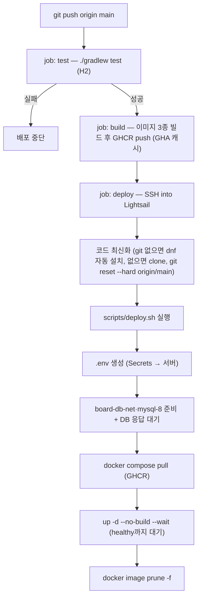

# GitHub Actions CI/CD — 파이프라인 요약 + Secret 설정

- **대상 파일**: `.github/workflows/deploy.yml`
- **한 줄 요약**: `main`에 push하면 → **테스트 통과 시** → **CI가 이미지 3종을 빌드해 GHCR(ghcr.io)에 push**하고 → Lightsail에 SSH로 접속해 **서버는 pull + 실행만**(`docker compose pull` + `up -d --no-build --wait`)으로 자동 재배포한다(무스왑 설계).
- **선행 세팅**: 서버 준비는 [[DEPLOY-LIGHTSAIL]], 컨테이너 구조는 [[DOCKER]].

---

## 1. 파이프라인 흐름



> [!NOTE]
> 워크플로(yml)는 "**언제·어디서**"(트리거·SSH 접속)만 담당하고, "**무엇을**"(배포 로직)은 저장소의 `scripts/deploy.sh` 가 담당한다. 로직이 셸 파일로 분리돼 있어 읽기 쉽고, 서버에서 직접 실행해 디버깅할 수도 있다.

- **세 잡(job)으로 나뉜다**: `test` → `build` → `deploy`. `needs:` 체인이라 **테스트가 깨지면 빌드도 배포도 되지 않는다**(CI 게이트).
- **빌드는 러너(RAM 7GB)에서, 서버는 pull + 실행만** — 2GB 인스턴스의 gradle/npm 빌드가 스왑/OOM 사고를 냈던 것을 GHCR 경유 구조로 해소한 무스왑 설계다.

---

## 2. `deploy.yml` 항목별 요약

| 블록 | 내용 | 왜 |
|---|---|---|
| `on.push.branches: [main]` | main push 시 자동 실행 | 배포 트리거 |
| `on.workflow_dispatch` | Actions 탭에서 수동 실행 | 코드 변경 없이 재배포 |
| `concurrency` | 겹치는 배포 취소 | 동시 배포 충돌 방지 |
| `job: test` | `checkout@v5` + `setup-java@v5`(JDK 21) + `./gradlew test` | 배포 전 품질 게이트(H2, 외부 의존 없음) |
| `job: build` (`needs: test`) | buildx + **GHA 레이어 캐시**(`cache-from/to: type=gha`)로 이미지 3종 빌드 → **GHCR push**. 인증은 내장 `GITHUB_TOKEN`(`permissions.packages: write`) | 러너(RAM 7GB)가 빌드를 전담 → 서버 빌드 부하 0 |
| `job: deploy` (`needs: build`) | `appleboy/ssh-action`으로 SSH 배포 | build 성공 후에만 실행 |
| `command_timeout: 10m` | 원격 스크립트 최대 실행 시간 | 빌드가 CI로 이관돼 서버는 pull+기동만 — 10분이면 충분 |
| `envs:` | 앱 비밀값 + `GHCR_USER`/`GHCR_TOKEN`을 원격 셸로 전달 | 로그 노출 없이 `.env` 생성·GHCR 로그인 |
| `script:` | (git 없으면 `sudo dnf install -y git`) → 코드 최신화(clone/`reset --hard origin/main`) → **`scripts/deploy.sh` 실행** | 워크플로는 접속만, 배포 로직은 셸 파일에 |
| `scripts/deploy.sh` | `.env` 작성 → `board-db-net`·`mysql-8` 준비 + DB 응답 대기 → **GHCR 로그인 → `docker compose pull` → `up -d --no-build --wait`** → logout → `prune` | 실제 재배포 로직(저장소에 버전관리·주석 포함). `--no-build`는 서버 빌드 금지의 안전핀 |
| `--wait` (compose) | healthcheck 있는 서비스 3종이 **healthy가 될 때까지 대기**, 실패 시 exit≠0 → 배포 실패 | 별도 검증 루프 없이 DB·백엔드·프론트 정상 여부를 compose가 판정 |

> [!NOTE]
> `board-db-net` 네트워크·`mysql-8` 컨테이너·저장소 클론은 **없으면 이 워크플로가 자동 생성**한다(있으면 그대로 사용). 유일하게 자동화하지 않는 전제는 **Docker 설치**뿐이다([[DEPLOY-LIGHTSAIL]] §4). 즉 Docker만 깔려 있으면 첫 push부터 배포가 완결된다.

---

## 3. 필요한 GitHub Secrets 목록

저장소 → **Settings → Secrets and variables → Actions → Secrets** 에 등록한다.

**필수(접속용):**

| Secret 이름 | 값 | 설명 |
|---|---|---|
| `LIGHTSAIL_HOST` | `3.34.173.34` | Lightsail 인스턴스 공인 고정 IP |
| `LIGHTSAIL_USER` | `ec2-user` | SSH 사용자(Amazon Linux 2023 기준) |
| `LIGHTSAIL_SSH_KEY` | 서버 SSH 개인키(`.pem`, 현재 `ls_server_key.pem`) **전체 내용** | SSH 개인키(아래 §4-2 주의) |

**필수(앱·DB용 — `.env`·mysql-8에 주입):**

| Secret 이름 | 값 | 설명 |
|---|---|---|
| `KAKAO_REST_API` | 카카오 REST API 키 | 기동 필수(fail-fast) |
| `KAKAO_SECRET` | 카카오 Client Secret | 기동 필수(fail-fast) |
| `GOOGLE_CLIENT_ID` | 구글 OAuth 클라이언트 ID | 소셜 로그인용 |
| `GOOGLE_CLIENT_SECRET` | 구글 OAuth Client Secret | 소셜 로그인용 |
| `DB_NAME` | `board` | 앱 DB명 + mysql-8 초기 DB |
| `DB_USERNAME` | `root` | 앱 DB 사용자 |
| `DB_PASSWORD` | `1234` | 앱 DB 비번 + mysql-8 root 비번 |

**선택(등록해도 무방하나 파이프라인은 사용 안 함):**

| Secret 이름 | 왜 미사용 |
|---|---|
| `DB_HOST` | compose가 컨테이너명 `mysql-8` 로 강제 주입 |
| `DB_PORT` | compose가 `3306` 으로 강제 |
| `APP_UPLOAD_DIR` | compose가 `/app/uploads` 로 강제(볼륨 마운트 지점) |

> [!NOTE]
> `deploy.yml` 은 Docker를 설치하지 않는다(서버에 미리 설치돼 있어야 함). 반면 git 설치와 `board-db-net` 네트워크·`mysql-8` 컨테이너·저장소 클론은 **없으면 스크립트가 자동 처리**한다(있으면 그대로 사용). 그래서 docker만 깔려 있으면 첫 push부터 배포가 완결된다.

> [!NOTE]
> **GHCR push·pull 인증은 워크플로 내장 `GITHUB_TOKEN`이 전담한다 — 추가 Secret 불필요.** 러너의 push는 `docker/login-action`이, 서버의 pull은 `deploy.sh`의 `docker login ghcr.io`(단명 토큰)가 같은 토큰으로 처리하며, 근거는 `permissions.packages: write`다.

---

## 4. Secret 등록 방법

### 4-1. 웹 UI (권장)

1. GitHub 저장소 페이지 → 상단 **Settings**
2. 좌측 메뉴 **Secrets and variables → Actions**
3. **New repository secret** 클릭
4. **Name** 에 위 표의 이름(예: `LIGHTSAIL_HOST`), **Secret** 에 값 입력 → **Add secret**
5. 7개 항목을 각각 반복

### 4-2. SSH 키(`LIGHTSAIL_SSH_KEY`) 등록 시 주의

서버 SSH 개인키(`.pem`, 현재 `ls_server_key.pem`) 파일을 **줄바꿈 포함 전체**를 그대로 붙여넣는다. 즉:

- 첫 줄인 `BEGIN ... PRIVATE KEY` 헤더 줄부터,
- 마지막 줄인 `END ... PRIVATE KEY` 푸터 줄까지,
- 그 사이 본문 전체를 **원래 줄바꿈 그대로** 포함해야 한다.

주의점:
- 헤더/푸터 줄을 빠뜨리거나 여러 줄을 한 줄로 합치면 SSH 인증이 실패한다.
- 이 키는 **절대 저장소에 커밋하지 않는다**(`.gitignore`의 `*.pem` 규칙으로 차단됨). Secret으로만 보관한다.
- 파일 내용을 그대로 넣으려면 아래 §4-3의 `gh secret set ... < ls_server_key.pem` 방식이 붙여넣기 실수를 피할 수 있어 더 안전하다.

### 4-3. CLI로 등록(선택)

`gh` CLI가 설치돼 있으면 파일/값으로 바로 넣을 수 있다:

```bash
gh secret set LIGHTSAIL_HOST --body "3.34.173.34"
gh secret set LIGHTSAIL_USER --body "ec2-user"
gh secret set LIGHTSAIL_SSH_KEY < ls_server_key.pem     # 서버 SSH 개인키(.pem) 내용을 그대로 주입(줄바꿈 보존)
gh secret set KAKAO_REST_API --body "<값>"
gh secret set KAKAO_SECRET --body "<값>"
gh secret set GOOGLE_CLIENT_ID --body "<값>"
gh secret set GOOGLE_CLIENT_SECRET --body "<값>"
```

### 4-4. 등록 확인

```bash
gh secret list        # 이름과 갱신 시각만 보인다(값은 다시 볼 수 없음)
```

- Secret 값은 **등록 후 다시 조회할 수 없다**(수정만 가능). 로그에도 자동 마스킹된다.

---

## 5. 배포 실행·확인

1. §3~§4로 Secret 7개 등록
2. 서버 준비 완료([[DEPLOY-LIGHTSAIL]] §1~§8)
3. `main`에 push(또는 Actions 탭에서 **Run workflow** 수동 실행)
4. 저장소 **Actions** 탭에서 `test → build → deploy` 진행 로그 확인
5. 성공 후 브라우저: `http://3.34.173.34` (React 메인, 80 — 포트 생략)

> [!TIP]
> 현재 작업은 `step13-reactions` 브랜치에 있다. 파이프라인은 `main` 기준이므로, 배포하려면 **main에 머지**하거나 `deploy.yml`의 트리거 브랜치와 스크립트의 `origin/main` 을 해당 브랜치로 바꾼다.

---

## 6. 트러블슈팅

| 증상 | 원인·해결 |
|---|---|
| `ssh: handshake failed` / `unable to authenticate` | `LIGHTSAIL_SSH_KEY` 붙여넣기 오류(§4-2), 또는 `LIGHTSAIL_USER` 불일치 |
| deploy 스크립트 `permission denied ... docker.sock` | 서버에서 `usermod -aG docker` 미적용([[DEPLOY-LIGHTSAIL]] §4) |
| 앱 기동 실패(카카오 IllegalState) | `KAKAO_*` Secret 누락·오타 → `.env`가 빈 값으로 생성됨 |
| test 잡 실패로 배포 안 됨 | 테스트가 실제로 깨진 것 → 로컬 `./gradlew test`로 재현·수정 |
| 접속은 되나 80 응답 없음 | Lightsail 방화벽에 80 미개방([[DEPLOY-LIGHTSAIL]] §2) |
| `Run Command Timeout`으로 deploy 중단 | 빌드가 CI로 이관돼 `command_timeout: 10m`이면 충분하다(pull+기동만). 초과한다면 서버 네트워크 또는 GHCR 응답 지연을 확인 |
| 배포 중 서버 전체 무응답(80·22 모두) | 서버 빌드 시절의 메모리 고갈 사고 — 빌드 이관(무스왑 전환)으로 소멸한 이력이다 |
| GHCR pull 실패(unauthorized·denied) | 워크플로 `permissions.packages: write` 누락, 또는 서버 `docker login ghcr.io`(단명 `GITHUB_TOKEN`) 실패 → Actions 로그에서 로그인 단계 확인 |
