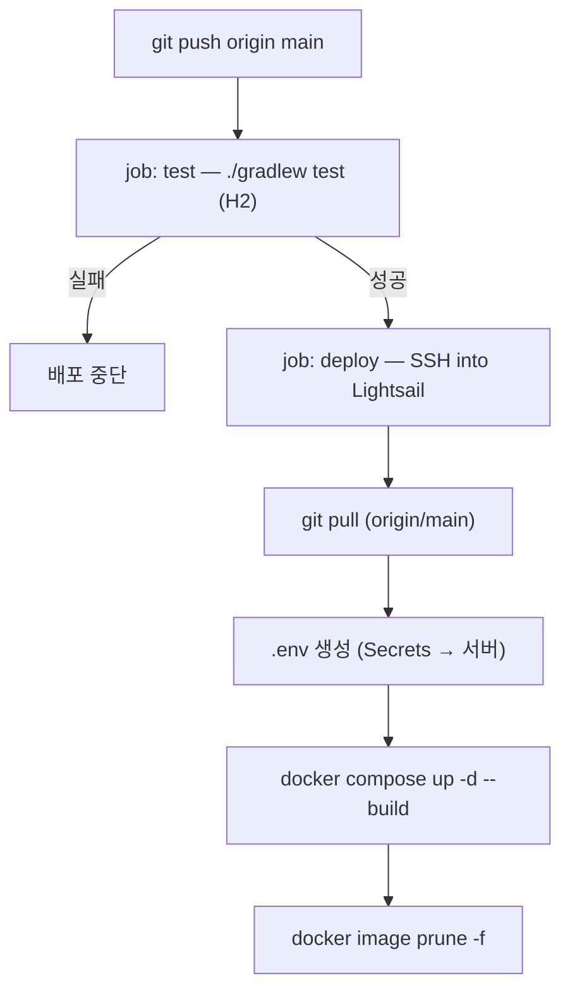

# GitHub Actions CI/CD — 파이프라인 요약 + Secret 설정

- **대상 파일**: `.github/workflows/deploy.yml`
- **한 줄 요약**: `main`에 push하면 → **테스트 통과 시** → Lightsail에 SSH로 접속해 **`git pull` + `docker compose up --build`** 로 자동 재배포한다.
- **선행 세팅**: 서버 준비는 [[DEPLOY-LIGHTSAIL]], 컨테이너 구조는 [[DOCKER]].

---

## 1. 파이프라인 흐름



- **두 잡(job)으로 나뉜다**: `test` → `deploy`. `deploy`는 `needs: test`라 **테스트가 깨지면 배포되지 않는다**(CI 게이트).
- **레지스트리 없이 서버에서 직접 빌드**한다 — "로컬 방식 그대로"를 원격에서 실행하는 구조.

---

## 2. `deploy.yml` 항목별 요약

| 블록 | 내용 | 왜 |
|---|---|---|
| `on.push.branches: [main]` | main push 시 자동 실행 | 배포 트리거 |
| `on.workflow_dispatch` | Actions 탭에서 수동 실행 | 코드 변경 없이 재배포 |
| `concurrency` | 겹치는 배포 취소 | 동시 배포 충돌 방지 |
| `job: test` | JDK 21 + `./gradlew test` | 배포 전 품질 게이트(H2, 외부 의존 없음) |
| `job: deploy` (`needs: test`) | `appleboy/ssh-action`으로 SSH 배포 | test 성공 후에만 실행 |
| `envs:` | 앱 비밀값을 원격 셸로 전달 | 로그 노출 없이 `.env` 생성 |
| `script:` | `git reset --hard origin/main` → `.env` 작성 → `compose up --build` → `prune` | 실제 재배포 로직 |

> [!NOTE]
> `mysql-8` 컨테이너와 `board-db-net` 네트워크는 이 워크플로가 만들지 않는다. 서버 최초 세팅([[DEPLOY-LIGHTSAIL]] §5)에서 준비돼 있어야 한다. 파이프라인은 "앱·프론트의 재배포"만 담당한다.

---

## 3. 필요한 GitHub Secrets 목록

저장소 → **Settings → Secrets and variables → Actions → Secrets** 에 아래 7개를 등록한다.

| Secret 이름 | 값 | 설명 |
|---|---|---|
| `LIGHTSAIL_HOST` | `3.34.173.34` | Lightsail 인스턴스 공인 IP |
| `LIGHTSAIL_USER` | `ubuntu` | SSH 사용자(Ubuntu 블루프린트 기준) |
| `LIGHTSAIL_SSH_KEY` | `webserver_key.pem` **전체 내용** | SSH 개인키(아래 §4-2 주의) |
| `KAKAO_REST_API` | 카카오 REST API 키 | 앱 `.env` 주입(기동 필수) |
| `KAKAO_SECRET` | 카카오 Client Secret | 앱 `.env` 주입(기동 필수) |
| `GOOGLE_CLIENT_ID` | 구글 OAuth 클라이언트 ID | 앱 `.env` 주입 |
| `GOOGLE_CLIENT_SECRET` | 구글 OAuth Client Secret | 앱 `.env` 주입 |

- **DB 접속값(root/1234, board)** 은 Secret이 아니라 compose 기본값·서버의 mysql-8 설정으로 처리한다(강의용). 운영에선 `DB_PASSWORD`도 Secret으로 빼는 것을 권장.

---

## 4. Secret 등록 방법

### 4-1. 웹 UI (권장)

1. GitHub 저장소 페이지 → 상단 **Settings**
2. 좌측 메뉴 **Secrets and variables → Actions**
3. **New repository secret** 클릭
4. **Name** 에 위 표의 이름(예: `LIGHTSAIL_HOST`), **Secret** 에 값 입력 → **Add secret**
5. 7개 항목을 각각 반복

### 4-2. SSH 키(`LIGHTSAIL_SSH_KEY`) 등록 시 주의

`webserver_key.pem` 파일을 **줄바꿈 포함 전체**를 그대로 붙여넣는다. 즉:

- 첫 줄인 `BEGIN ... PRIVATE KEY` 헤더 줄부터,
- 마지막 줄인 `END ... PRIVATE KEY` 푸터 줄까지,
- 그 사이 본문 전체를 **원래 줄바꿈 그대로** 포함해야 한다.

주의점:
- 헤더/푸터 줄을 빠뜨리거나 여러 줄을 한 줄로 합치면 SSH 인증이 실패한다.
- 이 키는 **절대 저장소에 커밋하지 않는다**(`.gitignore`의 `*.pem` 규칙으로 차단됨). Secret으로만 보관한다.
- 파일 내용을 그대로 넣으려면 아래 §4-3의 `gh secret set ... < webserver_key.pem` 방식이 붙여넣기 실수를 피할 수 있어 더 안전하다.

### 4-3. CLI로 등록(선택)

`gh` CLI가 설치돼 있으면 파일/값으로 바로 넣을 수 있다:

```bash
gh secret set LIGHTSAIL_HOST --body "3.34.173.34"
gh secret set LIGHTSAIL_USER --body "ubuntu"
gh secret set LIGHTSAIL_SSH_KEY < webserver_key.pem     # 파일 내용을 그대로 주입(줄바꿈 보존)
gh secret set KAKAO_REST_API --body "<값>"
gh secret set KAKAO_SECRET --body "<값>"
gh secret set GOOGLE_CLIENT_ID --body "<값>"
gh secret set GOOGLE_CLIENT_SECRET --body "<값>"
```

### 4-4. 등록 확인

```bash
gh secret list        # 이름과 갱신 시각만 보인다(값은 다시 볼 수 없음)
```

- Secret 값은 **등록 후 다시 조회할 수 없다**(수정만 가능). 로그에도 자동 마스킹된다.

---

## 5. 배포 실행·확인

1. §3~§4로 Secret 7개 등록
2. 서버 준비 완료([[DEPLOY-LIGHTSAIL]] §1~§8)
3. `main`에 push(또는 Actions 탭에서 **Run workflow** 수동 실행)
4. 저장소 **Actions** 탭에서 `test → deploy` 진행 로그 확인
5. 성공 후 브라우저: `http://3.34.173.34:8070`, `http://3.34.173.34:8071`

> [!TIP]
> 현재 작업은 `step13-reactions` 브랜치에 있다. 파이프라인은 `main` 기준이므로, 배포하려면 **main에 머지**하거나 `deploy.yml`의 트리거 브랜치와 스크립트의 `origin/main` 을 해당 브랜치로 바꾼다.

---

## 6. 트러블슈팅

| 증상 | 원인·해결 |
|---|---|
| `ssh: handshake failed` / `unable to authenticate` | `LIGHTSAIL_SSH_KEY` 붙여넣기 오류(§4-2), 또는 `LIGHTSAIL_USER` 불일치 |
| deploy 스크립트 `permission denied ... docker.sock` | 서버에서 `usermod -aG docker` 미적용([[DEPLOY-LIGHTSAIL]] §4) |
| 앱 기동 실패(카카오 IllegalState) | `KAKAO_*` Secret 누락·오타 → `.env`가 빈 값으로 생성됨 |
| test 잡 실패로 배포 안 됨 | 테스트가 실제로 깨진 것 → 로컬 `./gradlew test`로 재현·수정 |
| 접속은 되나 8070/8071 응답 없음 | Lightsail 방화벽 포트 미개방([[DEPLOY-LIGHTSAIL]] §2) |
