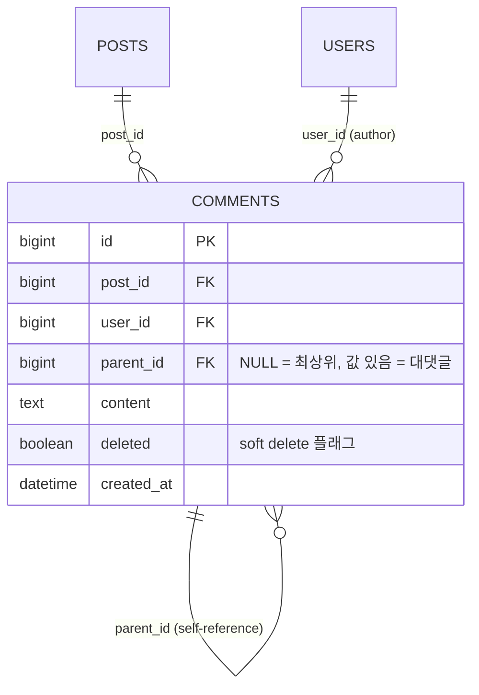
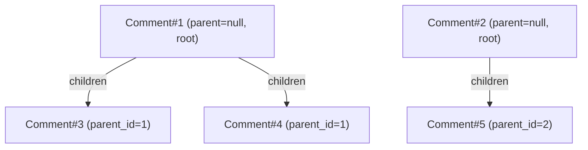
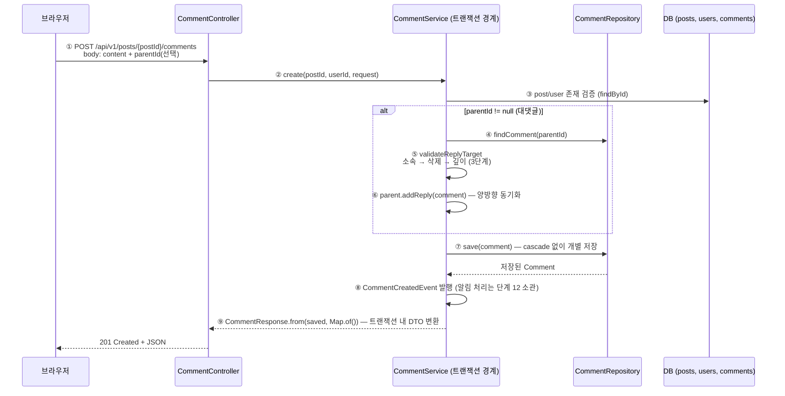

# 댓글 + 대댓글(1단계) — 자기참조 연관과 soft delete (단계 11)

- **과정명**: 강의용 Spring Boot 게시판 — 단계 11 (댓글/대댓글)
- **대상**: 단계 10(파일 업로드)까지 마친 수강생 — 여기서부터는 파일 이야기가 잠시 멈추고, 도메인 모델링에서 **한 엔티티가 자기 자신을 참조**하는 계층 구조와 그 위에 얹는 정책(1단계 깊이·soft delete)을 다룬다
- **브랜치**: `step11-comments`
- **관련 코드**: `comment/Comment`(신규 — parent 자기참조 + children + soft delete), `comment/CommentRepository`(신규), `comment/CommentService`(신규 — 4개 유스케이스 + `validateReplyTarget` 3단계 검증), `comment/CommentSecurity`(신규 — `PostSecurity` 패턴 복제), `comment/CommentController`(신규 — 4 엔드포인트), `comment/dto/*`(3개 record), `global/exception/ErrorCode`(댓글 관련 5개 코드), `application.yaml`(`default_batch_fetch_size`), `global/config/SecurityConfig`(GET /posts/** 규칙이 댓글 조회까지 포함)
- **선수 지식**: [METHOD-SECURITY.md](METHOD-SECURITY.md) — `@PreAuthorize` + SpEL로 커스텀 빈(`@postSecurity.isAuthor`) 호출, [FILE-UPLOAD.md](FILE-UPLOAD.md) §6 — 컬렉션 페이징의 함정(`MultipleBagFetchException`/메모리 페이징)과 `@BatchSize`로 우회
- **검증 상태**: `CommentServiceTest` 11 케이스 신규 + 전체 107개 green (2026-07-25, commit `cd0031c`)

---

## 한눈에 보기 — 3분 요약

바쁘면 이 섹션만 읽어도 된다. 상세는 §1부터.

**무엇을 만들었나**: 게시글에 **댓글**을 달고, 댓글에 **대댓글(1단계)**을 달 수 있다. 원댓글을 지워도 대화 트리가 끊기지 않도록 **soft delete**(플래그만 세우고 내용 마스킹)를 쓴다. 조회는 최상위 댓글만 페이징하고 각 원댓글의 대댓글은 nested 배열로 함께 실어 보낸다. 인가(작성자만 수정/삭제)는 단계 6에서 만든 메서드 보안 패턴(`@PreAuthorize` + 커스텀 빈)을 그대로 복제.

**구현 지점 — 딱 5곳**:

| 층위 | 파일 | 역할 |
|------|------|------|
| 도메인 | `Comment` | `@ManyToOne parent` 자기참조 + `@OneToMany children`(양방향), `@OrderBy("createdAt asc")` + `@BatchSize(100)`, `deleted` 플래그, `isRoot`/`isReply`/`addReply` |
| 서비스 | `CommentService` | `create`에 `validateReplyTarget`(소속→삭제→깊이 3단계 검증), `delete`는 `softDelete` 호출, `update`는 삭제된 댓글 거부 |
| 조회 | `CommentRepository` | `findByPostIdAndParentIsNull` — 최상위만 페이징 + `@EntityGraph(author)`, `findAuthorIdById` — 인가용 가벼운 조회 |
| 응답 | `CommentResponse.from` | soft delete 마스킹("삭제된 댓글입니다"), `deleted` 필드는 그대로 노출, `isRoot` 가드로 대댓글의 children 접근 안 함 |
| 인가·설정 | `CommentSecurity` + `CommentController(@PreAuthorize)` + `application.yaml(default_batch_fetch_size: 100)` | `PostSecurity` 패턴 복제 + 대댓글의 author까지 IN 쿼리 배치 |

**자기참조 데이터 모델** — 하나의 `comments` 테이블 안에서 `parent_id` FK로 계층을 표현:



**같은 게시글의 댓글 트리 — 인스턴스 관계** (원댓글 2개, 대댓글 3개):



**댓글/대댓글 작성 처리 시퀀스**:



> [!NOTE]
> ⑧·⑨는 단계 11 이후 확장된 부분이다. **알림 이벤트(⑧)**는 단계 12에서 도입됐다 — 댓글 저장 후 `CommentCreatedEvent`를 발행하기만 하고, 대상 결정/자기 자신 스킵은 리스너가 맡는다(상세는 [[NOTIFICATION]] 참조). **반응 파라미터(⑨의 `from` 2번째 인자)**는 단계 13([[REACTION]])에서 추가됐다(작성 직후엔 반응이 없어 `Map.of()`). 단계 11의 원형은 "save → DTO 변환 → 201"이며, 아래 스니펫은 최종 코드 기준이다.

**핵심 한 줄**: **엔티티는 구조만, 정책은 서비스가** — 자기참조 컬럼(`parent_id`)은 임의 깊이의 트리를 구조적으로 허용하지만, 이 프로젝트의 1단계 깊이 규칙은 `CommentService.validateReplyTarget`이 강제한다.

---

## 학습 목표

이 문서를 끝내면 수강생은:

- **자기참조 연관**(self-referencing association)의 실제 매핑(`@ManyToOne parent` + `@OneToMany children` 양방향)과 그것이 계층을 표현하는 방식을 설명할 수 있다
- 1단계 깊이 같은 **불변식을 데이터가 아니라 서비스에 두는 이유**와, 그것이 race condition에도 안전한 이유를 안다
- **soft delete**를 언제 왜 쓰는지, 마스킹은 어느 계층에서 하는지, cascade/orphanRemoval을 왜 걸지 않았는지 구분할 수 있다
- 컬렉션 페이징의 함정을 피하기 위한 **"최상위만 페이징 + 대댓글은 배치 로딩"** 조합을 안다
- `@BatchSize`와 전역 `default_batch_fetch_size` 각각의 역할과, 그것이 대댓글의 author 같은 **2차 LAZY 접근**까지 어떻게 IN 쿼리로 묶는지 설명할 수 있다
- 단계 6의 메서드 보안(`@PreAuthorize` + 커스텀 빈) 패턴이 다른 도메인에도 그대로 복제되는 것을 코드로 확인한다

---

## 코드 작성 순서 — 무엇을 먼저 짜는가

원칙은 단계 10에서와 같다: **의존의 역방향** — 남이 의존하는 밑바닥 부품(엔티티·에러코드)을 먼저 만들고, 그것을 조립하는 서비스·컨트롤러를 나중에, 노출(인가·SecurityConfig 연결)과 테스트를 맨 끝에 둔다.

| 순서 | 파일 | 이 시점에 하는 일 | 왜 이 순서인가 |
|------|------|-----------------|--------------|
| 1 | `ErrorCode.java` | 댓글 관련 5개 코드(`COMMENT_NOT_FOUND`, `CANNOT_REPLY_TO_REPLY`, `CANNOT_REPLY_TO_DELETED`, `CANNOT_EDIT_DELETED`, `COMMENT_POST_MISMATCH`) 추가 | 서비스 검증에서 던질 예외의 목록. 코드 없이 먼저 확정하면 검증 로직 짤 때 즉시 참조 가능 |
| 2 | `comment/Comment.java` (신규) | 자기참조 엔티티 + `@BatchSize` + `addReply`/`softDelete`/`isRoot`/`isReply`/`isAuthor` | 도메인 최하위 부품 — 아무것도 의존하지 않음 |
| 3 | `comment/dto/CommentCreateRequest.java`, `CommentUpdateRequest.java` (신규) | 요청 record — `parentId`로 대댓글 여부 구분 | 서비스 시그니처에 필요 |
| 4 | `comment/dto/CommentResponse.java` (신규) | 응답 record — soft delete 마스킹 + `isRoot` 가드로 children | 서비스 반환 타입 |
| 5 | `comment/CommentRepository.java` (신규) | `findByPostIdAndParentIsNull` + `findAuthorIdById` | 서비스와 인가 빈이 함께 의존 |
| 6 | `comment/CommentService.java` (신규) | 4개 유스케이스 + `validateReplyTarget` 3단계 | 2~5 부품을 조립하는 핵심 |
| 7 | `comment/CommentSecurity.java` (신규) | `@commentSecurity.isAuthor` — `PostSecurity` 복제 | 컨트롤러의 `@PreAuthorize`가 참조 |
| 8 | `comment/CommentController.java` (신규) | 4개 엔드포인트 + `@PreAuthorize` 2곳 | 6·7을 호출하는 최상위 진입점 |
| 9 | `application.yaml` | `default_batch_fetch_size: 100` 추가 | 대댓글의 author 같은 2차 LAZY까지 IN 쿼리 배치 |
| 10 | `SecurityConfig.java` | 코드 변경 없음 — 기존 `GET /api/v1/posts/**` permitAll이 댓글 조회를 이미 포함(주석만 보강) | 이 단계에서 URL 인가 규칙 자체는 새로 없다 |
| 11 | `test/comment/CommentServiceTest.java` (신규, 11 케이스) | create/reply/삭제된 댓글에 답글/대댓글에 답글/soft delete/조회/인가 시나리오 | 완성된 동작 고정 |

> [!TIP]
> 큰 덩어리로 보면 **① 에러 코드(1) → ② 엔티티·DTO(2·3·4) → ③ 조회 계층(5) → ④ 조립(6) → ⑤ 인가·노출(7·8) → ⑥ 설정·테스트(9·11)**. 이번 단계는 도메인 하나가 완결되는 구조라 파일이 대부분 신규다 — 그래서 SecurityConfig에는 손댈 필요가 없다(주석만 갱신).

---

## 1. 자기참조 연관 — 왜 별도 Reply 테이블이 아닌가

댓글에 대댓글을 붙이는 두 가지 접근이 있다:

| 방식 | 스키마 | 특징 |
|------|--------|------|
| 별도 테이블(`replies`) | comments + replies(comment_id FK) | 두 테이블 조인 필요 · 3단계 이상 확장 시 테이블이 계속 늘어남 · 원댓글과 대댓글이 다른 타입 |
| **자기참조(선택)** | comments 하나 + `parent_id` FK(nullable) | 한 테이블에서 임의 깊이 트리 표현 · 원댓글/대댓글이 **같은 타입** · 정책은 데이터가 아니라 코드로 |

우리는 후자를 택했다. 근거는 **"같은 것은 같게 다뤄라"** — 원댓글과 대댓글은 본질이 같다(글쓴이·내용·시각·수정·삭제 규칙). 다른 것은 오직 "무엇의 하위인가" 하나다. 그렇다면 타입도 하나여야 한다.

**매핑** (`Comment.java`) — `parent`가 null이면 최상위, 값이 있으면 대댓글:

```java
// 자기참조. 최상위 댓글이면 null, 대댓글이면 부모 댓글을 가리킨다.
@ManyToOne(fetch = FetchType.LAZY)
@JoinColumn(name = "parent_id")
private Comment parent;

// 대댓글 컬렉션. 최상위 댓글만 페이징 조회하고(findByPostIdAndParentIsNull),
// 각 원댓글의 children은 @BatchSize로 여러 부모의 것을 IN 쿼리 한 번에 로딩해 N+1을 완화한다.
@OneToMany(mappedBy = "parent")
@OrderBy("createdAt asc")
@BatchSize(size = 100)
private List<Comment> children = new ArrayList<>();
```

포인트 몇 개:

- **양방향** — 소유 쪽은 `parent`(FK 컬럼을 가진 쪽), 반대쪽은 `mappedBy = "parent"`인 `children`. 응답 DTO가 `children`을 읽어야 하므로 양방향이 필요하다.
- **`@JoinColumn(name = "parent_id")`에 `nullable` 지정 없음** — 기본 nullable=true라 최상위 댓글의 FK는 NULL이 된다. 이것이 "1단계"의 데이터 표현.
- **`@OrderBy("createdAt asc")`** — 응답에서 대댓글은 오래된 순으로 나열. DB `ORDER BY`가 아니라 컬렉션 로딩 시 정렬돼 들어온다.
- **`fetch = LAZY`** — 부모 조회에 자식이 딸려 오지 않는다. 필요한 지점에서만(응답 변환) 로딩되고, 그때 `@BatchSize`가 여러 부모의 것을 IN 한 번으로 묶는다(§4).
- **cascade/orphanRemoval 없음** — 의도적. 원댓글 soft delete 시 대댓글이 함께 삭제되면 트리가 무너지기 때문(§3).

**양방향 편의 메서드** — 양쪽 상태를 한 번에 맞춘다:

```java
// 양방향 편의 메서드 — 부모의 children 컬렉션 추가와 자식의 parent 세팅을 한 번에 처리한다.
// 깊이 제한/삭제/소속 검증은 서비스가 수행한 뒤 호출한다.
// 같은 트랜잭션 안에서 원댓글을 다시 조회해 children을 읽어도 방금 단 대댓글이 보이도록 메모리 상태를 맞춘다.
public void addReply(Comment reply) {
  children.add(reply);
  reply.parent = this;
}
```

주석에도 있듯 `children.add(...)`와 `reply.parent = this`를 **둘 다** 해야 한다. 한쪽만 하면 DB에는 잘 저장되지만(FK는 `parent` 필드가 결정) 같은 트랜잭션 내 `parent.getChildren()`이 방금 단 대댓글을 보지 못한다.

> [!IMPORTANT]
> 자기참조는 "임의 깊이의 트리"를 **구조적으로 허용**한다. 즉 스키마 자체는 대댓글의 대댓글, 그 대댓글의 대댓글도 표현할 수 있다. **1단계 깊이는 엔티티의 능력이 아니라 서비스의 정책**이다(§2).

---

## 2. 1단계 불변식 강제 — 데이터가 아니라 서비스에서

"1단계 대댓글"의 규칙은 하나: **대댓글에는 다시 답글을 달 수 없다.** 즉 `parent`의 `parent`가 있으면 안 된다. 이 규칙을 어디에 두느냐가 이 단계의 핵심 설계 결정이다.

**대안 — DB 제약** — 예를 들어 CHECK 제약이나 트리거로 `parent_id`가 가리키는 행의 `parent_id`가 NULL이어야 한다는 규칙을 걸 수도 있다. 하지만:

- 표준 SQL로 자기참조 CHECK 표현이 복잡하고 DBMS별 지원이 갈린다
- 규칙이 바뀌면(예: 2단계 허용) 마이그레이션 부담이 크다
- 위반 시 나오는 예외가 SQL 예외라 사용자 응답으로 번역하기 어렵다

**선택 — 서비스 검증**. `CommentService.create`가 대댓글 생성 요청을 받으면 부모 후보를 검증한다:

```java
@Transactional
public CommentResponse create(Long postId, Long loginUserId, CommentCreateRequest request) {
  Post post = postRepository.findById(postId)
      .orElseThrow(() -> new NotFoundException(ErrorCode.POST_NOT_FOUND));
  User author = userRepository.findById(loginUserId)
      .orElseThrow(() -> new NotFoundException(ErrorCode.USER_NOT_FOUND));

  Comment comment = new Comment(post, author, request.content());
  if (request.parentId() != null) {
    Comment parent = findComment(request.parentId());
    validateReplyTarget(parent, postId);
    parent.addReply(comment);
  }

  Comment saved = commentRepository.save(comment);

  // 단계 12: 댓글 저장 후 CommentCreatedEvent를 발행한다(상세는 [[NOTIFICATION]] 참조).
  eventPublisher.publishEvent(new CommentCreatedEvent(
      saved.getId(), postId, request.parentId(), loginUserId));

  // 단계 13: 방금 만든 댓글은 반응이 없으므로 빈 맵을 넘긴다([[REACTION]]).
  return CommentResponse.from(saved, Map.of());
}

// 1단계 깊이 불변식과 삭제/소속 검증을 한곳에 모은다. 순서: 소속 → 삭제 → 깊이.
private void validateReplyTarget(Comment parent, Long postId) {
  if (!parent.getPost().getId().equals(postId)) {
    throw new BusinessException(ErrorCode.COMMENT_POST_MISMATCH);
  }
  if (parent.isDeleted()) {
    throw new BusinessException(ErrorCode.CANNOT_REPLY_TO_DELETED);
  }
  // 대댓글에 다시 답글을 다는 것을 금지 → 트리 깊이를 1단계로 강제
  if (parent.isReply()) {
    throw new BusinessException(ErrorCode.CANNOT_REPLY_TO_REPLY);
  }
}
```

> [!NOTE]
> 이 스니펫은 최종 코드 기준이라 단계 11 범위 밖의 두 줄이 섞여 있다. **이벤트 발행**(`eventPublisher.publishEvent(...)`)은 단계 12에서, **`from`의 2번째 인자**(반응 맵)는 단계 13에서 붙었다. 단계 11의 핵심은 그 사이의 검증 흐름(`validateReplyTarget`)이며, 이벤트/반응은 이후 단계에서 "저장 후" 지점에 얹힌 확장이다. `CommentService`는 이를 위해 `ApplicationEventPublisher`와 `ReactionService`를 주입받는다.

**검증 순서가 소속 → 삭제 → 깊이인 이유**:

| 순번 | 검증 | 던지는 에러 | 왜 이 순서 |
|------|------|------------|------------|
| ① | 부모 댓글의 `post_id`가 URL의 `postId`와 일치 | `COMMENT_POST_MISMATCH` (400) | 다른 게시글의 댓글에 답글 다는 요청을 먼저 차단 — 다른 검증을 통과할 이유가 없다 |
| ② | 부모가 soft delete 상태가 아님 | `CANNOT_REPLY_TO_DELETED` (400) | 삭제된 댓글에 답글은 정책상 금지. 깊이 검증보다 앞 — "삭제된 원댓글"인지 "삭제된 대댓글"인지 나눌 필요가 없어 응답 메시지가 명확 |
| ③ | 부모가 대댓글이 아님(`parent.isReply() == false`) | `CANNOT_REPLY_TO_REPLY` (400) | 1단계 깊이 불변식. 앞의 검증을 모두 통과했을 때만 도달 |

**race condition에도 안전한 이유** — "그럼 여러 요청이 동시에 대댓글의 대댓글을 만들려 하면 뚫리지 않나?"를 걱정할 필요가 없다. 대댓글 = `parent_id`가 NOT NULL인 행이고, 대댓글의 대댓글 = "`parent_id`가 (`parent_id`가 NOT NULL인 행)을 가리키는 행"이다. **입력으로 들어오는 `parentId`는 이미 존재하는 특정 행 하나**이고, 그 행의 `parent_id` 값은 트랜잭션과 무관하게 확정돼 있다(대댓글이 원댓글로 승격되는 일은 없다). 즉:

- 원댓글 → 대댓글: 원댓글의 `parent_id`는 영원히 NULL이므로 `isReply() == false` — 통과
- 대댓글 → (대)대댓글: 대댓글의 `parent_id`는 영원히 NOT NULL이므로 `isReply() == true` — 차단

이 검증은 **부모 행의 불변 속성 하나에만 의존**하므로 낙관적/비관적 락 없이도 확정적이다. DB 제약을 걸지 않아도 race로 뚫릴 여지가 없다.

> [!IMPORTANT]
> 엔티티는 **구조**를(자기참조), 서비스는 **정책**을(1단계 깊이·삭제된 댓글에 답글 금지·소속 검증). 이 분리 덕분에 정책이 바뀔 때 엔티티/스키마는 그대로 두고 `validateReplyTarget` 하나만 수정한다.

---

## 3. soft delete — 왜 물리 삭제가 아닌가

댓글 삭제에는 함정이 하나 있다. **대댓글이 달린 원댓글을 물리 삭제하면 대화 트리가 끊긴다.** 사용자 관점에서 "A의 댓글에 B가 답한 대화"였는데 A가 삭제되면 B의 답글이 허공에 뜨거나(고아), 함께 삭제돼 B의 발언이 사라진다. 어느 쪽이든 나쁘다.

해법은 **soft delete** — 실제 row는 남기고 `deleted` 플래그만 세우고, 응답 시 내용만 마스킹한다. 트리 구조는 그대로 유지되고, "삭제된 댓글입니다"라는 표시로 자리를 지킨다.

**엔티티** — 플래그 필드 하나 + 상태 전이 메서드:

```java
// soft delete: 대댓글이 달린 원댓글을 물리 삭제하면 트리가 끊기므로, 삭제 표시만 하고 내용을 마스킹한다.
@Column(nullable = false)
private boolean deleted;

// ...

public void softDelete() {
  this.deleted = true;
}
```

**서비스** — `delete`는 물리 삭제 대신 상태 전이:

```java
// 대댓글이 달린 원댓글을 물리 삭제하면 트리가 끊기므로 soft delete로 표시만 한다(내용은 응답에서 마스킹).
@Transactional
public void delete(Long id) {
  Comment comment = findComment(id);
  comment.softDelete();
}
```

`commentRepository.delete(comment)`가 아니라 상태만 바꾼다. dirty checking으로 UPDATE 하나 발행된다.

**응답 마스킹** — 마스킹은 응답 DTO에서만 한다(엔티티는 원본 그대로 보관):

```java
// soft delete된 댓글의 실제 내용은 노출하지 않도록 마스킹한다(트리 유지 목적상 행은 남기되 내용만 감춤).
private static final String DELETED_CONTENT = "삭제된 댓글입니다";

public static CommentResponse from(Comment comment, Map<Long, CommentReactionSummary> reactions) {
  // ...
  return new CommentResponse(
      comment.getId(),
      comment.getAuthor().getUsername(),
      comment.isDeleted() ? DELETED_CONTENT : comment.getContent(),
      comment.isDeleted(),
      summary.likeCount(),      // 단계 13에서 추가된 반응 필드
      summary.dislikeCount(),   // 단계 13
      summary.myReaction(),     // 단계 13
      comment.getCreatedAt(),
      children);
}
```

> [!NOTE]
> 마스킹은 단계 11의 주제지만, 위 `from`의 **시그니처(2번째 인자 `reactions`)와 `likeCount`/`dislikeCount`/`myReaction` 3개 필드는 단계 13([[REACTION]])에서 추가**됐다. 단계 11의 응답 레코드는 `(id, authorUsername, content, deleted, createdAt, children)` 6필드였고, 단계 13에서 반응 3필드가 그 사이에 끼어 총 9필드가 됐다. 마스킹 로직(`isDeleted() ? DELETED_CONTENT : ...`) 자체는 단계 11 그대로다.

**두 가지 설계 결정**:

- **`deleted` 필드를 응답에 노출** — 프론트가 "삭제됨" 스타일(회색·이탤릭 등)로 처리할 수 있게 플래그를 그대로 준다. 마스킹된 문자열 매칭 같은 취약한 방식을 강제하지 않는다.
- **content는 마스킹 문자열로 대체** — 원본은 절대 흘리지 않는다. 프론트에서 `deleted=true`를 무시해도 원본이 노출되지 않도록 서버가 최후 방어선.

**수정도 삭제 상태에서는 금지** — soft delete된 댓글에 다시 내용을 채우는 것은 삭제 개념과 모순:

```java
@Transactional
public CommentResponse update(Long id, Long viewerId, CommentUpdateRequest request) {
  Comment comment = findComment(id);
  if (comment.isDeleted()) {
    throw new BusinessException(ErrorCode.CANNOT_EDIT_DELETED);
  }
  comment.update(request.content());
  // 단계 13: 수정은 반응을 바꾸지 않지만 응답 스키마가 반응을 노출하므로 현재 값을 조회해 채운다.
  var reactions = reactionService.getCommentReactions(List.of(comment.getId()), viewerId);
  return CommentResponse.from(comment, reactions);
}
```

> [!NOTE]
> 단계 11의 `update`는 `update(Long id, CommentUpdateRequest request)` — 삭제 상태 검증 후 내용만 바꿨다. `viewerId` 파라미터와 마지막 두 줄(반응 조회·주입)은 단계 13([[REACTION]])에서 추가됐다. 삭제된 댓글 수정을 막는 `CANNOT_EDIT_DELETED` 로직이 이 절의 핵심이다.

같은 이유로 **삭제된 댓글에 답글 달기도 금지** — `validateReplyTarget`의 두 번째 검증(§2).

**cascade/orphanRemoval을 안 건 이유** — `Comment.children`에 `cascade = ALL`이나 `orphanRemoval = true`를 붙이면 원댓글 삭제 시 대댓글이 함께 삭제된다. 우리는 그것을 원치 않으므로 **의도적으로 걸지 않았다**. 물리 삭제가 없기 때문에(soft delete만) orphan이 생길 여지 자체도 없다.

| 상황 | 물리 삭제(순진한 구현) | soft delete(선택) |
|------|----------------------|------------------|
| 원댓글 삭제, 대댓글 있음 | 대댓글이 orphan이 되거나 cascade로 함께 사라짐 | 원댓글 자리에 "삭제된 댓글입니다" 표시, 대댓글은 그대로 |
| 원댓글 삭제, 대댓글 없음 | row 사라짐 | row 유지, 응답에서만 마스킹 |
| 대댓글 삭제 | row 사라짐 | row 유지, 응답에서만 마스킹 |
| 삭제된 댓글에 답글 시도 | (원댓글이 없어서 404) | `CANNOT_REPLY_TO_DELETED` 400 |
| 삭제된 댓글 수정 시도 | (원댓글이 없어서 404) | `CANNOT_EDIT_DELETED` 400 |

> [!NOTE]
> **트레이드오프 명시**: soft delete는 삭제된 행이 물리적으로 계속 쌓인다. 이 단계 범위에서는 감수하는 결정이다 — 게시판 도메인에서 댓글 삭제 볼륨이 문제될 만큼 크지 않다. 정말 삭제해야 한다면(예: GDPR 준수) 별도 **하드 삭제 잡**을 두고 "대댓글이 하나도 없는 삭제된 원댓글"을 주기적으로 정리하는 방식이 자연스럽다.

---

## 4. 조회 — 최상위 페이징 + 대댓글 nested, N+1 함정

"게시글 상세 화면에서 댓글을 어떻게 로딩할 것인가"는 겉보기보다 결정할 게 많다. 요구사항을 정리:

1. **최상위 댓글만** 페이지네이션한다 (대댓글은 부모 아래 nested)
2. 각 원댓글에는 그 대댓글이 **전부** 함께 실려 온다
3. 각 댓글에는 작성자 이름(`author.username`)이 필요하다

가장 순진한 시도는 "그냥 컬렉션까지 fetch join하면 되지 않나?"다. 이 유혹의 결말은 단계 10 §6에서 이미 봤다:

| 순진한 시도 | 결과 |
|-------------|------|
| `@Query("select c from Comment c left join fetch c.children ...")` + `Page` | Hibernate가 **메모리 페이징**으로 fallback — 전체 결과를 로딩한 뒤 잘라내므로 페이지 크기와 무관하게 항상 전체를 읽음 |
| 컬렉션 여러 개(`children` + `post.images`)를 동시에 fetch join | `MultipleBagFetchException` |

그래서 **"최상위만 페이징 + 대댓글은 배치 로딩"** 조합이 정답이다.

### 4-1. 최상위만 페이징 (`findByPostIdAndParentIsNull`)

```java
public interface CommentRepository extends JpaRepository<Comment, Long> {

  // 최상위 댓글만 페이징. author는 @EntityGraph로 함께 로딩(응답의 authorUsername 때문에 필요),
  // children은 Comment의 @BatchSize가 IN 쿼리로 일괄 로딩한다.
  @EntityGraph(attributePaths = {"author"})
  Page<Comment> findByPostIdAndParentIsNull(Long postId, Pageable pageable);

  // 메서드 보안(@commentSecurity.isAuthor)용 — 작성자 id만 가볍게 조회(엔티티 로딩 없이 소유권 판단)
  @Query("select c.author.id from Comment c where c.id = :id")
  Optional<Long> findAuthorIdById(@Param("id") Long id);
}
```

포인트:

- **`ParentIsNull`** — Spring Data JPA의 파생 쿼리 규칙. `WHERE parent_id IS NULL`이 자동 생성된다. 최상위만 골라내는 조건이 곧 페이징의 기준이 된다.
- **`@EntityGraph({"author"})`** — 각 최상위 댓글의 `author`를 LEFT JOIN으로 함께 가져온다. ToOne 관계라 페이징에 영향 없음. 응답에서 `authorUsername`을 채우려면 반드시 필요.
- **컬렉션(`children`)은 EntityGraph에 안 넣음** — 넣으면 페이징 문제가 다시 나온다. 컬렉션은 아래 배치 로딩이 담당.

### 4-2. 대댓글 IN 배치 로딩 (`@BatchSize` + `default_batch_fetch_size`)

`Comment.children`에 붙은 `@BatchSize(size = 100)`이 발동하는 지점은 응답 변환에서 `comment.getChildren()`을 처음 읽는 순간이다. Hibernate는 그 순간 **로딩되지 않은 모든 부모의 children**을 최대 100개까지 IN 한 번으로 묶어 로딩한다:

```sql
-- 최상위 10개를 로딩하는 원 쿼리
SELECT ... FROM comments WHERE post_id = ? AND parent_id IS NULL ORDER BY ...
-- 첫 부모의 getChildren() 접근 시 발동 (10개 부모의 children을 한 번에)
SELECT ... FROM comments WHERE parent_id IN (?, ?, ?, ?, ?, ?, ?, ?, ?, ?)
```

`@BatchSize` 없이 순수 LAZY라면 부모마다 SELECT 하나씩 = 10 쿼리(순수 N+1). 배치 로딩으로 **10+1이 2로** 줄어든다.

**여기서 끝이 아니다** — 대댓글 각각의 `author`도 응답에 필요하다. 이건 `Comment.author`가 LAZY 프록시로 오는 2차 접근이다. 처음엔 대댓글 수만큼 SELECT가 또 터진다. 이걸 잡는 것이 `application.yaml`의 **전역 배치 사이즈**:

```yaml
jpa:
  properties:
    hibernate:
      # 단계 11: LAZY 연관을 개별 SELECT가 아니라 IN 쿼리로 묶어 로딩(N+1 완화).
      # @BatchSize를 안 붙인 연관(예: 대댓글의 author)도 이 전역값으로 배치 로딩된다.
      default_batch_fetch_size: 100
```

이 설정 덕분에 **어노테이션이 없는 LAZY 연관에도 자동으로 배치 로딩이 적용**된다. `Comment.author`에는 `@BatchSize`가 없지만 이 전역값이 기본값처럼 붙어 있어, 여러 대댓글의 author가 IN 하나로 묶여 로딩된다.

| 어노테이션·설정 | 대상 | 효과 |
|-----------------|------|------|
| `@BatchSize(100)` on `Comment.children` | 이 컬렉션 하나만 | 여러 부모의 children을 IN 100건 단위로 묶어 로딩 |
| `default_batch_fetch_size: 100` in yaml | **전역** — 별도 지정 없는 모든 LAZY 연관/컬렉션 | 대댓글의 author, 대댓글의 post 등 2차 LAZY까지 자동 배치 |

### 4-3. `CommentResponse.from`의 `isRoot` 가드 — 불필요한 빈 로딩 방지

응답 변환에서 최상위 댓글의 `children`은 재귀적으로 매핑해야 하지만, **대댓글의 `children`은 1단계 정책상 항상 비어 있다**. 그런데도 코드에서 `child.getChildren()`을 건드리면 Hibernate가 "이 대댓글에 자식이 있는지" 확인하러 로딩을 시도한다(그리고 실제로 없으므로 빈 결과가 온다) — 낭비다.

```java
public static CommentResponse from(Comment comment, Map<Long, CommentReactionSummary> reactions) {
  // 대댓글(비-root)의 children은 1단계 정책상 항상 비어 있으므로 접근조차 하지 않는다
  // (불필요한 빈 컬렉션 배치 로딩 방지). 최상위 댓글만 children을 매핑한다.
  List<CommentResponse> children = comment.isRoot()
      ? comment.getChildren().stream().map(child -> from(child, reactions)).toList()
      : List.of();
  CommentReactionSummary summary =
      reactions.getOrDefault(comment.getId(), CommentReactionSummary.empty());
  return new CommentResponse(
      comment.getId(),
      comment.getAuthor().getUsername(),
      comment.isDeleted() ? DELETED_CONTENT : comment.getContent(),
      comment.isDeleted(),
      summary.likeCount(),      // 단계 13
      summary.dislikeCount(),   // 단계 13
      summary.myReaction(),     // 단계 13
      comment.getCreatedAt(),
      children);
}
```

**`isRoot()`로 조기 종결** — 대댓글의 `children`은 아예 건드리지 않고 `List.of()`(불변 빈 리스트)를 반환한다. Hibernate에게 "자식 로딩을 시도조차 하지 마라"고 전달하는 셈. §2에서 서비스가 강제한 1단계 정책이 응답 계층에서 성능 최적화로 되돌아온다.

### 4-4. open-in-view=false에서 안전한 이유

`application.yaml`이 `spring.jpa.open-in-view: false`(단계 10 §6과 동일)라, 서비스 트랜잭션이 끝나면 영속성 컨텍스트가 닫힌다. 컨트롤러에서 `Comment` 엔티티의 LAZY 필드를 건드리면 `LazyInitializationException`이 난다.

그런데 이 프로젝트는 서비스가 반환 직전에 DTO 변환을 한다:

```java
@Transactional(readOnly = true)
public Page<CommentResponse> getComments(Long postId, Long viewerId, Pageable pageable) {
  if (!postRepository.existsById(postId)) {
    throw new NotFoundException(ErrorCode.POST_NOT_FOUND);
  }
  Page<Comment> page = commentRepository.findByPostIdAndParentIsNull(postId, pageable);

  // 페이지의 모든 comment id(최상위 + 대댓글)를 모아 반응을 한 번에 집계(N+1 회피).
  List<Long> commentIds = new ArrayList<>();
  for (Comment root : page.getContent()) {
    commentIds.add(root.getId());
    root.getChildren().forEach(reply -> commentIds.add(reply.getId()));
  }
  Map<Long, CommentReactionSummary> reactions =
      reactionService.getCommentReactions(commentIds, viewerId);

  return page.map(comment -> CommentResponse.from(comment, reactions));
}
```

`page.map(comment -> CommentResponse.from(comment, reactions))`가 트랜잭션 안에서 실행되므로 `getChildren()`/`getAuthor()` 같은 LAZY 접근이 안전하고, `@BatchSize`/`default_batch_fetch_size`도 이 시점에 발동한다. **DTO 변환을 트랜잭션 경계 안으로 유지하는 것**이 open-in-view=false 환경의 대원칙이다.

> [!NOTE]
> 단계 11의 `getComments`는 `getComments(Long postId, Pageable pageable)`였고 본문은 `findByPostIdAndParentIsNull(...).map(CommentResponse::from)` 한 줄이었다. `viewerId` 파라미터와 반응 집계(`commentIds` 수집 → `getCommentReactions` → `from(comment, reactions)`)는 단계 13([[REACTION]])에서 추가됐다. open-in-view=false 관점의 교훈("DTO 변환을 트랜잭션 안에서")은 두 버전 모두 동일하다.

---

## 5. 인가 — @PreAuthorize + @commentSecurity (PostSecurity 복제)

수정/삭제는 작성자만 할 수 있다. 이 규칙은 단계 6에서 게시글에 도입한 메서드 보안 패턴(`@PreAuthorize` + 커스텀 빈)을 **그대로 복제**한다. 도메인이 바뀌었을 뿐 구조가 같으므로 학습 재사용이 극대화된다.

**커스텀 빈** — `CommentSecurity`는 `PostSecurity`와 이름과 필드 타입만 다르고 로직은 동일:

```java
// 단계 11 — '작성자만 수정/삭제'를 메서드 보안 + 커스텀 빈으로(PostSecurity와 동일 패턴).
// @PreAuthorize("@commentSecurity.isAuthor(#id, authentication.principal)")에서 SpEL로 호출된다.
@Component("commentSecurity")
@RequiredArgsConstructor
public class CommentSecurity {

  private final CommentRepository commentRepository;

  // 댓글이 없으면 404를 보존하기 위해 여기서 NotFoundException을 던진다(인가 이전에 존재 여부 확정).
  // 존재하지만 작성자가 아니면 false → AccessDeniedException → 403(ACCESS_DENIED).
  public boolean isAuthor(Long commentId, CustomUserDetails user) {
    Long authorId = commentRepository.findAuthorIdById(commentId)
        .orElseThrow(() -> new NotFoundException(ErrorCode.COMMENT_NOT_FOUND));
    return authorId.equals(user.getId());
  }
}
```

핵심 두 가지:

- **404 vs 403의 순서** — 존재하지 않는 리소스는 인가 판정 이전에 404를 반환한다. 그래야 "리소스 존재 여부를 인가 응답으로 유출"하는 열거 공격을 피할 수 있다. 존재하지만 작성자가 아니면 false → `AccessDeniedException` → 403.
- **`findAuthorIdById`가 가벼운 이유** — Entity를 로딩하지 않고 `select c.author.id`만 뽑는다. 인가는 요청마다 실행되므로 최소 비용이 원칙.

**컨트롤러** — 수정/삭제에 `@PreAuthorize`, 작성은 인증만, 조회는 공개:

```java
@RestController
@RequestMapping("/api/v1")
@RequiredArgsConstructor
public class CommentController {

  private final CommentService commentService;

  // 작성은 인증 필요(SecurityConfig의 anyRequest().authenticated()로 강제).
  @PostMapping("/posts/{postId}/comments")
  @ResponseStatus(HttpStatus.CREATED)
  public CommentResponse create(
      @PathVariable Long postId,
      @AuthenticationPrincipal CustomUserDetails userDetails,
      @Valid @RequestBody CommentCreateRequest request) {
    return commentService.create(postId, userDetails.getId(), request);
  }

  // 조회는 공개 — GET /api/v1/posts/** permitAll 규칙에 이미 포함된다(SecurityConfig).
  // 단계 13: 로그인 사용자면 principal이 주입되어 myReaction을 채운다(비로그인은 null).
  @GetMapping("/posts/{postId}/comments")
  public Page<CommentResponse> getComments(
      @PathVariable Long postId,
      @AuthenticationPrincipal CustomUserDetails userDetails,
      @PageableDefault(size = 10, sort = "createdAt", direction = Sort.Direction.DESC)
      Pageable pageable) {
    Long viewerId = userDetails == null ? null : userDetails.getId();
    return commentService.getComments(postId, viewerId, pageable);
  }

  // 작성자만 수정 — 댓글이 없으면 @commentSecurity가 404, 작성자가 아니면 false → 403.
  @PreAuthorize("@commentSecurity.isAuthor(#id, authentication.principal)")
  @PutMapping("/comments/{id}")
  public CommentResponse update(
      @PathVariable Long id,
      @AuthenticationPrincipal CustomUserDetails userDetails,
      @Valid @RequestBody CommentUpdateRequest request) {
    return commentService.update(id, userDetails.getId(), request);
  }

  @PreAuthorize("@commentSecurity.isAuthor(#id, authentication.principal)")
  @DeleteMapping("/comments/{id}")
  @ResponseStatus(HttpStatus.NO_CONTENT)
  public void delete(@PathVariable Long id) {
    commentService.delete(id);
  }
}
```

> [!NOTE]
> 조회·수정 핸들러의 `@AuthenticationPrincipal CustomUserDetails userDetails` 파라미터와 `viewerId` 전달은 단계 13([[REACTION]])에서 추가됐다. 단계 11의 `getComments`는 principal 없이 `getComments(postId, pageable)`를, `update`는 `update(id, request)`를 호출했다. 조회는 비로그인도 허용되므로 `userDetails == null` 방어가 필요하고(그래야 `myReaction`이 null), 수정은 `@PreAuthorize`가 이미 로그인을 보장하므로 `userDetails`가 non-null이다. 인가 규칙(작성자만 수정/삭제) 자체는 단계 11 그대로다.

| Method | Path | 인가 |
|--------|------|------|
| POST | `/api/v1/posts/{postId}/comments` | 인증 필요 (SecurityConfig `anyRequest().authenticated()`) |
| GET | `/api/v1/posts/{postId}/comments` | 공개 (`GET /api/v1/posts/**` permitAll이 포함) |
| PUT | `/api/v1/comments/{id}` | `@commentSecurity.isAuthor` — 작성자만 |
| DELETE | `/api/v1/comments/{id}` | `@commentSecurity.isAuthor` — 작성자만 |

**SecurityConfig에 코드 변경이 없는 이유** — 게시글 조회 규칙이 URL 패턴상 댓글 조회까지 포함하기 때문:

```java
// SecurityConfig — 단계 10에서 만든 라인, 단계 11에 주석만 보강
// 단계 11: 댓글 조회(GET /api/v1/posts/{postId}/comments)도 이 /posts/** 규칙에 포함되어 공개다.
// 댓글 작성/수정/삭제(POST /posts/{postId}/comments, PUT·DELETE /comments/{id})는
// 아래 anyRequest().authenticated()로 로그인이 강제되고, 소유권은 @commentSecurity가 담당한다.
.requestMatchers(HttpMethod.GET, "/api/v1/posts/**").permitAll()
```

즉 이 단계에서 **URL 인가 규칙은 새로 추가한 것이 없다** — 도메인 인가는 전부 `@PreAuthorize`가 담당하고, SecurityConfig는 그대로다. 이것이 단계 6의 설계가 다른 도메인에 붙어도 무리 없이 확장되는 이유다.

> [!TIP]
> 단계 6에서 배운 패턴을 다른 도메인에 옮길 때 **바꾸는 것은 세 가지뿐**: (1) 빈 이름(`postSecurity` → `commentSecurity`), (2) 리포지토리 조회 메서드(`findAuthorIdById`는 각각 자기 도메인에서 재정의), (3) 404 반환용 에러 코드. 나머지 시그니처·404/403 규칙·SpEL 식은 그대로다. 이 반복 가능성이 "패턴을 만들었다"의 진짜 이득이다.

---

## 6. 파일 요약

**신규**:

| 파일 | 역할 |
|------|------|
| `comment/Comment` | 자기참조 엔티티 — `@ManyToOne parent` + `@OneToMany children`, `@BatchSize(100)`, `@OrderBy("createdAt asc")`, `deleted` 플래그, `addReply`/`softDelete`/`isRoot`/`isReply`/`isAuthor` |
| `comment/CommentRepository` | `findByPostIdAndParentIsNull` + `@EntityGraph(author)` (최상위 페이징), `findAuthorIdById` (인가용 가벼운 조회) |
| `comment/CommentService` | 4개 유스케이스(`create`/`getComments`/`update`/`delete`) + `validateReplyTarget` 3단계(소속→삭제→깊이) |
| `comment/CommentSecurity` | `@commentSecurity.isAuthor` — `PostSecurity` 패턴 복제 (404 우선 → 403) |
| `comment/CommentController` | 4개 엔드포인트 — 조회 공개, 작성 인증, 수정/삭제 `@PreAuthorize` |
| `comment/dto/CommentCreateRequest` | `content` + `parentId`(nullable — 있으면 대댓글) |
| `comment/dto/CommentUpdateRequest` | `content`만 |
| `comment/dto/CommentResponse` | soft delete 마스킹("삭제된 댓글입니다") + `deleted` 필드 노출 + `isRoot` 가드로 children |
| `test/comment/CommentServiceTest` | 11 케이스 (create/reply/삭제된 댓글에 답글/대댓글에 답글/다른 게시글 부모/soft delete/조회/인가 등) |

**수정**:

| 파일 | 변경 |
|------|------|
| `global/exception/ErrorCode` | 댓글 관련 5개 코드 추가 — `COMMENT_NOT_FOUND`(404), `CANNOT_REPLY_TO_REPLY`(400), `CANNOT_REPLY_TO_DELETED`(400), `CANNOT_EDIT_DELETED`(400), `COMMENT_POST_MISMATCH`(400) |
| `application.yaml` | `hibernate.default_batch_fetch_size: 100` 추가 — 대댓글의 author 등 2차 LAZY까지 IN 배치 |
| `global/config/SecurityConfig` | **코드 변경 없음**, 주석만 갱신 — 기존 `GET /api/v1/posts/**` permitAll이 댓글 조회를 포함, 나머지는 `anyRequest().authenticated()` + `@commentSecurity` 조합으로 처리됨을 명시 |

---

## 7. 핵심 요약 한 장

> [!IMPORTANT]
> 엔티티는 **구조**(자기참조), 서비스는 **정책**(1단계·삭제·소속) — 이 분리 덕분에 규칙이 바뀌어도 스키마는 그대로, `validateReplyTarget` 하나만 손대면 된다.

| 구분 | 내용 |
|------|------|
| 모델링 | 별도 `replies` 테이블 대신 `comments.parent_id`로 자기참조. 원댓글/대댓글이 같은 타입이라 유스케이스·응답도 통합됨 |
| 1단계 강제 | `validateReplyTarget`이 소속→삭제→깊이 순으로 검증. 대댓글=`parent_id`가 NOT NULL이라는 불변 속성 하나에만 의존해 race로도 안 뚫림 |
| soft delete | 대댓글이 달린 원댓글의 물리 삭제는 트리를 끊음. 플래그만 세우고 응답에서 마스킹. cascade/orphanRemoval을 안 건 것도 같은 이유 |
| 조회 전략 | 최상위만 페이징(`ParentIsNull`) + `@EntityGraph(author)` + `@BatchSize(100)`. 컬렉션 fetch join 시 `MultipleBagFetchException` / 메모리 페이징 회피 |
| 배치 로딩 2단 | `@BatchSize`가 children을 IN으로 묶고, `default_batch_fetch_size: 100`이 대댓글의 author 같은 2차 LAZY까지 자동 배치 |
| 응답 최적화 | `CommentResponse.from`이 `isRoot` 가드로 대댓글의 빈 children 로딩을 원천 회피 |
| 인가 | `@PreAuthorize("@commentSecurity.isAuthor(...)")` — `PostSecurity`와 동일 패턴 · SecurityConfig 코드 변경 0 |
| open-in-view=false | 서비스가 트랜잭션 안에서 `page.map(comment -> CommentResponse.from(comment, reactions))` — LAZY 접근이 전부 트랜잭션 경계 내에서 발동 |

---

## curl로 실습하기 — 댓글/대댓글 시나리오

앱이 기동된 상태(MySQL 포함)를 전제로, 로그인부터 작성·조회·수정·삭제까지 한 흐름으로 따라간다. 댓글 API는 JSON이라 파일 업로드(§단계 10)와 달리 multipart가 아니다. `postId=1`은 실제 존재하는 게시글 id로 바꾼다.

```bash
B=http://localhost:8090/api/v1

# 0) 로그인 → accessToken (회원가입은 POST /auth/signup, 이미 계정이 있다고 가정)
TOKEN=$(curl -s -X POST $B/auth/login -H 'Content-Type: application/json' \
  -d '{"username":"uploader","password":"password123"}' | jq -r .accessToken)
```

### 작성 — 댓글과 대댓글

`parentId`가 없으면 최상위 댓글, 있으면 그 댓글의 대댓글이다.

```bash
# 1) 최상위 댓글 작성 (인증 필요) → 201, 응답의 id를 기억
curl -s -X POST $B/posts/1/comments \
  -H "Authorization: Bearer $TOKEN" -H 'Content-Type: application/json' \
  -d '{"content":"첫 댓글입니다"}'
# → {"id":1,"authorUsername":"uploader","content":"첫 댓글입니다","deleted":false,"createdAt":"...","children":[]}

# 2) 대댓글 작성 — parentId에 위 댓글 id(1)를 지정 → 201
curl -s -X POST $B/posts/1/comments \
  -H "Authorization: Bearer $TOKEN" -H 'Content-Type: application/json' \
  -d '{"content":"대댓글입니다","parentId":1}'
```

### 조회 — 최상위 페이징 + 대댓글 nested (공개)

```bash
# 3) 댓글 목록 — 로그인 불필요(GET /posts/** permitAll). 최상위만 페이징, 대댓글은 children에 중첩
curl -s "$B/posts/1/comments?page=0&size=10"
# → {"content":[
#      {"id":1,"authorUsername":"uploader","content":"첫 댓글입니다","deleted":false,
#       "children":[{"id":2,"authorUsername":"uploader","content":"대댓글입니다","deleted":false,"children":[]}]}
#    ], "page":{...}}
```

### 수정·삭제 — 작성자만

```bash
# 4) 댓글 수정 (작성자만 — @PreAuthorize) → 200
curl -s -X PUT $B/comments/1 \
  -H "Authorization: Bearer $TOKEN" -H 'Content-Type: application/json' \
  -d '{"content":"수정된 내용"}'

# 5) 댓글 삭제 (작성자만, soft delete) → 204 No Content
curl -s -o /dev/null -w "HTTP %{http_code}\n" -X DELETE $B/comments/1 \
  -H "Authorization: Bearer $TOKEN"

# 6) 삭제 후 다시 조회하면 내용이 마스킹된다(행·대댓글은 유지)
curl -s "$B/posts/1/comments?page=0&size=10"
# → id=1 댓글의 content가 "삭제된 댓글입니다", deleted=true, 대댓글(id=2)은 그대로
```

### 불변식·인가 위반 — 에러 응답 확인

```bash
# (a) 대댓글에 답글 시도 → 400 CANNOT_REPLY_TO_REPLY (parentId=2는 대댓글)
curl -s -X POST $B/posts/1/comments \
  -H "Authorization: Bearer $TOKEN" -H 'Content-Type: application/json' \
  -d '{"content":"대댓글의 대댓글?","parentId":2}'
# → 400 {"code":"CANNOT_REPLY_TO_REPLY", ...}

# (b) 남의 댓글 수정/삭제 시도 → 403 (다른 사용자 토큰으로)
curl -s -o /dev/null -w "HTTP %{http_code}\n" -X DELETE $B/comments/2 \
  -H "Authorization: Bearer $OTHER_TOKEN"
# → 403 ACCESS_DENIED

# (c) 없는 댓글 → 404 COMMENT_NOT_FOUND
curl -s -o /dev/null -w "HTTP %{http_code}\n" -X PUT $B/comments/99999 \
  -H "Authorization: Bearer $TOKEN" -H 'Content-Type: application/json' \
  -d '{"content":"x"}'
```

> [!TIP]
> 가장 흔한 실패는 **작성/수정/삭제에서 `Authorization: Bearer` 토큰 누락(401)** 이다. 조회(GET)만 토큰 없이 되고, 나머지는 로그인이 필요하다. 파일 업로드 때의 `type=application/json` 같은 multipart 주의사항은 댓글 API에는 없다(순수 JSON).

---

## 부록. 자주 나오는 질문 (FAQ)

| 질문 | 답변 요약 |
|------|-----------|
| 왜 대댓글을 별도 `replies` 테이블로 안 만드나? | 원댓글과 대댓글은 본질(글쓴이·내용·시각·수정·삭제 규칙)이 같고 다른 것은 "누구의 하위인가" 하나뿐이라, 타입을 하나로 두는 게 자연스럽다. 조회 유스케이스·응답 DTO·인가 규칙도 통합돼 코드가 절반 이하로 줄어든다. 자기참조는 임의 깊이 트리를 구조적으로 표현하되, 우리 프로젝트의 1단계 규칙은 서비스가 강제한다(§2). |
| 1단계 제한을 왜 DB가 아니라 서비스에서 하나? | (1) 표준 SQL로 자기참조 CHECK 제약을 표현하기 복잡하고 DBMS별 지원이 갈린다, (2) 정책이 바뀌면(예: 2단계 허용) 마이그레이션 부담이 크다, (3) 위반 시 SQL 예외를 사용자 응답으로 번역하기 어렵다. 서비스 검증은 부모 행의 불변 속성(대댓글은 영원히 `parent_id`가 NOT NULL)에만 의존해 race로도 뚫리지 않으므로, 데이터 제약 없이도 확정적이다. |
| soft delete면 지운 댓글이 DB에 계속 쌓이는데? | 이 단계에서는 감수한다. 게시판 도메인에서 댓글 삭제 볼륨이 문제될 정도로 크지 않고, 트리 유지의 이득이 훨씬 크다. 정말 필요하면(예: 저장 공간·GDPR) "대댓글이 하나도 없는 삭제된 원댓글"을 주기적으로 하드 삭제하는 배치 잡을 별도로 두는 방식이 자연스럽다. |
| 대댓글의 대댓글은 막았는데 "답글의 답글"은 어떻게 되나? | 프론트가 대댓글에 [답글] 버튼을 노출하려면, 그 답글의 `parentId`를 **대댓글 자신이 아니라 그 대댓글의 원댓글**로 세팅해서 보내면 된다(같은 원댓글의 형제 대댓글로 붙는다). 서버는 `parentId`가 최상위 댓글을 가리키기만 하면 통과시키고, 대댓글의 id를 `parentId`로 보내면 `CANNOT_REPLY_TO_REPLY` 400. UX적으로는 대댓글 UI에 "@닉네임" 멘션을 붙여 대화 맥락을 표현하는 것이 흔한 패턴이다. |
| `default_batch_fetch_size`가 뭔가? | Hibernate 전역 설정. LAZY로 지연 로딩되는 연관/컬렉션을 개별 SELECT가 아니라 IN 쿼리로 묶어 최대 N개까지 한 번에 로딩하게 만든다. `@BatchSize`를 붙이지 않은 필드에도 자동으로 적용되므로, 대댓글의 `author`처럼 어노테이션이 없는 2차 LAZY 접근까지 잡아 준다. 단, N을 너무 크게 잡으면 IN 파라미터가 많아져 DB 파서·플래너에 부담이 갈 수 있어 100 정도가 무난하다. |
| `@BatchSize`와 `default_batch_fetch_size`는 뭐가 다른가? | 둘 다 IN 배치 로딩을 켜는 스위치인데 범위가 다르다. `@BatchSize`는 특정 필드에만 걸리는 지역 설정이고, `default_batch_fetch_size`는 전역 기본값이다. 우리는 컬렉션(`Comment.children`)에 명시적으로 `@BatchSize(100)`을 걸고, 그 외 LAZY(대댓글의 author 등)는 전역 100으로 커버한다. 지역 설정이 있으면 그쪽이 우선. |
| 댓글 수정도 되는데 소셜 로그인 사용자도 되나? | 된다. `@commentSecurity.isAuthor`는 `authentication.principal`이 `CustomUserDetails`이면 무조건 통과 판정을 한다 — 로그인 방식(폼/카카오/구글 OAuth2/구글 OIDC)에 무관하게 `CustomUserDetails.getId()`로 사용자 id만 뽑아 비교하기 때문이다. 소셜 로그인의 upsert가 끝나면 우리 시스템의 `users.id`가 결정되고, 이후 발급된 JWT의 subject가 그 id다. 인가 로직은 이 id만 본다. |
| 왜 컬렉션(`children`)까지 fetch join 하지 않나? | 두 가지 함정 때문이다. (1) `Page<>` + `join fetch c.children`은 Hibernate가 페이징을 DB에 넘기지 못해 **메모리 페이징**으로 fallback한다(전체 로딩 후 잘라냄). (2) 여러 컬렉션을 동시에 fetch join하면 `MultipleBagFetchException`이 난다. 그래서 최상위만 페이징하고 컬렉션은 `@BatchSize`로 배치 로딩한다 — 단계 10 §6의 원리와 동일. |
| 조회 API에 인증이 왜 필요 없나? | `SecurityConfig`의 `GET /api/v1/posts/**` permitAll이 `/api/v1/posts/{postId}/comments`도 URL 패턴상 포함한다. 즉 코드 한 줄 안 바꿔도 댓글 조회가 공개가 됐다. 작성/수정/삭제는 그 아래 `anyRequest().authenticated()`에 걸려 로그인 강제 + `@PreAuthorize`로 소유권 확인. |
| 댓글이 삭제된 상태에서 답글을 달거나 수정하면 어떻게 되나? | 둘 다 400 응답이다. 답글은 `validateReplyTarget`의 두 번째 검증이 `CANNOT_REPLY_TO_DELETED`를 던지고, 수정은 `update` 진입 직후 `CANNOT_EDIT_DELETED`를 던진다. 삭제된 댓글은 자리(row)만 남기고 대화 트리를 유지하는 목적이지, 그 위에 새 행위를 얹는 것은 개념 모순이라 막는다. |
