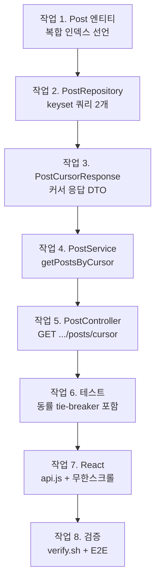

# 단계 16 따라하기 — 파일별·작업 순서별 구현 기록 (keyset 페이지네이션)

> [[DB-PERFORMANCE-LAB]]에서 100만 건 실측으로 확보한 증거(OFFSET 353ms vs keyset
> 0.07ms, 복합 인덱스 1,226ms → 3ms)를 **코드로 옮기는** 문서다. "어느 파일의 어느
> 부분을, 어떤 순서로, 왜 그렇게" 바꾸는지를 작업 단위로 기록한다 — 이 순서대로
> 따라 치면 같은 결과가 재현된다.
>
> 구현 범위: 엔티티 인덱스 선언 + keyset(cursor) API + React 무한스크롤.
> (로드맵 §5의 Redis 캐시는 이번 범위에서 제외 — 별도 단계 후보로 남긴다.)

---

## 0. 작업 지도 — 무엇을 어떤 순서로



**왜 이 순서인가** — 데이터 계층에서 화면 쪽으로 한 방향으로 쌓는다:

| 순서 | 작업 | 이 순서인 이유 |
|------|------|----------------|
| 1 | 엔티티 인덱스 | 쿼리가 기댈 인덱스가 먼저 있어야 한다(없으면 keyset도 느리다) |
| 2 | 리포지토리 쿼리 | 서비스가 호출할 재료. 커서 조건식이 이 단계의 본론 |
| 3 | 응답 DTO | 서비스 반환 타입 — 서비스보다 먼저 있어야 컴파일된다 |
| 4 | 서비스 | 첫 페이지/다음 페이지 분기 + hasNext 판정 |
| 5 | 컨트롤러 | 파라미터 바인딩과 검증만 — 얇게 |
| 6 | 테스트 | 백엔드가 완성된 지점에서 회귀 방어선 구축 |
| 7 | 프론트엔드 | 검증된 API 위에 화면을 얹는다 |
| 8 | 검증 | verify.sh + 실 DB curl + 브라우저 E2E 순서로 바깥쪽까지 |

각 작업 끝의 **체크포인트**를 통과하고 다음으로 넘어간다.

---

## 작업 1. `Post` 엔티티 — 복합 인덱스를 코드 정본으로

`src/main/java/com/example/board/post/Post.java`

실습에서는 `CREATE INDEX`를 손으로 쳤다. 손으로 만든 인덱스는 서버를 새로 만들면
사라진다 — **엔티티에 선언하면 코드가 정본**이 되어, `ddl-auto: update`가 어느
환경에서든 없으면 만들어 준다.

변경 전:

```java
@Entity
@Table(name = "posts")
```

변경 후:

```java
// 단계 16: 게시판별 최신순 목록(WHERE board_id + ORDER BY created_at DESC)을 한 인덱스로
// 해결하는 복합 인덱스. DB-PERFORMANCE-LAB에서 수동 생성으로 효과를 실측했던 것을
// 엔티티 선언으로 옮겨 코드가 정본이 되게 한다(ddl-auto: update가 없으면 생성).
// board_id가 선두 컬럼이므로 InnoDB가 FK(board_id) 받침 인덱스로도 재활용한다.
@Entity
@Table(name = "posts", indexes = {
    @Index(name = "idx_posts_board_created", columnList = "board_id, created_at")
})
```

(`jakarta.persistence.Index` import 한 줄 추가.)

- 컬럼 순서가 `(board_id, created_at)`인 이유는 실습 §5 그대로 — 등호 조건
  컬럼(board_id)이 선두여야 "게시판으로 점프 → 그 안은 이미 시간순" 구조가 된다.
- 실습 §7의 ERROR 1553에서 봤듯, 이 인덱스는 FK(board_id)의 받침 인덱스로도
  재활용될 수 있다 — 선두 컬럼이 board_id라서다.

**체크포인트** — 앱을 한 번 기동한 뒤:

```sql
SHOW INDEX FROM posts;
```

`idx_posts_board_created`가 Seq_in_index 1(board_id), 2(created_at) 두 행으로 보이면 성공.

---

## 작업 2. `PostRepository` — keyset 쿼리 2개

`src/main/java/com/example/board/post/PostRepository.java`

keyset은 요청이 두 종류다: **커서가 없는 첫 페이지**와 **커서 이후를 잇는 다음
페이지**. 조건식이 달라서 메서드도 둘로 나눈다(하나로 합치면 `:cursor is null or ...`
같은 조건이 실행 계획을 흐린다).

추가된 코드:

```java
// 단계 16: keyset 페이지네이션 첫 페이지 — 커서 없이 최신순 상위 N건.
// 정렬 기준은 (createdAt desc, id desc) 복합 — createdAt이 같은 행이 있어도
// id가 순서를 확정하므로 페이지 경계에서 글이 빠지거나 중복되지 않는다.
@EntityGraph(attributePaths = {"board", "author"})
List<Post> findByBoardIdOrderByCreatedAtDescIdDesc(Long boardId, Limit limit);

// 단계 16: keyset 페이지네이션 다음 페이지 — "직전 페이지 마지막 행(커서)보다 오래된 것"만.
// OFFSET처럼 앞 페이지를 다시 세지 않고 idx_posts_board_created로 커서 위치에
// 바로 점프하므로, 뒤 페이지로 갈수록 느려지는 문제가 없다(LAB 실측 353ms → 0.07ms).
// (createdAt = 커서 and id < 커서id) 조건이 동일 시각 행들 사이의 이어받기를 보장한다.
@EntityGraph(attributePaths = {"board", "author"})
@Query("select p from Post p where p.board.id = :boardId "
    + "and (p.createdAt < :lastCreatedAt "
    + "or (p.createdAt = :lastCreatedAt and p.id < :lastId)) "
    + "order by p.createdAt desc, p.id desc")
List<Post> findSliceByBoardIdAfterCursor(
    @Param("boardId") Long boardId,
    @Param("lastCreatedAt") LocalDateTime lastCreatedAt,
    @Param("lastId") Long lastId,
    Limit limit);
```

(import 추가: `java.time.LocalDateTime`, `java.util.List`,
`org.springframework.data.domain.Limit`.)

여기서 배우는 세 가지:

**① 커서가 (createdAt, id) 쌍인 이유** — 실습 §6의 keyset은 `id < :lastId` 하나로
충분했다. id 순서 = 시간 순서였기 때문. 하지만 실제 목록은 `created_at` 정렬이고,
**createdAt은 유일하지 않을 수 있다**(동시 등록·초 단위 절삭). `createdAt < 커서`만
쓰면 커서와 같은 시각의 나머지 행들을 통째로 건너뛴다. `or (같으면 id로)` 조건이
동일 시각 무리 안에서의 이어받기를 보장한다 — 이 한 줄이 이번 단계의 심장이다.

**② `Limit` 파라미터** — Spring Data 3.2+의 기능. `PageRequest.of(0, n)`처럼
"0페이지"라는 가짜 개념을 만들지 않고 "몇 건까지"만 전달한다. keyset은 페이지
번호가 없으므로 의미가 정확히 맞는 도구다.

**③ `@EntityGraph` 유지** — 기존 offset 목록과 똑같이 board·author를 join으로 함께
로딩한다. keyset으로 바꿔도 N+1 방지 원칙([[COMMENT]] 단계)은 그대로 승계된다.

**체크포인트**: 컴파일만 확인(`./gradlew compileJava`). 동작 검증은 작업 6에서.

---

## 작업 3. `PostCursorResponse` — 커서 응답 DTO (신규 파일)

`src/main/java/com/example/board/post/dto/PostCursorResponse.java`

```java
package com.example.board.post.dto;

import com.example.board.post.Post;
import java.time.LocalDateTime;
import java.util.List;

// 단계 16: keyset(cursor) 페이지네이션 응답.
// Page<T>와 달리 전체 건수(totalElements)를 세지 않는다 — COUNT(*) 자체가 대량
// 테이블에서 비싼 쿼리라서, 무한스크롤에는 "다음이 있는가"만 알려주면 충분하다.
// lastCreatedAt/lastId가 다음 요청의 커서다(클라이언트는 이 값을 그대로 되돌려 보낸다).
public record PostCursorResponse(
    List<PostListResponse> items,
    boolean hasNext,
    LocalDateTime lastCreatedAt,
    Long lastId
) {

  // rows는 size+1건까지 조회된 상태로 들어온다 — 여분 1건의 존재가 hasNext의 근거.
  public static PostCursorResponse of(List<Post> rows, int size) {
    boolean hasNext = rows.size() > size;
    List<Post> pageRows = hasNext ? rows.subList(0, size) : rows;
    List<PostListResponse> items = pageRows.stream().map(PostListResponse::from).toList();
    Post last = pageRows.isEmpty() ? null : pageRows.get(pageRows.size() - 1);
    return new PostCursorResponse(
        items,
        hasNext,
        last == null ? null : last.getCreatedAt(),
        last == null ? null : last.getId());
  }
}
```

설계 포인트 — **`Page` 대신 새 DTO를 만든 이유**:

| | offset의 `Page<T>` | keyset의 `PostCursorResponse` |
|------|------|------|
| 전체 건수 | `totalElements` — **COUNT(*) 쿼리 추가 발생** | 없음 (안 센다) |
| 다음 페이지 존재 | totalPages로 계산 | `hasNext` — size+1건 조회 트릭 |
| 다음 요청 방법 | `?page=N+1` | 응답의 `lastCreatedAt`/`lastId`를 그대로 반송 |

"size+1 트릭": 20건이 필요하면 21건을 조회한다. 21번째가 **존재하면** 다음 페이지가
있다는 뜻이고, 응답에는 20건만 담는다. COUNT 없이 hasNext를 아는 표준 기법.

**체크포인트**: 컴파일 통과.

---

## 작업 4. `PostService` — 커서 조회 메서드

`src/main/java/com/example/board/post/PostService.java`

기존 `getPosts`(offset) 아래에 추가:

```java
// 단계 16: keyset(cursor) 목록 조회 — 무한스크롤용.
// 커서(lastCreatedAt, lastId)가 없으면 첫 페이지, 있으면 그 지점 이후를 잇는다.
// size+1건을 조회해 여분 1건의 존재로 hasNext를 판정한다(COUNT 쿼리 없이).
@Transactional(readOnly = true)
public PostCursorResponse getPostsByCursor(
    Long boardId, LocalDateTime lastCreatedAt, Long lastId, int size) {
  if (!boardRepository.existsById(boardId)) {
    throw new NotFoundException(ErrorCode.BOARD_NOT_FOUND);
  }
  Limit limit = Limit.of(size + 1);
  List<Post> rows = (lastCreatedAt == null || lastId == null)
      ? postRepository.findByBoardIdOrderByCreatedAtDescIdDesc(boardId, limit)
      : postRepository.findSliceByBoardIdAfterCursor(boardId, lastCreatedAt, lastId, limit);
  return PostCursorResponse.of(rows, size);
}
```

(import 추가: `PostCursorResponse`, `java.time.LocalDateTime`,
`org.springframework.data.domain.Limit`.)

- 게시판 존재 검증은 offset 버전과 같은 규칙(BOARD_NOT_FOUND 404) — 두 API의
  에러 계약을 일치시킨다.
- 커서 두 값 중 하나라도 없으면 첫 페이지로 취급 — "반쪽 커서"로 어긋난 지점을
  잇는 실수를 서버가 흡수한다.

**체크포인트**: 컴파일 통과.

---

## 작업 5. `PostController` — cursor 엔드포인트

`src/main/java/com/example/board/post/PostController.java`

기존 offset 목록은 **지우지 않고** 그 위에 주석만 단다(페이지 번호 점프가 필요한
화면과 교육용 전/후 비교를 위해 공존):

```java
// 단계 16 처리에 의해 keyset 방식(/posts/cursor)이 추가됨 — 이 offset 방식은
// 페이지 번호 점프가 필요한 화면·교육용 비교 대상으로 유지한다.
@GetMapping("/boards/{boardId}/posts")
public Page<PostListResponse> getPosts(...)   // 기존 그대로
```

새 엔드포인트 추가:

```java
// 단계 16: keyset(cursor) 목록 — 무한스크롤용. 첫 요청은 커서 없이, 다음 요청부터
// 직전 응답의 lastCreatedAt/lastId를 그대로 되돌려 보낸다(두 값은 항상 쌍으로).
// size 상한은 한 번에 대량을 끌어가는 요청을 차단한다(악용/실수 모두).
@GetMapping("/boards/{boardId}/posts/cursor")
public PostCursorResponse getPostsByCursor(
    @PathVariable Long boardId,
    @RequestParam(required = false)
    @DateTimeFormat(iso = DateTimeFormat.ISO.DATE_TIME) LocalDateTime lastCreatedAt,
    @RequestParam(required = false) Long lastId,
    @RequestParam(defaultValue = "20") int size) {
  if (size < 1 || size > 100) {
    throw new BusinessException(ErrorCode.INVALID_INPUT);
  }
  return postService.getPostsByCursor(boardId, lastCreatedAt, lastId, size);
}
```

(import 추가: `PostCursorResponse`, `java.time.LocalDateTime`,
`org.springframework.format.annotation.DateTimeFormat`, `RequestParam`.)

- `@DateTimeFormat(iso = DATE_TIME)` — 응답의 `lastCreatedAt`(ISO 문자열,
  마이크로초 포함)을 쿼리 파라미터로 되돌려 받기 위한 파서 지정.
- **size 상한 100** — `?size=1000000` 한 방으로 서버 메모리를 터뜨리는 것을 막는
  입력 검증. 이미 있는 `ErrorCode.INVALID_INPUT`(400)을 재사용한다.
- 보안 설정은 **손대지 않는다** — `GET /api/v1/boards/**`가 이미 permitAll이라
  같은 경로 아래의 새 엔드포인트도 비로그인 조회가 된다.

**체크포인트**: `./gradlew build` 전체 통과.

---

## 작업 6. 테스트 — 페이지 경계와 동률을 겨눈다

`src/test/java/com/example/board/post/PostServiceTest.java`

keyset의 버그는 항상 **페이지 경계**에서 난다. 테스트도 경계를 겨눈다: 첫 페이지
순서/커서 값, 전체 순회(중복·누락 없음), 마지막 페이지 hasNext=false, 빈 게시판,
없는 게시판 404 — 그리고 핵심 한 방:

```java
// 핵심 회귀 테스트: createdAt이 전부 같아도(동률) id tie-breaker 덕에
// 페이지 경계에서 글이 빠지거나 중복되지 않아야 한다.
// createdAt은 @CreatedDate(updatable=false)라 JPA로는 못 바꾸므로 native로 동률을 만든다.
@Test
void should_notSkipOrDuplicate_whenCreatedAtTies() {
  List<Long> ids = createPosts(5);
  em.flush();
  em.createNativeQuery("update posts set created_at = :ts")
      .setParameter("ts", LocalDateTime.of(2026, 1, 1, 0, 0, 0))
      .executeUpdate();
  em.clear();

  List<Long> collected = walkAllPages(2);

  assertThat(collected).hasSize(5);
  assertThat(collected).doesNotHaveDuplicates();
  // 시각이 전부 같으므로 순서는 id 내림차순이어야 한다
  assertThat(collected).isSortedAccordingTo((a, b) -> Long.compare(b, a));
  assertThat(collected).containsExactlyInAnyOrderElementsOf(ids);
}
```

이 테스트가 흥미로운 이유:

- `@CreatedDate`는 `updatable = false`라 JPA로는 동률을 **만들 수조차 없다** —
  그래서 native UPDATE로 5건의 createdAt을 강제로 통일한 뒤 `em.clear()`로
  영속성 컨텍스트를 비워 DB에서 다시 읽게 한다.
- 만약 작업 2에서 `or (createdAt = 커서 and id < 커서id)` 조건을 빼먹으면 **이
  테스트만 떨어진다** — 일반 흐름 테스트는 전부 통과하는데. 경계 조건 테스트가
  왜 별도로 필요한지의 실물 예시.

전체 순회 헬퍼(`walkAllPages`)는 응답 커서를 그대로 다음 요청에 반송하는, 클라이언트가
할 일의 재현이다(무한 루프 방지 guard 포함). 나머지 테스트는 소스 참조.

**체크포인트**:

```bash
./gradlew test --tests PostServiceTest
```

---

## 작업 7. React — api.js + 무한스크롤

### 7-1. `frontend-react/src/api.js` — 커서 API 함수 추가

```js
// 단계 16: keyset(cursor) 목록 — 무한스크롤용.
// cursor는 직전 응답의 { lastCreatedAt, lastId } 그대로. 첫 페이지는 null.
export async function getPostsByCursor(boardId, cursor = null, size = 20) {
  const params = new URLSearchParams({ size });
  if (cursor) {
    params.set("lastCreatedAt", cursor.lastCreatedAt);
    params.set("lastId", cursor.lastId);
  }
  return jsonFetch(`/api/v1/boards/${boardId}/posts/cursor?${params}`);
}
```

기존 `getPosts`(offset)는 유지 — 서버와 같은 이유(비교·병행)다.

### 7-2. `frontend-react/src/components/Posts.jsx` — 무한스크롤 전환

상태 구조가 바뀐다:

| 변경 전 (offset) | 변경 후 (keyset) |
|------|------|
| `page` — `Page<PostListResponse>` 통째 | `items` — 이어 붙인 배열 |
| (페이지 번호는 안 쓰고 있었음) | `cursorRef` — `{ lastCreatedAt, lastId }` |
| | `hasNext`, `sentinelRef`, `loadingRef` |

핵심 메커니즘 — **센티널 + IntersectionObserver**:

```jsx
// 센티널이 뷰포트에 들어오면 다음 페이지 로드. hasNext가 없으면 관찰하지 않는다.
useEffect(() => {
  if (!hasNext) return;
  const el = sentinelRef.current;
  if (!el) return;
  const observer = new IntersectionObserver(
    (entries) => { if (entries[0].isIntersecting) load(false); },
    { rootMargin: "200px" }          // 바닥 200px 전에 미리 당겨와 끊김을 줄인다
  );
  observer.observe(el);
  return () => observer.disconnect();
}, [hasNext, load]);
```

```jsx
{/* 무한스크롤 센티널 — hasNext일 때만 존재. 화면에 들어오면 다음 페이지를 당긴다 */}
{hasNext && <div ref={sentinelRef} className="status">더 불러오는 중…</div>}
```

목록 맨 끝에 보이지 않는 표지판(센티널)을 세워 두고, 브라우저 내장
IntersectionObserver가 "그 표지판이 화면에 들어왔다"를 알려주면 다음 페이지를
이어 붙인다. scroll 이벤트 리스너 방식과 달리 스크롤마다 계산이 돌지 않는다
(브라우저가 교차 판정을 대신 해 준다).

로딩 함수는 reset 여부 하나로 두 흐름을 겸한다:

```jsx
// reset=true면 처음부터(첫 페이지), false면 현재 커서에서 다음 페이지를 이어 붙인다.
const load = useCallback(async (reset) => {
  if (loadingRef.current) return;              // 중복 로드 방지
  loadingRef.current = true;
  if (reset) setStatus("불러오는 중…");
  try {
    const data = await getPostsByCursor(board.id, reset ? null : cursorRef.current, PAGE_SIZE);
    setItems((prev) => (reset ? data.items : [...prev, ...data.items]));
    cursorRef.current = data.hasNext
      ? { lastCreatedAt: data.lastCreatedAt, lastId: data.lastId }
      : null;
    setHasNext(data.hasNext);
    setStatus(reset && data.items.length === 0 ? "아직 글이 없습니다." : "");
  } catch (err) {
    setStatus(`글 목록을 불러오지 못했습니다: ${err.message}`);
  } finally {
    loadingRef.current = false;
  }
}, [board.id]);
```

함정 두 개를 코드가 막고 있다:

- **중복 로드** — observer 콜백은 짧은 사이에 연달아 올 수 있다. `loadingRef`
  (state가 아닌 ref)가 진행 중이면 즉시 반환. state로 하면 set이 비동기라 두 번째
  콜백이 낡은 값을 보고 통과해 버린다.
- **낡은 커서** — 커서를 state에 두면 observer 콜백의 클로저가 등록 시점 값을 계속
  참조한다(React의 고전 함정). 렌더링에 쓰는 값이 아니므로 `cursorRef`로 보관해
  콜백이 항상 최신 커서를 읽게 한다.

글 등록·새로고침은 `load(true)`로 처음부터 다시 — 새 글은 맨 위에 오기 때문.

**체크포인트**:

```bash
cd frontend-react && npm run build
```

---

## 작업 8. 검증 — 안쪽에서 바깥쪽으로

세 겹으로 검증했고, 전부 통과했다:

**① verify.sh** (빌드 + 전체 테스트 + 실기동):

```
[1/3] build + test: ./gradlew build        OK
[3/3] boot health check on port 8091       OK (GET /api/v1/boards -> 200)
=== VERIFY PASSED ===
```

**② 실 MySQL(100만 건) curl E2E** — 기동 시 ddl-auto가 인덱스를 실제로 만들었고:

```sql
SHOW INDEX FROM posts;
-- idx_posts_board_created  1  board_id
-- idx_posts_board_created  2  created_at
```

첫 페이지 → 커서 반송 → 다음 페이지 이어받기 → size=101 거부(400)까지:

```bash
curl "http://localhost:8091/api/v1/boards/1/posts/cursor?size=3"
# items 3건(최신순), hasNext: true, lastCreatedAt/lastId 반환
curl "...?size=3&lastCreatedAt=<반환값>&lastId=<반환값>"
# 이어지는 3건, 중복 없음
curl -w "%{http_code}" "...?size=101"      # → 400
```

**③ 브라우저 E2E** (100만 건 게시판에서): 스크롤 바닥 도달마다 20 → 40 → 60건으로
증가, 60건 전부 유니크(중복·누락 없음), 센티널 문구 정상 표시.

---

## 부록: 최종 변경 요약

| 파일 | 변경 | 내용 |
|------|------|------|
| `post/Post.java` | 수정 | `@Table(indexes)` 복합 인덱스 선언 |
| `post/PostRepository.java` | 수정 | keyset 쿼리 2개 (첫 페이지 / 커서 이후) |
| `post/dto/PostCursorResponse.java` | **신규** | 커서 응답 DTO + size+1 → hasNext 판정 |
| `post/PostService.java` | 수정 | `getPostsByCursor` (분기 + 404 규칙 승계) |
| `post/PostController.java` | 수정 | `GET /boards/{id}/posts/cursor` + size 상한 |
| `post/PostServiceTest.java` | 수정 | 커서 테스트 7개 (동률 tie-breaker 포함) |
| `frontend-react/src/api.js` | 수정 | `getPostsByCursor` 추가 |
| `frontend-react/src/components/Posts.jsx` | 수정 | IntersectionObserver 무한스크롤 전환 |

건드리지 않은 것: SecurityConfig(기존 permitAll 승계), offset API(비교·병행 유지),
docker-compose·배포 스크립트(스키마는 ddl-auto가 알아서).

다음 후보([[DB-PERFORMANCE]] §5): 목록 첫 페이지 Redis TTL 캐시 — 단계 15의 TTL
개념이 토큰에서 캐시로 재사용되는 지점.
