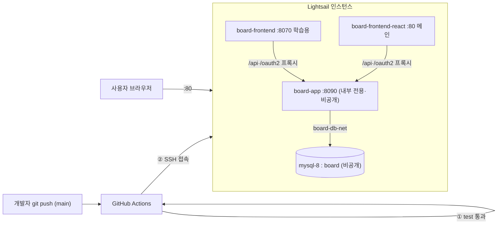

# AWS Lightsail 배포 설치 가이드 (서버 최초 세팅)

- **대상 서버**: AWS Lightsail 인스턴스 `3.34.173.34` (Ubuntu 기준)
- **목표**: 로컬에서 하던 방식 그대로(`docker compose`) Lightsail에서 백엔드 + 프론트 2종을 띄우고, 이후 배포는 [[CICD-GITHUB-ACTIONS]]의 파이프라인이 자동으로 잇는다.
- **역할 분담**: 이 문서는 **서버를 한 번 준비하는 수동 작업**(Docker·MySQL·네트워크·저장소)이다. 코드가 바뀔 때마다의 재배포는 GitHub Actions가 SSH로 처리하므로 다시 손댈 필요가 없다.

---

## 1. 배포 구조 한눈에



- **공개 진입점은 프론트뿐이다.** **React 프론트가 host 80(공개 진입점·메인)** 이고, 순수 JS 프론트는 **8070**(학습·비교용 — 방화벽을 열지 않으면 외부에서 접근 불가)이다. 기존 8071 포트는 폐지됐다. 백엔드(`board-app:8090`)와 DB(`mysql-8`)는 **host에 포트를 publish하지 않아 외부에서 직접 접근할 수 없고**, board-db-net 안에서 프론트의 Nginx만 컨테이너명 `board-app:8090`으로 프록시한다.
- **소셜 로그인**은 메인 진입점인 React 프론트(80)의 Nginx가 `/oauth2/`·`/login/oauth2/`까지 백엔드로 중계한다(§10 참고). 순수 JS 프론트(8070)의 Nginx도 동일한 oauth 프록시 구성을 유지한다.

서버가 갖춰야 할 것: **Docker + docker compose**, **mysql-8 컨테이너**, **board-db-net 네트워크**, **저장소 클론(~/board)**, **방화벽 포트 개방**. 이 중 Docker 설치만 수동이고, mysql-8·네트워크·저장소·`.env`는 이제 [[CICD-GITHUB-ACTIONS]] 파이프라인이 **없으면 자동 생성**한다(§5~§9). 아래 순서대로 준비한다.

---

## 2. Lightsail 방화벽(네트워킹) 포트 개방

Lightsail 콘솔 → 인스턴스 → **네트워킹** 탭 → **IPv4 방화벽** 에서 규칙 추가:

| 애플리케이션 | 프로토콜 | 포트 | 용도 |
|---|---|---|---|
| SSH | TCP | 22 | 접속·배포(기본 열림) |
| HTTP | TCP | 80 | React 프론트(공개 진입점·메인) |
| Custom | TCP | 8070 | 순수 JS 프론트(학습용, 선택) |

> [!NOTE]
> 프론트(80)가 내부에서 `/api`를 백엔드로 프록시하므로, 최소 요건은 **80·22** 다(8070은 학습용 프론트를 외부에서 보고 싶을 때만 선택 개방). **8090(백엔드)은 방화벽에 열지 않는다** — 백엔드와 DB(mysql-8)는 host에 publish하지 않아 애초에 외부에서 닿지 않으며, 비공개 상태를 유지한다. 실서비스라면 80을 443(HTTPS)로 좁히고 나머지는 닫는다.

---

## 3. SSH 접속

방금 발급한 키(`webserver_key.pem`, git에는 커밋하지 않음)로 접속한다.

```bash
chmod 400 webserver_key.pem
ssh -i webserver_key.pem ubuntu@3.34.173.34
```

- 사용자명은 블루프린트에 따라 다르다: **Ubuntu → `ubuntu`**, Amazon Linux → `ec2-user`, Bitnami → `bitnami`.

---

## 4. Docker 설치 (서버에서)

```bash
# 공식 편의 스크립트로 Docker Engine + compose 플러그인 설치
curl -fsSL https://get.docker.com | sudo sh

# 현재 사용자를 docker 그룹에 추가 → 이후 sudo 없이 docker 실행(CD 스크립트 전제)
sudo usermod -aG docker $USER
# 그룹 반영을 위해 로그아웃 후 재접속(또는 `newgrp docker`)
exit
```

재접속 후 확인:

```bash
docker version && docker compose version
```

> [!IMPORTANT]
> GitHub Actions의 배포 스크립트는 `sudo` 없이 `docker compose`를 실행한다. 위 `usermod -aG docker` 를 반드시 적용해 두어야 파이프라인이 성공한다.

---

## 5. DB — mysql-8 컨테이너 + 전용 네트워크

> [!NOTE]
> 이 절(§5)과 §6·§7은 이제 [[CICD-GITHUB-ACTIONS]] 파이프라인이 **없으면 자동 처리**한다(board-db-net·mysql-8·저장소 클론·`.env` 생성). 따라서 아래 수동 절차는 **선택**이다 — 원리를 이해하거나 파이프라인 없이 먼저 손으로 확인하고 싶을 때만 실행하면 된다. §4의 Docker 설치는 파이프라인이 하지 않으므로 여전히 수동이다.

로컬과 동일하게, 앱과 브리지로 묶을 MySQL을 띄운다([[DOCKER]] 모드 B와 같은 구조).

```bash
# 전용 브리지 네트워크(앱↔DB 연결용)
docker network create board-db-net

# MySQL 8 컨테이너 (root/1234, board DB 자동 생성, KST, 데이터 영속)
docker run -d --name mysql-8 \
  --network board-db-net \
  -e MYSQL_ROOT_PASSWORD=1234 \
  -e MYSQL_DATABASE=board \
  -v mysql8-data:/var/lib/mysql \
  mysql:8.0.33 --default-time-zone=+09:00
```

- **`-e MYSQL_DATABASE=board`** 가 빈 `board` 스키마를 만들어 준다(테이블은 앱이 Hibernate `ddl-auto: update`로 생성).
- 데이터는 named volume `mysql8-data`에 남아 컨테이너 재생성에도 보존된다.
- 앱은 같은 네트워크에서 컨테이너명 `mysql-8`로 접속한다(compose가 `DB_HOST: mysql-8` 주입).

---

## 6. 저장소 클론 (선택 — 파이프라인이 없으면 자동 clone)

배포 스크립트가 `~/board`에서 `git pull` 하므로, 그 위치에 클론해 둔다(공개 저장소라 인증 불필요). **파이프라인은 `~/board/.git`이 없으면 자동으로 clone**하므로, 아래는 미리 손으로 해 두고 싶을 때만 실행한다.

```bash
cd ~
git clone https://github.com/icesnake72/boards.git board
cd board
```

---

## 7. 최초 `.env` 생성 (선택 — 파이프라인이 Secrets로 자동 작성)

카카오 프로퍼티는 fail-fast라 비면 기동이 실패한다([[DOCKER]] §4). **이후 배포에선 GitHub Actions가 Secrets로부터 이 파일을 매번 새로 작성**하므로, 아래는 파이프라인 없이 §8의 수동 기동을 먼저 해 볼 때만 필요하다.

```bash
cp .env.example .env
nano .env    # KAKAO_REST_API / KAKAO_SECRET / GOOGLE_* 실제 값 입력
```

---

## 8. 최초 수동 기동 (검증)

```bash
docker compose up -d --build      # app + frontend + frontend-react
docker compose ps                 # 세 컨테이너 healthy 확인
# 백엔드는 host에 publish하지 않으므로 localhost:8090 직접 호출은 동작하지 않는다.
# 공개 진입점(80)의 프론트를 거쳐 프록시로 확인한다.
curl -s -o /dev/null -w "%{http_code}\n" http://localhost/               # 프론트 정적 → 200 기대
curl -s -o /dev/null -w "%{http_code}\n" http://localhost/api/v1/boards  # /api 프록시 → 200 기대
```

브라우저에서 확인:
- React 프론트(메인): `http://3.34.173.34` (80 — 포트 생략)
- 순수 JS 프론트(학습용): `http://3.34.173.34:8070` (방화벽에서 8070을 개방한 경우만)

여기까지 성공하면 서버 준비 완료다.

---

## 9. 이후 자동 배포로 전환

서버 세팅이 끝났으면, 코드가 바뀔 때마다 손으로 할 필요가 없다. **GitHub Secrets를 등록**하고 `main`에 push하면 [[CICD-GITHUB-ACTIONS]]의 워크플로(`.github/workflows/deploy.yml`)가:

1. 테스트 실행(H2)
2. Lightsail에 SSH 접속 → (없으면) board-db-net·mysql-8·저장소 자동 생성 → `.env` 재생성 → mysql-8 준비 대기 → `docker compose up -d --build`
3. **기본 게시판 시드(utf8mb4)**: 게시판이 하나도 없으면 `자유게시판`·`공지사항`·`Q&A`를 자동 생성한다(멱등 — 이미 있으면 무동작, 한글이 깨져 저장된 데모는 자동 교정).
4. **배포 후 검증**: 프론트(80) 200 대기, 백엔드·DB가 host에 publish되지 않은 비공개 상태인지 확인, OAuth 개시(카카오·구글)가 302 + 올바른 `redirect_uri`를 돌려주는지 확인.

를 자동 수행한다. 필요한 Secret 항목과 등록 방법은 [[CICD-GITHUB-ACTIONS]] 문서를 따른다.

---

## 10. 소셜 로그인 — 비공개 백엔드 + 프론트 프록시

백엔드가 비공개(host publish 없음)라, 소셜 로그인 흐름은 **공개 프론트(React, 80)의 Nginx가 중계**한다. 순수 JS 프론트(8070)의 Nginx도 같은 oauth 프록시 구성을 갖는다.

- **프론트(80) Nginx가 `/oauth2/`·`/login/oauth2/`를 프록시**한다. 브라우저는 `http://3.34.173.34/oauth2/authorization/{kakao|google}` 로 로그인을 개시하고, Nginx가 이를 `board-app:8090`으로 넘긴다.
- 프론트 Nginx는 `X-Forwarded-Host`/`X-Forwarded-Proto`를 전달하고, 백엔드 `application.yaml`의 `server.forward-headers-strategy: framework`가 이를 반영해 `redirect_uri`를 내부 `board-app:8090`이 아니라 실제 공개 주소 `http://3.34.173.34/login/oauth2/code/*` 로 계산한다.
- **카카오/구글 콘솔에 Redirect URI 등록 필수**: `http://3.34.173.34/login/oauth2/code/kakao`, `http://3.34.173.34/login/oauth2/code/google`.

> [!WARNING]
> **구글은 `http` 공개주소를 redirect_uri로 거부한다(HTTPS 필수).** 따라서 현재 http-only 구성에서 구글 로그인은 콘솔에서 막히고, 실제로 쓰려면 도메인 + HTTPS(TLS)로 전환해야 한다. **카카오는 http redirect_uri를 허용**하므로 현재 구성에서 동작한다. 운영 전환 시 80→443(HTTPS)으로 올리고 두 콘솔의 Redirect URI도 `https://.../login/oauth2/code/*` 로 갱신한다.

---

## 11. 자주 겪는 문제

| 증상 | 원인·해결 |
|---|---|
| 배포 스크립트에서 `permission denied ... docker.sock` | §4의 `usermod -aG docker` 미적용 → 적용 후 재접속 |
| 앱 기동 즉시 종료 + 카카오 관련 IllegalState | `.env`의 `KAKAO_*`가 비었거나 미해석 → 값 확인([[DOCKER]] §4) |
| 브라우저에서 80 접속 불가 | Lightsail 방화벽(§2)에 80 미개방 |
| `curl localhost:8090` 응답 없음 | 정상이다 — 백엔드는 host에 publish하지 않는다. `curl localhost/api/v1/boards`(프론트 프록시)로 확인(§8) |
| 앱이 DB 연결 실패(Communications link) | mysql-8 미기동 또는 board-db-net 미연결(§5) |
| 구글 로그인이 콘솔에서 거부됨 | 구글은 http redirect_uri 불가 → HTTPS 전환 필요(§10). 카카오는 http 허용 |
| 소셜 로그인 후 redirect_uri 불일치 | 카카오/구글 콘솔의 Redirect URI를 `http://3.34.173.34/login/oauth2/code/*` 로 등록(§10) |
| 빌드 중 OOM/멈춤 | 인스턴스 메모리 부족(gradle+npm 동시 빌드) → 2GB 이상 플랜 권장 |
