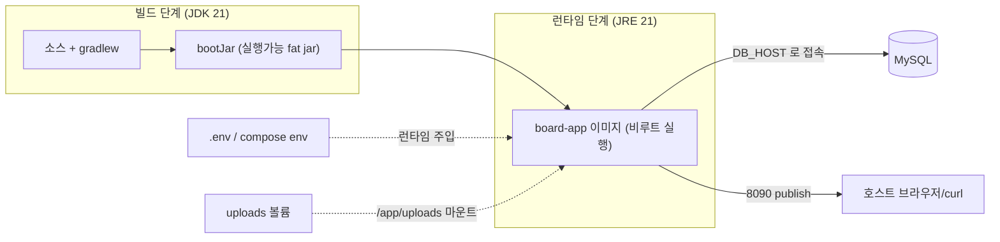
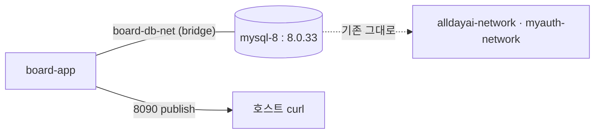

# 백엔드 도커화 — 멀티스테이지 이미지 + Compose (배포 참조)

- **분류**: 특정 단계(2~13)에 매이지 않는 **인프라/배포 참조** 문서. 코드는 그대로 두고, 이미 완성된 백엔드를 컨테이너로 실행하는 방법을 다룬다.
- **선행 지식**: 앱이 DB(MySQL)·업로드 디렉터리·OAuth 비밀값(`.env`)에 의존한다는 점([[FILE-UPLOAD]]의 업로드 경로, [[CURL-TEST]]의 엔드포인트).
- **핵심 학습 포인트**: ① 멀티스테이지 빌드로 "빌드 도구 없는 경량 런타임 이미지" 만들기, ② 설정을 이미지에 굽지 않고 런타임 env로 주입, ③ compose로 앱↔DB를 네트워크로 잇는 두 가지 방식(자체완결 / 기존 DB 브리지), ④ healthcheck로 기동 순서 제어.

---

## 1. 한눈에 보기

앱 설정은 이미 환경변수로 파라미터화돼 있어(`application.yaml`의 `${DB_HOST:localhost}` 등) **애플리케이션 코드 변경 없이** 도커화된다. 필요한 것은 이미지를 만드는 `Dockerfile`과, 앱·DB를 엮는 `docker-compose.yml`뿐이다.



관련 파일: `Dockerfile`, `docker-compose.yml`, `.dockerignore`, `.env.example` (모두 저장소 루트).

> [!NOTE]
> 이 문서의 compose 예시는 도커화 **개념**(모드 A 자체완결 / 모드 B 기존 DB 브리지)을 설명하기 위한 것이다. 실제 커밋된 `docker-compose.yml`은 여기서 더 진화해 **React 프론트(`frontend/`)와 HTTPS 진입점(caddy)을 추가**하고, **백엔드(`board-app:8090`)의 host publish를 제거**(외부 비공개)했다. 공개 포트는 caddy(80/443)뿐이고 프론트도 내부 전용이다. 순수 JS 프론트는 `frontend-vanilla/`로 이동해 학습 자료로만 보존된다(배포 제외 — [[FRONTEND-PAGINATION]]). 또한 서비스별 이미지 태그가 `ghcr.io/icesnake72/*`(board-app·board-frontend 2종)로 지정돼 있어, **production에서는 CI가 빌드해 push한 이미지를 서버가 pull만 한다**(무스왑 설계 — [[CICD-GITHUB-ACTIONS]]). `build:` 블록은 로컬 개발용으로 유지돼 로컬의 `docker compose up --build`는 그대로 동작한다. 단계 15에서는 **redis 서비스(`board-redis`, 토큰 저장소 — host publish 없는 비공개)** 도 스택에 추가됐다([[REDIS-TOKEN]]). 전체 배포 구조는 [[FRONTEND-DEPLOY]]·[[DEPLOY-LIGHTSAIL]]를 참고한다.

---

## 2. Dockerfile — 멀티스테이지

빌드용 JDK 이미지와 실행용 JRE 이미지를 분리한다. 최종 이미지에는 Gradle·JDK가 들어가지 않아 가볍고, 비루트 사용자로 실행한다.

```dockerfile
# syntax=docker/dockerfile:1

# ── 1) build stage ─────────────────────────────────────────────
FROM eclipse-temurin:21-jdk AS build
WORKDIR /workspace

# 의존성 캐시 레이어: 빌드 스크립트만 먼저 복사해 의존성을 미리 내려받는다.
COPY gradlew settings.gradle build.gradle ./
COPY gradle ./gradle
RUN chmod +x gradlew && ./gradlew --no-daemon dependencies > /dev/null 2>&1 || true

# 소스 복사 후 실행 가능 jar 빌드 (이미지 빌드는 산출물 생성이 목적 → 테스트는 -x test)
COPY src ./src
RUN ./gradlew --no-daemon clean bootJar -x test

# ── 2) runtime stage ───────────────────────────────────────────
FROM eclipse-temurin:21-jre AS runtime
WORKDIR /app

RUN apt-get update \
    && apt-get install -y --no-install-recommends curl \
    && rm -rf /var/lib/apt/lists/* \
    && groupadd --system spring \
    && useradd --system --gid spring --home-dir /app spring \
    && mkdir -p /app/uploads

COPY --from=build /workspace/build/libs/*.jar app.jar
RUN chown -R spring:spring /app

USER spring

ENV APP_UPLOAD_DIR=/app/uploads
EXPOSE 8090

# exec 형식 → PID 1이 자바 프로세스 → SIGTERM 전달 → graceful shutdown
ENTRYPOINT ["java", "-jar", "/app/app.jar"]
```

설계 포인트:

- **의존성 캐시 레이어**: 빌드 스크립트(`build.gradle` 등)만 먼저 복사해 `dependencies`를 받아두면, `src`만 바뀐 재빌드에서 이 레이어가 재사용돼 빠르다.
- **`-x test`**: 이미지 빌드는 "배포 산출물(jar) 생성"이 목적이다. 테스트(H2 기반)는 [[TESTING-GUIDE]]/verify-loop/CI에서 별도로 돈다.
- **비루트 실행**: `spring` 시스템 계정으로 실행해 컨테이너 탈취 시 피해를 줄인다.
- **`curl` 최소 설치**: compose healthcheck가 `GET /api/v1/boards`를 호출하는 데 쓴다(JRE 이미지엔 curl이 없다).
- **설정을 굽지 않는다**: `APP_UPLOAD_DIR`만 이미지에 고정(볼륨 마운트 지점). DB 접속·비밀값은 런타임 env로 주입한다.

---

## 3. `.dockerignore` — 빌드 컨텍스트 최소화

이미지에 불필요·민감 파일이 들어가지 않게 막는다.

```
.git
.gradle/
build/
!gradle/wrapper/gradle-wrapper.jar
.env            # 비밀값은 이미지에 굽지 않는다 — 런타임 env로 주입
uploads/
docs/
.claude/
.omc/
scripts/
```

특히 `.env`를 제외해 **비밀값이 이미지 레이어에 남지 않도록** 한다.

---

## 4. 설정 주입 — 코드 무변경의 근거

`application.yaml`이 이미 아래처럼 환경변수 placeholder를 쓰고 있어, compose가 값만 채우면 된다.

| 프로퍼티 | placeholder | compose가 주입 |
|---|---|---|
| DB 접속 | `${DB_HOST:localhost}:${DB_PORT:3306}/${DB_NAME:board}` | `DB_HOST`, `DB_PORT`, `DB_NAME` |
| DB 인증 | `${DB_USERNAME:root}` / `${DB_PASSWORD:1234}` | `DB_USERNAME`, `DB_PASSWORD` |
| 업로드 루트 | `${APP_UPLOAD_DIR:./uploads}` | `APP_UPLOAD_DIR=/app/uploads` |
| OAuth 비밀 | `${KAKAO_REST_API}` / `${KAKAO_SECRET}` / `${GOOGLE_*}` | `env_file: .env` |

> [!WARNING]
> **카카오 프로퍼티는 fail-fast 다.** `KakaoOAuthProperties`의 `@PostConstruct validate()`가
> `KAKAO_REST_API`·`KAKAO_SECRET`이 비었거나 미해석(`${...}`)이면 **기동 자체를 실패**시킨다.
> 따라서 로그인을 실제로 쓰지 않더라도 이 두 값은 컨테이너에 **non-empty로 주입**돼야 한다.
> 먼저 `cp .env.example .env` 후 값을 채운다(구글 키는 없어도 부팅됨).

---

## 5. 실행 모드 A — 자체완결(compose가 MySQL까지 번들)

`docker compose up` 한 번으로 앱+MySQL이 함께 뜬다. 강의·데모·깨끗한 로컬 환경에 적합하다.

```yaml
name: board

services:
  mysql:
    image: mysql:8.4
    container_name: board-mysql
    environment:
      MYSQL_ROOT_PASSWORD: ${DB_PASSWORD:-1234}
      MYSQL_DATABASE: ${DB_NAME:-board}
      TZ: Asia/Seoul
    ports:
      - "${DB_PORT:-3306}:3306"
    volumes:
      - mysql-data:/var/lib/mysql
    healthcheck:
      test: ["CMD", "mysqladmin", "ping", "-h", "127.0.0.1", "-uroot", "-p${DB_PASSWORD:-1234}"]
      interval: 5s
      timeout: 3s
      retries: 20
    restart: unless-stopped

  app:
    build:
      context: .
      dockerfile: Dockerfile
    image: board-app:latest
    container_name: board-app
    depends_on:
      mysql:
        condition: service_healthy   # MySQL 헬스체크 통과 후에야 앱 시작
    env_file:
      - .env
    environment:
      DB_HOST: mysql                  # 같은 compose 네트워크의 서비스명으로 접속
      DB_PORT: "3306"
      DB_NAME: ${DB_NAME:-board}
      DB_USERNAME: ${DB_USERNAME:-root}
      DB_PASSWORD: ${DB_PASSWORD:-1234}
      APP_UPLOAD_DIR: /app/uploads
      TZ: Asia/Seoul
    ports:
      - "8090:8090"
    volumes:
      - uploads:/app/uploads
    healthcheck:
      test: ["CMD", "curl", "-fsS", "http://localhost:8090/api/v1/boards"]
      interval: 10s
      timeout: 5s
      retries: 12
      start_period: 40s
    restart: unless-stopped

volumes:
  mysql-data:
  uploads:
```

- **`depends_on: condition: service_healthy`**: 앱은 MySQL이 `mysqladmin ping`에 응답한 뒤에야 시작한다(단순 "컨테이너 시작"이 아니라 "DB 준비 완료"를 기다림).
- **named volume 영속화**: `mysql-data`(DB), `uploads`(업로드 이미지)는 컨테이너를 재생성해도 보존된다. `docker compose down -v`로만 삭제된다.

---

## 6. 실행 모드 B — 기존 MySQL과 브리지(테스트 환경 · 현재 채택)

이미 로컬에서 쓰던 MySQL 컨테이너(`mysql-8`)가 있고 그 안에 개발 데이터(`board` DB)가 들어 있는 경우, **별도 MySQL을 띄우지 않고** 기존 컨테이너에 브리지로 붙인다. 호스트 3306 포트 충돌도 자연히 피한다.

```yaml
name: board

services:
  app:
    build:
      context: .
      dockerfile: Dockerfile
    image: board-app:latest
    container_name: board-app
    env_file:
      - .env
    environment:
      DB_HOST: mysql-8               # 기존 컨테이너명으로 접속(같은 board-db-net 안 DNS)
      DB_PORT: "3306"
      DB_NAME: ${DB_NAME:-board}
      DB_USERNAME: ${DB_USERNAME:-root}
      DB_PASSWORD: ${DB_PASSWORD:-1234}
      APP_UPLOAD_DIR: /app/uploads
      TZ: Asia/Seoul
    ports:
      - "8090:8090"
    volumes:
      - uploads:/app/uploads
    networks:
      - board-db-net
    healthcheck:
      test: ["CMD", "curl", "-fsS", "http://localhost:8090/api/v1/boards"]
      interval: 10s
      timeout: 5s
      retries: 12
      start_period: 40s
    restart: unless-stopped

networks:
  board-db-net:
    external: true                  # 외부에서 만든 브리지 — compose가 지우지 않는다

volumes:
  uploads:
```

**최초 1회 세팅**(기존 컨테이너를 전용 브리지 네트워크에 연결):

```bash
docker network create board-db-net
docker network connect board-db-net mysql-8   # mysql-8의 기존 네트워크는 유지된 채 추가
```



설계 포인트:

- **컨테이너명 DNS**: 사용자 정의 브리지 네트워크(`board-db-net`)에서는 컨테이너명(`mysql-8`)이 그대로 DNS로 해석된다. 그래서 `DB_HOST: mysql-8`로 접속된다. (기본 `bridge` 네트워크는 이름 해석이 안 되므로 전용 네트워크가 필요하다.)
- **비파괴 연결**: `mysql-8`의 기존 네트워크(`alldayai-network` 등)는 그대로 두고 `board-db-net`만 **추가**한다. 되돌리려면 `docker network disconnect board-db-net mysql-8`.
- **격리**: 전용 네트워크를 따로 만들어, 앱을 무관한 다른 스택과 섞지 않으면서 DB에만 브리지한다.

> [!NOTE]
> 위 예시의 `ports: "8090:8090"`(백엔드를 host에 publish)은 curl로 직접 확인하기 쉬운 **실습용 설정**이다. 실제 커밋된 compose는 이 host publish를 **제거**해 백엔드를 비공개로 두고, 공개 프론트(80)의 Nginx가 `board-app:8090`으로 프록시한다([[FRONTEND-DEPLOY]]·[[DEPLOY-LIGHTSAIL]]).

---

## 7. 명령 요약

```bash
cp .env.example .env            # 카카오 키 자리는 반드시 non-empty (미기입 시 fail-fast)
docker compose up --build       # 빌드 후 기동 → http://localhost:8090/api/v1/boards
docker compose up -d            # 백그라운드
docker compose logs -f app      # 앱 로그
docker compose ps               # 상태 확인
docker compose down             # 정지 (모드 A: 볼륨 유지 / 모드 B: mysql-8·네트워크 유지)
docker compose down -v          # 정지 + named volume 삭제
```

호스트 3306이 이미 점유된 경우(모드 A), MySQL의 호스트 publish만 우회한다:

```bash
DB_PORT=13306 docker compose up -d   # 앱↔MySQL 내부 통신(3306)은 불변, 호스트만 13306
```

---

## 8. 검증 결과 (실측)

이미지 빌드 → 스택 기동 → API/DB까지 확인했다.

| 확인 | 결과 |
|---|---|
| 이미지 빌드 | `BUILD SUCCESSFUL`, `board-app:latest` |
| 앱 헬스체크 | `healthy` (curl `GET /api/v1/boards`) |
| DB 연결 로그 | `HikariPool-1 - Added connection` → `Tomcat started on port 8090` → `Started BoardApplication` |
| 모드 B 데이터 | `GET /api/v1/boards`가 `mysql-8`의 기존 5건 반환(직접 `SELECT COUNT(*)`와 일치) |

통합 curl 테스트(모드 B, 실제 access token)로 도메인 전 기능을 확인했다. 요청 형식은 [[CURL-TEST]] 규약을 따른다.

- **게시글 생성**(multipart `post=...;type=application/json`) → 201, `id` 발급
- **댓글/대댓글**(`parentId`로 1단계 대댓글) → 트리로 조회됨
- **반응**(게시글·댓글 `{"type":"LIKE"|"DISLIKE"}`) → LIKE→DISLIKE **전환**, 같은 타입 재요청 시 **토글 취소**(row 삭제)
- **잘못된 타입**(`LOVE`) → 400 `MALFORMED_REQUEST`
- **조회수 정책**: 본인이 자기 글 조회 시 `viewCount` 미증가([[FILE-UPLOAD]]의 "남이 볼 때만 증가")
- DB(`mysql-8`)에 `posts`/`comments`/`comment_reactions` 저장 직접 대조 완료

---

## 9. 운영 전환 시 점검

이 설정은 로컬·테스트 기준이다. 운영으로 올릴 때 바꿀 것:

| 항목 | 로컬(현재) | 운영 |
|---|---|---|
| `JWT_SECRET` | yaml 기본값(강의용) | 전용 Base64 시크릿으로 **반드시 교체** |
| `APP_REFRESH_COOKIE_SECURE` | `false`(HTTP) | `true`(HTTPS) |
| `ddl-auto` | `update`(강의 편의) | `validate` + Flyway/Liquibase 마이그레이션 |
| DB 계정 | `root/1234` | 최소 권한 전용 계정 |
| 헬스체크 | `GET /api/v1/boards` | Spring Boot Actuator `/actuator/health` 권장 |

> [!NOTE]
> DB 비밀번호 기본값(`1234`)은 로컬 강의용으로 의도된 값이다(관련: [[FILE-UPLOAD]]의 업로드 정책처럼 "강의 편의 vs 운영 권장"을 대비해 이해).
