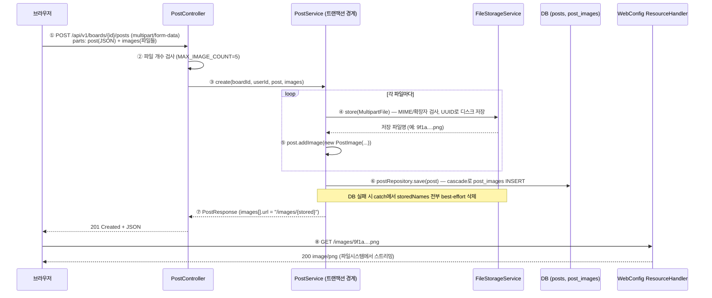

# 게시글 이미지 업로드 — multipart + 정적 서빙 (단계 10)

- **과정명**: 강의용 Spring Boot 게시판 — 단계 10 (파일 업로드)
- **대상**: 단계 9(OIDC)까지 마친 수강생 — 여기서부터는 인증 이야기가 잠시 멈추고, 도메인 기능(게시글 첨부 이미지)에 파일 시스템·정적 서빙이 결합된다
- **브랜치**: `step10-file-upload`
- **관련 코드**: `post/PostImage`(신규), `post/Post`(images 컬렉션 + `removeImagesByIds`), `post/PostController`(create/update 모두 multipart 전환), `post/PostService`(create·update·delete 각각의 파일-DB 정합성), `post/PostRepository`(fetch join/@EntityGraph 분리), `post/dto/*`(`PostUpdateRequest.deleteImageIds` 포함), `global/storage/FileStorageService`(신규), `global/config/WebConfig`(정적 서빙), `global/config/SecurityConfig`(`/images/**` permitAll), `global/exception/*`(파일 예외), `application.yaml`(`spring.servlet.multipart`, `app.upload.dir`)
- **선수 지식**: [SPRING-SECURITY-STANDARD.md](SPRING-SECURITY-STANDARD.md) — SecurityFilterChain의 `permitAll` 규칙, [EXCEPTION-HANDLING.md](EXCEPTION-HANDLING.md) — `@RestControllerAdvice`의 중앙 예외 변환
- **검증 상태**: `FileStorageServiceTest` + `PostServiceTest`(이미지 create/update 케이스) 포함 전체 95개 green, `verify.sh` 전 구간(빌드+테스트+실기동 헬스체크) 통과. 실 브라우저에서 multipart 업로드 → `/images/{uuid}.png` 조회 확인 (create 기준, 2026-07-18)

---

## 한눈에 보기 — 3분 요약

바쁘면 이 섹션만 읽어도 된다. 상세는 §1부터.

**무엇을 만들었나**: 게시글에 이미지 여러 장을 첨부하고, 목록에서는 첫 장을 썸네일로, 단건에서는 전체를 배열로 노출한다. 파일 자체는 로컬 디스크(`app.upload.dir`)에 UUID로 저장하고 DB에는 메타데이터(원본명·크기·정렬)만 넣는다. 저장된 파일은 별도 애플리케이션 서버 없이 Spring MVC의 `ResourceHandler`로 `/images/**` 정적 서빙한다.

**구현 지점 — 딱 4곳**:

| 층위 | 파일 | 역할 |
|------|------|------|
| 도메인 | `Post`, `PostImage` | `@OneToMany(cascade=ALL, orphanRemoval=true)` + `@BatchSize(100)` + `@OrderBy("sortOrder asc")` + `removeImagesByIds` |
| 저장 | `FileStorageService` | UUID 저장명, MIME/확장자 화이트리스트, path traversal 방어, best-effort delete |
| 서빙 | `WebConfig`, `SecurityConfig` | `/images/**` → `file:${app.upload.dir}` + `permitAll` |
| API | `PostController`, `PostService`, `PostResponse`/`PostListResponse`, `PostUpdateRequest` | create/update 모두 `@RequestPart("post" + "images")` multipart, update는 `deleteImageIds`(삭제) + `images`(신규) 델타 방식, 파일-DB 정합성 처리 |

**업로드 → 저장 → 조회 처리 시퀀스**:



**핵심 한 줄**: 파일은 파일시스템에, 링크는 DB에. 트랜잭션은 DB만 지켜주니 **정합성(고아 파일 방지)은 서비스 코드가 직접 책임진다.**

**update는 create처럼 "전체 교체"가 아니라 "델타"** — 브라우저는 서버 파일 바이트를 갖고 있지 않고 URL만 알기 때문에 "유지할 이미지"를 다시 실어 올 방법이 없다. 그래서 요청은 `deleteImageIds`(지울 id 배열) + `images`(신규 파일들)의 두 축으로 나뉜다:

| 단계 | 처리 | 실패 시 |
|------|------|---------|
| ① 장수 검증 | `현재 - 삭제 + 신규 ≤ 5` (`countDeletable` + `images.size()`) | 파일 저장 전에 400 `FILE_COUNT_EXCEEDED` |
| ② 본문/이미지 컬렉션 조정 | `post.update(title, content)` + `removeImagesByIds(deleteIds)` — 남의 글/미존재 id는 조용히 무시(보안) | (트랜잭션 내 상태 변경만) |
| ③ 신규 파일 저장 | 디스크에 UUID로 저장 + `addImage` (sortOrder는 `nextSortOrder`부터 이어감) | catch에서 **이번에 저장한 신규 파일만** best-effort delete (삭제 예정 기존 파일은 커밋 전이라 미개입) |
| ④ afterCommit | 삭제된 이미지의 물리 파일 정리 | 커밋 확정 후에만 실행 → 롤백 시 파일 유실 원천 차단 |

---

## 학습 목표

이 문서를 끝내면 수강생은:

- 파일을 **DB에 넣지 않고 파일시스템에 두는 이유**와 그 대가(정합성·백업·확장의 책임)를 설명할 수 있다
- multipart/form-data가 JSON 단독으로 못 하는 것이 무엇인지, `@RequestPart` 두 개로 어떻게 함께 받는지 안다
- Spring MVC의 `ResourceHandler` 정적 서빙이 실제로 어떻게 동작하는지, `src/main/resources/static`이 왜 **런타임 업로드에는 부적합**한지 구분할 수 있다
- path traversal, MIME 위조, 크기 폭탄에 대한 **최소 방어선**을 짜고, 무엇을 안 막았는지(매직바이트 검증 등)를 정확히 말할 수 있다
- 파일시스템이 트랜잭션에 참여하지 않는 사실을 코드로 다룰 수 있다 — 생성은 `try/catch + best-effort delete`, 삭제는 `afterCommit`
- 컬렉션 페이징의 함정(`MultipleBagFetchException`/메모리 페이징)을 알고 단건은 fetch join, 목록은 `@EntityGraph` + `@BatchSize`로 나눠 로딩할 수 있다

---

## 코드 작성 순서 — 무엇을 먼저 짜는가

이 기능은 여러 계층에 걸쳐 있다. 원칙은 **의존의 역방향으로 짠다** — 남이 의존하는 밑바닥 부품(설정·엔티티·저장 서비스)을 먼저 만들고, 그것들을 **조립**하는 서비스·컨트롤러를 나중에, **노출**(서빙·보안)과 **예외·테스트**를 맨 끝에 둔다. 아래 순서대로 가면 각 단계에서 바로 앞 단계 산출물만 있으면 컴파일된다.

| 순서 | 파일 | 이 시점에 하는 일 | 왜 이 순서인가 |
|------|------|-----------------|--------------|
| 1 | `application.yaml` | `spring.servlet.multipart`(크기 제한) + `app.upload.dir` 추가 | 저장 서비스가 읽을 설정 토대. 코드 없이 먼저 확정 |
| 2 | `post/PostImage.java` (신규) | 첨부 이미지 엔티티(메타데이터 컬럼) | 도메인 최하위 부품 — 아무것도 의존하지 않음 |
| 3 | `post/Post.java` | `@OneToMany images` + `addImage()` 편의 메서드 | 2가 있어야 컬렉션 타입이 성립 |
| 4 | `global/storage/FileStorageService.java` (신규) | 디스크 저장/삭제 + 검증(MIME·확장자·traversal) | 서비스·컨트롤러가 의존할 저장 부품. 1의 `app.upload.dir` 주입 |
| 5 | `post/dto/PostImageResponse.java` (신규) | `url = /images/{storedName}` 조립 | 응답 DTO 부품 |
| 6 | `post/dto/PostResponse.java`·`PostListResponse.java` | 이미지 필드(`images`, `thumbnailUrl`) 추가 | 5가 있어야 필드 타입 성립 |
| 7 | `post/PostRepository.java` | 단건 fetch join(+`distinct`), 목록 `@EntityGraph`+`@BatchSize` | 조회 계층 — 서비스가 호출 |
| 8 | `post/PostService.java` | `create`에 이미지 저장+정합성, `delete`에 파일 정리 | 2·4·7 부품을 **조립**하는 핵심 |
| 9 | `post/PostController.java` | `@RequestBody`→multipart(`@RequestPart`) 전환, 장수 검증 | 8을 호출하는 최상위 진입점 |
| 10 | `global/config/WebConfig.java` | `/images/**` ResourceHandler 매핑 | 저장된 파일을 **노출**(서빙) |
| 11 | `global/config/SecurityConfig.java` | `GET /images/**` permitAll | 10의 경로를 공개 허용 |
| 12 | `ErrorCode.java`·`GlobalExceptionHandler.java` | 파일 예외 3종 + 크기 초과 핸들러 | 위 흐름의 실패 경로 정리 |
| 13 | `test/.../FileStorageServiceTest`·`PostServiceTest` | `@TempDir`·`MockMultipartFile`로 검증 | 완성된 동작을 고정(기존 테스트 시그니처도 수정) |

> [!TIP]
> 큰 덩어리로 보면 **① 토대(1) → ② 도메인(2·3) → ③ 저장 부품(4) → ④ 응답·조회(5·6·7) → ⑤ 조립(8·9) → ⑥ 노출(10·11) → ⑦ 예외·테스트(12·13)** 의 7묶음이다. 부품이 조립보다, 조립이 노출보다 먼저라는 큰 골격만 기억하면 세부 순서는 컴파일러가 알려준다(앞 단계가 없으면 뒤 단계가 컴파일되지 않는다).

---

## 1. 왜 파일은 DB에 안 넣나 / 어디에 저장하나

첨부 이미지를 다룰 때 첫 갈림길은 **BLOB로 DB에 넣을 것인가, 파일시스템에 두고 링크만 DB에 저장할 것인가**다. 우리는 후자를 택했다. 근거는 실무 관점 4가지.

| 항목 | DB BLOB | 파일시스템 + 메타 DB (선택) |
|------|---------|----------------------------|
| 응답 서빙 | Controller → JDBC → 바이트 재조립 (매 요청 DB 왕복) | HTTP 서버가 파일 스트리밍 (커널 sendfile 최적화 가능) |
| 백업/복제 | DB dump에 이미지까지 실려 dump 시간·저장소 폭증 | 파일 백업은 rsync/S3 sync 등 별도 도구로 분리 |
| 스케일 아웃 | DB가 병목/디스크 압박 | 저장소만 별도 확장 (NAS/S3/CDN 앞단) |
| 마이그레이션 | 스키마·row 이동에 대용량 트랜잭션 | 파일 복사 + 경로 컬럼 재발행 |

DB에 두는 것도 정답인 경우가 있다(감사 요구가 강하거나 트랜잭션 원자성이 최우선인 도메인). 이 프로젝트는 게시판 첨부 — **읽기가 압도적으로 많고, 파일 자체는 게시글 라이프사이클을 따르지만 트랜잭션 원자성까지 요구되지는 않는다**. 그래서 파일시스템이 정답.

`app.upload.dir` — **설정으로 뽑아낸 이유**:

```yaml
app:
  upload:
    dir: ${APP_UPLOAD_DIR:./uploads}
```

로컬은 프로젝트 하위 `./uploads`가 편하고, 운영은 절대경로/전용 볼륨/EFS를 쓴다. 이 값을 하드코딩하면 개발/스테이징/운영마다 코드가 갈라진다. `FileStorageService`와 `WebConfig`는 **같은 이 값**을 각각 `@Value`로 주입받아, "저장 위치"와 "서빙 위치"를 반드시 일치시킨다.

> [!IMPORTANT]
> 파일시스템을 택한 대가는 **정합성 책임의 이전**이다 — 트랜잭션이 DB만 지켜주므로,
> 파일과 row가 어긋나지 않게 하는 코드는 서비스 계층이 직접 짜야 한다(§6에서 상세).

---

## 2. multipart API 전환 — JSON만으로는 파일을 실을 수 없다

단계 9까지 `POST /api/v1/boards/{id}/posts`는 `@RequestBody(JSON)` 하나였다. 파일이 등장하면서 **요청 본문의 형태 자체**가 바뀐다. 원인은 단순하다 — JSON은 문자열 트리이지 바이너리를 담는 규격이 아니다. base64로 억지로 넣을 수는 있지만 원본의 4/3배로 부풀고 다중 파일이면 파싱·메모리도 부담이다. 그래서 HTTP는 **multipart/form-data**라는 별도 인코딩을 표준으로 갖고 있다.

**multipart/form-data의 구조** — 요청 본문이 여러 **part**로 나뉘고, 각 part는 자체 헤더(`Content-Type`, `Content-Disposition`)와 본문(텍스트든 바이너리든)을 갖는다:

```
POST /api/v1/boards/1/posts HTTP/1.1
Content-Type: multipart/form-data; boundary=----X

------X
Content-Disposition: form-data; name="post"
Content-Type: application/json

{"title":"제목","content":"본문"}
------X
Content-Disposition: form-data; name="images"; filename="a.png"
Content-Type: image/png

<... PNG 바이너리 ...>
------X
Content-Disposition: form-data; name="images"; filename="b.png"
Content-Type: image/png

<... PNG 바이너리 ...>
------X--
```

같은 `name="images"`를 여러 번 반복하면 서버는 그 파트들을 **List로 묶어** 받는다. 이 프로젝트의 컨트롤러 시그니처가 그대로 이 규격을 반영한다:

```java
@PostMapping(path = "/boards/{boardId}/posts", consumes = MediaType.MULTIPART_FORM_DATA_VALUE)
@ResponseStatus(HttpStatus.CREATED)
public PostResponse create(
    @PathVariable Long boardId,
    @AuthenticationPrincipal CustomUserDetails userDetails,
    @Valid @RequestPart("post") PostCreateRequest post,
    @RequestPart(value = "images", required = false) List<MultipartFile> images) {
  validateImageCount(images);
  return postService.create(boardId, userDetails.getId(), post, images);
}
```

- `consumes = MULTIPART_FORM_DATA_VALUE` — 이 매핑이 multipart만 받는다는 계약을 명시. 다른 Content-Type은 415 `UNSUPPORTED_MEDIA_TYPE`.
- `@RequestPart("post")` — JSON part를 `PostCreateRequest`로 역직렬화. `@RequestBody`와 달리 **여러 파트 중 하나**를 지정한다.
- `@RequestPart("images") List<MultipartFile>` — 같은 이름의 파트들을 자동으로 리스트로 묶는다. `required = false`로 두면 이미지 없는 게시글도 허용.
- `MAX_IMAGE_COUNT = 5` — 컨트롤러 진입 직후 개수 검사. 크기 검사(§5)는 서블릿 컨테이너가 하므로, "장수 초과"는 별도 코드(`FILE_COUNT_EXCEEDED`)로 응답해 원인을 구분한다.

**curl로 시연**:

```bash
curl -X POST http://localhost:8090/api/v1/boards/1/posts \
  -H "Authorization: Bearer $ACCESS_TOKEN" \
  -F 'post={"title":"제목","content":"본문"};type=application/json' \
  -F 'images=@a.png;type=image/png' \
  -F 'images=@b.png;type=image/png'
```

- `-F 'post=...;type=application/json'` — 파트에 명시적으로 Content-Type을 붙여야 `@RequestPart("post")`가 Jackson으로 역직렬화를 시도한다. type 지정을 빠뜨리면 `text/plain`으로 붙어 `HttpMediaTypeNotSupportedException` → 415.
- `-F 'images=@파일`' — 로컬 파일을 파트로 전송. 같은 name을 반복하면 List로 묶인다.

**응답 예** — 이미지 응답 DTO는 정적 서빙 URL(§4)로 만든다:

```json
{
  "id": 42, "boardId": 1, "title": "제목", "content": "본문",
  "images": [
    {"id": 100, "url": "/images/9f1a....png", "originalName": "a.png", "sortOrder": 0},
    {"id": 101, "url": "/images/2c8b....png", "originalName": "b.png", "sortOrder": 1}
  ], ...
}
```

#### update도 multipart — 다만 "전체 교체"가 아니라 "델타"

create가 multipart로 바뀌었으니 update(`PUT /api/v1/posts/{id}`)도 같은 요령이라고 착각하기 쉽지만, 여기서 **요청 스키마 자체가 갈라진다**. 텍스트 필드(`title`/`content`)는 새 값으로 통째로 덮으면 그만이지만, 이미지는 그렇게 못 한다. 이유는 **브라우저가 서버 파일 바이트를 갖고 있지 않기 때문**이다 — 갖고 있는 건 `/images/9f1a....png` 같은 URL뿐이다.

전체 교체 방식(`images` 파트에 "최종 상태를 실어라")을 채택하면 벌어지는 일:

- 사용자가 "3장 중 첫 장만 지우고 새 장 하나 추가"를 원할 때, 클라이언트는 남길 2장을 **다시 다운로드해서 재업로드**해야 한다 — 대역폭 낭비, 원본 손실(재인코딩), 그리고 애초에 이걸 자동화하려면 클라이언트 코드가 훨씬 복잡해진다.

그래서 이미지(파일)에는 **델타(delta) 방식**이 표준이다. 요청을 두 축으로 나눈다:

- `deleteImageIds` — 지울 이미지 id의 배열 (요청 본문 JSON 파트 안에 실린다)
- `images` — 새로 추가할 파일들 (별도 multipart 파트)

이 계약이 그대로 컨트롤러 시그니처가 된다:

```java
// 기존(JSON) 방식 보존:
//   @PutMapping("/posts/{id}")
//   public PostResponse update(@PathVariable Long id, @Valid @RequestBody PostUpdateRequest request) {
//     return postService.update(id, request);
//   }
@PreAuthorize("@postSecurity.isAuthor(#id, authentication.principal)")
@PutMapping(path = "/posts/{id}", consumes = MediaType.MULTIPART_FORM_DATA_VALUE)
public PostResponse update(
    @PathVariable Long id,
    @Valid @RequestPart("post") PostUpdateRequest request,
    @RequestPart(value = "images", required = false) List<MultipartFile> images) {
  return postService.update(id, request, images);
}
```

- `PostUpdateRequest`에 `deleteImageIds` 필드 추가 — null 허용(안 보내면 삭제 없음):

```java
public record PostUpdateRequest(
    @NotBlank @Size(max = 200) String title,
    @NotBlank String content,
    List<Long> deleteImageIds
) {}
```

- 기존 JSON 시그니처는 주석으로 남겨 대비를 보존 — 수강생이 "왜 바뀌었나"를 코드에서 바로 볼 수 있게

**curl로 시연** — `post` 파트에 `deleteImageIds`가 함께 들어가고, 새 이미지는 `images` 파트로:

```bash
curl -X PUT http://localhost:8090/api/v1/posts/42 \
  -H "Authorization: Bearer $ACCESS_TOKEN" \
  -F 'post={"title":"수정된 제목","content":"수정된 본문","deleteImageIds":[100]};type=application/json' \
  -F 'images=@new.png;type=image/png'
```

- 위 요청의 의미: id=100 이미지를 지우고, `new.png`를 새로 추가한다. **언급되지 않은 기존 이미지는 그대로 유지된다** — 이것이 델타 방식의 핵심.
- 신규 이미지 없이 삭제만 하려면 `-F 'images=...'`를 아예 빼면 된다 (`required = false`).
- 삭제 없이 추가만 하려면 `deleteImageIds`를 요청에서 빼거나 `null`/`[]`로 보낸다.

| 요청 형태 | 결과 |
|-----------|------|
| `deleteImageIds: [100]` + `images: [new.png]` | id=100 삭제, new.png 추가 (그 외 유지) |
| `deleteImageIds: [100]` + `images` 파트 없음 | id=100만 삭제 |
| `deleteImageIds` 없음 + `images: [new.png]` | new.png만 추가 |
| `deleteImageIds: [999]` (남의 글/미존재) | 조용히 무시 — `Post.removeImagesByIds`가 `post.getImages()` 스코프에서만 필터링 (§5 보안) |

> [!IMPORTANT]
> 텍스트 필드는 **전체 교체**(새 title/content로 덮기), 이미지는 **델타**(삭제 id + 신규 파일).
> 한 요청 안에 두 스키마가 공존한다 — 원본을 재업로드하지 않고도 부분 수정을 표현하기 위한 규약이다.

---

## 3. 정적 서빙 메커니즘 — /images/** 는 어떻게 파일이 되는가

업로드한 파일에 접근할 URL을 만들어야 한다. 두 가지 축을 결정한다:

1. **어느 URL 접두사로 노출할지** — `/images/**`
2. **그 URL을 어느 파일시스템 경로로 매핑할지** — `${app.upload.dir}`

이 조립을 담당하는 것이 `WebMvcConfigurer.addResourceHandlers`:

```java
@Configuration
@EnableSpringDataWebSupport(pageSerializationMode = PageSerializationMode.VIA_DTO)
public class WebConfig implements WebMvcConfigurer {

  private final String uploadDir;

  public WebConfig(@Value("${app.upload.dir}") String uploadDir) {
    this.uploadDir = uploadDir;
  }

  @Override
  public void addResourceHandlers(ResourceHandlerRegistry registry) {
    Path root = Paths.get(uploadDir).toAbsolutePath().normalize();
    String location = root.toUri().toString();   // 예: file:///Users/.../board/uploads/
    registry.addResourceHandler("/images/**")
        .addResourceLocations(location);
  }
}
```

**`toUri()`를 쓰는 이유**: `addResourceLocations`는 문자열을 받지만 안쪽에서 URL로 파싱된다. `"file:" + path` 식의 조립은 Windows 경로(`C:\...\`, 역슬래시)에서 깨진다. `Path.toUri()`는 OS별 경로 규칙을 지켜 `file:///.../`로 정규화하고, **디렉터리에 대해서는 항상 슬래시로 끝**나 리소스 하위 경로 이어붙이기가 안전하다. `FileStorageService`가 기동 시 이 디렉터리를 `createDirectories`로 만들어 두므로 `toUri()`가 항상 디렉터리로 인식된다.

**Spring이 실제로 하는 일** — `ResourceHttpRequestHandler`가 `/images/{...}` 요청을 받으면:

1. URL 뒤 부분(`{...}`)을 location에 이어붙여 `Resource`를 찾는다 (여기선 `FileSystemResource`)
2. 요청 URL이 location 밖으로 나가는지 검사한다(`..` 등 path traversal 방어)
3. `Content-Type`을 파일 확장자로 추정하고, `Last-Modified`/`ETag`로 조건부 GET 지원
4. 파일을 응답 스트림으로 흘려보낸다

**Security와의 접점** — 정적 리소스도 필터 체인을 지나므로 SecurityConfig의 `authorizeHttpRequests` 규칙에 걸린다. `anyRequest().authenticated()`가 있는 상태라 명시적 공개가 없으면 401이 난다. 그래서 한 줄이 필요하다:

```java
.requestMatchers(HttpMethod.GET, "/images/**").permitAll()
```

`GET`만 허용하는 이유는 자명하다 — 정적 서빙은 조회 전용이고, 업로드는 `/api/v1/boards/{id}/posts` API가 담당한다.

**왜 `src/main/resources/static`에 저장하면 안 되나** — 자주 나오는 유혹이자 자주 나오는 사고다:

| 항목 | `src/main/resources/static` | `${app.upload.dir}` (선택) |
|------|-----------------------------|----------------------------|
| 실제 위치 | 빌드 시 jar/war 내부로 복사 | 파일시스템의 실제 경로 |
| 런타임 쓰기 | jar 내부는 **쓸 수 없다** — IDE 실행 시 target/classes에 쓸 수는 있지만 배포 순간 깨진다 | 항상 쓸 수 있다 |
| 재빌드 시 | `gradle clean build`로 저장물 **소실** | 영향 없음 |
| 스케일 아웃 | 인스턴스마다 jar 안 파일이 갈라짐 | NAS/S3로 공유 가능 |

**핵심**: `resources/static`은 빌드에 함께 패키징되는 **정적 자산**(로고, CSS)을 두는 곳이고, 런타임 업로드물은 애플리케이션과 독립된 저장소에 둬야 한다. 이 구분은 컴파일러가 잡아주지 않는다 — 로컬 IDE 실행에서는 잘 되다가 jar로 띄우는 순간 사고가 난다.

---

## 4. 보안 — 신뢰할 수 없는 파일 다루기

사용자가 올린 파일은 항상 **적대적 입력**으로 취급한다. `FileStorageService.store`가 그 최소 방어선이다:

```java
public String store(MultipartFile file) {
  if (file == null || file.isEmpty()) {
    throw new BusinessException(ErrorCode.INVALID_FILE_TYPE);
  }
  String contentType = file.getContentType();
  if (contentType == null || !ALLOWED_CONTENT_TYPES.contains(contentType.toLowerCase(Locale.ROOT))) {
    throw new BusinessException(ErrorCode.INVALID_FILE_TYPE);
  }
  String extension = extractExtension(file.getOriginalFilename());
  if (!ALLOWED_EXTENSIONS.contains(extension)) {
    throw new BusinessException(ErrorCode.INVALID_FILE_TYPE);
  }

  String storedName = UUID.randomUUID().toString().replace("-", "") + "." + extension;
  Path target = uploadRoot.resolve(storedName).normalize();
  // UUID라 정상 경로는 항상 루트 하위지만, 방어적으로 재확인한다(경로 이탈 차단)
  if (!target.startsWith(uploadRoot)) {
    throw new BusinessException(ErrorCode.INVALID_FILE_TYPE);
  }
  ...
}
```

세 가지 위협과 방어선을 매핑:

| 위협 | 방어선 | 이 프로젝트의 구현 |
|------|--------|-------------------|
| **path traversal** — 원본명이 `../../etc/passwd`, `..\Windows\...` | 원본명을 경로에 절대 쓰지 않는다 | `UUID.randomUUID()`로 저장명 재생성 + `startsWith(uploadRoot)` 재검증 |
| **위험 파일 실행** — `.php`, `.jsp`, `.html` 업로드 | 화이트리스트 (MIME + 확장자) | `image/{png,jpeg,gif,webp}` + `{png,jpg,jpeg,gif,webp}` 이중 검사 |
| **크기 폭탄** — 수 GB 파일로 디스크·메모리 고갈 | 서블릿 컨테이너 레벨 제한 | `spring.servlet.multipart.max-file-size: 5MB` / `max-request-size: 20MB` |

**path traversal의 이중 방어를 왜 하나** — `UUID.randomUUID()`가 만드는 문자열은 `[0-9a-f]`뿐이라 이론상 `..`을 만들 수 없다. 그래도 `startsWith(uploadRoot)` 재검증을 남긴 이유는 **"내가 안다"에 의존하는 코드는 리팩터에 취약하기 때문**이다. 나중에 저장명 규칙이 바뀌어 원본명 일부를 다시 포함하게 되면 이 검사가 마지막 안전망이 된다. `delete()`도 같은 이유로 `startsWith` 검사를 통과한 파일만 지운다.

**크기 제한의 응답 코드** — `max-file-size` 초과는 서블릿이 `MaxUploadSizeExceededException`을 던진다. `GlobalExceptionHandler`가 이를 잡아 `413 PAYLOAD_TOO_LARGE`(`FILE_SIZE_EXCEEDED`)로 응답한다:

```java
@ExceptionHandler(MaxUploadSizeExceededException.class)
public ResponseEntity<ErrorResponse> handleMaxUploadSize(MaxUploadSizeExceededException e) {
  log.warn("Upload size exceeded: {}", e.getMessage());
  return ResponseEntity.status(ErrorCode.FILE_SIZE_EXCEEDED.getStatus())
      .body(ErrorResponse.of(ErrorCode.FILE_SIZE_EXCEEDED));
}
```

`MaxUploadSizeExceededException`은 `MultipartException`의 하위라 등록 순서 상 **파일 크기 핸들러가 먼저** 매칭되어야 한다(위 코드가 그렇게 되어 있다). 하위 핸들러가 없으면 상위 `MultipartException` 핸들러가 크기 초과까지 삼켜 원인이 흐려진다.

**정적 서빙 경로는 실행 경로가 아니다** — `/images/**`는 `ResourceHttpRequestHandler`가 파일 바이트만 흘려보내는 경로다. 여기 놓인 `.php`나 `.jsp`가 있어도 실행되지 않는다 — 이 앱에 PHP/JSP 실행 컨테이너가 없기 때문. 다만 리버스 프록시나 다른 서버가 같은 디렉터리를 서빙하게 되면 이야기가 달라지므로, **화이트리스트로 확장자 자체를 이미지로 제한**해 두는 것이 이중 방어다.

> [!WARNING]
> **한계 명시 — 우리가 안 막은 것**: `content-type`은 브라우저/클라이언트가 보내는 값이고
> 확장자는 원본 파일명의 문자열이다. 둘 다 **위조 가능**하다. 실제 바이트가 정말 PNG인지는
> 매직바이트(파일 앞 몇 바이트)나 `ImageIO.read`로 다시 열어봐야 확실해지는데,
> 이 프로젝트는 하지 않는다. 그래서 위장 이미지(예: 폴리글롯 PDF/HTML) 방어는 이 단계에서 취약하다.
> 후속 하드닝: (a) `Files.probeContentType` + 매직바이트 검사, (b) `ImageIO.read`로 실 이미지 파싱 시도,
> (c) 정적 서빙 응답에 `Content-Disposition: inline; filename=`와 `X-Content-Type-Options: nosniff` 추가.

---

## 5. 파일-DB 정합성 — 트랜잭션에 안 참여하는 것 다루기 (핵심 교육 포인트)

이 단계의 진짜 학습 포인트다. **파일시스템은 `@Transactional`에 참여하지 않는다.** DB row 저장은 트랜잭션이 커밋될 때 확정되지만, `Files.copy`는 호출된 순간 즉시 디스크에 반영된다. 이 비대칭이 두 가지 사고를 만든다:

| 시나리오 | 순진한 구현 | 결과 |
|----------|-------------|------|
| 파일 저장 후 DB save 실패 | 파일만 남고 DB row 없음 → **고아 파일** | 디스크 낭비 + 아무도 참조하지 않는 파일 방치 |
| DB delete 후 트랜잭션 롤백 | 파일은 이미 지워졌는데 row가 살아남음 → **깨진 링크** | 사용자에게는 "이미지 없음" 표시 |

`PostService.create`가 첫 번째 사고를 다루는 방식 — **파일 먼저 저장, 실패 시 되돌리기**:

```java
@Transactional
public PostResponse create(
    Long boardId, Long loginUserId, PostCreateRequest request, List<MultipartFile> images) {
  Board board = boardRepository.findById(boardId)
      .orElseThrow(() -> new NotFoundException(ErrorCode.BOARD_NOT_FOUND));
  User author = userRepository.findById(loginUserId)
      .orElseThrow(() -> new NotFoundException(ErrorCode.USER_NOT_FOUND));

  List<String> storedNames = new ArrayList<>();
  try {
    Post post = new Post(board, author, request.title(), request.content());
    if (images != null) {
      int order = 0;
      for (MultipartFile file : images) {
        String storedName = fileStorageService.store(file);
        storedNames.add(storedName);
        post.addImage(new PostImage(
            storedName, file.getOriginalFilename(), file.getContentType(), file.getSize(),
            order++));
      }
    }
    Post saved = postRepository.save(post);
    return PostResponse.from(saved);
  } catch (RuntimeException e) {
    storedNames.forEach(fileStorageService::delete);
    throw e;
  }
}
```

- 파일을 먼저 디스크에 저장하고 `storedNames`에 이름을 축적한다
- `save` 이후 어디서든 예외가 나면 축적한 파일들을 **best-effort로 지운다**
- 예외는 다시 던져 GlobalExceptionHandler가 응답 형태로 변환하게 한다

"best-effort"인 이유는 `FileStorageService.delete`가 실패해도(디스크 IO 예외) 원인 예외를 삼키지 않기 위해서다 — 지우다 실패한 파일은 로그로만 남기고, 클라이언트가 받는 원인은 원본 예외(예: DB 제약 위반).

`PostService.delete`가 두 번째 사고를 다루는 방식 — **DB 커밋 확정 후 파일 정리**:

```java
@Transactional
public void delete(Long id) {
  Post post = findPost(id);
  List<String> storedNames = post.getImages().stream().map(PostImage::getStoredName).toList();
  postRepository.delete(post);
  TransactionSynchronizationManager.registerSynchronization(new TransactionSynchronization() {
    @Override
    public void afterCommit() {
      storedNames.forEach(fileStorageService::delete);
    }
  });
}
```

- 삭제할 파일명을 미리 캐어 로컬 변수에 담는다 — post는 곧 사라지고 컬렉션은 detach된다
- `postRepository.delete(post)` — cascade + orphanRemoval로 `post_images` row가 함께 삭제 예약된다
- `TransactionSynchronization.afterCommit`에 파일 삭제 작업을 등록 — 트랜잭션이 **정상 커밋된 후에만** 파일이 지워진다

**afterCommit이 아니면 왜 위험한가** — 예를 들어 `postRepository.delete(post)` 직후 라인에서 파일을 지웠다가, 그 아래 다른 코드에서 예외가 나 트랜잭션이 롤백되면 DB의 post와 post_images는 살아나지만 파일은 이미 없다. `afterCommit`은 이 창(window)을 원천 차단한다. "커밋이 확정된 시점"이라는 훅이 있기에 성립하는 패턴.

> [!IMPORTANT]
> **완벽한 2PC(2-phase commit)가 아니다.** afterCommit 실행 중 파일 삭제가 실패하면 DB row는 없는데
> 파일이 남는다(고아 파일). 우리는 그 경우 로그만 남기고 넘어간다 — 이 트레이드오프를 받아들이는 대신
> "커밋 전 파일이 지워지는" 더 나쁜 시나리오는 확실히 막았다. 완전한 정합성이 필요하면
> outbox 패턴이나 청소 배치 잡을 별도로 두어야 하지만, 이 프로젝트의 규모에는 과설계다.

#### update의 정합성 — create + delete 패턴의 결합

update는 한 트랜잭션 안에서 **삭제(기존 이미지 제거)와 생성(신규 이미지 저장)이 모두** 일어난다. 그래서 create의 `try/catch + best-effort delete` 패턴과 delete의 `afterCommit 파일 정리` 패턴을 **둘 다 품는다**. `PostService.update`가 그 조합을 그대로 보여준다:

```java
@Transactional
public PostResponse update(Long id, PostUpdateRequest request, List<MultipartFile> images) {
  Post post = findPost(id);

  Set<Long> deleteIds = request.deleteImageIds() == null
      ? Set.of()
      : new HashSet<>(request.deleteImageIds());
  int addCount = images == null ? 0 : images.size();
  int deletableCount = countDeletable(post, deleteIds);
  int finalCount = post.getImages().size() - deletableCount + addCount;
  if (finalCount > MAX_IMAGE_COUNT) {
    throw new BusinessException(ErrorCode.FILE_COUNT_EXCEEDED);
  }

  post.update(request.title(), request.content());

  // 남의 글/존재하지 않는 이미지 id는 removeImagesByIds에서 조용히 무시된다.
  List<String> removedStoredNames = post.removeImagesByIds(deleteIds);

  List<String> newStoredNames = new ArrayList<>();
  try {
    if (images != null && !images.isEmpty()) {
      int order = nextSortOrder(post);
      for (MultipartFile file : images) {
        String storedName = fileStorageService.store(file);
        newStoredNames.add(storedName);
        post.addImage(new PostImage(
            storedName, file.getOriginalFilename(), file.getContentType(), file.getSize(),
            order++));
      }
    }
  } catch (RuntimeException e) {
    newStoredNames.forEach(fileStorageService::delete);
    throw e;
  }

  if (!removedStoredNames.isEmpty()) {
    TransactionSynchronizationManager.registerSynchronization(new TransactionSynchronization() {
      @Override
      public void afterCommit() {
        removedStoredNames.forEach(fileStorageService::delete);
      }
    });
  }

  return PostResponse.from(post);
}
```

이 코드에는 **네 가지 정합성 결정**이 압축돼 있다. 하나씩 이유를 짚는다.

**① 장수 검증은 파일 저장 전** — `finalCount = 현재 - 삭제가능 + 신규`가 5를 넘으면 즉시 예외. 저장을 시작한 뒤에 초과가 드러나면 이미 디스크에 쓴 파일이 고아가 된다. 컨트롤러의 `validateImageCount`는 "신규 파일 개수 자체가 5 초과"만 걸러주고, **최종 개수**는 기존 컬렉션과 삭제 대상까지 봐야 알 수 있으므로 서비스에서만 판단 가능하다. `countDeletable`이 존재하지 않는 id를 제외한 실제 삭제 개수를 세어 정확한 finalCount를 만든다.

**② 삭제 파일 정리는 afterCommit에만** — `removeImagesByIds`는 자바 컬렉션에서 원소를 빼기만 한다 (orphanRemoval이 커밋 시 DELETE를 발행). 이 시점에 물리 파일을 지우면 그 뒤 신규 저장 중이나 커밋 중에 예외가 나 롤백될 때 파일은 없는데 DB row는 살아남는다(깨진 링크). 그래서 `removedStoredNames`를 로컬 변수에 보관만 하고, 실제 삭제는 `afterCommit`에 등록해 **커밋 확정 후에만** 실행한다.

**③ 신규 저장 실패 시 신규 파일만 best-effort 삭제** — `catch (RuntimeException e)` 블록이 지우는 것은 `newStoredNames`뿐이다. 왜 `removedStoredNames`는 안 지우는가? — 이 시점은 **아직 커밋 전**이고, `removeImagesByIds`가 자바 컬렉션에서 뺀 것은 DB로 확정되지 않았다. 예외가 던져지면 트랜잭션이 롤백되어 `post_images` row가 그대로 살아난다. 그 상태에서 물리 파일까지 지우면 즉시 깨진 링크가 된다. 이 catch가 지워야 할 것은 이번 호출에서 방금 디스크에 쓴 신규 파일 — 그것만이 롤백 후 진짜 고아 파일이 되기 때문.

**④ 남의 글/미존재 이미지 id는 조용히 무시(보안)** — `Post.removeImagesByIds`가 `this.images.stream().filter(image -> ids.contains(image.getId()))`로 걸러 **자기 컬렉션 스코프**에서만 처리한다. 다른 게시글의 이미지 id를 보내도 이 스코프 밖이라 조회조차 되지 않는다. 무엇을 삭제 요청했는지도 응답에 실리지 않는다 — id 존재/소유 여부를 응답으로 되돌려 주면 열거 공격의 단서가 된다.

| create | update | delete | 공통 원칙 |
|--------|--------|--------|-----------|
| 파일 저장 → DB save, 실패 시 catch에서 저장한 파일 전부 삭제 | 위 create 패턴(신규) + 아래 delete 패턴(기존)의 결합 | DB delete → afterCommit에 파일 삭제 등록 | 파일 저장은 트랜잭션 전, 파일 삭제는 트랜잭션 확정 후 |

> [!TIP]
> update의 정합성은 새로운 원칙이 아니라 **create·delete의 두 원칙을 시간 순서에 맞게 배치한 것**이다.
> 원칙: (1) 저장은 트랜잭션 전에, 실패 시 이번 저장분만 정리 — (2) 삭제는 커밋 확정 후에만.
> update는 한 메서드 안에서 이 두 원칙을 모두 적용해야 하는 경우이며, 그래서 create나 delete 어느 한쪽만
> 이해한 상태에서 짜면 반드시 사고가 난다.

---

## 6. JPA — N+1과 페이징의 함정

첨부 이미지가 붙으면서 조회 쿼리가 두 갈래로 갈렸다. 단건과 목록의 요구사항이 근본적으로 다르기 때문이다.

**목록** — 게시글 여러 개, 각 게시글에서 썸네일 1장(첫 이미지)만 필요. **단건** — 게시글 1개, 이미지 전부 필요.

가장 순진한 해법은 "그냥 컬렉션까지 fetch join하면 안 되나?"다. 목록에서 시도해 보면 두 가지 사고 중 하나가 난다:

| 순진한 시도 | 결과 |
|-------------|------|
| `@Query("select p from Post p join fetch p.board join fetch p.author join fetch p.images ...")` + `Page` | Hibernate가 **메모리 페이징**으로 fallback — 로그에 `firstResult/maxResults specified with collection fetch; applying in memory` 경고. 전체 결과를 로딩한 뒤 잘라내므로 페이지 크기와 무관하게 항상 전체를 읽는다 |
| `join fetch p.images` + `join fetch p.comments` (컬렉션 두 개) | `MultipleBagFetchException` — Hibernate가 `List`(순서 있는 컬렉션, "bag" 취급)를 **두 개 이상 동시에** fetch join 하는 것을 금지 |

그래서 **단건과 목록은 서로 다른 전략**으로 로딩한다.

**단건 — 컬렉션을 fetch join** (`PostRepository.findDetailById`):

```java
@Query("select distinct p from Post p "
    + "join fetch p.board join fetch p.author "
    + "left join fetch p.images "
    + "where p.id = :id")
Optional<Post> findDetailById(@Param("id") Long id);
```

- 컬렉션이 하나뿐이라 `MultipleBagFetchException` 없음
- 페이징 없으니 메모리 페이징 경고도 없음
- `distinct` — 이미지가 여러 장이면 join 결과에서 Post row가 중복되므로 제거
- `left join fetch` — 이미지 없는 게시글도 반환해야 하므로 left

**목록 — @EntityGraph + @BatchSize 조합** (`PostRepository.findByBoardId` + `Post.images`):

```java
// Repository — ToOne 관계(board, author)만 함께 로딩
@EntityGraph(attributePaths = {"board", "author"})
Page<Post> findByBoardId(Long boardId, Pageable pageable);
```

```java
// Post entity — 컬렉션에 @BatchSize
@OneToMany(mappedBy = "post", cascade = CascadeType.ALL, orphanRemoval = true)
@OrderBy("sortOrder asc")
@BatchSize(size = 100)
private List<PostImage> images = new ArrayList<>();
```

- `@EntityGraph`가 board/author만 LEFT JOIN → 페이징 정상 동작(컬렉션 없으므로)
- 컨트롤러가 각 Post의 `getImages()`에 접근하면 `@BatchSize(100)`이 발동 → 여러 Post의 images를 **IN 쿼리 한 번**으로 로딩. Post 10개면 개별 SELECT 10번이 아니라 `SELECT ... FROM post_images WHERE post_id IN (?, ?, ..., ?)` 한 번
- 순수 N+1과 비교하면 쿼리 수가 `1 + N`에서 `1 + ceil(N/100)`로 줄어든다 — 페이지 크기가 100 이하면 사실상 **2쿼리**

**open-in-view=false 환경에서 안전한 이유** — `application.yaml`이 `spring.jpa.open-in-view: false`로 설정돼 있다. 이 상태에서는 서비스의 `@Transactional`이 끝나면 영속성 컨텍스트가 닫히고, 컨트롤러 이후에서 LAZY 접근을 시도하면 `LazyInitializationException`이 난다. 그런데 이 프로젝트의 DTO 변환은 **트랜잭션 안**에서 일어난다 — `PostService.getPosts`가 `.map(PostListResponse::from)`를, `PostService.getPost`가 `PostResponse.from(post)`을 반환 직전에 호출하므로 LAZY 접근이 트랜잭션 경계 안이다. `@BatchSize`도 이 시점에 발동한다. 그래서 안전.

만약 컨트롤러에서 Entity를 반환하고 Jackson이 밖에서 LAZY 필드를 건드리는 구조였다면 이 조합은 곧장 `LazyInitializationException`으로 깨진다. **DTO 변환 지점을 트랜잭션 경계 안으로 유지하는 것**이 open-in-view=false 환경의 대원칙이다.

---

## 7. 테스트 전략

세 층위로 나눠 검증한다.

**FileStorageService — 순수 단위 테스트, @TempDir로 격리** (`FileStorageServiceTest`, 6 케이스):

```java
class FileStorageServiceTest {

  @TempDir
  Path tempDir;

  FileStorageService fileStorageService;

  @BeforeEach
  void setUp() {
    fileStorageService = new FileStorageService(tempDir.toString());
    fileStorageService.init();
  }

  @Test
  void should_storeImage_andCreateFileUnderRoot() { ... }
  @Test
  void should_reject_nonImageContentType() { ... }
  @Test
  void should_reject_emptyFile() { ... }
  @Test
  void should_notEscapeRoot_whenOriginalNameContainsTraversal() {
    MockMultipartFile malicious = new MockMultipartFile(
        "images", "../../evil.png", MediaType.IMAGE_PNG_VALUE, new byte[] {1});
    String storedName = fileStorageService.store(malicious);
    assertThat(storedName).doesNotContain("..").doesNotContain("/");
    Path stored = tempDir.resolve(storedName).normalize();
    assertThat(stored.startsWith(tempDir)).isTrue();
  }
  @Test
  void should_deleteStoredFile() { ... }
  @Test
  void should_notThrow_whenDeletingMissingFile() { ... }
}
```

- `@TempDir` — JUnit이 테스트 클래스별로 임시 디렉터리를 생성·정리해 준다. Spring 컨텍스트를 띄우지 않고 순수 단위 테스트로 격리
- `MockMultipartFile` — Spring이 제공하는 테스트용 `MultipartFile` 구현. `contentType`, `originalFilename`, 바이트 배열을 직접 지정할 수 있어 위조 케이스를 만들기 좋다
- path traversal 테스트가 **핵심** — 악의적 원본명이 실제 파일 경로에 반영되지 않는다는 계약을 코드로 고정

**PostService — @SpringBootTest 통합 테스트** (`PostServiceTest`, 파일 관련 5 케이스):

```java
@Test
void should_createPostWithImages_andExposeUrlsOnGet() {
  MockMultipartFile image = new MockMultipartFile(
      "images", "photo.png", MediaType.IMAGE_PNG_VALUE, new byte[] {1, 2, 3});

  PostResponse created = postService.create(
      board.getId(), author.getId(), new PostCreateRequest("제목", "내용"), List.of(image));

  assertThat(created.images()).hasSize(1);
  assertThat(created.images().get(0).url()).startsWith("/images/");

  PostResponse fetched = postService.getPost(created.id());
  assertThat(fetched.images()).hasSize(1);
  assertThat(fetched.images().get(0).url()).isEqualTo(created.images().get(0).url());
}
```

- 실제 Spring 컨텍스트 + 실제 `FileStorageService` — `application.yaml`의 `app.upload.dir`(기본 `./uploads`)에 진짜 파일을 만든다
- 트랜잭션이 롤백돼도 파일은 남는다(§5의 트랜잭션 비참여 특성) — 이 지점이 아래의 알려진 한계

> [!NOTE]
> **알려진 한계 — 통합 테스트가 tmp에 실 파일 잔류**: `@SpringBootTest + @Transactional`은 DB는
> 롤백하지만 파일시스템은 못 되돌린다. 그래서 이 테스트가 반복 실행되면 `./uploads` 아래에
> UUID 파일이 계속 쌓인다. `.gitignore`로 커밋 오염은 막았지만, **디스크 정리**는 후속 과제다.
> 해결 옵션: (a) 테스트 전용 프로필에서 `app.upload.dir`을 `@TempDir` 아래로 지정, (b) `@AfterEach`에서
> 저장된 storedName들을 명시적으로 삭제, (c) 통합 테스트 자체를 슬라이스로 축소.

**실 브라우저 E2E** — multipart 폼을 갖춘 임시 HTML로 파일 두 장을 올려 201 응답 확인 → `/images/{stored}` URL을 브라우저 주소창에 넣어 실제 이미지 렌더 확인. 정적 서빙 경로가 `SecurityConfig`의 `permitAll` 규칙에 걸리는지가 마지막 검증 포인트다.

---

## 8. 파일 요약

**신규**:

| 파일 | 역할 |
|------|------|
| `post/PostImage` | 첨부 이미지 엔티티(post_images) — storedName/originalName/contentType/size/sortOrder |
| `post/dto/PostImageResponse` | 응답 DTO — `URL_PREFIX = "/images/"`로 조립 |
| `global/storage/FileStorageService` | UUID 저장명, MIME/확장자 화이트리스트, path traversal 방어, best-effort delete |
| `test/global/storage/FileStorageServiceTest` | 6 케이스(저장/거부/traversal/삭제) |

**수정**:

| 파일 | 변경 |
|------|------|
| `post/Post` | `@OneToMany(cascade=ALL, orphanRemoval=true)` + `@OrderBy` + `@BatchSize(100)` + `addImage` 편의 메서드 + `removeImagesByIds(Set<Long>)`(자기 컬렉션 스코프 필터 → storedName 반환) |
| `post/PostController` | `create`/`update` 모두 `@RequestPart("post"+"images")` multipart로 전환, `MAX_IMAGE_COUNT=5`. `update`는 기존 JSON 시그니처를 주석으로 보존(대비 학습용) |
| `post/PostService` | `create`에 파일-DB 정합성(try/catch + best-effort delete), `update`에 create+delete 결합 정합성(장수 검증→기존 컬렉션 제거→신규 저장 실패 시 신규만 삭제→afterCommit에 기존 파일 정리) + `countDeletable`/`nextSortOrder` 헬퍼, `delete`에 `afterCommit` 파일 정리 |
| `post/PostRepository` | `findDetailById` fetch join(단건) — 목록은 `@EntityGraph`만 유지(컬렉션은 `@BatchSize`가 담당) |
| `post/dto/PostResponse` | `images: List<PostImageResponse>` 필드 추가 |
| `post/dto/PostListResponse` | `thumbnailUrl` 필드 추가(첫 이미지 URL) |
| `post/dto/PostUpdateRequest` | `deleteImageIds: List<Long>` 필드 추가 (null 허용 — 안 보내면 삭제 없음) |
| `global/config/WebConfig` | `addResourceHandlers`로 `/images/**` → `file:${app.upload.dir}` 매핑 |
| `global/config/SecurityConfig` | `GET /images/**` permitAll |
| `global/exception/ErrorCode` | `INVALID_FILE_TYPE`(400), `FILE_COUNT_EXCEEDED`(400), `FILE_SIZE_EXCEEDED`(413), `FILE_UPLOAD_FAILED`(500) |
| `global/exception/GlobalExceptionHandler` | `MaxUploadSizeExceededException` → 413, `MultipartException` → 400 |
| `application.yaml` | `spring.servlet.multipart.max-file-size/max-request-size`, `app.upload.dir` |
| `.gitignore` | `uploads/` (테스트/로컬 잔류 파일 커밋 방지) |
| `test/post/PostServiceTest` | 이미지 있는 생성/조회/썸네일/거부 5 케이스 추가 |

---

## 9. 핵심 요약 한 장

> [!IMPORTANT]
> 파일은 파일시스템에, 링크는 DB에 — 트랜잭션이 DB만 지켜주므로
> 정합성(고아 파일·깨진 링크 방지)은 서비스 코드가 직접 책임진다.

| 구분 | 내용 |
|------|------|
| 저장 위치 | 파일시스템(`app.upload.dir`) + DB 메타(경로·원본명·크기·정렬). `resources/static`은 런타임 업로드 부적합(jar 내부·재빌드 소실) |
| API 형태 | multipart/form-data — `@RequestPart("post")`(JSON) + `@RequestPart("images") List<MultipartFile>`. `consumes = MULTIPART_FORM_DATA_VALUE` 명시. create/update 동일 규격, update는 텍스트는 전체 교체 · 이미지는 델타(`deleteImageIds` + 신규 `images`) |
| 정적 서빙 | `WebMvcConfigurer.addResourceHandlers("/images/**", file:${app.upload.dir}/)` + `SecurityConfig`에서 `GET /images/**` permitAll |
| 보안 최소선 | UUID 저장명(원본명 미사용) + `startsWith(uploadRoot)` 재확인 + MIME/확장자 화이트리스트 + 서블릿 크기 제한(413). **매직바이트/ImageIO 검증은 후속**. update의 `deleteImageIds`는 `post.getImages()` 스코프에서만 필터 — 남의 글/미존재 id는 조용히 무시 |
| 정합성 | create: 파일 저장 → DB save, 실패 시 catch에서 best-effort delete / delete: DB delete → `afterCommit`에 파일 정리(롤백 window 회피) / update: 장수 검증(현재-삭제+신규≤5) → 컬렉션에서 기존 제거 → 신규 저장(실패 시 신규만 삭제, 삭제 예정 기존은 커밋 전이라 미개입) → `afterCommit`에 기존 파일 정리 |
| 조회 전략 | 단건: 컬렉션 fetch join + distinct / 목록: `@EntityGraph`(ToOne만) + `@BatchSize`(컬렉션 IN 쿼리) — 페이징 + 컬렉션 fetch join은 `MultipleBagFetchException` 또는 메모리 페이징 |
| open-in-view=false | DTO 변환을 트랜잭션 안에서 수행해야 LAZY 접근이 안전 (컨트롤러에서 Entity 반환 금지) |

---

## 부록. 자주 나오는 질문 (FAQ)

| 질문 | 답변 요약 |
|------|-----------|
| 왜 파일을 DB(BLOB)에 안 넣나? | 응답 서빙(스트리밍), 백업/복제(별도 도구), 스케일 아웃(저장소만 확장), 마이그레이션 — 4가지가 모두 파일시스템 쪽이 유리하다. DB BLOB이 정답인 경우는 감사/원자성 요구가 최우선인 도메인. 게시판 첨부는 읽기 위주라 파일시스템이 적합. |
| 이미지 여러 장은 어떻게 실려 오나? | multipart/form-data에서 같은 `name="images"` 파트를 반복하면 `@RequestPart("images") List<MultipartFile>`로 자동으로 묶여 들어온다. 순서는 요청 순서 그대로 리스트가 되고, 서비스에서 `sortOrder`로 저장한다. |
| 업로드 후 파일 URL은 어떻게 만들어지나? | 저장 시 UUID로 파일명(`9f1a...png`)을 만들고 DB에는 `storedName`만 저장한다. 응답 DTO는 `PostImageResponse.URL_PREFIX + storedName`(예: `/images/9f1a....png`)로 조립. 이 URL은 `WebConfig`의 `/images/**` 핸들러를 통해 실제 파일로 서빙된다. |
| content-type만 검증하면 충분한가? | 아니다. `Content-Type` 헤더와 원본 파일명은 클라이언트가 위조 가능하다. 실제 바이트 검증(매직바이트/`ImageIO.read`)은 이 단계에서 하지 않는다. 위장 이미지(폴리글롯) 방어가 필요하면 후속 하드닝으로 추가한다. 다만 정적 서빙 경로가 실행 컨테이너와 분리돼 있으므로 업로드된 `.php`/`.jsp`가 서버에서 실행되지는 않는다. |
| 게시글을 삭제하면 파일도 지워지나? | 지워진다. `Post.images`가 `cascade=ALL + orphanRemoval=true`라 DB의 `post_images` row는 함께 삭제되고, 파일은 `PostService.delete`가 `TransactionSynchronization.afterCommit`에 등록해 커밋 확정 후 삭제한다. 트랜잭션이 롤백되면 파일도 지워지지 않는다. 다만 afterCommit 중 파일 삭제 IO 실패는 로그만 남긴다(고아 파일 가능) — 완전 정합성은 별도 청소 배치가 필요. |
| 게시글 수정 시 이미지는 어떻게 바꾸나? | multipart 요청으로 `post` 파트(JSON)에 `deleteImageIds`(지울 id 배열)를 넣고, 새로 추가할 파일은 `images` 파트로 실어 보낸다. 언급되지 않은 기존 이미지는 그대로 유지된다. 삭제만 하려면 `images` 파트를 빼고, 추가만 하려면 `deleteImageIds`를 비운다. 최종 개수는 서비스가 `현재 - 삭제 + 신규 ≤ 5`로 검증하고, 남의 글/미존재 id는 `post.getImages()` 스코프 안에서만 필터링되어 조용히 무시된다. |
| 왜 update는 전체 교체가 아니라 삭제 id + 추가인가? | 브라우저는 서버 파일의 URL만 갖고 있고 바이트를 갖고 있지 않다. "최종 상태를 통째로 실어라" 방식으로는 유지할 이미지를 다시 다운로드해 재업로드해야 하는데, 대역폭 낭비·원본 손실(재인코딩)·복잡한 클라이언트 코드를 모두 초래한다. 그래서 이미지(파일)에는 **델타 방식**이 표준이다. 텍스트 필드(`title`/`content`)는 새 값이 자체로 완결되므로 전체 교체가 자연스럽다 — 한 요청 안에 두 스키마(전체 교체 + 델타)가 공존하는 이유가 이것이다. |
| update 중 신규 파일 저장이 실패하면 삭제 요청한 기존 파일은 어떻게 되나? | 안 지워진다. `catch (RuntimeException)` 블록이 지우는 것은 이번에 방금 디스크에 쓴 신규 파일(`newStoredNames`)뿐이다. 삭제 예정 기존 파일은 `removeImagesByIds`가 자바 컬렉션에서 뺐을 뿐 아직 커밋 전이라, 예외가 던져지면 트랜잭션이 롤백되어 `post_images` row가 그대로 살아난다. 이 상태에서 물리 파일까지 지우면 즉시 깨진 링크가 된다. 그래서 기존 파일은 `afterCommit`에서만 지운다. |
| `src/main/resources/static`에 저장하면 안 되나? | 안 된다. 세 가지 이유: (1) 빌드 시 jar/war 내부로 복사되어 런타임 쓰기가 불가하거나 배포 순간 사라진다, (2) `gradle clean build`로 저장물이 소실된다, (3) 스케일 아웃 시 인스턴스마다 파일이 갈라진다. `resources/static`은 애플리케이션과 함께 패키징되는 정적 자산(로고, 공통 CSS)용이고, 런타임 업로드는 애플리케이션과 독립된 저장소에 둔다. |
| 왜 컬렉션까지 fetch join 하면 안 되나(목록에서)? | 두 가지 함정. (1) `Page<>` + `join fetch p.images`는 Hibernate가 페이징을 DB에 넘기지 못해 **메모리 페이징**으로 fallback한다(전체를 로딩 후 잘라냄). (2) 컬렉션 두 개(`images` + `comments` 등)를 동시에 fetch join하면 `MultipleBagFetchException`이 난다. 그래서 목록은 ToOne만 `@EntityGraph`로 join하고, 컬렉션은 `@BatchSize`로 IN 쿼리 배치 로딩한다. 단건은 컬렉션이 하나뿐이고 페이징도 없으므로 fetch join + distinct가 안전. |
| 크기 초과 응답이 왜 413인가? | 서블릿이 `max-file-size` 초과 시 `MaxUploadSizeExceededException`을 던지고, `GlobalExceptionHandler`가 이를 `PAYLOAD_TOO_LARGE(413)`로 매핑한다. `MaxUploadSizeExceededException`은 `MultipartException`의 하위이므로 등록 순서상 크기 핸들러가 먼저 매칭되도록 두어야 원인이 흐려지지 않는다. |
| open-in-view를 왜 false로 두나 — LAZY 접근이 안 깨지나? | 컨트롤러에서 Entity를 그대로 반환해 Jackson이 밖에서 LAZY를 건드리는 구조라면 깨진다. 이 프로젝트는 서비스가 반환 직전에 DTO 변환(`PostResponse.from` / `PostListResponse.from`)을 하므로 LAZY 접근이 **트랜잭션 경계 안**에서 일어난다. `@BatchSize`도 이 시점에 발동한다. DTO 변환 지점을 트랜잭션 안에 두는 것이 open-in-view=false의 대원칙. |
