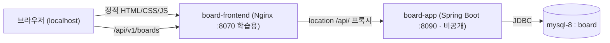
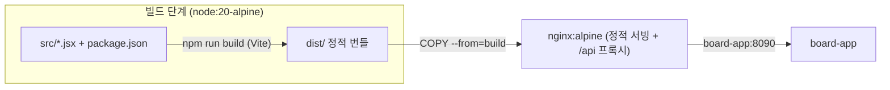

# 최소 프론트엔드 + Nginx 리버스 프록시 — 배포 실습

- **분류**: 배포 실습용 참조 문서. 백엔드 기능을 늘리지 않고, 이미 만든 API 위에 **아주 간단한 프론트(게시판 목록만)** 를 얹어 "정적 프론트 + API 백엔드"를 컨테이너로 함께 배포하는 구조를 익힌다.
- **선행**: [[DOCKER]](백엔드 이미지·compose), [[CURL-TEST]](엔드포인트 규약).
- **학습 포인트**: ① 순수 HTML/CSS/JS 정적 앱을 Nginx로 서빙, ② **Nginx 리버스 프록시로 CORS를 원천 회피**(백엔드 무수정), ③ compose에서 프론트·백엔드를 한 네트워크로 묶기, ④ 컨테이너 헬스체크의 흔한 함정(`localhost` IPv6).

---

## 1. 구조 한눈에

브라우저는 **오직 프론트(Nginx) 한 곳**만 바라본다. `/api/`로 시작하는 요청만 Nginx가 백엔드로 넘겨주므로, 브라우저 입장에선 프론트와 API가 **같은 origin**이라 CORS가 필요 없다.



이 방식의 핵심은 **백엔드를 건드리지 않는 것**이다. 백엔드엔 CORS 설정이 없지만, 프록시가 same-origin으로 만들어 주므로 그대로 동작한다.

> [!NOTE]
> 실제 배포(committed compose)에서 **백엔드(`board-app:8090`)는 host에 포트를 publish하지 않아 외부에서 직접 접근할 수 없다.** `board-app:8090`은 board-db-net 안에서 Nginx가 프록시하는 **내부 주소**일 뿐이며, 공개 진입점은 프론트뿐이다. ~~React 프론트가 host 80(공개 진입점·메인)~~ 순수 JS 프론트는 **8070**(학습·비교용 — 서버 방화벽을 열지 않으면 외부에서 접근 불가)으로 노출된다. 기존 8071 포트는 폐지됐다(자세한 배포 구조는 [[DEPLOY-LIGHTSAIL]]).
>
> **HTTPS 도입 후 변경**: 공개 진입점은 **caddy(80/443, `https://sbs.alldayai.org`)** 가 됐고, React 프론트도 백엔드처럼 **호스트 포트 없는 내부 전용**이 됐다(caddy → react nginx → board-app). 양 프론트 nginx의 `X-Forwarded-Proto/Port`는 `$scheme` 덮어쓰기 대신 **map 승계 방식**으로 바뀌었다 — 다단 프록시에서 원 스킴이 지워지는 함정 때문. 전말은 [[HTTPS-DOMAIN]] §10.

관련 파일(모두 `frontend/`): `index.html`, `styles.css`, `app.js`, `nginx.conf`, `Dockerfile`. compose에는 `frontend` 서비스가 추가된다.

---

## 2. 프론트 정적 파일

기능은 **게시판 목록 표시** 하나로 좁혔다. `app.js`는 상대경로 `/api/v1/boards`를 호출한다(호스트·포트를 하드코딩하지 않음 → 프록시가 처리).

```javascript
// app.js — 핵심만
const API_BOARDS = "/api/v1/boards";   // 상대경로 → Nginx가 백엔드로 프록시

async function loadBoards() {
  const res = await fetch(API_BOARDS, { headers: { Accept: "application/json" } });
  if (!res.ok) throw new Error(`서버 응답 오류 (HTTP ${res.status})`);
  const boards = await res.json();     // [{id, name, description, createdAt}]
  renderBoards(boards);
}
```

- **XSS 방지**: 게시판 이름·설명은 `innerHTML`이 아니라 `textContent`로만 넣는다(사용자 데이터를 마크업으로 해석하지 않도록).
- **상태 처리**: 로딩 / 에러 / 비어있음 / 목록을 각각 표시(실습용 최소 UX).
- 응답 필드는 [[CURL-TEST]]의 `GET /api/v1/boards` 규약과 동일: `id`, `name`, `description`, `createdAt`.

---

## 3. Nginx 설정 — 정적 서빙 + `/api` 프록시

```nginx
server {
  listen 80;
  server_name _;

  # 변수 proxy_pass를 위한 도커 내장 DNS. 정적 proxy_pass는 기동 시 1회만 IP를 해석해
  # 백엔드만 재생성되는 배포 후 502가 난다(§7-2) — 변수를 쓰면 요청마다 재해석한다.
  resolver 127.0.0.11 valid=10s ipv6=off;
  set $backend board-app:8090;

  root /usr/share/nginx/html;
  index index.html;

  location / {
    try_files $uri $uri/ /index.html;   # 정적 파일 서빙
  }

  location /api/ {
    proxy_pass http://$backend;         # 뒤에 경로(/)를 붙이지 않아 원본 URI 그대로 전달
    proxy_http_version 1.1;
    proxy_set_header Host $host;
    proxy_set_header X-Real-IP $remote_addr;
    proxy_set_header X-Forwarded-For $proxy_add_x_forwarded_for;
    proxy_set_header X-Forwarded-Proto $scheme;
  }
}
```

핵심 세 가지:

- **`proxy_pass http://$backend;` 에 경로를 붙이지 않는다.** 붙이면(`.../`) `/api/` 접두어가 잘려 백엔드 라우트(`/api/v1/...`)와 어긋난다. 경로 없이 두면 원본 URI(`/api/v1/boards`)가 그대로 전달된다.
- **`$backend`의 값 `board-app:8090`에서 `board-app`은 컨테이너명**이다. 같은 docker 네트워크(`board-db-net`)에 있으면 docker DNS가 이 이름을 백엔드 컨테이너 IP로 해석한다.
- **호스트명을 정적으로 쓰지 않고 `resolver` + 변수로 둔다.** 백엔드 컨테이너만 재생성되는 배포 후 옛 IP를 계속 쓰는 502 함정을 피하기 위해서다 — 자세한 발견 경위와 원리는 §7-2.

> [!NOTE]
> 실제 배포에선 두 프론트의 `nginx.conf` 모두 `/api/` 외에 **`/oauth2/`·`/login/oauth2/`도 백엔드로 프록시**한다. 백엔드가 비공개라, 소셜 로그인 개시·콜백을 프론트가 대신 중계해야 브라우저가 로그인 흐름을 탈 수 있기 때문이다(`X-Forwarded-Host`로 백엔드의 `redirect_uri`를 공개 주소로 맞춘다). 상세는 [[DEPLOY-LIGHTSAIL]] §10 참고. 메인 진입점인 **React 프론트(`frontend-react/`, 80)의 Nginx도 동일한 oauth 프록시를 가지며**, 순수 JS 프론트(8070)와 같은 프록시 구조다.

---

## 4. 프론트 Dockerfile

순수 정적이라 빌드 단계가 없다. 경량 Nginx 이미지에 설정과 파일만 얹는다.

```dockerfile
FROM nginx:1.27-alpine
COPY nginx.conf /etc/nginx/conf.d/default.conf   # 기본 서버 설정 교체
COPY index.html styles.css app.js /usr/share/nginx/html/
EXPOSE 80
CMD ["nginx", "-g", "daemon off;"]
```

---

## 5. compose에 frontend 추가

기존 [[DOCKER]] 모드 B(기존 mysql-8 브리지) compose에 `frontend` 서비스를 더한다.

```yaml
  frontend:
    build:
      context: ./frontend
      dockerfile: Dockerfile
    image: board-frontend:latest
    container_name: board-frontend
    depends_on:
      app:
        condition: service_healthy   # 백엔드가 응답 가능해진 뒤 노출
    ports:
      - "8070:80"                     # 학습·비교용(서버 방화벽을 열지 않으면 외부 비공개)
    networks:
      - board-db-net                  # board-app 과 같은 네트워크라야 컨테이너명 프록시가 됨
    healthcheck:
      test: ["CMD", "wget", "-qO-", "http://127.0.0.1/"]
      interval: 10s
      timeout: 5s
      retries: 6
      start_period: 10s
    restart: unless-stopped
```

- **`networks: board-db-net`** 가 필수다. 이 네트워크에 있어야 Nginx가 `board-app`을 이름으로 찾는다.
- **`depends_on: condition: service_healthy`**: 백엔드 헬스체크 통과 후 프론트를 띄운다.

---

## 6. 실행과 검증

```bash
docker compose up -d --build        # app + frontend 함께
docker compose ps                   # 상태 확인
# 브라우저: http://localhost:8070  (순수 JS — 학습·비교용)
```

실측 검증 결과:

| 확인 | 결과 |
|---|---|
| 정적 서빙 | `GET http://localhost:8070/` → 200, `<title>게시판 — 배포 실습</title>` |
| 정적 자산 | `styles.css` / `app.js` → 200 |
| API 프록시 | `GET http://localhost:8070/api/v1/boards` → 200, 백엔드의 board 목록 JSON 반환 |
| 컨테이너 | `board-frontend`(healthy), `board-app`(healthy) 동시 기동 |

---

## 7. 함정 메모

### 7-1. 헬스체크 `localhost`는 IPv6로 샌다

처음엔 헬스체크를 `wget http://localhost/`로 뒀더니 계속 `starting`에서 멈추고 `Connection refused`가 났다. 원인:

> 컨테이너 안에서 `localhost`는 **`::1`(IPv6)로 먼저 해석**되는데, Nginx는 `listen 80;`(IPv4)만 바인딩한다 → IPv6로 연결 시도 → 거부.

호스트에서 `curl localhost:8070`은 잘 되므로 헷갈리기 쉽다(호스트→컨테이너 포워딩은 IPv4). **컨테이너 내부 헬스체크는 `http://127.0.0.1/`로 명시**해 해결했다. (대안: nginx에 `listen [::]:80;`도 추가.)

### 7-2. 백엔드만 재생성되는 배포 후 502

단계 15 배포에서 발견했다([[REDIS-TOKEN]] §H). GHCR pull 배포로 **백엔드 컨테이너만 재생성**되자, 멀쩡히 떠 있는 프론트가 `/api` 요청마다 502를 냈다. 원인:

> `proxy_pass http://board-app:8090;` 처럼 호스트명을 **정적으로** 쓰면 nginx는 **기동 시 1회만** DNS를 해석해 IP를 캐시한다. 백엔드가 재생성되며 새 IP를 받으면 nginx는 여전히 옛 IP로 연결을 시도한다 → 502.

**`resolver 127.0.0.11`(도커 내장 DNS) + `set $backend ...` 변수 + `proxy_pass http://$backend`** 로 바꿔 해결했다(§3) — proxy_pass에 변수가 들어가면 nginx가 요청마다 resolver로 재해석해 새 IP를 따라간다. 프론트 재기동 없이 백엔드만 갈아끼우는 배포가 안전해진다.

---

## 8. 운영 전환 시

이 구성은 실습용 최소본이다. 실서비스로 올릴 때 고려할 것:

| 항목 | 실습(현재) | 운영 |
|---|---|---|
| 프론트 포트 | HTTP 80 | 443(HTTPS) + 인증서(TLS 종료를 Nginx에서) |
| 정적 캐시 | 5분(짧게) | 파일 해시 기반 장기 캐시 + `Cache-Control` 세분화 |
| 프록시 경로 | `/api/` 단순 프록시 | 타임아웃·버퍼·에러 페이지·요청 크기 제한 추가 |
| 빌드 | 정적 파일 그대로 | 번들러(빌드 단계)로 minify·해시 파일명 |
| 보안 헤더 | 미설정 | CSP·HSTS 등(백엔드 [[FILE-UPLOAD]] 보안헤더와 역할 분담) |

> [!NOTE]
> 백엔드에 CORS를 직접 열지 않은 것은 의도다. 리버스 프록시로 same-origin을 만들면 CORS 설정 없이도 되고, 이는 실제 배포에서 가장 흔한 구조다. 프론트를 백엔드와 다른 도메인에서 직접 호출해야 하는 경우에만 백엔드 CORS 설정을 검토한다.

---

## 9. React(Vite) 변형 — `frontend-react/` (구현 동일, 빌드만 추가)

같은 화면(게시판 목록)을 React로도 구현해 나란히 배포한다. **배포 방식(Nginx 리버스 프록시)과 API 연동은 완전히 동일**하고, 차이는 딱 하나 — **React는 빌드 단계가 필요**하다는 점이다. 그래서 Dockerfile이 멀티스테이지가 된다.

> [!NOTE]
> 이 절의 "게시판 목록만"은 **배포 실습 시점** 기준이다. 이후 React 프론트(`frontend-react/`)는 **로그인/회원가입/로그아웃(access token은 메모리, refresh는 httpOnly 쿠키, 401 시 자동 재발급), 글 작성(multipart)·상세, 댓글/대댓글, 반응(좋아요/싫어요), 소셜 로그인 버튼(카카오·구글)** 까지 갖춘 백엔드 테스트 SPA로 확장됐다. 배포 아키텍처(멀티스테이지 빌드 + Nginx 프록시)는 그대로다 — 소셜 로그인 처리 방식은 [[DEPLOY-LIGHTSAIL]] §10 참고.



핵심 차이는 Dockerfile의 build 스테이지뿐이다:

```dockerfile
# ── build stage: JSX/모듈 → 정적 번들 ──
FROM node:20-alpine AS build
WORKDIR /app
COPY package.json package-lock.json* ./
RUN npm install
COPY . .
RUN npm run build                 # → /app/dist

# ── runtime stage: 순수 JS 버전과 동일 ──
FROM nginx:1.27-alpine
COPY nginx.conf /etc/nginx/conf.d/default.conf
COPY --from=build /app/dist /usr/share/nginx/html
```

- **`nginx.conf` 는 순수 JS 버전과 사실상 동일**(정적 서빙 + `/api/` → `board-app:8090` 프록시). React 라우팅 대비로 `try_files ... /index.html` SPA 폴백만 의미가 커진다.
- **`App.jsx` 도 로직 동일**: 상대경로 `/api/v1/boards`를 `fetch` → 상태(로딩/에러/빈목록/목록) 렌더. React는 `{board.name}` 을 기본 이스케이프하므로 XSS도 자동 안전(순수 JS의 `textContent`와 같은 효과).
- **개발 편의**: `vite.config.js`에 dev 서버 프록시(`/api` → `localhost:8090`)를 둬서 `npm run dev` 로컬 개발도 same-origin으로 된다(컨테이너 배포에선 이 프록시가 아니라 Nginx가 담당).

compose에는 `frontend-react` 서비스를 **80(공개 진입점·메인)** 으로 추가한다(순수 JS 프론트는 host **8070** 학습·비교용, 백엔드 `board-app:8090`은 host publish 없는 내부 전용):

```yaml
  frontend-react:
    build:
      context: ./frontend-react
      dockerfile: Dockerfile
    image: board-frontend-react:latest
    container_name: board-frontend-react
    depends_on:
      app:
        condition: service_healthy
    ports:
      - "80:80"                       # 공개 진입점(메인)
    networks:
      - board-db-net
    healthcheck:
      test: ["CMD", "wget", "-qO-", "http://127.0.0.1/"]   # localhost→IPv6 함정 회피(§7)
      interval: 10s
      timeout: 5s
      retries: 6
      start_period: 10s
    restart: unless-stopped
```

### 순수 JS vs React 비교

| 항목 | `frontend/` (순수 JS) | `frontend-react/` (React·Vite) |
|---|---|---|
| 포트 | 8070 (학습용) | 80 (메인) |
| Dockerfile | 단일 스테이지(nginx에 파일 얹기) | **멀티스테이지**(node 빌드 → nginx) |
| 빌드 도구 | 없음 | Vite (npm install + build) |
| 이미지에 들어가는 것 | 원본 HTML/CSS/JS 그대로 | **번들·minify된 `dist/`**(해시 파일명) |
| 배포·API 연동 | Nginx 리버스 프록시 | **동일** |
| XSS 방지 | `textContent` 수동 | JSX 기본 이스케이프 |

> [!TIP]
> 두 프론트가 **같은 백엔드·같은 네트워크·같은 프록시 방식**을 공유하고 포트만 다르다는 점이 학습 포인트다. "정적 파일을 어떻게 만드느냐(빌드 유무)"만 다를 뿐, 배포 아키텍처는 프레임워크와 무관하게 동일하다.

**실측 검증(80)**: 정적 `GET /` 200(`<div id="root">` + 해시 번들 `/assets/index-*.js` 200), `/api/v1/boards` 프록시 200(board 목록 반환), 컨테이너 healthy. `board-app`(비공개)·`board-frontend`(8070)·`board-frontend-react`(80) 3개 동시 기동 확인.

---

## 10. 두 프론트의 Nginx 설정 비교

결론부터: **두 `nginx.conf`는 거의 같다.** `listen`/`root`/`index`/`location /`(SPA 폴백)/`location /api/`(프록시)는 **완전히 동일**하고, **기능적 차이는 정적 자산 캐시 블록 딱 하나**다. 그 차이도 nginx 자체가 아니라 "정적 산출물을 어떻게 만드느냐(빌드 유무)"에서 파생된다.

### 10-1. 유일한 실질 차이 — 정적 자산 캐시 location

| | `frontend/` (순수 JS) | `frontend-react/` (React·Vite) |
|---|---|---|
| 캐시 블록 | `location ~* \.(css\|js)$` | `location /assets/` |
| 매칭 방식 | **확장자 정규식**(`.css`/`.js`) | **경로 접두어**(`/assets/` 하위) |
| 왜 다른가 | 자산이 문서 루트에 **평면 배치** | Vite가 자산을 **`/assets/` 아래**에 모음 |

이유는 **빌드 산출물 구조**가 다르기 때문이다(실측):

```
frontend/       (빌드 없음, 원본 그대로)      frontend-react/ (Vite 빌드)
  index.html                                    index.html
  app.js         ← 루트에 평면                   assets/
  styles.css     ← 루트에 평면                     index-CNc_kvD6.js    ← 해시 파일명
                                                  index-Ce1SRHoD.css   ← 해시 파일명
```

- 순수 JS는 `app.js`·`styles.css`가 **루트에 그대로** 있으니, 확장자로 잡는 `~* \.(css|js)$` 가 자연스럽다.
- React(Vite)는 번들 파일이 **`/assets/` 아래에 해시 파일명**으로 생기니, `location /assets/` 접두어로 통째 잡는 게 자연스럽다.

### 10-2. 동일한 부분 (프레임워크 무관)

```nginx
listen 80;

resolver 127.0.0.11 valid=10s ipv6=off;   # 두 파일 모두 동일(변수 proxy_pass용 — §7-2)
set $backend board-app:8090;

root /usr/share/nginx/html;
index index.html;

location / {
  try_files $uri $uri/ /index.html;   # 두 파일 모두 동일(SPA 폴백)
}

location /api/ {
  proxy_pass http://$backend;         # 두 파일 모두 동일(경로 미부착 → 원본 URI 유지)
  proxy_set_header Host $host;
  proxy_set_header X-Real-IP $remote_addr;
  proxy_set_header X-Forwarded-For $proxy_add_x_forwarded_for;
  proxy_set_header X-Forwarded-Proto $scheme;
}
```

**배포·API 연동의 뼈대는 프레임워크와 무관하게 같다** — 이게 핵심이다. 나머지 diff는 전부 주석 문구 차이일 뿐 동작에 영향이 없다.

### 10-3. `try_files … /index.html` (SPA 폴백)의 의미 차이

문법은 둘 다 같지만 **중요도가 다르다.**

- 순수 JS: 현재 단일 페이지라 폴백이 발동할 일이 거의 없다(있어도 무해).
- React: 지금은 라우팅이 없지만, **클라이언트 라우팅(react-router 등)을 도입하면 필수**가 된다. `/boards/1` 같은 경로로 새로고침하면 서버엔 그 파일이 없어 404가 나는데, `/index.html`로 폴백해야 React가 그 경로를 그려낸다.

### 10-4. 운영 캐시 전략 (참고)

실습용이라 둘 다 `expires 5m`로 짧게 뒀지만, 운영에선 **산출물 구조 차이가 캐시 전략 차이로** 이어진다.

| | 순수 JS | React(Vite) |
|---|---|---|
| 파일명 | 고정(`app.js`) | **해시 포함**(`index-CNc_kvD6.js`) |
| 권장 캐시 | 짧게 or `no-cache`(파일명이 안 바뀌어 갱신 감지 필요) | **`immutable`, 1년 장기 캐시**(내용 바뀌면 해시=파일명이 바뀌어 자동 무효화) |
| `index.html` | — | **`no-cache`**(항상 최신 해시 참조를 받도록) |

> [!TIP]
> "해시 파일명 + index.html no-cache + 자산 immutable 장기 캐시"는 번들러 기반 프론트의 표준 캐시 패턴이다. 순수 JS는 파일명이 고정이라 이 자동 무효화를 못 쓰므로, 갱신 반영을 위해 캐시를 짧게 두거나 쿼리스트링 버전(`app.js?v=2`)을 쓴다.
