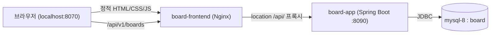

# 최소 프론트엔드 + Nginx 리버스 프록시 — 배포 실습

- **분류**: 배포 실습용 참조 문서. 백엔드 기능을 늘리지 않고, 이미 만든 API 위에 **아주 간단한 프론트(게시판 목록만)** 를 얹어 "정적 프론트 + API 백엔드"를 컨테이너로 함께 배포하는 구조를 익힌다.
- **선행**: [[DOCKER]](백엔드 이미지·compose), [[CURL-TEST]](엔드포인트 규약).
- **학습 포인트**: ① 순수 HTML/CSS/JS 정적 앱을 Nginx로 서빙, ② **Nginx 리버스 프록시로 CORS를 원천 회피**(백엔드 무수정), ③ compose에서 프론트·백엔드를 한 네트워크로 묶기, ④ 컨테이너 헬스체크의 흔한 함정(`localhost` IPv6).

---

## 1. 구조 한눈에

브라우저는 **오직 프론트(Nginx) 한 곳**만 바라본다. `/api/`로 시작하는 요청만 Nginx가 백엔드로 넘겨주므로, 브라우저 입장에선 프론트와 API가 **같은 origin**이라 CORS가 필요 없다.



이 방식의 핵심은 **백엔드를 건드리지 않는 것**이다. 백엔드엔 CORS 설정이 없지만, 프록시가 same-origin으로 만들어 주므로 그대로 동작한다.

관련 파일(모두 `frontend/`): `index.html`, `styles.css`, `app.js`, `nginx.conf`, `Dockerfile`. compose에는 `frontend` 서비스가 추가된다.

---

## 2. 프론트 정적 파일

기능은 **게시판 목록 표시** 하나로 좁혔다. `app.js`는 상대경로 `/api/v1/boards`를 호출한다(호스트·포트를 하드코딩하지 않음 → 프록시가 처리).

```javascript
// app.js — 핵심만
const API_BOARDS = "/api/v1/boards";   // 상대경로 → Nginx가 백엔드로 프록시

async function loadBoards() {
  const res = await fetch(API_BOARDS, { headers: { Accept: "application/json" } });
  if (!res.ok) throw new Error(`서버 응답 오류 (HTTP ${res.status})`);
  const boards = await res.json();     // [{id, name, description, createdAt}]
  renderBoards(boards);
}
```

- **XSS 방지**: 게시판 이름·설명은 `innerHTML`이 아니라 `textContent`로만 넣는다(사용자 데이터를 마크업으로 해석하지 않도록).
- **상태 처리**: 로딩 / 에러 / 비어있음 / 목록을 각각 표시(실습용 최소 UX).
- 응답 필드는 [[CURL-TEST]]의 `GET /api/v1/boards` 규약과 동일: `id`, `name`, `description`, `createdAt`.

---

## 3. Nginx 설정 — 정적 서빙 + `/api` 프록시

```nginx
server {
  listen 80;
  server_name _;

  root /usr/share/nginx/html;
  index index.html;

  location / {
    try_files $uri $uri/ /index.html;   # 정적 파일 서빙
  }

  location /api/ {
    proxy_pass http://board-app:8090;   # 뒤에 경로(/)를 붙이지 않아 원본 URI 그대로 전달
    proxy_http_version 1.1;
    proxy_set_header Host $host;
    proxy_set_header X-Real-IP $remote_addr;
    proxy_set_header X-Forwarded-For $proxy_add_x_forwarded_for;
    proxy_set_header X-Forwarded-Proto $scheme;
  }
}
```

핵심 두 가지:

- **`proxy_pass http://board-app:8090;` 에 경로를 붙이지 않는다.** 붙이면(`.../`) `/api/` 접두어가 잘려 백엔드 라우트(`/api/v1/...`)와 어긋난다. 경로 없이 두면 원본 URI(`/api/v1/boards`)가 그대로 전달된다.
- **`board-app` 은 컨테이너명**이다. 같은 docker 네트워크(`board-db-net`)에 있으면 docker DNS가 이 이름을 백엔드 컨테이너 IP로 해석한다.

---

## 4. 프론트 Dockerfile

순수 정적이라 빌드 단계가 없다. 경량 Nginx 이미지에 설정과 파일만 얹는다.

```dockerfile
FROM nginx:1.27-alpine
COPY nginx.conf /etc/nginx/conf.d/default.conf   # 기본 서버 설정 교체
COPY index.html styles.css app.js /usr/share/nginx/html/
EXPOSE 80
CMD ["nginx", "-g", "daemon off;"]
```

---

## 5. compose에 frontend 추가

기존 [[DOCKER]] 모드 B(기존 mysql-8 브리지) compose에 `frontend` 서비스를 더한다.

```yaml
  frontend:
    build:
      context: ./frontend
      dockerfile: Dockerfile
    image: board-frontend:latest
    container_name: board-frontend
    depends_on:
      app:
        condition: service_healthy   # 백엔드가 응답 가능해진 뒤 노출
    ports:
      - "8070:80"                     # 호스트 8080은 점유 중이라 8070 사용
    networks:
      - board-db-net                  # board-app 과 같은 네트워크라야 컨테이너명 프록시가 됨
    healthcheck:
      test: ["CMD", "wget", "-qO-", "http://127.0.0.1/"]
      interval: 10s
      timeout: 5s
      retries: 6
      start_period: 10s
    restart: unless-stopped
```

- **`networks: board-db-net`** 가 필수다. 이 네트워크에 있어야 Nginx가 `board-app`을 이름으로 찾는다.
- **`depends_on: condition: service_healthy`**: 백엔드 헬스체크 통과 후 프론트를 띄운다.

---

## 6. 실행과 검증

```bash
docker compose up -d --build        # app + frontend 함께
docker compose ps                   # 상태 확인
# 브라우저: http://localhost:8070
```

실측 검증 결과:

| 확인 | 결과 |
|---|---|
| 정적 서빙 | `GET http://localhost:8070/` → 200, `<title>게시판 — 배포 실습</title>` |
| 정적 자산 | `styles.css` / `app.js` → 200 |
| API 프록시 | `GET http://localhost:8070/api/v1/boards` → 200, 백엔드의 board 목록 JSON 반환 |
| 컨테이너 | `board-frontend`(healthy), `board-app`(healthy) 동시 기동 |

---

## 7. 함정 메모 — 헬스체크 `localhost`는 IPv6로 샌다

처음엔 헬스체크를 `wget http://localhost/`로 뒀더니 계속 `starting`에서 멈추고 `Connection refused`가 났다. 원인:

> 컨테이너 안에서 `localhost`는 **`::1`(IPv6)로 먼저 해석**되는데, Nginx는 `listen 80;`(IPv4)만 바인딩한다 → IPv6로 연결 시도 → 거부.

호스트에서 `curl localhost:8070`은 잘 되므로 헷갈리기 쉽다(호스트→컨테이너 포워딩은 IPv4). **컨테이너 내부 헬스체크는 `http://127.0.0.1/`로 명시**해 해결했다. (대안: nginx에 `listen [::]:80;`도 추가.)

---

## 8. 운영 전환 시

이 구성은 실습용 최소본이다. 실서비스로 올릴 때 고려할 것:

| 항목 | 실습(현재) | 운영 |
|---|---|---|
| 프론트 포트 | HTTP 8070 | 443(HTTPS) + 인증서(TLS 종료를 Nginx에서) |
| 정적 캐시 | 5분(짧게) | 파일 해시 기반 장기 캐시 + `Cache-Control` 세분화 |
| 프록시 경로 | `/api/` 단순 프록시 | 타임아웃·버퍼·에러 페이지·요청 크기 제한 추가 |
| 빌드 | 정적 파일 그대로 | 번들러(빌드 단계)로 minify·해시 파일명 |
| 보안 헤더 | 미설정 | CSP·HSTS 등(백엔드 [[FILE-UPLOAD]] 보안헤더와 역할 분담) |

> [!NOTE]
> 백엔드에 CORS를 직접 열지 않은 것은 의도다. 리버스 프록시로 same-origin을 만들면 CORS 설정 없이도 되고, 이는 실제 배포에서 가장 흔한 구조다. 프론트를 백엔드와 다른 도메인에서 직접 호출해야 하는 경우에만 백엔드 CORS 설정을 검토한다.
