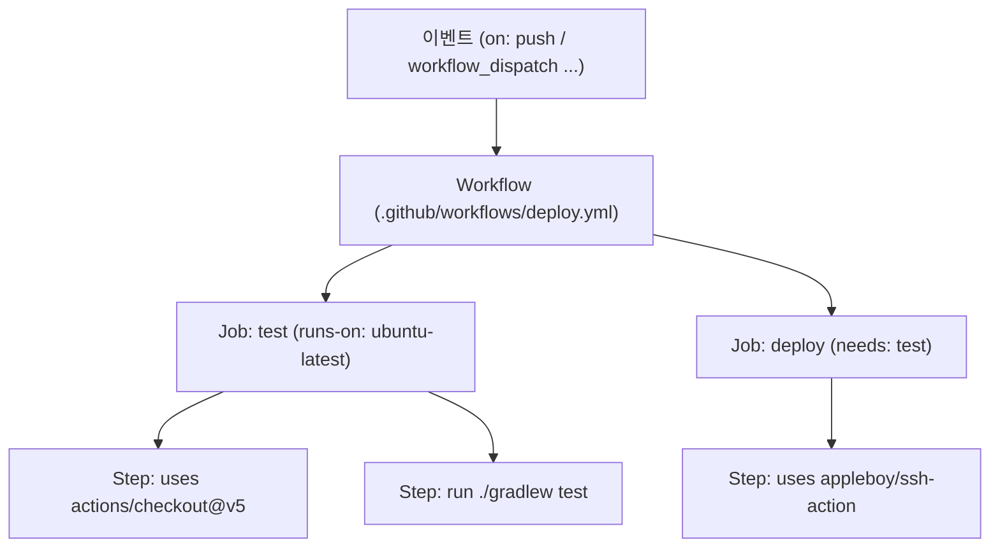

# GitHub Actions 요약 — 개념 · 키워드 · 명령 · 장단점

- **분류**: CI/CD 개념 참조 문서. 이 프로젝트의 실제 배포 워크플로([[CICD-GITHUB-ACTIONS]], `.github/workflows/deploy.yml`)를 예제로 GitHub Actions의 기본기를 정리한다.
- **한 줄 정의**: **저장소에서 일어나는 이벤트(push·PR·수동 실행 등)에 반응해, 정의해 둔 작업(빌드·테스트·배포 등)을 자동 실행**하는 GitHub 내장 CI/CD 플랫폼.

---

## 1. GitHub Actions란

- 워크플로를 **YAML 파일**(`.github/workflows/*.yml`)로 저장소에 두면, GitHub이 **이벤트가 발생할 때 자동으로** 그 작업을 실행한다.
- "**설정을 코드로**(as-code)" — 파이프라인이 저장소에 버전관리되고 PR로 리뷰된다.
- 실행은 **러너(runner)** 라는 임시 VM에서 이뤄진다(매번 깨끗한 상태로 시작).

우리 프로젝트 예: `main`에 push → 테스트(H2) → 통과 시 Lightsail에 SSH 배포.

---

## 2. 계층 구조 (핵심 골격)



- **Workflow ⊃ Job ⊃ Step** 이고, Step은 **`uses`(액션 실행)** 또는 **`run`(셸 명령)** 둘 중 하나다.
- 여러 Job은 기본적으로 **병렬**, `needs:` 로 순서를 준다.
- 각 Job은 **서로 다른 러너**에서 돈다(파일시스템 공유 안 됨 → 공유하려면 artifact/cache).

---

## 3. "Action"이란 무엇인가

**Action = 재사용 가능한 작업 단위(패키지)**. `uses:` 로 불러 쓴다. 남이 GitHub에 공개한 저장소를 그대로 가져다 쓰는 것이다.

```yaml
uses: actions/checkout@v5      # <소유자>/<저장소>@<버전>
```

- `actions/checkout` = `github.com/actions/checkout` (GitHub 공식). 저장소 코드를 러너로 내려받는다.
- **버전 핀(`@`)**: 태그(`@v5`) · 브랜치(`@main`, 비권장) · 커밋 SHA(`@a1b2…`, 가장 안전).
- **Marketplace**(github.com/marketplace/actions)에서 수천 개 공개 액션을 찾는다.
- **액션의 3가지 유형**:
  | 유형 | 설명 | 예 |
  |---|---|---|
  | JavaScript | Node로 실행. 빠름 | `actions/checkout`, `actions/setup-java` |
  | Docker container | 컨테이너로 실행. 언어 자유 | 리눅스 전용 도구 |
  | Composite | 여러 step을 하나로 묶은 액션 | 사내 공통 스텝 재사용 |

우리 파일의 액션 3개: `actions/checkout@v5`, `actions/setup-java@v5`, `appleboy/ssh-action@v1.2.0`.

---

## 4. 핵심 키워드 (용어 사전)

| 키워드 | 뜻 | 우리 deploy.yml에서 |
|---|---|---|
| **workflow** | 자동화 단위. `.github/workflows/*.yml` 한 파일 | `Deploy to Lightsail` |
| **event / trigger (`on`)** | 워크플로를 언제 돌릴지 | `push`(main) · `workflow_dispatch` |
| **job** | 한 러너에서 도는 스텝 묶음 | `test`, `deploy` |
| **runs-on** | 러너 종류 지정 | `ubuntu-latest` |
| **step** | 잡 안의 한 단계 | 체크아웃·JDK설치·gradle test |
| **`uses`** | 재사용 액션 실행 | `actions/checkout@v5` |
| **`run`** | 셸 명령 직접 실행 | `./gradlew test` |
| **`needs`** | 잡 의존(선행 잡 성공 후 실행) | `deploy: needs: test` |
| **runner** | 작업이 도는 임시 VM | GitHub-hosted(무료 할당) / self-hosted |
| **secret** | 암호화 저장되는 비밀값(로그 자동 마스킹) | `secrets.LIGHTSAIL_SSH_KEY` |
| **variable** | 비밀 아닌 설정값(`vars.*`) | — |
| **`env`** | 환경변수 지정(step/job/workflow 범위) | 배포 스텝에 Secrets 노출 |
| **context / 식(`${{ }}`)** | 실행 중 값 참조 | `${{ secrets.* }}`, `${{ github.ref_name }}` |
| **concurrency** | 동시 실행 제어(겹치면 취소) | `group: deploy-lightsail` |
| **matrix** | 한 잡을 여러 조합(OS·버전)으로 병렬 | (미사용) |
| **artifact** | 잡 산출물 업/다운로드(잡 간 전달·보관) | (미사용) |
| **cache** | 의존성 캐시로 재실행 가속 | `setup-java`의 `cache: gradle` |
| **permissions** | `GITHUB_TOKEN` 권한 범위 | (기본) |
| **environment** | 배포 대상(승인·보호규칙 부여 가능) | (미사용) |
| **`paths-ignore` / `paths`** | 특정 파일 변경만/제외 트리거 | 문서 커밋은 배포 제외 |

---

## 5. 자주 쓰는 명령

### 5-1. 워크플로 파일 안에서 (`run:` 스텝)

`run:` 은 그냥 셸이라 임의 명령을 쓴다. 특수 기능:

```bash
echo "결과=42" >> "$GITHUB_OUTPUT"   # 스텝 출력(다음 스텝에서 참조)
echo "PATHVAR" >> "$GITHUB_PATH"     # PATH 추가
echo "::group::제목"                  # 로그 접기 그룹
echo "::notice::메시지"               # 주석/경고/에러 애노테이션(::warning, ::error)
echo "KEY=val" >> "$GITHUB_ENV"      # 이후 스텝 환경변수
```

### 5-2. 로컬에서 `gh` CLI로 제어

| 명령 | 하는 일 |
|---|---|
| `gh workflow list` | 워크플로 목록 |
| `gh workflow run deploy.yml` | 수동 실행(workflow_dispatch) |
| `gh workflow enable/disable <이름>` | 활성/비활성 |
| `gh run list --workflow=deploy.yml` | 실행 이력 |
| `gh run watch <ID>` | 실행 실시간 추적 |
| `gh run view <ID> --log` / `--log-failed` | 전체/실패 로그 |
| `gh run rerun <ID>` / `gh run cancel <ID>` | 재실행 / 취소 |
| `gh run download <ID>` | artifact 내려받기 |
| `gh secret set NAME` / `gh secret list` | Secret 등록 / 목록 |
| `gh variable set NAME` / `gh variable list` | 변수 등록 / 목록 |

우리 배포 검증도 이걸로 했다: `gh run watch <ID> --exit-status` → `gh run view <ID> --log`.

---

## 6. 장점과 단점

### 장점

- **GitHub와 완전 통합**: 코드·PR·이슈·릴리스와 한 곳. 별도 CI 서버 붙일 필요 없음.
- **파이프라인 as-code**: 워크플로가 저장소에 버전관리·리뷰된다.
- **관리형 러너**: 인프라 유지보수 불필요(Linux·Windows·macOS 제공).
- **방대한 Marketplace**: 검증된 액션 재사용으로 작성량 최소화.
- **이벤트 다양성**: push·PR·schedule(크론)·수동·외부(webhook)·릴리스 등.
- **Secret 관리 내장**: 암호화 저장 + 로그 자동 마스킹.
- **매트릭스 병렬**: 여러 OS/버전 조합을 한 번에.
- **비용**: 공개 저장소는 사실상 무료, 사설도 월 무료 할당 제공.

### 단점

- **벤더 종속(lock-in)**: GitHub 밖으로 옮기기 어렵다(문법 비호환).
- **로컬 재현이 어렵다**: 디버깅이 "고치고 push→로그 확인" 루프라 느리다(`act` 같은 도구가 있으나 완전 동일하진 않음).
- **복잡해지면 YAML이 장황**: 조건·매트릭스·재사용이 얽히면 가독성·유지보수 부담.
- **비용(사설/대형 빌드)**: 분 단위 과금 + macOS 러너는 비싸다.
- **공급망 보안 리스크**: 서드파티 액션이 Secret에 접근 가능 → 신뢰·**SHA 핀** 필요.
- **상태 없는 러너**: 매번 클린 → 캐시를 명시적으로 설정해야 빠르다.
- **self-hosted 러너**: 성능·특수환경엔 좋지만 보안·관리 부담을 떠안는다.

---

## 7. 대안과의 한 줄 비교

| 도구 | 특징 |
|---|---|
| **GitHub Actions** | GitHub 통합, 관리형, Marketplace. GitHub 저장소면 1순위 |
| **GitLab CI** | GitLab 통합. `.gitlab-ci.yml`. self-managed에 강함 |
| **Jenkins** | 자체호스팅 최강 유연성. 플러그인 방대하나 운영 부담 큼 |
| **CircleCI / Travis** | 관리형 SaaS. Actions 등장 이후 점유율 감소 |

---

## 8. 실전 팁

- **버전 핀**: 공식 액션은 태그(`@v5`)로 충분, 보안 민감하면 커밋 SHA로 고정.
- **최소 권한**: `permissions:` 로 `GITHUB_TOKEN` 범위를 좁힌다.
- **Secret은 절대 로그로 출력 금지**(마스킹되지만 우회 노출 주의). `.pem` 등은 저장소에 커밋하지 않는다([[CICD-GITHUB-ACTIONS]] §4).
- **`needs` + 게이트**: 배포 잡은 테스트 잡을 `needs`로 걸어 실패 시 배포를 막는다.
- **`concurrency`** 로 배포 겹침 방지, **`paths-ignore`** 로 문서 커밋의 불필요한 실행 방지.
- **캐시**(`setup-*`의 `cache:`)로 의존성 다운로드를 재사용해 시간을 줄인다.

---

## 9. 더 보기

- 이 프로젝트의 실제 파이프라인·Secret 설정: [[CICD-GITHUB-ACTIONS]]
- 그 파이프라인이 배포하는 서버 세팅: [[DEPLOY-LIGHTSAIL]]
- 공식 문서: docs.github.com/actions
