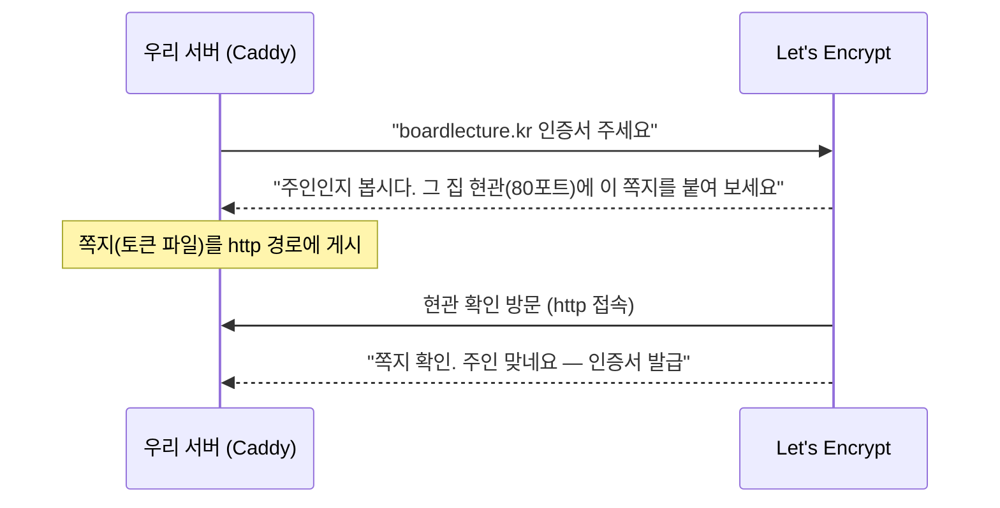
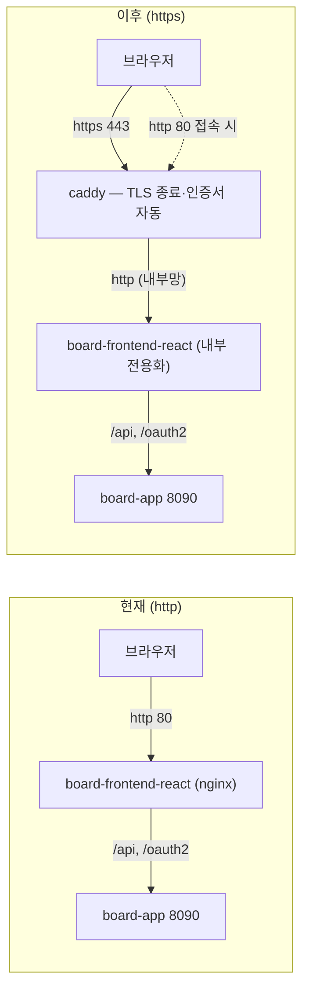

# HTTPS + 도메인 도입 설계 — Let's Encrypt로 자물쇠 달기 (계획 문서)

> **왜 이 단계인가**: 우리 서비스는 지금 `http://3.34.173.34` — 자물쇠 없는 주소다.
> 이것 때문에 **구글 로그인이 막혀 있고**(구글은 공개 서버의 http redirect를 거부),
> 비밀번호·토큰이 암호화 없이 오간다. 이 문서는 도메인 구입부터 무료 인증서(Let's
> Encrypt) 적용까지의 **설계와 계획**이다. 초보자도 따라올 수 있게 개념부터 푼다.

---

## 1. HTTPS가 뭐길래 — 봉투 없이 보내는 편지

HTTP로 오가는 데이터는 **봉투 없는 엽서**다. 중간에 지나는 누구든(같은 카페 와이파이,
통신사 장비) 내용을 읽을 수 있다. 로그인 요청이라면 **비밀번호가 그대로 보인다**.

HTTPS는 두 가지를 해결한다.

| 기능 | 비유 | 효과 |
|------|------|------|
| 암호화 | 내용을 **밀봉 봉투**에 넣는다 | 중간에서 훔쳐봐도 못 읽는다 |
| 신원 보증 | 봉투에 **공인 인감**이 찍힌다 | "진짜 그 사이트가 맞다"를 브라우저가 확인 |

그 "공인 인감"이 **인증서(certificate)** 이고, 인감을 찍어 주는 기관이
**CA(인증 기관)** 다. 우리가 쓸 CA가 바로 무료·자동화로 유명한 **Let's Encrypt**다.

**우리 프로젝트가 지금 겪는 실제 문제들**:

- 구글 OAuth: 공개 서버의 `http://` redirect URI를 거부 → **구글 로그인 불가** (카카오는 http 허용이라 동작 중)
- refresh 쿠키의 `secure` 속성을 못 켠다 → 도청 환경에서 쿠키 탈취 여지
- 브라우저 주소창의 "주의 요함" 표시 — 사용자 신뢰 문제

---

## 2. 그런데 왜 도메인이 필요한가

Let's Encrypt는 **IP 주소(3.34.173.34)에는 인증서를 발급해 주지 않는다.**
인증서는 "이 **이름**의 주인이 맞다"는 보증이라, 이름(도메인)이 먼저 있어야 한다.

도메인 = 인터넷 주소록에 등록하는 이름. `boardlecture.kr` 같은 이름을 사서
"이 이름은 3.34.173.34를 가리킨다"라고 등록(DNS A 레코드)하는 것이다.

### 도메인 준비 — 두 가지 길

| | 길 A: 유료 도메인 구입 (권장) | 길 B: DuckDNS 무료 서브도메인 |
|---|---|---|
| 무엇 | `내이름.kr`, `내이름.com` 등 | `내이름.duckdns.org` |
| 비용 | 연 1~2만원 내외 | 무료 |
| 어디서 | 가비아·후이즈(국내), Cloudflare·Namecheap(해외, 저렴) | duckdns.org 가입 후 즉시 |
| 장점 | 진짜 서비스 주소, 이후 어디에도 재사용 | 결제 없이 오늘 바로 실습 가능 |
| 단점 | 결제 필요, DNS 전파 대기(수 분~수 시간) | 남의 도메인의 세입자 — 수업 시연용 |

> [!TIP]
> 수업 시연이 목적이면 **길 B로 먼저 전 과정을 검증**하고, 마음에 드는 이름으로
> 길 A를 나중에 사서 갈아끼우는 순서가 비용·리스크 모두 최소다. 이후 설계는
> 어느 길이든 동일하게 적용된다.

### DNS 연결 (구입/가입 후 할 일)

등록 업체의 DNS 관리 화면에서 레코드 하나를 추가한다:

| 타입 | 이름(호스트) | 값 |
|------|--------------|-----|
| A | `@` (루트) 또는 원하는 서브도메인 | `3.34.173.34` |

전파 확인은 터미널에서:

```bash
dig +short 내도메인.kr
```

`3.34.173.34` 가 나오면 연결 완료다 (전파에 수 분~수 시간 걸릴 수 있다).

---

## 3. Let's Encrypt는 어떻게 공짜로 되나 — "현관 쪽지" 검증

Let's Encrypt(이하 LE)는 비영리 CA로, 발급 과정 전체가 **자동**이라 무료가 가능하다.
자동 발급 절차(ACME 프로토콜)를 비유하면:



- 이 방식이 **HTTP-01 챌린지** — "그 도메인의 서버를 실제로 조작할 수 있는 자 = 주인"
- 인증서 유효기간은 **90일**이고, 도구가 만료 전 **자동 갱신**한다 — 사람이 할 일 없음
- 그래서 **80 포트가 열려 있어야** 발급·갱신이 된다 (이미 열려 있음)

---

## 4. 도구 선택 — Caddy를 쓴다

인증서를 받아 HTTPS를 서빙하는 방법 두 가지를 비교했다.

|           | **Caddy (선택)**                  | nginx + certbot                |
| --------- | ------------------------------- | ------------------------------ |
| 인증서 발급·갱신 | **완전 자동** (설정 0줄)               | certbot 설치 + 갱신 cron 구성 필요     |
| 설정 분량     | Caddyfile 약 5줄                  | nginx ssl 블록 + certbot 연동 수십 줄 |
| 기존 구조 영향  | 기존 nginx **앞에 한 층 추가** — 내부 무변경 | 기존 react nginx 설정 대수술          |
| 교육 가치     | "TLS 종료(termination) 계층" 개념     | 인증서 파일 경로·갱신 내부 동작             |

**선택 이유**: 기존에 잘 동작하는 두 프론트 nginx(리버스 프록시 포함)를 **한 줄도 안
고치고**, 맨 앞에 "자물쇠 담당" 한 층만 세우는 구조가 가장 안전하고 수업으로도
명료하다 ("각 층은 한 가지 일만"). certbot 방식은 이론 소개로만 다룬다.

---

## 5. 목표 아키텍처

현재와 이후의 차이는 **맨 앞 한 층**뿐이다.



- **caddy**: 443(https) + 80(http→https 리다이렉트 & LE 챌린지) 담당. 인증서 자동 관리
- **frontend-react**: 호스트 80 공개를 **내려놓고** 내부망 전용이 된다 (backend와 같은 격리 원칙)
- **frontend(8070, 학습용)**: 실습 비교용이므로 당분간 유지 여부만 결정하면 됨
- 내부 구간(caddy→nginx→app)은 도커 내부망이라 http 유지 — 관례적 구성(TLS 종료)

### compose 변경 설계

```yaml
  caddy:
    image: caddy:2-alpine
    container_name: board-caddy
    ports:
      - "80:80"        # LE 챌린지 + https 리다이렉트
      - "443:443"      # 공개 진입점(신규)
    volumes:
      - ./caddy/Caddyfile:/etc/caddy/Caddyfile:ro
      - caddy-data:/data          # 인증서 보관 — 재시작에도 유지(중요)
    networks:
      - board-db-net
    restart: unless-stopped
```

`caddy/Caddyfile` 은 이게 전부다:

```
내도메인.kr {
  reverse_proxy board-frontend-react:80
}
```

도메인을 적는 것만으로 Caddy가 알아서 ① LE에 발급 요청 ② 챌린지 응대 ③ 443 서빙
④ 90일 자동 갱신 ⑤ http→https 리다이렉트까지 처리한다.

`frontend-react` 서비스에서는 `ports: - "80:80"` 을 **제거**한다(내부 전용화).

---

## 6. 파급되는 설정 변경 (전부 사전 준비된 복선 회수)

| 항목 | 변경 | 준비 상태 |
|------|------|-----------|
| refresh 쿠키 secure | compose에 `APP_REFRESH_COOKIE_SECURE: true` 환경변수 한 줄 | `app.refresh-cookie.secure` 프로퍼티로 **이미 외부화됨** — 코드 무변경 |
| redirect URI 계산 | 변경 없음 | `forward-headers-strategy: framework` + nginx `X-Forwarded-Proto` **이미 완비** — Caddy도 같은 헤더를 자동 전달 |
| 카카오 콘솔 | Redirect URI에 `https://내도메인.kr/login/oauth2/code/kakao` 추가 | 사용자 콘솔 작업 |
| 구글 콘솔 | 같은 형식의 https URI 등록 → **이 순간 구글 로그인이 처음으로 열린다** | 사용자 콘솔 작업 |
| Lightsail 방화벽 | **443 포트 개방** (누락 시 https 접속 자체가 안 됨 — 1순위 함정) | 사용자 콘솔 작업 |
| GitHub Secrets | **무변경** | 도메인은 비밀이 아님 |
| deploy.sh / CI | 무변경 (compose가 caddy도 함께 관리) | |

---

## 7. 함정·리스크 미리보기

- **LE 발급 한도**: 같은 도메인으로 **주당 5회** 실패 반복 시 잠시 차단 — 그래서
  실서버 적용 전 Caddy의 **staging(테스트용 CA) 모드로 먼저 리허설**하는 절차를 구현
  순서에 넣는다.
- **DNS 전파 전 발급 시도**: A 레코드가 퍼지기 전에 Caddy를 띄우면 챌린지 실패가
  쌓인다 — `dig` 확인 후 기동이 순서다.
- **443 방화벽 누락**: 증상이 "무한 대기"라 원인을 놓치기 쉽다.
- **secure 쿠키 전환 후 http 우회 접속**: http로 들어온 사용자는 쿠키를 못 받는다 —
  Caddy의 자동 리다이렉트가 있어 실사용자는 영향 없지만, curl 테스트 시 https를 써야
  한다(문서 갱신 대상: [[CURL-TEST]]).
- **인증서 볼륨 유실**: `caddy-data` 볼륨을 지우면 재발급 — 한도와 엮이면 곤란하므로
  프루닝 대상에서 제외 확인.

---

## 8. 구현 순서 (다음 세션 로드맵)

1. 도메인 확보(길 A 또는 B) + A 레코드 등록 → `dig` 로 전파 확인
2. Lightsail 방화벽 443 개방
3. `caddy/Caddyfile` + compose caddy 서비스 추가, frontend-react 포트 내부화 —
   **staging CA로 로컬·서버 리허설**
4. staging 통과 확인 후 실 CA 전환 → `https://내도메인.kr` 접속 확인
5. `APP_REFRESH_COOKIE_SECURE=true` 전환 → 로그인·로그아웃 E2E
6. 카카오·구글 콘솔에 https redirect URI 등록 → **구글 로그인 최초 E2E**
7. 문서 갱신([[CURL-TEST]]·[[FRONTEND-DEPLOY]]·[[DEPLOY-LIGHTSAIL]]) + 이 문서 status 완료

**검증 계획**: `curl -I https://내도메인.kr` 200 · http 접속 시 308 리다이렉트 ·
브라우저 자물쇠 표시 · 구글/카카오 로그인 E2E · 재기동 후 인증서 유지(볼륨) 확인.

---

## 9. 시작 전 사용자가 결정할 것

1. **길 A vs 길 B** — 유료 도메인을 살지, DuckDNS로 먼저 실습할지
2. (길 A라면) **도메인 이름** — 구입 후 알려주면 구현을 시작한다
3. 학습용 프론트(8070) 외부 공개를 유지할지 (권장: 내부화 또는 방화벽으로만 통제)

---

## 10. 구현·검증 기록 (2026-08-30) — `sbs.alldayai.org`

보유 도메인 `alldayai.org`의 서브도메인 **`sbs.alldayai.org`** 로 적용 완료.
설계와 달랐던 현실과 그 대응이 이 절의 수업 포인트다.

### 계획에 없던 변수 — Cloudflare 프록시

A 레코드가 **Cloudflare 프록시(주황 구름)** 를 통과하고 있었다(`dig` 결과가 서버 IP가
아닌 CF IP). 이 상태에서 §5대로 배포하면 CF Flexible 모드(CF→오리진 http 고정)와
오리진의 http→https 리다이렉트가 만나 **무한 리다이렉트 루프**가 된다. 대응:

1. **전환기**: `SITE_ADDRESS=http://sbs.alldayai.org` (http 명시 = TLS·리다이렉트 없음)
   로 caddy를 먼저 투입 — 무중단으로 진입점 교체 완료, https는 CF 엣지 인증서가 담당
2. 사용자가 CF에서 레코드를 **DNS only(회색 구름)** 로 전환 (`dig` 전 리졸버 직결 확인)
3. **최종형**: `http://` 접두어 제거 → Caddy가 Let's Encrypt 발급 자동 완료

이 3모드 전환이 가능하도록 Caddyfile을 `{$SITE_ADDRESS:http://localhost}` 환경변수
방식으로 만든 것이 유효했다(로컬 개발도 같은 파일로 동작).

### 설계에서 추가로 발견된 함정 — X-Forwarded-Proto 덮어쓰기

nginx가 `proxy_set_header X-Forwarded-Proto $scheme` 으로 앞단(caddy)이 단 값을
**내부 구간 스킴(http)으로 덮어써**, 백엔드의 OAuth redirect_uri가 `http://`로
계산되는 문제. 양 프론트 nginx에 `map`(값이 있으면 승계, 없으면 자기 값)을 도입해
해결 — 프록시가 **2단 이상**이 되는 순간 반드시 만나는 함정이다.

### 검증 결과 (전부 실측)

| 항목 | 결과 |
|------|------|
| 인증서 | issuer **Let's Encrypt**, CN=sbs.alldayai.org, 90일(자동 갱신) |
| http 접속 | 308 → https 리다이렉트 |
| https front/API | 200 / 200 |
| IP 호환(`http://3.34.173.34`) | 200 유지 (Caddyfile 호환 블록) |
| OAuth redirect_uri | `https://sbs.alldayai.org/login/oauth2/code/kakao` — 승계 체인 정상 |
| refresh 쿠키 | `Secure; HttpOnly; SameSite=Strict` (`APP_REFRESH_COOKIE_SECURE=true`) |
| 카카오 인가 | KOE 에러 없음 — https URI 수락 |
| **구글 로그인** | **브라우저 E2E 성공** — http 공개 IP로 막혀 있던 구글 로그인이 https 전환으로 개통 |
| 인증 E2E | 가입 201 → 로그인(쿠키) → me 200 → reissue 200 → logout 204 → 즉시 401 |

미적용으로 남긴 것: §9-3(8070 학습용 프론트는 방화벽 미개방 상태 유지 — 이후
프론트 재편으로 배포 자체에서 제외됨), CF Full(strict) 회귀 옵션(오리진 LE
인증서가 있으므로 언제든 주황 구름 복귀 가능).

### 10-1. 후속 사고 기록 — 프론트 재편 배포에서 전면 502

프론트 재편([[FRONTEND-PAGINATION]])으로 caddy의 업스트림이
`board-frontend-react` → `board-frontend`로 바뀌었는데, 배포 직후 사이트 전체가
502가 됐다. 원인은 **단일 파일 bind mount의 inode 함정**:

1. compose가 `./caddy/Caddyfile:/etc/caddy/Caddyfile:ro`로 **파일 하나**를 마운트
2. 배포의 `git reset --hard`가 Caddyfile을 **새 inode의 새 파일로 교체**
3. 컨테이너 안 마운트는 **옛 inode를 계속 참조** — 내용이 갱신되지 않음
4. `caddy reload`도 옛 inode를 다시 읽어 무효. caddy는 계속 옛 업스트림
   (`board-frontend-react` — 이번 배포에서 orphan으로 제거됨)을 찾다 502
5. `docker restart board-caddy`로 응급 복구 (restart는 마운트를 다시 해석한다)

재발 방지 두 겹(커밋 `0c36871`):

| 조치 | 효과 |
|------|------|
| `./caddy:/etc/caddy:ro` **디렉토리 마운트**로 전환 | 경로 조회가 디렉토리를 거치므로 교체된 파일이 즉시 보임 — inode 함정 제거 |
| deploy.sh에 `docker compose exec caddy caddy reload` 단계 | Caddyfile 내용 변경은 compose 재생성 트리거가 아니므로 매 배포 명시 반영(무중단) |

> 중요: 설정 파일을 bind mount할 때는 **파일이 아니라 디렉토리**를 마운트하라.
> git·에디터의 "저장"은 대부분 파일 교체(새 inode)라서, 단일 파일 마운트는
> 언젠가 반드시 이 함정을 밟는다.
