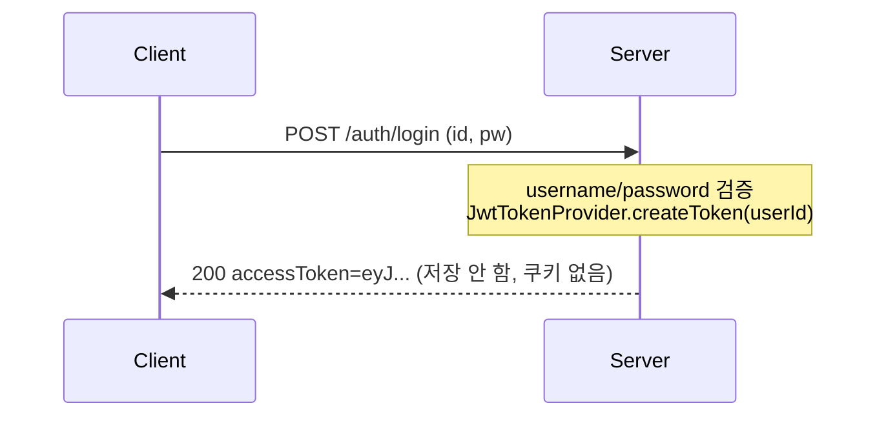
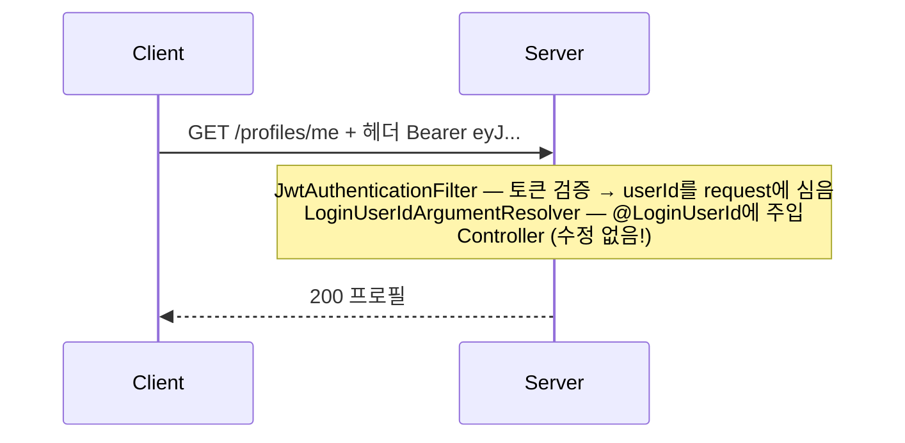
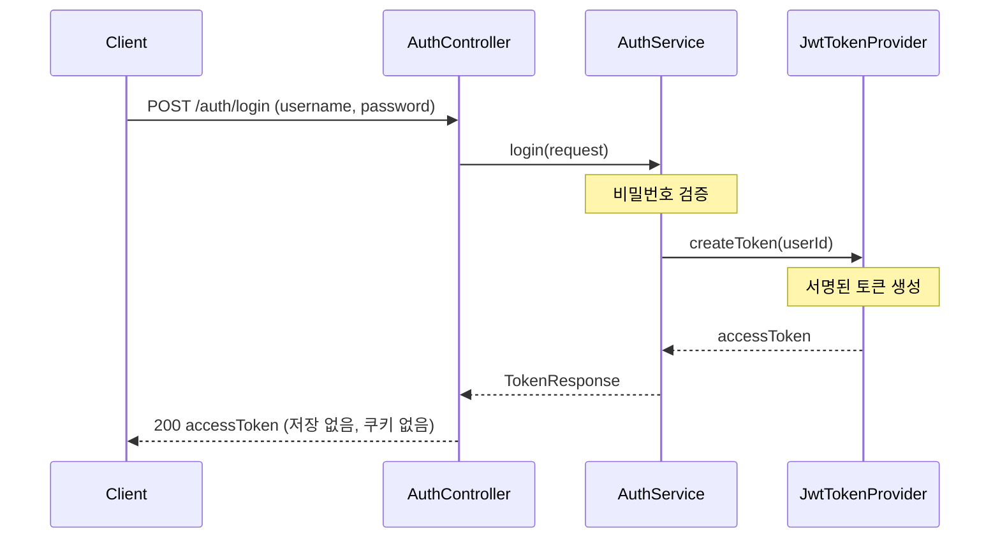
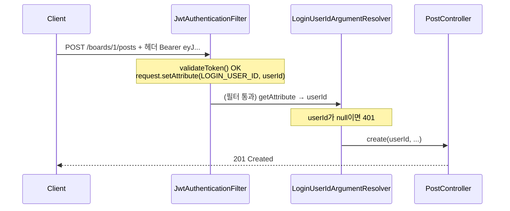
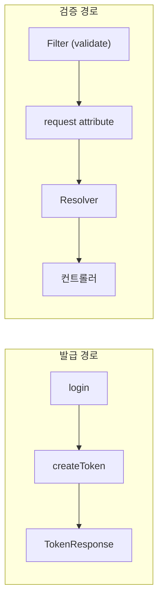

# JWT 기반 인증 구현 — 클래스별 역할과 작업 순서

**과정명**: 강의용 Spring Boot 게시판 — 단계 2 (세션 → JWT 전환)
**대상**: 단계 1(세션 인증)을 마친 수강생
**브랜치**: `step2-jwt` (단계 1은 `main`에 보존 — `git diff main..step2-jwt`가 곧 교재)
**관련 코드**: `auth/jwt/`, `auth/AuthService.java`, `auth/LoginUserIdArgumentResolver.java`, `global/config/SecurityConfig.java`
**선수 지식**: 세션 인증, HTTP 헤더, [HTTP-SESSION.md](HTTP-SESSION.md)

---

## 학습 목표

이 문서를 끝내면 수강생은:

- JWT 인증을 구현할 때 **어떤 클래스를 어떤 순서로** 만드는지 설명할 수 있다
- 각 클래스(`JwtTokenProvider`, `JwtAuthenticationFilter`, `ArgumentResolver`, `SecurityConfig` 등)의 **역할**을 한 문장으로 말할 수 있다
- 로그인 → 토큰 발급 → 보호 API 호출의 전체 흐름을 그릴 수 있다
- 세션 대비 무엇이 바뀌고 무엇이 그대로인지(특히 컨트롤러 불변) 안다

---

## 1. 큰 그림 — 세션 vs JWT

| | 단계 1 (세션) | 단계 2 (JWT) |
|--|--------------|--------------|
| 로그인 후 서버가 하는 일 | 세션 저장소에 userId 저장 | **아무것도 저장 안 함** (stateless) |
| 클라이언트가 받는 것 | `Set-Cookie: JSESSIONID` | 응답 본문의 `accessToken` |
| 이후 요청마다 보내는 것 | `Cookie: JSESSIONID=...` | `Authorization: Bearer <token>` |
| 사용자 식별 방법 | 쿠키로 서버 저장소 조회 | 토큰 서명 검증 후 토큰 안의 userId 사용 |
| 로그아웃 | `session.invalidate()` | 클라이언트가 토큰 폐기 (서버는 할 일 없음) |

> **핵심 한 줄**: 세션은 "서버가 기억한다", JWT는 "토큰이 정보를 들고 다닌다".

### 요청 흐름 한눈에

**로그인** — 토큰을 발급받는다(서버는 아무것도 저장하지 않는다):



**보호 API 호출** — 매 요청에 토큰을 실어 보내면 필터가 신원을 심는다:



---

## 2. 작업 순서 — 의존성 순으로 7단계

JWT는 **"토큰을 발급하는 길"** 과 **"들어온 토큰을 검증하는 길"** 두 갈래를 만든 뒤, 마지막에 Spring Security 필터 체인에 연결한다. 아래 순서는 "앞 단계가 만들어져야 뒤 단계를 만들 수 있는" 의존성 순서다.

| 순서 | 만드는 것 | 한 줄 역할 | 왜 이 순서 |
|------|-----------|------------|------------|
| 0 | 의존성 + 설정 | jjwt 라이브러리, 시크릿/만료 설정 | 모든 JWT 코드의 전제 |
| 1 | `JwtTokenProvider` | 토큰 생성·검증·파싱 도구 | 발급/검증 양쪽이 이걸 쓴다 |
| 2 | `TokenResponse` | 로그인 응답 DTO | 발급 결과를 담는 그릇 |
| 3 | `AuthService` / `AuthController` 로그인 전환 | 토큰 **발급** | TokenProvider + TokenResponse 필요 |
| 4 | `JwtAuthenticationFilter` | 들어온 토큰 **검증** 후 userId 심기 | TokenProvider 필요 |
| 5 | `AuthConst` + `LoginUserIdArgumentResolver` 내부 변경 | 심어진 userId를 컨트롤러에 **주입** | 필터가 심은 값을 읽음 |
| 6 | `SecurityConfig` | 필터를 체인에 등록, STATELESS | 필터가 있어야 등록 가능 |
| 7 | 테스트 | 발급/검증/401 검증 | 코드가 완성된 후 |

> **단계 1 사전 작업이 이미 끝나 있다는 전제**: `@LoginUserId` 어노테이션과 `LoginUserIdArgumentResolver`는 단계 1.5 리팩토링에서 이미 만들어졌다(세션을 읽는 버전). 단계 2에서는 그 Resolver의 **내부만** 바꾼다.

---

## 3. 단계별 상세

### Step 0. 의존성과 설정

**build.gradle** — jjwt 0.12.x:

```gradle
implementation 'io.jsonwebtoken:jjwt-api:0.12.6'
runtimeOnly 'io.jsonwebtoken:jjwt-impl:0.12.6'      // 런타임 구현체
runtimeOnly 'io.jsonwebtoken:jjwt-jackson:0.12.6'   // JSON 직렬화
```

> `api`만 컴파일 시점에 보이고, `impl`/`jackson`은 런타임에만 필요하므로 `runtimeOnly`. (테스트의 H2와 같은 원리)

**application.yaml** — 시크릿과 만료 시간:

```yaml
jwt:
  secret: ${JWT_SECRET:bG9jYWwtZGV2...}   # Base64 인코딩, HS256은 최소 256비트(32바이트)
  access-token-validity-seconds: 3600       # 1시간
```

> 시크릿은 토큰 서명·검증에 쓰는 **대칭키**다. 이 값이 유출되면 누구나 토큰을 위조할 수 있으므로 운영에서는 환경변수로만 주입한다(로컬 강의용은 기본값 허용).

---

### Step 1. `JwtTokenProvider` — 토큰을 다루는 도구

**역할**: 토큰을 **만들고(create)**, **검증하고(validate)**, **안의 userId를 꺼낸다(getUserId)**. JWT의 모든 암호화 로직이 이 한 클래스에 모인다. 다른 클래스는 JWT 내부를 몰라도 이 클래스의 메서드만 호출한다.

`auth/jwt/JwtTokenProvider.java`:

```java
@Slf4j
@Component
public class JwtTokenProvider {

  private final SecretKey key;
  private final long accessTokenValiditySeconds;

  public JwtTokenProvider(
      @Value("${jwt.secret}") String base64Secret,
      @Value("${jwt.access-token-validity-seconds}") long accessTokenValiditySeconds) {
    this.key = Keys.hmacShaKeyFor(Decoders.BASE64.decode(base64Secret));
    this.accessTokenValiditySeconds = accessTokenValiditySeconds;
  }

  public String createToken(Long userId) {
    Date now = new Date();
    Date expiration = new Date(now.getTime() + accessTokenValiditySeconds * 1000);
    return Jwts.builder()
        .subject(String.valueOf(userId))   // sub 클레임에 userId
        .issuedAt(now)                      // iat: 발급 시각
        .expiration(expiration)             // exp: 만료 시각
        .signWith(key)                      // 시크릿으로 서명
        .compact();                         // 최종 문자열로 직렬화
  }

  public Long getUserId(String token) {
    String subject = Jwts.parser()
        .verifyWith(key)
        .build()
        .parseSignedClaims(token)
        .getPayload()
        .getSubject();
    return Long.valueOf(subject);
  }

  public boolean validateToken(String token) {
    try {
      Jwts.parser().verifyWith(key).build().parseSignedClaims(token);
      return true;
    } catch (Exception e) {       // 서명 위조·만료·형식 오류 등 모두 false
      log.debug("invalid jwt: {}", e.getMessage());
      return false;
    }
  }
}
```

| 메서드 | 하는 일 | 누가 호출하나 |
|--------|---------|---------------|
| `createToken(userId)` | userId를 sub에 담아 서명된 토큰 문자열 생성 | 로그인 시 `AuthService` |
| `validateToken(token)` | 서명·만료 검증, 유효하면 true | 매 요청 `JwtAuthenticationFilter` |
| `getUserId(token)` | 토큰에서 userId 추출 | 검증 통과 후 `JwtAuthenticationFilter` |

> **JWT 토큰의 생김새** — `eyJhbGci...(헤더).eyJzdWIi...(페이로드).vOC5q...(서명)` 의 점 3개로 나뉜 구조. 헤더·페이로드는 Base64라 **누구나 읽을 수 있다**(암호화 아님). 단, 서명은 시크릿 없이 못 만들므로 **위조는 불가능**하다. → 비밀번호 같은 민감정보를 토큰에 넣으면 안 된다. userId 정도만.

---

### Step 2. `TokenResponse` — 로그인 응답 그릇

**역할**: 발급된 토큰을 클라이언트에게 돌려줄 JSON 모양을 정의한다.

`auth/dto/TokenResponse.java`:

```java
public record TokenResponse(
    String accessToken,
    String tokenType,    // "Bearer"
    long expiresIn       // 초 단위 만료 시간
) {
  public static TokenResponse bearer(String accessToken, long expiresIn) {
    return new TokenResponse(accessToken, "Bearer", expiresIn);
  }
}
```

응답 예:

```json
{ "accessToken": "eyJhbGci...", "tokenType": "Bearer", "expiresIn": 3600 }
```

> `tokenType: "Bearer"`는 클라이언트에게 "이 토큰을 `Authorization: Bearer <값>`으로 보내라"는 표준 힌트다.

---

### Step 3. 로그인 전환 — 토큰을 **발급**한다

**역할**: 비밀번호 검증까지는 단계 1과 같지만, 성공 시 **세션에 저장하는 대신 토큰을 발급**한다.

`auth/AuthService.java` (핵심 부분):

```java
@Transactional(readOnly = true)
public TokenResponse login(LoginRequest request) {
  User user = userRepository.findByUsername(request.username())
      .orElseThrow(() -> new UnauthorizedException(ErrorCode.LOGIN_FAILED));
  if (!passwordEncoder.matches(request.password(), user.getPassword())) {
    throw new UnauthorizedException(ErrorCode.LOGIN_FAILED);
  }
  String accessToken = tokenProvider.createToken(user.getId());   // ← 세션 대신 토큰
  return TokenResponse.bearer(accessToken, accessTokenValiditySeconds);
}
```

`auth/AuthController.java`:

```java
@PostMapping("/login")
public TokenResponse login(@Valid @RequestBody LoginRequest request) {
  return authService.login(request);    // HttpSession 파라미터가 사라졌다
}

@PostMapping("/logout")
@ResponseStatus(HttpStatus.NO_CONTENT)
public void logout() {
  // stateless: 서버가 상태를 안 가지므로 할 일이 없다.
  // 로그아웃 = 클라이언트가 토큰을 버리는 것.
}
```

| 단계 1 (세션) | 단계 2 (JWT) |
|--------------|--------------|
| `login(request, HttpSession session)` | `login(request)` — 세션 파라미터 제거 |
| `session.setAttribute(...)` | `tokenProvider.createToken(...)` |
| 반환: `UserResponse` | 반환: `TokenResponse` |
| `logout`: `invalidate()` | `logout`: 빈 메서드 (204) |

> **비교 포인트**: 로그인 검증 로직은 그대로다. 바뀐 건 "성공 후 무엇을 주느냐"뿐 — 세션 키냐, 서명된 토큰이냐.

---

### Step 4. `JwtAuthenticationFilter` — 들어온 토큰을 **검증**한다

**역할**: 모든 요청을 가로채, `Authorization: Bearer` 헤더가 있으면 토큰을 검증하고 userId를 꺼내 **request attribute에 심어둔다**. 컨트롤러보다 먼저 실행된다.

`auth/jwt/JwtAuthenticationFilter.java`:

```java
@Component
@RequiredArgsConstructor
public class JwtAuthenticationFilter extends OncePerRequestFilter {

  private static final String BEARER_PREFIX = "Bearer ";
  private final JwtTokenProvider tokenProvider;

  @Override
  protected void doFilterInternal(
      HttpServletRequest request, HttpServletResponse response, FilterChain filterChain)
      throws ServletException, IOException {
    String token = resolveToken(request);
    if (token != null && tokenProvider.validateToken(token)) {
      request.setAttribute(AuthConst.LOGIN_USER_ID, tokenProvider.getUserId(token));
    }
    filterChain.doFilter(request, response);   // 다음 필터/컨트롤러로 진행
  }

  private String resolveToken(HttpServletRequest request) {
    String header = request.getHeader(HttpHeaders.AUTHORIZATION);
    if (StringUtils.hasText(header) && header.startsWith(BEARER_PREFIX)) {
      return header.substring(BEARER_PREFIX.length());
    }
    return null;
  }
}
```

| 요소 | 의미 |
|------|------|
| `extends OncePerRequestFilter` | 요청당 정확히 한 번 실행되는 Spring 필터 |
| `resolveToken` | `Authorization` 헤더에서 `Bearer ` 떼고 토큰만 추출 |
| `setAttribute(...)` | 검증 성공 시에만 userId를 request에 심는다 |
| `filterChain.doFilter(...)` | **막지 않고 통과** — 공개 API도 있으므로 |

> **왜 막지 않나?** 이 필터는 "신원을 심기"만 한다. "로그인 필수인지"는 `@LoginUserId`가 붙은 곳에서 Resolver가 401로 판단한다. 책임을 나눠 둔 것이다(단계 1의 철학 유지).

> **세션 흐름과 대응**: 단계 1에서 "JSESSIONID 쿠키로 세션을 찾아 userId 확인"하던 일을, 여기서는 "Bearer 토큰을 검증해 userId 확인"으로 대체한다. 둘 다 결과는 같다 — **request에 userId를 준비해 둔다.**

#### 이후 보강 — 필터 예외는 `GlobalExceptionHandler`의 사각지대

> [!NOTE]
> 위 코드는 단계 2 초기 버전이다. 단계 3에서 이 필터는 request attribute 대신 **`SecurityContext`에 표준 `Authentication`을 심는 방식**으로 표준화됐다([[SPRING-SECURITY-STANDARD]] 참고). 아래 예외 처리 함정은 그 표준 버전에서 드러나 이후 보강한 내용이다.

기본 필터는 예외를 전혀 다루지 않았는데, 여기에 **"내부 오류가 401로 둔갑하는"** 함정이 있다. 원리부터:

**`@RestControllerAdvice`(`GlobalExceptionHandler`)는 `DispatcherServlet` 레벨에서만 동작한다.** 필터는 그보다 앞단이라, 필터에서 던진 예외는 GlobalExceptionHandler가 절대 못 잡는다. 필터 예외의 행선지는 정해져 있다:

| 필터에서 던진 예외 | 처리 결과 |
|---|---|
| `AuthenticationException` 계열 | `ExceptionTranslationFilter` → `authenticationEntryPoint`(**401**) |
| `AccessDeniedException` | → `accessDeniedHandler`(403) |
| 그 외 (진짜 내부 오류) | 컨테이너 → 500 (표준 `ErrorResponse` 우회) |

문제는 두 지점에서 터졌다:
1. **`validateToken`이 `catch (Exception)`으로 내부 오류까지 삼킴** → `false` 반환 → 인증 안 됨 → 뒷단에서 401 `LOGIN_REQUIRED`. 실제 원인(키 로딩 실패 등 500성 버그)이 "로그인 필요"로 둔갑.
2. **필터 안 `loadUserByUsername` 예외** — 삭제된 사용자면 `UsernameNotFoundException`(=`AuthenticationException`)이라 401, DB 장애 등이면 500으로 새어 나감.

**보강 ① `validateToken`의 catch를 좁힌다** — 진짜 인증 실패(만료·서명·형식)만 `false`로, 그 외는 전파:

```java
public boolean validateToken(String token) {
  try {
    Jwts.parser().verifyWith(key).build().parseSignedClaims(token);
    return true;
  } catch (JwtException | IllegalArgumentException e) {
    log.debug("invalid jwt: {}", e.getMessage());   // 만료·위조·형식·빈 토큰만 인증 실패
    return false;
  }
  // 그 외 예외는 삼키지 않고 전파 → 내부 오류로 드러남
}
```

**보강 ② 필터에서 예외를 3분기** — 인증 실패는 통과(→401), 내부 오류는 `HandlerExceptionResolver`로 위임(→`GlobalExceptionHandler` 500):

```java
// @Qualifier("handlerExceptionResolver")로 스프링 MVC의 리졸버를 생성자 주입
try {
  String token = resolveToken(request);
  if (token != null && tokenProvider.validateToken(token)) {
    // ... SecurityContext에 Authentication 심기
  }
} catch (AuthenticationException e) {
  // 유효 토큰인데 사용자 없음 등 — 컨텍스트 비우고 통과 → 뒷단 entryPoint가 401(정상)
  SecurityContextHolder.clearContext();
} catch (Exception e) {
  // 예상치 못한 내부 오류 — 401로 둔갑시키지 않고 DispatcherServlet 예외 처리로 위임(→ 500)
  SecurityContextHolder.clearContext();
  handlerExceptionResolver.resolveException(request, response, null, e);
  return;
}
filterChain.doFilter(request, response);
```

| 상황 | 보강 전 | 보강 후 |
|---|---|---|
| 토큰 없음/만료/위조 | 401 | 401 |
| 삭제된 사용자의 유효 토큰 | 401 | 401 (인증 실패로 통과) |
| **키 로딩 실패·DB 장애 등 내부 버그** | **401 둔갑** | **500 `INTERNAL_ERROR`** |

> [!TIP]
> FE는 보통 401을 "세션 만료 → 강제 로그아웃/재로그인"으로 처리한다. 서버 500 버그가 401로 둔갑하면 **멀쩡한 사용자를 로그아웃시키는 오동작**을 한다. 500은 500으로 나가야 FE가 "잠시 후 재시도" 같은 올바른 반응을 할 수 있다. "필터는 `GlobalExceptionHandler`의 사각지대 → 내부 오류는 `HandlerExceptionResolver`로 위임"을 **JWT 필터의 기본 패턴**으로 기억해 두면 좋다.

---

### Step 5. `AuthConst` + Resolver 내부 변경 — userId를 컨트롤러에 **주입**

**역할(AuthConst)**: 필터가 심고 Resolver가 읽는 **attribute 키**를 한 곳에서 관리(오타 방지).

`auth/AuthConst.java`:

```java
public final class AuthConst {
  public static final String LOGIN_USER_ID = "loginUserId";
  private AuthConst() {}
}
```

**역할(Resolver)**: `@LoginUserId Long` 파라미터에 로그인 사용자 id를 주입. **이 클래스의 내부 한 곳만 바꾸면 세션→JWT 전환이 끝난다.**

`auth/LoginUserIdArgumentResolver.java`:

```java
@Override
public Object resolveArgument(MethodParameter parameter, ...) {
  HttpServletRequest request = webRequest.getNativeRequest(HttpServletRequest.class);
  // 단계 1: session.getAttribute(...)  →  단계 2: request.getAttribute(...)
  Long loginUserId =
      request != null ? (Long) request.getAttribute(AuthConst.LOGIN_USER_ID) : null;
  if (loginUserId == null) {
    throw new UnauthorizedException(ErrorCode.LOGIN_REQUIRED);   // 비로그인 → 401
  }
  return loginUserId;
}
```

> **이것이 이 강의의 절정**: 단계 1에서는 세션에서, 단계 2에서는 필터가 심은 request attribute에서 읽는다. 바뀐 건 **이 메서드 안 한 줄**뿐이고, `@LoginUserId`를 쓰는 **`PostController`/`BoardController`/`ProfileController`는 단 한 줄도 수정하지 않았다.** → `git diff`로 직접 확인시켜라.

---

### Step 6. `SecurityConfig` — 필터를 체인에 등록

**역할**: 만든 `JwtAuthenticationFilter`를 Spring Security 필터 체인에 끼우고, 세션을 아예 만들지 않도록(STATELESS) 설정한다.

`global/config/SecurityConfig.java`:

```java
@Bean
public SecurityFilterChain securityFilterChain(HttpSecurity http) throws Exception {
  http
      .csrf(AbstractHttpConfigurer::disable)
      .formLogin(AbstractHttpConfigurer::disable)
      .httpBasic(AbstractHttpConfigurer::disable)
      .sessionManagement(session ->
          session.sessionCreationPolicy(SessionCreationPolicy.STATELESS))   // 세션 안 만듦
      .authorizeHttpRequests(auth -> auth.anyRequest().permitAll())          // 인가는 Resolver가
      .addFilterBefore(jwtAuthenticationFilter,
          UsernamePasswordAuthenticationFilter.class);                       // 필터 등록
  return http.build();
}
```

| 설정 | 의미 |
|------|------|
| `SessionCreationPolicy.STATELESS` | Spring Security가 세션을 생성/사용하지 않음 |
| `permitAll()` | Security는 다 열어두고, 인증 필요 여부는 `@LoginUserId`가 판단 |
| `addFilterBefore(...)` | JWT 필터를 표준 인증 필터 앞에 배치 → 컨트롤러보다 먼저 토큰 해석 |

> `JwtAuthenticationFilter`를 등록할 때 `WebConfig`의 ArgumentResolver 등록과 헷갈리지 말 것. **필터**는 SecurityConfig에서, **ArgumentResolver**는 WebConfig에서 등록한다(서로 다른 확장 지점).

---

### Step 7. 테스트

| 테스트 | 검증 내용 |
|--------|-----------|
| `JwtTokenProviderTest` | create→getUserId 왕복 일치, 만료 토큰 false, 변조 토큰 false |
| `AuthServiceTest` | 로그인 성공 시 유효한 토큰 발급 (세션 저장 검증에서 교체), 비밀번호 불일치 401 |
| `LoginUserIdArgumentResolverTest` | Bearer 토큰 있으면 주입, 없으면 401 |

> 서비스 계층 테스트(`PostServiceTest` 등)와 공개 엔드포인트 테스트(`GlobalExceptionHandlerTest`)는 인증과 무관하므로 그대로 통과한다.

---

## 4. 전체 요청 흐름 — 시퀀스

**로그인** — `AuthController → AuthService → JwtTokenProvider`로 내려가 서명된 토큰을 만들어 돌려준다:



**보호 API** — 필터가 토큰을 검증해 userId를 심고, Resolver가 그걸 꺼내 컨트롤러에 주입한다:



---

## 5. 클래스 역할 요약표

| 클래스 | 패키지 | 역할 | 한 줄 |
|--------|--------|------|-------|
| `JwtTokenProvider` | `auth.jwt` | 토큰 생성·검증·파싱 | JWT의 모든 암호 로직이 모인 도구 |
| `TokenResponse` | `auth.dto` | 로그인 응답 DTO | 발급된 토큰을 담는 그릇 |
| `AuthService` | `auth` | 인증 + 토큰 발급 | 비밀번호 검증 후 토큰 생성 |
| `AuthController` | `auth` | 로그인/로그아웃 엔드포인트 | 토큰을 응답으로 반환 |
| `JwtAuthenticationFilter` | `auth.jwt` | 들어온 토큰 검증 | userId를 request에 심기 |
| `AuthConst` | `auth` | attribute 키 상수 | 필터-Resolver 간 약속된 키 |
| `LoginUserIdArgumentResolver` | `auth` | userId 주입 | request의 userId를 `@LoginUserId`에 |
| `SecurityConfig` | `global.config` | 필터 등록 + STATELESS | JWT 필터를 체인에 연결 |
| `WebConfig` | `global.config` | Resolver 등록 | `@LoginUserId` 동작하게 등록 |

---

## 6. 세션 대비 무엇이 바뀌었나 (`git diff main..step2-jwt`)

| 파일 | 변화 |
|------|------|
| `build.gradle`, `application.yaml` | jjwt 의존성·jwt 설정 추가 |
| `JwtTokenProvider`, `JwtAuthenticationFilter`, `TokenResponse` | **신규 생성** |
| `AuthController`, `AuthService` | 세션 저장 → 토큰 발급 |
| `LoginUserIdArgumentResolver` | 내부: 세션 조회 → request attribute 조회 |
| `SecurityConfig` | 필터 등록 + STATELESS |
| `SessionConst` → `AuthConst` | 리네임 (의미: 세션 키 → request attribute 키) |
| **`PostController`, `BoardController`, `ProfileController`** | **변경 없음 (0줄)** ← 핵심 |

> **가장 강력한 강의 메시지**: 인증 방식을 통째로 갈아끼웠는데 비즈니스 컨트롤러는 한 줄도 안 바뀌었다. `@LoginUserId` 추상화가 "변하는 것(인증 방식)"과 "변하지 않는 것(컨트롤러)"의 경계를 그어준 덕분이다. 이것이 추상화를 배우는 이유다.

---

## 7. 핵심 요약 한 장

**JWT 구현 순서**:

| # | 클래스/작업 | 역할 |
|---|-----------|------|
| 0 | 의존성(jjwt) + 설정 | `jwt.secret` |
| 1 | `JwtTokenProvider` | 토큰 생성/검증/파싱 도구 |
| 2 | `TokenResponse` | 로그인 응답 그릇 |
| 3 | `AuthService`/`Controller` | 로그인 → 토큰 발급 (세션 저장 제거) |
| 4 | `JwtAuthenticationFilter` | 들어온 Bearer 토큰 검증 → userId를 심기 |
| 5 | Resolver 내부 변경 | request의 userId를 `@LoginUserId`에 주입 |
| 6 | `SecurityConfig` | 필터 등록 + STATELESS |
| 7 | 테스트 | 발급/검증/401 |

**두 경로**:



> [!IMPORTANT]
> **안 바뀐 것**: `Post`/`Board`/`Profile` 컨트롤러는 한 줄도 수정하지 않았다 — `@LoginUserId` 추상화 덕분에 세션→JWT 전환이 인증 계층 안에서 끝났다.

---

## 부록. 자주 나오는 질문 (FAQ)

| 질문 | 답변 요약 |
|------|-----------|
| 왜 `JwtTokenProvider`를 가장 먼저 만드나? | 토큰 발급(AuthService)과 검증(Filter) 양쪽이 의존하므로 먼저 있어야 한다. |
| 필터가 토큰이 없을 때 막지 않는 이유는? | 공개 엔드포인트가 있어서. 로그인 필수 판단은 `@LoginUserId` Resolver가 401로 한다. |
| 토큰에 비밀번호를 넣어도 되나? | 절대 안 된다. 페이로드는 Base64라 누구나 읽을 수 있다. userId 정도만 넣는다. |
| 로그아웃이 왜 빈 메서드인가? | stateless라 서버에 지울 상태가 없다. 로그아웃은 클라이언트가 토큰을 폐기하는 것. 강제 무효화는 블랙리스트(다음 단계). |
| 만료된 토큰을 보내면? | `validateToken`이 false → 필터가 userId를 안 심음 → Resolver가 401. |
| 컨트롤러가 정말 안 바뀌었나? | `git diff main..step2-jwt -- '*Controller.java'`로 확인. Post/Board/Profile은 변경 0. |
| 필터와 ArgumentResolver는 어디에 등록? | 필터는 `SecurityConfig`(`addFilterBefore`), Resolver는 `WebConfig`(`addArgumentResolvers`). |
| 서버를 여러 대로 늘리면? | JWT는 서버가 상태를 안 가지므로 그대로 확장 가능. 세션처럼 공유 저장소(Redis)가 필요 없다. |
