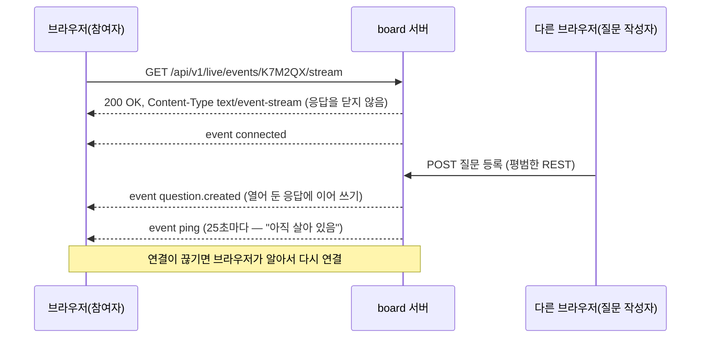
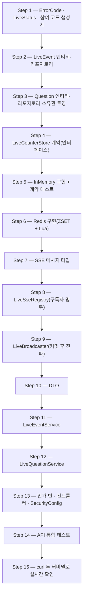
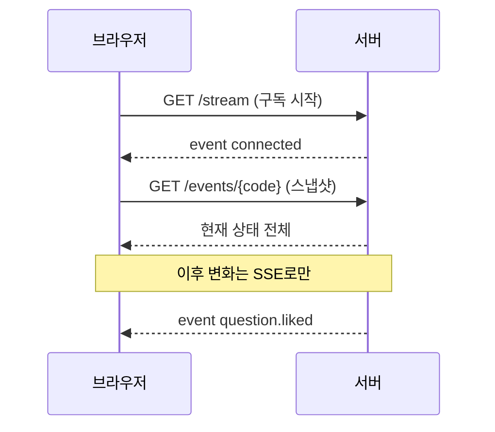

# 단계 18 따라하기 1일차 — 이벤트·질문·좋아요·SSE (백엔드)

> **무엇을 왜** 만드는지(SSE vs WebSocket, Redis 자료구조 선택, 한계)는 [[LIVE-POLL]]이 선수 문서다.
> 이 문서는 **어느 파일에 어떤 코드를 어떤 순서로** 넣었는지의 재현 기록이다 — 단계 17까지 완성된 코드에서
> 시작해 Step 1부터 그대로 따라 치면 1일차 끝(커밋 `edee6e0`)과 같은 결과에 도달한다.
> 모든 코드 블록은 그 커밋의 실제 파일에서 생성했다(손으로 옮겨 적지 않았다).

1일차가 끝나면 진행자가 이벤트를 만들고, 참여자가 질문을 올리고 좋아요를 누르면, **새로고침 없이** 열려 있는
모든 구독자에게 변화가 1초 안에 흘러간다. 화면은 2일차에 만든다 — 오늘은 `curl` 두 개로 실시간을 눈으로 확인한다.

학습 목표 — 1일차를 마치면 다음을 할 수 있다.

- `SseEmitter`로 "끝나지 않는 HTTP 응답"을 열고, 구독자 명부를 동시성 안전하게 관리한다
- Redis ZSET·SET으로 좋아요 순위를 집계하고, Lua 스크립트로 "확인 → 증가"를 원자화한다
- `@TransactionalEventListener`로 "DB 커밋이 확정된 변화만" 실시간 전파한다
- 브라우저 제약(EventSource는 헤더 불가) 때문에 **스트림만 공개**하는 인가 규칙을 설계한다

---

## 0. SSE 한눈에 이해하기 — 무엇이고, 왜, 언제 필요한가

코드를 치기 전에 오늘의 주인공 **SSE(Server-Sent Events)** 를 먼저 이해한다. 이 절만 읽어도
"왜 이번 단계는 SSE로 만드는가"에 답할 수 있게 쓰였다. 더 깊은 설계 근거는 [[LIVE-POLL]]에 있다.

> [!IMPORTANT]
> SSE는 **서버가 먼저 말할 수 있게 해 주는, 끝나지 않는 HTTP 응답**이다. 브라우저가 한 번 요청하면 서버는 응답을 닫지 않고 열어 둔 채, 새 소식이 생길 때마다 그 응답에 한 줄씩 이어서 써 보낸다.

### 0-1. 왜 필요한가 — HTTP는 원래 "물어봐야 답한다"

지금까지 만든 board의 모든 API는 **브라우저가 묻고(request) → 서버가 답하고(response) → 연결을 끝내는** 방식이다.
서버는 브라우저가 묻기 전에는 아무 말도 할 수 없다. 그런데 이번에 만드는 화면은 이렇다.

- 참여자 A가 질문을 올리면, 진행자와 다른 참여자 30명의 화면에 **바로** 떠야 한다.
- 누군가 좋아요를 누르면 순위가 **바로** 바뀌어야 한다.

즉 "변화는 서버에서 생기는데, 그 소식을 브라우저 30개에 **서버가 먼저** 알려야 하는" 상황이다. 방법은 세 가지다.

| 방법 | 비유 | 어떻게 | 이번 화면에 쓰면 |
|------|------|--------|------------------|
| **polling** | 택배 왔는지 3초마다 현관문 열어 보기 | 브라우저가 주기적으로 "바뀐 거 있어요?" 요청 | 30명 × 3초 = 분당 600번 요청, 대부분 "없음". 그래도 최대 3초 늦다 |
| **SSE** | 라디오 방송 — 켜 두면 방송국이 알아서 들려준다 | 요청 1번으로 연결을 열어 두고 서버가 계속 써 보냄 | 변화가 생긴 순간 0.x초 안에 30명에게 도착. 평소엔 조용 |
| **WebSocket** | 전화 통화 — 양쪽이 아무 때나 말한다 | HTTP를 다른 프로토콜로 업그레이드해 양방향 채널 | 동작은 하지만, 참여자는 "가끔 쓰기"만 하므로 양방향 채널은 과하다 |

이번 화면은 **"모두가 계속 보고(수신), 가끔 쓴다(전송)"** — 방송에 딱 맞는 모양이다. 그래서 쓰기는 평소처럼 REST(`POST`)로, 받기는 SSE로 만든다.

### 0-2. 어떻게 동작하나 — 응답을 끝내지 않는다



응답 본문은 사람이 읽을 수 있는 **텍스트 한 줄 한 줄**이다. 이벤트 하나는 빈 줄로 끝난다.

```text
event:question.created
data:{"id":3,"content":"들리나요?","likeCount":0}

event:question.liked
data:{"id":3,"likeCount":1}

```

| 줄 | 뜻 |
|----|----|
| `event:이름` | 이벤트 종류. 브라우저는 이 이름별로 받는다 |
| `data:내용` | 본문(이 단계에선 JSON) |
| 빈 줄 | 이벤트 하나 끝 |
| `:`로 시작 | 주석 — 브라우저가 무시한다 |
| `id:`, `retry:` | 이벤트 번호·재연결 간격(이 단계에선 쓰지 않음, [[LIVE-POLL]] §6) |

새 프로토콜이 아니라 **그냥 HTTP**라서, board에 이미 있는 것들 — Spring Security 필터, nginx 프록시, 로그 — 이 그대로 동작한다. WebSocket처럼 업그레이드·별도 메시지 형식(chat의 STOMP)을 새로 배울 필요가 없다.

### 0-3. 언제 쓰고, 언제 안 쓰나

| 상황 | 추천 | 이유 |
|------|------|------|
| 라이브 질문·투표, 실시간 대시보드, 주식·스포츠 점수 | **SSE** | 서버가 자주 말하고 시청자가 많다 |
| 주문·배송 상태, 업로드·빌드 진행률 | **SSE** | 한 방향으로 진행 소식만 흘려보낸다 |
| ChatGPT처럼 AI 답변이 글자 단위로 흘러나오는 화면 | **SSE** | 실제로 많은 LLM API가 SSE로 토큰을 스트리밍한다 |
| 채팅, 협업 편집, 멀티플레이 게임 | WebSocket | 양쪽이 자주·빠르게 말한다(chat 강의) |
| 하루 몇 번 오는 알림, "새 글 n개" 배지 | polling | 연결을 계속 열어 둘 만큼 자주 바뀌지 않는다(단계 12 알림) |
| 이미지·파일 같은 바이너리 실시간 전송 | WebSocket | SSE는 UTF-8 텍스트만 보낸다 |

> 팁: 고르는 질문은 "실시간이 필요한가?"가 아니라 "**누가, 얼마나 자주 말하는가?**"다. 서버만 자주 말하면 SSE, 양쪽이 자주 말하면 WebSocket, 둘 다 드물면 polling.

### 0-4. 쓰는 도구 — 브라우저와 Spring

| 쪽 | 도구 | 하는 일 | 이 강의에서 |
|----|------|---------|-------------|
| 브라우저 | `EventSource` (내장 API) | 스트림을 열고, 이벤트 이름별로 받고, **끊기면 자동 재연결** | 2일차 `liveStream.js` |
| 서버 | `SseEmitter` (Spring MVC) | 컨트롤러가 반환하면 응답을 열어 두고, `send()`할 때마다 이벤트 한 덩어리를 써 보냄 | 오늘 Step 8·13 |
| 서버(참고) | `Flux<ServerSentEvent>` (Spring WebFlux) | 리액티브 스택에서 같은 일 | board는 MVC라 쓰지 않음 |

브라우저 쪽은 이 정도로 짧다.

```js
const source = new EventSource("/api/v1/live/events/K7M2QX/stream");
source.addEventListener("question.created", (e) => console.log(JSON.parse(e.data)));
// 연결이 끊기면 브라우저가 약 3초 뒤 스스로 다시 연결한다
```

### 0-5. 미리 알아 둘 제약 — 오늘과 내일 코드가 이것 때문에 생긴다

| 제약 | 무슨 뜻 | 그래서 이렇게 한다 |
|------|---------|-------------------|
| 단방향 | 서버 → 브라우저만 | 쓰기는 평소처럼 REST `POST` |
| `EventSource`는 **헤더를 못 붙인다** | `Authorization: Bearer` 토큰을 실을 수 없다 | 스트림만 공개, 개인 정보는 싣지 않음(Step 13) |
| 연결을 계속 연다 | 구독자 수만큼 서버 메모리에 연결이 산다 | 명부(`LiveSseRegistry`)로 관리, 끊긴 연결 정리(Step 8) |
| 프록시가 막을 수 있다 | nginx가 응답을 모아 보내거나 조용한 연결을 끊는다 | 버퍼링 끄기 + 25초 heartbeat(2일차 Step 12·15) |
| 끊긴 동안의 소식은 사라진다 | 재연결해도 지난 이벤트는 다시 오지 않는다 | 연결될 때마다 "현재 상태 전체"(스냅샷)를 다시 받기(Step 11) |
| HTTP/1.1에선 브라우저가 한 도메인에 연결을 약 6개까지만 연다 | 탭을 여러 개 열면 연결이 모자랄 수 있다 | 운영은 caddy가 HTTP/2로 서비스해 한 연결로 여러 스트림을 나른다 |

### 0-6. 오늘 어디서 무엇을 배우나

| 개념 | 나오는 곳 |
|------|-----------|
| SSE 메시지 형식, `SseEmitter` 수명주기, heartbeat | Step 8 |
| "DB에 확정된 변화만" 방송하기 | Step 9 |
| 스냅샷 + 스트림 — 놓치지 않는 순서 | Step 11 |
| 헤더를 못 붙이는 스트림의 인가 설계 | Step 13 |
| 끝나지 않는 응답을 테스트하는 법 | Step 14 |
| 눈으로 확인 — `curl -N` 두 터미널 | Step 15 |

---

## 1. 작업 지도

핵심 원칙은 단계 15·16과 같다 — **"매 Step이 끝날 때마다 컴파일되고 테스트가 green"**. 그래서 순서는
의존 방향(아래가 위를 쓴다)을 그대로 따른다. 아직 만들지 않은 클래스를 앞 Step에서 쓰는 일은 없다.



| Step | 만드는 것 | 고치는 것 | 이 순서인 이유 |
|------|-----------|-----------|----------------|
| 1 | `LiveStatus`, `LiveCodeGenerator` | `ErrorCode` | 엔티티가 상태 enum과 오류 코드를 쓴다 — 가장 바닥 |
| 2 | `LiveEvent`, `LiveEventRepository` | — | 질문·투표가 모두 이벤트에 매달린다 |
| 3 | `Question`, `QuestionOwnership`, `QuestionRepository` | — | 이벤트가 있어야 질문의 FK가 성립 |
| 4 | `LikeResult`, `LiveCounterStore` | — | 서비스는 Redis가 아니라 "계약"에 의존해야 테스트가 쉽다 |
| 5 | `InMemoryLiveCounterStore`, `TestLiveCounterStoreConfig` | — | Redis 없이 규칙부터 검증(빠른 피드백) |
| 6 | `RedisLiveCounterStore` | — | 계약이 확정된 뒤에 운영 구현 |
| 7 | `LivePayloads`, `LiveChangedEvent` | — | 레지스트리·브로드캐스터가 주고받을 메시지 |
| 8 | `LiveSseRegistry`, `LiveSseConfig` | — | 전파의 "받는 쪽" 명부 |
| 9 | `LiveBroadcaster` | — | 명부가 있어야 보낼 곳이 있다 |
| 10 | 요청·응답 DTO 6개 | — | 서비스 시그니처가 DTO를 쓴다 |
| 11 | `LiveEventService` | — | 질문 서비스가 이벤트 조회를 재사용한다 |
| 12 | `LiveQuestionService` | — | 이벤트 서비스 위에 선다 |
| 13 | `LiveSecurity`, 컨트롤러 2개 | `SecurityConfig` | 웹은 서비스가 완성된 뒤 맨 위 |
| 14 | `LiveApiIntegrationTest` | — | 실제 토큰·필터 체인까지 통과하는지 |
| 15 | — | — | 사람 눈으로 실시간을 확인 |

> [!NOTE]
> 표의 "출처" 열 읽는 법 — **Spring Framework / Spring Data / Jakarta / Lombok** 등은 라이브러리 것,
> **이 Step에서 생성**은 지금 만드는 클래스, **Step N**은 앞에서 만든 클래스, **기존(단계 N)**은 board에 원래 있던 클래스다.

---

## Step 1. 기초 — 오류 코드, 상태, 참여 코드

**왜 지금, 무슨 의미인가.** 앞으로 만들 엔티티(`LiveEvent`)가 "열림/닫힘" 상태와 "종료된 이벤트" 오류를 쓴다.
아무것에도 의존하지 않는 것부터 깔아야 이후 파일이 바로 컴파일된다. 참여 코드는 Slido의 "#123456" 같은 것 —
진행자가 화면에 띄우면 참여자가 휴대폰에 받아 적는 **사람용 식별자**다.

### 개념: 참여 코드에 `SecureRandom`을 쓰는 이유

| 선택 | 문제 / 이유 |
|------|-------------|
| DB `id`를 그대로 공개 | 1, 2, 3… 순서라 남의 이벤트를 쉽게 추측한다 |
| `java.util.Random` | 시드를 알면 다음 값을 예측할 수 있다(보안용이 아님) |
| `SecureRandom` + 32문자 × 6자리 | 약 10억 가지(32^6). 추측이 비현실적 |
| 헷갈리는 `0 O 1 I` 제외 | 사람이 화면을 보고 옮겨 적는 값이라 오타를 줄인다 |

### ① `ErrorCode` — 기존 파일에 3줄 추가

NOT_FOUND 그룹(`NOTIFICATION_NOT_FOUND` 아래)에:

```java
  // 단계 18: 실시간 질문·투표
  LIVE_EVENT_NOT_FOUND(HttpStatus.NOT_FOUND, "라이브 이벤트를 찾을 수 없습니다."),
  QUESTION_NOT_FOUND(HttpStatus.NOT_FOUND, "질문을 찾을 수 없습니다."),
```

CONFLICT 그룹(`NICKNAME_DUPLICATED` 아래)에:

```java
  // 단계 18: 종료된 이벤트는 질문·좋아요·투표를 더 받지 않는다.
  LIVE_EVENT_CLOSED(HttpStatus.CONFLICT, "종료된 라이브 이벤트입니다."),
```

> 팁: 409 CONFLICT는 "요청 자체는 맞지만 **현재 자원 상태**와 충돌한다"는 뜻이다. 종료된 이벤트에 질문하기가 정확히 그 경우다.

### ② 상태 enum과 코드 생성기 (신규)

`src/main/java/com/example/board/live/LiveStatus.java`

```java
package com.example.board.live;

// 단계 18: 이벤트와 투표가 같은 두 상태를 공유한다.
public enum LiveStatus {
  OPEN,
  CLOSED
}
```

`src/main/java/com/example/board/live/LiveCodeGenerator.java`

```java
package com.example.board.live;

import java.security.SecureRandom;
import java.util.Locale;
import org.springframework.stereotype.Component;

// 단계 18: 참여 코드 — 사람이 화면을 보고 받아 적는 값이라 헷갈리는 0/O, 1/I를 뺀다.
// SecureRandom: 코드를 추측해 남의 이벤트에 들어오는 것을 어렵게 한다(Random은 예측 가능).
@Component
public class LiveCodeGenerator {

  static final String ALPHABET = "ABCDEFGHJKLMNPQRSTUVWXYZ23456789";
  static final int LENGTH = 6;

  private final SecureRandom random = new SecureRandom();

  public String generate() {
    StringBuilder code = new StringBuilder(LENGTH);
    for (int i = 0; i < LENGTH; i++) {
      code.append(ALPHABET.charAt(random.nextInt(ALPHABET.length())));
    }
    return code.toString();
  }

  public static String normalize(String code) {
    return code == null ? "" : code.strip().toUpperCase(Locale.ROOT);
  }
}
```

`normalize`가 `static`인 이유: 참여자가 `" k7m2qx "`처럼 소문자·공백을 섞어 입력해도 같은 이벤트를 찾아야 한다.
조회하는 모든 곳(서비스, 인가 빈)이 **같은 규칙**을 쓰도록 한 곳에 둔다.

### ③ 테스트 (신규)

`src/test/java/com/example/board/live/LiveCodeGeneratorTest.java`

```java
package com.example.board.live;

import static org.assertj.core.api.Assertions.assertThat;

import org.junit.jupiter.api.RepeatedTest;
import org.junit.jupiter.api.Test;

class LiveCodeGeneratorTest {

  private final LiveCodeGenerator generator = new LiveCodeGenerator();

  @RepeatedTest(200)
  void should_generateSixCharsWithoutConfusingLetters() {
    assertThat(generator.generate()).matches("[ABCDEFGHJKLMNPQRSTUVWXYZ23456789]{6}");
  }

  @Test
  void should_normalizeToTrimmedUpperCase() {
    assertThat(LiveCodeGenerator.normalize(" k7m2qx ")).isEqualTo("K7M2QX");
  }
}
```

`@RepeatedTest(200)` — 무작위 값이라 한 번 통과로는 부족하다. 같은 테스트를 200번 돌려 금지 문자가 섞이지 않음을 확인한다.

| 클래스 | 출처 | 역할 |
|--------|------|------|
| `ErrorCode` | 기존(단계 2~) | 오류 코드 → HTTP 상태 매핑 |
| `LiveStatus` | 이 Step에서 생성 | 이벤트·투표 공용 OPEN/CLOSED |
| `LiveCodeGenerator` | 이 Step에서 생성 | 참여 코드 생성·정규화 |
| `SecureRandom` | Java 표준(`java.security`) | 예측 불가능한 난수 |
| `@Component` | Spring Framework | 빈 등록 — 서비스가 주입받는다 |
| `@RepeatedTest` | JUnit 5 | 같은 테스트 반복 실행 |

**확인**

```bash
./gradlew test --tests '*LiveCodeGeneratorTest'
# 기대: BUILD SUCCESSFUL, 201 tests (200 반복 + 1)
```

---

## Step 2. `LiveEvent` — 진행자가 여는 방

**왜 지금, 무슨 의미인가.** 질문도 투표도 모두 "어느 이벤트의 것인가"로 묶인다. 이벤트가 최상위 집합(aggregate)이다.
진행자(`host`)는 board의 `User`를 그대로 쓴다 — 이것이 별도 서비스(chat) 대신 board 안에 만든 이점이다.

### 개념: 상태를 바꾸는 메서드를 엔티티에 두는 이유

`event.close()`, `event.assertOpen()`처럼 **규칙을 엔티티 메서드로** 두면, 서비스마다 `if (status == CLOSED) throw …`를
복붙하지 않는다. "종료된 이벤트는 쓰기 불가"라는 규칙이 한 곳에만 존재한다.

`isHostedBy`의 `host.getId()`는 LAZY 프록시를 **초기화하지 않는다** — Hibernate 프록시는 FK 값(id)을 이미 들고 있어서
추가 SELECT 없이 돌려준다. 인가 판단처럼 자주 불리는 곳에서 이 차이가 크다.

`src/main/java/com/example/board/live/LiveEvent.java`

```java
package com.example.board.live;

import com.example.board.global.entity.BaseTimeEntity;
import com.example.board.global.exception.BusinessException;
import com.example.board.global.exception.ErrorCode;
import com.example.board.user.User;
import jakarta.persistence.Column;
import jakarta.persistence.Entity;
import jakarta.persistence.EnumType;
import jakarta.persistence.Enumerated;
import jakarta.persistence.FetchType;
import jakarta.persistence.GeneratedValue;
import jakarta.persistence.GenerationType;
import jakarta.persistence.Id;
import jakarta.persistence.Index;
import jakarta.persistence.JoinColumn;
import jakarta.persistence.ManyToOne;
import jakarta.persistence.Table;
import java.util.Objects;
import lombok.AccessLevel;
import lombok.Getter;
import lombok.NoArgsConstructor;
import org.hibernate.annotations.JdbcTypeCode;
import org.hibernate.type.SqlTypes;

// 단계 18: 진행자(host)가 여는 라이브 세션. 참여자는 code로 찾아 들어온다.
@Entity
@Table(name = "live_events", indexes = @Index(name = "idx_live_events_host", columnList = "host_id"))
@Getter
@NoArgsConstructor(access = AccessLevel.PROTECTED)
public class LiveEvent extends BaseTimeEntity {

  @Id
  @GeneratedValue(strategy = GenerationType.IDENTITY)
  private Long id;

  @ManyToOne(fetch = FetchType.LAZY, optional = false)
  @JoinColumn(name = "host_id", nullable = false)
  private User host;

  @Column(nullable = false, length = 100)
  private String title;

  @Column(nullable = false, unique = true, length = 6)
  private String code;

  @Enumerated(EnumType.STRING)
  @JdbcTypeCode(SqlTypes.VARCHAR)
  @Column(nullable = false, length = 10)
  private LiveStatus status;

  public LiveEvent(User host, String title, String code) {
    this.host = host;
    this.title = title;
    this.code = code;
    this.status = LiveStatus.OPEN;
  }

  public boolean isOpen() {
    return status == LiveStatus.OPEN;
  }

  // LAZY 프록시의 getId()는 초기화 없이 FK 값만 돌려준다 — 추가 SELECT 없음.
  public boolean isHostedBy(Long userId) {
    return Objects.equals(host.getId(), userId);
  }

  public void close() {
    this.status = LiveStatus.CLOSED;
  }

  public void assertOpen() {
    if (!isOpen()) {
      throw new BusinessException(ErrorCode.LIVE_EVENT_CLOSED);
    }
  }
}
```

`src/main/java/com/example/board/live/LiveEventRepository.java`

```java
package com.example.board.live;

import java.util.List;
import java.util.Optional;
import org.springframework.data.jpa.repository.EntityGraph;
import org.springframework.data.jpa.repository.JpaRepository;
import org.springframework.data.jpa.repository.Query;
import org.springframework.data.repository.query.Param;

public interface LiveEventRepository extends JpaRepository<LiveEvent, Long> {

  // 응답에 hostUsername이 실리므로 host를 함께 로딩한다(LAZY 추가 쿼리 방지).
  @EntityGraph(attributePaths = "host")
  Optional<LiveEvent> findByCode(String code);

  boolean existsByCode(String code);

  @EntityGraph(attributePaths = "host")
  List<LiveEvent> findByHostIdOrderByIdDesc(Long hostId);

  // @liveSecurity.isHost용 — 엔티티 없이 진행자 id만.
  @Query("select e.host.id from LiveEvent e where e.code = :code")
  Optional<Long> findHostIdByCode(@Param("code") String code);
}
```

### 개념: `@EntityGraph`와 "id만 조회"하는 JPQL

| 메서드 | 왜 이렇게 | 대안을 안 쓴 이유 |
|--------|-----------|------------------|
| `findByCode` + `@EntityGraph("host")` | 응답에 `hostUsername`이 실려 host를 어차피 읽는다 → 한 번에 JOIN | 안 붙이면 `getHost().getUsername()`에서 SELECT 1번 더(N+1의 씨앗) |
| `findHostIdByCode` (JPQL) | 인가 판단엔 진행자 **id 하나**면 충분 | 엔티티 전체 로딩은 낭비 — 단계 11 `findAuthorIdById`와 같은 패턴 |

| 클래스 | 출처 | 역할 |
|--------|------|------|
| `LiveEvent` | 이 Step에서 생성 | 이벤트 엔티티(`live_events`) |
| `LiveEventRepository` | 이 Step에서 생성 | 코드 조회·존재 확인·진행자 id |
| `BaseTimeEntity` | 기존(단계 1) | `createdAt`/`updatedAt` 자동 기록 |
| `User` | 기존(단계 1) | 진행자 |
| `BusinessException` | 기존(단계 2) | `ErrorCode`를 담는 예외 |
| `@Entity`, `@ManyToOne`, `@Index` … | Jakarta Persistence | JPA 매핑 |
| `@JdbcTypeCode(SqlTypes.VARCHAR)` | Hibernate | enum을 VARCHAR로 저장(단계 8 `AuthProvider`와 같은 이유) |
| `@EntityGraph`, `@Query` | Spring Data JPA | 연관 즉시 로딩 / JPQL 직접 작성 |

**확인** — 아직 테스트는 없다. 컴파일만:

```bash
./gradlew compileJava
```

---

## Step 3. `Question` — 질문과 "누가 지울 수 있나"

**왜 지금, 무슨 의미인가.** 이벤트가 생겼으니 거기 매달리는 질문을 만든다. 주목할 점은 **좋아요 수 컬럼이 없다**는 것 —
좋아요는 초당 수십 번 바뀌는 숫자라 Redis가 원천(source of truth)이다([[LIVE-POLL]] §3).

질문 삭제는 "작성자 **또는** 진행자"만 가능하다. 이 판단에 필요한 두 id를 한 쿼리로 가져오는 것이 `QuestionOwnership`이다.

### 개념: JPQL 생성자 투영(constructor expression)

```sql
select new com.example.board.live.QuestionOwnership(q.author.id, q.event.host.id)
from Question q where q.id = :id
```

- `select new 패키지.클래스(...)`: 조회 결과를 엔티티가 아니라 **지정한 클래스의 생성자**로 바로 만든다.
- record는 생성자가 자동으로 있으므로 그대로 쓸 수 있다. 패키지명까지 **전체 경로**를 써야 한다(JPQL은 import를 모른다).
- `q.event.host.id` — 질문 → 이벤트 → 진행자 id. Hibernate가 `live_events`를 JOIN하되 `users`는 FK 값만 읽는다.

`src/main/java/com/example/board/live/Question.java`

```java
package com.example.board.live;

import com.example.board.global.entity.BaseTimeEntity;
import com.example.board.user.User;
import jakarta.persistence.Column;
import jakarta.persistence.Entity;
import jakarta.persistence.FetchType;
import jakarta.persistence.GeneratedValue;
import jakarta.persistence.GenerationType;
import jakarta.persistence.Id;
import jakarta.persistence.Index;
import jakarta.persistence.JoinColumn;
import jakarta.persistence.ManyToOne;
import jakarta.persistence.Table;
import java.util.Objects;
import lombok.AccessLevel;
import lombok.Getter;
import lombok.NoArgsConstructor;

// 단계 18: 좋아요 수는 여기 없다 — 자주 바뀌는 숫자는 Redis ZSET이 원천이다.
@Entity
@Table(name = "live_questions",
    indexes = @Index(name = "idx_live_questions_event", columnList = "event_id"))
@Getter
@NoArgsConstructor(access = AccessLevel.PROTECTED)
public class Question extends BaseTimeEntity {

  @Id
  @GeneratedValue(strategy = GenerationType.IDENTITY)
  private Long id;

  @ManyToOne(fetch = FetchType.LAZY, optional = false)
  @JoinColumn(name = "event_id", nullable = false)
  private LiveEvent event;

  @ManyToOne(fetch = FetchType.LAZY, optional = false)
  @JoinColumn(name = "author_id", nullable = false)
  private User author;

  @Column(nullable = false, length = 300)
  private String content;

  public Question(LiveEvent event, User author, String content) {
    this.event = event;
    this.author = author;
    this.content = content;
  }

  public boolean isAuthoredBy(Long userId) {
    return Objects.equals(author.getId(), userId);
  }
}
```

`src/main/java/com/example/board/live/QuestionOwnership.java`

```java
package com.example.board.live;

// 단계 18: 질문 삭제 인가에 필요한 두 id만 담는 JPQL 생성자 투영.
public record QuestionOwnership(Long authorId, Long hostId) {

  public boolean allows(Long userId) {
    return authorId.equals(userId) || hostId.equals(userId);
  }
}
```

`src/main/java/com/example/board/live/QuestionRepository.java`

```java
package com.example.board.live;

import java.util.List;
import java.util.Optional;
import org.springframework.data.jpa.repository.EntityGraph;
import org.springframework.data.jpa.repository.JpaRepository;
import org.springframework.data.jpa.repository.Query;
import org.springframework.data.repository.query.Param;

public interface QuestionRepository extends JpaRepository<Question, Long> {

  @EntityGraph(attributePaths = "author")
  List<Question> findByEventId(Long eventId);

  // find와 By 사이의 "WithEvent"는 Spring Data가 무시한다 — 이름은 의도 표현용.
  @EntityGraph(attributePaths = "event")
  Optional<Question> findWithEventById(Long id);

  @Query("select new com.example.board.live.QuestionOwnership(q.author.id, q.event.host.id) "
      + "from Question q where q.id = :id")
  Optional<QuestionOwnership> findOwnershipById(@Param("id") Long id);
}
```

`findWithEventById` — Spring Data는 `find`와 `By` 사이의 단어(`WithEvent`)를 **무시**한다. 동작은 `findById`와 같고,
이름은 "이벤트를 함께 가져온다"는 의도를 보여 주는 용도다. 실제 함께 가져오기는 `@EntityGraph`가 한다.

### 리포지토리 테스트 (신규) — JPQL 오타를 컴파일 시점이 아니라 여기서 잡는다

`src/test/java/com/example/board/live/LiveRepositoryTest.java`

```java
package com.example.board.live;

import static org.assertj.core.api.Assertions.assertThat;

import com.example.board.user.Role;
import com.example.board.user.User;
import com.example.board.user.UserRepository;
import org.junit.jupiter.api.Test;
import org.springframework.beans.factory.annotation.Autowired;
import org.springframework.boot.test.context.SpringBootTest;
import org.springframework.transaction.annotation.Transactional;

@SpringBootTest
@Transactional
class LiveRepositoryTest {

  @Autowired
  LiveEventRepository eventRepository;

  @Autowired
  QuestionRepository questionRepository;

  @Autowired
  UserRepository userRepository;

  @Test
  void should_findHostIdAndOwnership_withoutLoadingEntities() {
    User host = userRepository.save(new User("host1", "host1@example.com", "encoded", Role.USER));
    User author = userRepository.save(new User("author1", "author1@example.com", "encoded", Role.USER));
    LiveEvent event = eventRepository.save(new LiveEvent(host, "주간 회의", "ABC234"));
    Question question = questionRepository.save(new Question(event, author, "질문"));

    assertThat(eventRepository.findByCode("ABC234")).isPresent();
    assertThat(eventRepository.existsByCode("ABC234")).isTrue();
    assertThat(eventRepository.findHostIdByCode("ABC234")).contains(host.getId());
    assertThat(questionRepository.findOwnershipById(question.getId()))
        .contains(new QuestionOwnership(author.getId(), host.getId()));
    assertThat(questionRepository.findByEventId(event.getId())).hasSize(1);
  }
}
```

| 클래스 | 출처 | 역할 |
|--------|------|------|
| `Question` | 이 Step에서 생성 | 질문 엔티티(`live_questions`) |
| `QuestionOwnership` | 이 Step에서 생성 | 삭제 인가용 (작성자 id, 진행자 id) |
| `QuestionRepository` | 이 Step에서 생성 | 이벤트별 질문·소유권 조회 |
| `LiveEvent`, `LiveEventRepository` | Step 2 | 질문이 매달릴 이벤트 |
| `UserRepository`, `Role` | 기존(단계 1) | 테스트 사용자 생성 |
| `@SpringBootTest`, `@Transactional`(테스트) | Spring Boot Test / Spring | 실제 컨텍스트 + 테스트 후 롤백 |

**확인**

```bash
./gradlew test --tests '*LiveRepositoryTest'
# 기대: 1 test PASS — JPQL 생성자 투영이 실제로 동작
```

---

## Step 4. `LiveCounterStore` — Redis가 아니라 "계약"에 의존한다

**왜 지금, 무슨 의미인가.** 서비스가 `StringRedisTemplate`을 직접 쓰면 테스트마다 Redis가 필요하다.
단계 15의 `RefreshTokenStore`처럼 **인터페이스(계약)** 를 먼저 정하고, 운영은 Redis·테스트는 메모리로 갈아 끼운다.

계약의 핵심은 `toggleLike` 한 줄이다 — "처음 누르면 +1, 다시 누르면 -1, 그리고 **확인과 증감이 원자적**이어야 한다."

`src/main/java/com/example/board/live/counter/LikeResult.java`

```java
package com.example.board.live.counter;

public record LikeResult(boolean liked, long likeCount) {
}
```

`src/main/java/com/example/board/live/counter/LiveCounterStore.java`

```java
package com.example.board.live.counter;

import java.util.Map;
import java.util.Set;

// 단계 18: 실시간 집계 저장소 계약 — 운영은 Redis, 테스트는 InMemory(단계 15 RefreshTokenStore 패턴).
public interface LiveCounterStore {

  void addQuestion(Long eventId, Long questionId);

  void removeQuestion(Long eventId, Long questionId);

  // 처음 누르면 +1(liked=true), 다시 누르면 -1(liked=false). 확인과 증감이 원자적이어야 한다.
  LikeResult toggleLike(Long eventId, Long questionId, Long userId);

  Map<Long, Long> likeCounts(Long eventId);

  Set<Long> likedQuestionIds(Long eventId, Long userId);
}
```

| 클래스 | 출처 | 역할 |
|--------|------|------|
| `LikeResult` | 이 Step에서 생성 | 토글 결과 (눌렸나, 몇 개) |
| `LiveCounterStore` | 이 Step에서 생성 | 집계 저장소 계약 |

**확인**: `./gradlew compileJava`

---

## Step 5. 메모리 구현 + 계약 테스트 — 규칙부터 못 박는다

**왜 지금, 무슨 의미인가.** Redis 코드를 쓰기 전에 "어떤 구현이든 지켜야 할 규칙"을 테스트로 고정한다.
계약 테스트가 먼저 빨갛게 실패하는 것을 보고(구현 없음), 메모리 구현으로 초록을 만든다.

### 개념: 테스트 대체물(test double)을 `@Primary`로 끼우기

- `TestLiveCounterStoreConfig`는 `src/test`에 있다 → **테스트 실행 때만** 컴포넌트 스캔에 잡힌다.
- 운영 빈(`RedisLiveCounterStore`, Step 6)과 타입이 겹치면 `@Primary`가 붙은 쪽이 주입된다.
- 반환 타입을 인터페이스가 아니라 **구체 클래스**(`InMemoryLiveCounterStore`)로 둔 이유: 서비스 테스트가 `clear()`를 부르려고 구체 타입으로 주입받는다.
- `synchronized` — Lua가 Redis 안에서 "끼어들 틈 없이" 실행되는 것을 메모리에서 흉내 낸다.

먼저 계약 테스트:

`src/test/java/com/example/board/live/counter/LiveCounterStoreContractTest.java`

```java
package com.example.board.live.counter;

import static org.assertj.core.api.Assertions.assertThat;

import org.junit.jupiter.api.Test;

// 단계 18: 어떤 구현이든 지켜야 할 집계 규칙(Redis 구현은 로컬 E2E로 같은 계약을 실증).
class LiveCounterStoreContractTest {

  private final LiveCounterStore store = new InMemoryLiveCounterStore();

  @Test
  void should_startAtZero_afterAddQuestion() {
    store.addQuestion(1L, 10L);
    assertThat(store.likeCounts(1L)).containsEntry(10L, 0L);
  }

  @Test
  void should_toggleOnAndOff() {
    store.addQuestion(1L, 10L);
    assertThat(store.toggleLike(1L, 10L, 100L)).isEqualTo(new LikeResult(true, 1));
    assertThat(store.toggleLike(1L, 10L, 100L)).isEqualTo(new LikeResult(false, 0));
    assertThat(store.toggleLike(1L, 10L, 100L)).isEqualTo(new LikeResult(true, 1));
  }

  @Test
  void should_countDistinctUsers() {
    store.addQuestion(1L, 10L);
    store.toggleLike(1L, 10L, 100L);
    assertThat(store.toggleLike(1L, 10L, 200L).likeCount()).isEqualTo(2);
  }

  @Test
  void should_isolateLikedIds_perUserAndEvent() {
    store.addQuestion(1L, 10L);
    store.addQuestion(2L, 20L);
    store.toggleLike(1L, 10L, 100L);
    store.toggleLike(2L, 20L, 100L);
    assertThat(store.likedQuestionIds(1L, 100L)).containsExactly(10L);
    assertThat(store.likedQuestionIds(1L, 200L)).isEmpty();
  }

  @Test
  void should_dropFromCounts_afterRemoveQuestion() {
    store.addQuestion(1L, 10L);
    store.toggleLike(1L, 10L, 100L);
    store.removeQuestion(1L, 10L);
    assertThat(store.likeCounts(1L)).doesNotContainKey(10L);
  }
}
```

```bash
./gradlew test --tests '*LiveCounterStoreContractTest'
# 기대: 컴파일 실패 — InMemoryLiveCounterStore가 아직 없다 (RED)
```

이제 구현과 테스트 설정:

`src/test/java/com/example/board/live/counter/InMemoryLiveCounterStore.java`

```java
package com.example.board.live.counter;

import java.util.HashMap;
import java.util.HashSet;
import java.util.Map;
import java.util.Set;

// 단계 18: 테스트용 — synchronized로 Lua의 원자성을 흉내낸다(TTL은 Redis 실구현이 담당).
public class InMemoryLiveCounterStore implements LiveCounterStore {

  private final Map<Long, Map<Long, Long>> scores = new HashMap<>();
  private final Map<String, Set<Long>> userLikes = new HashMap<>();

  @Override
  public synchronized void addQuestion(Long eventId, Long questionId) {
    scores.computeIfAbsent(eventId, id -> new HashMap<>()).putIfAbsent(questionId, 0L);
  }

  @Override
  public synchronized void removeQuestion(Long eventId, Long questionId) {
    Map<Long, Long> eventScores = scores.get(eventId);
    if (eventScores != null) {
      eventScores.remove(questionId);
    }
  }

  @Override
  public synchronized LikeResult toggleLike(Long eventId, Long questionId, Long userId) {
    Set<Long> liked = userLikes.computeIfAbsent(eventId + ":" + userId, key -> new HashSet<>());
    boolean nowLiked = liked.add(questionId);
    if (!nowLiked) {
      liked.remove(questionId);
    }
    long count = scores.computeIfAbsent(eventId, id -> new HashMap<>())
        .merge(questionId, nowLiked ? 1L : -1L, Long::sum);
    return new LikeResult(nowLiked, count);
  }

  @Override
  public synchronized Map<Long, Long> likeCounts(Long eventId) {
    return Map.copyOf(scores.getOrDefault(eventId, Map.of()));
  }

  @Override
  public synchronized Set<Long> likedQuestionIds(Long eventId, Long userId) {
    return Set.copyOf(userLikes.getOrDefault(eventId + ":" + userId, Set.of()));
  }

  public synchronized void clear() {
    scores.clear();
    userLikes.clear();
  }
}
```

`src/test/java/com/example/board/support/TestLiveCounterStoreConfig.java`

```java
package com.example.board.support;

import com.example.board.live.counter.InMemoryLiveCounterStore;
import org.springframework.context.annotation.Bean;
import org.springframework.context.annotation.Configuration;
import org.springframework.context.annotation.Primary;

// 단계 18: 모든 @SpringBootTest에서 Redis 집계를 InMemory로 대체(TestTokenStoreConfig와 같은 원리).
// 반환 타입을 구체 클래스로 두어 테스트가 clear()를 쓰도록 주입받을 수 있게 한다.
@Configuration
public class TestLiveCounterStoreConfig {

  @Bean
  @Primary
  public InMemoryLiveCounterStore inMemoryLiveCounterStore() {
    return new InMemoryLiveCounterStore();
  }
}
```

| 클래스 | 출처 | 역할 |
|--------|------|------|
| `InMemoryLiveCounterStore` | 이 Step에서 생성(test) | 테스트용 집계 저장소 |
| `TestLiveCounterStoreConfig` | 이 Step에서 생성(test) | 모든 `@SpringBootTest`에서 Redis 대체 |
| `LiveCounterStoreContractTest` | 이 Step에서 생성(test) | 토글·격리·삭제 규칙 |
| `TestTokenStoreConfig` | 기존(단계 15) | 같은 원리의 선례 |
| `@Configuration`, `@Bean`, `@Primary` | Spring Framework | 빈 정의·우선 주입 |

**확인**

```bash
./gradlew test --tests '*LiveCounterStoreContractTest'
# 기대: 5 tests PASS (GREEN)
```

---

## Step 6. Redis 구현 — ZSET 순위와 Lua 원자성

**왜 지금, 무슨 의미인가.** 계약이 고정됐으니 운영 구현을 쓴다. 이 단계의 학습 포인트 두 개가 여기 모여 있다 —
**ZSET**(점수로 정렬되는 집합)과 **Lua 스크립트**(여러 명령을 한 덩어리로).

### 개념 1: 사용하는 Redis 자료구조

| 키 | 타입 | 내용 | 주요 명령 |
|----|------|------|-----------|
| `live:event:{eventId}:questions` | **ZSET** | member=질문 id, score=좋아요 수 | `ZADD`, `ZINCRBY`, `ZRANGE ... WITHSCORES`, `ZREM` |
| `live:event:{eventId}:user:{userId}:likes` | **SET** | 이 사용자가 좋아요 누른 질문 id | `SADD`(새로 넣었으면 1), `SREM`, `SMEMBERS` |

- **ZSET**: 각 원소가 점수(score)를 가진 집합. `ZINCRBY`는 점수를 원자적으로 더하고, 한 키에 이벤트의 모든 질문 점수가 있어 `ZRANGE` **한 번**으로 전부 읽는다.
- **SET**: 중복 없는 집합. `SADD`의 반환값(1=새로 추가, 0=이미 있음)이 곧 "처음 누르는가?"의 답이다.
- 사용자별 SET으로 둔 이유: 스냅샷의 "내가 누른 질문들"을 `SMEMBERS` 1회로 얻는다(질문별 SET이면 질문 수만큼 조회).

### 개념 2: 왜 Lua인가 — 명령 두 개 사이의 틈

`SADD`로 확인하고 `ZINCRBY`로 증가시키는 것을 Java에서 명령 두 번으로 보내면, 그 사이에 같은 사용자의 다른 요청(더블 클릭)이 끼어든다.

| 시각 | 요청 A (클릭 1) | 요청 B (클릭 2) | 결과 |
|------|----------------|----------------|------|
| t1 | `SADD` → 1 (처음) | | |
| t2 | | `SADD` → 0 (이미 있음) → `SREM` | |
| t3 | | `ZINCRBY -1` | 점수 -1 |
| t4 | `ZINCRBY +1` | | 점수 0, SET 비어 있음 — 결과는 맞지만 B가 받은 응답(t3 시점 -1)이 틀림 |

**Lua 스크립트는 Redis 서버 안에서 통째로 실행되고, 그동안 다른 명령이 끼어들지 못한다.** 게다가 왕복도 1번이다.

- `EVAL "스크립트" 키개수 KEYS... ARGV...` — 키는 `KEYS[1]`, 인자는 `ARGV[1]`로 받는다(Lua 배열은 1부터).
- `redis.call('명령', ...)` — 스크립트 안에서 Redis 명령 실행.
- `tonumber(score)` — `ZINCRBY`는 점수를 **문자열**로 돌려준다. 숫자로 바꿔야 Java가 `Long`으로 받는다.
- Java에서는 `DefaultRedisScript`로 감싸 `redis.execute(script, keys, args...)`로 실행한다. Spring이 스크립트를 SHA로 캐시해 두 번째부터는 `EVALSHA`로 보낸다.

### 개념 3: TTL

쓸 때마다 `EXPIRE 604800`(7일)을 다시 건다. 끝난 이벤트의 키가 서버 Redis에 영원히 남지 않게 하는 장치다.
대가: 7일 뒤 집계는 0으로 보인다 — 영구 보존이 필요하면 종료 시 MySQL로 옮기는 것이 다음 단계다([[LIVE-POLL]] §6).

`src/main/java/com/example/board/live/counter/RedisLiveCounterStore.java`

```java
package com.example.board.live.counter;

import java.time.Duration;
import java.util.HashMap;
import java.util.List;
import java.util.Map;
import java.util.Set;
import java.util.stream.Collectors;
import lombok.RequiredArgsConstructor;
import org.springframework.data.redis.core.StringRedisTemplate;
import org.springframework.data.redis.core.ZSetOperations.TypedTuple;
import org.springframework.data.redis.core.script.DefaultRedisScript;
import org.springframework.data.redis.core.script.RedisScript;
import org.springframework.stereotype.Component;

// 단계 18: 좋아요 집계의 Redis 구현.
//   live:event:{eventId}:questions            ZSET  member=questionId, score=좋아요 수
//   live:event:{eventId}:user:{userId}:likes  SET   이 사용자가 좋아요 누른 questionId
@Component
@RequiredArgsConstructor
public class RedisLiveCounterStore implements LiveCounterStore {

  static final long TTL_SECONDS = Duration.ofDays(7).toSeconds();

  // "SADD 결과 확인 → ZINCRBY"를 명령 두 개로 보내면 그 사이에 다른 요청이 끼어든다.
  // Lua 스크립트는 Redis 안에서 통째로 실행되어 중간에 끼어들 틈이 없다(원자성) + 왕복 1회.
  // KEYS[1]=사용자 좋아요 SET, KEYS[2]=질문 ZSET / ARGV[1]=questionId, ARGV[2]=TTL(초)
  private static final String TOGGLE_LIKE_LUA = """
      local liked
      local score
      if redis.call('SADD', KEYS[1], ARGV[1]) == 1 then
        liked = 1
        score = redis.call('ZINCRBY', KEYS[2], 1, ARGV[1])
      else
        redis.call('SREM', KEYS[1], ARGV[1])
        liked = 0
        score = redis.call('ZINCRBY', KEYS[2], -1, ARGV[1])
      end
      redis.call('EXPIRE', KEYS[1], ARGV[2])
      redis.call('EXPIRE', KEYS[2], ARGV[2])
      return {liked, tonumber(score)}
      """;

  // 결과가 [liked, score] 배열이라 List로 받는다(제네릭 클래스 리터럴이 없어 raw 타입).
  @SuppressWarnings("rawtypes")
  private static final RedisScript<List> TOGGLE_LIKE =
      new DefaultRedisScript<>(TOGGLE_LIKE_LUA, List.class);

  private final StringRedisTemplate redis;

  @Override
  public void addQuestion(Long eventId, Long questionId) {
    String key = questionsKey(eventId);
    redis.opsForZSet().add(key, questionId.toString(), 0);
    redis.expire(key, Duration.ofSeconds(TTL_SECONDS));
  }

  @Override
  public void removeQuestion(Long eventId, Long questionId) {
    redis.opsForZSet().remove(questionsKey(eventId), questionId.toString());
  }

  @Override
  public LikeResult toggleLike(Long eventId, Long questionId, Long userId) {
    List<?> result = redis.execute(TOGGLE_LIKE,
        List.of(userLikesKey(eventId, userId), questionsKey(eventId)),
        questionId.toString(), String.valueOf(TTL_SECONDS));
    if (result == null || result.size() != 2) {
      throw new IllegalStateException("toggle-like script returned " + result);
    }
    return new LikeResult(toLong(result.get(0)) == 1L, toLong(result.get(1)));
  }

  @Override
  public Map<Long, Long> likeCounts(Long eventId) {
    Set<TypedTuple<String>> tuples = redis.opsForZSet().rangeWithScores(questionsKey(eventId), 0, -1);
    Map<Long, Long> counts = new HashMap<>();
    if (tuples != null) {
      for (TypedTuple<String> tuple : tuples) {
        Double score = tuple.getScore();
        counts.put(Long.valueOf(tuple.getValue()), score == null ? 0L : score.longValue());
      }
    }
    return counts;
  }

  @Override
  public Set<Long> likedQuestionIds(Long eventId, Long userId) {
    Set<String> members = redis.opsForSet().members(userLikesKey(eventId, userId));
    if (members == null) {
      return Set.of();
    }
    return members.stream().map(Long::valueOf).collect(Collectors.toUnmodifiableSet());
  }

  private static long toLong(Object value) {
    return value instanceof Number number ? number.longValue() : Long.parseLong(value.toString());
  }

  private static String questionsKey(Long eventId) {
    return "live:event:" + eventId + ":questions";
  }

  private static String userLikesKey(Long eventId, Long userId) {
    return "live:event:" + eventId + ":user:" + userId + ":likes";
  }
}
```

| 클래스 | 출처 | 역할 |
|--------|------|------|
| `RedisLiveCounterStore` | 이 Step에서 생성 | 운영 집계 저장소 |
| `LiveCounterStore`, `LikeResult` | Step 4 | 구현할 계약 |
| `StringRedisTemplate` | Spring Data Redis | 문자열 키·값 Redis 클라이언트(단계 15에서 도입) |
| `DefaultRedisScript`, `RedisScript` | Spring Data Redis | Lua 스크립트 + 결과 타입 |
| `TypedTuple` | Spring Data Redis | ZSET의 (member, score) 쌍 |

**확인** — 테스트 컨텍스트에서는 InMemory가 주입되므로 Lua는 실제 Redis로 직접 확인한다(로컬 compose의 `board-redis` 컨테이너 기준):

```bash
LUA=$(python3 -c "
import re;s=open('src/main/java/com/example/board/live/counter/RedisLiveCounterStore.java').read()
print(re.search(r'TOGGLE_LIKE_LUA = \"\"\"\n(.*?)\"\"\"',s,re.S).group(1))")
for i in 1 2 3; do docker exec board-redis redis-cli EVAL "$LUA" 2 test:likes:u1 test:questions 10 60; done
# 기대: 1 1 / 0 0 / 1 1  — 켜짐 → 꺼짐 → 켜짐
docker exec board-redis redis-cli DEL test:likes:u1 test:questions   # 실습 키 정리
```

---

## Step 7. SSE로 보낼 메시지 타입

**왜 지금, 무슨 의미인가.** 다음 Step의 레지스트리와 그다음의 브로드캐스터가 주고받을 "봉투"를 먼저 정한다.

- `LiveChangedEvent` — 서비스가 "이벤트 3번에서 질문 좋아요 수가 바뀌었다"를 알리는 메시지. Spring의 `ApplicationEventPublisher`로 발행한다(단계 12 `CommentCreatedEvent`와 같은 방식).
- `name`은 그대로 SSE의 `event:` 필드가 되고, 브라우저는 `addEventListener("question.liked", …)`로 받는다.
- `LivePayloads` — 스트림은 **공개**라 userId나 "내가 눌렀나" 같은 개인 정보를 절대 싣지 않는다. 그래서 공개용 작은 record를 따로 둔다.

`src/main/java/com/example/board/live/dto/LivePayloads.java`

```java
package com.example.board.live.dto;

// 단계 18: SSE로 나가는 작은 payload들. 스트림은 공개라 userId·개인 상태를 싣지 않는다.
public final class LivePayloads {

  private LivePayloads() {
  }

  public record EventRef(Long eventId) {
  }

  public record IdRef(Long id) {
  }

  public record QuestionLiked(Long id, long likeCount) {
  }
}
```

`src/main/java/com/example/board/live/sse/LiveChangedEvent.java`

```java
package com.example.board.live.sse;

// 단계 18: 서비스 → 브로드캐스터로 넘기는 "무엇이 바뀌었나" 메시지(Spring ApplicationEvent로 발행).
// name은 SSE의 event 필드가 되고, 브라우저는 addEventListener(name)으로 받는다.
public record LiveChangedEvent(Long eventId, String name, Object payload) {

  public static final String CONNECTED = "connected";
  public static final String QUESTION_CREATED = "question.created";
  public static final String QUESTION_LIKED = "question.liked";
  public static final String QUESTION_DELETED = "question.deleted";
  public static final String EVENT_CLOSED = "event.closed";
}
```

| 클래스 | 출처 | 역할 |
|--------|------|------|
| `LiveChangedEvent` | 이 Step에서 생성 | 변경 알림 메시지 + SSE 이벤트 이름 상수 |
| `LivePayloads` | 이 Step에서 생성 | 공개 payload(`EventRef`, `IdRef`, `QuestionLiked`) |

**확인**: `./gradlew compileJava`

---

## Step 8. `LiveSseRegistry` — 열어 둔 응답들의 명부

**왜 지금, 무슨 의미인가.** 실시간 전파의 "받는 쪽"이다. 브라우저가 구독하면 서버는 응답을 **닫지 않고** 들고 있다가,
변화가 생길 때마다 그 응답에 한 줄씩 써 준다. 누가 어느 이벤트를 듣고 있는지 기억하는 명부가 이 클래스다.

### 개념 1: SSE(Server-Sent Events) 와이어 포맷

SSE는 그냥 **끝나지 않는 HTTP 응답**이다. `Content-Type: text/event-stream`으로 응답하고, 이벤트마다 아래 텍스트를 흘려보낸다.

```text
event:question.liked
data:{"id":1,"likeCount":3}

:ping

```

| 줄 | 의미 |
|----|------|
| `event:이름` | 이벤트 이름. 브라우저 `addEventListener(이름)`에 매칭 |
| `data:내용` | 본문. 여기선 JSON |
| 빈 줄 | 이벤트 하나의 끝 |
| `:로 시작` | 주석 — 브라우저가 무시한다(1일차 heartbeat가 이것을 쓴다) |

### 개념 2: `SseEmitter`의 수명주기

| 시점 | 무슨 일이 | 이 코드에서 |
|------|-----------|-------------|
| 컨트롤러가 `SseEmitter` 반환 | Spring MVC가 응답을 **비동기 모드**로 열어 두고 요청 스레드는 반납 | Step 13 `stream()` |
| `emitter.send(...)` | 열린 응답에 이벤트 한 덩어리를 쓰고 flush | `send()` |
| `onCompletion` | 정상 종료(`complete()` 또는 클라이언트 이탈 감지) | 명부에서 제거 |
| `onTimeout` | 생성자에 준 시간(30분) 경과 | 제거 + `complete()` — 브라우저가 알아서 재연결 |
| `onError` | 쓰기 실패 등 | 명부에서 제거 |

> 중요: 요청 스레드를 반납하므로 구독자 1,000명이 Tomcat 스레드 1,000개를 잡아먹지 않는다. 다만 연결 자체와 `SseEmitter` 객체는 **JVM 메모리**에 산다 — 그래서 서버가 여러 대면 이 명부만으로는 부족하다(Redis Pub/Sub, [[LIVE-POLL]] §6).

### 개념 3: 동시성 — 왜 `ConcurrentHashMap` + `compute`인가

명부는 세 종류의 스레드가 동시에 만진다 — 구독 요청 스레드, 질문 등록 요청 스레드(전파), 스케줄러 스레드(heartbeat).

- `ConcurrentHashMap.newKeySet()` — 동시 추가·삭제·순회가 안전한 Set.
- `compute(eventId, ...)` — 키 단위로 원자적. "마지막 구독자가 빠지며 Set을 지우는 순간 새 구독자가 그 Set에 들어가 버리는" 경합을 막는다.
- `SseEventBuilder`는 `build()` 때 내부 버퍼를 바꾸므로 **emitter마다 새로** 만든다 → `Supplier`로 넘긴다.

### 개념 4: heartbeat와 `@Scheduled`

`@Scheduled(fixedRate = 25_000)` — 25초마다 `heartbeat()`를 자동 호출한다. `@EnableScheduling`이 있어야 동작하며, board에서는 이것이 첫 스케줄 작업이라 `LiveSseConfig`를 새로 둔다.

- 서버: 죽은 연결이 쓰기 실패로 드러나 정리된다.
- 프록시: 바이트가 흐르므로 유휴 연결로 보고 끊지 않는다.

> 주의: 1일차의 heartbeat는 **주석 프레임(`:ping`)** 이다. 2일차 브라우저 E2E에서 이것 때문에 클라이언트가 "죽은 연결"을 감지하지 못하는 문제가 드러나고, 이름 있는 `ping` 이벤트로 바꾼다([[LIVE-POLL-WALKTHROUGH-DAY2]] Step 15). 실제 작업 순서대로 1일차 버전을 먼저 싣는다.

`src/main/java/com/example/board/live/sse/LiveSseRegistry.java`

```java
package com.example.board.live.sse;

import com.example.board.live.dto.LivePayloads;
import java.io.IOException;
import java.time.Duration;
import java.util.Map;
import java.util.Set;
import java.util.concurrent.ConcurrentHashMap;
import java.util.function.Supplier;
import lombok.extern.slf4j.Slf4j;
import org.springframework.http.MediaType;
import org.springframework.scheduling.annotation.Scheduled;
import org.springframework.stereotype.Component;
import org.springframework.web.servlet.mvc.method.annotation.SseEmitter;

// 단계 18: 이벤트별 SSE 구독자 명부. SseEmitter는 "열어 둔 HTTP 응답"을 감싼 객체라 JVM 메모리에 산다
// → 인스턴스가 하나일 때만 이 Map으로 충분하다(여러 대면 Redis Pub/Sub로 전파해야 한다).
@Slf4j
@Component
public class LiveSseRegistry {

  static final long TIMEOUT_MILLIS = Duration.ofMinutes(30).toMillis();

  // 요청 스레드(구독·전파)와 스케줄러 스레드(heartbeat)가 동시에 만지므로 동시성 컬렉션을 쓴다.
  private final Map<Long, Set<SseEmitter>> emitters = new ConcurrentHashMap<>();

  public SseEmitter subscribe(Long eventId) {
    SseEmitter emitter = createEmitter();
    // compute는 키 단위로 원자적 — 동시에 마지막 구독자가 빠지며 Set이 지워지는 경합을 막는다.
    emitters.compute(eventId, (id, current) -> {
      Set<SseEmitter> target = current != null ? current : ConcurrentHashMap.newKeySet();
      target.add(emitter);
      return target;
    });
    emitter.onCompletion(() -> remove(eventId, emitter));
    emitter.onTimeout(() -> {
      remove(eventId, emitter);
      emitter.complete();
    });
    emitter.onError(e -> remove(eventId, emitter));
    // 첫 이벤트를 바로 보내야 응답 헤더가 flush되어 브라우저가 "연결됨"을 안다.
    send(eventId, emitter, () -> SseEmitter.event()
        .name(LiveChangedEvent.CONNECTED)
        .data(new LivePayloads.EventRef(eventId), MediaType.APPLICATION_JSON));
    log.debug("SSE 구독: eventId={}, subscribers={}", eventId, subscriberCount(eventId));
    return emitter;
  }

  // 종료된 이벤트 — 명부에 넣지 않고 connected + event.closed만 보낸 뒤 바로 닫는다.
  // 브라우저는 event.closed를 받고 스스로 EventSource를 닫아 재연결 루프를 끊는다.
  public SseEmitter closed(Long eventId) {
    SseEmitter emitter = createEmitter();
    try {
      emitter.send(SseEmitter.event()
          .name(LiveChangedEvent.CONNECTED)
          .data(new LivePayloads.EventRef(eventId), MediaType.APPLICATION_JSON));
      emitter.send(SseEmitter.event()
          .name(LiveChangedEvent.EVENT_CLOSED)
          .data(new LivePayloads.EventRef(eventId), MediaType.APPLICATION_JSON));
      emitter.complete();
    } catch (IOException | IllegalStateException e) {
      emitter.completeWithError(e);
    }
    return emitter;
  }

  public void broadcast(Long eventId, String name, Object payload) {
    Set<SseEmitter> targets = emitters.get(eventId);
    if (targets == null) {
      return;
    }
    // SseEventBuilder는 build() 때 내부 버퍼를 바꾸므로 emitter마다 새로 만든다(Supplier).
    for (SseEmitter emitter : targets) {
      send(eventId, emitter, () -> SseEmitter.event()
          .name(name)
          .data(payload, MediaType.APPLICATION_JSON));
    }
  }

  public void completeAll(Long eventId) {
    Set<SseEmitter> targets = emitters.remove(eventId);
    if (targets != null) {
      targets.forEach(SseEmitter::complete);
    }
  }

  // ":ping" 주석 프레임 — 브라우저는 무시하지만, 끊긴 연결은 여기서 전송 실패로 드러나 정리되고
  // 프록시(nginx 등)는 바이트가 흐르므로 유휴 연결로 보고 끊지 않는다.
  @Scheduled(fixedRate = 25_000)
  public void heartbeat() {
    emitters.forEach((eventId, targets) -> targets.forEach(emitter ->
        send(eventId, emitter, () -> SseEmitter.event().comment("ping"))));
  }

  public int subscriberCount(Long eventId) {
    Set<SseEmitter> targets = emitters.get(eventId);
    return targets == null ? 0 : targets.size();
  }

  // 테스트가 가짜 emitter를 끼울 수 있게 분리(package-private).
  SseEmitter createEmitter() {
    return new SseEmitter(TIMEOUT_MILLIS);
  }

  private void send(Long eventId, SseEmitter emitter, Supplier<SseEmitter.SseEventBuilder> event) {
    try {
      emitter.send(event.get());
    } catch (IOException | IllegalStateException e) {
      // 브라우저 탭을 닫으면 흔히 일어나는 정상 상황 — 경고가 아니라 debug.
      log.debug("SSE 전송 실패, 구독 제거: eventId={}, cause={}", eventId, e.getMessage());
      remove(eventId, emitter);
    }
  }

  private void remove(Long eventId, SseEmitter emitter) {
    emitters.computeIfPresent(eventId, (id, targets) -> {
      targets.remove(emitter);
      return targets.isEmpty() ? null : targets;
    });
  }
}
```

`src/main/java/com/example/board/live/sse/LiveSseConfig.java`

```java
package com.example.board.live.sse;

import org.springframework.context.annotation.Configuration;
import org.springframework.scheduling.annotation.EnableScheduling;

// 단계 18: LiveSseRegistry.heartbeat()의 @Scheduled를 동작시킨다(board 최초의 스케줄 작업).
@Configuration
@EnableScheduling
public class LiveSseConfig {
}
```

### 테스트 — 진짜 HTTP 없이 SSE를 검사하는 법

`createEmitter()`를 package-private으로 분리해 둔 이유가 여기 있다. 테스트가 이 메서드를 덮어써 **보낸 프레임을 문자열로 기록하는 가짜 emitter**나 **항상 실패하는 emitter**를 끼운다.

`src/test/java/com/example/board/live/sse/LiveSseRegistryTest.java`

```java
package com.example.board.live.sse;

import static org.assertj.core.api.Assertions.assertThat;

import com.example.board.live.dto.LivePayloads;
import java.io.IOException;
import java.util.ArrayList;
import java.util.List;
import java.util.stream.Collectors;
import org.junit.jupiter.api.Test;
import org.springframework.web.servlet.mvc.method.annotation.SseEmitter;

class LiveSseRegistryTest {

  // 보낸 프레임을 문자열로 기록하는 가짜 emitter — 실제 HTTP 연결 없이 전송 내용을 검사한다.
  static class RecordingEmitter extends SseEmitter {
    final List<String> frames = new ArrayList<>();

    @Override
    public void send(SseEventBuilder builder) {
      frames.add(builder.build().stream()
          .map(part -> String.valueOf(part.getData()))
          .collect(Collectors.joining()));
    }
  }

  static class BrokenEmitter extends SseEmitter {
    @Override
    public void send(SseEventBuilder builder) throws IOException {
      throw new IOException("broken pipe");
    }
  }

  private final List<RecordingEmitter> created = new ArrayList<>();

  private final LiveSseRegistry registry = new LiveSseRegistry() {
    @Override
    SseEmitter createEmitter() {
      RecordingEmitter emitter = new RecordingEmitter();
      created.add(emitter);
      return emitter;
    }
  };

  @Test
  void should_sendConnectedFirst_andTrackPerEvent() {
    registry.subscribe(1L);
    registry.subscribe(1L);
    registry.subscribe(2L);

    assertThat(registry.subscriberCount(1L)).isEqualTo(2);
    assertThat(registry.subscriberCount(2L)).isEqualTo(1);
    assertThat(created.get(0).frames.get(0)).contains("event:connected");
  }

  @Test
  void should_broadcastOnlyToSameEvent() {
    registry.subscribe(1L);
    registry.subscribe(2L);

    registry.broadcast(1L, LiveChangedEvent.QUESTION_LIKED, new LivePayloads.QuestionLiked(10L, 3));

    assertThat(created.get(0).frames).hasSize(2);
    assertThat(created.get(0).frames.get(1)).contains("event:question.liked");
    assertThat(created.get(1).frames).hasSize(1);
  }

  @Test
  void should_dropEmitter_whenSendFails() {
    LiveSseRegistry broken = new LiveSseRegistry() {
      @Override
      SseEmitter createEmitter() {
        return new BrokenEmitter();
      }
    };

    broken.subscribe(1L);

    assertThat(broken.subscriberCount(1L)).isZero();
  }

  @Test
  void should_forgetEvent_afterCompleteAll() {
    registry.subscribe(1L);
    registry.completeAll(1L);

    assertThat(registry.subscriberCount(1L)).isZero();
    registry.broadcast(1L, LiveChangedEvent.EVENT_CLOSED, new LivePayloads.EventRef(1L));
  }

  @Test
  void should_sendConnectedThenClosed_forClosedEvent() {
    registry.closed(1L);

    assertThat(created.get(0).frames).hasSize(2);
    assertThat(created.get(0).frames.get(0)).contains("event:connected");
    assertThat(created.get(0).frames.get(1)).contains("event:event.closed");
    assertThat(registry.subscriberCount(1L)).isZero();
  }

  @Test
  void should_sendCommentFrame_onHeartbeat() {
    registry.subscribe(1L);
    registry.heartbeat();

    assertThat(created.get(0).frames.get(1)).startsWith(":ping");
  }
}
```

| 클래스 | 출처 | 역할 |
|--------|------|------|
| `LiveSseRegistry` | 이 Step에서 생성 | 이벤트별 구독자 명부·전송·heartbeat |
| `LiveSseConfig` | 이 Step에서 생성 | `@EnableScheduling` |
| `LiveChangedEvent`, `LivePayloads` | Step 7 | 이벤트 이름·payload |
| `SseEmitter`, `SseEventBuilder` | Spring Web MVC | SSE 응답·이벤트 빌더 |
| `@Scheduled`, `@EnableScheduling` | Spring Framework | 주기 실행 |
| `ConcurrentHashMap` | Java 표준 | 동시성 Map·Set |

**확인**

```bash
./gradlew test --tests '*LiveSseRegistryTest'
# 기대: 6 tests PASS
```

---

## Step 9. `LiveBroadcaster` — 커밋된 변화만 내보낸다

**왜 지금, 무슨 의미인가.** 서비스와 SSE를 잇는 다리다. 서비스는 SSE를 모른다 — "무엇이 바뀌었다"는 메시지만 발행하고,
이 리스너가 받아서 명부로 보낸다(단계 12 알림과 같은 분리).

### 개념: `@TransactionalEventListener`의 두 옵션

| 옵션 | 의미 | 없으면 생기는 일 |
|------|------|------------------|
| `phase = AFTER_COMMIT` | 발행한 트랜잭션이 **커밋된 뒤에** 실행 | 질문 저장이 롤백돼도 "질문 등록됨"이 화면에 뜬다 |
| `fallbackExecution = true` | 트랜잭션이 **없을 때도** 즉시 실행 | 좋아요처럼 DB 쓰기 없이 Redis만 바꾼 경우 이벤트가 **조용히 버려진다** |

> 주의: 기본값 `fallbackExecution = false`는 디버깅이 매우 어렵다 — 예외도 로그도 없이 사라진다. 좋아요 전파가 안 되면 제일 먼저 의심할 곳이다.

`event.closed`는 전파한 뒤 그 이벤트의 모든 연결을 `completeAll`로 닫는다.

`src/main/java/com/example/board/live/sse/LiveBroadcaster.java`

```java
package com.example.board.live.sse;

import lombok.RequiredArgsConstructor;
import org.springframework.stereotype.Component;
import org.springframework.transaction.event.TransactionPhase;
import org.springframework.transaction.event.TransactionalEventListener;

// 단계 18: 서비스가 발행한 LiveChangedEvent를 SSE로 내보낸다(단계 12 알림 리스너와 같은 구조).
// AFTER_COMMIT: DB 저장이 롤백되면 "질문 등록됨"을 퍼뜨리지 않는다.
// fallbackExecution=true: 좋아요처럼 트랜잭션 없이 Redis만 바꾼 경우에도 즉시 실행된다
//   (기본값 false면 트랜잭션 밖에서 발행된 이벤트는 조용히 버려진다).
@Component
@RequiredArgsConstructor
public class LiveBroadcaster {

  private final LiveSseRegistry registry;

  @TransactionalEventListener(phase = TransactionPhase.AFTER_COMMIT, fallbackExecution = true)
  public void on(LiveChangedEvent event) {
    registry.broadcast(event.eventId(), event.name(), event.payload());
    if (LiveChangedEvent.EVENT_CLOSED.equals(event.name())) {
      registry.completeAll(event.eventId());
    }
  }
}
```

`src/test/java/com/example/board/live/sse/LiveBroadcasterTest.java`

```java
package com.example.board.live.sse;

import static org.mockito.ArgumentMatchers.any;
import static org.mockito.Mockito.inOrder;
import static org.mockito.Mockito.mock;
import static org.mockito.Mockito.never;
import static org.mockito.Mockito.verify;

import com.example.board.live.dto.LivePayloads;
import org.junit.jupiter.api.Test;
import org.mockito.InOrder;

class LiveBroadcasterTest {

  private final LiveSseRegistry registry = mock(LiveSseRegistry.class);
  private final LiveBroadcaster broadcaster = new LiveBroadcaster(registry);

  @Test
  void should_forwardChange_toRegistry() {
    Object payload = new LivePayloads.QuestionLiked(10L, 2);

    broadcaster.on(new LiveChangedEvent(1L, LiveChangedEvent.QUESTION_LIKED, payload));

    verify(registry).broadcast(1L, LiveChangedEvent.QUESTION_LIKED, payload);
    verify(registry, never()).completeAll(any());
  }

  @Test
  void should_completeAll_afterBroadcastingEventClosed() {
    Object payload = new LivePayloads.EventRef(1L);

    broadcaster.on(new LiveChangedEvent(1L, LiveChangedEvent.EVENT_CLOSED, payload));

    InOrder order = inOrder(registry);
    order.verify(registry).broadcast(1L, LiveChangedEvent.EVENT_CLOSED, payload);
    order.verify(registry).completeAll(1L);
  }
}
```

`InOrder` — "먼저 전파하고 **그다음** 닫는다"는 순서까지 검증한다. 반대로 하면 닫힌 연결에 `event.closed`를 보내게 된다.

| 클래스 | 출처 | 역할 |
|--------|------|------|
| `LiveBroadcaster` | 이 Step에서 생성 | 변경 메시지 → SSE 전파 |
| `LiveSseRegistry` | Step 8 | 전송 대상 |
| `@TransactionalEventListener`, `TransactionPhase` | Spring Framework(tx) | 커밋 시점 연동 리스너 |
| `mock`, `verify`, `InOrder` | Mockito | 협력 객체 대체·호출 검증 |

**확인**: `./gradlew test --tests '*LiveBroadcasterTest'` → 2 tests PASS

---

## Step 10. 요청·응답 DTO

**왜 지금, 무슨 의미인가.** 서비스 메서드의 입출력 타입이다. 서비스보다 먼저 있어야 서비스가 컴파일된다.

- 요청 DTO에는 **검증 애노테이션**을 둔다(`@NotBlank`, `@Size`) — 컨트롤러의 `@Valid`가 이것을 읽어 400을 낸다.
- `LiveEventResponse.host` / `QuestionResponse.mine`은 화면이 "진행자 버튼·삭제 버튼을 그릴지"를 판단하는 힌트다. **실제 인가는 서버의 `@liveSecurity`** 가 한다(Step 13) — 화면 힌트를 믿는 서버는 없다.
- `QuestionResponse.RANKING` — 좋아요 많은 순, 같으면 최신(id 큰) 순. 동점 규칙이 없으면 같은 데이터인데도 새로 그릴 때마다 순서가 바뀌어 화면이 들썩인다.
- `of(question, likeCount, likedByMe, viewerId)`에서 `viewerId == null`이면 공개 브로드캐스트용(`mine=false`)이다.

`src/main/java/com/example/board/live/dto/LiveEventCreateRequest.java`

```java
package com.example.board.live.dto;

import jakarta.validation.constraints.NotBlank;
import jakarta.validation.constraints.Size;

public record LiveEventCreateRequest(@NotBlank @Size(max = 100) String title) {
}
```

`src/main/java/com/example/board/live/dto/LiveEventResponse.java`

```java
package com.example.board.live.dto;

import com.example.board.live.LiveEvent;
import com.example.board.live.LiveStatus;
import java.time.LocalDateTime;

// host: 조회자가 진행자인지 — 프론트가 진행자 전용 버튼을 그릴지 판단한다(실제 인가는 서버의 @liveSecurity).
public record LiveEventResponse(
    Long id,
    String code,
    String title,
    LiveStatus status,
    String hostUsername,
    boolean host,
    LocalDateTime createdAt
) {

  public static LiveEventResponse from(LiveEvent event, Long viewerId) {
    return new LiveEventResponse(
        event.getId(),
        event.getCode(),
        event.getTitle(),
        event.getStatus(),
        event.getHost().getUsername(),
        event.isHostedBy(viewerId),
        event.getCreatedAt());
  }
}
```

`src/main/java/com/example/board/live/dto/QuestionCreateRequest.java`

```java
package com.example.board.live.dto;

import jakarta.validation.constraints.NotBlank;
import jakarta.validation.constraints.Size;

public record QuestionCreateRequest(@NotBlank @Size(max = 300) String content) {
}
```

`src/main/java/com/example/board/live/dto/QuestionResponse.java`

```java
package com.example.board.live.dto;

import com.example.board.live.Question;
import java.time.LocalDateTime;
import java.util.Comparator;

public record QuestionResponse(
    Long id,
    String content,
    String authorUsername,
    long likeCount,
    boolean likedByMe,
    boolean mine,
    LocalDateTime createdAt
) {

  // 좋아요 많은 순, 같으면 최신(id 큰) 순 — 동점 규칙이 결정적이어야 화면이 들썩이지 않는다.
  public static final Comparator<QuestionResponse> RANKING =
      Comparator.comparingLong(QuestionResponse::likeCount).reversed()
          .thenComparing(QuestionResponse::id, Comparator.reverseOrder());

  // viewerId가 null이면 공개 브로드캐스트용(mine=false).
  public static QuestionResponse of(Question question, long likeCount, boolean likedByMe,
                                    Long viewerId) {
    return new QuestionResponse(
        question.getId(),
        question.getContent(),
        question.getAuthor().getUsername(),
        likeCount,
        likedByMe,
        viewerId != null && question.isAuthoredBy(viewerId),
        question.getCreatedAt());
  }
}
```

`src/main/java/com/example/board/live/dto/LikeResponse.java`

```java
package com.example.board.live.dto;

public record LikeResponse(Long questionId, boolean liked, long likeCount) {
}
```

`src/main/java/com/example/board/live/dto/LiveSnapshotResponse.java`

```java
package com.example.board.live.dto;

import java.util.List;

// 단계 18: 입장·재연결 때 한 번에 받는 "현재 상태 전체". 이후 변화는 SSE로만 받는다.
public record LiveSnapshotResponse(LiveEventResponse event, List<QuestionResponse> questions) {
}
```

| 클래스 | 출처 | 역할 |
|--------|------|------|
| `LiveEventCreateRequest`, `QuestionCreateRequest` | 이 Step에서 생성 | 입력 + 검증 규칙 |
| `LiveEventResponse`, `QuestionResponse`, `LikeResponse` | 이 Step에서 생성 | 출력 |
| `LiveSnapshotResponse` | 이 Step에서 생성 | 입장·재연결 시 "현재 상태 전체" |
| `@NotBlank`, `@Size` | Jakarta Bean Validation | 입력 검증 |
| `Comparator` | Java 표준 | 정렬 규칙 조합 |

**확인**: `./gradlew compileJava`

---

## Step 11. `LiveEventService` — 생성, 스냅샷, 종료, 구독

**왜 지금, 무슨 의미인가.** 이벤트의 모든 유스케이스가 여기 있다. 질문 서비스(Step 12)가 이 서비스의 `getEvent()`를 재사용하므로 먼저 만든다.

### 개념: 스냅샷 + 스트림 분리



- 처음 들어올 때·끊겼다 다시 붙을 때는 REST로 **현재 상태 전체**를 받는다. 이후의 **변화만** SSE로 받는다.
- 서버는 놓친 이벤트를 재전송(`Last-Event-ID`)하지 않는다. 재연결 = 스냅샷 다시 받기로 단순화했다.
- 순서가 핵심: 구독을 **먼저** 열고 `connected`를 받은 뒤 스냅샷을 읽어야 그 사이의 변화를 놓치지 않는다(2일차 프론트가 이 순서를 지킨다).

### 그 밖의 포인트

- `issueCode()` — 코드가 겹치면(`existsByCode`) 최대 5번 다시 뽑는다. unique 제약이 최종 방어선이지만, 미리 피해서 사용자에게 500을 보이지 않는다.
- `close()`는 **멱등** — 이미 닫혔으면 아무것도 안 한다(두 번 눌러도 안전).
- `subscribe()` — 닫힌 이벤트면 명부에 넣지 않고 `closed()`(연결 즉시 `event.closed` 후 종료)를 돌려준다. 브라우저 자동 재연결이 무한 루프가 되지 않게.
- `getEvent()` — 코드 정규화와 404 규칙을 한 곳에.

`src/main/java/com/example/board/live/LiveEventService.java`

```java
package com.example.board.live;

import com.example.board.global.exception.BusinessException;
import com.example.board.global.exception.ErrorCode;
import com.example.board.global.exception.NotFoundException;
import com.example.board.live.counter.LiveCounterStore;
import com.example.board.live.dto.LiveEventCreateRequest;
import com.example.board.live.dto.LiveEventResponse;
import com.example.board.live.dto.LivePayloads;
import com.example.board.live.dto.LiveSnapshotResponse;
import com.example.board.live.dto.QuestionResponse;
import com.example.board.live.sse.LiveChangedEvent;
import com.example.board.live.sse.LiveSseRegistry;
import com.example.board.user.User;
import com.example.board.user.UserRepository;
import java.util.List;
import java.util.Map;
import java.util.Set;
import lombok.RequiredArgsConstructor;
import lombok.extern.slf4j.Slf4j;
import org.springframework.context.ApplicationEventPublisher;
import org.springframework.stereotype.Service;
import org.springframework.transaction.annotation.Transactional;
import org.springframework.web.servlet.mvc.method.annotation.SseEmitter;

@Slf4j
@Service
@RequiredArgsConstructor
public class LiveEventService {

  static final int MAX_CODE_ATTEMPTS = 5;

  private final LiveEventRepository eventRepository;
  private final QuestionRepository questionRepository;
  private final UserRepository userRepository;
  private final LiveCounterStore counterStore;
  private final LiveCodeGenerator codeGenerator;
  private final LiveSseRegistry sseRegistry;
  private final ApplicationEventPublisher publisher;

  @Transactional
  public LiveEventResponse create(Long hostId, LiveEventCreateRequest request) {
    User host = userRepository.findById(hostId)
        .orElseThrow(() -> new NotFoundException(ErrorCode.USER_NOT_FOUND));
    LiveEvent event = eventRepository.save(new LiveEvent(host, request.title().strip(), issueCode()));
    log.info("라이브 이벤트 생성: id={}, code={}, hostId={}", event.getId(), event.getCode(), hostId);
    return LiveEventResponse.from(event, hostId);
  }

  @Transactional(readOnly = true)
  public List<LiveEventResponse> getMine(Long hostId) {
    return eventRepository.findByHostIdOrderByIdDesc(hostId).stream()
        .map(event -> LiveEventResponse.from(event, hostId))
        .toList();
  }

  @Transactional(readOnly = true)
  public LiveSnapshotResponse getSnapshot(String code, Long viewerId) {
    LiveEvent event = getEvent(code);
    return new LiveSnapshotResponse(
        LiveEventResponse.from(event, viewerId),
        rankedQuestions(event.getId(), viewerId));
  }

  // 멱등 — 이미 종료됐으면 아무 일도 하지 않는다.
  @Transactional
  public void close(String code) {
    LiveEvent event = getEvent(code);
    if (!event.isOpen()) {
      return;
    }
    event.close();
    log.info("라이브 이벤트 종료: id={}, code={}", event.getId(), event.getCode());
    publisher.publishEvent(new LiveChangedEvent(event.getId(), LiveChangedEvent.EVENT_CLOSED,
        new LivePayloads.EventRef(event.getId())));
  }

  @Transactional(readOnly = true)
  public SseEmitter subscribe(String code) {
    LiveEvent event = getEvent(code);
    return event.isOpen() ? sseRegistry.subscribe(event.getId()) : sseRegistry.closed(event.getId());
  }

  // 질문·투표 서비스도 이 메서드로 이벤트를 찾는다(코드 정규화·404 규칙을 한 곳에).
  @Transactional(readOnly = true)
  public LiveEvent getEvent(String code) {
    return eventRepository.findByCode(LiveCodeGenerator.normalize(code))
        .orElseThrow(() -> new NotFoundException(ErrorCode.LIVE_EVENT_NOT_FOUND));
  }

  private List<QuestionResponse> rankedQuestions(Long eventId, Long viewerId) {
    Map<Long, Long> likeCounts = counterStore.likeCounts(eventId);
    Set<Long> liked = counterStore.likedQuestionIds(eventId, viewerId);
    return questionRepository.findByEventId(eventId).stream()
        .map(question -> QuestionResponse.of(question,
            likeCounts.getOrDefault(question.getId(), 0L),
            liked.contains(question.getId()),
            viewerId))
        .sorted(QuestionResponse.RANKING)
        .toList();
  }

  // unique 제약이 최종 방어선이지만, 충돌을 미리 피해 사용자에게 500을 보이지 않는다.
  private String issueCode() {
    for (int attempt = 0; attempt < MAX_CODE_ATTEMPTS; attempt++) {
      String code = codeGenerator.generate();
      if (!eventRepository.existsByCode(code)) {
        return code;
      }
    }
    log.error("참여 코드 발급 실패: {}회 연속 충돌", MAX_CODE_ATTEMPTS);
    throw new BusinessException(ErrorCode.INTERNAL_ERROR);
  }
}
```

| 클래스 | 출처 | 역할 |
|--------|------|------|
| `LiveEventService` | 이 Step에서 생성 | 이벤트 유스케이스 |
| `LiveEventRepository`, `QuestionRepository` | Step 2, 3 | 조회 |
| `LiveCounterStore` | Step 4 | 좋아요 집계 |
| `LiveCodeGenerator` | Step 1 | 코드 발급·정규화 |
| `LiveSseRegistry` | Step 8 | 구독 |
| DTO 6종 | Step 10 | 입출력 |
| `ApplicationEventPublisher` | Spring Framework | `LiveChangedEvent` 발행 |
| `NotFoundException` | 기존(단계 2) | 404 |

**확인**: `./gradlew compileJava` (테스트는 Step 12에서 함께)

---

## Step 12. `LiveQuestionService` — 질문 등록, 좋아요, 삭제

**왜 지금, 무슨 의미인가.** 참여자 쪽 쓰기 유스케이스다. 세 메서드 모두 같은 리듬을 따른다 — **검증 → 저장(DB 또는 Redis) → 변경 메시지 발행 → 응답**.

- `create` — 질문을 DB에 저장하고 ZSET에 점수 0으로 등록한다. 발행용 payload는 `viewerId=null`(공개), 응답은 `authorId`(내 것 표시).
- `toggleLike` — DB는 **읽기만** 한다(`readOnly = true`). 좋아요의 원천은 Redis다. 트랜잭션이 읽기 전용이어도 `fallbackExecution` 덕분에 전파된다.
- `delete` — 인가(진행자 또는 작성자)는 컨트롤러의 `@liveSecurity`가 먼저 확인하고, 여기선 지우기만 한다.

> 주의: `create`는 DB 트랜잭션 안에서 Redis에 먼저 쓴다. 커밋이 실패하면 ZSET에 점수 0짜리 고아 member가 남는다 — 스냅샷은 DB의 질문 목록을 기준으로 점수를 붙이므로 화면에는 나타나지 않는다. 강의 범위에서 허용한 트레이드오프다.

`src/main/java/com/example/board/live/LiveQuestionService.java`

```java
package com.example.board.live;

import com.example.board.global.exception.ErrorCode;
import com.example.board.global.exception.NotFoundException;
import com.example.board.live.counter.LikeResult;
import com.example.board.live.counter.LiveCounterStore;
import com.example.board.live.dto.LikeResponse;
import com.example.board.live.dto.LivePayloads;
import com.example.board.live.dto.QuestionCreateRequest;
import com.example.board.live.dto.QuestionResponse;
import com.example.board.live.sse.LiveChangedEvent;
import com.example.board.user.User;
import com.example.board.user.UserRepository;
import lombok.RequiredArgsConstructor;
import org.springframework.context.ApplicationEventPublisher;
import org.springframework.stereotype.Service;
import org.springframework.transaction.annotation.Transactional;

@Service
@RequiredArgsConstructor
public class LiveQuestionService {

  private final LiveEventService liveEventService;
  private final QuestionRepository questionRepository;
  private final UserRepository userRepository;
  private final LiveCounterStore counterStore;
  private final ApplicationEventPublisher publisher;

  @Transactional
  public QuestionResponse create(String code, Long authorId, QuestionCreateRequest request) {
    LiveEvent event = liveEventService.getEvent(code);
    event.assertOpen();
    User author = userRepository.findById(authorId)
        .orElseThrow(() -> new NotFoundException(ErrorCode.USER_NOT_FOUND));
    Question question = questionRepository.save(
        new Question(event, author, request.content().strip()));
    counterStore.addQuestion(event.getId(), question.getId());
    publisher.publishEvent(new LiveChangedEvent(event.getId(), LiveChangedEvent.QUESTION_CREATED,
        QuestionResponse.of(question, 0, false, null)));
    return QuestionResponse.of(question, 0, false, authorId);
  }

  // DB는 읽기만 한다 — 좋아요의 원천은 Redis.
  @Transactional(readOnly = true)
  public LikeResponse toggleLike(Long questionId, Long userId) {
    Question question = findWithEvent(questionId);
    LiveEvent event = question.getEvent();
    event.assertOpen();
    LikeResult result = counterStore.toggleLike(event.getId(), questionId, userId);
    publisher.publishEvent(new LiveChangedEvent(event.getId(), LiveChangedEvent.QUESTION_LIKED,
        new LivePayloads.QuestionLiked(questionId, result.likeCount())));
    return new LikeResponse(questionId, result.liked(), result.likeCount());
  }

  // 인가(진행자 또는 작성자)는 컨트롤러의 @liveSecurity가 먼저 확인한다.
  @Transactional
  public void delete(Long questionId) {
    Question question = findWithEvent(questionId);
    Long eventId = question.getEvent().getId();
    questionRepository.delete(question);
    counterStore.removeQuestion(eventId, questionId);
    publisher.publishEvent(new LiveChangedEvent(eventId, LiveChangedEvent.QUESTION_DELETED,
        new LivePayloads.IdRef(questionId)));
  }

  private Question findWithEvent(Long questionId) {
    return questionRepository.findWithEventById(questionId)
        .orElseThrow(() -> new NotFoundException(ErrorCode.QUESTION_NOT_FOUND));
  }
}
```

### 서비스 테스트 (신규 3개)

### 개념: `@RecordApplicationEvents` — 발행됐는지를 검증하는 법

서비스 테스트는 `@Transactional`이라 끝나면 **롤백**된다 → `AFTER_COMMIT` 리스너는 영영 실행되지 않는다.
그래서 "SSE로 나갔나"가 아니라 "**메시지를 발행했나**"를 검증한다. `@RecordApplicationEvents`를 붙이면 테스트 동안 발행된 이벤트가
`ApplicationEvents`에 기록되고, `events.stream(LiveChangedEvent.class)`로 꺼내 본다. 실제 전파는 Step 9 테스트와 Step 15 E2E가 맡는다.

`src/test/java/com/example/board/live/LiveEventServiceTest.java`

```java
package com.example.board.live;

import static org.assertj.core.api.Assertions.assertThat;
import static org.assertj.core.api.Assertions.assertThatThrownBy;

import com.example.board.global.exception.BusinessException;
import com.example.board.global.exception.ErrorCode;
import com.example.board.live.counter.InMemoryLiveCounterStore;
import com.example.board.live.dto.LiveEventCreateRequest;
import com.example.board.live.dto.LiveEventResponse;
import com.example.board.live.dto.LiveSnapshotResponse;
import com.example.board.live.dto.QuestionCreateRequest;
import com.example.board.live.dto.QuestionResponse;
import com.example.board.live.sse.LiveChangedEvent;
import com.example.board.user.Role;
import com.example.board.user.User;
import com.example.board.user.UserRepository;
import org.junit.jupiter.api.BeforeEach;
import org.junit.jupiter.api.Test;
import org.springframework.beans.factory.annotation.Autowired;
import org.springframework.boot.test.context.SpringBootTest;
import org.springframework.test.context.event.ApplicationEvents;
import org.springframework.test.context.event.RecordApplicationEvents;
import org.springframework.transaction.annotation.Transactional;

@SpringBootTest
@Transactional
@RecordApplicationEvents
class LiveEventServiceTest {

  @Autowired
  LiveEventService liveEventService;

  @Autowired
  LiveQuestionService liveQuestionService;

  @Autowired
  UserRepository userRepository;

  @Autowired
  InMemoryLiveCounterStore counterStore;

  @Autowired
  ApplicationEvents events;

  User host;
  User guest;

  @BeforeEach
  void setUp() {
    counterStore.clear();
    host = userRepository.save(new User("host1", "host1@example.com", "encoded", Role.USER));
    guest = userRepository.save(new User("guest1", "guest1@example.com", "encoded", Role.USER));
  }

  @Test
  void should_createOpenEvent_withSixCharCode() {
    LiveEventResponse created = liveEventService.create(host.getId(), new LiveEventCreateRequest("주간 회의"));

    assertThat(created.code()).hasSize(6);
    assertThat(created.status()).isEqualTo(LiveStatus.OPEN);
    assertThat(created.host()).isTrue();
    assertThat(created.hostUsername()).isEqualTo("host1");
  }

  @Test
  void should_listMine_newestFirst() {
    liveEventService.create(host.getId(), new LiveEventCreateRequest("첫 번째"));
    liveEventService.create(host.getId(), new LiveEventCreateRequest("두 번째"));

    assertThat(liveEventService.getMine(host.getId()))
        .extracting(LiveEventResponse::title)
        .containsExactly("두 번째", "첫 번째");
    assertThat(liveEventService.getMine(guest.getId())).isEmpty();
  }

  @Test
  void should_rankQuestions_byLikesThenNewest_inSnapshot() {
    String code = liveEventService.create(host.getId(), new LiveEventCreateRequest("회의")).code();
    Long q1 = liveQuestionService.create(code, guest.getId(), new QuestionCreateRequest("첫 질문")).id();
    Long q2 = liveQuestionService.create(code, guest.getId(), new QuestionCreateRequest("둘째 질문")).id();
    Long q3 = liveQuestionService.create(code, host.getId(), new QuestionCreateRequest("셋째 질문")).id();
    liveQuestionService.toggleLike(q2, host.getId());

    LiveSnapshotResponse snapshot = liveEventService.getSnapshot(code, guest.getId());

    assertThat(snapshot.questions()).extracting(QuestionResponse::id).containsExactly(q2, q3, q1);
    assertThat(snapshot.questions().get(0).likeCount()).isEqualTo(1);
    assertThat(snapshot.questions().get(0).likedByMe()).isFalse();
    assertThat(snapshot.questions().get(0).mine()).isTrue();
    assertThat(snapshot.event().host()).isFalse();
  }

  @Test
  void should_findEvent_whenCodeIsLowercaseWithSpaces() {
    String code = liveEventService.create(host.getId(), new LiveEventCreateRequest("회의")).code();

    LiveSnapshotResponse snapshot =
        liveEventService.getSnapshot(" " + code.toLowerCase() + " ", guest.getId());

    assertThat(snapshot.event().code()).isEqualTo(code);
  }

  @Test
  void should_throw404_whenCodeUnknown() {
    assertThatThrownBy(() -> liveEventService.getSnapshot("ZZZZZZ", guest.getId()))
        .isInstanceOf(BusinessException.class)
        .extracting("errorCode").isEqualTo(ErrorCode.LIVE_EVENT_NOT_FOUND);
  }

  @Test
  void should_closeEvent_andPublishEventClosed() {
    String code = liveEventService.create(host.getId(), new LiveEventCreateRequest("회의")).code();

    liveEventService.close(code);

    assertThat(liveEventService.getSnapshot(code, host.getId()).event().status())
        .isEqualTo(LiveStatus.CLOSED);
    assertThat(events.stream(LiveChangedEvent.class).map(LiveChangedEvent::name))
        .containsExactly(LiveChangedEvent.EVENT_CLOSED);
  }
}
```

`LiveEventCodeIssueTest`는 Spring 없이 Mockito만 쓴다 — "코드가 5번 연속 겹치는" 상황은 실제 난수로 재현할 수 없으니 생성기를 가짜로 바꾼다.

`src/test/java/com/example/board/live/LiveEventCodeIssueTest.java`

```java
package com.example.board.live;

import static org.assertj.core.api.Assertions.assertThat;
import static org.assertj.core.api.Assertions.assertThatThrownBy;
import static org.mockito.ArgumentMatchers.any;
import static org.mockito.ArgumentMatchers.anyString;
import static org.mockito.Mockito.times;
import static org.mockito.Mockito.verify;
import static org.mockito.Mockito.when;

import com.example.board.global.exception.BusinessException;
import com.example.board.global.exception.ErrorCode;
import com.example.board.live.counter.LiveCounterStore;
import com.example.board.live.dto.LiveEventCreateRequest;
import com.example.board.live.sse.LiveSseRegistry;
import com.example.board.user.Role;
import com.example.board.user.User;
import com.example.board.user.UserRepository;
import java.util.Optional;
import org.junit.jupiter.api.BeforeEach;
import org.junit.jupiter.api.Test;
import org.junit.jupiter.api.extension.ExtendWith;
import org.mockito.InjectMocks;
import org.mockito.Mock;
import org.mockito.junit.jupiter.MockitoExtension;
import org.springframework.context.ApplicationEventPublisher;

@ExtendWith(MockitoExtension.class)
class LiveEventCodeIssueTest {

  @Mock LiveEventRepository eventRepository;
  @Mock QuestionRepository questionRepository;
  @Mock UserRepository userRepository;
  @Mock LiveCounterStore counterStore;
  @Mock LiveCodeGenerator codeGenerator;
  @Mock LiveSseRegistry sseRegistry;
  @Mock ApplicationEventPublisher publisher;

  @InjectMocks
  LiveEventService liveEventService;

  @BeforeEach
  void setUp() {
    when(userRepository.findById(1L))
        .thenReturn(Optional.of(new User("host1", "host1@example.com", "encoded", Role.USER)));
  }

  @Test
  void should_retryWithNewCode_whenCodeCollides() {
    when(codeGenerator.generate()).thenReturn("AAAAAA", "BBBBBB");
    when(eventRepository.existsByCode("AAAAAA")).thenReturn(true);
    when(eventRepository.existsByCode("BBBBBB")).thenReturn(false);
    when(eventRepository.save(any(LiveEvent.class))).thenAnswer(inv -> inv.getArgument(0));

    assertThat(liveEventService.create(1L, new LiveEventCreateRequest("회의")).code())
        .isEqualTo("BBBBBB");
  }

  @Test
  void should_fail_afterMaxCollisions() {
    when(codeGenerator.generate()).thenReturn("AAAAAA");
    when(eventRepository.existsByCode(anyString())).thenReturn(true);

    assertThatThrownBy(() -> liveEventService.create(1L, new LiveEventCreateRequest("회의")))
        .isInstanceOf(BusinessException.class)
        .extracting("errorCode").isEqualTo(ErrorCode.INTERNAL_ERROR);
    verify(codeGenerator, times(LiveEventService.MAX_CODE_ATTEMPTS)).generate();
  }
}
```

`src/test/java/com/example/board/live/LiveQuestionServiceTest.java`

```java
package com.example.board.live;

import static org.assertj.core.api.Assertions.assertThat;
import static org.assertj.core.api.Assertions.assertThatThrownBy;

import com.example.board.global.exception.BusinessException;
import com.example.board.global.exception.ErrorCode;
import com.example.board.live.counter.InMemoryLiveCounterStore;
import com.example.board.live.dto.LikeResponse;
import com.example.board.live.dto.LiveEventCreateRequest;
import com.example.board.live.dto.LiveEventResponse;
import com.example.board.live.dto.QuestionCreateRequest;
import com.example.board.live.dto.QuestionResponse;
import com.example.board.live.sse.LiveChangedEvent;
import com.example.board.user.Role;
import com.example.board.user.User;
import com.example.board.user.UserRepository;
import org.junit.jupiter.api.BeforeEach;
import org.junit.jupiter.api.Test;
import org.springframework.beans.factory.annotation.Autowired;
import org.springframework.boot.test.context.SpringBootTest;
import org.springframework.test.context.event.ApplicationEvents;
import org.springframework.test.context.event.RecordApplicationEvents;
import org.springframework.transaction.annotation.Transactional;

@SpringBootTest
@Transactional
@RecordApplicationEvents
class LiveQuestionServiceTest {

  @Autowired
  LiveEventService liveEventService;

  @Autowired
  LiveQuestionService liveQuestionService;

  @Autowired
  QuestionRepository questionRepository;

  @Autowired
  UserRepository userRepository;

  @Autowired
  InMemoryLiveCounterStore counterStore;

  @Autowired
  ApplicationEvents events;

  User host;
  User guest;
  LiveEventResponse event;

  @BeforeEach
  void setUp() {
    counterStore.clear();
    host = userRepository.save(new User("host1", "host1@example.com", "encoded", Role.USER));
    guest = userRepository.save(new User("guest1", "guest1@example.com", "encoded", Role.USER));
    event = liveEventService.create(host.getId(), new LiveEventCreateRequest("회의"));
  }

  @Test
  void should_createQuestion_registerRanking_andBroadcastWithoutPersonalFlags() {
    QuestionResponse created =
        liveQuestionService.create(event.code(), guest.getId(), new QuestionCreateRequest("  질문입니다  "));

    assertThat(created.content()).isEqualTo("질문입니다");
    assertThat(created.mine()).isTrue();
    assertThat(counterStore.likeCounts(event.id())).containsEntry(created.id(), 0L);
    LiveChangedEvent published = events.stream(LiveChangedEvent.class).findFirst().orElseThrow();
    assertThat(published.name()).isEqualTo(LiveChangedEvent.QUESTION_CREATED);
    assertThat(((QuestionResponse) published.payload()).mine()).isFalse();
  }

  @Test
  void should_rejectQuestion_whenEventClosed() {
    liveEventService.close(event.code());

    assertThatThrownBy(() ->
        liveQuestionService.create(event.code(), guest.getId(), new QuestionCreateRequest("늦은 질문")))
        .isInstanceOf(BusinessException.class)
        .extracting("errorCode").isEqualTo(ErrorCode.LIVE_EVENT_CLOSED);
  }

  @Test
  void should_toggleLike_andBroadcastCount() {
    Long questionId =
        liveQuestionService.create(event.code(), guest.getId(), new QuestionCreateRequest("질문")).id();

    LikeResponse first = liveQuestionService.toggleLike(questionId, host.getId());
    LikeResponse second = liveQuestionService.toggleLike(questionId, host.getId());

    assertThat(first.liked()).isTrue();
    assertThat(first.likeCount()).isEqualTo(1);
    assertThat(second.liked()).isFalse();
    assertThat(second.likeCount()).isZero();
    assertThat(events.stream(LiveChangedEvent.class)
        .filter(e -> e.name().equals(LiveChangedEvent.QUESTION_LIKED))).hasSize(2);
  }

  @Test
  void should_rejectLike_whenEventClosed() {
    Long questionId =
        liveQuestionService.create(event.code(), guest.getId(), new QuestionCreateRequest("질문")).id();
    liveEventService.close(event.code());

    assertThatThrownBy(() -> liveQuestionService.toggleLike(questionId, host.getId()))
        .isInstanceOf(BusinessException.class)
        .extracting("errorCode").isEqualTo(ErrorCode.LIVE_EVENT_CLOSED);
  }

  @Test
  void should_throw404_whenLikingUnknownQuestion() {
    assertThatThrownBy(() -> liveQuestionService.toggleLike(999_999L, host.getId()))
        .isInstanceOf(BusinessException.class)
        .extracting("errorCode").isEqualTo(ErrorCode.QUESTION_NOT_FOUND);
  }

  @Test
  void should_deleteQuestion_removeRanking_andBroadcast() {
    Long questionId =
        liveQuestionService.create(event.code(), guest.getId(), new QuestionCreateRequest("질문")).id();

    liveQuestionService.delete(questionId);

    assertThat(questionRepository.findById(questionId)).isEmpty();
    assertThat(counterStore.likeCounts(event.id())).doesNotContainKey(questionId);
    assertThat(events.stream(LiveChangedEvent.class).map(LiveChangedEvent::name))
        .contains(LiveChangedEvent.QUESTION_DELETED);
  }
}
```

| 클래스 | 출처 | 역할 |
|--------|------|------|
| `LiveQuestionService` | 이 Step에서 생성 | 질문 유스케이스 |
| `LiveEventService` | Step 11 | 이벤트 조회 재사용 |
| `LiveEventServiceTest`, `LiveQuestionServiceTest` | 이 Step에서 생성(test) | 통합 서비스 테스트 |
| `LiveEventCodeIssueTest` | 이 Step에서 생성(test) | 코드 충돌 재시도(순수 단위) |
| `@RecordApplicationEvents`, `ApplicationEvents` | Spring Test | 발행된 이벤트 기록·조회 |
| `@ExtendWith(MockitoExtension.class)`, `@Mock`, `@InjectMocks` | JUnit 5 + Mockito | 가짜 의존성 주입 |

**확인**

```bash
./gradlew test --tests 'com.example.board.live.*'
# 기대: LiveEventServiceTest 6, LiveEventCodeIssueTest 2, LiveQuestionServiceTest 6 포함 전부 PASS
```

---

## Step 13. 웹 계층 — 인가 빈, 컨트롤러, SecurityConfig

**왜 지금, 무슨 의미인가.** 서비스가 완성됐으니 HTTP로 연다. 여기서 이 단계의 보안 설계가 코드가 된다.

### 개념 1: 왜 스트림만 공개인가

브라우저 내장 SSE 클라이언트 `EventSource`는 **요청 헤더를 붙일 수 없다**. board의 access token은 JS 메모리에 있고
`Authorization: Bearer`로만 보내므로, 스트림을 인증으로 막으면 브라우저가 구독할 방법이 없다.

| 대안 | 왜 안 골랐나 |
|------|-------------|
| URL에 토큰(`?token=`) | 서버 access log·프록시 로그·브라우저 기록에 토큰이 남는다 |
| fetch로 스트림 직접 읽기 | 헤더는 붙지만 SSE 파서·재연결을 직접 구현해야 한다 |
| 일회용 SSE 티켓 | 안전하지만 2일 강의 범위를 넘는다 |
| **스트림만 공개 + 공개 가능한 정보만 싣기** | 선택. 개인 상태(`likedByMe`)는 인증된 스냅샷에만 |

### 개념 2: `@PreAuthorize` + 커스텀 인가 빈 (단계 6·11 복습)

`@PreAuthorize("@liveSecurity.isHost(#code, authentication.principal)")`

- `@liveSecurity` — 이름이 `liveSecurity`인 빈의 메서드를 호출한다.
- `#code` — 컨트롤러 메서드의 파라미터 `code`.
- 자원이 없으면 빈이 `NotFoundException`(404)을 던지고, 권한이 없으면 `false` → 403. 존재 여부와 권한을 구분한다.

### 개념 3: `SseEmitter`를 반환하는 컨트롤러

반환 타입이 `SseEmitter`면 Spring MVC가 `Content-Type: text/event-stream`으로 응답을 열고 닫지 않는다.
`X-Accel-Buffering: no` 헤더는 nginx에게 "이 응답은 모으지 말고 바로 흘려보내라"는 신호다(2일차 nginx 설정과 이중 안전장치).

`src/main/java/com/example/board/live/LiveSecurity.java`

```java
package com.example.board.live;

import com.example.board.auth.CustomUserDetails;
import com.example.board.global.exception.ErrorCode;
import com.example.board.global.exception.NotFoundException;
import lombok.RequiredArgsConstructor;
import org.springframework.stereotype.Component;

// 단계 18: @PreAuthorize SpEL에서 호출되는 라이브 인가 빈(단계 6 PostSecurity·단계 11 CommentSecurity 패턴).
// 자원이 없으면 404를 보존하기 위해 여기서 NotFoundException, 권한이 없으면 false → 403.
@Component("liveSecurity")
@RequiredArgsConstructor
public class LiveSecurity {

  private final LiveEventRepository eventRepository;
  private final QuestionRepository questionRepository;

  public boolean isHost(String code, CustomUserDetails user) {
    Long hostId = eventRepository.findHostIdByCode(LiveCodeGenerator.normalize(code))
        .orElseThrow(() -> new NotFoundException(ErrorCode.LIVE_EVENT_NOT_FOUND));
    return hostId.equals(user.getId());
  }

  public boolean canDeleteQuestion(Long questionId, CustomUserDetails user) {
    return questionRepository.findOwnershipById(questionId)
        .orElseThrow(() -> new NotFoundException(ErrorCode.QUESTION_NOT_FOUND))
        .allows(user.getId());
  }
}
```

`src/main/java/com/example/board/live/LiveEventController.java`

```java
package com.example.board.live;

import com.example.board.auth.CustomUserDetails;
import com.example.board.live.dto.LiveEventCreateRequest;
import com.example.board.live.dto.LiveEventResponse;
import com.example.board.live.dto.LiveSnapshotResponse;
import jakarta.servlet.http.HttpServletResponse;
import jakarta.validation.Valid;
import java.util.List;
import lombok.RequiredArgsConstructor;
import org.springframework.http.HttpStatus;
import org.springframework.security.access.prepost.PreAuthorize;
import org.springframework.security.core.annotation.AuthenticationPrincipal;
import org.springframework.web.bind.annotation.GetMapping;
import org.springframework.web.bind.annotation.PathVariable;
import org.springframework.web.bind.annotation.PostMapping;
import org.springframework.web.bind.annotation.RequestBody;
import org.springframework.web.bind.annotation.RequestMapping;
import org.springframework.web.bind.annotation.ResponseStatus;
import org.springframework.web.bind.annotation.RestController;
import org.springframework.web.servlet.mvc.method.annotation.SseEmitter;

@RestController
@RequestMapping("/api/v1/live")
@RequiredArgsConstructor
public class LiveEventController {

  private final LiveEventService liveEventService;

  @PostMapping("/events")
  @ResponseStatus(HttpStatus.CREATED)
  public LiveEventResponse create(
      @AuthenticationPrincipal CustomUserDetails userDetails,
      @Valid @RequestBody LiveEventCreateRequest request) {
    return liveEventService.create(userDetails.getId(), request);
  }

  // "/events/mine"(리터럴)이 "/events/{code}"(패턴)보다 우선 매칭된다.
  @GetMapping("/events/mine")
  public List<LiveEventResponse> mine(@AuthenticationPrincipal CustomUserDetails userDetails) {
    return liveEventService.getMine(userDetails.getId());
  }

  @GetMapping("/events/{code}")
  public LiveSnapshotResponse snapshot(
      @PathVariable String code,
      @AuthenticationPrincipal CustomUserDetails userDetails) {
    return liveEventService.getSnapshot(code, userDetails.getId());
  }

  @PreAuthorize("@liveSecurity.isHost(#code, authentication.principal)")
  @PostMapping("/events/{code}/close")
  @ResponseStatus(HttpStatus.NO_CONTENT)
  public void close(@PathVariable String code) {
    liveEventService.close(code);
  }

  // SseEmitter를 반환하면 Spring MVC가 응답을 닫지 않고 비동기 모드로 열어 둔다(Content-Type: text/event-stream).
  // X-Accel-Buffering: no — nginx에게 "이 응답은 모으지 말고 바로 흘려보내라"는 신호.
  @GetMapping("/events/{code}/stream")
  public SseEmitter stream(@PathVariable String code, HttpServletResponse response) {
    response.setHeader("X-Accel-Buffering", "no");
    return liveEventService.subscribe(code);
  }
}
```

`src/main/java/com/example/board/live/LiveQuestionController.java`

```java
package com.example.board.live;

import com.example.board.auth.CustomUserDetails;
import com.example.board.live.dto.LikeResponse;
import com.example.board.live.dto.QuestionCreateRequest;
import com.example.board.live.dto.QuestionResponse;
import jakarta.validation.Valid;
import lombok.RequiredArgsConstructor;
import org.springframework.http.HttpStatus;
import org.springframework.security.access.prepost.PreAuthorize;
import org.springframework.security.core.annotation.AuthenticationPrincipal;
import org.springframework.web.bind.annotation.DeleteMapping;
import org.springframework.web.bind.annotation.PathVariable;
import org.springframework.web.bind.annotation.PostMapping;
import org.springframework.web.bind.annotation.RequestBody;
import org.springframework.web.bind.annotation.RequestMapping;
import org.springframework.web.bind.annotation.ResponseStatus;
import org.springframework.web.bind.annotation.RestController;

@RestController
@RequestMapping("/api/v1/live")
@RequiredArgsConstructor
public class LiveQuestionController {

  private final LiveQuestionService liveQuestionService;

  @PostMapping("/events/{code}/questions")
  @ResponseStatus(HttpStatus.CREATED)
  public QuestionResponse create(
      @PathVariable String code,
      @AuthenticationPrincipal CustomUserDetails userDetails,
      @Valid @RequestBody QuestionCreateRequest request) {
    return liveQuestionService.create(code, userDetails.getId(), request);
  }

  @PostMapping("/questions/{id}/like")
  public LikeResponse like(
      @PathVariable Long id,
      @AuthenticationPrincipal CustomUserDetails userDetails) {
    return liveQuestionService.toggleLike(id, userDetails.getId());
  }

  @PreAuthorize("@liveSecurity.canDeleteQuestion(#id, authentication.principal)")
  @DeleteMapping("/questions/{id}")
  @ResponseStatus(HttpStatus.NO_CONTENT)
  public void delete(@PathVariable Long id) {
    liveQuestionService.delete(id);
  }
}
```

`"/events/mine"`과 `"/events/{code}"`가 겹쳐 보이지만, Spring은 **리터럴 경로를 패턴보다 우선** 매칭한다. 게다가 코드 알파벳에 `I`가 없어 `MINE`은 코드가 될 수도 없다.

### `SecurityConfig` — 기존 파일에 1줄(+주석)

`.requestMatchers(HttpMethod.GET, "/api/v1/profiles/*").permitAll()` 바로 아래, `anyRequest().authenticated()` **위**에:

```java
            // 단계 18: SSE 구독만 공개 — 브라우저 EventSource는 Authorization 헤더를 붙일 수 없다.
            // 스트림에는 공개 가능한 정보(질문 본문·작성자 username·집계 숫자)만 싣고,
            // 쓰기(질문·좋아요·투표)와 개인 상태가 담긴 스냅샷은 아래 anyRequest().authenticated()가 지킨다.
            .requestMatchers(HttpMethod.GET, "/api/v1/live/events/*/stream").permitAll()
```

> 주의: `*`는 경로 한 칸만 매칭한다. `/api/v1/live/**`로 넓게 열면 스냅샷까지 공개되어 `likedByMe`가 비로그인 요청에 노출된다(정확히는 principal이 없어 NPE). 규칙은 최소 범위로.

| 클래스 | 출처 | 역할 |
|--------|------|------|
| `LiveSecurity` | 이 Step에서 생성 | `@liveSecurity` 인가 빈 |
| `LiveEventController`, `LiveQuestionController` | 이 Step에서 생성 | REST·SSE 엔드포인트 |
| `SecurityConfig` | 기존(단계 3) — 수정 | 스트림 permitAll |
| `CustomUserDetails` | 기존(단계 3) | 로그인 사용자(`getId()`) |
| `@PreAuthorize` | Spring Security | 메서드 보안 |
| `@AuthenticationPrincipal` | Spring Security | principal 주입 |
| `HttpServletResponse` | Jakarta Servlet | 응답 헤더 설정 |

**확인**: `./gradlew compileJava`

---

## Step 14. API 통합 테스트 — 진짜 토큰, 진짜 필터 체인

**왜 지금, 무슨 의미인가.** 서비스 테스트는 보안 필터를 거치지 않는다. "스트림은 토큰 없이 열리고, 질문은 토큰 없이 401,
진행자 아니면 403"이 **실제 필터 체인**에서 지켜지는지 MockMvc로 확인한다.

### 개념: `request().asyncStarted()`

SSE 응답은 끝나지 않으므로 MockMvc로 "본문 전체"를 받을 수 없다. 대신 "**비동기 처리가 시작됐는가**"를 확인한다 —
`SseEmitter`를 반환해 응답이 열린 상태가 됐다는 뜻이다. 헤더(`X-Accel-Buffering`)는 이미 써졌으므로 함께 검증할 수 있다.

`src/test/java/com/example/board/live/LiveApiIntegrationTest.java`

```java
package com.example.board.live;

import static org.springframework.test.web.servlet.request.MockMvcRequestBuilders.delete;
import static org.springframework.test.web.servlet.request.MockMvcRequestBuilders.get;
import static org.springframework.test.web.servlet.request.MockMvcRequestBuilders.post;
import static org.springframework.test.web.servlet.result.MockMvcResultMatchers.header;
import static org.springframework.test.web.servlet.result.MockMvcResultMatchers.jsonPath;
import static org.springframework.test.web.servlet.result.MockMvcResultMatchers.request;
import static org.springframework.test.web.servlet.result.MockMvcResultMatchers.status;

import com.example.board.auth.jwt.JwtTokenProvider;
import com.example.board.live.counter.InMemoryLiveCounterStore;
import com.example.board.live.dto.LiveEventCreateRequest;
import com.example.board.live.dto.QuestionCreateRequest;
import com.example.board.user.Role;
import com.example.board.user.User;
import com.example.board.user.UserRepository;
import org.junit.jupiter.api.BeforeEach;
import org.junit.jupiter.api.Test;
import org.springframework.beans.factory.annotation.Autowired;
import org.springframework.boot.test.autoconfigure.web.servlet.AutoConfigureMockMvc;
import org.springframework.boot.test.context.SpringBootTest;
import org.springframework.http.HttpHeaders;
import org.springframework.http.MediaType;
import org.springframework.test.web.servlet.MockMvc;
import org.springframework.transaction.annotation.Transactional;

// 단계 18: 공개 스트림 / 로그인 쓰기 / 진행자·작성자 인가가 실제 토큰으로 동작하는지.
@SpringBootTest
@AutoConfigureMockMvc
@Transactional
class LiveApiIntegrationTest {

  @Autowired MockMvc mockMvc;
  @Autowired UserRepository userRepository;
  @Autowired JwtTokenProvider tokenProvider;
  @Autowired LiveEventService liveEventService;
  @Autowired LiveQuestionService liveQuestionService;
  @Autowired InMemoryLiveCounterStore counterStore;

  User host;
  User guest;
  String hostToken;
  String guestToken;
  String otherToken;
  String code;

  @BeforeEach
  void setUp() {
    counterStore.clear();
    host = userRepository.save(new User("host1", "host1@example.com", "encoded", Role.USER));
    guest = userRepository.save(new User("guest1", "guest1@example.com", "encoded", Role.USER));
    userRepository.save(new User("other1", "other1@example.com", "encoded", Role.USER));
    hostToken = "Bearer " + tokenProvider.createToken("host1");
    guestToken = "Bearer " + tokenProvider.createToken("guest1");
    otherToken = "Bearer " + tokenProvider.createToken("other1");
    code = liveEventService.create(host.getId(), new LiveEventCreateRequest("회의")).code();
  }

  @Test
  void should_openStream_withoutToken() throws Exception {
    mockMvc.perform(get("/api/v1/live/events/{code}/stream", code))
        .andExpect(status().isOk())
        .andExpect(request().asyncStarted())
        .andExpect(header().string("X-Accel-Buffering", "no"));
  }

  @Test
  void should_return404_forStreamOfUnknownCode() throws Exception {
    mockMvc.perform(get("/api/v1/live/events/{code}/stream", "ZZZZZZ"))
        .andExpect(status().isNotFound())
        .andExpect(jsonPath("$.code").value("LIVE_EVENT_NOT_FOUND"));
  }

  @Test
  void should_return401_forSnapshotWithoutToken() throws Exception {
    mockMvc.perform(get("/api/v1/live/events/{code}", code))
        .andExpect(status().isUnauthorized());
  }

  @Test
  void should_createQuestion_andToggleLike_withToken() throws Exception {
    String body = mockMvc.perform(post("/api/v1/live/events/{code}/questions", code)
            .header(HttpHeaders.AUTHORIZATION, guestToken)
            .contentType(MediaType.APPLICATION_JSON)
            .content("{\"content\": \"질문\"}"))
        .andExpect(status().isCreated())
        .andExpect(jsonPath("$.mine").value(true))
        .andReturn().getResponse().getContentAsString();
    Long questionId = com.jayway.jsonpath.JsonPath.parse(body).read("$.id", Long.class);

    mockMvc.perform(post("/api/v1/live/questions/{id}/like", questionId)
            .header(HttpHeaders.AUTHORIZATION, hostToken))
        .andExpect(status().isOk())
        .andExpect(jsonPath("$.liked").value(true))
        .andExpect(jsonPath("$.likeCount").value(1));
  }

  @Test
  void should_return400_forBlankQuestion() throws Exception {
    mockMvc.perform(post("/api/v1/live/events/{code}/questions", code)
            .header(HttpHeaders.AUTHORIZATION, guestToken)
            .contentType(MediaType.APPLICATION_JSON)
            .content("{\"content\": \"  \"}"))
        .andExpect(status().isBadRequest())
        .andExpect(jsonPath("$.code").value("INVALID_INPUT"));
  }

  @Test
  void should_allowOnlyHost_toCloseEvent() throws Exception {
    mockMvc.perform(post("/api/v1/live/events/{code}/close", code)
            .header(HttpHeaders.AUTHORIZATION, guestToken))
        .andExpect(status().isForbidden());
    mockMvc.perform(post("/api/v1/live/events/{code}/close", code)
            .header(HttpHeaders.AUTHORIZATION, hostToken))
        .andExpect(status().isNoContent());
  }

  @Test
  void should_allowAuthorOrHost_toDeleteQuestion() throws Exception {
    Long questionId = liveQuestionService
        .create(code, guest.getId(), new QuestionCreateRequest("질문")).id();

    mockMvc.perform(delete("/api/v1/live/questions/{id}", questionId)
            .header(HttpHeaders.AUTHORIZATION, otherToken))
        .andExpect(status().isForbidden());
    mockMvc.perform(delete("/api/v1/live/questions/{id}", questionId)
            .header(HttpHeaders.AUTHORIZATION, hostToken))
        .andExpect(status().isNoContent());
  }

  @Test
  void should_return404_forDeletingUnknownQuestion() throws Exception {
    mockMvc.perform(delete("/api/v1/live/questions/{id}", 999_999L)
            .header(HttpHeaders.AUTHORIZATION, hostToken))
        .andExpect(status().isNotFound())
        .andExpect(jsonPath("$.code").value("QUESTION_NOT_FOUND"));
  }
}
```

| 클래스 | 출처 | 역할 |
|--------|------|------|
| `LiveApiIntegrationTest` | 이 Step에서 생성(test) | 인가 규칙 통합 검증 |
| `JwtTokenProvider` | 기존(단계 2) | 테스트용 실제 토큰 발급 |
| `MockMvc`, `@AutoConfigureMockMvc` | Spring Test / Spring Boot Test | 서버 없이 HTTP 요청 흉내 |
| `JsonPath` | Jayway JsonPath(spring-boot-starter-test 포함) | 응답 JSON에서 id 추출 |

**확인** — 이번에는 **전체** 테스트로 기존 기능 회귀까지 본다:

```bash
./gradlew test
# 기대: BUILD SUCCESSFUL — 기존 테스트 + live 테스트 전부 PASS (1일차 종료 시점 393개)
```

---

## Step 15. 눈으로 확인 — curl 두 터미널

**왜 지금, 무슨 의미인가.** 테스트는 "발행했다"까지만 증명한다. "열려 있는 연결로 1초 안에 실제로 흘러간다"는 사람 눈으로 확인한다.
화면이 없어도 `curl -N`(버퍼링 없이 출력)이면 SSE가 그대로 보인다.

```bash
# 터미널 B — 준비: 로그인 → 이벤트 생성
H=localhost:8090
TOKEN=$(curl -s -X POST $H/api/v1/auth/login -H 'Content-Type: application/json' \
  -d '{"username":"<계정>","password":"<비밀번호>"}' | jq -r .accessToken)
CODE=$(curl -s -X POST $H/api/v1/live/events -H "Authorization: Bearer $TOKEN" \
  -H 'Content-Type: application/json' -d '{"title":"curl 실습"}' | jq -r .code)
echo $CODE

# 터미널 A — 구독(토큰 없음, 소문자 코드도 된다)
curl -N localhost:8090/api/v1/live/events/<코드>/stream

# 터미널 B — 질문 → 좋아요 → 종료
QID=$(curl -s -X POST $H/api/v1/live/events/$CODE/questions -H "Authorization: Bearer $TOKEN" \
  -H 'Content-Type: application/json' -d '{"content":"들리나요?"}' | jq -r .id)
curl -s -X POST $H/api/v1/live/questions/$QID/like -H "Authorization: Bearer $TOKEN"
curl -s -X POST $H/api/v1/live/events/$CODE/close -H "Authorization: Bearer $TOKEN"
```

터미널 A의 기대 출력(실제 실행 결과):

```text
event:connected
data:{"eventId":1}

event:question.created
data:{"id":1,"content":"들리나요?","authorUsername":"e2eliveg56079","likeCount":0,"likedByMe":false,"mine":false,"createdAt":"2026-10-03T00:48:01.655703"}

event:question.liked
data:{"id":1,"likeCount":1}

event:event.closed
data:{"eventId":1}
```

| 확인 항목 | 기대 |
|-----------|------|
| 구독에 토큰이 필요 없다 | `connected` 수신 |
| 공개 payload에 개인 정보가 없다 | `question.created`의 `mine:false`, userId 없음 |
| 종료 시 연결이 닫힌다 | `event.closed` 후 curl 종료 |
| 종료된 이벤트 재구독 | `connected` + `event.closed` 받고 즉시 종료(무한 재연결 없음) |
| Redis 집계 | `docker exec board-redis redis-cli ZRANGE live:event:1:questions 0 -1 WITHSCORES` → `1` `1` |

> 팁: 로컬에서 Redis가 호스트에 노출되어 있지 않다면 임시로 `docker run -d --rm --name live-redis -p 127.0.0.1:6390:6379 redis:7-alpine`을 띄우고 앱을 `REDIS_PORT=6390`으로 실행한다.

---

## 부록. 1일차 변경 요약 (커밋 `93d167c`~`edee6e0`)

| 구분 | 파일 | Step |
|------|------|------|
| 수정 | `global/exception/ErrorCode.java` | 1 |
| 수정 | `global/config/SecurityConfig.java` | 13 |
| 신규(main) | `live/LiveStatus`, `LiveCodeGenerator`, `LiveEvent`, `LiveEventRepository`, `Question`, `QuestionOwnership`, `QuestionRepository` | 1~3 |
| 신규(main) | `live/counter/LikeResult`, `LiveCounterStore`, `RedisLiveCounterStore` | 4, 6 |
| 신규(main) | `live/dto/LivePayloads`, `live/sse/LiveChangedEvent`, `LiveSseRegistry`, `LiveSseConfig`, `LiveBroadcaster` | 7~9 |
| 신규(main) | `live/dto/` 요청·응답 6종 | 10 |
| 신규(main) | `live/LiveEventService`, `LiveQuestionService`, `LiveSecurity`, `LiveEventController`, `LiveQuestionController` | 11~13 |
| 신규(test) | `LiveCodeGeneratorTest`, `LiveRepositoryTest`, `LiveCounterStoreContractTest`, `InMemoryLiveCounterStore`, `TestLiveCounterStoreConfig`, `LiveSseRegistryTest`, `LiveBroadcasterTest`, `LiveEventServiceTest`, `LiveEventCodeIssueTest`, `LiveQuestionServiceTest`, `LiveApiIntegrationTest` | 1~14 |

다음: [[LIVE-POLL-WALKTHROUGH-DAY2]] — 투표·집계, 화면, nginx, 그리고 브라우저 E2E에서 드러난 두 문제의 수정.
