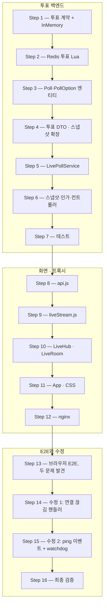

# 단계 18 따라하기 2일차 — 투표·화면·nginx, 그리고 E2E가 찾은 두 문제

> 1일차([[LIVE-POLL-WALKTHROUGH-DAY1]], 커밋 `edee6e0`)가 끝난 코드에서 시작한다. 개념 배경은 [[LIVE-POLL]].
> 모든 코드 블록은 해당 작업 시점의 실제 커밋 파일에서 생성했다 — 투표 백엔드는 `2c57eee`·`2a30f7b`,
> 화면은 `4824a49`, 수정은 `1ad06b3`. 커밋되지 않은 중간 버전(첫 `liveStream.js`)은 구현 계획 문서에서 가져왔다.

2일차가 끝나면 진행자가 객관식 투표를 열고, 참여자가 휴대폰으로 투표하면 진행자 화면의 결과 막대가 **실시간으로 자란다**.
그리고 브라우저로 실제로 써 보다가 드러난 두 가지 결함 — **연결 끊김이 ERROR로 쌓이는 문제**와 **죽은 연결을 "연결됨"으로 믿는 문제** — 을
테스트로 재현하고 고친다. 이 수정 과정이 2일차의 가장 중요한 학습 내용이다.

학습 목표 — 2일차를 마치면 다음을 할 수 있다.

- Redis HASH + `HSETNX` Lua로 "1인 1표"를 원자적으로 보장한다
- 브라우저 `EventSource`로 구독하고, 스냅샷 + 이벤트 병합으로 화면 상태를 맞춘다
- 순서가 뒤바뀌어 도착하는 실시간 메시지를 **단조 증가 max 병합**으로 안전하게 합친다
- nginx 버퍼링이 SSE를 망가뜨리는 이유를 설명하고 설정으로 막는다
- half-open 연결을 heartbeat 이벤트 + 클라이언트 watchdog으로 감지·복구한다

---

## 0. 작업 지도



| Step | 만드는 것 | 고치는 것 | 이 순서인 이유 |
|------|-----------|-----------|----------------|
| 1 | — | `ErrorCode`, `LiveCounterStore`, `InMemoryLiveCounterStore`, 계약 테스트 | 1일차와 같은 리듬 — 계약과 규칙부터 |
| 2 | — | `RedisLiveCounterStore` | 계약 확정 뒤 운영 구현 |
| 3 | `Poll`, `PollOption`, `PollRepository` | — | 서비스가 쓸 엔티티 |
| 4 | 투표 DTO 4종 | `LiveSnapshotResponse`, `LiveChangedEvent` | 서비스 시그니처의 재료 |
| 5 | `LivePollService` | — | 투표 유스케이스 |
| 6 | `LivePollController` | `LiveEventService`, `LiveSecurity` | 스냅샷이 투표를 포함하도록, 웹은 맨 위 |
| 7 | `LivePollServiceTest` | 통합 테스트·코드 발급 테스트 | 백엔드 완료 판정 |
| 8~12 | `liveStream.js`, `LiveHub`, `LiveRoom` | `api.js`, `App.jsx`, `styles.css`, `nginx.conf` | API가 확정돼야 화면이 붙는다 |
| 13 | — | — | 사람이 써 봐야 드러나는 문제가 있다 |
| 14~15 | `ClientDisconnectHandlingTest` | `GlobalExceptionHandler`, `LiveSseRegistry`, `LiveChangedEvent`, `liveStream.js` | 발견한 문제를 RED → GREEN으로 |
| 16 | — | — | 전체 회귀 + 기동 검증 |

---

## Step 1. 투표 계약 — "1인 1표"를 규칙으로 고정

**왜 지금, 무슨 의미인가.** 1일차 좋아요와 똑같은 리듬이다 — 계약(인터페이스)에 투표 메서드를 추가하고, 규칙을 테스트로 먼저 못 박은 뒤,
메모리 구현으로 초록을 만든다. 좋아요와 다른 점은 **되돌리기(토글)가 없다**는 것: 한 번 투표하면 끝이고, 두 번째는 거부된다.

### ① `ErrorCode` — 4줄 추가

NOT_FOUND 그룹(`QUESTION_NOT_FOUND` 아래):

```java
  POLL_NOT_FOUND(HttpStatus.NOT_FOUND, "투표를 찾을 수 없습니다."),
  POLL_OPTION_NOT_FOUND(HttpStatus.NOT_FOUND, "투표 선택지를 찾을 수 없습니다."),
```

CONFLICT 그룹(`LIVE_EVENT_CLOSED` 아래):

```java
  POLL_CLOSED(HttpStatus.CONFLICT, "마감된 투표입니다."),
  ALREADY_VOTED(HttpStatus.CONFLICT, "이미 투표했습니다."),
```

### ② 계약 테스트에 두 케이스 추가 (RED)

`LiveCounterStoreContractTest`에 `import java.util.Map;`과 아래 두 테스트를 추가한다(전체 파일):

`src/test/java/com/example/board/live/counter/LiveCounterStoreContractTest.java`

```java
package com.example.board.live.counter;

import static org.assertj.core.api.Assertions.assertThat;

import java.util.Map;
import org.junit.jupiter.api.Test;

// 단계 18: 어떤 구현이든 지켜야 할 집계 규칙(Redis 구현은 로컬 E2E로 같은 계약을 실증).
class LiveCounterStoreContractTest {

  private final LiveCounterStore store = new InMemoryLiveCounterStore();

  @Test
  void should_startAtZero_afterAddQuestion() {
    store.addQuestion(1L, 10L);
    assertThat(store.likeCounts(1L)).containsEntry(10L, 0L);
  }

  @Test
  void should_toggleOnAndOff() {
    store.addQuestion(1L, 10L);
    assertThat(store.toggleLike(1L, 10L, 100L)).isEqualTo(new LikeResult(true, 1));
    assertThat(store.toggleLike(1L, 10L, 100L)).isEqualTo(new LikeResult(false, 0));
    assertThat(store.toggleLike(1L, 10L, 100L)).isEqualTo(new LikeResult(true, 1));
  }

  @Test
  void should_countDistinctUsers() {
    store.addQuestion(1L, 10L);
    store.toggleLike(1L, 10L, 100L);
    assertThat(store.toggleLike(1L, 10L, 200L).likeCount()).isEqualTo(2);
  }

  @Test
  void should_isolateLikedIds_perUserAndEvent() {
    store.addQuestion(1L, 10L);
    store.addQuestion(2L, 20L);
    store.toggleLike(1L, 10L, 100L);
    store.toggleLike(2L, 20L, 100L);
    assertThat(store.likedQuestionIds(1L, 100L)).containsExactly(10L);
    assertThat(store.likedQuestionIds(1L, 200L)).isEmpty();
  }

  @Test
  void should_dropFromCounts_afterRemoveQuestion() {
    store.addQuestion(1L, 10L);
    store.toggleLike(1L, 10L, 100L);
    store.removeQuestion(1L, 10L);
    assertThat(store.likeCounts(1L)).doesNotContainKey(10L);
  }

  @Test
  void should_acceptFirstVoteOnly() {
    assertThat(store.vote(5L, 51L, 100L)).isTrue();
    assertThat(store.vote(5L, 52L, 100L)).isFalse();
    assertThat(store.voteCounts(5L)).containsExactlyInAnyOrderEntriesOf(Map.of(51L, 1L));
    assertThat(store.votedOptionId(5L, 100L)).isEqualTo(51L);
    assertThat(store.votedOptionId(5L, 200L)).isNull();
  }

  @Test
  void should_isolatePolls() {
    store.vote(5L, 51L, 100L);
    assertThat(store.vote(6L, 61L, 100L)).isTrue();
    assertThat(store.voteCounts(6L)).containsEntry(61L, 1L);
  }
}
```

```bash
./gradlew test --tests '*LiveCounterStoreContractTest'
# 기대: 컴파일 실패 — vote/voteCounts/votedOptionId가 아직 없다 (RED)
```

### ③ 계약 확장 + 메모리 구현 (GREEN)

변경 전후 — 1일차 `LiveCounterStore` 끝에 메서드 3개가 붙는다. `votedOptionId`가 `null`을 돌려줄 수 있도록 `Long`(박싱 타입)이다.

`src/main/java/com/example/board/live/counter/LiveCounterStore.java`

```java
package com.example.board.live.counter;

import java.util.Map;
import java.util.Set;

// 단계 18: 실시간 집계 저장소 계약 — 운영은 Redis, 테스트는 InMemory(단계 15 RefreshTokenStore 패턴).
public interface LiveCounterStore {

  void addQuestion(Long eventId, Long questionId);

  void removeQuestion(Long eventId, Long questionId);

  // 처음 누르면 +1(liked=true), 다시 누르면 -1(liked=false). 확인과 증감이 원자적이어야 한다.
  LikeResult toggleLike(Long eventId, Long questionId, Long userId);

  Map<Long, Long> likeCounts(Long eventId);

  Set<Long> likedQuestionIds(Long eventId, Long userId);

  // 사용자당 1표. 이미 투표했으면 false(집계 변화 없음).
  boolean vote(Long pollId, Long optionId, Long userId);

  Map<Long, Long> voteCounts(Long pollId);

  // 투표 안 했으면 null.
  Long votedOptionId(Long pollId, Long userId);
}
```

`InMemoryLiveCounterStore` — 필드 2개(`voters`, `counts`)와 메서드 3개 추가, `clear()`도 새 필드를 비우도록 수정:

`src/test/java/com/example/board/live/counter/InMemoryLiveCounterStore.java`

```java
package com.example.board.live.counter;

import java.util.HashMap;
import java.util.HashSet;
import java.util.Map;
import java.util.Set;

// 단계 18: 테스트용 — synchronized로 Lua의 원자성을 흉내낸다(TTL은 Redis 실구현이 담당).
public class InMemoryLiveCounterStore implements LiveCounterStore {

  private final Map<Long, Map<Long, Long>> scores = new HashMap<>();
  private final Map<String, Set<Long>> userLikes = new HashMap<>();
  private final Map<Long, Map<Long, Long>> voters = new HashMap<>();
  private final Map<Long, Map<Long, Long>> counts = new HashMap<>();

  @Override
  public synchronized void addQuestion(Long eventId, Long questionId) {
    scores.computeIfAbsent(eventId, id -> new HashMap<>()).putIfAbsent(questionId, 0L);
  }

  @Override
  public synchronized void removeQuestion(Long eventId, Long questionId) {
    Map<Long, Long> eventScores = scores.get(eventId);
    if (eventScores != null) {
      eventScores.remove(questionId);
    }
  }

  @Override
  public synchronized LikeResult toggleLike(Long eventId, Long questionId, Long userId) {
    Set<Long> liked = userLikes.computeIfAbsent(eventId + ":" + userId, key -> new HashSet<>());
    boolean nowLiked = liked.add(questionId);
    if (!nowLiked) {
      liked.remove(questionId);
    }
    long count = scores.computeIfAbsent(eventId, id -> new HashMap<>())
        .merge(questionId, nowLiked ? 1L : -1L, Long::sum);
    return new LikeResult(nowLiked, count);
  }

  @Override
  public synchronized Map<Long, Long> likeCounts(Long eventId) {
    return Map.copyOf(scores.getOrDefault(eventId, Map.of()));
  }

  @Override
  public synchronized Set<Long> likedQuestionIds(Long eventId, Long userId) {
    return Set.copyOf(userLikes.getOrDefault(eventId + ":" + userId, Set.of()));
  }

  @Override
  public synchronized boolean vote(Long pollId, Long optionId, Long userId) {
    if (voters.computeIfAbsent(pollId, id -> new HashMap<>()).putIfAbsent(userId, optionId) != null) {
      return false;
    }
    counts.computeIfAbsent(pollId, id -> new HashMap<>()).merge(optionId, 1L, Long::sum);
    return true;
  }

  @Override
  public synchronized Map<Long, Long> voteCounts(Long pollId) {
    return Map.copyOf(counts.getOrDefault(pollId, Map.of()));
  }

  @Override
  public synchronized Long votedOptionId(Long pollId, Long userId) {
    return voters.getOrDefault(pollId, Map.of()).get(userId);
  }

  public synchronized void clear() {
    scores.clear();
    userLikes.clear();
    voters.clear();
    counts.clear();
  }
}
```

`putIfAbsent`가 핵심이다 — 이미 값이 있으면 기존 값을 돌려주고(=이미 투표함) 아무것도 바꾸지 않는다. Redis `HSETNX`와 정확히 같은 의미다.

| 클래스 | 출처 | 역할 |
|--------|------|------|
| `ErrorCode` | 기존 — 수정 | 투표 오류 4종 |
| `LiveCounterStore` | 1일차 Step 4 — 수정 | 투표 계약 추가 |
| `InMemoryLiveCounterStore` | 1일차 Step 5 — 수정 | 투표 메모리 구현 |
| `LiveCounterStoreContractTest` | 1일차 Step 5 — 수정 | 투표 규칙 2케이스 |

**확인**: `./gradlew test --tests '*LiveCounterStoreContractTest'` → 7 tests PASS

---

## Step 2. Redis 투표 — HASH 두 개와 `HSETNX`

**왜 지금, 무슨 의미인가.** 운영 구현이다. 좋아요는 ZSET(순위가 필요)이었지만, 투표는 **선택지별 개수**만 있으면 되므로 HASH를 쓴다.

### 개념: 키 설계와 `HSETNX`

| 키 | 타입 | field → value | 쓰임 |
|----|------|---------------|------|
| `live:poll:{pollId}:voters` | HASH | userId → 고른 optionId | 중복 방지 + 스냅샷의 "내 선택" |
| `live:poll:{pollId}:counts` | HASH | optionId → 득표수 | 결과 막대 |

- `HSETNX key field value` — field가 **없을 때만** 저장하고 1, 이미 있으면 아무것도 안 하고 0. "처음 투표인가?"의 답이 곧 저장 결과다.
- 성공(1)일 때만 `HINCRBY counts optionId 1`. 이 두 명령을 Lua로 묶어 사이에 끼어들 틈을 없앤다.
- voters를 SET이 아니라 HASH로 둔 이유: "투표했나"뿐 아니라 "**무엇을** 골랐나"까지 알아야 화면에 내 선택을 표시한다.

`src/main/java/com/example/board/live/counter/RedisLiveCounterStore.java`

```java
package com.example.board.live.counter;

import java.time.Duration;
import java.util.HashMap;
import java.util.List;
import java.util.Map;
import java.util.Set;
import java.util.stream.Collectors;
import lombok.RequiredArgsConstructor;
import org.springframework.data.redis.core.StringRedisTemplate;
import org.springframework.data.redis.core.ZSetOperations.TypedTuple;
import org.springframework.data.redis.core.script.DefaultRedisScript;
import org.springframework.data.redis.core.script.RedisScript;
import org.springframework.stereotype.Component;

// 단계 18: 좋아요 집계의 Redis 구현.
//   live:event:{eventId}:questions            ZSET  member=questionId, score=좋아요 수
//   live:event:{eventId}:user:{userId}:likes  SET   이 사용자가 좋아요 누른 questionId
//   live:poll:{pollId}:voters                 HASH  userId → 고른 optionId
//   live:poll:{pollId}:counts                 HASH  optionId → 득표수
@Component
@RequiredArgsConstructor
public class RedisLiveCounterStore implements LiveCounterStore {

  static final long TTL_SECONDS = Duration.ofDays(7).toSeconds();

  // "SADD 결과 확인 → ZINCRBY"를 명령 두 개로 보내면 그 사이에 다른 요청이 끼어든다.
  // Lua 스크립트는 Redis 안에서 통째로 실행되어 중간에 끼어들 틈이 없다(원자성) + 왕복 1회.
  // KEYS[1]=사용자 좋아요 SET, KEYS[2]=질문 ZSET / ARGV[1]=questionId, ARGV[2]=TTL(초)
  private static final String TOGGLE_LIKE_LUA = """
      local liked
      local score
      if redis.call('SADD', KEYS[1], ARGV[1]) == 1 then
        liked = 1
        score = redis.call('ZINCRBY', KEYS[2], 1, ARGV[1])
      else
        redis.call('SREM', KEYS[1], ARGV[1])
        liked = 0
        score = redis.call('ZINCRBY', KEYS[2], -1, ARGV[1])
      end
      redis.call('EXPIRE', KEYS[1], ARGV[2])
      redis.call('EXPIRE', KEYS[2], ARGV[2])
      return {liked, tonumber(score)}
      """;

  // 결과가 [liked, score] 배열이라 List로 받는다(제네릭 클래스 리터럴이 없어 raw 타입).
  @SuppressWarnings("rawtypes")
  private static final RedisScript<List> TOGGLE_LIKE =
      new DefaultRedisScript<>(TOGGLE_LIKE_LUA, List.class);

  // HSETNX는 "필드가 없을 때만 저장" — 1이면 첫 투표, 0이면 이미 투표. 성공했을 때만 HINCRBY.
  // KEYS[1]=투표자 HASH, KEYS[2]=득표 HASH / ARGV[1]=userId, ARGV[2]=optionId, ARGV[3]=TTL(초)
  private static final String VOTE_LUA = """
      if redis.call('HSETNX', KEYS[1], ARGV[1], ARGV[2]) == 0 then
        return 0
      end
      redis.call('HINCRBY', KEYS[2], ARGV[2], 1)
      redis.call('EXPIRE', KEYS[1], ARGV[3])
      redis.call('EXPIRE', KEYS[2], ARGV[3])
      return 1
      """;

  private static final RedisScript<Long> VOTE = new DefaultRedisScript<>(VOTE_LUA, Long.class);

  private final StringRedisTemplate redis;

  @Override
  public void addQuestion(Long eventId, Long questionId) {
    String key = questionsKey(eventId);
    redis.opsForZSet().add(key, questionId.toString(), 0);
    redis.expire(key, Duration.ofSeconds(TTL_SECONDS));
  }

  @Override
  public void removeQuestion(Long eventId, Long questionId) {
    redis.opsForZSet().remove(questionsKey(eventId), questionId.toString());
  }

  @Override
  public LikeResult toggleLike(Long eventId, Long questionId, Long userId) {
    List<?> result = redis.execute(TOGGLE_LIKE,
        List.of(userLikesKey(eventId, userId), questionsKey(eventId)),
        questionId.toString(), String.valueOf(TTL_SECONDS));
    if (result == null || result.size() != 2) {
      throw new IllegalStateException("toggle-like script returned " + result);
    }
    return new LikeResult(toLong(result.get(0)) == 1L, toLong(result.get(1)));
  }

  @Override
  public Map<Long, Long> likeCounts(Long eventId) {
    Set<TypedTuple<String>> tuples = redis.opsForZSet().rangeWithScores(questionsKey(eventId), 0, -1);
    Map<Long, Long> counts = new HashMap<>();
    if (tuples != null) {
      for (TypedTuple<String> tuple : tuples) {
        Double score = tuple.getScore();
        counts.put(Long.valueOf(tuple.getValue()), score == null ? 0L : score.longValue());
      }
    }
    return counts;
  }

  @Override
  public Set<Long> likedQuestionIds(Long eventId, Long userId) {
    Set<String> members = redis.opsForSet().members(userLikesKey(eventId, userId));
    if (members == null) {
      return Set.of();
    }
    return members.stream().map(Long::valueOf).collect(Collectors.toUnmodifiableSet());
  }

  @Override
  public boolean vote(Long pollId, Long optionId, Long userId) {
    Long result = redis.execute(VOTE, List.of(votersKey(pollId), countsKey(pollId)),
        userId.toString(), optionId.toString(), String.valueOf(TTL_SECONDS));
    return Long.valueOf(1L).equals(result);
  }

  @Override
  public Map<Long, Long> voteCounts(Long pollId) {
    Map<Object, Object> entries = redis.opsForHash().entries(countsKey(pollId));
    Map<Long, Long> result = new HashMap<>();
    entries.forEach((option, count) ->
        result.put(Long.valueOf(option.toString()), Long.valueOf(count.toString())));
    return result;
  }

  @Override
  public Long votedOptionId(Long pollId, Long userId) {
    Object optionId = redis.opsForHash().get(votersKey(pollId), userId.toString());
    return optionId == null ? null : Long.valueOf(optionId.toString());
  }

  private static long toLong(Object value) {
    return value instanceof Number number ? number.longValue() : Long.parseLong(value.toString());
  }

  private static String questionsKey(Long eventId) {
    return "live:event:" + eventId + ":questions";
  }

  private static String userLikesKey(Long eventId, Long userId) {
    return "live:event:" + eventId + ":user:" + userId + ":likes";
  }

  private static String votersKey(Long pollId) {
    return "live:poll:" + pollId + ":voters";
  }

  private static String countsKey(Long pollId) {
    return "live:poll:" + pollId + ":counts";
  }
}
```

| 클래스 | 출처 | 역할 |
|--------|------|------|
| `RedisLiveCounterStore` | 1일차 Step 6 — 수정 | 투표 Lua·조회 추가 |
| `opsForHash()` | Spring Data Redis | HASH 명령(`HGETALL`=`entries`, `HGET`=`get`) |

**확인** — 실제 Redis에서 Lua를 직접 실행:

```bash
LUA=$(python3 -c "
import re;s=open('src/main/java/com/example/board/live/counter/RedisLiveCounterStore.java').read()
print(re.search(r'VOTE_LUA = \"\"\"\n(.*?)\"\"\"',s,re.S).group(1))")
docker exec board-redis redis-cli EVAL "$LUA" 2 test:v test:c 100 51 60   # 1 — 첫 투표
docker exec board-redis redis-cli EVAL "$LUA" 2 test:v test:c 100 52 60   # 0 — 같은 사람 재투표
docker exec board-redis redis-cli EVAL "$LUA" 2 test:v test:c 200 52 60   # 1 — 다른 사람
docker exec board-redis redis-cli HGETALL test:c                            # 51 1 52 1
docker exec board-redis redis-cli DEL test:v test:c
```

---

## Step 3. `Poll`·`PollOption` — 생명주기를 함께하는 부모·자식

**왜 지금, 무슨 의미인가.** 투표와 선택지는 함께 만들어지고 함께 사라진다. JPA의 **cascade**가 정확히 이 관계를 표현한다.

### 개념: `cascade = ALL` + `orphanRemoval` + `@OrderBy`

| 설정 | 의미 |
|------|------|
| `mappedBy = "poll"` | FK는 자식(`PollOption.poll`)이 가진다 — 연관의 주인은 자식 |
| `cascade = CascadeType.ALL` | `pollRepository.save(poll)` 한 번으로 선택지까지 INSERT |
| `orphanRemoval = true` | 리스트에서 빠진 선택지는 DELETE |
| `@OrderBy("sortOrder ASC")` | 조회할 때마다 입력 순서대로(김밥, 라면, 돈가스) |

- `PollOption` 생성자가 **package-private**인 이유: 선택지는 투표 없이 존재할 수 없다. 오직 `Poll` 생성자만 만든다.
- IDENTITY 전략이라 `save()` 직후 INSERT가 실행되어 선택지 id가 바로 채워진다 — 생성 응답에 선택지 id를 실을 수 있는 이유.
- `Poll.assertOpen()`은 1일차 `LiveEvent.assertOpen()`과 같은 패턴(규칙을 엔티티에).

`src/main/java/com/example/board/live/Poll.java`

```java
package com.example.board.live;

import com.example.board.global.entity.BaseTimeEntity;
import com.example.board.global.exception.BusinessException;
import com.example.board.global.exception.ErrorCode;
import jakarta.persistence.CascadeType;
import jakarta.persistence.Column;
import jakarta.persistence.Entity;
import jakarta.persistence.EnumType;
import jakarta.persistence.Enumerated;
import jakarta.persistence.FetchType;
import jakarta.persistence.GeneratedValue;
import jakarta.persistence.GenerationType;
import jakarta.persistence.Id;
import jakarta.persistence.Index;
import jakarta.persistence.JoinColumn;
import jakarta.persistence.ManyToOne;
import jakarta.persistence.OneToMany;
import jakarta.persistence.OrderBy;
import jakarta.persistence.Table;
import java.util.ArrayList;
import java.util.List;
import lombok.AccessLevel;
import lombok.Getter;
import lombok.NoArgsConstructor;
import org.hibernate.annotations.JdbcTypeCode;
import org.hibernate.type.SqlTypes;

// 단계 18: 객관식 투표. 선택지는 투표와 생명주기가 같으므로 cascade로 함께 저장·삭제된다.
// 득표수는 여기 없다 — Redis HASH가 원천.
@Entity
@Table(name = "live_polls", indexes = @Index(name = "idx_live_polls_event", columnList = "event_id"))
@Getter
@NoArgsConstructor(access = AccessLevel.PROTECTED)
public class Poll extends BaseTimeEntity {

  @Id
  @GeneratedValue(strategy = GenerationType.IDENTITY)
  private Long id;

  @ManyToOne(fetch = FetchType.LAZY, optional = false)
  @JoinColumn(name = "event_id", nullable = false)
  private LiveEvent event;

  @Column(nullable = false, length = 100)
  private String title;

  @Enumerated(EnumType.STRING)
  @JdbcTypeCode(SqlTypes.VARCHAR)
  @Column(nullable = false, length = 10)
  private LiveStatus status;

  @OneToMany(mappedBy = "poll", cascade = CascadeType.ALL, orphanRemoval = true)
  @OrderBy("sortOrder ASC")
  private List<PollOption> options = new ArrayList<>();

  public Poll(LiveEvent event, String title, List<String> optionTexts) {
    this.event = event;
    this.title = title;
    this.status = LiveStatus.OPEN;
    for (int i = 0; i < optionTexts.size(); i++) {
      options.add(new PollOption(this, optionTexts.get(i), i));
    }
  }

  public boolean isOpen() {
    return status == LiveStatus.OPEN;
  }

  public void close() {
    this.status = LiveStatus.CLOSED;
  }

  public void assertOpen() {
    if (!isOpen()) {
      throw new BusinessException(ErrorCode.POLL_CLOSED);
    }
  }

  public boolean hasOption(Long optionId) {
    return options.stream().anyMatch(option -> option.getId().equals(optionId));
  }
}
```

`src/main/java/com/example/board/live/PollOption.java`

```java
package com.example.board.live;

import com.example.board.global.entity.BaseTimeEntity;
import jakarta.persistence.Column;
import jakarta.persistence.Entity;
import jakarta.persistence.FetchType;
import jakarta.persistence.GeneratedValue;
import jakarta.persistence.GenerationType;
import jakarta.persistence.Id;
import jakarta.persistence.JoinColumn;
import jakarta.persistence.ManyToOne;
import jakarta.persistence.Table;
import lombok.AccessLevel;
import lombok.Getter;
import lombok.NoArgsConstructor;

@Entity
@Table(name = "live_poll_options")
@Getter
@NoArgsConstructor(access = AccessLevel.PROTECTED)
public class PollOption extends BaseTimeEntity {

  @Id
  @GeneratedValue(strategy = GenerationType.IDENTITY)
  private Long id;

  @ManyToOne(fetch = FetchType.LAZY, optional = false)
  @JoinColumn(name = "poll_id", nullable = false)
  private Poll poll;

  @Column(nullable = false, length = 50)
  private String text;

  @Column(nullable = false)
  private int sortOrder;

  // Poll 생성자만 만든다(package-private) — 선택지는 투표 없이 존재하지 않는다.
  PollOption(Poll poll, String text, int sortOrder) {
    this.poll = poll;
    this.text = text;
    this.sortOrder = sortOrder;
  }
}
```

`src/main/java/com/example/board/live/PollRepository.java`

```java
package com.example.board.live;

import java.util.List;
import java.util.Optional;
import org.springframework.data.jpa.repository.EntityGraph;
import org.springframework.data.jpa.repository.JpaRepository;
import org.springframework.data.jpa.repository.Query;
import org.springframework.data.repository.query.Param;

public interface PollRepository extends JpaRepository<Poll, Long> {

  @EntityGraph(attributePaths = "options")
  List<Poll> findByEventIdOrderByIdDesc(Long eventId);

  @EntityGraph(attributePaths = {"event", "options"})
  Optional<Poll> findWithEventAndOptionsById(Long id);

  @Query("select p.event.host.id from Poll p where p.id = :id")
  Optional<Long> findHostIdById(@Param("id") Long id);
}
```

`findByEventIdOrderByIdDesc`의 `@EntityGraph("options")` — 투표 목록을 그릴 때 선택지를 함께 가져온다(투표마다 선택지 SELECT가 따로 나가는 N+1 방지).

| 클래스 | 출처 | 역할 |
|--------|------|------|
| `Poll` | 이 Step에서 생성 | 투표 엔티티(`live_polls`) |
| `PollOption` | 이 Step에서 생성 | 선택지(`live_poll_options`) |
| `PollRepository` | 이 Step에서 생성 | 이벤트별 목록·진행자 id |
| `LiveEvent`, `LiveStatus` | 1일차 Step 1·2 | 소속 이벤트·상태 |
| `@OneToMany`, `@OrderBy`, `CascadeType` | Jakarta Persistence | 컬렉션 매핑 |

**확인**: `./gradlew test --tests '*LiveRepositoryTest'` → 컨텍스트가 새 엔티티로 기동되는지(1 PASS)

---

## Step 4. 투표 DTO, 스냅샷 확장, 이벤트 이름

**왜 지금, 무슨 의미인가.** 서비스가 쓸 입출력 타입이다.

### 개념: 컨테이너 요소 검증 `List<@NotBlank @Size(max = 50) String>`

`@Size(min = 2, max = 5)`는 **리스트 크기**를, 타입 인자 안의 `@NotBlank @Size(max = 50)`는 **각 원소**를 검증한다.
`["김밥", ""]`은 개수는 맞지만 두 번째 원소에서 400이 난다.

- `PollResponse.myOptionId` — 조회자의 선택. SSE 브로드캐스트에는 항상 `null`로 싣는다(공개 스트림 원칙).
- `LiveSnapshotResponse` — 1일차의 2필드에 `polls`가 추가된다. 이 순간 1일차 `LiveEventService`가 컴파일되지 않는다 → Step 6에서 고친다(의도된 짧은 RED).

`src/main/java/com/example/board/live/dto/PollCreateRequest.java`

```java
package com.example.board.live.dto;

import jakarta.validation.constraints.NotBlank;
import jakarta.validation.constraints.NotNull;
import jakarta.validation.constraints.Size;
import java.util.List;

// List<@NotBlank String>: 컨테이너 요소 제약 — 리스트 크기뿐 아니라 각 선택지 문자열도 검증한다.
public record PollCreateRequest(
    @NotBlank @Size(max = 100) String title,
    @NotNull @Size(min = 2, max = 5) List<@NotBlank @Size(max = 50) String> options
) {
}
```

`src/main/java/com/example/board/live/dto/VoteRequest.java`

```java
package com.example.board.live.dto;

import jakarta.validation.constraints.NotNull;

public record VoteRequest(@NotNull Long optionId) {
}
```

`src/main/java/com/example/board/live/dto/PollOptionResponse.java`

```java
package com.example.board.live.dto;

public record PollOptionResponse(Long id, String text, long count) {
}
```

`src/main/java/com/example/board/live/dto/PollResponse.java`

```java
package com.example.board.live.dto;

import com.example.board.live.LiveStatus;
import com.example.board.live.Poll;
import java.util.List;
import java.util.Map;

// myOptionId: 조회자의 선택(없으면 null). SSE 브로드캐스트에는 항상 null로 싣는다.
public record PollResponse(
    Long id,
    String title,
    LiveStatus status,
    List<PollOptionResponse> options,
    long totalVotes,
    Long myOptionId
) {

  public static PollResponse of(Poll poll, Map<Long, Long> counts, Long myOptionId) {
    List<PollOptionResponse> options = poll.getOptions().stream()
        .map(option -> new PollOptionResponse(
            option.getId(), option.getText(), counts.getOrDefault(option.getId(), 0L)))
        .toList();
    long total = options.stream().mapToLong(PollOptionResponse::count).sum();
    return new PollResponse(poll.getId(), poll.getTitle(), poll.getStatus(), options, total,
        myOptionId);
  }
}
```

변경 후 `LiveSnapshotResponse`(변경 전: `event`, `questions` 2필드):

`src/main/java/com/example/board/live/dto/LiveSnapshotResponse.java`

```java
package com.example.board.live.dto;

import java.util.List;

// 단계 18: 입장·재연결 때 한 번에 받는 "현재 상태 전체". 이후 변화는 SSE로만 받는다.
public record LiveSnapshotResponse(
    LiveEventResponse event,
    List<QuestionResponse> questions,
    List<PollResponse> polls
) {
}
```

변경 후 `LiveChangedEvent`(`POLL_*` 상수 3개 추가):

`src/main/java/com/example/board/live/sse/LiveChangedEvent.java`

```java
package com.example.board.live.sse;

// 단계 18: 서비스 → 브로드캐스터로 넘기는 "무엇이 바뀌었나" 메시지(Spring ApplicationEvent로 발행).
// name은 SSE의 event 필드가 되고, 브라우저는 addEventListener(name)으로 받는다.
public record LiveChangedEvent(Long eventId, String name, Object payload) {

  public static final String CONNECTED = "connected";
  public static final String QUESTION_CREATED = "question.created";
  public static final String QUESTION_LIKED = "question.liked";
  public static final String QUESTION_DELETED = "question.deleted";
  public static final String EVENT_CLOSED = "event.closed";
  public static final String POLL_CREATED = "poll.created";
  public static final String POLL_VOTED = "poll.voted";
  public static final String POLL_CLOSED = "poll.closed";
}
```

| 클래스 | 출처 | 역할 |
|--------|------|------|
| `PollCreateRequest`, `VoteRequest` | 이 Step에서 생성 | 입력·검증 |
| `PollOptionResponse`, `PollResponse` | 이 Step에서 생성 | 출력(득표·합계·내 선택) |
| `LiveSnapshotResponse` | 1일차 Step 10 — 수정 | `polls` 추가 |
| `LiveChangedEvent` | 1일차 Step 7 — 수정 | 투표 이벤트 이름 |

---

## Step 5. `LivePollService` — 검증 순서가 곧 설계

**왜 지금, 무슨 의미인가.** 투표 유스케이스다. `vote()`의 검증 순서를 눈여겨본다 — 앞의 검사가 실패하면 뒤는 의미가 없다.

| 순서 | 검사 | 실패 시 | 이 위치인 이유 |
|------|------|---------|----------------|
| 1 | 투표가 존재하는가 | 404 `POLL_NOT_FOUND` | 없는 것엔 아무것도 못 묻는다 |
| 2 | 이벤트가 열려 있는가 | 409 `LIVE_EVENT_CLOSED` | 이벤트 종료가 투표 마감보다 상위 규칙 |
| 3 | 투표가 열려 있는가 | 409 `POLL_CLOSED` | |
| 4 | 이 투표의 선택지인가 | 404 `POLL_OPTION_NOT_FOUND` | 다른 투표의 optionId로 집계를 오염시키는 요청 차단 |
| 5 | 처음 투표인가(Redis Lua) | 409 `ALREADY_VOTED` | **마지막**에 — 앞 검사가 실패했는데 표가 기록되면 안 된다 |

투표 후 득표수(`voteCounts`)를 다시 읽어 전파한다. 동시에 여러 명이 투표하면 브로드캐스트가 **순서가 뒤바뀌어** 도착할 수 있다
(나중 요청의 결과가 먼저 도착). 득표수는 줄지 않으므로 화면은 "옵션별로 큰 값"을 취하면 항상 최신이 남는다 — Step 10의 `mergePoll`.

`src/main/java/com/example/board/live/LivePollService.java`

```java
package com.example.board.live;

import com.example.board.global.exception.DuplicateException;
import com.example.board.global.exception.ErrorCode;
import com.example.board.global.exception.NotFoundException;
import com.example.board.live.counter.LiveCounterStore;
import com.example.board.live.dto.LivePayloads;
import com.example.board.live.dto.PollCreateRequest;
import com.example.board.live.dto.PollResponse;
import com.example.board.live.sse.LiveChangedEvent;
import java.util.List;
import java.util.Map;
import lombok.RequiredArgsConstructor;
import lombok.extern.slf4j.Slf4j;
import org.springframework.context.ApplicationEventPublisher;
import org.springframework.stereotype.Service;
import org.springframework.transaction.annotation.Transactional;

@Slf4j
@Service
@RequiredArgsConstructor
public class LivePollService {

  private final LiveEventService liveEventService;
  private final PollRepository pollRepository;
  private final LiveCounterStore counterStore;
  private final ApplicationEventPublisher publisher;

  @Transactional
  public PollResponse create(String code, PollCreateRequest request) {
    LiveEvent event = liveEventService.getEvent(code);
    event.assertOpen();
    List<String> options = request.options().stream().map(String::strip).toList();
    Poll poll = pollRepository.save(new Poll(event, request.title().strip(), options));
    PollResponse response = PollResponse.of(poll, Map.of(), null);
    log.info("투표 생성: eventId={}, pollId={}, options={}", event.getId(), poll.getId(), options.size());
    publisher.publishEvent(new LiveChangedEvent(event.getId(), LiveChangedEvent.POLL_CREATED, response));
    return response;
  }

  // 검증 순서: 존재(404) → 이벤트 종료(409) → 투표 마감(409) → 이 투표의 선택지인가(404) → 1인 1표(409).
  @Transactional(readOnly = true)
  public PollResponse vote(Long pollId, Long optionId, Long userId) {
    Poll poll = pollRepository.findWithEventAndOptionsById(pollId)
        .orElseThrow(() -> new NotFoundException(ErrorCode.POLL_NOT_FOUND));
    poll.getEvent().assertOpen();
    poll.assertOpen();
    if (!poll.hasOption(optionId)) {
      throw new NotFoundException(ErrorCode.POLL_OPTION_NOT_FOUND);
    }
    if (!counterStore.vote(pollId, optionId, userId)) {
      throw new DuplicateException(ErrorCode.ALREADY_VOTED);
    }
    Map<Long, Long> counts = counterStore.voteCounts(pollId);
    publisher.publishEvent(new LiveChangedEvent(poll.getEvent().getId(), LiveChangedEvent.POLL_VOTED,
        PollResponse.of(poll, counts, null)));
    return PollResponse.of(poll, counts, optionId);
  }

  @Transactional
  public void close(Long pollId) {
    Poll poll = pollRepository.findWithEventAndOptionsById(pollId)
        .orElseThrow(() -> new NotFoundException(ErrorCode.POLL_NOT_FOUND));
    if (!poll.isOpen()) {
      return;
    }
    poll.close();
    publisher.publishEvent(new LiveChangedEvent(poll.getEvent().getId(), LiveChangedEvent.POLL_CLOSED,
        new LivePayloads.IdRef(pollId)));
  }
}
```

| 클래스 | 출처 | 역할 |
|--------|------|------|
| `LivePollService` | 이 Step에서 생성 | 투표 생성·투표·마감 |
| `LiveEventService` | 1일차 Step 11 | `getEvent()` 재사용 |
| `DuplicateException` | 기존(단계 2) | 409 |

---

## Step 6. 스냅샷에 투표, 진행자 인가, 컨트롤러

**왜 지금, 무슨 의미인가.** Step 4에서 깨뜨린 컴파일을 되살리고, 투표를 HTTP로 연다.

### ① `LiveEventService` — 수정 (변경점 3곳)

1. 필드 `private final PollRepository pollRepository;` 추가
2. `getSnapshot`이 `polls(event.getId(), viewerId)`를 세 번째 인자로 넘김
3. `polls()` 메서드 추가 — 투표마다 득표수와 **조회자의 선택**을 붙인다

`src/main/java/com/example/board/live/LiveEventService.java`

```java
package com.example.board.live;

import com.example.board.global.exception.BusinessException;
import com.example.board.global.exception.ErrorCode;
import com.example.board.global.exception.NotFoundException;
import com.example.board.live.counter.LiveCounterStore;
import com.example.board.live.dto.LiveEventCreateRequest;
import com.example.board.live.dto.LiveEventResponse;
import com.example.board.live.dto.LivePayloads;
import com.example.board.live.dto.LiveSnapshotResponse;
import com.example.board.live.dto.PollResponse;
import com.example.board.live.dto.QuestionResponse;
import com.example.board.live.sse.LiveChangedEvent;
import com.example.board.live.sse.LiveSseRegistry;
import com.example.board.user.User;
import com.example.board.user.UserRepository;
import java.util.List;
import java.util.Map;
import java.util.Set;
import lombok.RequiredArgsConstructor;
import lombok.extern.slf4j.Slf4j;
import org.springframework.context.ApplicationEventPublisher;
import org.springframework.stereotype.Service;
import org.springframework.transaction.annotation.Transactional;
import org.springframework.web.servlet.mvc.method.annotation.SseEmitter;

@Slf4j
@Service
@RequiredArgsConstructor
public class LiveEventService {

  static final int MAX_CODE_ATTEMPTS = 5;

  private final LiveEventRepository eventRepository;
  private final QuestionRepository questionRepository;
  private final PollRepository pollRepository;
  private final UserRepository userRepository;
  private final LiveCounterStore counterStore;
  private final LiveCodeGenerator codeGenerator;
  private final LiveSseRegistry sseRegistry;
  private final ApplicationEventPublisher publisher;

  @Transactional
  public LiveEventResponse create(Long hostId, LiveEventCreateRequest request) {
    User host = userRepository.findById(hostId)
        .orElseThrow(() -> new NotFoundException(ErrorCode.USER_NOT_FOUND));
    LiveEvent event = eventRepository.save(new LiveEvent(host, request.title().strip(), issueCode()));
    log.info("라이브 이벤트 생성: id={}, code={}, hostId={}", event.getId(), event.getCode(), hostId);
    return LiveEventResponse.from(event, hostId);
  }

  @Transactional(readOnly = true)
  public List<LiveEventResponse> getMine(Long hostId) {
    return eventRepository.findByHostIdOrderByIdDesc(hostId).stream()
        .map(event -> LiveEventResponse.from(event, hostId))
        .toList();
  }

  @Transactional(readOnly = true)
  public LiveSnapshotResponse getSnapshot(String code, Long viewerId) {
    LiveEvent event = getEvent(code);
    return new LiveSnapshotResponse(
        LiveEventResponse.from(event, viewerId),
        rankedQuestions(event.getId(), viewerId),
        polls(event.getId(), viewerId));
  }

  // 멱등 — 이미 종료됐으면 아무 일도 하지 않는다.
  @Transactional
  public void close(String code) {
    LiveEvent event = getEvent(code);
    if (!event.isOpen()) {
      return;
    }
    event.close();
    log.info("라이브 이벤트 종료: id={}, code={}", event.getId(), event.getCode());
    publisher.publishEvent(new LiveChangedEvent(event.getId(), LiveChangedEvent.EVENT_CLOSED,
        new LivePayloads.EventRef(event.getId())));
  }

  @Transactional(readOnly = true)
  public SseEmitter subscribe(String code) {
    LiveEvent event = getEvent(code);
    return event.isOpen() ? sseRegistry.subscribe(event.getId()) : sseRegistry.closed(event.getId());
  }

  // 질문·투표 서비스도 이 메서드로 이벤트를 찾는다(코드 정규화·404 규칙을 한 곳에).
  @Transactional(readOnly = true)
  public LiveEvent getEvent(String code) {
    return eventRepository.findByCode(LiveCodeGenerator.normalize(code))
        .orElseThrow(() -> new NotFoundException(ErrorCode.LIVE_EVENT_NOT_FOUND));
  }

  private List<QuestionResponse> rankedQuestions(Long eventId, Long viewerId) {
    Map<Long, Long> likeCounts = counterStore.likeCounts(eventId);
    Set<Long> liked = counterStore.likedQuestionIds(eventId, viewerId);
    return questionRepository.findByEventId(eventId).stream()
        .map(question -> QuestionResponse.of(question,
            likeCounts.getOrDefault(question.getId(), 0L),
            liked.contains(question.getId()),
            viewerId))
        .sorted(QuestionResponse.RANKING)
        .toList();
  }

  private List<PollResponse> polls(Long eventId, Long viewerId) {
    return pollRepository.findByEventIdOrderByIdDesc(eventId).stream()
        .map(poll -> PollResponse.of(poll,
            counterStore.voteCounts(poll.getId()),
            counterStore.votedOptionId(poll.getId(), viewerId)))
        .toList();
  }

  // unique 제약이 최종 방어선이지만, 충돌을 미리 피해 사용자에게 500을 보이지 않는다.
  private String issueCode() {
    for (int attempt = 0; attempt < MAX_CODE_ATTEMPTS; attempt++) {
      String code = codeGenerator.generate();
      if (!eventRepository.existsByCode(code)) {
        return code;
      }
    }
    log.error("참여 코드 발급 실패: {}회 연속 충돌", MAX_CODE_ATTEMPTS);
    throw new BusinessException(ErrorCode.INTERNAL_ERROR);
  }
}
```

### ② `LiveSecurity` — `isPollHost` 추가

투표 마감 URL은 `/polls/{id}/close`라 이벤트 코드가 없다. 투표 id → 이벤트 → 진행자 id를 JPQL 한 번으로 찾는다.

`src/main/java/com/example/board/live/LiveSecurity.java`

```java
package com.example.board.live;

import com.example.board.auth.CustomUserDetails;
import com.example.board.global.exception.ErrorCode;
import com.example.board.global.exception.NotFoundException;
import lombok.RequiredArgsConstructor;
import org.springframework.stereotype.Component;

// 단계 18: @PreAuthorize SpEL에서 호출되는 라이브 인가 빈(단계 6 PostSecurity·단계 11 CommentSecurity 패턴).
// 자원이 없으면 404를 보존하기 위해 여기서 NotFoundException, 권한이 없으면 false → 403.
@Component("liveSecurity")
@RequiredArgsConstructor
public class LiveSecurity {

  private final LiveEventRepository eventRepository;
  private final QuestionRepository questionRepository;
  private final PollRepository pollRepository;

  public boolean isHost(String code, CustomUserDetails user) {
    Long hostId = eventRepository.findHostIdByCode(LiveCodeGenerator.normalize(code))
        .orElseThrow(() -> new NotFoundException(ErrorCode.LIVE_EVENT_NOT_FOUND));
    return hostId.equals(user.getId());
  }

  public boolean canDeleteQuestion(Long questionId, CustomUserDetails user) {
    return questionRepository.findOwnershipById(questionId)
        .orElseThrow(() -> new NotFoundException(ErrorCode.QUESTION_NOT_FOUND))
        .allows(user.getId());
  }

  public boolean isPollHost(Long pollId, CustomUserDetails user) {
    Long hostId = pollRepository.findHostIdById(pollId)
        .orElseThrow(() -> new NotFoundException(ErrorCode.POLL_NOT_FOUND));
    return hostId.equals(user.getId());
  }
}
```

### ③ `LivePollController` (신규)

`src/main/java/com/example/board/live/LivePollController.java`

```java
package com.example.board.live;

import com.example.board.auth.CustomUserDetails;
import com.example.board.live.dto.PollCreateRequest;
import com.example.board.live.dto.PollResponse;
import com.example.board.live.dto.VoteRequest;
import jakarta.validation.Valid;
import lombok.RequiredArgsConstructor;
import org.springframework.http.HttpStatus;
import org.springframework.security.access.prepost.PreAuthorize;
import org.springframework.security.core.annotation.AuthenticationPrincipal;
import org.springframework.web.bind.annotation.PathVariable;
import org.springframework.web.bind.annotation.PostMapping;
import org.springframework.web.bind.annotation.RequestBody;
import org.springframework.web.bind.annotation.RequestMapping;
import org.springframework.web.bind.annotation.ResponseStatus;
import org.springframework.web.bind.annotation.RestController;

@RestController
@RequestMapping("/api/v1/live")
@RequiredArgsConstructor
public class LivePollController {

  private final LivePollService livePollService;

  @PreAuthorize("@liveSecurity.isHost(#code, authentication.principal)")
  @PostMapping("/events/{code}/polls")
  @ResponseStatus(HttpStatus.CREATED)
  public PollResponse create(
      @PathVariable String code,
      @Valid @RequestBody PollCreateRequest request) {
    return livePollService.create(code, request);
  }

  @PostMapping("/polls/{id}/votes")
  public PollResponse vote(
      @PathVariable Long id,
      @AuthenticationPrincipal CustomUserDetails userDetails,
      @Valid @RequestBody VoteRequest request) {
    return livePollService.vote(id, request.optionId(), userDetails.getId());
  }

  @PreAuthorize("@liveSecurity.isPollHost(#id, authentication.principal)")
  @PostMapping("/polls/{id}/close")
  @ResponseStatus(HttpStatus.NO_CONTENT)
  public void close(@PathVariable Long id) {
    livePollService.close(id);
  }
}
```

| 클래스 | 출처 | 역할 |
|--------|------|------|
| `LiveEventService` | 1일차 Step 11 — 수정 | 스냅샷에 투표 포함 |
| `LiveSecurity` | 1일차 Step 13 — 수정 | 투표 진행자 인가 |
| `LivePollController` | 이 Step에서 생성 | 투표 API 3개 |
| `PollRepository` | Step 3 | 투표 조회 |

**확인**: `./gradlew compileJava` — Step 4의 RED가 풀린다

---

## Step 7. 테스트 — 투표 규칙과 HTTP 계약

**왜 지금, 무슨 의미인가.** 백엔드 완료 판정이다. 서비스 테스트는 검증 순서 표(Step 5)를 하나씩 찌르고, 통합 테스트는 진행자 인가·입력 검증·409를 HTTP 수준에서 확인한다.

`src/test/java/com/example/board/live/LivePollServiceTest.java`

```java
package com.example.board.live;

import static org.assertj.core.api.Assertions.assertThat;
import static org.assertj.core.api.Assertions.assertThatThrownBy;

import com.example.board.global.exception.BusinessException;
import com.example.board.global.exception.ErrorCode;
import com.example.board.live.counter.InMemoryLiveCounterStore;
import com.example.board.live.dto.LiveEventCreateRequest;
import com.example.board.live.dto.LiveEventResponse;
import com.example.board.live.dto.PollCreateRequest;
import com.example.board.live.dto.PollOptionResponse;
import com.example.board.live.dto.PollResponse;
import com.example.board.live.sse.LiveChangedEvent;
import com.example.board.user.Role;
import com.example.board.user.User;
import com.example.board.user.UserRepository;
import java.util.List;
import org.junit.jupiter.api.BeforeEach;
import org.junit.jupiter.api.Test;
import org.springframework.beans.factory.annotation.Autowired;
import org.springframework.boot.test.context.SpringBootTest;
import org.springframework.test.context.event.ApplicationEvents;
import org.springframework.test.context.event.RecordApplicationEvents;
import org.springframework.transaction.annotation.Transactional;

@SpringBootTest
@Transactional
@RecordApplicationEvents
class LivePollServiceTest {

  @Autowired LiveEventService liveEventService;
  @Autowired LivePollService livePollService;
  @Autowired UserRepository userRepository;
  @Autowired InMemoryLiveCounterStore counterStore;
  @Autowired ApplicationEvents events;

  User host;
  User guest;
  LiveEventResponse event;

  @BeforeEach
  void setUp() {
    counterStore.clear();
    host = userRepository.save(new User("host1", "host1@example.com", "encoded", Role.USER));
    guest = userRepository.save(new User("guest1", "guest1@example.com", "encoded", Role.USER));
    event = liveEventService.create(host.getId(), new LiveEventCreateRequest("회의"));
  }

  private PollResponse createPoll() {
    return livePollService.create(event.code(),
        new PollCreateRequest("점심 메뉴", List.of("김밥", "라면", "돈가스")));
  }

  @Test
  void should_createOpenPoll_withOptionsInOrder() {
    PollResponse poll = createPoll();

    assertThat(poll.status()).isEqualTo(LiveStatus.OPEN);
    assertThat(poll.options()).extracting(PollOptionResponse::text)
        .containsExactly("김밥", "라면", "돈가스");
    assertThat(poll.totalVotes()).isZero();
    assertThat(events.stream(LiveChangedEvent.class).map(LiveChangedEvent::name))
        .containsExactly(LiveChangedEvent.POLL_CREATED);
  }

  @Test
  void should_rejectPoll_whenEventClosed() {
    liveEventService.close(event.code());

    assertThatThrownBy(this::createPoll)
        .isInstanceOf(BusinessException.class)
        .extracting("errorCode").isEqualTo(ErrorCode.LIVE_EVENT_CLOSED);
  }

  @Test
  void should_countVote_andRejectSecondVote() {
    PollResponse poll = createPoll();
    Long ramen = poll.options().get(1).id();

    PollResponse voted = livePollService.vote(poll.id(), ramen, guest.getId());

    assertThat(voted.myOptionId()).isEqualTo(ramen);
    assertThat(voted.totalVotes()).isEqualTo(1);
    assertThat(voted.options().get(1).count()).isEqualTo(1);
    assertThatThrownBy(() -> livePollService.vote(poll.id(), ramen, guest.getId()))
        .isInstanceOf(BusinessException.class)
        .extracting("errorCode").isEqualTo(ErrorCode.ALREADY_VOTED);
  }

  @Test
  void should_rejectOptionOfOtherPoll() {
    PollResponse first = createPoll();
    PollResponse second = createPoll();

    assertThatThrownBy(() ->
        livePollService.vote(first.id(), second.options().get(0).id(), guest.getId()))
        .isInstanceOf(BusinessException.class)
        .extracting("errorCode").isEqualTo(ErrorCode.POLL_OPTION_NOT_FOUND);
    assertThat(counterStore.voteCounts(first.id())).isEmpty();
  }

  @Test
  void should_rejectVote_afterPollClosed() {
    PollResponse poll = createPoll();

    livePollService.close(poll.id());

    assertThatThrownBy(() ->
        livePollService.vote(poll.id(), poll.options().get(0).id(), guest.getId()))
        .isInstanceOf(BusinessException.class)
        .extracting("errorCode").isEqualTo(ErrorCode.POLL_CLOSED);
    assertThat(events.stream(LiveChangedEvent.class).map(LiveChangedEvent::name))
        .contains(LiveChangedEvent.POLL_CLOSED);
  }

  @Test
  void should_includePolls_withMyChoice_inSnapshot() {
    PollResponse poll = createPoll();
    Long kimbap = poll.options().get(0).id();
    livePollService.vote(poll.id(), kimbap, guest.getId());

    List<PollResponse> guestView = liveEventService.getSnapshot(event.code(), guest.getId()).polls();
    List<PollResponse> hostView = liveEventService.getSnapshot(event.code(), host.getId()).polls();

    assertThat(guestView.get(0).myOptionId()).isEqualTo(kimbap);
    assertThat(guestView.get(0).totalVotes()).isEqualTo(1);
    assertThat(hostView.get(0).myOptionId()).isNull();
  }
}
```

`LiveApiIntegrationTest` — 필드 `@Autowired LivePollService livePollService;`, import 3개(`PollCreateRequest`, `PollResponse`, `List`), 테스트 2개 추가(전체 파일):

`src/test/java/com/example/board/live/LiveApiIntegrationTest.java`

```java
package com.example.board.live;

import static org.springframework.test.web.servlet.request.MockMvcRequestBuilders.delete;
import static org.springframework.test.web.servlet.request.MockMvcRequestBuilders.get;
import static org.springframework.test.web.servlet.request.MockMvcRequestBuilders.post;
import static org.springframework.test.web.servlet.result.MockMvcResultMatchers.header;
import static org.springframework.test.web.servlet.result.MockMvcResultMatchers.jsonPath;
import static org.springframework.test.web.servlet.result.MockMvcResultMatchers.request;
import static org.springframework.test.web.servlet.result.MockMvcResultMatchers.status;

import com.example.board.auth.jwt.JwtTokenProvider;
import com.example.board.live.counter.InMemoryLiveCounterStore;
import com.example.board.live.dto.LiveEventCreateRequest;
import com.example.board.live.dto.PollCreateRequest;
import com.example.board.live.dto.PollResponse;
import com.example.board.live.dto.QuestionCreateRequest;
import com.example.board.user.Role;
import com.example.board.user.User;
import com.example.board.user.UserRepository;
import java.util.List;
import org.junit.jupiter.api.BeforeEach;
import org.junit.jupiter.api.Test;
import org.springframework.beans.factory.annotation.Autowired;
import org.springframework.boot.test.autoconfigure.web.servlet.AutoConfigureMockMvc;
import org.springframework.boot.test.context.SpringBootTest;
import org.springframework.http.HttpHeaders;
import org.springframework.http.MediaType;
import org.springframework.test.web.servlet.MockMvc;
import org.springframework.transaction.annotation.Transactional;

// 단계 18: 공개 스트림 / 로그인 쓰기 / 진행자·작성자 인가가 실제 토큰으로 동작하는지.
@SpringBootTest
@AutoConfigureMockMvc
@Transactional
class LiveApiIntegrationTest {

  @Autowired MockMvc mockMvc;
  @Autowired UserRepository userRepository;
  @Autowired JwtTokenProvider tokenProvider;
  @Autowired LiveEventService liveEventService;
  @Autowired LiveQuestionService liveQuestionService;
  @Autowired LivePollService livePollService;
  @Autowired InMemoryLiveCounterStore counterStore;

  User host;
  User guest;
  String hostToken;
  String guestToken;
  String otherToken;
  String code;

  @BeforeEach
  void setUp() {
    counterStore.clear();
    host = userRepository.save(new User("host1", "host1@example.com", "encoded", Role.USER));
    guest = userRepository.save(new User("guest1", "guest1@example.com", "encoded", Role.USER));
    userRepository.save(new User("other1", "other1@example.com", "encoded", Role.USER));
    hostToken = "Bearer " + tokenProvider.createToken("host1");
    guestToken = "Bearer " + tokenProvider.createToken("guest1");
    otherToken = "Bearer " + tokenProvider.createToken("other1");
    code = liveEventService.create(host.getId(), new LiveEventCreateRequest("회의")).code();
  }

  @Test
  void should_openStream_withoutToken() throws Exception {
    mockMvc.perform(get("/api/v1/live/events/{code}/stream", code))
        .andExpect(status().isOk())
        .andExpect(request().asyncStarted())
        .andExpect(header().string("X-Accel-Buffering", "no"));
  }

  @Test
  void should_return404_forStreamOfUnknownCode() throws Exception {
    mockMvc.perform(get("/api/v1/live/events/{code}/stream", "ZZZZZZ"))
        .andExpect(status().isNotFound())
        .andExpect(jsonPath("$.code").value("LIVE_EVENT_NOT_FOUND"));
  }

  @Test
  void should_return401_forSnapshotWithoutToken() throws Exception {
    mockMvc.perform(get("/api/v1/live/events/{code}", code))
        .andExpect(status().isUnauthorized());
  }

  @Test
  void should_createQuestion_andToggleLike_withToken() throws Exception {
    String body = mockMvc.perform(post("/api/v1/live/events/{code}/questions", code)
            .header(HttpHeaders.AUTHORIZATION, guestToken)
            .contentType(MediaType.APPLICATION_JSON)
            .content("{\"content\": \"질문\"}"))
        .andExpect(status().isCreated())
        .andExpect(jsonPath("$.mine").value(true))
        .andReturn().getResponse().getContentAsString();
    Long questionId = com.jayway.jsonpath.JsonPath.parse(body).read("$.id", Long.class);

    mockMvc.perform(post("/api/v1/live/questions/{id}/like", questionId)
            .header(HttpHeaders.AUTHORIZATION, hostToken))
        .andExpect(status().isOk())
        .andExpect(jsonPath("$.liked").value(true))
        .andExpect(jsonPath("$.likeCount").value(1));
  }

  @Test
  void should_return400_forBlankQuestion() throws Exception {
    mockMvc.perform(post("/api/v1/live/events/{code}/questions", code)
            .header(HttpHeaders.AUTHORIZATION, guestToken)
            .contentType(MediaType.APPLICATION_JSON)
            .content("{\"content\": \"  \"}"))
        .andExpect(status().isBadRequest())
        .andExpect(jsonPath("$.code").value("INVALID_INPUT"));
  }

  @Test
  void should_allowOnlyHost_toCloseEvent() throws Exception {
    mockMvc.perform(post("/api/v1/live/events/{code}/close", code)
            .header(HttpHeaders.AUTHORIZATION, guestToken))
        .andExpect(status().isForbidden());
    mockMvc.perform(post("/api/v1/live/events/{code}/close", code)
            .header(HttpHeaders.AUTHORIZATION, hostToken))
        .andExpect(status().isNoContent());
  }

  @Test
  void should_allowAuthorOrHost_toDeleteQuestion() throws Exception {
    Long questionId = liveQuestionService
        .create(code, guest.getId(), new QuestionCreateRequest("질문")).id();

    mockMvc.perform(delete("/api/v1/live/questions/{id}", questionId)
            .header(HttpHeaders.AUTHORIZATION, otherToken))
        .andExpect(status().isForbidden());
    mockMvc.perform(delete("/api/v1/live/questions/{id}", questionId)
            .header(HttpHeaders.AUTHORIZATION, hostToken))
        .andExpect(status().isNoContent());
  }

  @Test
  void should_return404_forDeletingUnknownQuestion() throws Exception {
    mockMvc.perform(delete("/api/v1/live/questions/{id}", 999_999L)
            .header(HttpHeaders.AUTHORIZATION, hostToken))
        .andExpect(status().isNotFound())
        .andExpect(jsonPath("$.code").value("QUESTION_NOT_FOUND"));
  }
  @Test
  void should_allowOnlyHost_toCreatePoll_andValidateOptions() throws Exception {
    String body = "{\"title\": \"점심\", \"options\": [\"김밥\", \"라면\"]}";
    mockMvc.perform(post("/api/v1/live/events/{code}/polls", code)
            .header(HttpHeaders.AUTHORIZATION, guestToken)
            .contentType(MediaType.APPLICATION_JSON).content(body))
        .andExpect(status().isForbidden());
    mockMvc.perform(post("/api/v1/live/events/{code}/polls", code)
            .header(HttpHeaders.AUTHORIZATION, hostToken)
            .contentType(MediaType.APPLICATION_JSON)
            .content("{\"title\": \"점심\", \"options\": [\"김밥\"]}"))
        .andExpect(status().isBadRequest());
    mockMvc.perform(post("/api/v1/live/events/{code}/polls", code)
            .header(HttpHeaders.AUTHORIZATION, hostToken)
            .contentType(MediaType.APPLICATION_JSON).content(body))
        .andExpect(status().isCreated())
        .andExpect(jsonPath("$.options.length()").value(2));
  }

  @Test
  void should_return409_onSecondVote() throws Exception {
    PollResponse poll = livePollService.create(code,
        new PollCreateRequest("점심", List.of("김밥", "라면")));
    String body = "{\"optionId\": " + poll.options().get(0).id() + "}";

    mockMvc.perform(post("/api/v1/live/polls/{id}/votes", poll.id())
            .header(HttpHeaders.AUTHORIZATION, guestToken)
            .contentType(MediaType.APPLICATION_JSON).content(body))
        .andExpect(status().isOk())
        .andExpect(jsonPath("$.myOptionId").value(poll.options().get(0).id()));
    mockMvc.perform(post("/api/v1/live/polls/{id}/votes", poll.id())
            .header(HttpHeaders.AUTHORIZATION, guestToken)
            .contentType(MediaType.APPLICATION_JSON).content(body))
        .andExpect(status().isConflict())
        .andExpect(jsonPath("$.code").value("ALREADY_VOTED"));
  }
}
```

`LiveEventCodeIssueTest` — `LiveEventService` 생성자에 `PollRepository`가 늘었으므로 mock 한 줄 추가:

```java
  @Mock PollRepository pollRepository;
```

| 클래스 | 출처 | 역할 |
|--------|------|------|
| `LivePollServiceTest` | 이 Step에서 생성(test) | 투표 규칙 6케이스 |
| `LiveApiIntegrationTest` | 1일차 Step 14 — 수정 | 투표 인가·검증·409 |
| `LiveEventCodeIssueTest` | 1일차 Step 12 — 수정 | 새 의존성 mock |

**확인**

```bash
./gradlew test
# 기대: 전체 PASS (이 시점 403개)
```

---

## Step 8. `api.js` — 쓰기와 스냅샷은 Bearer로

**왜 지금, 무슨 의미인가.** 화면이 호출할 함수들이다. 기존 `jsonFetch`(Bearer 부착 + 401이면 재발급 후 재시도)를 그대로 쓴다 —
인증 처리를 새로 짜지 않는 것이 board 안에 만든 이점이다. 실시간 **수신**만은 Bearer를 못 쓰므로 다음 Step의 `liveStream.js`가 따로 맡는다.

`frontend/src/api.js` 맨 끝에 추가:

`frontend/src/api.js`

```js
// ── 라이브(단계 18: 실시간 질문·투표) ──────────────────────────────────────
// 쓰기·스냅샷은 Bearer가 필요하므로 jsonFetch, 실시간 수신은 liveStream.js(EventSource)가 담당.
const liveCode = (code) => encodeURIComponent(code.trim().toUpperCase());

export async function createLiveEvent(title) {
  return jsonFetch("/api/v1/live/events", { method: "POST", body: JSON.stringify({ title }) });
}

export async function getMyLiveEvents() {
  return jsonFetch("/api/v1/live/events/mine");
}

export async function getLiveSnapshot(code) {
  return jsonFetch(`/api/v1/live/events/${liveCode(code)}`);
}

export async function closeLiveEvent(code) {
  return jsonFetch(`/api/v1/live/events/${liveCode(code)}/close`, { method: "POST" });
}

export async function createQuestion(code, content) {
  return jsonFetch(`/api/v1/live/events/${liveCode(code)}/questions`, {
    method: "POST",
    body: JSON.stringify({ content }),
  });
}

export async function toggleQuestionLike(questionId) {
  return jsonFetch(`/api/v1/live/questions/${questionId}/like`, { method: "POST" });
}

export async function deleteQuestion(questionId) {
  return jsonFetch(`/api/v1/live/questions/${questionId}`, { method: "DELETE" });
}

export async function createPoll(code, title, options) {
  return jsonFetch(`/api/v1/live/events/${liveCode(code)}/polls`, {
    method: "POST",
    body: JSON.stringify({ title, options }),
  });
}

export async function votePoll(pollId, optionId) {
  return jsonFetch(`/api/v1/live/polls/${pollId}/votes`, {
    method: "POST",
    body: JSON.stringify({ optionId }),
  });
}

export async function closePoll(pollId) {
  return jsonFetch(`/api/v1/live/polls/${pollId}/close`, { method: "POST" });
}
```

`liveCode()` — 사용자가 소문자·공백을 섞어 입력해도 서버가 정규화하지만, URL에 넣기 전 `encodeURIComponent`로 특수문자가 경로를 깨지 않게 한다.

---

## Step 9. `liveStream.js` — `EventSource` 첫 버전

**왜 지금, 무슨 의미인가.** 화면 컴포넌트가 쓸 구독 도우미다. 컴포넌트에서 `EventSource`를 직접 다루지 않고 한 파일에 모아 두면,
재연결·파싱·종료 규칙을 한 곳에서 관리한다.

### 개념: `EventSource` (브라우저 내장 SSE 클라이언트)

| 기능 | 설명 |
|------|------|
| `new EventSource(url)` | GET 요청으로 스트림을 연다. **헤더를 붙일 수 없다** |
| `addEventListener("이름", fn)` | 서버의 `event:이름`과 매칭. `e.data`는 문자열 → `JSON.parse` |
| 자동 재연결 | 연결이 끊기면 약 3초 뒤 스스로 다시 연다 |
| `onerror` | 끊길 때마다 호출. `readyState`가 `CONNECTING`이면 재연결 중, `CLOSED`면 포기(예: 200이 아닌 응답) |
| `close()` | 구독 종료(재연결도 멈춤) |

> 주의: 이 파일은 **첫 버전**이다(구현 계획 그대로, 커밋 전). Step 13 브라우저 E2E에서 결함이 드러나 Step 15에서 최종 버전으로 교체한다. 실제 작업 순서를 그대로 따른다.

`frontend/src/liveStream.js`

```js
// 단계 18: 라이브 이벤트 SSE 구독.
// EventSource = 브라우저 내장 SSE 클라이언트. 연결이 끊기면 스스로 재연결한다(기본 약 3초 뒤).
// 단, 요청 헤더를 붙일 수 없어 Bearer 토큰을 못 싣는다 → 서버는 이 스트림만 공개로 열었다.
const EVENT_NAMES = [
  "question.created",
  "question.liked",
  "question.deleted",
  "poll.created",
  "poll.voted",
  "poll.closed",
  "event.closed",
];

export function openLiveStream(code, { onConnected, onEvent, onStatus }) {
  const url = `/api/v1/live/events/${encodeURIComponent(code.trim().toUpperCase())}/stream`;
  const source = new EventSource(url);
  onStatus?.("connecting");

  // 서버는 구독(재연결 포함)마다 connected를 먼저 보낸다 → 그때마다 스냅샷을 다시 읽어
  // 끊겨 있던 동안 놓친 변화를 메운다(서버가 지난 이벤트를 재전송하지 않는 설계).
  source.addEventListener("connected", () => {
    onStatus?.("live");
    onConnected?.();
  });

  for (const name of EVENT_NAMES) {
    source.addEventListener(name, (e) => {
      let data;
      try {
        data = JSON.parse(e.data);
      } catch {
        console.warn("[live] payload 파싱 실패", name, e.data);
        return;
      }
      onEvent(name, data);
      if (name === "event.closed") {
        source.close();              // 종료된 이벤트는 재연결할 이유가 없다(무한 재연결 방지)
        onStatus?.("closed");
      }
    });
  }

  // onerror는 끊김마다 호출된다. readyState가 CONNECTING이면 브라우저가 재연결을 시도 중이다.
  source.onerror = () => {
    onStatus?.(source.readyState === EventSource.CLOSED ? "closed" : "reconnecting");
  };

  return () => source.close();
}
```

`event.closed`를 받으면 스스로 `close()` — 안 그러면 서버가 연결을 닫자마자 브라우저가 재연결하고, 서버는 다시 `event.closed`를 보내고… 무한 반복된다.

---

## Step 10. 화면 — `LiveHub`(입구)와 `LiveRoom`(방)

**왜 지금, 무슨 의미인가.** API와 구독 도우미가 준비됐으니 화면을 만든다. 라우터 없이 상태로 화면을 전환하는 기존 board 프론트 방식을 따른다.

### `LiveHub.jsx` — 코드로 입장 / 이벤트 만들기 / 내 이벤트

입장 전에 `getLiveSnapshot`을 한 번 불러 보는 이유: 없는 코드면 방에 들어가기 **전에** "라이브 이벤트를 찾을 수 없습니다"를 보여 준다.

`frontend/src/components/LiveHub.jsx`

```jsx
import { useEffect, useState } from "react";
import { createLiveEvent, getLiveSnapshot, getMyLiveEvents } from "../api.js";
import LiveRoom from "./LiveRoom.jsx";

// 단계 18: 라이브 입구 — 참여 코드로 들어가거나, 이벤트를 만들어 진행자가 된다.
export default function LiveHub({ user }) {
  const [code, setCode] = useState(null);
  const [mine, setMine] = useState([]);
  const [joinCode, setJoinCode] = useState("");
  const [title, setTitle] = useState("");
  const [msg, setMsg] = useState("");

  useEffect(() => {
    if (!user || code) return;
    getMyLiveEvents().then(setMine).catch((err) => setMsg(err.message));
  }, [user, code]);

  async function handleJoin(e) {
    e.preventDefault();
    setMsg("");
    const normalized = joinCode.trim().toUpperCase();
    try {
      await getLiveSnapshot(normalized);          // 없는 코드면 여기서 404 메시지
      setJoinCode("");
      setCode(normalized);
    } catch (err) {
      setMsg(err.message);
    }
  }

  async function handleCreate(e) {
    e.preventDefault();
    setMsg("");
    try {
      const created = await createLiveEvent(title);
      setTitle("");
      setCode(created.code);
    } catch (err) {
      setMsg(err.message);
    }
  }

  if (!user) {
    return (
      <section>
        <div className="status">라이브는 로그인 후 이용할 수 있습니다. 우측 상단에서 로그인하세요.</div>
      </section>
    );
  }
  if (code) {
    return <LiveRoom code={code} user={user} onBack={() => setCode(null)} />;
  }

  return (
    <section>
      {msg && <div className="status error">{msg}</div>}

      <form className="inline-form" onSubmit={handleJoin}>
        <strong>참여 코드로 입장</strong>
        <div className="row">
          <input className="live-code-input" placeholder="예: K7M2QX" maxLength={6} required
            autoCapitalize="characters" value={joinCode}
            onChange={(e) => setJoinCode(e.target.value)} />
          <button className="btn primary">입장</button>
        </div>
      </form>

      <form className="inline-form" onSubmit={handleCreate}>
        <strong>새 라이브 이벤트 (진행자)</strong>
        <div className="row">
          <input placeholder="이벤트 제목 (100자 이내)" maxLength={100} required
            value={title} onChange={(e) => setTitle(e.target.value)} />
          <button className="btn">만들기</button>
        </div>
      </form>

      <h2 className="section-title">내가 진행하는 이벤트</h2>
      {mine.length === 0 && <div className="status">아직 만든 이벤트가 없습니다.</div>}
      <ul className="board-list">
        {mine.map((ev) => (
          <li key={ev.id} className="board-card clickable" onClick={() => setCode(ev.code)}>
            <span className="board-id live-code">{ev.code}</span>
            <div className="board-body">
              <p className="board-name">{ev.title}</p>
              <p className="board-desc">{ev.status === "OPEN" ? "진행 중" : "종료됨"}</p>
            </div>
            <span className="chevron">›</span>
          </li>
        ))}
      </ul>
    </section>
  );
}
```

### `LiveRoom.jsx` — 실시간 방

### 개념 1: 함수형 `setState`와 `useCallback`

- `setSnap((prev) => ...)` — SSE 콜백은 **처음 등록할 때의** 변수를 기억한다(클로저). 그때의 `snap`을 쓰면 오래된 상태 위에 덮어쓴다. 함수형 업데이트는 React가 **항상 최신 상태**를 `prev`로 넣어 준다.
- `useCallback` — `load`, `applyEvent`가 렌더마다 새 함수가 되면 `useEffect`가 매번 구독을 끊고 다시 연다. 같은 함수를 유지해 구독을 한 번만 연다.

### 개념 2: 서버 이벤트를 화면 상태에 병합하는 규칙

| 이벤트 | 병합 규칙 | 이유 |
|--------|-----------|------|
| `question.created` | 이미 있으면 무시 | 내 REST 응답이 먼저 들어왔을 수 있다 |
| `question.liked` | `likeCount`만 교체 후 재정렬 | `likedByMe`는 내 응답에만 있다(공개 스트림엔 없음) |
| `poll.voted` | 옵션별 `max(새 값, 기존 값)` | 득표수는 줄지 않음 → 늦게 도착한 옛 값이 새 값을 덮지 못한다 |
| 스냅샷 도착 전 이벤트 | 무시 | 곧 올 스냅샷에 이미 반영돼 있다 |

### 개념 3: 구독 → 스냅샷 순서

`useEffect`에서 스트림을 **먼저** 열고, `connected`를 받으면(`onConnected`) 스냅샷을 읽는다. 반대 순서면 "스냅샷 응답 ~ 구독 시작" 사이의 변화를 영영 놓친다.

`frontend/src/components/LiveRoom.jsx`

```jsx
import { useCallback, useEffect, useState } from "react";
import {
  closeLiveEvent, closePoll, createPoll, createQuestion, deleteQuestion,
  getLiveSnapshot, toggleQuestionLike, votePoll,
} from "../api.js";
import { openLiveStream } from "../liveStream.js";

// 서버 QuestionResponse.RANKING과 같은 규칙: 좋아요 많은 순, 같으면 최신(id 큰) 순.
function rank(questions) {
  return [...questions].sort((a, b) => b.likeCount - a.likeCount || b.id - a.id);
}

// 득표수는 늘기만 한다 → SSE가 순서가 뒤바뀌어 도착해도 옵션별 큰 값을 취하면 최신 값이 남는다.
// myOptionId는 내 REST 응답에만 있으므로(SSE는 null) 기존 값을 지킨다.
function mergePoll(prev, next) {
  const before = new Map(prev.options.map((o) => [o.id, o.count]));
  const options = next.options.map((o) => ({ ...o, count: Math.max(o.count, before.get(o.id) ?? 0) }));
  return {
    ...prev,
    ...next,
    options,
    totalVotes: options.reduce((sum, o) => sum + o.count, 0),
    myOptionId: next.myOptionId ?? prev.myOptionId,
    status: prev.status === "CLOSED" ? "CLOSED" : next.status,
  };
}

const CONN_LABEL = {
  connecting: "연결 중…",
  live: "실시간 연결됨",
  reconnecting: "재연결 중…",
  closed: "연결 종료",
};

export default function LiveRoom({ code, onBack }) {
  const [snap, setSnap] = useState(null);
  const [conn, setConn] = useState("connecting");
  const [msg, setMsg] = useState("");
  const [question, setQuestion] = useState("");
  const [pollForm, setPollForm] = useState({ title: "", options: ["", ""] });

  const load = useCallback(async () => {
    try {
      const data = await getLiveSnapshot(code);
      setSnap({ ...data, questions: rank(data.questions) });
    } catch (err) {
      setMsg(err.message);
    }
  }, [code]);

  const applyEvent = useCallback((name, data) => {
    setSnap((prev) => {
      if (!prev) return prev;        // 스냅샷 도착 전 이벤트는 곧 올 스냅샷에 이미 반영돼 있다
      switch (name) {
        case "question.created":
          if (prev.questions.some((q) => q.id === data.id)) return prev;
          return { ...prev, questions: rank([...prev.questions, data]) };
        case "question.liked":
          return {
            ...prev,
            questions: rank(prev.questions.map((q) =>
              (q.id === data.id ? { ...q, likeCount: data.likeCount } : q))),
          };
        case "question.deleted":
          return { ...prev, questions: prev.questions.filter((q) => q.id !== data.id) };
        case "poll.created":
          if (prev.polls.some((p) => p.id === data.id)) return prev;
          return { ...prev, polls: [data, ...prev.polls] };
        case "poll.voted":
          return { ...prev, polls: prev.polls.map((p) => (p.id === data.id ? mergePoll(p, data) : p)) };
        case "poll.closed":
          return { ...prev, polls: prev.polls.map((p) => (p.id === data.id ? { ...p, status: "CLOSED" } : p)) };
        case "event.closed":
          return { ...prev, event: { ...prev.event, status: "CLOSED" } };
        default:
          return prev;
      }
    });
  }, []);

  // 순서가 핵심: 스트림을 먼저 열고 connected를 받은 "뒤에" 스냅샷을 읽는다.
  // 스냅샷을 먼저 읽으면 [스냅샷 응답 ~ 구독 시작] 사이의 변화를 영영 놓친다.
  useEffect(
    () => openLiveStream(code, { onConnected: load, onEvent: applyEvent, onStatus: setConn }),
    [code, load, applyEvent],
  );

  async function run(action) {
    setMsg("");
    try {
      await action();
    } catch (err) {
      setMsg(err.message);
    }
  }

  const submitQuestion = (e) => {
    e.preventDefault();
    run(async () => {
      const created = await createQuestion(code, question);
      setQuestion("");
      // SSE(mine=false)가 먼저 왔을 수 있다 → 내 응답(mine=true)으로 교체
      setSnap((prev) => ({
        ...prev,
        questions: rank([...prev.questions.filter((q) => q.id !== created.id), created]),
      }));
    });
  };

  const like = (id) => run(async () => {
    const res = await toggleQuestionLike(id);
    setSnap((prev) => ({
      ...prev,
      questions: rank(prev.questions.map((q) =>
        (q.id === id ? { ...q, likedByMe: res.liked, likeCount: res.likeCount } : q))),
    }));
  });

  const remove = (id) => run(async () => {
    await deleteQuestion(id);
    setSnap((prev) => ({ ...prev, questions: prev.questions.filter((q) => q.id !== id) }));
  });

  const vote = (pollId, optionId) => run(async () => {
    const res = await votePoll(pollId, optionId);
    setSnap((prev) => ({ ...prev, polls: prev.polls.map((p) => (p.id === pollId ? mergePoll(p, res) : p)) }));
  });

  const submitPoll = (e) => {
    e.preventDefault();
    run(async () => {
      const options = pollForm.options.map((o) => o.trim()).filter(Boolean);
      const created = await createPoll(code, pollForm.title, options);
      setPollForm({ title: "", options: ["", ""] });
      setSnap((prev) => (prev.polls.some((p) => p.id === created.id)
        ? prev
        : { ...prev, polls: [created, ...prev.polls] }));
    });
  };

  const endPoll = (id) => run(async () => {
    await closePoll(id);
    setSnap((prev) => ({ ...prev, polls: prev.polls.map((p) => (p.id === id ? { ...p, status: "CLOSED" } : p)) }));
  });

  const endEvent = () => run(async () => {
    await closeLiveEvent(code);
    setSnap((prev) => ({ ...prev, event: { ...prev.event, status: "CLOSED" } }));
  });

  if (!snap) {
    return (
      <section>
        <button type="button" className="btn tiny" onClick={onBack}>‹ 라이브 목록</button>
        <div className={`status${msg ? " error" : ""}`}>{msg || "불러오는 중…"}</div>
      </section>
    );
  }

  const { event, questions, polls } = snap;
  const open = event.status === "OPEN";
  const isHost = event.host;

  return (
    <section className="live-room">
      <div className="toolbar">
        <button type="button" className="btn tiny" onClick={onBack}>‹ 라이브 목록</button>
        <span className={`live-conn ${conn}`} role="status">{CONN_LABEL[conn]}</span>
      </div>

      <header className="live-head">
        <p className="live-code" aria-label="참여 코드">{event.code}</p>
        <h2 className="live-title">{event.title}</h2>
        <p className="live-meta">진행 {event.hostUsername} · {open ? "진행 중" : "종료됨"}</p>
        {isHost && open && (
          <button type="button" className="btn tiny" onClick={endEvent}>이벤트 종료</button>
        )}
      </header>

      {msg && <div className="status error">{msg}</div>}

      <div className="live-grid">
        <div>
          <h3 className="section-title">투표</h3>
          {isHost && open && (
            <form className="inline-form" onSubmit={submitPoll}>
              <strong>새 투표</strong>
              <input placeholder="질문 (100자 이내)" maxLength={100} required value={pollForm.title}
                onChange={(e) => setPollForm({ ...pollForm, title: e.target.value })} />
              {pollForm.options.map((opt, i) => (
                <input key={i} placeholder={`선택지 ${i + 1}`} maxLength={50} required value={opt}
                  onChange={(e) => setPollForm({
                    ...pollForm,
                    options: pollForm.options.map((o, j) => (j === i ? e.target.value : o)),
                  })} />
              ))}
              <div className="row">
                {pollForm.options.length < 5 && (
                  <button type="button" className="btn tiny"
                    onClick={() => setPollForm({ ...pollForm, options: [...pollForm.options, ""] })}>
                    선택지 추가
                  </button>
                )}
                <button className="btn primary">투표 시작</button>
              </div>
            </form>
          )}
          {polls.length === 0 && <div className="status">아직 투표가 없습니다.</div>}
          {polls.map((poll) => (
            <PollCard key={poll.id} poll={poll}
              canVote={open && poll.status === "OPEN" && poll.myOptionId == null}
              canClose={isHost && open && poll.status === "OPEN"}
              onVote={vote} onClose={endPoll} />
          ))}
        </div>

        <div>
          <h3 className="section-title">질문 <span className="num">{questions.length}</span></h3>
          {open && (
            <form className="inline-form" onSubmit={submitQuestion}>
              <div className="row">
                <input placeholder="질문을 입력하세요 (300자 이내)" maxLength={300} required
                  value={question} onChange={(e) => setQuestion(e.target.value)} />
                <button className="btn primary">등록</button>
              </div>
            </form>
          )}
          <ul className="question-list">
            {questions.map((q) => (
              <li key={q.id} className="question-item">
                <button type="button" className={`like-btn${q.likedByMe ? " liked" : ""}`}
                  aria-pressed={q.likedByMe} disabled={!open} onClick={() => like(q.id)}>
                  ▲ <span className="num">{q.likeCount}</span>
                </button>
                <div className="question-body">
                  <p className="question-content">{q.content}</p>
                  <p className="question-meta">{q.authorUsername}</p>
                </div>
                {(q.mine || isHost) && (
                  <button type="button" className="btn tiny" onClick={() => remove(q.id)}>삭제</button>
                )}
              </li>
            ))}
          </ul>
        </div>
      </div>
    </section>
  );
}

function PollCard({ poll, canVote, canClose, onVote, onClose }) {
  return (
    <article className="poll-card">
      <div className="poll-head">
        <strong>{poll.title}</strong>
        <span className="poll-status">
          {poll.status === "OPEN" ? "진행 중" : "마감"} · <span className="num">{poll.totalVotes}</span>표
        </span>
      </div>
      <ul className="poll-options">
        {poll.options.map((o) => {
          const pct = poll.totalVotes === 0 ? 0 : Math.round((o.count / poll.totalVotes) * 100);
          return (
            <li key={o.id}>
              <button type="button" className={`poll-option${poll.myOptionId === o.id ? " mine" : ""}`}
                disabled={!canVote} onClick={() => onVote(poll.id, o.id)}>
                <span className="poll-bar" style={{ width: `${pct}%` }} aria-hidden="true" />
                <span className="poll-text">{o.text}</span>
                <span className="poll-count num">{o.count} · {pct}%</span>
              </button>
            </li>
          );
        })}
      </ul>
      {canClose && <button type="button" className="btn tiny" onClick={() => onClose(poll.id)}>투표 마감</button>}
    </article>
  );
}
```

| 파일 / 함수 | 출처 | 역할 |
|-------------|------|------|
| `LiveHub` | 이 Step에서 생성 | 입장·생성·목록 |
| `LiveRoom`, `PollCard` | 이 Step에서 생성 | 질문·투표 실시간 화면 |
| `rank`, `mergePoll` | 이 Step에서 생성 | 정렬·병합 규칙 |
| `openLiveStream` | Step 9 | 구독 |
| `jsonFetch` 기반 API 함수 | Step 8 / 기존(단계 5) | REST |
| `useState`, `useEffect`, `useCallback` | React | 상태·구독 수명·함수 고정 |

---

## Step 11. `App.jsx`와 스타일

**왜 지금, 무슨 의미인가.** 상단 메뉴에 "라이브" 탭을 추가해 화면에 연결한다.

`frontend/src/App.jsx` 변경점 3곳:

```jsx
import LiveHub from "./components/LiveHub.jsx";
```

```jsx
            {/* "게시판" 버튼 — chat·live가 아닐 때 active */}
            <button type="button"
              className={`btn tiny${!["chat", "live"].includes(view.name) ? " active" : ""}`}
              onClick={() => setView({ name: "boards" })}>게시판</button>
            {/* … "채팅" 버튼 뒤에 추가 */}
            <button type="button"
              className={`btn tiny${view.name === "live" ? " active" : ""}`}
              onClick={() => setView({ name: "live" })}>라이브</button>
```

```jsx
        {view.name === "chat" && ready && <ChatHub user={user} />}
        {view.name === "live" && ready && <LiveHub user={user} />}
```

`frontend/src/styles.css` 맨 끝에 추가 — 색·간격은 전부 기존 All Day A.I 디자인 토큰(`var(--...)`)을 쓴다. 결과 막대는 버튼 안에 절대 위치한 `.poll-bar`의 `width`를 퍼센트로 바꾸고, `transition`으로 자라는 모습을 보여 준다.

`frontend/src/styles.css`

```css
/* ── 단계 18: 라이브(실시간 질문·투표) ─────────────────────────────── */
.live-code { font-family: var(--font-mono); font-weight: 700; letter-spacing: 0.12em; color: var(--blue); }
.live-code-input { font-family: var(--font-mono); text-transform: uppercase; letter-spacing: 0.12em; }
.live-head {
  background: var(--surface-card); border: 1px solid var(--border-hairline);
  border-radius: var(--radius-lg); box-shadow: var(--shadow-xs); padding: 16px; margin: 12px 0;
}
.live-head .live-code { font-size: 28px; margin: 0; }
.live-title { margin: 4px 0; color: var(--text-title); font-size: 20px; }
.live-meta { margin: 0 0 8px; color: var(--text-muted); font-size: 14px; }
.live-conn { font-size: 13px; color: var(--text-muted); }
.live-conn.live::before {
  content: ""; display: inline-block; width: 8px; height: 8px; margin-right: 6px;
  border-radius: 50%; background: var(--state-success);
}
.live-conn.reconnecting, .live-conn.closed { color: var(--state-danger); }
.live-grid { display: grid; gap: 16px; }
@media (min-width: 900px) {
  .live-grid { grid-template-columns: 1fr 1fr; align-items: start; }
}
.question-list { list-style: none; padding: 0; margin: 12px 0 0; display: grid; gap: 8px; }
.question-item {
  display: flex; gap: 12px; align-items: flex-start; padding: 12px;
  background: var(--surface-card); border: 1px solid var(--border-hairline); border-radius: var(--radius-lg);
}
.question-body { flex: 1; min-width: 0; }
.question-content { margin: 0; color: var(--text-body); overflow-wrap: anywhere; }
.question-meta { margin: 4px 0 0; color: var(--text-muted); font-size: 13px; }
.like-btn {
  min-width: 56px; padding: 6px 10px; border-radius: var(--radius-pill);
  border: 1px solid var(--border-strong); background: var(--surface-card); color: var(--text-title);
  font: inherit; cursor: pointer; transition: background var(--dur-fast) var(--ease-standard);
}
.like-btn.liked { background: var(--blue); border-color: var(--blue); color: var(--gray-00); }
.like-btn:disabled { cursor: default; opacity: 0.6; }
.like-btn:focus-visible, .poll-option:focus-visible { outline: none; box-shadow: var(--shadow-focus); }
.poll-card {
  margin-top: 12px; padding: 12px; background: var(--surface-card);
  border: 1px solid var(--border-hairline); border-radius: var(--radius-lg);
}
.poll-head { display: flex; justify-content: space-between; gap: 8px; align-items: baseline; }
.poll-status { color: var(--text-muted); font-size: 13px; white-space: nowrap; }
.poll-options { list-style: none; padding: 0; margin: 10px 0; display: grid; gap: 6px; }
.poll-option {
  position: relative; overflow: hidden; display: flex; justify-content: space-between; gap: 8px;
  width: 100%; padding: 10px 12px; border: 1px solid var(--border-hairline); border-radius: var(--radius-md);
  background: var(--surface-sunken); color: var(--text-body); font: inherit; text-align: left; cursor: pointer;
}
.poll-option:disabled { cursor: default; }
.poll-option.mine { border-color: var(--blue); }
.poll-bar {
  position: absolute; top: 0; bottom: 0; left: 0; background: rgba(74, 134, 255, 0.18);
  transition: width var(--dur-base) var(--ease-standard);
}
.poll-text, .poll-count { position: relative; }
.poll-count { color: var(--text-muted); white-space: nowrap; }
```

**확인**

```bash
cd frontend && npm run build
# 기대: ✓ built — 컴파일 오류 없음
```

---

## Step 12. nginx — SSE의 최대 함정, 버퍼링

**왜 지금, 무슨 의미인가.** 로컬(Vite)에서 잘 되던 SSE가 배포하면 "이벤트가 몇 개씩 뭉쳐서 늦게 온다". 원인은 거의 항상 프록시 버퍼링이다.

### 개념: `proxy_buffering`

| 설정 | 기본값 | SSE에 미치는 영향 |
|------|--------|-------------------|
| `proxy_buffering` | on | 백엔드 응답을 버퍼에 모았다가 보낸다 → 작은 이벤트들이 버퍼가 찰 때까지 대기 |
| `proxy_read_timeout` | 60s | 60초간 바이트가 없으면 연결을 끊는다 |
| `Connection ""` | — | 백엔드와 keep-alive 유지(hop-by-hop 헤더 정리) |

- 정규식 location(`~`)은 일치하면 접두어 location(`/api/`)보다 우선한다 → 스트림 경로만 정확히 골라 버퍼링을 끈다. 다른 API까지 끌 이유는 없다.
- 서버의 `X-Accel-Buffering: no` 헤더(1일차 Step 13)와 **이중 안전장치**다.
- 앞단 caddy는 `text/event-stream`을 감지해 자동으로 즉시 flush하므로 설정이 필요 없다.

`frontend/nginx.conf` — `# ── 채팅 프록시 ──` 블록 위에 추가:

`frontend/nginx.conf`

```nginx
  # ── 단계 18: 라이브 SSE ──
  # SSE는 응답이 끝나지 않는 스트림이다. nginx 기본값(proxy_buffering on)은 응답을 모았다가 보내
  # 이벤트가 몇 개씩 뭉쳐 늦게 도착한다 → 이 경로만 버퍼링을 끈다(서버도 X-Accel-Buffering: no로 이중 안전장치).
  # proxy_read_timeout: 기본 60s 동안 바이트가 없으면 끊는다. heartbeat(25s)가 있지만 여유를 둔다.
  # 정규식 location(~)은 일치하면 접두어 location(/api/)보다 우선한다 → 스트림 경로만 정확히 잡힌다.
  location ~ ^/api/v1/live/events/[^/]+/stream$ {
    proxy_pass http://$backend;
    proxy_http_version 1.1;
    proxy_set_header Connection "";
    proxy_set_header Host $host;
    proxy_set_header X-Real-IP $remote_addr;
    proxy_set_header X-Forwarded-For $proxy_add_x_forwarded_for;
    proxy_set_header X-Forwarded-Proto $fwd_proto;
    proxy_buffering off;
    proxy_cache off;
    proxy_read_timeout 3600s;
  }
```

**확인** — 도커로 문법 검사:

```bash
docker run --rm -v "$PWD/frontend/nginx.conf:/etc/nginx/conf.d/default.conf:ro" nginx:alpine nginx -t
# 기대: syntax is ok / test is successful
```

---

## Step 13. 브라우저 E2E — 그리고 두 문제의 발견

**왜 지금, 무슨 의미인가.** 테스트가 모두 초록이어도, 사람이 실제로 써 보면 드러나는 문제가 있다. 이 Step은 실습이자 **디버깅 수업**이다.

### 실행

```bash
# 터미널 1 — 백엔드(8090)
./gradlew bootRun
# 터미널 2 — 프론트(5173, /api는 8090으로 프록시)
cd frontend && npm run dev
```

브라우저 두 개(또는 일반 창 + 시크릿 창)에서 서로 다른 계정으로:

| 순서 | 진행자 창 | 참여자 창 | 기대 |
|------|-----------|-----------|------|
| 1 | 라이브 → 이벤트 만들기 | | 코드가 크게 표시, "실시간 연결됨" |
| 2 | | 코드를 **소문자로** 입력해 입장 | 같은 방에 들어간다 |
| 3 | | 질문 2개 등록, 하나에 좋아요 | 진행자 화면에 1초 안에 나타나고 좋아요 순 재정렬 |
| 4 | 새 투표(김밥/라면) | | 참여자 화면에 투표 카드 등장 |
| 5 | | 라면에 투표 | 진행자 막대가 100%로 자람, 참여자 버튼 비활성 |
| 6 | 투표 마감 → 이벤트 종료 | | 참여자 화면 "종료됨 · 연결 종료", 입력창 사라짐 |

### 발견한 문제 1 — 탭을 닫을 때마다 서버에 ERROR

curl로 연 구독을 끊자 서버 로그에 이런 것이 남았다.

```text
ERROR c.e.b.g.e.GlobalExceptionHandler : Unexpected exception
org.springframework.web.context.request.async.AsyncRequestNotUsableException:
  Servlet container error notification for disconnected client
WARN  .m.m.a.ExceptionHandlerExceptionResolver : Failure in @ExceptionHandler ...#handleException
```

| 관찰 | 해석 |
|------|------|
| `AsyncRequestNotUsableException` | Spring이 "SSE 클라이언트가 떠났다"를 알리는 예외 — **정상 상황** |
| `Unexpected exception` (ERROR) | 전용 핸들러가 없어 최후 방어선 `@ExceptionHandler(Exception.class)`가 받았다 |
| `Failure in @ExceptionHandler` | 이미 닫힌 응답에 500 JSON을 쓰려다 또 실패 |

수업에 학생 30명이 들어왔다 나가면 ERROR 스택트레이스 30개가 쌓인다. 진짜 장애가 묻힌다.

### 발견한 문제 2 — 죽은 연결을 "실시간 연결됨"으로 믿는다

백엔드를 재시작했더니 화면은 여전히 "실시간 연결됨"인데, 새 질문이 오지 않았다. 증거를 모았다.

| 확인한 것 | 결과 |
|-----------|------|
| 브라우저 네트워크 기록 | 스트림 요청은 처음 **1건뿐** — 재연결 시도 자체가 없었다 |
| 같은 헤더로 curl을 vite 경유 | 정상 수신 → 프록시 버퍼링 문제는 아니다 |
| 결론 | 백엔드가 죽은 뒤에도 Vite 프록시가 **브라우저 쪽 연결을 닫지 않았다** → 브라우저는 "열려 있지만 아무것도 오지 않는" **half-open** 연결을 들고 있다 |

`EventSource`는 연결이 **닫혀야** 재연결한다. 닫히지 않은 채 조용한 연결은 감지하지 못한다. 서버가 25초마다 heartbeat를 보내고 있지만,
1일차의 heartbeat는 **주석 프레임(`:ping`)** 이라 `EventSource` API에서 보이지 않는다 — 클라이언트가 "오래 조용하다"를 알 방법이 없다.

> 중요: 이것은 Vite만의 문제가 아니다. 운영 nginx는 upstream이 닫히면 downstream도 닫아 주지만, **모바일 망 전환·NAT 타임아웃·중간 프록시**에서는 half-open이 실제로 생긴다. 강의실 와이파이에서 휴대폰으로 참여하는 Slido형 서비스라면 반드시 대비해야 한다.

---

## Step 14. 수정 1 — 연결 끊김은 정상이다

**왜 지금, 무슨 의미인가.** 문제 1을 고친다. 순서는 언제나 같다 — **재현하는 테스트(RED) → 수정(GREEN) → 전체 회귀**.

### 개념: `ExceptionHandlerMethodResolver`로 "누가 받는가"를 테스트

연결 끊김을 MockMvc로 재현하기는 어렵다. 대신 Spring MVC가 **실제로 쓰는** 해석기에 예외를 넣어 "어느 `@ExceptionHandler` 메서드가 선택되는가"를 묻는다.
수정 전에는 `handleException`(최후 방어선)이 선택되어 테스트가 실패한다.

`src/test/java/com/example/board/global/exception/ClientDisconnectHandlingTest.java`

```java
package com.example.board.global.exception;

import static org.assertj.core.api.Assertions.assertThat;

import java.lang.reflect.Method;
import org.junit.jupiter.api.Test;
import org.springframework.web.context.request.async.AsyncRequestNotUsableException;
import org.springframework.web.method.annotation.ExceptionHandlerMethodResolver;

// 단계 18: SSE 구독자가 연결을 끊으면 Spring이 AsyncRequestNotUsableException을 던진다.
// 최후 방어선(handleException)이 받으면 ERROR 로그 + 닫힌 응답에 JSON 쓰기 실패가 반복된다.
// Spring MVC가 실제로 쓰는 resolver로 "어느 @ExceptionHandler가 받는가"를 검증한다.
class ClientDisconnectHandlingTest {

  @Test
  void should_routeClientDisconnect_toQuietHandler_withoutBody() throws Exception {
    AsyncRequestNotUsableException disconnected =
        new AsyncRequestNotUsableException("Servlet container error notification for disconnected client");
    Method handler = new ExceptionHandlerMethodResolver(GlobalExceptionHandler.class)
        .resolveMethod(disconnected);

    assertThat(handler).isNotNull();
    assertThat(handler.getName()).isNotEqualTo("handleException");
    assertThat(handler.invoke(new GlobalExceptionHandler(), disconnected)).isNull();
  }
}
```

```bash
./gradlew test --tests '*ClientDisconnectHandlingTest'
# 기대(RED): Expecting actual "handleException" not to be equal to "handleException"
```

`GlobalExceptionHandler` — import 1줄과 핸들러 1개 추가(최후 방어선 `handleException` **위**에):

```java
import org.springframework.web.context.request.async.AsyncRequestNotUsableException;
```

```java
  // 단계 18: SSE 구독자가 탭을 닫거나 네트워크가 끊기면 Spring이 이 예외로 알린다.
  // 정상 상황이므로 ERROR로 남기지 않고, 이미 닫힌 응답에 본문을 쓰지 않도록 void로 끝낸다.
  @ExceptionHandler(AsyncRequestNotUsableException.class)
  public void handleClientDisconnected(AsyncRequestNotUsableException e) {
    log.debug("Client disconnected: {}", e.getMessage());
  }
```

반환 타입이 `void`인 `@ExceptionHandler`는 "처리 완료, 쓸 본문 없음"을 뜻한다. 닫힌 응답에 아무것도 쓰지 않는다.

| 클래스 | 출처 | 역할 |
|--------|------|------|
| `GlobalExceptionHandler` | 기존(단계 2) — 수정 | 연결 끊김 전용 핸들러 |
| `ClientDisconnectHandlingTest` | 이 Step에서 생성(test) | 핸들러 선택 검증 |
| `AsyncRequestNotUsableException` | Spring Web | 비동기 응답을 더 쓸 수 없음(클라이언트 이탈) |
| `ExceptionHandlerMethodResolver` | Spring Web | 예외 → 핸들러 메서드 해석 |

**확인**: 같은 테스트 GREEN → `./gradlew test` 전체 PASS. 앱을 띄우고 `curl -N .../stream`을 Ctrl+C로 끊은 뒤 로그에 `ERROR`가 0건인지 확인한다.

---

## Step 15. 수정 2 — 보이는 heartbeat와 watchdog

**왜 지금, 무슨 의미인가.** 문제 2를 고친다. 해법은 두 쪽에 걸친다.

| 쪽 | 변경 | 효과 |
|----|------|------|
| 서버 | heartbeat를 주석 `:ping` → 이름 있는 `ping` 이벤트 | 브라우저 JS가 heartbeat를 **볼 수 있다** |
| 클라이언트 | 60초 동안 아무 이벤트(ping 포함)도 없으면 직접 `close()` 후 새 `EventSource` | half-open을 스스로 감지·복구 |

60초 = heartbeat 25초의 2배 + 여유. 네트워크가 잠깐 느려 ping 하나를 놓쳐도 오탐하지 않는다.

### ① 서버 — 테스트부터 바꾼다 (RED)

`LiveSseRegistryTest`의 heartbeat 테스트를 교체:

```java
  // 주석 프레임(:ping)은 EventSource API에 보이지 않는다 → 클라이언트가 침묵을 감지할 수 있게 이름 있는 이벤트로 보낸다.
  @Test
  void should_sendNamedPingEvent_onHeartbeat() {
    registry.subscribe(1L);
    registry.heartbeat();

    assertThat(created.get(0).frames.get(1)).contains("event:ping");
  }
```

```bash
./gradlew test --tests '*LiveSseRegistryTest'
# 기대(RED): Expecting actual ":ping" to contain "event:ping"
```

`LiveChangedEvent`에 `PING` 상수를, `LiveSseRegistry.heartbeat()`를 이름 있는 이벤트로(전체 파일):

`src/main/java/com/example/board/live/sse/LiveChangedEvent.java`

```java
package com.example.board.live.sse;

// 단계 18: 서비스 → 브로드캐스터로 넘기는 "무엇이 바뀌었나" 메시지(Spring ApplicationEvent로 발행).
// name은 SSE의 event 필드가 되고, 브라우저는 addEventListener(name)으로 받는다.
public record LiveChangedEvent(Long eventId, String name, Object payload) {

  public static final String CONNECTED = "connected";
  public static final String PING = "ping";
  public static final String QUESTION_CREATED = "question.created";
  public static final String QUESTION_LIKED = "question.liked";
  public static final String QUESTION_DELETED = "question.deleted";
  public static final String EVENT_CLOSED = "event.closed";
  public static final String POLL_CREATED = "poll.created";
  public static final String POLL_VOTED = "poll.voted";
  public static final String POLL_CLOSED = "poll.closed";
}
```

`src/main/java/com/example/board/live/sse/LiveSseRegistry.java`

```java
package com.example.board.live.sse;

import com.example.board.live.dto.LivePayloads;
import java.io.IOException;
import java.time.Duration;
import java.util.Map;
import java.util.Set;
import java.util.concurrent.ConcurrentHashMap;
import java.util.function.Supplier;
import lombok.extern.slf4j.Slf4j;
import org.springframework.http.MediaType;
import org.springframework.scheduling.annotation.Scheduled;
import org.springframework.stereotype.Component;
import org.springframework.web.servlet.mvc.method.annotation.SseEmitter;

// 단계 18: 이벤트별 SSE 구독자 명부. SseEmitter는 "열어 둔 HTTP 응답"을 감싼 객체라 JVM 메모리에 산다
// → 인스턴스가 하나일 때만 이 Map으로 충분하다(여러 대면 Redis Pub/Sub로 전파해야 한다).
@Slf4j
@Component
public class LiveSseRegistry {

  static final long TIMEOUT_MILLIS = Duration.ofMinutes(30).toMillis();

  // 요청 스레드(구독·전파)와 스케줄러 스레드(heartbeat)가 동시에 만지므로 동시성 컬렉션을 쓴다.
  private final Map<Long, Set<SseEmitter>> emitters = new ConcurrentHashMap<>();

  public SseEmitter subscribe(Long eventId) {
    SseEmitter emitter = createEmitter();
    // compute는 키 단위로 원자적 — 동시에 마지막 구독자가 빠지며 Set이 지워지는 경합을 막는다.
    emitters.compute(eventId, (id, current) -> {
      Set<SseEmitter> target = current != null ? current : ConcurrentHashMap.newKeySet();
      target.add(emitter);
      return target;
    });
    emitter.onCompletion(() -> remove(eventId, emitter));
    emitter.onTimeout(() -> {
      remove(eventId, emitter);
      emitter.complete();
    });
    emitter.onError(e -> remove(eventId, emitter));
    // 첫 이벤트를 바로 보내야 응답 헤더가 flush되어 브라우저가 "연결됨"을 안다.
    send(eventId, emitter, () -> SseEmitter.event()
        .name(LiveChangedEvent.CONNECTED)
        .data(new LivePayloads.EventRef(eventId), MediaType.APPLICATION_JSON));
    log.debug("SSE 구독: eventId={}, subscribers={}", eventId, subscriberCount(eventId));
    return emitter;
  }

  // 종료된 이벤트 — 명부에 넣지 않고 connected + event.closed만 보낸 뒤 바로 닫는다.
  // 브라우저는 event.closed를 받고 스스로 EventSource를 닫아 재연결 루프를 끊는다.
  public SseEmitter closed(Long eventId) {
    SseEmitter emitter = createEmitter();
    try {
      emitter.send(SseEmitter.event()
          .name(LiveChangedEvent.CONNECTED)
          .data(new LivePayloads.EventRef(eventId), MediaType.APPLICATION_JSON));
      emitter.send(SseEmitter.event()
          .name(LiveChangedEvent.EVENT_CLOSED)
          .data(new LivePayloads.EventRef(eventId), MediaType.APPLICATION_JSON));
      emitter.complete();
    } catch (IOException | IllegalStateException e) {
      emitter.completeWithError(e);
    }
    return emitter;
  }

  public void broadcast(Long eventId, String name, Object payload) {
    Set<SseEmitter> targets = emitters.get(eventId);
    if (targets == null) {
      return;
    }
    // SseEventBuilder는 build() 때 내부 버퍼를 바꾸므로 emitter마다 새로 만든다(Supplier).
    for (SseEmitter emitter : targets) {
      send(eventId, emitter, () -> SseEmitter.event()
          .name(name)
          .data(payload, MediaType.APPLICATION_JSON));
    }
  }

  public void completeAll(Long eventId) {
    Set<SseEmitter> targets = emitters.remove(eventId);
    if (targets != null) {
      targets.forEach(SseEmitter::complete);
    }
  }

  // 25초마다 ping 이벤트 — 세 가지 역할:
  // (1) 서버: 끊긴 연결이 전송 실패로 드러나 명부에서 정리된다.
  // (2) 프록시(nginx 등): 바이트가 흐르므로 유휴 연결로 보고 끊지 않는다.
  // (3) 브라우저: "연결은 열려 있는데 아무것도 안 오는"(half-open) 상태를 감지하는 기준이 된다.
  //     주석 프레임(:ping)은 EventSource API에 보이지 않으므로 이름 있는 이벤트로 보낸다.
  @Scheduled(fixedRate = 25_000)
  public void heartbeat() {
    emitters.forEach((eventId, targets) -> targets.forEach(emitter ->
        send(eventId, emitter, () -> SseEmitter.event()
            .name(LiveChangedEvent.PING)
            .data(new LivePayloads.EventRef(eventId), MediaType.APPLICATION_JSON))));
  }

  public int subscriberCount(Long eventId) {
    Set<SseEmitter> targets = emitters.get(eventId);
    return targets == null ? 0 : targets.size();
  }

  // 테스트가 가짜 emitter를 끼울 수 있게 분리(package-private).
  SseEmitter createEmitter() {
    return new SseEmitter(TIMEOUT_MILLIS);
  }

  private void send(Long eventId, SseEmitter emitter, Supplier<SseEmitter.SseEventBuilder> event) {
    try {
      emitter.send(event.get());
    } catch (IOException | IllegalStateException e) {
      // 브라우저 탭을 닫으면 흔히 일어나는 정상 상황 — 경고가 아니라 debug.
      log.debug("SSE 전송 실패, 구독 제거: eventId={}, cause={}", eventId, e.getMessage());
      remove(eventId, emitter);
    }
  }

  private void remove(Long eventId, SseEmitter emitter) {
    emitters.computeIfPresent(eventId, (id, targets) -> {
      targets.remove(emitter);
      return targets.isEmpty() ? null : targets;
    });
  }
}
```

### ② 클라이언트 — watchdog을 넣은 최종 `liveStream.js`

Step 9 첫 버전과 달라진 점:

| 변경 | 이유 |
|------|------|
| `connect()` 함수로 감싸 다시 부를 수 있게 | watchdog이 새 `EventSource`를 만들어야 한다 |
| `arm()` — 무엇이든 받으면 60초 타이머 재설정 | 끝까지 울리면 = 60초간 침묵 = 죽은 연결 |
| `ping` 리스너 추가 | heartbeat가 타이머를 계속 미룬다 |
| `onerror`는 항상 "재연결 중" | `CLOSED`(서버 500 등)로 브라우저가 포기해도 watchdog이 나중에 다시 연다 — 사용자에게 "연결 종료"는 `event.closed`일 때만 |
| `stopped` 플래그 | 화면을 떠난 뒤 타이머가 되살리지 않게 |

`frontend/src/liveStream.js`

```js
// 단계 18: 라이브 이벤트 SSE 구독.
// EventSource = 브라우저 내장 SSE 클라이언트. 연결이 끊기면 스스로 재연결한다(기본 약 3초 뒤).
// 단, 요청 헤더를 붙일 수 없어 Bearer 토큰을 못 싣는다 → 서버는 이 스트림만 공개로 열었다.
const EVENT_NAMES = [
  "question.created",
  "question.liked",
  "question.deleted",
  "poll.created",
  "poll.voted",
  "poll.closed",
  "event.closed",
];

// 서버 heartbeat(ping)는 25초 간격 → 그 2배 넘게 아무것도 안 오면 연결이 죽은 것으로 본다.
// EventSource는 "열려 있지만 아무것도 오지 않는" half-open 연결(중간 프록시·모바일 망 전환)을
// 스스로 감지하지 못하므로, 이 watchdog이 직접 닫고 새로 연다.
const SILENCE_LIMIT_MS = 60_000;

export function openLiveStream(code, { onConnected, onEvent, onStatus }) {
  const url = `/api/v1/live/events/${encodeURIComponent(code.trim().toUpperCase())}/stream`;
  let source = null;
  let watchdog = null;
  let stopped = false;

  function stop() {
    stopped = true;
    clearTimeout(watchdog);
    source?.close();
  }

  // 무엇이든 받을 때마다 타이머를 다시 건다 — 끝까지 울리면 연결을 새로 만든다.
  function arm() {
    clearTimeout(watchdog);
    watchdog = setTimeout(() => {
      if (stopped) return;
      onStatus?.("reconnecting");
      source.close();
      connect();
    }, SILENCE_LIMIT_MS);
  }

  function connect() {
    source = new EventSource(url);
    onStatus?.("connecting");
    arm();

    // 서버는 구독(재연결 포함)마다 connected를 먼저 보낸다 → 그때마다 스냅샷을 다시 읽어
    // 끊겨 있던 동안 놓친 변화를 메운다(서버가 지난 이벤트를 재전송하지 않는 설계).
    source.addEventListener("connected", () => {
      arm();
      onStatus?.("live");
      onConnected?.();
    });

    source.addEventListener("ping", arm);

    for (const name of EVENT_NAMES) {
      source.addEventListener(name, (e) => {
        arm();
        let data;
        try {
          data = JSON.parse(e.data);
        } catch {
          console.warn("[live] payload 파싱 실패", name, e.data);
          return;
        }
        onEvent(name, data);
        if (name === "event.closed") {
          stop();                      // 종료된 이벤트는 재연결할 이유가 없다(무한 재연결 방지)
          onStatus?.("closed");
        }
      });
    }

    // onerror는 끊김마다 호출된다. CONNECTING이면 브라우저가 재연결을 시도 중이고,
    // CLOSED(예: 서버가 200이 아닌 응답)면 브라우저는 포기하지만 watchdog이 나중에 다시 연다
    // → 어느 쪽이든 사용자에게는 "재연결 중"이다. "연결 종료"는 event.closed로만 표시한다.
    source.onerror = () => {
      if (!stopped) onStatus?.("reconnecting");
    };
  }

  connect();
  return stop;
}
```

| 파일 / 클래스 | 출처 | 역할 |
|---------------|------|------|
| `LiveSseRegistry` | 1일차 Step 8 — 수정 | heartbeat를 `ping` 이벤트로 |
| `LiveChangedEvent` | 1일차 Step 7 — 수정 | `PING` 상수 |
| `LiveSseRegistryTest` | 1일차 Step 8 — 수정 | `event:ping` 검증 |
| `liveStream.js` | Step 9 — 교체 | watchdog 재연결 |
| `setTimeout`, `clearTimeout` | 브라우저 표준 | 침묵 타이머 |

**확인** — 브라우저로 장애를 일부러 낸다:

| 순서 | 동작 | 기대(실제 측정값) |
|------|------|-------------------|
| 1 | 라이브 방에 들어가 "실시간 연결됨" 확인 | |
| 2 | 백엔드 종료(Ctrl+C) | 마지막 ping 후 60초 이내 "재연결 중…"(측정: 종료 후 약 50초) |
| 3 | 백엔드 재기동 | 다음 watchdog 주기에 "실시간 연결됨"(측정: 재기동 후 약 31초) |
| 4 | 다른 계정으로 질문 등록 | 화면에 즉시 표시 — 끊긴 동안 등록된 질문도 스냅샷 재요청으로 채워져 있다 |

---

## Step 16. 최종 검증

**왜 지금, 무슨 의미인가.** 빌드·전체 테스트·실제 기동까지 한 번에 확인한다(이 저장소의 표준 검증 스크립트).

```bash
./scripts/verify.sh
# 기대: exit 0 — 빌드 + 전체 테스트(404개) + 기동 헬스체크
```

| 확인 | 결과 |
|------|------|
| 전체 테스트 | 404 PASS (2일차 종료 시점) |
| 프론트 빌드 | `npm run build` 성공 |
| nginx 문법 | `nginx -t` 성공 |
| 브라우저 E2E | Step 13 표 6단계 + Step 15 장애 복구 |
| 모바일(390px) | 투표·질문이 한 열로 쌓이고 가로 스크롤 없음 |

---

## 부록. 2일차 변경 요약 (커밋 `2c57eee`, `2a30f7b`, `1ad06b3`, `4824a49`)

| 구분 | 파일 | Step |
|------|------|------|
| 수정 | `ErrorCode`, `LiveCounterStore`, `RedisLiveCounterStore` | 1, 2 |
| 신규 | `Poll`, `PollOption`, `PollRepository` | 3 |
| 신규 | `PollCreateRequest`, `VoteRequest`, `PollOptionResponse`, `PollResponse` | 4 |
| 수정 | `LiveSnapshotResponse`, `LiveChangedEvent` | 4, 15 |
| 신규 | `LivePollService`, `LivePollController` | 5, 6 |
| 수정 | `LiveEventService`, `LiveSecurity` | 6 |
| 수정 | `LiveSseRegistry`, `GlobalExceptionHandler` | 14, 15 |
| 신규(test) | `LivePollServiceTest`, `ClientDisconnectHandlingTest` | 7, 14 |
| 수정(test) | `InMemoryLiveCounterStore`, `LiveCounterStoreContractTest`, `LiveApiIntegrationTest`, `LiveEventCodeIssueTest`, `LiveSseRegistryTest` | 1, 7, 15 |
| 신규(front) | `liveStream.js`, `LiveHub.jsx`, `LiveRoom.jsx` | 9, 10, 15 |
| 수정(front) | `api.js`, `App.jsx`, `styles.css`, `nginx.conf` | 8, 11, 12 |

### 단계 18 전체 API

| Method | Path | 권한 | 설명 |
|--------|------|------|------|
| POST | `/api/v1/live/events` | 로그인 | 이벤트 생성(생성자 = 진행자) |
| GET | `/api/v1/live/events/mine` | 로그인 | 내가 진행하는 이벤트 |
| GET | `/api/v1/live/events/{code}` | 로그인 | 스냅샷(이벤트·질문·투표·내 상태) |
| POST | `/api/v1/live/events/{code}/close` | 진행자 | 이벤트 종료 |
| GET | `/api/v1/live/events/{code}/stream` | **공개** | SSE 구독 |
| POST | `/api/v1/live/events/{code}/questions` | 로그인 | 질문 등록 |
| POST | `/api/v1/live/questions/{id}/like` | 로그인 | 좋아요 토글 |
| DELETE | `/api/v1/live/questions/{id}` | 진행자·작성자 | 질문 삭제 |
| POST | `/api/v1/live/events/{code}/polls` | 진행자 | 투표 생성 |
| POST | `/api/v1/live/polls/{id}/votes` | 로그인 | 투표(1인 1표) |
| POST | `/api/v1/live/polls/{id}/close` | 진행자 | 투표 마감 |

다음 단계 후보(한계와 확장)는 [[LIVE-POLL]] §6.
