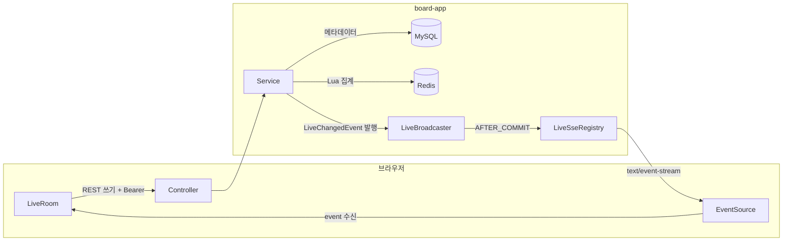
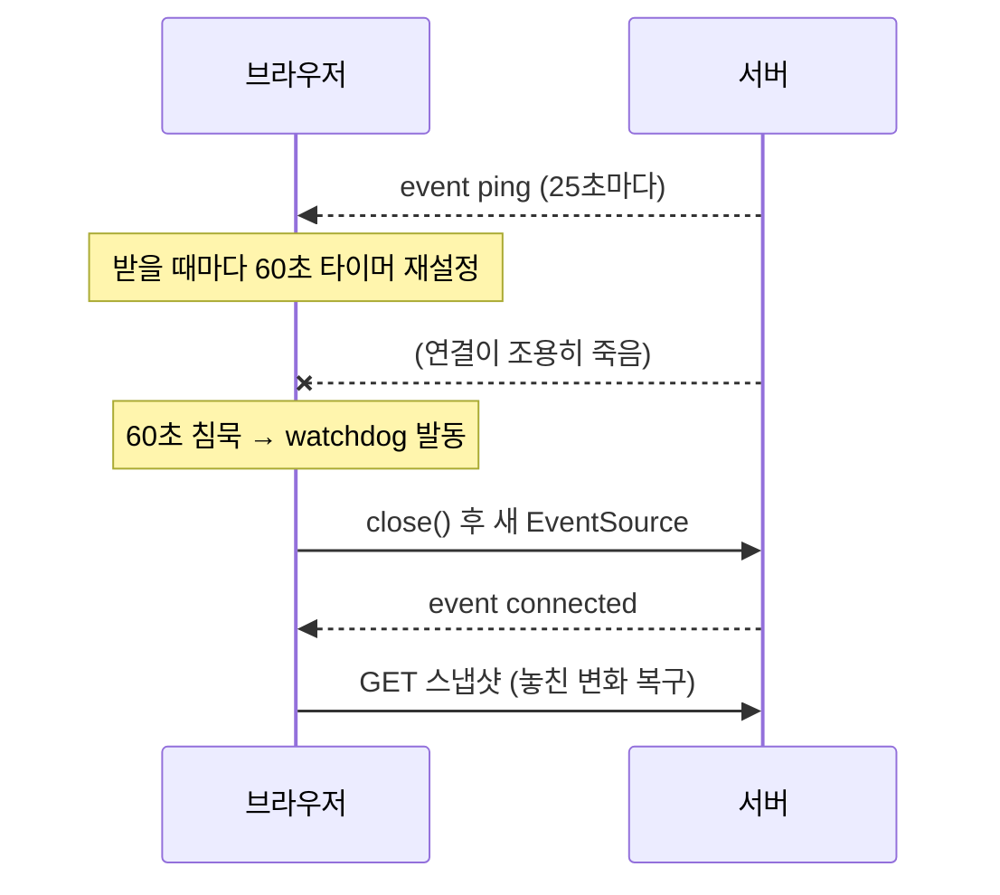

# 단계 18 — 실시간 질문·투표 (Slido 스타일)

> 선수 지식: Redis 기본 명령([[REDIS-BASICS]]), 이벤트 리스너 분리([[NOTIFICATION]]), `@PreAuthorize` 커스텀 빈([[METHOD-SECURITY]]).
> 구현 순서는 [[LIVE-POLL-WALKTHROUGH-DAY1]]·[[LIVE-POLL-WALKTHROUGH-DAY2]]가 재현 기록이다. 이 문서는 **왜 이렇게 만들었나**를 다룬다.

진행자가 이벤트를 열면 참여자가 휴대폰으로 참여 코드를 입력해 들어오고, 질문을 올리고 좋아요를 누르고, 진행자가 연 객관식 투표에 답한다.
모든 변화는 새로고침 없이 모든 화면에 1초 안에 반영된다. chat(STOMP, 양방향)에 이은 실시간 강의로, 이번 주제는 **단방향 푸시(SSE)와 Redis 집계**다.

학습 목표 — 이 단계를 마치면 다음을 할 수 있다.

- polling·SSE·WebSocket 중 요구사항에 맞는 실시간 방식을 근거를 들어 고른다
- "스냅샷 + 변경 스트림" 구조로 놓친 이벤트 없이 화면 상태를 맞춘다
- 자주 바뀌는 숫자는 Redis, 구조는 MySQL로 나누고, Lua로 집계를 원자화한다
- SSE의 인증 제약·프록시 버퍼링·half-open 연결이라는 세 함정을 설명하고 대비한다

---

## 1. 한눈에 보기

| 항목 | 결정 | 근거 |
|------|------|------|
| 위치 | board 앱 안 `com.example.board.live` | 2GB 서버에 세 번째 JVM을 띄우지 않는다. board 인증·배포를 그대로 재사용 |
| 쓰기 | REST(`POST`) + JWT Bearer | 기존 `authFetch` 그대로. 쓰기 빈도가 낮아 양방향 채널이 필요 없다 |
| 수신 | **SSE** (`SseEmitter` ↔ `EventSource`) | 서버 → 다수 브라우저 단방향 푸시. HTTP 그대로라 프록시·인증 구조가 단순 |
| 참여자 | board 로그인 필수 | 1인 1표·좋아요 중복을 userId로 확실히 막는다 |
| 구조 데이터 | MySQL: 이벤트·질문·투표·선택지 | 오래 남아야 하고 관계가 있다 |
| 집계 | Redis: 좋아요 ZSET·SET, 투표 HASH | 초당 수십 번 바뀌는 숫자. 원자 증가·한 번에 조회 |
| 원자성 | Lua 스크립트 2개 | "확인 → 증가" 사이에 다른 요청이 끼어들지 못하게 |
| 스트림 인증 | 스트림만 공개, 공개 가능한 정보만 | `EventSource`는 헤더를 붙일 수 없다 |
| 다중 서버 | 미지원(단일 인스턴스) | YAGNI — 확장 경로는 §6 |

---

## 2. 왜 이번엔 WebSocket이 아닌가

| 기준 | polling | **SSE** | WebSocket(STOMP) |
|------|---------|---------|------------------|
| 방향 | 클라이언트가 계속 묻는다 | 서버 → 클라이언트 단방향 | 양방향 |
| 프로토콜 | HTTP | **HTTP 그대로**(`text/event-stream`) | HTTP 업그레이드 후 별도 프로토콜 |
| 지연 | 주기만큼(예: 3초) | 즉시 | 즉시 |
| 서버 부하 | 변화 없어도 요청 폭주 | 연결 유지 비용만 | 연결 유지 + 프로토콜 처리 |
| 재연결 | 해당 없음 | **브라우저가 자동** | 직접 구현(chat의 STOMP 클라이언트) |
| 프록시 | 그대로 | 버퍼링만 끄면 됨 | Upgrade 헤더 처리 필요 |
| 인증 | 헤더 OK | **헤더 불가**(§4) | CONNECT 프레임에 토큰 |
| 어울리는 곳 | 변화가 드문 알림(단계 12) | **많은 시청자에게 방송** | 채팅처럼 양쪽이 자주 말할 때 |

Slido형 서비스는 "참여자가 가끔 쓰고(질문·좋아요·투표), 모두가 계속 본다". 쓰기는 평범한 REST로 충분하고, 필요한 것은 **방송**뿐이다.
양방향 채널을 열면 그 위에 메시지 형식·라우팅·인증을 새로 얹어야 하는데(chat에서 STOMP가 한 일), SSE는 기존 HTTP 스택(필터 체인, 프록시, 로그)을 그대로 쓴다.

> [!IMPORTANT]
> 실시간 방식 선택의 질문은 "실시간이 필요한가"가 아니라 "**누가 얼마나 자주 말하는가**"다. 서버만 자주 말하면 SSE, 양쪽이 자주 말하면 WebSocket, 둘 다 드물면 polling.

---

## 3. 데이터를 어디에 두나 — MySQL과 Redis의 분업

| 데이터 | 저장소 | 이유 |
|--------|--------|------|
| 이벤트·질문 본문·투표·선택지 | MySQL | 관계(FK), 오래 보존, 거의 안 바뀜 |
| 질문별 좋아요 수 | Redis ZSET `live:event:{id}:questions` | 자주 바뀜, 원자 증가(`ZINCRBY`), 이벤트 전체를 한 번에 조회 |
| 사용자가 누른 질문 | Redis SET `live:event:{id}:user:{uid}:likes` | `SADD` 반환값이 곧 "처음인가", 스냅샷 1회 조회 |
| 선택지별 득표 | Redis HASH `live:poll:{id}:counts` | `HINCRBY`, `HGETALL` 1회 |
| 누가 무엇을 골랐나 | Redis HASH `live:poll:{id}:voters` | `HSETNX`가 곧 "1인 1표", 내 선택 표시 |

좋아요 수를 MySQL 컬럼으로 두면 좋아요 하나마다 `UPDATE`가 나가고 행 잠금이 걸린다. 강의실 30명이 동시에 같은 질문을 누르면 그 행에 줄이 선다.
Redis는 단일 스레드로 명령을 하나씩 처리하므로 `ZINCRBY`가 잠금 없이 원자적이다.

### Lua — 명령 두 개를 하나로

"이미 눌렀나 확인(`SADD`) → 점수 증감(`ZINCRBY`)"을 Java에서 두 번 보내면 그 사이에 같은 사용자의 더블 클릭이 끼어든다.
Lua 스크립트는 Redis 안에서 **통째로** 실행되는 동안 다른 명령이 끼어들지 못한다. 왕복도 1회로 줄어든다.

| 스크립트 | 핵심 | 반환 |
|----------|------|------|
| 좋아요 토글 | `SADD`가 1이면 `ZINCRBY +1`, 0이면 `SREM` + `ZINCRBY -1` | `{liked, score}` |
| 투표 | `HSETNX`가 1일 때만 `HINCRBY` | 1(성공) / 0(이미 투표) |

두 스크립트 모두 쓸 때마다 `EXPIRE 7일`을 건다 — 끝난 이벤트의 키가 서버 Redis에 영원히 쌓이지 않게.

### 테스트는 어떻게 — 계약 + 대체물

서비스는 `LiveCounterStore` **인터페이스**에만 의존한다. 운영은 `RedisLiveCounterStore`, 테스트는 `InMemoryLiveCounterStore`(`@Primary`)가 주입된다.
어떤 구현이든 지켜야 할 규칙은 `LiveCounterStoreContractTest`가 고정하고, Lua 자체는 `redis-cli EVAL`로 실제 Redis에서 확인한다(단계 15 `RefreshTokenStore`와 같은 구조).

---

## 4. SSE 설계의 세 가지 함정

### 4-1. `EventSource`는 헤더를 붙일 수 없다 → 스트림만 공개

| 대안 | 문제 |
|------|------|
| `?token=` URL 파라미터 | access log·프록시 로그·브라우저 기록에 토큰이 남는다 |
| fetch + ReadableStream으로 직접 파싱 | 헤더는 되지만 SSE 파서·자동 재연결·토큰 만료 처리를 직접 구현 |
| 일회용 SSE 티켓(Redis, 30초 TTL) | 안전하지만 필터·재연결 처리가 늘어 2일 범위를 넘는다 |
| **스트림만 `permitAll`** (선택) | 대신 **공개해도 되는 것만** 싣는다 |

공개 스트림 원칙: payload에는 질문 본문·작성자 username·집계 숫자만. `likedByMe`, `myOptionId`, `mine` 같은 개인 상태는 **인증된 스냅샷 REST**에만 있다.
`SecurityConfig` 규칙도 `GET /api/v1/live/events/*/stream` 한 경로로 최소화한다.

### 4-2. 프록시 버퍼링 → 이벤트가 뭉쳐서 늦게 온다

nginx는 기본적으로 백엔드 응답을 버퍼에 모았다가 보낸다. 끝나지 않는 SSE 응답에서는 작은 이벤트들이 버퍼가 찰 때까지 갇힌다.

| 대비 | 위치 |
|------|------|
| `proxy_buffering off`, `proxy_read_timeout 3600s` | `frontend/nginx.conf`의 스트림 전용 정규식 location |
| `X-Accel-Buffering: no` 응답 헤더 | `LiveEventController.stream()` — nginx 설정이 빠져도 동작하는 이중 장치 |
| 25초 heartbeat | 바이트가 흐르므로 프록시가 유휴 연결로 끊지 않는다 |

### 4-3. half-open 연결 → "연결됨"인데 아무것도 안 온다

`EventSource`는 연결이 **닫혀야** 재연결한다. 중간 프록시·모바일 망 전환·NAT 타임아웃으로 "열려 있지만 죽은" 연결이 생기면 영원히 기다린다.
2일차 브라우저 E2E에서 백엔드 재시작 후 실제로 이 상태가 재현됐다([[LIVE-POLL-WALKTHROUGH-DAY2]] Step 13).

- 서버 heartbeat를 주석 프레임(`:ping`, JS에서 안 보임)이 아니라 **이름 있는 `ping` 이벤트**로 보낸다.
- 클라이언트 watchdog: 60초(heartbeat의 2배 이상) 동안 아무 이벤트도 없으면 직접 닫고 다시 연다.
- 다시 열리면 `connected` → 스냅샷 재요청으로 끊긴 동안의 변화를 메운다.

함께 발견된 서버 쪽 문제: SSE 클라이언트가 떠나면 Spring이 `AsyncRequestNotUsableException`을 던지는데, 전용 핸들러가 없으면 최후 방어선이 ERROR로 기록하고
닫힌 응답에 JSON을 쓰려다 또 실패한다. `GlobalExceptionHandler`에 debug 로그만 남기는 `void` 핸들러를 둔다.

---

## 5. 스냅샷 + 스트림 — 놓치지 않는 순서

| 단계 | 동작 | 놓치면 안 되는 이유 |
|------|------|---------------------|
| 1 | `EventSource` 연결 | 먼저 귀를 연다 |
| 2 | 서버가 `connected` 전송 | 구독이 명부에 등록됐다는 확인 |
| 3 | `connected`를 받고 스냅샷 `GET` | 이 시점 이후의 변화는 모두 스트림으로 온다 |
| 4 | 이후 이벤트를 상태에 병합 | |

순서를 거꾸로(스냅샷 → 구독) 하면 "스냅샷 응답 ~ 구독 등록" 사이의 변화를 영영 놓친다. 재연결도 같은 절차라서 서버는 놓친 이벤트를 재전송(`Last-Event-ID`)할 필요가 없다.

순서만으로는 부족한 구간이 하나 더 있다 — 서버가 스냅샷을 **읽은 뒤** 커밋된 변화의 SSE가 스냅샷 **응답보다 먼저** 도착하는 경우다.
그 이벤트를 옛 상태에 적용하면 곧 도착한 스냅샷이 덮어써 사라진다. 그래서 스냅샷을 기다리는 동안 온 이벤트는 **보관했다가 스냅샷 위에 다시 적용**한다
(`liveState.js`의 `createSnapshotGate`, 코드 리뷰가 찾은 문제 — [[LIVE-POLL-WALKTHROUGH-DAY2]] Step 16).

병합 규칙도 설계다.

| 이벤트 | 규칙 | 이유 |
|--------|------|------|
| `question.created` | 이미 있으면 무시 | 내 REST 응답이 먼저 반영됐을 수 있다 |
| `question.liked` | `likeCount`만 교체 | `likedByMe`는 공개 스트림에 없다 |
| `poll.voted` | 선택지별 **max** | 득표수는 줄지 않는다 → 순서가 뒤바뀐 옛 메시지가 새 값을 덮지 못한다 |

전파는 `@TransactionalEventListener(AFTER_COMMIT, fallbackExecution = true)` — DB 저장이 롤백된 질문은 퍼뜨리지 않고, 트랜잭션 없이 Redis만 바꾼 좋아요도 놓치지 않는다.

---

## 6. 한계와 다음 단계 — 언제 무엇을 더하나

| 상황 | 지금 동작 | 다음 단계 |
|------|-----------|-----------|
| board-app을 2대 이상으로 늘린다 | 구독자 명부가 JVM 메모리라 다른 서버의 구독자에게 안 간다 | 발행을 Redis Pub/Sub로 보내고 각 서버가 자기 구독자에게 전달 |
| 끊긴 동안의 이벤트를 정확히 이어받아야 한다 | 재연결 = 스냅샷 재요청 | 이벤트에 `id:`를 붙이고 `Last-Event-ID`로 재전송(Redis Stream) |
| 결과를 영구 보관해야 한다 | Redis 키는 7일 TTL — 이후 집계 0 | 이벤트·투표 종료 시 득표를 MySQL에 스냅샷 저장 |
| 이벤트를 7일 넘게 열어 둔다 | 키마다 TTL이 따로 갱신되어 사용자 좋아요 SET·투표자 HASH가 먼저 만료될 수 있다 → 중복 좋아요·재투표 | 열린 동안 TTL 없이 두고 종료 시점에 `EXPIRE` |
| 구독자가 수천 명 | 전파가 요청 스레드에서 동기 실행 | `@Async` 전파, 느린 클라이언트 격리 |
| 좋아요 응답 순서 역전 | 드물게 잠시 옛 숫자가 보임(다음 이벤트에 교정) | 이벤트에 버전(score) 비교 |
| 비로그인 참여(진짜 Slido처럼) | 로그인 필수 | 참여 코드 기반 익명 토큰 + 기기 단위 중복 방지 |
| 질문 모더레이션 | 삭제만 가능 | 숨김·답변 완료 상태, 진행자 승인 큐 |

> [!TIP]
> 실무 기준 — 시청자가 많고 서버만 말하는 화면(대시보드, 라이브 점수, 주문 상태, 진행률)은 **SSE + 스냅샷**부터 시작한다. 양방향이 꼭 필요해질 때 WebSocket으로 간다. SSE를 도입하면 첫날 확인할 것은 세 가지다: 프록시 버퍼링, 인증 방식, heartbeat 기반 죽은 연결 감지.
