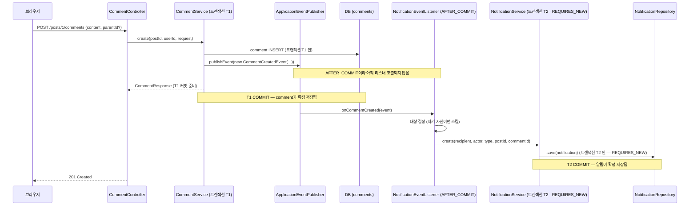
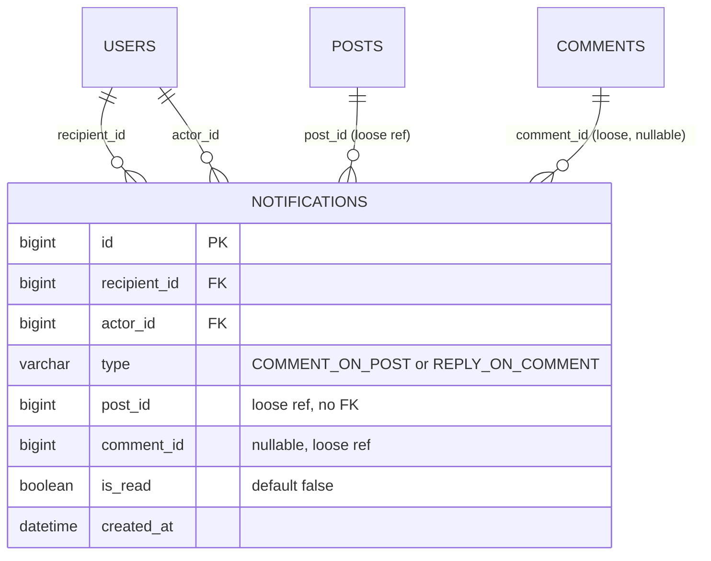
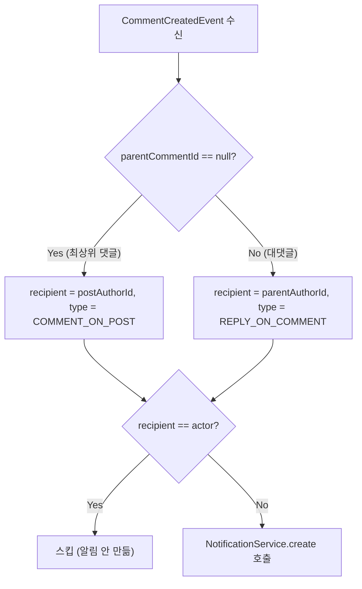

# 댓글 알림 — 이벤트 기반 인앱 알림 (단계 12, 설계안)

- **과정명**: 강의용 Spring Boot 게시판 — 단계 12 (댓글 알림)
- **대상**: 단계 11(댓글/대댓글)까지 마친 수강생 — 여기서부터는 도메인 하나를 새로 붙이는 대신, **한 도메인의 이벤트가 다른 도메인을 깨우는 결합 문제**를 다룬다. 트랜잭션과 이벤트의 접점(`@TransactionalEventListener`), 그 안에서만 나타나는 함정(AFTER_COMMIT + JPA 저장)이 이 단계의 진짜 학습 포인트다
- **브랜치**: `step12-notification`
- **관련 코드**: `comment/CommentService`(이벤트 발행 지점 — `ApplicationEventPublisher` 주입), `notification/CommentCreatedEvent`(record), `notification/Notification`(엔티티 — 메타데이터 저장), `notification/NotificationType`(enum), `notification/NotificationRepository`, `notification/NotificationService`(조회/읽음), `notification/NotificationEventListener`(`@TransactionalEventListener(AFTER_COMMIT)` + `@Transactional(REQUIRES_NEW)`), `notification/NotificationController`(4 엔드포인트), `notification/dto/NotificationResponse`(메타→문구 렌더), `global/exception/ErrorCode`(`NOTIFICATION_NOT_FOUND` 추가)
- **선수 지식**: [COMMENT.md](COMMENT.md) — `Comment`/`Post` 자기참조 관계와 서비스 경계, [FILE-UPLOAD.md](FILE-UPLOAD.md) §5 — `TransactionSynchronizationManager.registerSynchronization(afterCommit)`으로 파일 삭제를 커밋 뒤로 미룬 서사(이번 단계는 이 손수 방식을 표준 이벤트로 승격한다)
- **상태**: **구현 완료** (2026-07-25). `NotificationServiceTest`(8) + `NotificationEventListenerTest`(3) 포함 전체 118개 green, `verify.sh` 전 구간(빌드+테스트+실기동 헬스체크) 통과. 문서의 코드는 실제 구현과 일치한다(일부 발췌는 요지 중심으로 축약될 수 있음)

---

## 한눈에 보기 — 3분 요약

바쁘면 이 섹션만 읽어도 된다. 상세는 §1부터.

**무엇을 만들 것인가**: 누가 내 게시글에 **댓글**을 달거나 내 댓글에 **대댓글**을 달면, 내 알림함(인앱)에 "OO님이 회원님의 게시글에 댓글을 남겼습니다" 한 줄이 쌓인다. 발신은 `CommentService`가 이벤트 하나를 발행하는 것으로 끝나고, 알림 저장은 그 이벤트를 듣는 리스너가 담당한다. `CommentService`는 알림의 존재 자체를 모른다.

> [!NOTE]
> **인앱 알림함**이지 폰 푸시가 아니다. 브라우저 배지·알림 페이지에서 보이는 목록을 만들 뿐이며, 실시간 푸시(WebSocket/SSE/APNs/FCM)는 이 단계 범위 밖이다. 폴링(`GET /notifications/unread-count`)으로 배지 카운트를 갱신하는 수준이 기본 UX다.

**채널 구분** — 이 단계에서 하는 것과 안 하는 것을 명확히:

| 채널 | 이번 단계 | 필요한 것 |
|------|-----------|-----------|
| 인앱 알림함(DB row + 조회 API) | 한다 | `notifications` 테이블 + REST 4개 |
| 브라우저 실시간 푸시(WebSocket/SSE) | 안 한다 | STOMP/SSE 엔드포인트, 세션 매핑 |
| 모바일 푸시(APNs/FCM) | 안 한다 | 디바이스 토큰 저장, 게이트웨이 연동 |
| 이메일 알림 | 안 한다 | 메일 서버, 템플릿, 발송 큐 |

**구현 지점 (예정) — 딱 5곳**:

| 층위 | 파일 (예정) | 역할 |
|------|-------------|------|
| 발행 | `comment/CommentService` | `create`가 저장 직후 `ApplicationEventPublisher.publishEvent(new CommentCreatedEvent(...))`. 알림 도메인을 몰라도 됨 |
| 이벤트 | `notification/CommentCreatedEvent` (record) | 최소 정보(commentId/postId/parentId/authorId/postAuthorId/parentAuthorId)만 담는다. 엔티티 참조 대신 id — 컨텍스트 이탈 후에도 안전 |
| 수신 | `notification/NotificationEventListener` | `@TransactionalEventListener(phase=AFTER_COMMIT)` + `@Transactional(propagation=REQUIRES_NEW)` — 이 조합이 이번 단계의 핵심 |
| 저장 | `notification/Notification` + `NotificationRepository` | 메타데이터(type/actor/postId/commentId/read)만 저장, 문구는 조회 시 렌더 |
| 조회·읽음 | `notification/NotificationController` + `NotificationService` | 4개 엔드포인트, 본인 것만(recipient=로그인 사용자로 필터) |

**이벤트 흐름 시퀀스** (댓글 작성 → 커밋 → 리스너 → 알림 저장):



**핵심 한 줄**: **CommentService는 이벤트를 던지고 잊는다.** 커밋된 뒤에만 리스너가 깨어나고, 리스너는 반드시 **새 트랜잭션**을 열어 저장한다 — 이 두 조건이 어긋나면 알림이 조용히 사라진다(§2).

**핵심 설계 결정 4가지 — 왜 이렇게 갔는가**:

| 결정 | 이유 |
|------|------|
| CommentService에서 알림을 직접 만들지 않고 이벤트를 발행 | 도메인 결합 회피 — 나중에 "메일 알림", "웹 푸시"를 붙일 때 리스너만 추가하면 되고 CommentService는 변경되지 않는다(Open-Closed) |
| `@TransactionalEventListener(AFTER_COMMIT)` | 댓글 저장이 롤백되면 알림도 안 나가야 함. 동기(same thread) + 커밋 후 실행이라 트랜잭션 무결성이 유지된다 |
| 리스너에 `@Transactional(REQUIRES_NEW)` | AFTER_COMMIT은 원 트랜잭션이 이미 닫힌 시점이라 그대로 JPA save 하면 커밋되지 않고 사라진다. 새 트랜잭션이 필요(§2) |
| 알림 본문은 **메타데이터만 저장**, 문구는 조회 시 렌더 | actor의 username/nickname이 나중에 바뀌어도 알림 문구가 자동 반영됨. "OO님이" 문자열을 저장했다면 갱신 배치가 필요해짐 |

---

## 학습 목표

이 문서를 끝내면 수강생은:

- **왜 이벤트로 분리하는지** — 순진한 방식(`CommentService`가 알림까지 만드는 방식)의 결합 문제를 코드로 재현하고, 이벤트가 어떻게 그것을 푸는지 설명할 수 있다
- Spring의 `ApplicationEventPublisher`와 `@TransactionalEventListener`의 phase 옵션(BEFORE_COMMIT/AFTER_COMMIT/AFTER_ROLLBACK/AFTER_COMPLETION) 차이를 이해하고 이 프로젝트가 왜 AFTER_COMMIT을 쓰는지 말할 수 있다
- **AFTER_COMMIT + JPA 저장의 함정**을 알고, 왜 리스너에 `@Transactional(REQUIRES_NEW)`가 필요한지 코드 수준에서 설명할 수 있다
- 동기 AFTER_COMMIT과 `@Async` 리스너의 트레이드오프(응답 지연 vs 유실 위험)를 비교하고 언제 무엇을 쓸지 결정할 수 있다
- 알림 본문을 **메타데이터**로 저장하고 조회 시 렌더하는 이유(actor 정보 변경 반영, 국제화 여지)를 안다
- 인가(본인 알림만 조회/읽음) 규칙을 서비스 계층 필터로 강제하고, "남의 알림 id를 알아도 조회/읽음이 안 되는" 이유를 설명할 수 있다
- 단계 10 `PostService.delete`에서 손수 등록했던 `TransactionSynchronizationManager.registerSynchronization` 패턴이 왜 `@TransactionalEventListener`로 승격되는지, 그 이득이 무엇인지 안다

---

## 코드 작성 순서 — 무엇을 먼저 짜는가

원칙은 단계 10·11과 같다: **의존의 역방향** — 남이 의존하는 밑바닥 부품(에러 코드·enum·이벤트 record)을 먼저 만들고, 그것을 조립하는 서비스·리스너를 나중에, 노출(컨트롤러)과 테스트를 맨 끝에 둔다. 이번 단계는 **발행 지점(CommentService)**과 **수신 지점(NotificationEventListener)**이 서로를 몰라도 되게 이벤트 record를 사이에 둔다.

| 순서 | 파일 (예정) | 이 시점에 하는 일 | 왜 이 순서인가 |
|------|-------------|-----------------|--------------|
| 1 | `ErrorCode.java` | `NOTIFICATION_NOT_FOUND(404)` 추가 | 서비스 검증에서 던질 예외 |
| 2 | `notification/NotificationType.java` (신규) | enum: `COMMENT_ON_POST`, `REPLY_ON_COMMENT` | 엔티티/응답 DTO가 함께 참조 |
| 3 | `notification/CommentCreatedEvent.java` (신규, record) | 이벤트 payload — commentId/postId/parentId/actorId/postAuthorId/parentAuthorId | 발행자·수신자 양쪽이 의존하는 계약 |
| 4 | `notification/Notification.java` (신규) | 엔티티 — recipient/actor/type/postId/commentId/read + `markAsRead`/`isOwnedBy` | 도메인 최하위 부품 |
| 5 | `notification/NotificationRepository.java` (신규) | `findByRecipientId`(페이징, 최신순), `countByRecipientIdAndReadFalse`, `updateAllReadByRecipientId` | 서비스가 의존 |
| 6 | `notification/dto/NotificationResponse.java` (신규) | 메타→문구 렌더(`from`에서 type별 조립) | 서비스 반환 타입 |
| 7 | `notification/NotificationService.java` (신규) | `create`(리스너에서 호출), `getMy`, `unreadCount`, `markAsRead`, `markAllAsRead` — 모두 recipient 필터 | 4·5·6 조립 |
| 8 | `notification/NotificationEventListener.java` (신규) | `@TransactionalEventListener(AFTER_COMMIT)` + `@Transactional(REQUIRES_NEW)` — 대상 결정 후 `NotificationService.create` 호출 | 7이 있어야 호출 대상 성립 |
| 9 | `comment/CommentService.java` (수정) | 필드에 `ApplicationEventPublisher` 추가 + `create` 끝에 `publishEvent(new CommentCreatedEvent(...))` | 발행 지점 — 3의 record 필요 |
| 10 | `notification/NotificationController.java` (신규) | 4 엔드포인트 (`@AuthenticationPrincipal`로 본인 id 주입) | 7을 호출하는 진입점 |
| 11 | `SecurityConfig.java` (변경 없음) | `anyRequest().authenticated()`가 `/notifications/**`를 이미 커버 | 인가는 서비스 필터로 |
| 12 | `test/notification/*` | 리스너의 REQUIRES_NEW 동작 확인 + 자기 자신 스킵 + 인가 필터 검증 | 완성된 동작 고정 |

> [!TIP]
> 큰 덩어리로 보면 **① 에러/enum/이벤트 계약(1·2·3) → ② 엔티티·리포지토리·응답(4·5·6) → ③ 서비스·리스너(7·8) → ④ 발행 연결(9) → ⑤ 노출·테스트(10·12)**. 발행 쪽(9) 수정은 마지막에 가깝게 두는 것이 안전하다 — 그때는 이미 리스너가 완성되어 있어 이벤트가 실제로 처리되는 것을 코드/테스트로 확인할 수 있다.

---

## 1. 왜 이벤트인가 — 순진한 방식의 결합 문제

댓글이 작성되면 알림이 쌓여야 한다. 가장 순진한 구현은 `CommentService.create` 안에서 알림을 직접 만드는 것이다:

```java
// 순진한 방식 (제안 — 하지 않을 것): CommentService가 알림 저장까지 책임진다
@Transactional
public CommentResponse create(Long postId, Long loginUserId, CommentCreateRequest request) {
  Post post = postRepository.findById(postId).orElseThrow(...);
  User author = userRepository.findById(loginUserId).orElseThrow(...);

  Comment comment = new Comment(post, author, request.content());
  if (request.parentId() != null) {
    Comment parent = findComment(request.parentId());
    validateReplyTarget(parent, postId);
    parent.addReply(comment);
  }
  Comment saved = commentRepository.save(comment);

  // ❌ 나쁜 예 — 여기서 알림을 직접 만든다
  if (request.parentId() == null) {
    Long recipientId = post.getAuthor().getId();
    if (!recipientId.equals(loginUserId)) {
      notificationRepository.save(new Notification(recipientId, loginUserId,
          NotificationType.COMMENT_ON_POST, postId, null));
    }
  } else {
    Long recipientId = saved.getParent().getAuthor().getId();
    if (!recipientId.equals(loginUserId)) {
      notificationRepository.save(new Notification(recipientId, loginUserId,
          NotificationType.REPLY_ON_COMMENT, postId, saved.getParent().getId()));
    }
  }
  return CommentResponse.from(saved);
}
```

이 코드의 문제는 셋이다:

| 문제 | 설명 |
|------|------|
| **결합** | `CommentService`가 `NotificationRepository`, `NotificationType`, "자기 자신 스킵" 규칙을 알게 됨. 알림 정책이 바뀌면 댓글 서비스가 변경됨 |
| **확장성** | 나중에 "이메일 알림", "웹 푸시"를 추가하면 이 메서드가 계속 부풀어 오른다 |
| **테스트** | 댓글 로직 단위 테스트를 하려면 `NotificationRepository` mock이 매번 필요 |

**해법 — 이벤트로 분리**. `CommentService`는 "댓글이 만들어졌다"는 사실만 알리고 잊는다:

```java
// 승격된 방식 (제안): CommentService는 이벤트만 발행
@Service
@RequiredArgsConstructor
public class CommentService {

  private final CommentRepository commentRepository;
  private final PostRepository postRepository;
  private final UserRepository userRepository;
  private final ApplicationEventPublisher eventPublisher;  // 추가

  @Transactional
  public CommentResponse create(Long postId, Long loginUserId, CommentCreateRequest request) {
    Post post = postRepository.findById(postId).orElseThrow(...);
    User author = userRepository.findById(loginUserId).orElseThrow(...);

    Comment comment = new Comment(post, author, request.content());
    if (request.parentId() != null) {
      Comment parent = findComment(request.parentId());
      validateReplyTarget(parent, postId);
      parent.addReply(comment);
    }
    Comment saved = commentRepository.save(comment);

    // 알림 도메인의 존재를 몰라도 됨 — 이벤트만 던진다.
    // 대상 결정(자기 자신 스킵 등)은 리스너의 책임.
    eventPublisher.publishEvent(new CommentCreatedEvent(
        saved.getId(),
        postId,
        request.parentId(),                    // null이면 최상위 댓글
        loginUserId,                           // actor
        post.getAuthor().getId(),              // 게시글 작성자
        request.parentId() == null ? null : saved.getParent().getAuthor().getId()
    ));

    return CommentResponse.from(saved);
  }
}
```

이벤트 record는 아무 인터페이스도 상속하지 않는다(Spring 4.2+):

```java
// notification/CommentCreatedEvent.java (제안)
// 엔티티 참조 대신 id만 담는다 — 리스너는 다른 트랜잭션에서 실행되므로
// 엔티티 프록시를 넘기면 detach된 상태가 될 수 있다. id는 안전하다.
public record CommentCreatedEvent(
    Long commentId,
    Long postId,
    Long parentCommentId,     // null이면 최상위 댓글(→ COMMENT_ON_POST)
    Long actorId,             // 댓글을 작성한 사용자 = 알림의 actor
    Long postAuthorId,        // 게시글 작성자 (COMMENT_ON_POST의 후보 recipient)
    Long parentAuthorId       // 원댓글 작성자 (REPLY_ON_COMMENT의 후보 recipient), 최상위면 null
) {}
```

**단계 10 서사와의 연결** — `PostService.delete`에서 파일 삭제를 커밋 뒤로 미루려고 손수 `TransactionSynchronizationManager.registerSynchronization`을 등록했던 것을 기억할 것이다. 그것은 익명 콜백을 서비스 안에 심는 방식이었다. `@TransactionalEventListener`는 그 콜백을 **분리 가능한 컴포넌트**로 승격한 정식 API다. 콜백을 여러 곳에서 재사용하고, 여러 리스너를 붙여도 발행자는 그대로 하나로 유지된다.

> [!IMPORTANT]
> "Comment는 Notification을 몰라야 한다." — 이 방향의 결합만 끊으면 나중에 어떤 채널(메일/푸시/슬랙)을 붙여도 `CommentService`는 변경 대상이 아니다. 이벤트 record 하나가 두 도메인 사이의 계약 표면이 된다.

---

## 2. AFTER_COMMIT과 트랜잭션 함정 — 이 단계의 핵심

이벤트를 언제 처리할지의 옵션은 넷이다:

| phase | 실행 시점 | 이 프로젝트에서 |
|-------|-----------|----------------|
| `BEFORE_COMMIT` | 원 트랜잭션이 커밋되기 직전 | 안 씀 — 여기서 예외가 나면 원 트랜잭션이 롤백되어 댓글 저장이 취소됨 |
| `AFTER_COMMIT` (기본값) | 원 트랜잭션이 성공적으로 커밋된 뒤 | **선택** — 댓글 저장이 롤백되면 알림도 안 만들어지고, 커밋이 확정된 뒤 실행되어 무결성 유지 |
| `AFTER_ROLLBACK` | 원 트랜잭션이 롤백된 뒤 | 안 씀 — 알림은 성공 케이스에서만 필요 |
| `AFTER_COMPLETION` | 성공/실패 상관없이 완료된 뒤 | 안 씀 |

**AFTER_COMMIT을 고른 진짜 이유**: 댓글 INSERT가 롤백되면 알림도 안 만들어져야 한다. 그런데 여기서 나오는 것이 이번 단계의 함정이다.

### 순진한 구현 — 왜 알림이 조용히 사라지는가

```java
// ❌ 나쁜 예 — @Transactional 없이 AFTER_COMMIT에서 save 시도
@Component
@RequiredArgsConstructor
public class NotificationEventListener {

  private final NotificationService notificationService;

  @TransactionalEventListener(phase = TransactionPhase.AFTER_COMMIT)
  public void onCommentCreated(CommentCreatedEvent event) {
    // 대상 결정...
    notificationService.create(recipientId, event.actorId(), type,
        event.postId(), event.parentCommentId());
    // 저장이 커밋되지 않고 사라질 수 있다!
  }
}
```

**왜 사라지나** — AFTER_COMMIT 리스너는 원 트랜잭션(T1: 댓글 저장)이 **이미 커밋된 뒤**에 실행된다. 그 시점에는 활성 트랜잭션이 없다. 이 상태에서 JPA `save`를 호출하면:

- `open-in-view=false`이므로 열린 영속성 컨텍스트도 없다
- `notificationService.create`의 `@Transactional`이 새 트랜잭션을 열지만, **그 안에서 다시 이벤트 컨텍스트 안으로 돌아오면** 커밋 순서가 꼬여 조용히 무시되는 경우가 생긴다(Hibernate/Spring 조합에 따라 다름)
- 최악의 경우 예외도 안 나고 로그도 남지 않는다 — "저장했다고 생각했는데 없다"

### 올바른 구현 — REQUIRES_NEW로 완전히 새 트랜잭션

```java
// 올바른 방식 (제안): AFTER_COMMIT 리스너에 REQUIRES_NEW로 새 트랜잭션을 명시
@Component
@RequiredArgsConstructor
@Slf4j
public class NotificationEventListener {

  private final NotificationService notificationService;

  @TransactionalEventListener(phase = TransactionPhase.AFTER_COMMIT)
  @Transactional(propagation = Propagation.REQUIRES_NEW)
  public void onCommentCreated(CommentCreatedEvent event) {
    // 자기 자신에게 보내는 알림은 스킵 (자기 글에 자기가 댓글, 자기 댓글에 자기가 대댓글)
    Long recipientId;
    NotificationType type;
    if (event.parentCommentId() == null) {
      recipientId = event.postAuthorId();
      type = NotificationType.COMMENT_ON_POST;
    } else {
      recipientId = event.parentAuthorId();
      type = NotificationType.REPLY_ON_COMMENT;
    }
    if (recipientId == null || recipientId.equals(event.actorId())) {
      return;
    }

    try {
      notificationService.create(recipientId, event.actorId(), type,
          event.postId(), event.parentCommentId());
    } catch (RuntimeException e) {
      // 알림 저장 실패가 댓글 응답을 깨서는 안 된다(이미 응답 전송 완료 상태).
      // 로그만 남기고 조용히 실패를 흡수 — 알림 유실은 재시도 배치의 몫으로.
      log.warn("알림 저장 실패: event={}", event, e);
    }
  }
}
```

**두 줄의 어노테이션 각각의 역할**:

| 어노테이션 | 역할 | 없으면 |
|------------|------|--------|
| `@TransactionalEventListener(AFTER_COMMIT)` | 원 트랜잭션이 커밋된 뒤 실행 | 그냥 `@EventListener`라면 발행 즉시 동기 실행됨(원 트랜잭션 커밋 전) |
| `@Transactional(propagation=REQUIRES_NEW)` | 리스너 자체가 새 트랜잭션을 연다 | AFTER_COMMIT 시점엔 활성 트랜잭션이 없어 save가 커밋되지 않고 사라짐 |

> [!WARNING]
> **가장 자주 하는 실수**: `@TransactionalEventListener(AFTER_COMMIT)`만 붙이고 `@Transactional(REQUIRES_NEW)`를 빠뜨리면, 개발 중에는 통합 테스트에서 잘 되는 것처럼 보이다가 운영에서 알림이 사라진다. 로컬 통합 테스트는 `@Transactional` 롤백 아래에서 도는 경우가 많아 이 함정이 가려진다. 코드 리뷰에서 "AFTER_COMMIT 리스너에 @Transactional REQUIRES_NEW"를 체크리스트로 두는 것이 안전하다.

### 왜 REQUIRED가 아니라 REQUIRES_NEW인가

`Propagation.REQUIRED`(기본값)는 "활성 트랜잭션이 있으면 참여, 없으면 새로 연다"이다. AFTER_COMMIT 시점에는 활성 트랜잭션이 없으므로 REQUIRED든 REQUIRES_NEW든 새 트랜잭션이 열려야 한다. 그럼에도 명시적으로 `REQUIRES_NEW`를 쓰는 이유:

- **의도 명시** — "이 리스너는 언제나 자기만의 트랜잭션 안에서 돈다"는 계약을 코드로 표현
- **미래 안전** — 나중에 다른 리스너가 AFTER_COMMIT 안에서 트랜잭션을 물게 되어도 이 리스너는 독립
- **@Async 전환 대비** — 리스너를 비동기로 바꿔도 트랜잭션 규칙이 그대로 유지됨

### 동기 REQUIRES_NEW vs @Async — 트레이드오프

리스너가 무거워지면(예: 여러 명에게 알림 저장, 외부 API 호출) 댓글 API 응답이 늦어진다. 이 경우 `@Async`로 다른 스레드로 넘길 수 있다.

| 방식 | 응답 지연 | 유실 위험 | 순서 보장 | 사용 시점 |
|------|-----------|-----------|-----------|-----------|
| 동기 AFTER_COMMIT + REQUIRES_NEW (기본) | 있음 (알림 저장까지 대기) | 낮음 — 실패해도 로그로 확인 가능 | 있음 | 알림 저장이 짧고, 유실이 부담스러울 때 |
| `@Async` + AFTER_COMMIT | 없음 (fire-and-forget) | 높음 — 스레드 풀 예외/셧다운 시 유실 가능 | 없음 | 리스너가 무거운데 응답 속도가 최우선일 때 |

> [!NOTE]
> **강의는 동기 REQUIRES_NEW를 기본으로 잡는다.** `@Async`는 후속 옵션으로 남긴다 — @Async를 켜려면 `@EnableAsync`, `TaskExecutor` 빈, 예외 핸들러(`AsyncUncaughtExceptionHandler`), 셧다운 시 처리 중 작업 대기 설정 등이 추가로 필요해 학습 곡선이 별개의 주제가 된다.

---

## 3. 도메인 모델 — 메타데이터로 저장하는 이유

가장 순진한 저장 방식은 완성된 문구 그대로 저장하는 것이다:

```java
// ❌ 나쁜 예 — 문구를 통째로 저장
notification.setMessage("uploader님이 회원님의 게시글에 댓글을 남겼습니다");
```

이 방식의 결함:

- **actor의 username/nickname이 바뀌면 과거 알림 문구가 낡은 이름 그대로 남는다** — 갱신 배치가 필요
- 국제화(i18n) 여지가 사라짐 — 문구 자체가 저장돼 언어 전환 불가
- 문구 정책 변경(예: 이모지 추가, 문장 톤) 시 히스토리를 소급 갱신해야 함

**선택 — 메타데이터만 저장하고 조회 시 렌더**. 엔티티는 "누가/어떤 타입/어느 게시글" 정보만 갖고, 문구는 응답 DTO의 `from`이 조립한다.

### Notification 엔티티

```java
// notification/Notification.java (제안, 미구현)
// 인앱 알림 한 건. 문구가 아니라 메타데이터를 저장한다 — actor.username이 바뀌면 자동 반영되도록.
@Entity
@Table(name = "notifications", indexes = {
    @Index(name = "idx_notifications_recipient_created", columnList = "recipient_id, createdAt DESC")
})
@Getter
@NoArgsConstructor(access = AccessLevel.PROTECTED)
public class Notification extends BaseTimeEntity {

  @Id
  @GeneratedValue(strategy = GenerationType.IDENTITY)
  private Long id;

  // 알림을 받는 사람. LAZY — 조회 시 인가 필터로만 쓰이고, 응답 DTO에서 노출하지 않는다.
  @ManyToOne(fetch = FetchType.LAZY)
  @JoinColumn(name = "recipient_id", nullable = false)
  private User recipient;

  // 알림을 유발한 사람(댓글 작성자). LAZY — 응답 시 username을 읽으므로 트랜잭션 안에서 접근한다.
  @ManyToOne(fetch = FetchType.LAZY)
  @JoinColumn(name = "actor_id", nullable = false)
  private User actor;

  @Enumerated(EnumType.STRING)
  @Column(nullable = false, length = 30)
  private NotificationType type;

  // 링크용(느슨한 결합) — Post/Comment 엔티티 참조 대신 id만 저장한다.
  // 게시글/댓글이 삭제돼도 알림 자체는 유지되도록 FK 강제하지 않음(§FAQ 참고).
  @Column(name = "post_id", nullable = false)
  private Long postId;

  @Column(name = "comment_id")
  private Long commentId;  // REPLY_ON_COMMENT에서 사용, COMMENT_ON_POST에서는 null 허용

  @Column(name = "is_read", nullable = false)
  private boolean read;

  public Notification(User recipient, User actor, NotificationType type,
                      Long postId, Long commentId) {
    this.recipient = recipient;
    this.actor = actor;
    this.type = type;
    this.postId = postId;
    this.commentId = commentId;
    this.read = false;
  }

  public void markAsRead() {
    this.read = true;
  }

  // 인가 필터 — 남의 알림 id를 알아도 이 검사에서 걸린다.
  public boolean isOwnedBy(Long userId) {
    return recipient.getId().equals(userId);
  }
}
```

### NotificationType enum

```java
// notification/NotificationType.java (제안, 미구현)
public enum NotificationType {
  // 게시글에 댓글이 달림 → 게시글 작성자에게
  COMMENT_ON_POST,
  // 댓글에 대댓글이 달림 → 원댓글 작성자에게
  REPLY_ON_COMMENT
}
```

### 데이터 모델 — ER 다이어그램



**FK를 걸지 않은 컬럼(`post_id`, `comment_id`)의 이유** — 게시글/댓글이 삭제되어도 알림 자체는 남게 하고 싶다(사용자 관점 이력 보존). 프론트가 알림에서 링크를 클릭했을 때 대상이 없으면 "이미 삭제된 게시글입니다" 처리를 하면 된다. FK를 걸면 `ON DELETE CASCADE`로 함께 삭제되거나(정보 유실) `ON DELETE RESTRICT`로 게시글 삭제 자체가 막힌다(단계 10 게시글 삭제 정책과 충돌).

### 응답 DTO — 메타를 문구로 렌더

```java
// notification/dto/NotificationResponse.java (제안, 미구현)
// 메타데이터 → 사용자 표시 문구 조립. actor.username이 바뀌면 자동 반영된다.
public record NotificationResponse(
    Long id,
    NotificationType type,
    String message,
    String actorUsername,
    Long postId,
    Long commentId,
    boolean read,
    LocalDateTime createdAt
) {

  public static NotificationResponse from(Notification notification) {
    String actor = notification.getActor().getUsername();
    String message = switch (notification.getType()) {
      case COMMENT_ON_POST ->
          actor + "님이 회원님의 게시글에 댓글을 남겼습니다";
      case REPLY_ON_COMMENT ->
          actor + "님이 회원님의 댓글에 답글을 남겼습니다";
    };
    return new NotificationResponse(
        notification.getId(),
        notification.getType(),
        message,
        actor,
        notification.getPostId(),
        notification.getCommentId(),
        notification.isRead(),
        notification.getCreatedAt()
    );
  }
}
```

> [!IMPORTANT]
> 저장은 **메타데이터**, 표현은 **조회 시 조립**. 이 분리 덕분에 (a) actor 정보 변경 자동 반영, (b) i18n 여지 확보, (c) 문구 정책 바꿀 때 저장된 row는 그대로 두고 `from`만 수정하면 된다.

---

## 4. 알림 대상 결정 — 자기 자신 제외 + 타입별 분기

리스너가 이벤트를 받으면 **누구에게 어떤 타입의 알림을 만들지** 정해야 한다. 규칙은 세 줄로 요약된다:

- `parentCommentId == null` → 최상위 댓글 → **게시글 작성자**에게 `COMMENT_ON_POST`
- `parentCommentId != null` → 대댓글 → **원댓글 작성자**에게 `REPLY_ON_COMMENT`
- **recipient == actor**이면 스킵 (자기 글에 자기가 댓글을 달거나, 자기 댓글에 자기가 답글을 다는 경우)

대상 결정 흐름:



리스너 안의 대상 결정은 §2의 코드에 이미 포함되어 있다. 핵심은:

- **자기 자신 스킵을 리스너가 담당** — `CommentService`는 이 규칙을 몰라도 됨. 정책이 바뀌면(예: 자기 알림도 보내기로) 리스너 한 줄만 바꾸면 된다.
- **`recipientId == null` 방어** — 대댓글 이벤트에서 `parentAuthorId`가 null이면(이벤트가 잘못 발행되었을 때) 스킵. 이 프로젝트의 발행 코드는 `saved.getParent().getAuthor().getId()`로 채워지므로 정상 경로에선 null이 될 수 없지만, 방어적으로 남긴다.

**NotificationService.create — 저장 로직만 담당**:

```java
// notification/NotificationService.java (제안, 일부)
@Transactional
public void create(Long recipientId, Long actorId, NotificationType type,
                   Long postId, Long commentId) {
  User recipient = userRepository.findById(recipientId)
      .orElseThrow(() -> new NotFoundException(ErrorCode.USER_NOT_FOUND));
  User actor = userRepository.findById(actorId)
      .orElseThrow(() -> new NotFoundException(ErrorCode.USER_NOT_FOUND));
  notificationRepository.save(new Notification(recipient, actor, type, postId, commentId));
}
```

- 이 메서드는 리스너가 REQUIRES_NEW로 열어준 트랜잭션 안에서 실행된다. `@Transactional`은 관례상 붙이지만 실질 트랜잭션 경계는 리스너가 만든다.
- 대상 결정 로직은 리스너에 있고, 이 메서드는 순수 저장만 한다 — SRP(Single Responsibility) 유지.

---

## 5. 조회/읽음 API — 본인 것만, 개별/전체 읽음

알림함 UI가 필요로 하는 것은 셋이다: (1) 목록(페이징), (2) 배지용 미읽음 수, (3) 읽음 처리(개별/전체).

### API 4개 명세

| Method | Path | 설명 | 인가 |
|--------|------|------|------|
| GET | `/api/v1/notifications` | 내 알림 목록 (페이징, 최신순) | 로그인 필수, recipient=자신 필터 |
| GET | `/api/v1/notifications/unread-count` | 배지용 미읽음 수 (`{"count": 3}`) | 로그인 필수, recipient=자신 필터 |
| PATCH | `/api/v1/notifications/{id}/read` | 특정 알림 읽음 처리 | 로그인 필수 + `isOwnedBy` 소유 검증 |
| PATCH | `/api/v1/notifications/read-all` | 내 알림 전부 읽음 처리 | 로그인 필수, 자기 것만 UPDATE |

### NotificationController (제안)

```java
// notification/NotificationController.java (제안, 미구현)
@RestController
@RequestMapping("/api/v1/notifications")
@RequiredArgsConstructor
public class NotificationController {

  private final NotificationService notificationService;

  // 본인 알림만. recipient 필터는 서비스가 담당(남의 것은 조회조차 되지 않음)
  @GetMapping
  public Page<NotificationResponse> getMy(
      @AuthenticationPrincipal CustomUserDetails userDetails,
      @PageableDefault(size = 20, sort = "createdAt", direction = Sort.Direction.DESC)
      Pageable pageable) {
    return notificationService.getMy(userDetails.getId(), pageable);
  }

  @GetMapping("/unread-count")
  public UnreadCountResponse unreadCount(
      @AuthenticationPrincipal CustomUserDetails userDetails) {
    return new UnreadCountResponse(notificationService.unreadCount(userDetails.getId()));
  }

  @PatchMapping("/{id}/read")
  @ResponseStatus(HttpStatus.NO_CONTENT)
  public void markAsRead(
      @PathVariable Long id,
      @AuthenticationPrincipal CustomUserDetails userDetails) {
    notificationService.markAsRead(id, userDetails.getId());
  }

  @PatchMapping("/read-all")
  @ResponseStatus(HttpStatus.NO_CONTENT)
  public void markAllAsRead(@AuthenticationPrincipal CustomUserDetails userDetails) {
    notificationService.markAllAsRead(userDetails.getId());
  }

  public record UnreadCountResponse(long count) {}
}
```

### NotificationService — 인가는 서비스 필터로

```java
// notification/NotificationService.java (제안, 조회 부분)
@Transactional(readOnly = true)
public Page<NotificationResponse> getMy(Long recipientId, Pageable pageable) {
  // WHERE recipient_id = :recipientId 로 강제 — 남의 알림은 조회 결과에 애초에 안 실린다
  return notificationRepository.findByRecipientId(recipientId, pageable)
      .map(NotificationResponse::from);
}

@Transactional(readOnly = true)
public long unreadCount(Long recipientId) {
  return notificationRepository.countByRecipientIdAndReadFalse(recipientId);
}

// 개별 읽음 — 소유 검증 필수. 남의 알림 id를 알아도 여기서 걸린다.
@Transactional
public void markAsRead(Long id, Long recipientId) {
  Notification notification = notificationRepository.findById(id)
      .orElseThrow(() -> new NotFoundException(ErrorCode.NOTIFICATION_NOT_FOUND));
  if (!notification.isOwnedBy(recipientId)) {
    // 남의 알림 존재 여부 유출을 막기 위해 403 대신 404로 응답한다(열거 방어).
    throw new NotFoundException(ErrorCode.NOTIFICATION_NOT_FOUND);
  }
  notification.markAsRead();
}

// 전체 읽음 — 자기 것만 UPDATE, N+1 없이 벌크 쿼리
@Transactional
public void markAllAsRead(Long recipientId) {
  notificationRepository.updateAllReadByRecipientId(recipientId);
}
```

### NotificationRepository (제안)

```java
// notification/NotificationRepository.java (제안, 미구현)
public interface NotificationRepository extends JpaRepository<Notification, Long> {

  // actor를 함께 로딩 — 응답 DTO의 actor.username을 위해 필요(N+1 회피)
  @EntityGraph(attributePaths = {"actor"})
  Page<Notification> findByRecipientId(Long recipientId, Pageable pageable);

  long countByRecipientIdAndReadFalse(Long recipientId);

  // 벌크 UPDATE — 개별 로드 없이 한 쿼리로 처리
  @Modifying(clearAutomatically = true)
  @Query("update Notification n set n.read = true "
      + "where n.recipient.id = :recipientId and n.read = false")
  int updateAllReadByRecipientId(@Param("recipientId") Long recipientId);
}
```

**두 가지 인가 결정**:

- **조회는 필터로 (조용한 인가)** — `WHERE recipient_id = :자신`이 강제되므로 남의 알림은 결과에 아예 안 실린다. 별도 예외 없이 자연스럽게 차단.
- **개별 읽음은 404로 (열거 방어)** — 존재하는 남의 알림에 대해 403을 주면 "이 id는 존재한다"를 유출한다. 존재/미존재/남의 것 모두 404 `NOTIFICATION_NOT_FOUND`로 통일해 열거 공격을 막는다.

> [!TIP]
> 이 인가 방식은 단계 6의 `@PreAuthorize` + 커스텀 빈 패턴과 다르다. 이유는 **알림은 "리스트 소유"가 자연스럽기 때문** — URL에 특정 id가 없어도(GET `/notifications`) 자기 것만 나와야 한다. 그래서 서비스 계층의 recipient 필터가 1차 방어이고, `@PreAuthorize`는 이 도메인에서 오버킬이다.

---

## 6. 파일 요약

**신규 (제안)**:

| 파일 | 역할 |
|------|------|
| `notification/Notification` | 알림 엔티티 — recipient/actor/type/postId/commentId/read + `markAsRead`/`isOwnedBy` |
| `notification/NotificationType` | enum: `COMMENT_ON_POST`, `REPLY_ON_COMMENT` |
| `notification/CommentCreatedEvent` | 이벤트 record — 최소 정보(id 위주)만 담아 컨텍스트 이탈 후에도 안전 |
| `notification/NotificationRepository` | `findByRecipientId`(+ `@EntityGraph(actor)`), `countByRecipientIdAndReadFalse`, `updateAllReadByRecipientId` 벌크 UPDATE |
| `notification/NotificationService` | `create` (리스너에서 호출), `getMy`, `unreadCount`, `markAsRead` (소유 검증), `markAllAsRead` |
| `notification/NotificationEventListener` | `@TransactionalEventListener(AFTER_COMMIT)` + `@Transactional(REQUIRES_NEW)` — 대상 결정 + 자기 자신 스킵 + 저장 위임 |
| `notification/NotificationController` | 4 엔드포인트 (`GET /`, `GET /unread-count`, `PATCH /{id}/read`, `PATCH /read-all`) |
| `notification/dto/NotificationResponse` | 메타 → 문구 렌더 (type별 switch) |
| `test/notification/NotificationEventListenerTest` | 리스너 REQUIRES_NEW 커밋 확인, 자기 자신 스킵, COMMENT vs REPLY 분기 |
| `test/notification/NotificationServiceTest` | 본인 필터, 소유 검증(404), 벌크 read-all |

**수정 (제안)**:

| 파일 | 변경 |
|------|------|
| `comment/CommentService` | 필드에 `ApplicationEventPublisher eventPublisher` 추가 + `create` 저장 직후 `publishEvent(new CommentCreatedEvent(...))` 한 줄 추가. 그 외 로직 변경 없음 |
| `global/exception/ErrorCode` | `NOTIFICATION_NOT_FOUND(HttpStatus.NOT_FOUND, "알림을 찾을 수 없습니다.")` 추가 |
| `global/config/SecurityConfig` | **코드 변경 없음** — `anyRequest().authenticated()`가 `/api/v1/notifications/**`를 이미 커버. 주석만 보강 |

---

## 7. 핵심 요약

> [!IMPORTANT]
> **CommentService는 이벤트를 던지고 잊는다. 리스너는 커밋된 뒤 새 트랜잭션을 열어 저장한다.**
> 이 두 조건이 어긋나면 알림이 조용히 사라지거나(REQUIRES_NEW 누락) 댓글 저장이 알림 실패로 롤백된다(BEFORE_COMMIT/기본 @EventListener 사용).

| 구분 | 내용 |
|------|------|
| 결합 | `CommentService`는 `Notification*`를 몰라도 됨. 이벤트 record 하나가 두 도메인 사이의 계약 표면. 새 채널(메일/푸시) 추가 시 리스너만 추가, 발행자는 그대로 |
| 트랜잭션 | `@TransactionalEventListener(AFTER_COMMIT)` — 댓글 저장이 롤백되면 알림도 안 만들어짐. **동시에** `@Transactional(REQUIRES_NEW)` — 이걸 빠뜨리면 저장이 조용히 무시 |
| 저장 형태 | 문구가 아니라 **메타데이터**(type + actor + postId + commentId). 문구는 `NotificationResponse.from`이 조회 시 조립 → actor.username 변경 자동 반영 |
| 대상 결정 | 최상위 댓글 → 게시글 작성자, 대댓글 → 원댓글 작성자. **recipient == actor면 스킵**(자기 알림 안 감). 이 규칙은 리스너가 담당(발행자는 몰라도 됨) |
| 인가 | 목록/카운트: `WHERE recipient_id = :자신` 필터로 조용히 차단. 개별 읽음: 소유 검증 실패 시 403이 아니라 **404**(열거 방어) |
| 확장 옵션 | 리스너 무거워지면 `@Async`로 분리 가능(응답 지연 없음, 유실 위험 증가) — 강의는 동기 REQUIRES_NEW를 기본 |
| 단계 10과의 연결 | `PostService.delete`가 손수 등록했던 `TransactionSynchronizationManager.registerSynchronization(afterCommit)`을 정식 이벤트로 승격. 분리·재사용·다중 리스너 확장이 자연스러워짐 |

---

## curl로 실습하기 — 알림 시나리오

> [!IMPORTANT]
> 알림은 **"남이 댓글을 달 때만"** 생긴다(자기 자신 제외, §4). 그래서 한 계정으로는 테스트가 안 되고 **두 계정(글 작성자 A, 댓글 작성자 B)** 이 필요하다. "내 글에 내가 댓글 달고 알림을 기다리는" 것이 가장 흔한 착오다.

앱이 기동된 상태(MySQL 포함)를 전제로 한다. `POST_ID`는 A가 쓴 게시글 id로 바꾼다.

### 준비 — 두 계정 + 토큰

```bash
B=http://localhost:8090/api/v1

# A(alice), B(bob) 회원가입 — 이미 있으면 생략
curl -s -X POST $B/auth/signup -H 'Content-Type: application/json' \
  -d '{"username":"alice","email":"alice@example.com","password":"password123"}'
curl -s -X POST $B/auth/signup -H 'Content-Type: application/json' \
  -d '{"username":"bob","email":"bob@example.com","password":"password123"}'

# 각자 토큰
A_TOKEN=$(curl -s -X POST $B/auth/login -H 'Content-Type: application/json' \
  -d '{"username":"alice","password":"password123"}' | jq -r .accessToken)
B_TOKEN=$(curl -s -X POST $B/auth/login -H 'Content-Type: application/json' \
  -d '{"username":"bob","password":"password123"}' | jq -r .accessToken)
```

### 알림 발생 — B가 A의 글에 댓글

```bash
# B가 A의 게시글에 댓글 → A에게 COMMENT_ON_POST 알림 생성
#   (AFTER_COMMIT + REQUIRES_NEW라 댓글 커밋 직후 동기로 저장됨 — 201 받은 뒤 바로 조회하면 보인다)
curl -s -X POST $B/posts/POST_ID/comments \
  -H "Authorization: Bearer $B_TOKEN" -H 'Content-Type: application/json' \
  -d '{"content":"밥이 남긴 댓글"}'
```

### A가 자기 알림 조회 (인증 필요)

```bash
# 안 읽은 개수 (배지용)
curl -s $B/notifications/unread-count -H "Authorization: Bearer $A_TOKEN"
# → {"count":1}

# 목록 (최신순 페이징) — message는 메타데이터에서 렌더된 문구
curl -s "$B/notifications?page=0&size=20" -H "Authorization: Bearer $A_TOKEN"
# → {"content":[
#      {"id":1,"type":"COMMENT_ON_POST","message":"bob님이 회원님의 게시글에 댓글을 남겼습니다",
#       "actorUsername":"bob","postId":POST_ID,"commentId":..,"read":false,"createdAt":"..."}
#    ], "page":{...}}
```

### 읽음 처리 — 개별 / 전체 (204 No Content)

```bash
# 개별 읽음 (알림 id)
curl -s -o /dev/null -w "HTTP %{http_code}\n" -X PATCH $B/notifications/1/read \
  -H "Authorization: Bearer $A_TOKEN"

# 전체 읽음
curl -s -o /dev/null -w "HTTP %{http_code}\n" -X PATCH $B/notifications/read-all \
  -H "Authorization: Bearer $A_TOKEN"

# 다시 카운트 → 0
curl -s $B/notifications/unread-count -H "Authorization: Bearer $A_TOKEN"
# → {"count":0}
```

### 대댓글 알림 & 인가 확인

```bash
# (대댓글 알림) A가 B의 댓글에 답글 → B에게 REPLY_ON_COMMENT 알림. COMMENT_ID = B가 단 댓글 id
curl -s -X POST $B/posts/POST_ID/comments \
  -H "Authorization: Bearer $A_TOKEN" -H 'Content-Type: application/json' \
  -d '{"content":"앨리스의 답글","parentId":COMMENT_ID}'
# → 이제 B_TOKEN으로 /notifications 조회하면 REPLY_ON_COMMENT 알림이 보인다

# (남의 알림 읽기 차단) B가 A의 알림 id를 읽으려 하면 404로 은폐(§5)
curl -s -o /dev/null -w "HTTP %{http_code}\n" -X PATCH $B/notifications/1/read \
  -H "Authorization: Bearer $B_TOKEN"
# → 404 (남의 알림은 존재조차 숨긴다)
```

### 검증 시나리오 요약

| 확인할 것 | 방법 | 기대 |
|---|---|---|
| 게시글 댓글 알림 | B가 A 글에 댓글 | A 목록에 `COMMENT_ON_POST` |
| 대댓글 알림 | A가 B 댓글에 답글 | B 목록에 `REPLY_ON_COMMENT` |
| 자기 자신 제외 | A가 자기 글에 댓글 | A의 unread-count **안 늘어남** |
| 읽음/카운트 | read 후 재조회 | unread-count 0 |
| 인가(IDOR 방어) | B가 A 알림 읽기 시도 | 404 |

> [!TIP]
> 알림이 안 보이면 대개 **자기 자신에게 댓글을 단 경우**다. A의 글에는 반드시 **B 토큰**으로 댓글을 달아야 A에게 알림이 간다. 그리고 조회/읽음 API는 전부 `Authorization: Bearer` 토큰이 필요하다(누락 시 401).

---

## 부록. 자주 나오는 질문 (FAQ)

| 질문 | 답변 요약 |
|------|-----------|
| 이 알림이 폰으로 오나? | 오지 않는다. 이 단계는 **인앱 알림함**(DB에 쌓아두고 브라우저 알림 페이지에서 보는 목록)이다. 모바일 푸시(APNs/FCM)는 디바이스 토큰 저장, 게이트웨이 연동, 인증서 관리가 별개 주제라 이 단계 범위 밖. 웹 실시간 푸시(WebSocket/SSE)도 마찬가지로 후속. 현재는 브라우저가 주기적으로 `GET /notifications/unread-count`를 폴링해 배지를 갱신하는 방식이 기본이다. |
| AFTER_COMMIT 리스너에서 왜 `@Transactional(REQUIRES_NEW)`가 필요한가? | AFTER_COMMIT은 원 트랜잭션이 **이미 커밋된 뒤** 실행된다. 그 시점엔 활성 트랜잭션이 없으므로 `notificationRepository.save`를 그냥 호출하면 커밋되지 않고 사라질 수 있다(Spring/Hibernate 조합에 따라 예외도 안 나고 로그도 없다). `REQUIRES_NEW`가 새 트랜잭션을 명시적으로 열어 저장을 확정한다. 이걸 빠뜨리는 것이 이 패턴에서 가장 자주 하는 실수. |
| BEFORE_COMMIT을 쓰면 안 되나? | 이 도메인에는 부적합하다. BEFORE_COMMIT 리스너에서 예외가 나면 원 트랜잭션(댓글 저장)이 롤백된다. 알림 저장이 실패했다고 사용자의 댓글 자체를 취소하는 것은 우선순위가 맞지 않는다. AFTER_COMMIT이면 알림 실패가 로그로만 남고 댓글은 정상 저장된다. |
| `@Async`를 꼭 붙여야 하나? | 필수는 아니다. 강의 기본은 동기 AFTER_COMMIT + REQUIRES_NEW. 알림 저장이 짧고(< 몇 ms) 유실이 부담스러우므로 동기가 안전하다. 리스너가 무거워지면(다중 수신자, 외부 API 호출) `@Async`로 분리해 응답 지연을 제거하지만, 그때는 `@EnableAsync` + `TaskExecutor` 빈 + 예외 핸들러(`AsyncUncaughtExceptionHandler`) + 셧다운 시 진행 중 작업 대기 설정이 추가로 필요하다. 트레이드오프: **응답 지연 vs 유실 위험**. |
| `@EventListener`(그냥)과 `@TransactionalEventListener`의 차이는? | `@EventListener`는 발행 즉시 **동기·같은 트랜잭션 안**에서 실행된다. 이 프로젝트에 쓰면 댓글이 아직 커밋되기 전에 리스너가 돌아 알림 안에서 `commentRepository.findById(commentId)`가 안 보일 수 있고, 알림 저장 예외가 나면 댓글도 롤백된다. `@TransactionalEventListener`는 트랜잭션 라이프사이클(BEFORE_COMMIT/AFTER_COMMIT/AFTER_ROLLBACK/AFTER_COMPLETION)에 맞춰 실행 시점을 제어할 수 있다. |
| actor의 닉네임/username이 바뀌면 과거 알림 문구도 바뀌나? | 바뀐다. Notification은 actor.username을 저장하지 않고 actor 참조만 갖고 있어, `NotificationResponse.from`이 조회 시 `actor.getUsername()`을 읽는다. 사용자가 username을 바꾸면 그 사람이 유발한 과거 모든 알림 문구가 자동으로 새 username으로 보인다. 문구를 저장했다면 갱신 배치가 필요해진다. |
| 게시글이 삭제되면 그 게시글에 대한 알림은 어떻게 되나? | 알림 자체는 남는다. `Notification`은 `post_id`를 값으로만 갖고 FK를 걸지 않았으므로 게시글 삭제와 무관하게 유지된다. 사용자가 알림 링크를 클릭하면 `GET /posts/{id}`가 404를 반환할 수 있고, 프론트가 "이미 삭제된 게시글입니다" 안내로 처리한다. FK를 걸면 (a) `ON DELETE CASCADE`로 함께 지워지거나(이력 유실), (b) `ON DELETE RESTRICT`로 게시글 삭제 자체가 막혀 단계 10 정책과 충돌한다. |
| 댓글이 soft delete되면 알림은 사라지나? | 사라지지 않는다. 이 단계에서는 "댓글 작성 시점"에 이벤트를 발행하고 알림을 만든다. 이후 그 댓글이 soft delete되어도 알림 row는 유지되며, 프론트에서 클릭해 원문을 보면 "삭제된 댓글입니다"로 마스킹된 내용이 보인다(단계 11 정책). 알림 자체를 함께 감출지 여부는 UX 결정 — 이 단계 기본은 감추지 않음. |
| 실시간으로 뜨나, 아니면 새로고침해야 하나? | 이 단계에서는 서버 푸시 채널이 없다. 브라우저가 `GET /notifications/unread-count`를 몇 초 간격으로 폴링해 배지 숫자를 갱신하고, 사용자가 알림함을 열면 `GET /notifications`가 최신 목록을 가져오는 방식이 기본. 실시간(WebSocket/SSE)은 세션 매핑·연결 관리·확장 시 라우팅 등이 별개 주제라 후속. |
| 남의 알림 id를 알면 조회·읽음 처리가 되나? | 안 된다. 목록 조회(`GET /notifications`)는 서비스가 `WHERE recipient_id = :자신`으로 강제하므로 남의 알림은 결과에 아예 안 실린다. 개별 읽음(`PATCH /{id}/read`)은 `notification.isOwnedBy(자신)`으로 검증하고 실패 시 **403이 아니라 404**를 던진다 — 존재 여부를 유출하지 않기 위한 열거 방어. |
| 대량 알림(예: 인기 글에 댓글 100개)이 동시에 발생하면 부하가 걱정된다 | 이 단계에서는 부하 최적화를 별도로 하지 않는다. 각 댓글마다 리스너가 트랜잭션 하나씩(REQUIRES_NEW)을 열어 알림 한 건을 저장하는 구조. 정말 병목이 되면 (a) 리스너를 `@Async`로 분리, (b) 큐(Kafka/RabbitMQ)로 이벤트를 옮기고 별도 컨슈머가 배치 처리, (c) 짧은 시간 창의 알림을 병합("N명이 댓글을 남겼습니다") 등이 후속 옵션이다. 강의 도메인 규모에서는 오버킬. |
| 리스너에서 예외가 나면 어떻게 되나? | 리스너 안의 `try/catch`가 예외를 흡수하고 `log.warn`으로 남긴다. AFTER_COMMIT 시점에는 이미 클라이언트에게 201 응답이 전송된 상태이므로, 리스너 예외를 되던져도 응답을 되돌릴 수 없다. 그래서 "댓글은 성공, 알림은 실패, 로그로 확인"이라는 유실 감수 전략을 취한다. 정합성이 중요하다면 outbox 패턴(같은 트랜잭션에서 이벤트를 outbox 테이블에 INSERT → 별도 프로세스가 폴링·발행)이 필요하지만 이 프로젝트에는 과설계다. |
