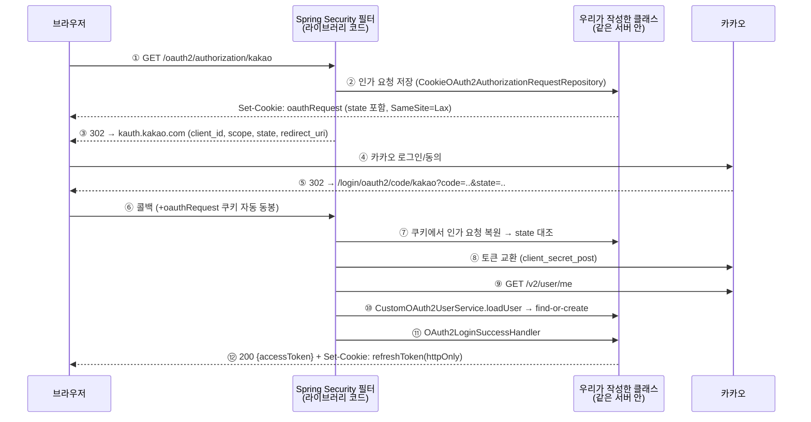

# OAuth 표준화 — spring-boot-starter-oauth2-client (단계 8)

- **과정명**: 강의용 Spring Boot 게시판 — 단계 8 (OAuth 표준화)
- **대상**: 단계 7(카카오 OAuth 수동 구현)을 마친 수강생
- **브랜치**: `step8-oauth2-client`
- **관련 코드**: `auth/oauth2/` 패키지 전체, `global/config/SecurityConfig.java`, `application.yaml`
- **선수 지식**: [OAUTH2-KAKAO.md](OAUTH2-KAKAO.md) — 수동 구현을 이해해야 "무엇이 자동으로 바뀌었는지"가 보인다

---

## 학습 목표

이 문서를 끝내면 수강생은:

- 단계 7 수동 구현의 각 부분이 **어떤 표준 부품으로 대체되는지** 매핑할 수 있다
- `oauth2Login()`이 켜는 두 필터(인가 리다이렉트/로그인 처리)의 동작을 설명할 수 있다
- 표준을 써도 **4개 클래스는 여전히 직접 만드는 이유**를 안다
- STATELESS 서버에서 `AuthorizationRequestRepository`를 쿠키로 교체해야 하는 이유를 안다
- `@Configuration`의 순환 의존이 왜 생기고 어떻게 끊는지 안다

---

## 1. 왜 표준화인가 — 단계 2→3과 같은 서사

단계 7에서 OAuth의 전 과정을 손으로 만들었다. 인가 URL 조립, state 쿠키, 토큰 교환, 사용자 조회 — 메커니즘이 전부 우리 코드에 보였다. 이제 단계 2(수동 JWT)→3(Security 표준) 때처럼 **원리를 아는 상태에서 표준으로 갈아탄다**.

표준화로 얻는 것:

- **검증된 구현** — state 생성·대조, 토큰 교환의 세부를 라이브러리가 책임진다
- **제공자 추가가 설정으로** — 네이버/구글 추가는 yaml 블록 추가가 대부분이다
- **업계 공통 URL 관례** — `/oauth2/authorization/{id}`, `/login/oauth2/code/{id}`는 어느 Spring 프로젝트에서나 같은 의미다

**전환 전략은 단계 2→3과 다르다**: 그때는 같은 자리를 대체하는 빅뱅(D 완료까지 컴파일 깨짐)이었지만, 이번엔 URL이 달라 **표준 경로를 수동 경로 옆에 나란히 세웠다**(strangler 패턴). 매 단계 컴파일·테스트 green을 유지했고, 두 경로를 실 브라우저로 **비교 시연**할 수 있다. 검증이 끝난 지금에야 수동 구현 제거를 논한다.

---

## 2. 무엇이 무엇으로 바뀌나

| 역할 | 단계 7 (수동) | 단계 8 (표준) | 누가 만드나 |
|------|--------------|--------------|------------|
| 로그인 시작 (302 + state 생성) | `KakaoOAuthController.login()` | `OAuth2AuthorizationRequestRedirectFilter` | 라이브러리 |
| state 저장 | 직접 만든 state 쿠키 | `AuthorizationRequestRepository` | **우리** (쿠키판) |
| state 검증 | callback에서 수동 대조 | `OAuth2LoginAuthenticationFilter` | 라이브러리 |
| 토큰 교환 (code→token) | `KakaoOAuthClient.requestToken` | `OAuth2LoginAuthenticationProvider` | 라이브러리 |
| 사용자 조회 (/v2/user/me) | `KakaoOAuthClient.fetchUser` | `DefaultOAuth2UserService.loadUser` | 라이브러리 |
| find-or-create | `KakaoOAuthService` | `CustomOAuth2UserService` | **우리** (로직 이사) |
| 성공 응답 (JWT+쿠키) | `KakaoOAuthController.callback()` | `OAuth2LoginSuccessHandler` | **우리** |
| 실패 응답 (401 JSON) | 예외 → GlobalExceptionHandler | `OAuth2LoginFailureHandler` | **우리** |
| 설정 | `app.oauth.kakao.*` (커스텀) | `spring.security.oauth2.client.*` | 표준 프로퍼티 |

> **핵심**: HTTP 프로토콜 절차(URL 조립·state·교환·조회)는 전부 라이브러리로 넘어갔다. 우리 손에 남는 것은 **우리 서비스의 고유 결정**뿐이다 — 사용자를 어디에 앉힐지(UserService), 성공/실패에 무엇을 응답할지(Handler 2개), 상태를 어디에 보관할지(쿠키 저장소). 단계 3에서 `CustomUserDetailsService`만 우리가 만들었던 것과 같은 구도다.

---

## 3. 흐름 — 누가 무엇을 하는가

> **읽기 전에**: 아래의 "Spring Security"와 "우리 클래스"는 미들웨어/백엔드 같은 별개 계층이 아니다.
> **같은 서버, 같은 요청 스레드**에서 실행되는 코드를 "누가 작성했나" 기준으로 나눈 것뿐이다.
> 라이브러리 필터가 절차의 뼈대를 진행하다가, 우리가 SecurityConfig에 등록한 구현체를
> 정해진 지점에서 호출한다(전략 패턴/IoC) — 단계 3에서 AuthenticationManager(라이브러리)가
> CustomUserDetailsService(우리)를 호출하던 것과 같은 구도다.



단계 7 다이어그램과 비교하면 **서버 쪽 주어가 바뀌었을 뿐 절차는 동일하다** — 그래서 수동 구현을 먼저 배운 것이다.

**URL이 바뀌었다** (카카오 콘솔에 새 Redirect URI 등록 필수):

| | 단계 7 (수동) | 단계 8 (표준) |
|---|--------------|--------------|
| 시작 | `/api/oauth/kakao/login` | `/oauth2/authorization/kakao` |
| 콜백 | `/api/oauth/kakao/callback` | `/login/oauth2/code/kakao` |

---

## 4. 설정 — 표준 프로퍼티

```yaml
spring:
  security:
    oauth2:
      client:
        registration:
          kakao:
            client-id: ${KAKAO_REST_API}
            client-secret: ${KAKAO_SECRET}
            redirect-uri: "{baseUrl}/login/oauth2/code/kakao"
            authorization-grant-type: authorization_code
            client-authentication-method: client_secret_post
            scope: profile_nickname
        provider:
          kakao:
            authorization-uri: https://kauth.kakao.com/oauth/authorize
            token-uri: https://kauth.kakao.com/oauth/token
            user-info-uri: https://kapi.kakao.com/v2/user/me
            user-name-attribute: id
```

읽는 법:

- **registration** = "우리 앱이 카카오의 어떤 클라이언트인가" (키·콜백·scope) / **provider** = "카카오의 엔드포인트들". 구글·깃허브는 `CommonOAuth2Provider`에 내장돼 provider 블록이 필요 없지만 **카카오는 직접 기술**한다.
- `user-name-attribute: id` — 사용자 응답에서 "이름"으로 쓸 최상위 속성. 이 덕분에 `authentication.getName()` = 카카오 회원번호 = **단계 7의 providerId와 같은 값**이 된다 (SuccessHandler가 이용).
- `client-authentication-method: client_secret_post` — 카카오는 Basic 인증 헤더가 아니라 **form 본문**의 client_id/secret을 요구한다. 이 한 줄이 틀리면 토큰 교환에서 KOE 에러.
- `scope: profile_nickname` — **수동 구현과 다른 점**: 단계 7은 scope 파라미터를 아예 안 보냈다(동의된 항목이 기본 제공). 표준 클라이언트는 명시한 scope를 요청하므로, **콘솔 동의 항목에 없는 scope를 적으면 에러**가 난다.

---

## 5. 우리가 여전히 만드는 4개 클래스

### 5-1. `CookieOAuth2AuthorizationRequestRepository` — state를 쿠키에

`oauth2Login`의 인가 요청 저장 기본값은 **HttpSession**이다. 우리 서버는 단계 3부터 STATELESS — 세션을 되살릴 수 없으므로 쿠키 저장소를 직접 구현한다. **단계 7에서 손으로 만든 state 쿠키의 "표준 인터페이스 구현판"**이다.

```java
public class CookieOAuth2AuthorizationRequestRepository
    implements AuthorizationRequestRepository<OAuth2AuthorizationRequest> {
  // save: 로그인 시작 시 → 인가 요청(state 포함)을 쿠키로
  // load: 콜백 시 → 쿠키에서 복원 (라이브러리가 state 대조에 사용)
  // remove: 복원 후 쿠키 즉시 만료 (1회용)
}
```

**보안 포인트 — 왜 객체를 통째로 직렬화하지 않나**: 흔한 예제들은 `SerializationUtils`로 객체를 직렬화해 쿠키에 넣는다. 하지만 쿠키는 **클라이언트가 조작 가능한 입력**이고, 조작된 바이트의 역직렬화는 insecure deserialization(CWE-502) 공격면이 된다. 우리는 필요한 필드(state, clientId, redirectUri...)만 JSON으로 담고 꺼낼 때 builder로 재조립한다. 조작·손상된 쿠키는 null 반환 → 라이브러리가 인증 실패로 처리.

쿠키는 단계 7 state 쿠키와 같은 이유로 `SameSite=Lax` — 콜백이 카카오發 크로스 사이트 이동이기 때문.

### 5-2. `CustomOAuth2UserService` — 단계 3 `CustomUserDetailsService`의 OAuth판

```java
@Override
@Transactional
public OAuth2User loadUser(OAuth2UserRequest userRequest) {
  OAuth2User oauth2User = super.loadUser(userRequest);  // 카카오 /v2/user/me — fetchUser의 대체
  upsertUser(oauth2User.getAttributes());               // find-or-create — KakaoOAuthService에서 이사
  return oauth2User;
}
```

- `super.loadUser()`가 단계 7의 `fetchUser`를 정확히 대신한다 — 우리가 추가하는 것은 그 결과를 우리 `users` 테이블에 연결하는 일뿐.
- find-or-create **정책은 단계 7과 완전히 동일**(kakao_{회원번호} username, 랜덤 password 해시, 이메일 폴백, 닉네임 충돌 suffix). 로직이 이사만 왔다 — 실제로 E2E에서 **단계 7 때 가입한 사용자를 표준 경로가 그대로 재사용**함을 확인했다.
- attributes는 단계 7 DTO가 받던 것과 같은 중첩 Map — 같은 "한 단계씩 내려가기" 방식으로 email/nickname을 꺼낸다.

### 5-3. `OAuth2LoginSuccessHandler` — 성공을 "우리 토큰"으로

```java
String providerId = authentication.getName();   // user-name-attribute: id → 카카오 회원번호
User user = userRepository.findByProviderAndProviderId(provider, providerId).orElseThrow(...);
TokenPair tokens = authService.issueTokenPair(user);   // 단계 4~5 발급 경로 그대로
// access token은 본문(JSON), refresh token은 httpOnly 쿠키 — 단계 5의 규칙 유지
```

커스텀 principal 클래스를 만드는 대신 `getName()`(=providerId)으로 재조회한다 — 쿼리 한 번을 더 쓰고 클래스 수를 줄이는 선택(학습 난이도 우선). registrationId("kakao")로 `AuthProvider`를 결정하므로 네이버/구글이 추가돼도 이 핸들러는 그대로다.

### 5-4. `OAuth2LoginFailureHandler` — 실패를 401 JSON으로

기본 동작은 `/login?error` **리다이렉트** — 화면 없는 REST API에 맞지 않는다. 동의 거부·state 불일치·토큰 교환 실패 모두 `OAUTH_LOGIN_FAILED`(401) 한 코드로 응답하고 세부 사유는 로그로만 남긴다(단계 7과 같은 정책).

### SecurityConfig 조립

```java
.oauth2Login(oauth -> oauth
    .authorizationEndpoint(e -> e.authorizationRequestRepository(cookieAuthorizationRequestRepository))
    .userInfoEndpoint(u -> u.userService(customOAuth2UserService))
    .successHandler(oAuth2LoginSuccessHandler)
    .failureHandler(oAuth2LoginFailureHandler))
```

---

## 6. 실측에서 배운 것들

### 6-1. 순환 의존 — @Configuration의 함정

oauth2 부품 4개를 `SecurityConfig` **생성자**로 받자 기동이 실패했다:

```
SecurityConfig(생성자) → CustomOAuth2UserService → PasswordEncoder
                ↑______________ @Bean이 SecurityConfig 안에 ______________|
```

`PasswordEncoder` 빈을 만들려면 `SecurityConfig` 인스턴스가 먼저 필요한데, 그 생성자가 `PasswordEncoder`를 (간접) 요구하는 고리. **해법: 부품들을 `securityFilterChain` 빈 메서드의 파라미터로 이동** — 메서드 파라미터는 인스턴스 생성 후 해석되므로 고리가 끊긴다.

```java
@Bean
public SecurityFilterChain securityFilterChain(
    HttpSecurity http,
    CookieOAuth2AuthorizationRequestRepository cookieAuthorizationRequestRepository,
    CustomOAuth2UserService customOAuth2UserService, ...) { ... }
```

### 6-2. registration이 하나도 없으면 기동 실패

`oauth2Login()`을 구성해 두면 `ClientRegistrationRepository` 빈이 필수가 된다. 테스트 yaml(메인 yaml을 통째로 대체)에 registration이 없으면 **컨텍스트 로드부터 실패** — 그래서 테스트 yaml에 더미 kakao registration을 넣었다.

### 6-3. state 형식으로 구현을 구분할 수 있다

병행 상태에서 두 경로를 밟아 보면: 수동 경로의 state는 **UUID**(우리가 `UUID.randomUUID()`로 생성), 표준 경로는 **base64url** 문자열(라이브러리의 `Base64StringKeyGenerator`). 콜백 URL만 봐도 어느 구현이 처리했는지 알 수 있다.

---

## 7. 테스트와 검증

- `CustomOAuth2UserServiceTest` (4) — upsert 정책이 단계 7과 동일함을 같은 케이스로 검증
- `CookieOAuth2AuthorizationRequestRepositoryTest` (4) — save→load 왕복, remove 후 만료, 쿠키 부재, **조작된 쿠키 → null**
- 전체 70개 통과 (수동 경로 테스트 포함 — 병행이므로 둘 다 green)
- **실 브라우저 E2E**: 표준 경로 로그인 → 콜백 `/login/oauth2/code/kakao` → JWT 응답 → DB 기존 사용자 재사용 → httpOnly reissue 200. 수동 경로도 병행 동작 확인.

---

## 8. 파일 요약

**추가 (단계 8)**:

| 파일 | 역할 |
|------|------|
| `auth/oauth2/CookieOAuth2AuthorizationRequestRepository` | state 쿠키 저장소 (STATELESS) |
| `auth/oauth2/CustomOAuth2UserService` | find-or-create (이사) |
| `auth/oauth2/OAuth2LoginSuccessHandler` | JWT + refresh 쿠키 응답 |
| `auth/oauth2/OAuth2LoginFailureHandler` | 401 JSON |
| `SecurityConfig` | `.oauth2Login()` 조립 (빈 메서드 파라미터 주입) |
| `application.yaml` | `spring.security.oauth2.client.*` |
| `build.gradle` | `spring-boot-starter-oauth2-client` |

**제거 예정 (Phase F — 표준 경로 검증 완료로 역할 종료, 단계 7 교재는 step7 브랜치에 보존)**:

`auth/oauth/` 패키지 전체 — `KakaoOAuthClient`, `KakaoOAuthController`, `KakaoOAuthService`, `KakaoOAuthProperties`, `dto/KakaoTokenResponse`, `dto/KakaoUserResponse` + `RestClientConfig`(사용처 소멸) + 테스트 3개 + `SecurityConfig`의 `/api/oauth/**` permitAll + yaml `app.oauth.kakao.*`

---

## 9. 핵심 요약 한 장

```
┌─────────────────────────────────────────────────────────────────────┐
│ 표준화 = 프로토콜 절차(URL·state·교환·조회)를 라이브러리에 넘기고,    │
│          우리 서비스의 고유 결정만 4개 클래스로 남기는 것             │
│                                                                     │
│ URL:  시작 /oauth2/authorization/kakao                               │
│       콜백 /login/oauth2/code/kakao  ← 콘솔 재등록 필수              │
│                                                                     │
│ 우리가 만드는 것:                                                    │
│   쿠키 state 저장소  ← STATELESS라 세션 기본값 사용 불가              │
│   CustomOAuth2UserService  ← find-or-create (단계 7 정책 그대로)     │
│   Success/FailureHandler  ← REST API 응답 형태 (기본값은 리다이렉트)  │
│                                                                     │
│ 함정:  카카오는 provider 블록 직접 기술 + client_secret_post          │
│        scope는 콘솔 동의 항목과 일치해야 (수동 구현은 안 보냈었다)     │
│        @Configuration 순환 의존 → 빈 메서드 파라미터로 끊기           │
│                                                                     │
│ 전환 전략:  병행 후 제거(strangler) — 빅뱅이던 단계 2→3과 대비        │
└─────────────────────────────────────────────────────────────────────┘
```

---

## 부록. 자주 나오는 질문 (FAQ)

| 질문 | 답변 요약 |
|------|-----------|
| STATELESS인데 oauth2Login이 되나? | 기본 state 저장소(세션)만 쿠키로 갈아끼우면 된다. 그게 `CookieOAuth2AuthorizationRequestRepository`. |
| 왜 SuccessHandler에서 DB를 다시 조회하나? | 커스텀 principal(OAuth2User 구현체)을 만들면 조회 없이 가능하다. 클래스 수를 줄이는 쪽을 택했다 — `user-name-attribute: id` 덕에 `getName()`이 곧 providerId다. |
| 네이버를 추가하려면? | yaml에 naver registration/provider 추가 + `AuthProvider.NAVER` + UserService에서 제공자별 attributes 파싱 분기. 네이버는 사용자 정보가 `response` 아래 중첩이라 `user-name-attribute: response`로 두고 내부에서 꺼낸다. |
| 콜백 URL을 바꿀 수 있나? | `loginProcessingUrl`로 가능하지만 권장하지 않는다 — 표준 관례를 따르는 것이 표준화의 취지다. |
| 수동 코드는 왜 아직 있나? | 병행 후 제거 전략의 마지막 단계(Phase F)가 남았다. 표준 경로 검증이 끝났으므로 제거해도 되는 상태 — 교재로서의 수동 구현은 step7 브랜치에 온전히 보존된다. |
| 토큰 교환 실패는 어디서 보나? | FailureHandler가 401 한 코드로 응답하고, 원인(`invalid_client` 등 OAuth2 표준 에러 코드)은 서버 로그에 남는다. |
| 단계 7의 `.env` fail-fast는? | `KakaoOAuthProperties`가 담당했다 — Phase F에서 삭제되면 그 검증도 사라진다. 표준 프로퍼티에는 미해석 placeholder가 그대로 들어가므로, 필요하면 등가 검증을 별도로 추가한다(Phase F에서 결정). |
