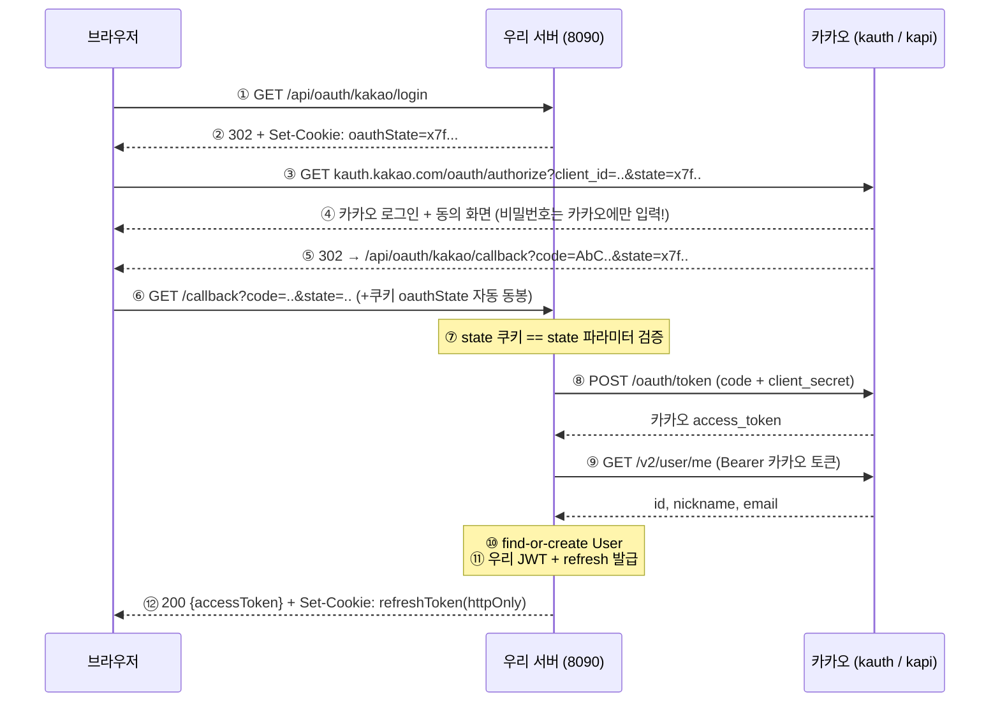
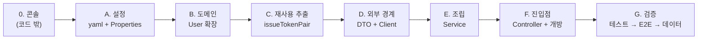

# OAuth 2.0 — 카카오 로그인 수동 구현 (단계 7)

- **과정명**: 강의용 Spring Boot 게시판 — 단계 7 (OAuth 2.0 / 카카오)
- **대상**: 단계 6(메서드 보안)을 마친 수강생
- **브랜치**: `step7-oauth2-kakao`
- **관련 코드**: `auth/oauth/` 패키지 전체, `user/AuthProvider.java`, `user/User.java`, `auth/AuthService.java`, `global/config/SecurityConfig.java`
- **선수 지식**: [SPRING-SECURITY-STANDARD.md](SPRING-SECURITY-STANDARD.md), [REFRESH-TOKEN.md](REFRESH-TOKEN.md), [HTTPONLY-COOKIE.md](HTTPONLY-COOKIE.md)

---

## 학습 목표

이 문서를 끝내면 수강생은:

- OAuth 2.0 **authorization code grant**의 3단계 흐름(인가 요청 → 코드 → 토큰 교환)을 설명할 수 있다
- 카카오의 access token과 **우리 서비스의 JWT가 완전히 다른 토큰**임을 구분할 수 있다
- `state` 파라미터가 막는 공격(CSRF/코드 주입)과 검증 구현을 이해한다
- state 쿠키에 `SameSite=Lax`, refresh 쿠키에 `Strict`을 쓰는 이유를 구분할 수 있다
- 소셜 사용자를 기존 User 모델에 통합하는 설계(provider + providerId)를 할 수 있다

---

## 1. 왜 OAuth 2.0인가 — "비밀번호를 받지 않는 로그인"

단계 1~6의 로그인은 전부 **우리가 비밀번호를 받았다**. 사용자는 우리 서비스에 비밀번호를 맡겨야 하고, 우리는 그것을 안전하게 저장(BCrypt)해야 했다.

OAuth 2.0은 이 전제를 뒤집는다:

> "비밀번호는 카카오만 안다. 우리는 **카카오가 발급한 증명서**만 확인한다."

- 사용자: 비밀번호를 하나 덜 만든다 (기억 부담↓, 유출 피해 반경↓)
- 우리: 비밀번호 저장 책임이 없는 사용자 집합이 생긴다
- 카카오: 자기 사용자의 인증을 대행하고 생태계를 넓힌다

**용어 정리** (혼동 주의):

| 용어 | 이 프로젝트에서 |
|------|----------------|
| Resource Owner | 카카오 계정을 가진 사용자 |
| Client | **우리 서버**(board 앱). "클라이언트"가 브라우저가 아니다! |
| Authorization Server | kauth.kakao.com (인가 코드/토큰 발급) |
| Resource Server | kapi.kakao.com (사용자 정보 API) |

> **핵심**: OAuth에서 "Client"는 우리 서버다. 카카오 입장에서 우리 서버가 자기 API의 클라이언트이기 때문이다.

---

## 2. 전체 흐름 — Authorization Code Grant



**두 종류의 토큰이 등장한다 — 절대 혼동 금지:**

| | 카카오 access token | 우리 access token (JWT) |
|---|---|---|
| 발급자 | 카카오 | 우리 서버 (`JwtTokenProvider`) |
| 용도 | 카카오 API 호출 (`/v2/user/me`) | 우리 API 호출 (`/api/v1/**`) |
| 수명 | 이번 로그인 처리 중에만 사용하고 버린다 | 1시간, 이후 refresh로 재발급 |

⑧~⑨가 끝나면 카카오 토큰은 역할이 끝난다. ⑪부터는 **단계 4~5에서 만든 우리 토큰 체계를 그대로 재사용**한다 — 이후 reissue/logout 흐름이 로컬 로그인과 완전히 동일해지는 것이 이 설계의 핵심이다.

---

## 3. 사전 준비 — 카카오 개발자 콘솔 (코드 밖 설정)

[developers.kakao.com](https://developers.kakao.com) → 내 애플리케이션:

1. **앱 키 확인**: [앱 설정 > 앱 키]의 **REST API 키** → `appkey`
2. **Redirect URI 등록**: [카카오 로그인 > 일반] → `http://localhost:8090/api/oauth/kakao/callback`
   - yaml의 `callback`과 **문자열이 한 글자도 다르면 안 된다** (`KOE006` 에러)
3. **Client Secret**: [카카오 로그인 > 보안] → 코드 생성 + 상태 **"사용함"** → `secret`
4. **동의 항목**: [카카오 로그인 > 동의 항목]
   - 닉네임(`profile_nickname`): 기본 제공
   - 카카오계정 이메일(`account_email`): **비즈 앱 전환 필요** — 없으면 email이 null로 온다 (코드는 이 경우를 처리한다)

---

## 4. 설정 — application.yaml

```yaml
app:
  oauth:
    kakao:
      appkey: ${KAKAO_REST_API:...}      # REST API Key = OAuth의 client_id
      secret: ${KAKAO_SECRET:...}        # Client Secret
      callback: ${KAKAO_CALLBACK:http://localhost:8090/api/oauth/kakao/callback}
      authorize-uri: https://kauth.kakao.com/oauth/authorize   # 브라우저 리다이렉트
      token-uri: https://kauth.kakao.com/oauth/token           # 서버 간 호출
      user-info-uri: https://kapi.kakao.com/v2/user/me         # 서버 간 호출
```

바인딩은 `@Value` 여섯 줄 대신 **타입 세이프한 불변 클래스**로:

```java
@Getter
@RequiredArgsConstructor
@ConfigurationProperties(prefix = "app.oauth.kakao")
public class KakaoOAuthProperties {

  private final String appkey;
  private final String secret;
  // ... (callback, authorizeUri, tokenUri, userInfoUri)

  // Lombok 생성자에는 검증을 못 넣으므로 바인딩 직후 실행되는 @PostConstruct에서 fail-fast (아래 참고)
  @PostConstruct
  void validate() {
    requireResolved("appkey(KAKAO_REST_API)", appkey);
    // ...
  }
}
```

- `@RequiredArgsConstructor`가 final 필드 6개짜리 생성자를 만들고, **유일한 생성자**라 Boot 3가 생성자 바인딩을 적용한다
- 단, 생성자 바인딩은 **파라미터 이름**에 의존한다 — `-parameters` 컴파일 옵션이 전제 (이 프로젝트는 단계 6의 SpEL `#id` 때문에 이미 켜져 있다. 없으면 "Failed to bind" 에러)

`BoardApplication`의 `@ConfigurationPropertiesScan`이 이 클래스를 빈으로 등록한다. kebab-case(`authorize-uri`) → camelCase(`authorizeUri`) 변환은 relaxed binding이 자동으로 한다.

> **함정 — 해석 안 된 placeholder는 조용히 통과한다**: `@Value("${KAKAO_SECRET}")`는 값이 없으면 기동 즉시 실패하지만, `@ConfigurationProperties` 바인딩은 `"${KAKAO_SECRET}"`라는 **문자열 그대로** 바인딩하고 넘어간다. 그대로 두면 `.env` 없이도 기동은 되고 첫 로그인 요청에서야 500이 터진다. 그래서 생성자에서 null/빈 값/`${` 포함 여부를 검증해 **기동 시점에 즉시 실패(fail-fast)** 시킨다. (`@NotBlank`로는 못 잡는다 — `"${KAKAO_SECRET}"`는 blank가 아니다.)

> **보안 주의**: 실제 키를 yaml 기본값에 두면 git 히스토리에 영원히 남는다. 강의 편의로 넣더라도, 공개 저장소라면 반드시 환경변수(`KAKAO_SECRET=...`)로 옮기고 콘솔에서 키를 재발급하라.

---

## 5. 클래스별 역할

### 5-1. `KakaoOAuthClient` — 카카오와의 HTTP 통신 전담

흐름의 ③(URL 생성), ⑧(토큰 교환), ⑨(사용자 조회)를 담당한다.

```java
// ⑧ 토큰 교환 — form-urlencoded POST (JSON 아님!)
public KakaoTokenResponse requestToken(String code) {
  MultiValueMap<String, String> form = new LinkedMultiValueMap<>();
  form.add("grant_type", "authorization_code");
  form.add("client_id", properties.appkey());
  form.add("client_secret", properties.secret());
  form.add("redirect_uri", properties.callback());  // 인가 요청과 같은 값이어야 함
  form.add("code", code);
  return restClient.post()
      .uri(properties.tokenUri())
      .contentType(MediaType.APPLICATION_FORM_URLENCODED)
      .body(form)
      .retrieve()
      .body(KakaoTokenResponse.class);
}
```

**강의 포인트**:
- 이 클래스가 곧 `spring-boot-starter-oauth2-client`가 자동으로 해주는 일의 **수동 구현**이다. 단계 2(수동 JWT) → 단계 3(표준)과 같은 교육 패턴.
- `RestClient`는 Spring 6.1+의 동기 HTTP 클라이언트 — `RestTemplate`의 후계자. Boot이 자동 구성한 `RestClient.Builder`를 주입받으면 앱의 ObjectMapper를 물려받는다.
- 카카오 쪽 실패(만료된 code, redirect_uri 불일치)는 **로그로만** 남기고 클라이언트엔 `OAUTH_LOGIN_FAILED`(401) 하나로 응답 — 내부 구성을 노출하지 않는다.

### 5-2. DTO — 카카오 응답 매핑

카카오의 실제 JSON은 중첩돼 있지만, DTO는 **평면 필드 3개**로 받는다:

```java
// 실제 응답: { "id": 4242, "kakao_account": { "email": "..", "profile": { "nickname": ".." } } }
@Getter
@NoArgsConstructor
public class KakaoUserResponse {

  @JsonProperty("id")
  private Long id;          // 카카오 회원번호(불변) → providerId
  private String email;     // kakao_account.email
  private String nickname;  // kakao_account.profile.nickname

  // Jackson이 "kakao_account" 항목을 만나면 이 메서드에 Map으로 넘겨준다 — 중첩을 여기서 푼다.
  // 동의 항목이 없으면 각 단계의 값이 null일 수 있어, 한 단계씩 확인하며 내려간다.
  @JsonProperty("kakao_account")
  private void unpackKakaoAccount(Map<String, Object> kakaoAccount) {
    if (kakaoAccount == null) return;

    this.email = (String) kakaoAccount.get("email");

    Object profileValue = kakaoAccount.get("profile");
    if (profileValue == null) return;
    Map<?, ?> profile = (Map<?, ?>) profileValue;  // {"nickname": "..."} 형태의 Map
    this.nickname = (String) profile.get("nickname");
  }
}
```

**강의 포인트 — "중첩 JSON, 평면 DTO" 패턴**: JSON 구조를 그대로 클래스 3개로 옮기면 DTO를 쓰는 쪽 모두가 중첩(`getKakaoAccount().getProfile().getNickname()`)과 그 각각의 null 가능성을 알아야 한다. `@JsonProperty`가 붙은 unpack 메서드가 역직렬화 시점에 필요한 값만 꺼내 담으면, **DTO 밖에서는 중첩의 존재 자체를 몰라도 된다**. email/nickname은 동의 항목 미설정이면 null일 수 있다 — `KakaoUserResponseTest`가 중첩 해체와 null 케이스를 검증한다.

### 5-3. `KakaoOAuthService` — 카카오 사용자 ↔ 우리 사용자 연결

```java
@Transactional
public TokenPair login(String code) {
  KakaoTokenResponse kakaoToken = kakaoOAuthClient.requestToken(code);
  KakaoUserResponse kakaoUser = kakaoOAuthClient.fetchUser(kakaoToken.accessToken());
  User user = findOrCreateUser(kakaoUser);        // 없으면 가입, 있으면 로그인
  return authService.issueTokenPair(user);        // 단계 4~5의 발급 경로 재사용
}
```

**강의 포인트 — 소셜 로그인은 "로그인과 가입이 하나"다**:
- 카카오는 "이 사람이 카카오 회원 4242다"까지만 보증한다. 그를 우리 `users` 테이블 어느 행에 연결할지는 전적으로 우리 책임.
- 식별키는 `(provider, providerId)` 쌍. 이메일이 아니다 — 이메일은 동의 안 하면 null이고, 카카오에서 변경 가능하다. **회원번호(id)만 불변**이다.
- 신규 가입 시 세 가지 제약을 처리한다:

| 컬럼 제약 | 소셜 사용자 처리 |
|-----------|-----------------|
| `username` NOT NULL UNIQUE | `kakao_{회원번호}` — 충돌 불가능한 규칙 생성 |
| `email` NOT NULL UNIQUE | 카카오 이메일. null이거나 기존 계정과 겹치면 `kakao_{id}@kakao.local` 대체 (계정 연동은 후속 주제) |
| `password` NOT NULL | **아무도 모르는 랜덤 UUID를 BCrypt 해시** — NOT NULL 충족 + password 로그인 원천 차단 |

### 5-4. `KakaoOAuthController` — 흐름의 양 끝

```java
@GetMapping("/login")      // ① 시작: state 쿠키 + 302 리다이렉트
@GetMapping("/callback")   // ⑥ 끝: state 검증 → 토큰 교환 → 우리 JWT 응답
```

로컬 로그인(`POST /auth/login`)과 달리 **둘 다 GET**이다 — 브라우저 리다이렉트로 오가는 흐름이기 때문. 성공 응답은 단계 5와 동일한 비대칭: access token은 본문, refresh token은 httpOnly 쿠키.

### 5-5. `User` 엔티티 확장

```java
@Enumerated(EnumType.STRING)
@Column(nullable = false, length = 20)
private AuthProvider provider;      // LOCAL | KAKAO

@Column(name = "provider_id", length = 100)
private String providerId;          // 카카오 회원번호. LOCAL은 null.
```

`(provider, provider_id)` 복합 UNIQUE 제약으로 "같은 카카오 계정으로 두 번 가입"을 DB가 막는다.

---

## 6. 보안 포인트 — state와 SameSite

### 6-1. state가 막는 공격

state 없이 콜백을 열어두면, 공격자가 **자기 카카오 계정으로 발급받은 code**를 피해자에게 강제로 밟게 할 수 있다(CSRF). 피해자는 자기도 모르게 **공격자의 계정으로 로그인**되고, 이후 피해자가 입력하는 데이터가 공격자 계정에 쌓인다.

방어: 로그인 시작 시 예측 불가능한 난수를 **쿠키와 인가 URL 양쪽**에 심고, 콜백에서 대조한다.

```java
// 시작: 같은 값을 두 경로로
String state = UUID.randomUUID().toString();
// (1) Set-Cookie: oauthState=x7f...   (2) authorize URL의 &state=x7f...

// 콜백: 두 경로가 다시 만난다
if (stateCookie == null || !stateCookie.equals(state)) {
  throw new UnauthorizedException(ErrorCode.INVALID_OAUTH_STATE);
}
```

공격자가 보낸 링크에는 피해자 브라우저의 state 쿠키와 일치하는 값이 있을 수 없다 — 쿠키는 피해자 브라우저에만 있고 공격자는 그 값을 모르기 때문.

### 6-2. 왜 state 쿠키만 SameSite=Lax인가

| 쿠키 | SameSite | 이유 |
|------|----------|------|
| `refreshToken` (단계 5) | **Strict** | 같은 사이트 요청에만 동봉되면 충분. 가장 보수적으로. |
| `oauthState` (단계 7) | **Lax** | 콜백이 **kauth.kakao.com발 크로스 사이트 이동**이다. Strict이면 브라우저가 쿠키를 아예 안 실어 검증이 **항상 실패**한다. |

Lax는 "크로스 사이트여도 **최상위 이동 + GET**이면 동봉"이다. 카카오 → 우리 콜백이 정확히 이 경우다. 이 차이를 모르면 "로컬에선 되는데 왜 안 되지"를 몇 시간 헤매게 되는, 실무에서 가장 자주 밟는 지뢰다.

### 6-3. 나머지 방어선

- **client_secret**: 토큰 교환은 code만으로 안 된다 — code가 URL에 노출되더라도(브라우저 히스토리, 로그) secret 없인 토큰으로 못 바꾼다. secret은 서버에만 있다.
- **code는 1회용 + 10분 만료**: 카카오가 강제한다. 같은 code로 두 번 요청하면 `KOE320`.
- **redirect_uri 재검증**: 토큰 교환 때도 같은 redirect_uri를 보내야 한다 — 인가 요청과 교환 요청이 같은 주체임을 재확인하는 장치.

---

## 7. 기능 추가 코딩 순서 (단계 6 → 7)

원칙: **의존성의 역방향으로 쌓는다** — 코드 밖 설정 → 입력(설정) → 바닥(도메인) → 기존 코드의 재사용 지점 → 외부 경계 → 조립 → 진입점 → 검증. 단계 2→3이 "기존 것을 표준으로 **대체**"(빅뱅, D 완료까지 컴파일 깨짐)였다면, 단계 6→7은 "**순수 추가**"라서 **매 Phase가 끝날 때마다 컴파일과 기존 테스트가 green**을 유지할 수 있다. 이 차이 자체가 강의 포인트다.

### Phase 0 — 코드 밖 준비 (카카오 콘솔)

1. **앱 생성 + REST API 키 확인, Redirect URI 등록, Client Secret 생성("사용함"), 동의 항목.**
   코드보다 먼저인 이유: 나중에 실패했을 때 **코드 문제인지 콘솔 문제인지 분리**하기 위해. 콘솔이 틀리면 코드가 완벽해도 KOE006 같은 에러로 실패한다(§3).

### Phase A — 입력 준비 (설정)

2. **`application.yaml`의 `app.oauth.kakao.*` + `.env`** — 키/엔드포인트라는 "입력"을 먼저 확정.
3. **`KakaoOAuthProperties`** (+ `@ConfigurationPropertiesScan`) — 아무 코드에도 의존하지 않고, 이후 모든 코드가 의존하므로 가장 먼저. ✅ 컴파일 green

### Phase B — 도메인 확장 (바닥)

4. **`AuthProvider` enum** → 5. **`User`에 `provider`/`providerId` + 복합 UNIQUE** → 6. **`UserRepository.findByProviderAndProviderId`**
   서비스 로직보다 먼저인 이유: "카카오 사용자를 우리 `users` 테이블 어디에 앉힐 것인가"라는 **설계 결정이 모든 로직의 전제**다. 기존 생성자는 새 생성자에 위임(`provider=LOCAL`)하므로 기존 코드가 깨지지 않는다. ✅ 컴파일 green + **기존 테스트 전체 통과 확인 시점**

### Phase C — 기존 코드에서 재사용 지점 추출 (새 코드 작성 전에!)

7. **`AuthService.issueTokenPair(User)` 추출** — 로컬 로그인이 쓰던 발급 로직을 공용 메서드로.
   새 코드보다 먼저인 이유: 새 기능을 만들다가 기존 코드를 같이 고치면 **문제가 생겼을 때 원인이 섞인다**. 기존 코드 수정을 먼저 끝내고 기존 테스트(로그인)로 회귀를 확인해 두면, 이후의 모든 버그는 새 코드 안에 있다.
8. **`ErrorCode`에 `OAUTH_LOGIN_FAILED`, `INVALID_OAUTH_STATE`** — 독립적이라 이 시점 어디든 무방. ✅ green

### Phase D — 외부 경계 (카카오 통신 계층)

9. **DTO 2종** (`KakaoTokenResponse`, `KakaoUserResponse`) — 응답의 "모양"부터.
10. **`KakaoOAuthClient`** (+ `RestClientConfig`) — 외부 호출을 **한 클래스로 모으는** 것이 핵심. 이 경계 하나만 mock하면 나머지 전부를 실제로 테스트할 수 있다(§8).

### Phase E — 조립 (비즈니스 로직)

11. **`KakaoOAuthService`** — B(도메인) + C(발급) + D(통신)를 조립: 토큰 교환 → 사용자 조회 → find-or-create → `issueTokenPair`. 부품이 다 있으니 이 클래스는 "조립"만 한다.

### Phase F — 진입점 연결과 개방 (마지막에)

12. **`KakaoOAuthController`** — `/login`(state 쿠키 + 302), `/callback`(state 검증 → 서비스 호출 → 쿠키/본문 응답).
13. **`SecurityConfig`에 `/api/oauth/**` permitAll** — 컨트롤러 **다음**인 이유: 대상이 존재해야 "열렸는지"를 확인할 수 있다. 보안 규칙을 미리 열어두는 습관은 잊힌 구멍을 남긴다.

### Phase G — 검증 (3층, 안쪽부터)

14. **단위/통합 테스트** — client만 mock한 서비스 통합 + state/쿠키 컨트롤러 단위.
15. **실 브라우저 E2E** — mock 경계 **바깥**(진짜 카카오, 콘솔 설정, SameSite 동작)은 여기서만 검증된다. KOE006을 여기서 처음 만나는 것이 정상이다.
16. **기존 데이터 마이그레이션** — `provider` 컬럼 백필(`WHERE provider_id IS NULL`). 스키마를 바꿨으면 기존 행을 반드시 돌아본다.



> **일반 원칙 — 어떤 기능 추가에든 적용**:
> 1. **코드 밖 설정 먼저** — 실패 원인을 코드/설정으로 분리할 수 있게
> 2. **의존성의 역방향으로** — 입력·바닥부터 진입점까지, 아래층이 위층을 모른 채 완성되도록
> 3. **기존 코드 수정은 새 코드 작성 전에** — 회귀를 기존 테스트로 즉시 확인
> 4. **외부 의존은 경계 한 곳에** — 테스트 가능성은 설계에서 나온다
> 5. **보안 개방은 대상이 생긴 뒤, 검증은 안쪽(단위)에서 바깥(실환경)으로**
> 6. **매 Phase 끝에서 컴파일·기존 테스트 green 유지** — 순수 추가는 항상 green일 수 있다

---

## 8. 테스트

### 자동 테스트 (H2)

- `KakaoOAuthServiceTest` — `KakaoOAuthClient`만 `@MockitoBean`으로 대체, 나머지는 실제 빈/DB. 신규 가입/재로그인/이메일 폴백/닉네임 충돌 5케이스.
- `KakaoOAuthControllerTest` — 스프링 컨텍스트 없는 단위 테스트. state 발급/불일치/누락, error 파라미터, 성공 쿠키 배치 5케이스.

**강의 포인트**: 외부 서버(카카오)와 통신하는 클래스를 **경계에 하나로 모아뒀기 때문에** 그 하나만 mock하면 나머지 전부를 실제로 검증할 수 있다. 테스트 가능성은 설계에서 나온다.

### 수동 테스트 (브라우저 필수)

curl만으로는 ④(카카오 로그인 화면)를 지나갈 수 없다 — **시작은 브라우저로**:

```
1. 브라우저에서 http://localhost:8090/api/oauth/kakao/login 접속
2. 카카오 로그인 + 동의 → JSON 응답 확인: {"accessToken": "eyJ...", ...}
3. 개발자도구 > Application > Cookies: refreshToken(httpOnly) 확인
4. 받은 accessToken으로 API 호출:
   curl http://localhost:8090/api/v1/profiles/me -H "Authorization: Bearer eyJ..."
5. DB 확인: SELECT username, provider, provider_id FROM users;
   → kakao_4242.., KAKAO, 4242..
```

---

## 9. 수정된 파일 요약

| 파일 | 변경 |
|------|------|
| `application.yaml` | `app.oauth.kakao.*`에 카카오 엔드포인트 3종 추가 |
| `AuthProvider` (신규) | LOCAL / KAKAO 가입 경로 enum |
| `User` | `provider`, `providerId` 추가 + 복합 UNIQUE, 소셜용 생성자 |
| `UserRepository` | `findByProviderAndProviderId` |
| `KakaoOAuthProperties` (신규) | `app.oauth.kakao.*` record 바인딩 |
| `KakaoTokenResponse` / `KakaoUserResponse` (신규) | 카카오 응답 DTO (snake_case 매핑, null-safe) |
| `KakaoOAuthClient` (신규) | 인가 URL 생성, 토큰 교환, 사용자 조회 (RestClient) |
| `KakaoOAuthService` (신규) | find-or-create + 우리 토큰 발급 |
| `KakaoOAuthController` (신규) | `/login`(state+302), `/callback`(검증+JWT 응답) |
| `AuthService` | `issueTokenPair(User)` 추출 — 로컬/소셜 공용 발급 경로 |
| `SecurityConfig` | `/api/oauth/**` permitAll |
| `ErrorCode` | `OAUTH_LOGIN_FAILED`, `INVALID_OAUTH_STATE` |
| `BoardApplication` | `@ConfigurationPropertiesScan` |
| `build.gradle` | `spring-boot-configuration-processor` |

---

## 10. 핵심 요약 한 장

```
┌─────────────────────────────────────────────────────────────────────┐
│ OAuth 2.0 = 비밀번호를 받지 않는 로그인. Client는 브라우저가 아니라   │
│             우리 서버다.                                             │
│                                                                     │
│ 흐름:  /login → state 쿠키 + 카카오로 302                            │
│        → 카카오 로그인/동의 → /callback?code=..&state=..             │
│        → state 검증 → code+secret으로 토큰 교환 → /v2/user/me        │
│        → (provider, providerId)로 find-or-create → 우리 JWT 발급     │
│                                                                     │
│ 토큰 2종:  카카오 access token = 카카오 API용, 즉시 버림              │
│            우리 JWT + refresh 쿠키 = 단계 4~5 체계 그대로 재사용      │
│                                                                     │
│ state:  쿠키와 URL 양쪽에 같은 난수 → 콜백에서 대조 (CSRF 차단)       │
│ SameSite:  state 쿠키만 Lax (카카오發 크로스 사이트 이동에 실려야 함)  │
│            refresh 쿠키는 Strict 유지                                │
│                                                                     │
│ 소셜 사용자:  username=kakao_{회원번호}, password=랜덤 해시(로그인 불가)│
│               식별은 이메일이 아니라 (provider, providerId)           │
└─────────────────────────────────────────────────────────────────────┘
```

---

## 부록. 자주 나오는 질문 (FAQ)

| 질문 | 답변 요약 |
|------|-----------|
| spring-boot-starter-oauth2-client를 안 쓴 이유는? | 강의 철학(수동 → 표준). 우리가 만든 `KakaoOAuthClient`+`Controller`가 라이브러리가 자동으로 하는 일 그 자체다. 표준 전환은 후속 주제. |
| 카카오 refresh token은 왜 안 쓰나? | 카카오 API를 계속 호출할 일이 없다. 로그인 순간 사용자 정보만 얻으면 끝 — 이후는 우리 토큰 체계가 담당. |
| code가 URL에 노출되는데 괜찮나? | code만으론 토큰 교환이 안 된다(client_secret 필요) + 1회용 + 10분 만료. 그래도 로그에 code를 남기지 않는 것이 예의. |
| 이메일로 기존 계정과 자동 연동하면 안 되나? | 위험하다 — 카카오 이메일 소유 확인이 안 된 채 연동하면 계정 탈취 벡터가 된다. 연동은 "로그인 상태에서 명시적 연결"로 (후속 주제). |
| 소셜 사용자가 password 로그인을 시도하면? | BCrypt 해시된 랜덤 UUID와 비교 → 항상 실패(LOGIN_FAILED 401). 원본을 아무도 모르므로 안전. |
| state를 세션에 저장하면 안 되나? | 우리 서버는 STATELESS(단계 3부터). 세션을 만들지 않으므로 쿠키에 심고 콜백에서 대조한다. |
| 네이버/구글 추가는? | 같은 구조 복제 — `AuthProvider`에 enum 추가, provider별 Client/DTO 작성. 이게 반복되면 그때가 표준 라이브러리(oauth2-client)로 갈아탈 시점이다. |
| 모바일 앱에서는? | 콜백 URI를 앱 스킴으로 받거나, 앱이 SDK로 카카오 토큰을 받아 서버에 전달하는 방식(token 검증 API)을 쓴다 — 별도 설계 필요. |
