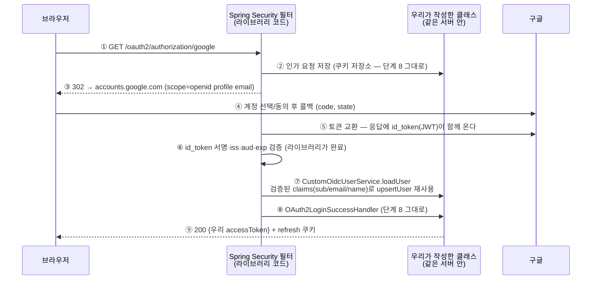
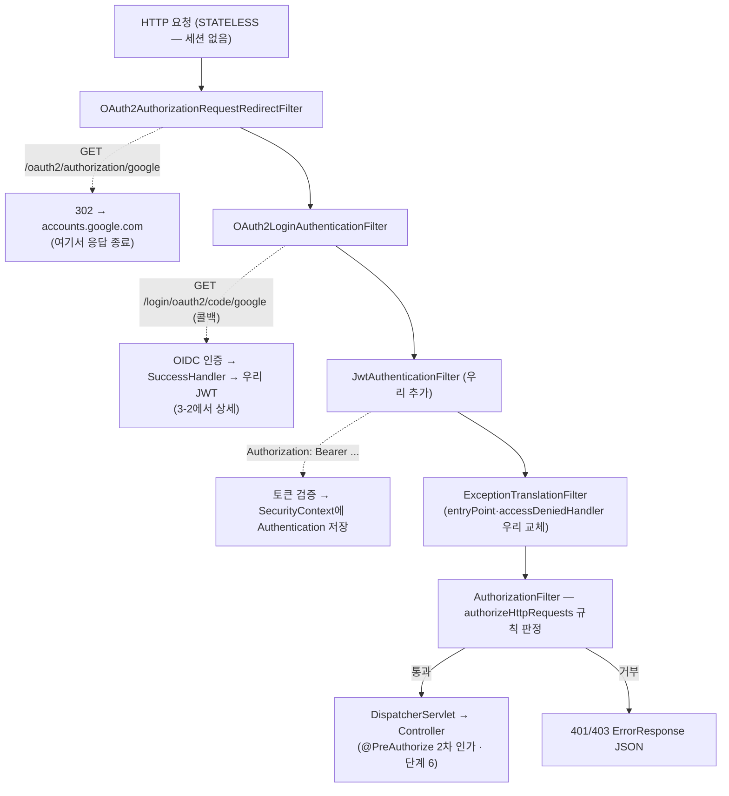
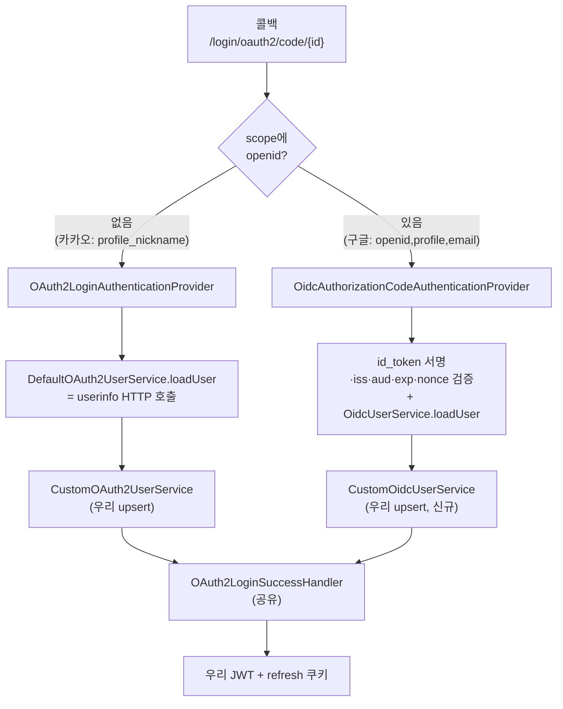

# OIDC — OAuth2 위의 인증 계층 (단계 9)

- **과정명**: 강의용 Spring Boot 게시판 — 단계 9 (OIDC 전환)
- **대상**: 단계 8(OAuth 표준화)을 마친 수강생
- **브랜치**: `step9-oidc`
- **관련 코드**: `auth/oauth2/CustomOidcUserService`(신규), `auth/oauth2/CustomOAuth2UserService`, `auth/oauth2/OAuth2LoginSuccessHandler`, `global/config/SecurityConfig`, `application.yaml`
- **선수 지식**: [OAUTH2-CLIENT.md](OAUTH2-CLIENT.md) — 특히 §5-5의 "openid 함정" 각주, [JWT-AUTH.md](JWT-AUTH.md) — 우리 JWT의 서명/검증 구조
- **검증 상태**: 전체 테스트 75개 green + 실 브라우저 E2E 확인 (2026-07-18)

---

## 학습 목표

이 문서를 끝내면 수강생은:

- 단계 8의 "openid를 넣으면 우리 서비스를 안 탄다" 함정을 **OIDC라는 별도 프로토콜의 존재로** 설명할 수 있다
- OAuth2(인가)와 OIDC(인증)의 관계를 "OAuth2 위의 인증 계층"으로 정확히 말할 수 있다
- id_token(외부 JWT)과 우리 access token(내부 JWT)이 **누가 서명하고 누가 검증하는지** 구분할 수 있다
- Spring Security가 openid scope 유무로 **담당 서비스를 바꿔 부르는** 지점을 안다
- OidcUser와 OAuth2User의 관계, `getName()`이 여전히 sub인 이유를 안다

---

## 한눈에 보기 — 3분 요약

바쁘면 이 섹션만 읽어도 된다. 상세는 §1부터.

**OIDC란**: 우리가 카카오/구글 "로그인"에 써 온 OAuth2는 원래 **인가(권한 위임)** 프로토콜이다 — "이 앱이 내 정보를 읽어도 된다"까지만 보장하고, "지금 온 사람이 누구인가"는 보장하지 않는다. OIDC(OpenID Connect)는 OAuth2 위에 얹은 **인증 계층**으로, 토큰 응답에 **id_token**(제공자가 서명한 JWT 신분증)을 하나 더 실어 보낸다. 우리는 그 서명을 검증하는 것만으로 "구글이 보증한 사용자 정보"를 별도 조회 없이 얻는다.

**우리의 구현** — 전부 3곳:

| 변경 | 파일 | 내용 |
|------|------|------|
| scope 1줄 | `application.yaml` | 구글 scope에 `openid` 추가 → 구글 로그인이 OIDC 경로로 전환 |
| 신규 1클래스 | `CustomOidcUserService` | 표준 `OidcUserService`에 위임해 검증된 id_token을 받고, 기존 `upsertUser`(find-or-create) 재사용 |
| 연결 1줄 | `SecurityConfig` | `.userInfoEndpoint`에 `.oidcUserService(...)` 추가 — 카카오(OAuth2)와 구글(OIDC) 병존 |

**처리 시퀀스** — 단계 8과 뼈대는 같고, ⑤~⑥(id_token 검증이 userinfo 조회를 대체)만 다르다:



핵심 한 줄: **구글에게 "누구인지 물어보러 가는"(userinfo HTTP 호출) 대신, 구글이 서명해 준 신분증(id_token)을 검증해서 읽는다.** 나머지(state 쿠키, upsert 정책, JWT 발급)는 단계 8에서 만든 그대로다.

---

## 1. 왜 OIDC인가 — 단계 8의 복선 회수

단계 8 §5-5의 마지막 함정에는 이런 각주가 있었다:

> **함정 — openid scope**: 구글 기본 scope에 `openid`가 있는데, 이걸 넣으면 **OIDC 경로**로 빠져 `OidcUserService`가 담당하게 되고 우리 `CustomOAuth2UserService`는 호출되지 않는다. 순수 OAuth2로 통일하려고 `scope: profile,email`만 명시했다. (OIDC 전환은 후속 주제)

그때 우리는 openid를 **일부러 뺐다**. "OIDC가 뭔지 아직 안 배웠으니 순수 OAuth2로 통일하자"는 유예였다. 이번 단계는 그 유예를 회수한다 — openid를 다시 넣고, 왜 담당자가 바뀌었는지, 그 새 담당자에 우리 로직을 어떻게 연결하는지를 배운다.

**용어 정리 — 자주 헷갈리는 지점**:

| 프로토콜 | 답하는 질문 | 표준 산출물 |
|----------|-------------|-------------|
| OAuth 2.0 | "이 클라이언트가 당신 리소스에 접근해도 되는가?" (**인가/authorization**) | access token |
| OIDC | "이 사람은 누구인가?" (**인증/authentication**) | id_token (+ access token) |

우리가 단계 7·8에서 카카오/구글로 **로그인**했을 때 실제로 쓴 것은 OAuth2였다 — "인가 프로토콜을 인증에 유용(流用)"한 것이다. 이 유용에는 흔한 실수가 뒤따른다(access token을 "그 사람이다"라는 증명으로 오해, userinfo 응답이 다른 사람 것일 가능성 등). OIDC는 그 유용을 **표준화**해 "인증에 쓰려면 이 규격을 지켜라"를 정한 계층이다.

> [!IMPORTANT]
> OIDC는 OAuth2를 대체하지 않는다. **OAuth2 위에 얹은 인증 계층**이다 — 토큰 교환 흐름은 동일하고, 응답에 서명된 사용자 정보(id_token)가 하나 더 실려 온다.

---

## 2. id_token이 바꾸는 것 — 세 개의 JWT를 구분하기

우리 프로젝트에는 지금 JWT가 **세 종류** 등장하게 됐다. 혼동하지 않는 것이 이 단계의 절반이다.

| JWT | 발급자 | 검증자 | 언제 살아 있나 | 담긴 내용 |
|-----|--------|--------|----------------|-----------|
| 우리 access token (단계 2·3) | 우리 서버 (`JwtTokenProvider`) | 우리 서버 (`JwtAuthenticationFilter`) | 로그인 후 1시간 | userId, role |
| 우리 refresh token (단계 4·5) | 우리 서버 | 우리 서버 (`AuthService.reissue`) | 14일 | subject=userId |
| **구글 id_token (단계 9)** | **구글** | **우리 서버가 구글 JWK로** | 로그인 처리 순간만 | sub, email, name, iss, aud, exp, nonce |

id_token은 **우리에게 새로운 개념이 아니다** — 단계 2에서 손으로 만들고 단계 3에서 표준화한 그 JWT 구조 그대로다. 다만 **누가 서명하느냐가 다르다**: 지금까지의 우리 JWT는 우리가 서명하고 우리가 검증했지만, id_token은 **구글이 서명**하고 우리는 구글이 공개한 **JWK**(JSON Web Key)로 서명을 검증한다. 이 차이가 곧 OIDC가 해결하는 문제 — "이 사용자 정보가 정말 구글에서 온 것인가"를 별도 HTTP 호출 없이 서명 하나로 증명할 수 있다.

**access token vs id_token — 순수 OAuth2와의 대비**:

| | 순수 OAuth2 (단계 8 카카오) | OIDC (단계 9 구글) |
|---|-----|-----|
| 사용자 정보를 얻는 법 | 토큰 교환 후 별도 HTTP 호출 (userinfo endpoint) | 토큰 응답에 id_token으로 이미 실려 옴 |
| 사용자 정보의 신뢰 근거 | "userinfo 응답이 카카오 서버에서 왔다"는 TLS 신뢰 | id_token의 **디지털 서명** |
| 토큰의 형식 | 불투명 문자열(opaque) — 카카오만 해석 | JWT — 누구나 파싱, 서명 검증만 하면 됨 |

**중요 — 우리가 검증을 안 짜도 되는 이유**: `OidcAuthorizationCodeAuthenticationProvider`(라이브러리)가 우리 `CustomOidcUserService.loadUser`를 호출하기 **전에** id_token의 **서명·iss(구글)·aud(우리 client_id)·exp·nonce**를 모두 검증해 둔다. loadUser가 호출된 시점에는 "검증 통과된 id_token이 여기 있다"가 보장된 상태다 — 우리는 claims에서 값만 꺼내면 된다. 단계 3에서 표준화의 이득을 논한 그 문법이 여기서도 동일하다.

> [!WARNING]
> **단, nonce 검증은 우리 저장소가 도와줘야 성립한다.** 라이브러리는 인가 요청에 담긴 nonce **원본**을 id_token의 nonce claim과 대조하는데, 그 원본은 `OAuth2AuthorizationRequest`의 attribute에 실려 있다. 우리는 그 요청을 세션이 아니라 **쿠키에 직접 직렬화**하므로(§4-3, `CookieOAuth2AuthorizationRequestRepository`), nonce attribute를 저장·복원 목록에 포함시키지 않으면 복원된 요청에 nonce가 없어진다. 그러면 라이브러리는 `if (requestNonce == null) return;`으로 **검증을 조용히 건너뛴다** — 로그인은 되지만 재사용/주입 방어선이 사라진다. 커스텀 저장소를 만든 대가로 우리가 떠안는 책임이며, 이 프로젝트는 nonce 필드를 저장 목록에 추가해 해결했다(§4-5).

---

## 3. 경로 분기 — openid scope 한 줄이 담당자를 바꾼다

### 3-1. 무대 — SecurityFilterChain 대략도

Provider 분기(3-2)가 일어나는 곳은 필터 체인 **안**이다. 먼저 요청이 지나는 필터 순서를 대략적으로 본다 — 표준 필터는 다 생략하고, 이 프로젝트가 **추가·교체한 것**과 OAuth 관련 필터만 남겼다. `SecurityConfig.securityFilterChain(...)` 하나가 이 체인을 조립한다.



읽는 법 — **한 요청은 자기 경로에서 처리되면 거기서 응답하고 끝난다**(점선 곁가지):

| 요청 | 처리 필터 | 결과 |
|------|-----------|------|
| `GET /oauth2/authorization/google` | `OAuth2AuthorizationRequestRedirectFilter` | 302 리다이렉트로 즉시 응답 — 뒤 필터 안 감 |
| 콜백 `GET /login/oauth2/code/google` | `OAuth2LoginAuthenticationFilter` | 인증 성공 시 SuccessHandler가 응답 (3-2) |
| 일반 API (`Bearer` 토큰) | `JwtAuthenticationFilter`가 컨텍스트만 채우고 통과 → `AuthorizationFilter`가 인가 판정 | 통과하면 컨트롤러, 아니면 401/403 |

핵심: **OAuth 로그인은 앞쪽 두 필터가, 로그인 이후의 모든 API는 우리 `JwtAuthenticationFilter`가** 담당한다. 즉 소셜 로그인의 최종 산출물(우리 JWT)이 이후 요청에서 이 체인의 주역이 되는 지점이 `JwtAuthenticationFilter`다. OAuth 필터들과 JwtAuthenticationFilter는 **같은 체인 안에 공존**하되 요청 URL에 따라 서로 다른 것이 발동한다.

### 3-2. 콜백 필터 내부 — openid로 UserService가 갈린다

위 그림의 `OAuth2LoginAuthenticationFilter`가 콜백을 받으면, 그 **내부**에서 토큰 응답의 scope에 `openid`가 있는지로 아래 두 경로가 갈린다:



**공유되는 것 / 나뉘는 것**:

| 컴포넌트 | 단계 8 (OAuth2) | 단계 9 (OIDC) |
|----------|-----------------|---------------|
| 콜백 필터 (`OAuth2LoginAuthenticationFilter`) | 공유 | 공유 |
| state 저장소 (`CookieOAuth2AuthorizationRequestRepository`) | 공유 | 공유 |
| 인증 Provider | `OAuth2LoginAuthenticationProvider` | `OidcAuthorizationCodeAuthenticationProvider` |
| 사용자 로딩 서비스 | `CustomOAuth2UserService` | **`CustomOidcUserService` (신규)** |
| SuccessHandler | 공유 | 공유 (`getName()`이 여전히 sub이므로 수정 없음) |
| FailureHandler | 공유 | 공유 |

즉 필터·저장소·핸들러는 그대로 두고, "사용자 로딩" 지점 한 곳에만 OIDC판 서비스를 하나 더 꽂으면 된다. `SecurityConfig`의 `.userInfoEndpoint(...)`가 **두 서비스를 동시에** 등록하는 그 조립 지점이다(§4-3).

---

## 4. 무엇을 바꿨나 — 전환 비용의 실측

단계 8 §5-5에서 구글 추가 비용을 실측했듯, 이번엔 "OAuth2 → OIDC 전환" 비용을 실측한다. **실제 diff 전부**:

### 4-1. yaml — scope 한 줄

```yaml
google:
  client-id: ${GOOGLE_CLIENT_ID}
  client-secret: ${GOOGLE_CLIENT_SECRET}
  # scope: profile,email  # 단계 9 처리에 의해 제거 — 단계 8은 openid를 빼서 OIDC 경로를 회피했었다
  scope: openid,profile,email
```

**교보재 포인트 — 왜 제거한 라인을 주석으로 남기나**: 지운 라인이 있던 자리에 "왜 여기서 무엇이 바뀌었는지"를 흔적으로 남겼다. 커밋 로그를 뒤지지 않아도 diff의 의미가 보인다. 이 프로젝트의 lecture 컨벤션이다 — 학습용이라 히스토리 자체가 교재이기 때문. 프로덕션 코드에서는 삭제가 정답이다.

### 4-2. `CustomOidcUserService` — 신규 1클래스

```java
@Service
@RequiredArgsConstructor
public class CustomOidcUserService implements OAuth2UserService<OidcUserRequest, OidcUser> {

  private final CustomOAuth2UserService customOAuth2UserService;

  // 표준 OidcUserService에 위임 — id_token 검증/userinfo 병합은 이쪽 몫
  private OAuth2UserService<OidcUserRequest, OidcUser> delegate = new OidcUserService();

  // 테스트 전용 — 실제 구글 호출 없이 delegate를 stub으로 교체
  void setDelegate(OAuth2UserService<OidcUserRequest, OidcUser> delegate) {
    this.delegate = delegate;
  }

  @Override
  @Transactional
  public OidcUser loadUser(OidcUserRequest userRequest) throws OAuth2AuthenticationException {
    OidcUser oidcUser = delegate.loadUser(userRequest);
    String registrationId = userRequest.getClientRegistration().getRegistrationId();
    // getAttributes() = id_token claims — 구글 userinfo와 같은 평면 sub/email/name이라 GOOGLE 분기 재사용
    customOAuth2UserService.upsertUser(registrationId, oidcUser.getAttributes());
    return oidcUser;
  }
}
```

**포인트 3개**:

- **상속 대신 위임(composition)** — 단계 8 `CustomOAuth2UserService`는 `DefaultOAuth2UserService`를 **extends**했지만 여기는 필드로 `OidcUserService`를 들고 있다. Oidc 쪽은 상속을 권장하지 않는 구조(final 여부/hook 부재)이고, 테스트에서 delegate를 갈아끼우기도 쉽다.
- **upsert 로직 재사용** — `CustomOAuth2UserService.upsertUser`가 이미 GOOGLE 분기(`sub`/`email`/`name`)를 갖고 있다(단계 8 §5-5). id_token claims가 구글 userinfo와 같은 평면 구조라 **완전히 그대로** 재사용된다. 그래서 upsert 정책 자체를 이 클래스에 다시 쓰지 않았다.
- **principal은 OidcUser 표준 타입 그대로** — 커스텀 principal을 만들지 않으므로 `getName()`은 표준값(sub)이 된다. 이 덕분에 `OAuth2LoginSuccessHandler`가 **한 줄도 바뀌지 않는다**(§4-4).

### 4-3. `SecurityConfig` — userInfoEndpoint 이중 연결

```java
.oauth2Login(oauth -> oauth
    .authorizationEndpoint(endpoint ->
        endpoint.authorizationRequestRepository(cookieAuthorizationRequestRepository))
    // .userInfoEndpoint(userInfo -> userInfo.userService(customOAuth2UserService))
    //   ↑ 단계 9 처리에 의해 제거 — 아래처럼 oidcUserService 연결을 추가하며 확장했다
    // 단계 9: 두 경로를 각각 연결 — 카카오(순수 OAuth2)는 userService,
    // 구글(openid scope → OIDC)은 oidcUserService가 담당한다. 정책은 같은 upsert로 수렴.
    .userInfoEndpoint(userInfo -> userInfo
        .userService(customOAuth2UserService)
        .oidcUserService(customOidcUserService))
    .successHandler(oAuth2LoginSuccessHandler)
    .failureHandler(oAuth2LoginFailureHandler))
```

`.userService(...)`와 `.oidcUserService(...)`는 **동시에 등록 가능**하다 — 어차피 라이브러리가 요청별로 openid 유무를 보고 하나만 호출한다(§3의 분기 그림). 결국 한 요청에는 둘 중 하나만 발동하므로 경쟁·순서 문제가 없다.

### 4-4. 건드리지 않은 것 — 그리고 그것이 왜 가능한가

| 컴포넌트 | 왜 안 바꿨나 |
|----------|--------------|
| `OAuth2LoginSuccessHandler` | `authentication.getName()`이 여전히 sub(=providerId) — OidcUser도 `getName()`이 sub이라 코드 경로 동일 |
| `AuthProvider` enum | GOOGLE 상수 이미 존재 (단계 8 §5-5). "OAuth2 구글"과 "OIDC 구글"은 **같은 제공자** — 프로토콜만 갈아탄 것 |
| DB 스키마 | (provider, providerId) = (GOOGLE, sub) — 값이 완전히 동일하므로 기존 구글 사용자가 **그대로 재로그인**된다 |
| 카카오 관련 코드/설정 | 카카오는 openid를 안 요청하므로 여전히 순수 OAuth2 경로 — 이 단계에서 손대지 않는다 |

**교보재 포인트 — 기존 사용자가 유지되는 것이 왜 강조되는가**: 만약 sub 값이 프로토콜 전환 후 달라졌다면, 단계 8에서 가입한 구글 사용자들이 **모두 새 계정으로 취급**되는 사고가 났을 것이다. OIDC 표준이 sub의 안정성(같은 사용자·같은 client에는 항상 같은 값)을 보장하기 때문에 무손실 전환이 가능하다. 테스트 `should_reuseExistingGoogleUser_whenOidcLogin`(§5)이 이 계약을 코드로 고정한다.

### 4-5. nonce 보강 — 커스텀 쿠키 저장소가 떠안는 숨은 책임

§4-1~4-3만으로 로그인은 성공한다. 그런데 실 E2E가 성공한 순간, 아무도 눈치채지 못한 구멍이 하나 열려 있었다: **id_token의 nonce 검증이 조용히 스킵되고 있었다.**

원인은 §2의 경고에 적은 대로다. `OidcAuthorizationCodeAuthenticationProvider`는 이렇게 검증한다:

```java
String requestNonce = authorizationRequest.getAttribute(OidcParameterNames.NONCE);
if (requestNonce == null) {
  return;   // ← 원본이 없으면 검증을 건너뛴다 (실패가 아니라 스킵)
}
String nonceHash = createHash(requestNonce);         // 원본을 SHA-256
if (!nonceHash.equals(idToken.getNonce())) { ...실패 }  // id_token claim과 대조
```

즉 검증의 기준값은 **인가 요청 attribute에 담긴 nonce 원본**이다. 세션 기본 저장소라면 이 attribute가 자동으로 보관되지만, 우리는 인가 요청을 **직접 골라 담은 필드만 쿠키에 직렬화**한다(단계 8 `StoredRequest` record — state/uri/clientId/redirectUri/scopes/registrationId 6개). nonce는 그 목록에 없었으므로, 콜백에서 복원된 요청에는 nonce attribute가 빠졌고, 라이브러리는 위 `if`문에서 곧장 `return` 했다.

수정은 저장 목록에 필드 하나를 더하는 것이다 — **추가 위주, 카카오(순수 OAuth2)는 무영향**:

```java
record StoredRequest(
    String state, String authorizationUri, String clientId,
    String redirectUri, Set<String> scopes, String registrationId,
    String nonce   // 단계 9 보강: OIDC에만 존재, 순수 OAuth2는 null
) {}

// save: 담을 때
authorizationRequest.getAttribute(OidcParameterNames.NONCE)   // 카카오면 null

// load: 복원할 때 — null이 아닐 때만 attribute로 되돌린다
if (stored.nonce() != null) {
  attrs.put(OidcParameterNames.NONCE, stored.nonce());
}
```

**교보재 포인트**: "표준 인터페이스를 구현하면 표준이 알아서 다 해준다"가 아니다. 세션→쿠키처럼 **저장 매체를 갈아끼우는 순간, 세션이 암묵적으로 실어 나르던 것(nonce attribute)까지 우리 책임**이 된다. 무엇을 저장 목록에서 빠뜨렸는지는 컴파일러도 테스트도(로그인은 되니까) 안 잡아준다 — 프로토콜을 알아야 보인다. 테스트 `should_preserveNonce_whenOidcRequestRoundTrips`가 이 회귀를 고정한다(§5).

---

## 5. 테스트 전략 — delegate stub과 오염 방지

`CustomOidcUserServiceTest`가 두 케이스로, `CookieOAuth2AuthorizationRequestRepositoryTest`가 nonce 왕복 두 케이스로 계약을 고정한다:

| 테스트 | 검증 내용 |
|--------|-----------|
| `should_upsertNewUser_whenFirstOidcLogin` | id_token claims → `upsertUser` 연결. getName()=sub, username=`google_{sub}`, email/nickname 매핑 |
| `should_reuseExistingGoogleUser_whenOidcLogin` | OAuth2 경로로 가입한 구글 사용자를 OIDC 경로가 **같은 계정**으로 재사용 (§4-4의 무손실 전환 보장) |
| `should_preserveNonce_whenOidcRequestRoundTrips` | OIDC 요청의 nonce 원본이 쿠키 save→load 왕복 후에도 attribute로 복원됨 (§4-5의 회귀 방어) |
| `should_haveNoNonceAttribute_whenPlainOAuth2RoundTrips` | 순수 OAuth2(카카오)에는 nonce가 없어야 함 — null을 attribute로 넣지 않는 것까지 고정 |

핵심 트릭은 **delegate 교체**다. 실제 `OidcUserService.loadUser`는 구글의 userinfo/JWK 엔드포인트를 진짜로 호출한다 — 단위 테스트에서 그럴 수 없다. 그래서 `CustomOidcUserService`에 package-private `setDelegate`를 두고 stub으로 갈아끼운다:

```java
@BeforeEach
void stubDelegate() {
  // 표준 OidcUserService라면 id_token 서명 검증 후 DefaultOidcUser를 만든다 — 그 결과만 흉내 낸다
  customOidcUserService.setDelegate(request ->
      new DefaultOidcUser(
          AuthorityUtils.createAuthorityList("OIDC_USER"), request.getIdToken()));
}

@AfterEach
void restoreDelegate() {
  // customOidcUserService는 캐시된 컨텍스트의 싱글톤 — stub을 남기면 다른 테스트가 오염된다
  customOidcUserService.setDelegate(new OidcUserService());
}
```

> **주의 — @AfterEach가 왜 필요한가**: `@SpringBootTest`는 컨텍스트를 **테스트 클래스 간에 캐시**한다(같은 설정이면 재사용). `customOidcUserService`는 그 컨텍스트의 싱글톤 빈이라, 테스트가 끝난 뒤 delegate가 stub인 채로 남으면 **다른 테스트 클래스가 그 stub을 상속받는다**. 그러면 뒤의 테스트가 실제 구글 호출을 기대하는데 stub 결과가 튀어나오거나, 이 클래스만 단독으로 돌릴 때는 통과하지만 전체 실행하면 실패하는 **재현이 어려운 오염**이 생긴다. 원상복구는 stub을 쓰는 쪽의 예의다.

**왜 실제 id_token을 만들지 않나**: delegate가 stub이므로 서명 검증은 안 일어난다. id_token은 값(sub/email/name 등 claim)만 채우면 되고, 서명은 아무 문자열이어도 된다. `OidcIdToken.withTokenValue("test-id-token")` 같이 되는 이유다. **검증은 계약(누가 담당하는가)**의 문제이지 이 테스트의 검증 대상은 아니다.

---

## 6. 단계 8 이후 작업 로드맵 — 무엇을 어떤 순서로

단계 8(OAuth 표준화)을 마친 뒤 이 게시판에서 진행했거나 진행할 인증 관련 작업 **전부**를, 코드를 짜는 순서대로 정리한다. 원칙은 단계 8·9 내내 지킨 두 가지다: **① 부품을 먼저 만들고 조립(SecurityConfig 연결)은 마지막에**(의존 역방향), **② 검증 코드(테스트)를 각 작업의 마지막에 함께 커밋**.

| 순서 | 작업 | 상태 | 성격 |
|------|------|------|------|
| A | 단계 9 — 구글 OIDC 전환 | ✅ 완료 | 프로토콜 전환 (추가 위주) |
| B | nonce 유실 보강 | ✅ 완료 | 보안 결함 수정 (A의 숨은 구멍) |
| C | `loadUser` 트랜잭션 경계 리팩터 | ⬜ 예정 | 성능/자원 (두 서비스 공통) |
| D | 카카오 OIDC 전환 | ⬜ 예정(연습 문제) | B까지의 지식 재적용 |

> [!IMPORTANT]
> A → B 순서는 **필연**이다. nonce 구멍(B)은 OIDC 경로(A)가 생겨야 존재하고, A의 실 E2E가 성공한 뒤에야 "되는데 뭔가 빠졌다"를 발견할 수 있었다. C·D는 A·B에 의존하지 않아 순서를 바꿔도 되지만, D(카카오)는 A에서 만든 `CustomOidcUserService`를 확장하므로 A 이후여야 한다.

### 작업 A — 구글 OIDC 전환 (완료). 코드 작성 순서

1. **`application.yaml`** — 구글 scope에 `openid` 추가 (기존 라인 주석 보존). 이 한 줄이 경로를 OIDC로 돌린다 → 컴파일 없이 바로 확인 가능한 출발점
2. **`CustomOidcUserService`** (신규) — 표준 `OidcUserService`에 위임 + 기존 `upsertUser` 재사용. **먼저 만들어야** 다음 단계에서 SecurityConfig가 이 빈을 주입받을 수 있다
3. **`SecurityConfig`** — `.userInfoEndpoint`에 `.oidcUserService(...)` 연결 (조립은 여기서 마지막). 2가 없으면 컴파일 실패하므로 순서 고정
4. **`CustomOidcUserServiceTest`** (신규) — delegate stub으로 계약 고정

### 작업 B — nonce 유실 보강 (완료). 코드 작성 순서

§4-5의 수정을 실제 적용한 순서. 한 클래스(`CookieOAuth2AuthorizationRequestRepository`) 안에서 완결된다:

1. **`StoredRequest` record에 `nonce` 필드 추가** — 저장 스키마를 먼저 넓힌다 (record라 이 순간 save/load에 컴파일 에러가 나서, 다음 두 곳을 반드시 고치게 강제된다 — 빠뜨림 방지)
2. **`saveAuthorizationRequest`** — `authorizationRequest.getAttribute(OidcParameterNames.NONCE)`를 담는다 (카카오면 자연히 null)
3. **`loadAuthorizationRequest`** — 복원 시 `nonce != null`일 때만 attribute로 되돌린다
4. **테스트 2개** (`CookieOAuth2AuthorizationRequestRepositoryTest`) — OIDC 왕복 보존 + 순수 OAuth2 null 유지

### 작업 C — `loadUser`의 `@Transactional` 안에서 원격 HTTP 호출 (예정)

`CustomOidcUserService.loadUser`도, 단계 8의 `CustomOAuth2UserService.loadUser`도 **같은 패턴**의 문제가 있다:

```java
@Override
@Transactional
public OidcUser loadUser(OidcUserRequest userRequest) {
  OidcUser oidcUser = delegate.loadUser(userRequest);   // ← 트랜잭션 안에서 원격 HTTP 호출
  customOAuth2UserService.upsertUser(...);              // ← 실제 DB 작업은 여기부터
  return oidcUser;
}
```

DB 커넥션을 **HTTP 응답 대기 시간 내내 쥐고 있는** 셈이라 커넥션 풀 관점에서 낭비다. 원격 호출을 트랜잭션 밖으로 꺼내는 리팩터가 필요하지만, **두 클래스가 완전히 같은 패턴**이라 개별로 고치면 diff가 두 배가 된다. 두 클래스를 묶어 한 번에 처리하는 것이 낫다는 판단으로 **후속 처리로 미뤘다**.

**코드 작성 순서(예정)**: ① `upsertUser`만 `@Transactional`로 승격 → ② `CustomOAuth2UserService.loadUser`/`CustomOidcUserService.loadUser`의 클래스 레벨 `@Transactional` 제거(원격 호출을 트랜잭션 밖으로) → ③ self-invocation 프록시 우회 문제 확인(같은 빈 내부 호출은 프록시를 안 타므로 `upsertUser`가 별도 빈이거나 `TransactionTemplate`이어야 실제로 적용됨) → ④ 두 서비스의 기존 테스트가 여전히 green인지 + 롤백 동작 테스트 추가.

### 작업 D — 카카오 OIDC 전환 (예정, 연습 문제)

카카오도 OIDC를 지원한다. 공식 discovery(`https://kauth.kakao.com/.well-known/openid-configuration`)로 확인한 실제 값:

| 항목 | 값 | 구글과의 대비 |
|------|-----|--------------|
| issuer | `https://kauth.kakao.com` | `issuer-uri`만 주면 아래 엔드포인트가 자동 구성됨 |
| jwks_uri | `https://kauth.kakao.com/.well-known/jwks.json` | 구글은 내장, 카카오는 명시(또는 issuer-uri) 필요 |
| id_token claims | `sub, nickname, picture, email` (**평면**) | 놀랍게도 **구글과 같은 평면 구조** |

> [!TIP]
> 핵심 발견: 카카오 **순수 OAuth2**의 userinfo는 중첩(`kakao_account.email`, `kakao_account.profile.nickname`)이지만, 카카오 **OIDC id_token**은 `sub`/`nickname`/`email` **평면**이다. 즉 `extractUserInfo`의 기존 KAKAO 분기(중첩 파싱)는 OIDC 경로에서 **그대로 쓸 수 없다** — 여기가 이 연습 문제의 진짜 함정이다.

**코드 작성 순서(예정)**:

1. **카카오 디벨로퍼 콘솔** — OpenID Connect 활성화 (id_token 발급 스위치). 코드 밖 선행 조건
2. **`application.yaml`** — 카카오 registration scope에 `openid` 추가 + provider 블록에 `issuer-uri: https://kauth.kakao.com` 추가(또는 `jwk-set-uri` 직접 기술). 기존 라인은 주석 보존
3. **`CustomOAuth2UserService.extractUserInfo`** — 문제의 핵심. 방법 두 가지 중 택1:
   - (a) KAKAO 분기가 중첩/평면 **둘 다** 처리하도록 방어적으로 확장 (`kakao_account`가 있으면 중첩, 없으면 평면)
   - (b) `AuthProvider`에 별도 취급을 두지 않고, OIDC 경로 전용 정규화를 `CustomOidcUserService` 쪽에서 흡수
   추가 위주 원칙상 (a)가 자연스럽고, 카카오 OAuth2·OIDC 두 경로를 병행 지원하게 된다
4. **`CustomOidcUserService`** — registrationId가 "kakao"여도 그대로 동작하는지 확인. §3 분기상 이미 모든 OIDC 요청을 받으므로 **수정이 없을 가능성**이 높다(3의 extractUserInfo만 맞으면 됨)
5. **테스트** — 카카오 OIDC claims(평면)로 upsert 검증 + 기존 카카오 OAuth2 사용자와 **같은 계정 유지**(sub=회원번호 안정성) 확인 + nonce 왕복(B의 테스트가 카카오에도 성립하는지)
6. **verify.sh + 실 E2E** — §4-4의 무손실 전환이 카카오에도 성립하는지가 최종 검수 포인트

수강생이 **혼자 해볼 수 있는 크기**다 — A·B에서 배운 절차를 그대로 재적용하되, 3의 claims 구조 차이 하나가 "제공자별 차이는 `extractUserInfo` 한 곳에 모은다"는 단계 8 설계가 실제로 값을 하는지 시험한다.

---

## 7. 파일 요약

| 파일 | 변경 | 역할 |
|------|------|------|
| `auth/oauth2/CustomOidcUserService` | 신규 | OIDC 경로 사용자 로딩 (delegate 위임 + upsert 재사용) |
| `auth/oauth2/CustomOAuth2UserService` | 무변경 | `upsertUser` 그대로 재사용 (GOOGLE 분기 이미 존재) |
| `auth/oauth2/OAuth2LoginSuccessHandler` | 무변경 | `getName()`=sub 계약 덕에 수정 없음 |
| `global/config/SecurityConfig` | 3줄 수정 | `.userInfoEndpoint`에 `.oidcUserService(...)` 추가 (기존 `.userService(...)`와 병렬) |
| `application.yaml` | 1줄 수정 | 구글 scope에 `openid` 추가 (기존 라인은 주석 흔적으로 보존) |
| `auth/oauth2/CookieOAuth2AuthorizationRequestRepository` | 수정 (작업 B) | `StoredRequest`에 `nonce` 필드 추가 — OIDC nonce 검증 스킵 방지 (§4-5) |
| `test/.../CustomOidcUserServiceTest` | 신규 | delegate stub으로 id_token claims → upsert 계약 검증 (2 케이스) |
| `test/.../CookieOAuth2AuthorizationRequestRepositoryTest` | 2 케이스 추가 (작업 B) | nonce 왕복 보존 / 순수 OAuth2 null 유지 |

---

## 8. 핵심 요약 한 장

> [!IMPORTANT]
> OIDC는 OAuth2 위에 얹은 **인증 계층** — 토큰 응답에 서명된 id_token(JWT)이 함께 오고,
> Spring Security는 openid scope 유무로 사용자 로딩 서비스를 다르게 부른다.

| 구분 | 내용 |
|------|------|
| 왜 필요한가 | OAuth2는 인가 프로토콜인데 우리는 인증에 유용해 왔다 — OIDC가 그 유용을 표준화 |
| 무엇이 다른가 | access token(불투명, userinfo 조회 필요) vs id_token(JWT, 사용자 정보 내장 + 구글 서명) |
| 검증은 누가 | 라이브러리(`OidcAuthorizationCodeAuthenticationProvider`)가 loadUser 호출 전에 서명·iss·aud·exp·nonce 완료 |
| 우리가 만든 것 | `CustomOidcUserService` 1클래스 — 표준 `OidcUserService`에 위임 후 `CustomOAuth2UserService.upsertUser` 재사용 |
| 전환 비용 | yaml scope 1줄 + 신규 1클래스 + SecurityConfig 1줄 — sub 동일하므로 기존 구글 사용자 무손실 |
| 여전히 남은 것 | loadUser @Transactional 안 원격 호출(두 서비스 공통), 카카오 OIDC 전환(연습 문제) |

---

## 부록. 자주 나오는 질문 (FAQ)

| 질문 | 답변 요약 |
|------|-----------|
| id_token만 있으면 access token은 필요 없나? | 응답에는 여전히 함께 온다. id_token은 "이 사람이 누구다"용, access token은 "구글 API를 계속 호출"용. 우리는 로그인 순간의 사용자 정보만 필요해 access token은 즉시 버린다(카카오 때와 동일). |
| nonce는 뭔가? | 인가 요청 시 라이브러리가 심고 id_token claims에서 되돌려 받는 난수. state가 콜백 위조(CSRF)를 막듯, nonce는 **id_token 재사용/주입**을 막는다. 검증 로직은 라이브러리가 갖고 있지만, 우리처럼 인가 요청을 쿠키에 직접 저장하는 경우 **nonce 원본을 저장·복원해 주지 않으면 검증이 스킵된다**(§4-5) — 세션 기본 저장소를 쓰면 자동이지만 STATELESS라 우리가 책임진다. |
| 왜 카카오는 안 바꿨나? | 카카오도 OIDC를 지원하지만 이번 단계는 "두 프로토콜의 대비"가 학습 목표다. 카카오는 순수 OAuth2로 남겨야 §3의 분기가 실제로 갈리는 것을 코드 하나로 관찰할 수 있다. 카카오 OIDC 전환은 §6-2의 연습 문제. |
| OidcUser와 OAuth2User의 관계는? | `OidcUser extends OAuth2User`. 즉 OidcUser는 OAuth2User가 갖는 attributes/getName()에 더해 `getIdToken()`, `getClaims()`, `getUserInfo()`를 추가로 갖는다. 그래서 `getName()`이 여전히 동작하고 SuccessHandler가 수정 없이 재사용된 것. |
| id_token 서명 검증에 실패하면 어디로 가나? | `OAuth2LoginFailureHandler`(단계 8) — 우리 loadUser는 호출되지도 않는다. 실패 사유(예: `invalid_id_token`)는 서버 로그에 남고 클라이언트에는 `OAUTH_LOGIN_FAILED` 401 하나로 응답. |
| yaml에서 provider 블록을 안 쓰는데 구글의 JWK URL은 어디서 오나? | `CommonOAuth2Provider.GOOGLE`이 구글의 discovery(`.well-known/openid-configuration`) 정보를 내장하고 있어 `jwk-set-uri`가 자동 세팅된다. 카카오 OIDC를 하려면(§6-2) 이 값을 provider 블록에 직접 써야 한다. |
| 왜 상속(extends OidcUserService) 대신 위임인가? | Oidc 쪽 서비스는 상속을 가정한 hook을 노출하지 않는다(단계 8 `CustomOAuth2UserService`가 상속한 `DefaultOAuth2UserService`와 대비). 위임이 표준 조언이고, 테스트에서 delegate만 갈아끼우면 되므로 stub 짜기도 쉽다(§5). |
