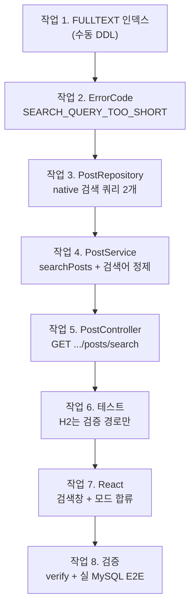

# 단계 17 따라하기 — 게시글 검색 구현 (파일별·작업 순서별)

> [[POST-SEARCH-LAB]]에서 실측으로 확보한 증거(LIKE 4,626ms → MATCH 7.15ms)를
> 코드로 옮긴다. 단계 16([[DB-PERFORMANCE-WALKTHROUGH]])에서 만든 부품 —
> `PostCursorResponse`, keyset 커서 계약, 지연 조인 2단계, React 무한스크롤 —
> 를 **최대한 재사용**하는 것이 이 단계의 설계 철학이다. 이 문서만으로 전 과정이
> 재현되도록 모든 코드 전문을 실었다.

---

## 0. 작업 지도 — 무엇을 어떤 순서로



| 순서 | 작업 | 이 순서인 이유 |
|------|------|----------------|
| 1 | FULLTEXT 인덱스 (수동 DDL) | 인덱스 없이는 MATCH가 에러 — 모든 것의 전제. **JPA로 선언 불가라 유일하게 DDL이 먼저인 단계** |
| 2 | ErrorCode 추가 | 서비스가 던질 에러부터 |
| 3 | 리포지토리 native 쿼리 | 서비스가 쓸 재료. JPQL에 없는 MATCH를 native로 |
| 4 | 서비스 — 정제 + 지연 조인 | 검색어 방어선(이 단계의 심장)과 조립 |
| 5 | 컨트롤러 | 파라미터 바인딩만 — 얇게 |
| 6 | 테스트 | H2 한계 때문에 "무엇을 어디서 검증하나"의 전략 결정 포함 |
| 7 | React | 검증된 API 위에 검색창 |
| 8 | 검증 | verify.sh → 실 MySQL curl → 브라우저 순으로 바깥쪽까지 |

진행 체크리스트:

- [ ] 작업 1 — FULLTEXT 인덱스 → `SHOW INDEX`에 `ft_posts_title_content`
- [ ] 작업 2 — ErrorCode → 컴파일
- [ ] 작업 3 — native 검색 쿼리 2개 → 컴파일
- [ ] 작업 4 — searchPosts + toBooleanQuery → 컴파일
- [ ] 작업 5 — `GET .../posts/search` → `./gradlew build`
- [ ] 작업 6 — 검증 경로 테스트 4개 → `--tests PostServiceTest`
- [ ] 작업 7 — 검색창 → `npm run build`
- [ ] 작업 8 — verify.sh + 실 MySQL 검색 E2E + 브라우저

---

## 작업 1. FULLTEXT 인덱스 — 코드보다 DDL이 먼저인 유일한 단계

로컬 mysql-8에서 (운영 반영은 작업 8 뒤 배포 절차에서):

```sql
ALTER TABLE posts ADD FULLTEXT INDEX ft_posts_title_content (title, content) WITH PARSER ngram, ALGORITHM=COPY;
```

- `ALGORITHM=COPY`는 MySQL 8.0.33의 ADD FULLTEXT 결함 우회 — 재현·전말은
  [[POST-SEARCH-LAB]] §3. 실측 26.5초(100만 건).
- `@Table(indexes = @Index(...))`로는 FULLTEXT를 선언할 수 없다(일반 B-tree만
  생성됨). 단계 16의 "인덱스도 코드가 정본" 원칙의 **첫 예외** — 실무라면 이
  DDL을 Flyway 같은 마이그레이션 도구가 버전 관리한다.
- `ddl-auto: update`는 이 인덱스를 모른 채 지나가므로(선언이 없으니 만들지도
  지우지도 않음) 앱과 충돌하지 않는다.

**체크포인트**:

```sql
SHOW INDEX FROM posts WHERE Key_name = 'ft_posts_title_content';
```

`Index_type = FULLTEXT` 행 2개(title, content)면 성공.

---

## 작업 2. `ErrorCode` — 검색어 거부 코드

`src/main/java/com/example/board/global/exception/ErrorCode.java` 의
`INVALID_INPUT` 아래에 추가:

```java
// 단계 17: 검색 — ngram_token_size=2라 1글자 검색어는 색인에 대조할 토큰이 없어
// 항상 0건이다. 조용한 빈 결과 대신 명시적으로 거부한다(연산자 제거 후 기준).
SEARCH_QUERY_TOO_SHORT(HttpStatus.BAD_REQUEST, "검색어는 2글자 이상이어야 합니다."),
```

[[POST-SEARCH-LAB]] §5-1에서 실측한 "1글자는 항상 0건"의 API 레벨 방어선이다.

**체크포인트**: 컴파일.

---

## 작업 3. `PostRepository` — native 검색 쿼리 2개

`MATCH ... AGAINST`는 **JPQL에 없다.** native로 내려가는데, native에서는
`@EntityGraph`도 못 쓴다 — board·author 로딩이 문제다. 해법은 단계 16 작업 9의
**지연 조인 패턴 재사용**: 여기서는 id만 뽑고, 엔티티 로딩은 이미 있는
`findWithBoardAndAuthorByIdIn`이 맡는다. native의 한계가 오히려 더 좋은 구조를
강제한 셈이다.

```java
// ── 단계 17: 게시글 검색 (FULLTEXT + ngram) ──────────────────────────────────
// MATCH AGAINST는 JPQL에 없어 native로 내려간다. native에서는 @EntityGraph를 못
// 쓰므로 작업 9의 지연 조인 패턴을 재사용한다 — 여기서는 id만 뽑고(1단계), 엔티티
// 로딩은 위의 findWithBoardAndAuthorByIdIn(2단계)이 맡는다. 정렬·커서 조건은
// keyset 쿼리(작업 2)와 동일 계약이라 PostCursorResponse를 그대로 재사용할 수 있다.
// 전제: ft_posts_title_content FULLTEXT 인덱스(수동 DDL — POST-SEARCH.md §4-3).
@Query(value = "select p.id from posts p "
    + "where p.board_id = :boardId "
    + "and match(p.title, p.content) against(:query in boolean mode) "
    + "order by p.created_at desc, p.id desc limit :limit", nativeQuery = true)
List<Long> searchIdsByBoardId(
    @Param("boardId") Long boardId, @Param("query") String query, @Param("limit") int limit);

// 검색 다음 페이지 — keyset 커서 조건을 native로 복제(동일 시각 동률은 id로 확정).
@Query(value = "select p.id from posts p "
    + "where p.board_id = :boardId "
    + "and match(p.title, p.content) against(:query in boolean mode) "
    + "and (p.created_at < :lastCreatedAt "
    + "or (p.created_at = :lastCreatedAt and p.id < :lastId)) "
    + "order by p.created_at desc, p.id desc limit :limit", nativeQuery = true)
List<Long> searchIdsByBoardIdAfterCursor(
    @Param("boardId") Long boardId,
    @Param("query") String query,
    @Param("lastCreatedAt") LocalDateTime lastCreatedAt,
    @Param("lastId") Long lastId,
    @Param("limit") int limit);
```

JPQL 버전과의 차이를 눈여겨보라 — 테이블명(`posts`)·컬럼명(`board_id`,
`created_at`)이 **DB 물리 이름**이다. native는 엔티티 세계 밖의 문장이다.

**체크포인트**: `./gradlew compileJava`.

---

## 작업 4. `PostService` — 검색어 정제가 이 단계의 심장

```java
// 단계 17: BOOLEAN MODE의 검색 문법 문자들. 사용자는 "포함 검색"을 원하는 것이지
// 검색 연산자를 쓰는 게 아니므로 전부 데이터가 아닌 잡음으로 취급해 제거한다
// — 미검증 입력이 그대로 against()에 들어가면 문법 오류(500)나 의도치 않은
// 제외 검색(-단어)이 된다. LAB의 "죽일 수 없는 쿼리" 방어선이기도 하다.
private static final Pattern BOOLEAN_SYNTAX = Pattern.compile("[+\\-><()~*\"@]");

// 단계 17: 게시글 검색 — FULLTEXT(ngram) + keyset. 응답·커서 계약은
// getPostsByCursor와 동일해서 프론트 무한스크롤 코드가 그대로 재사용된다.
@Transactional(readOnly = true)
public PostCursorResponse searchPosts(
    Long boardId, String query, LocalDateTime lastCreatedAt, Long lastId, int size) {
  if (!boardRepository.existsById(boardId)) {
    throw new NotFoundException(ErrorCode.BOARD_NOT_FOUND);
  }
  String booleanQuery = toBooleanQuery(query);
  int limit = size + 1;
  List<Long> ids = (lastCreatedAt == null || lastId == null)
      ? postRepository.searchIdsByBoardId(boardId, booleanQuery, limit)
      : postRepository.searchIdsByBoardIdAfterCursor(
          boardId, booleanQuery, lastCreatedAt, lastId, limit);
  if (ids.isEmpty()) {
    return PostCursorResponse.of(List.of(), size);
  }
  // 지연 조인 2단계 + 순서 복원 — id 목록(size+1 포함)을 그대로 엔티티로 바꿔
  // PostCursorResponse.of에 넘기면 hasNext 판정과 트리밍까지 기존 로직이 처리한다.
  Map<Long, Post> postsById = postRepository.findWithBoardAndAuthorByIdIn(ids).stream()
      .collect(Collectors.toMap(Post::getId, Function.identity()));
  List<Post> ordered = ids.stream().map(postsById::get).toList();
  return PostCursorResponse.of(ordered, size);
}

// 검색어 정제 3단계: ① 연산자 제거 ② 2글자 미만 토큰 제외(ngram_token_size=2
// 미만은 색인에 없어, AND에 끼면 전체를 0건으로 만든다) ③ 남은 토큰마다 +를 붙여
// "모두 포함(AND)" 의미로 통일 — 연산자 없는 BOOLEAN MODE는 토큰이 선택 사항이라
// OR처럼 동작해 버리기 때문. 살아남은 토큰이 없으면 명시적으로 거부한다(400).
private String toBooleanQuery(String query) {
  String cleaned = query == null ? "" : BOOLEAN_SYNTAX.matcher(query).replaceAll(" ");
  List<String> tokens = Arrays.stream(cleaned.trim().split("\\s+"))
      .filter(token -> token.length() >= 2)
      .toList();
  if (tokens.isEmpty()) {
    throw new BusinessException(ErrorCode.SEARCH_QUERY_TOO_SHORT);
  }
  return tokens.stream().map(token -> "+" + token).collect(Collectors.joining(" "));
}
```

(import 추가: `java.util.Arrays`, `java.util.regex.Pattern` — Map·Function·
Collectors는 작업 9 때 이미 있다.)

`toBooleanQuery`가 지키는 것 세 가지:

1. **문법 주입 차단** — `+`, `-`, `"` 같은 BOOLEAN 연산자가 사용자 입력에 섞이면
   SQL 에러(500)나 "제외 검색"으로 둔갑한다. 전부 제거해 데이터로만 취급.
2. **1글자 토큰 배제** — `+가 +검색` 처럼 색인에 없는 토큰이 AND에 끼면 **전체가
   0건**이 된다. 걸러내고, 남는 게 없으면 400.
3. **AND 의미론 강제** — 연산자 없는 BOOLEAN MODE는 토큰이 "있으면 가점"이라
   OR처럼 동작한다. `+`를 붙여 "모두 포함"으로 통일 — 게시판 검색의 기대와 일치.

**체크포인트**: 컴파일.

---

## 작업 5. `PostController` — 검색 엔드포인트

`/posts/cursor` 아래에 추가:

```java
// 단계 17: 게시판 내 검색(FULLTEXT + ngram) — 커서·size 규칙은 /posts/cursor와
// 동일 계약이라 응답(PostCursorResponse)도 프론트 무한스크롤 코드도 재사용된다.
// 검색어 검증(2글자 미만 400)은 정제 후 판단해야 하므로 서비스의 몫.
@GetMapping("/boards/{boardId}/posts/search")
public PostCursorResponse searchPosts(
    @PathVariable Long boardId,
    @RequestParam String query,
    @RequestParam(required = false)
    @DateTimeFormat(iso = DateTimeFormat.ISO.DATE_TIME) LocalDateTime lastCreatedAt,
    @RequestParam(required = false) Long lastId,
    @RequestParam(defaultValue = "20") int size) {
  if (size < 1 || size > 100) {
    throw new BusinessException(ErrorCode.INVALID_INPUT);
  }
  return postService.searchPosts(boardId, query, lastCreatedAt, lastId, size);
}
```

- `query`는 `required = true`(기본) — 누락 시 `MISSING_PARAMETER`(400)로 기존
  전역 예외 처리에 잡힌다.
- 보안 설정 무변경: `GET /api/v1/boards/**` permitAll 승계 — 비로그인 검색 가능.

**체크포인트**: `./gradlew build` 전체 통과.

---

## 작업 6. 테스트 — H2 한계와 검증 전략의 분할

**함정**: H2에는 ngram FULLTEXT가 없다 — native `MATCH AGAINST`는 H2 테스트에서
실행조차 안 된다([[POST-SEARCH]] 함정 ⑤). 전략 결정:

| 검증 대상 | 어디서 | 근거 |
|-----------|--------|------|
| 검색어 정제·거부(400), 게시판 404 | **H2 단위 테스트** | native 쿼리에 도달하기 **전에** 끝나는 경로 |
| MATCH 실행·커서 이어받기·정렬 | **실 MySQL E2E** (작업 8) | FULLTEXT가 실존하는 곳에서만 의미 있는 검증 |

`PostServiceTest`에 추가:

```java
// ── 단계 17: 검색 — 검증 경로만 H2로 테스트한다 ─────────────────────────────
// MATCH AGAINST(ngram FULLTEXT)는 H2에 없어 실행 경로는 실 MySQL E2E로 검증한다
// (POST-SEARCH.md 함정 ⑤의 전략 결정). 아래는 native 쿼리에 도달하기 전에
// 끝나는 경로들 — 검색어 정제·거부와 게시판 존재 검증.

@Test
void should_rejectSearch_whenQueryTooShort() {
  assertThatThrownBy(() -> postService.searchPosts(board.getId(), "성", null, null, 20))
      .isInstanceOf(BusinessException.class)
      .extracting(e -> ((BusinessException) e).getErrorCode())
      .isEqualTo(com.example.board.global.exception.ErrorCode.SEARCH_QUERY_TOO_SHORT);
}

// BOOLEAN MODE 연산자만으로 이뤄진 검색어 — 제거하고 나면 남는 토큰이 없어야 거부
@Test
void should_rejectSearch_whenQueryIsOnlyBooleanOperators() {
  assertThatThrownBy(() -> postService.searchPosts(board.getId(), "+-\"*()", null, null, 20))
      .isInstanceOf(BusinessException.class)
      .extracting(e -> ((BusinessException) e).getErrorCode())
      .isEqualTo(com.example.board.global.exception.ErrorCode.SEARCH_QUERY_TOO_SHORT);
}

// 1글자 토큰들만 있는 검색어("가 나 다")도 전부 걸러져 거부되어야 한다
@Test
void should_rejectSearch_whenAllTokensShorterThanNgram() {
  assertThatThrownBy(() -> postService.searchPosts(board.getId(), "가 나 다", null, null, 20))
      .isInstanceOf(BusinessException.class)
      .extracting(e -> ((BusinessException) e).getErrorCode())
      .isEqualTo(com.example.board.global.exception.ErrorCode.SEARCH_QUERY_TOO_SHORT);
}

@Test
void should_throwNotFound_whenSearchOnMissingBoard() {
  assertThatThrownBy(() -> postService.searchPosts(999999L, "성능실습", null, null, 20))
      .isInstanceOf(NotFoundException.class);
}
```

**체크포인트**: `./gradlew test --tests PostServiceTest`.

---

## 작업 7. React — 검색창과 모드 합류

### 7-1. `frontend/src/api.js`

```js
// 단계 17: 게시판 내 검색(FULLTEXT) — 커서 계약은 getPostsByCursor와 동일.
export async function searchPosts(boardId, query, cursor = null, size = 20) {
  const params = new URLSearchParams({ query, size });
  if (cursor) {
    params.set("lastCreatedAt", cursor.lastCreatedAt);
    params.set("lastId", cursor.lastId);
  }
  return jsonFetch(`/api/v1/boards/${boardId}/posts/search?${params}`);
}
```

### 7-2. `frontend/src/components/Posts.jsx` — 하이브리드에 검색 모드 추가

설계: 검색어가 제출되면 **검색 모드**로 전환 — 목록이 검색 결과로 바뀌고,
무한스크롤은 그대로 동작하되 **페이지 바는 숨긴다**(`totalPages = 0`). 검색
API는 COUNT를 세지 않으므로 "몇 페이지 중 몇 번째"라는 개념이 없기 때문이다
(의도된 트레이드오프 — [[POST-SEARCH]] §4-2).

상태·ref 추가:

```jsx
const [searchInput, setSearchInput] = useState(""); // 검색창 입력값
const [activeQuery, setActiveQuery] = useState(""); // 제출된 검색어 ("" = 일반 목록 모드)
// 검색어도 observer 콜백에서 읽으므로 ref로 함께 보관(stale closure 회피)
const activeQueryRef = useRef("");
```

검색 첫 페이지(세대 가드는 점프와 동일 원리):

```jsx
// 단계 17: 검색 첫 페이지 — 목록을 검색 결과로 교체하고 커서를 잇는다.
// 검색 모드에서는 페이지 바를 숨긴다(totalPages=0) — 검색 API는 COUNT를 세지
// 않으므로 "몇 페이지 중 몇 번째"라는 개념 자체가 없다. 무한스크롤만 남는다.
const searchFirst = useCallback(async (query) => {
  const gen = ++genRef.current;
  setStatus("검색 중…");
  try {
    const data = await searchPosts(board.id, query, null, PAGE_SIZE);
    if (genRef.current !== gen) return;
    setPageBlocks([{ no: 1, items: data.items }]);
    setTotalPages(0);
    setCurrentPage(1);
    cursorRef.current = data.hasNext
      ? { lastCreatedAt: data.lastCreatedAt, lastId: data.lastId }
      : null;
    setHasNext(data.hasNext);
    setStatus(data.items.length === 0 ? "검색 결과가 없습니다." : "");
    window.scrollTo({ top: 0 });
  } catch (err) {
    // 2글자 미만(400) 등 서버 검증 메시지를 그대로 보여준다
    if (genRef.current === gen) setStatus(err.message);
  }
}, [board.id]);
```

`loadMore`는 한 함수가 두 모드를 겸한다 — 커서 계약이 같아서 가능한 재사용:

```jsx
const data = activeQueryRef.current
  ? await searchPosts(board.id, activeQueryRef.current, cursor, PAGE_SIZE)
  : await getPostsByCursor(board.id, cursor, PAGE_SIZE);
```

제출·해제 핸들러와 UI(검색창은 toolbar 아래):

```jsx
function handleSearch(e) {
  e.preventDefault();
  const q = searchInput.trim();
  if (!q) return;
  activeQueryRef.current = q;
  setActiveQuery(q);
  searchFirst(q);
}

function clearSearch() {
  activeQueryRef.current = "";
  setActiveQuery("");
  setSearchInput("");
  jumpToPage(1);
}
```

```jsx
{/* 단계 17: 게시판 내 검색 — 제출 시 목록이 검색 결과로 바뀐다 */}
<form className="search-bar" onSubmit={handleSearch}>
  <input
    placeholder="제목·내용 검색 (2글자 이상)"
    value={searchInput}
    onChange={(e) => setSearchInput(e.target.value)}
  />
  <button className="btn primary">검색</button>
  {activeQuery && (
    <button type="button" className="btn" onClick={clearSearch}>해제</button>
  )}
</form>
{activeQuery && <div className="status">“{activeQuery}” 검색 결과 (최신순)</div>}
```

게시판 변경 effect에서 검색 모드 해제, 새로고침 버튼은 모드에 따라
`searchFirst(activeQuery)` / `jumpToPage(1)` 분기. `styles.css`에 `.search-bar`
추가(전체는 소스 참조 — 부록 커밋).

**체크포인트**: `cd frontend && npm run build`.

---

## 작업 8. 검증 — 그리고 검증 중에 밟은 실전 함정 두 개

**① verify.sh** — 빌드 + 전체 테스트(H2) + 실기동: PASSED.

**② 실 MySQL(100만 건 + FT 인덱스) curl E2E** — 검색·커서·거부 경로.

여기서 함정 두 개를 실제로 밟았다. 그대로 기록한다:

**함정 A — "0건인데 왜?"**: `boards/1`에서 `731942`를 검색해 0건이 나왔다. 버그가
아니었다 — n=731942 더미는 `board_id = 1 + (731942 mod 5) = 3`, 즉 **board 3**에
있다. 게시판 내 검색이므로 0건이 정답. 검색 E2E를 짤 때는 **키워드가 실제로 그
게시판에 있는지**부터 확인하라.

**함정 B — 흔한 토큰 검색이 서버를 잠갔다**: E2E 중 `성능실습`(100만 건 전부에
있는 토큰)을 검색했더니 [[POST-SEARCH-LAB]] §6의 병리 케이스가 그대로 발동했다 —
쿼리가 수 분간 진행되고, `KILL`해도 `Killed / FULLTEXT initialization` 상태로
**13분을 더 살며** 메타데이터 락으로 앱 재기동까지 막았다. 실습 문서의 경고가
운영 장애 시나리오임을 재확인한 사건. 검색어 정제(작업 4)는 문법 주입은 막지만
**흔한 단어 자체는 막을 수 없다** — 더미처럼 모든 행이 같은 접두어를 공유하는
인위적 분포에서 극대화되는 현상이며, 실데이터에서는 드물다. 남는 방어선은
운영 모니터링(slow query log)이다.

**함정 C — 트랜잭션 안의 FULLTEXT는 매번 초기화 비용을 낸다**: SQL을 직접 치면
6.7ms인 검색이 앱 경유로는 일관되게 **0.8~1.2초**였다. general log로 동일 SQL임을
확인한 뒤 재현 실험으로 원인을 찾았다:

```sql
-- autocommit(단문): 6.7ms
-- START TRANSACTION 안에서 같은 쿼리: 808~1,399ms (같은 트랜잭션의 2번째 쿼리도 동일)
```

InnoDB는 **트랜잭션(MVCC 스냅샷) 안의 FULLTEXT 쿼리마다 FT 초기화**를 다시
수행한다 — `@Transactional`로 감싸인 우리 서비스가 정확히 이 비용을 낸다(100만
건 기준 약 0.8초). 대응: 수용한다. 검색 응답 ~1초는 이 규모에서 허용 범위고,
이것이 병목이 되는 시점이 [[POST-SEARCH]] §7의 검색엔진 이관 판단 기준에 새
근거로 추가된다. "직접 SQL은 빠른데 앱은 느리다"면 트랜잭션 경계부터 의심하라.

정상 경로 실측 (board 3, 20만 건):

```bash
curl "localhost:8091/api/v1/boards/3/posts/search?query=731942&size=5"
# → items: [성능실습731942 등 ngram 부분 겹침 포함], hasNext, 커서 반환

# 커서 반송 → 다음 페이지 이어받기 (중복 없음)
# 거부: query=성 → 400, query=+*() → 400, size=101 → 400
```

**③ 브라우저 E2E**: 검색 제출 → 목록 교체·페이지 바 소멸 → 스크롤 이어받기 →
해제 → 일반 모드 복귀(페이지 바 부활).

---

## 부록: 최종 변경 요약

| 파일 | 변경 | 내용 |
|------|------|------|
| (수동 DDL) | — | `ft_posts_title_content` FULLTEXT — 로컬·운영 각각 실행 |
| `global/exception/ErrorCode.java` | 수정 | `SEARCH_QUERY_TOO_SHORT` |
| `post/PostRepository.java` | 수정 | native 검색 쿼리 2개 (id만 — 지연 조인 1단계) |
| `post/PostService.java` | 수정 | `searchPosts` + `toBooleanQuery` 정제 3단계 |
| `post/PostController.java` | 수정 | `GET /boards/{id}/posts/search` |
| `post/PostServiceTest.java` | 수정 | 검증 경로 테스트 4개 (H2 전략 분할) |
| `frontend/src/api.js` | 수정 | `searchPosts` |
| `frontend/src/components/Posts.jsx` | 수정 | 검색 모드 합류 (searchFirst·loadMore 분기·검색창) |
| `frontend/src/styles.css` | 수정 | `.search-bar` |

전체 diff의 기준 커밋: `f0c0183`.

재사용으로 **만들지 않은 것**: 응답 DTO(PostCursorResponse 재사용), 커서 계약
(keyset 그대로), 엔티티 로딩(지연 조인 2단계 그대로), 프론트 무한스크롤(loadMore
분기 한 줄). 단계 16이 좋은 부품이었다는 증거다.
