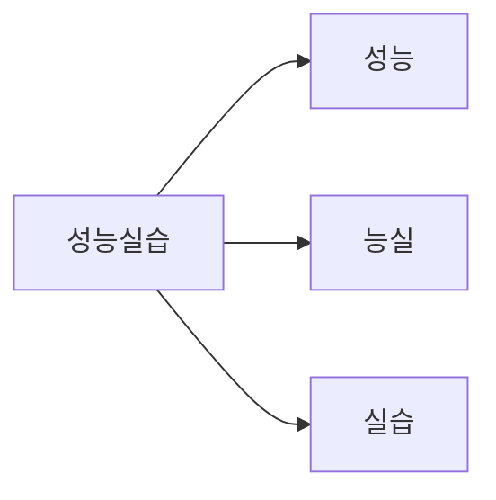

# 게시글 검색 설계 — 단계 17 (FULLTEXT + ngram)

> 게시글 100만 건에서 "키워드가 **들어간** 글"을 찾는 기능의 설계 문서.
> 단계 16([[DB-PERFORMANCE]])의 교훈 — "측정 → 개선 → 재측정" — 을 검색에 한 번 더
> 적용한다. 이 문서의 모든 수치는 로컬 mysql-8(100만 건)에서의 **실측값**이다.
> 손 실습은 [[POST-SEARCH-LAB]], 코드 구현은 단계 17 구현편(예정)의 몫.

---

## 1. 핵심 요약 — 한눈에 비교

같은 요구("`731942`가 들어간 글 검색")를 세 방법으로 실측한 결과:

| 방법 | 쿼리 | 실측 (100만 건) | 판정 |
|------|------|------|------|
| B-tree 인덱스 + LIKE | `WHERE title LIKE '%731942%'` | **4,626ms** (인덱스 있어도 무용) | 탈락 |
| LIKE (title + content) | `... OR content LIKE '%...%'` | 4,652ms | 탈락 |
| **FULLTEXT(ngram) + MATCH** | `WHERE MATCH(title, content) AGAINST('731942')` | **7.15ms** | **채택** |

> [!IMPORTANT]
> 부분 일치(`%키워드%`) 검색에 B-tree 인덱스는 **아무리 걸어도 소용없다.**
> 검색에는 검색 전용 인덱스(FULLTEXT)가 따로 있다 — 650배 차이의 근거는 §2.

---

## 2. 왜 B-tree로는 안 되는가 — 그리고 옵티마이저의 함정

### 2-1. 사전 비유

B-tree 인덱스는 **첫 글자부터 정렬된 목차**다. 사전에서 "ㅅ으로 시작하는 단어"는
목차로 바로 찾지만(전방 일치 `LIKE '성능%'` — range scan), "**실습**이 들어간 단어
전부"는 목차가 무의미해서 사전을 통째로 읽어야 한다(부분 일치 `LIKE '%실습%'`).

### 2-2. 실측에서 드러난 함정 — 4.6초의 정체

`WHERE title LIKE '%731942%' ORDER BY created_at DESC LIMIT 20` 의 실행 계획:

```
-> Limit: 20 row(s)  (actual time=2779..4626 rows=1)
    -> Filter: (posts.title like '%731942%')  (actual time=2779..4626 rows=1)
        -> Index scan on posts using idx_posts_created_at (reverse)
           (actual time=6.03..4476 rows=1e+6)
```

옵티마이저는 "최신순 인덱스를 걷다 보면 20건 금방 차겠지"라는 계획을 골랐다 —
단계 16 §5에서 본 그 전략이다. 그런데 키워드가 희귀해서(전체 1건) **인덱스 100만
건을 끝까지 걷고도** 1건밖에 못 찾았다. 흔한 키워드면 빨라 보이고 희귀한 키워드면
수 초짜리가 되는, **데이터 분포에 따라 성능이 널뛰는 계획**이다. 사용자가 무엇을
검색할지는 통제할 수 없으므로 이 구조는 운영에 못 쓴다.

---

## 3. FULLTEXT + ngram — 검색 전용 인덱스

### 3-1. 원리: 문서를 토큰으로 쪼개 역색인을 만든다

FULLTEXT 인덱스는 B-tree(값→행)가 아니라 **역색인(inverted index — 토큰→그 토큰이
등장하는 문서 목록)** 이다. 책 뒤의 "찾아보기"와 같은 구조라서 "이 단어가 들어간
문서"를 바로 답할 수 있다.

문제는 토큰을 나누는 기준이다. 영어는 공백으로 단어가 나뉘지만 한국어는 조사가
붙는다("검색을", "검색이" …). 그래서 한국어는 **ngram 파서**(MySQL 5.7+ 내장)로
글자를 **2글자씩 겹치며** 쪼갠다:



`ngram_token_size = 2`(기본값)일 때 `성능실습` → `성능`, `능실`, `실습` 세 토큰.
검색어도 같은 방식으로 쪼개 토큰을 대조하므로 형태소 분석 없이 부분 일치가 된다.

### 3-2. 생성 DDL

```sql
ALTER TABLE posts ADD FULLTEXT INDEX ft_posts_title_content (title, content) WITH PARSER ngram;
```

실측: 100만 건(데이터 105MB)에서 **26.5초** — 단계 16의 B-tree 생성(1.7초)의 15배.
검색 인덱스는 만드는 것도, 유지하는 것도 훨씬 비싸다(§6 함정 표 참조).

### 3-3. 검색 쿼리와 두 가지 모드

```sql
SELECT id, title FROM posts
WHERE MATCH(title, content) AGAINST('731942' IN BOOLEAN MODE)
ORDER BY created_at DESC LIMIT 20;
```

| 모드 | 문법 | 동작 | 우리 선택 |
|------|------|------|------|
| NATURAL LANGUAGE (기본) | `AGAINST('검색어')` | 관련도(TF-IDF류) 점수순, 연산자 없음 | — |
| **BOOLEAN** | `AGAINST('+성능 +실습' IN BOOLEAN MODE)` | `+`(필수) `-`(제외) `"..."`(구문) 연산자 | **채택** |

BOOLEAN MODE를 택하는 근거: ① 게시판 검색의 기대는 "포함 여부"지 관련도 순위가
아니고, ② 정렬을 `created_at`(최신순)으로 고정해야 단계 16의 keyset 커서를 그대로
재사용할 수 있다(§4-2). 관련도 점수가 필요하면 `MATCH ... AGAINST`를 SELECT 절에
넣어 점수를 함께 받을 수 있다(실습 §5).

---

## 4. API 설계

### 4-1. 엔드포인트

| Method | Path | 설명 | 인증 |
|--------|------|------|------|
| GET | `/api/v1/boards/{boardId}/posts/search` | 게시판 내 검색 (keyset) | 공개 (기존 GET 규칙 승계) |

파라미터:

| 파라미터 | 필수 | 설명 |
|----------|------|------|
| `query` | Y | 검색어 (2글자 이상 — §6 함정 ③) |
| `size` | N | 기본 20, 상한 100 (cursor API와 동일 규칙) |
| `lastCreatedAt` + `lastId` | N | keyset 커서 — [[DB-PERFORMANCE-WALKTHROUGH]] 작업 5와 동일 계약 |

응답은 단계 16의 `PostCursorResponse`를 **그대로 재사용**한다 — 검색 결과도
"목록 + hasNext + 커서"라는 형태는 같기 때문이다.

### 4-2. 설계 결정과 근거

| 결정 | 근거 |
|------|------|
| 게시판 단위 검색 (`boardId` 경로에 포함) | 화면 흐름이 "게시판 → 그 안에서 검색". 전역 검색은 확장 여지로 남김 |
| 정렬은 최신순 고정 (관련도순 아님) | keyset 커서 `(createdAt, id)`를 그대로 재사용 — 관련도순 커서는 점수 동률 처리가 복잡 |
| `PostCursorResponse` 재사용 | 응답 형태가 동일 — 프론트 무한스크롤 코드도 그대로 재사용 |
| 검색어 2글자 미만 400 | `ngram_token_size=2`라 1글자는 색인에 없어 **항상 0건** — 빈 결과보다 명시적 거부가 낫다 |

### 4-3. JPA 통합의 벽 — native query가 필요하다

`MATCH ... AGAINST`는 **JPQL에 없다.** 리포지토리는 `@Query(nativeQuery = true)`로
내려가야 하고, 이때 잃는 것(타입 안전, `@EntityGraph`)과 대응책(조인 직접 명시)이
구현편의 핵심 주제가 된다.

또 하나 — `@Table(indexes = @Index(...))`로는 **FULLTEXT를 선언할 수 없다**(일반
B-tree만 생성됨). 단계 16에서 세운 "인덱스도 코드가 정본" 원칙의 첫 예외다.
FULLTEXT는 수동 DDL로 만들며, 실무라면 Flyway 같은 마이그레이션 도구가 이 DDL을
버전 관리한다(개념만 소개 — 도입은 별도 판단).

---

## 5. 파급 범위 (구현편에서 손댈 곳)

| 계층 | 파일 | 변경 |
|------|------|------|
| DB | (수동 DDL) | `ft_posts_title_content` FULLTEXT 인덱스 |
| Repository | `PostRepository` | native `MATCH AGAINST` keyset 쿼리 2개 (첫 페이지/커서) |
| Service | `PostService` | `searchPosts(boardId, query, cursor, size)` + 검색어 검증 |
| Controller | `PostController` | `GET .../posts/search` + query 길이 검증 |
| React | `api.js`, `Posts.jsx` | 검색창 + 기존 무한스크롤 로직에 query 파라미터 합류 |
| 테스트 | `PostServiceTest` | H2 제약 주의 — §6 함정 ⑤ |

---

## 6. 함정 목록 (전부 실측으로 확인됨)

| # | 함정 | 실측/증상 | 대응 |
|---|------|------|------|
| ① | MySQL 8.0.33의 ADD FULLTEXT 버그 | `ERROR 1062 Duplicate entry ... for key 'idx_posts_board_created'` — 무관한 인덱스의 duplicate 에러로 실패 | `ALGORITHM=COPY` 명시로 우회 (실습 §3) |
| ② | 클라이언트 charset | `docker exec mysql` 기본 charset에서 한글 검색어가 `????`로 깨져 0건 | `--default-character-set=utf8mb4` |
| ③ | 1글자 검색 | `AGAINST('성')` → 항상 0건 (`ngram_token_size=2` 미만은 색인에 없음) | API에서 2글자 미만 400 거부 |
| ④ | 크기가 안 보임 | `information_schema.TABLES`의 INDEX_LENGTH에 FULLTEXT가 **집계되지 않음** | FTS 보조 테이블스페이스로 확인 — 실측 69.1MB (실습 §7) |
| ⑤ | H2에는 ngram FULLTEXT 없음 | 테스트(H2)에서 native MATCH 쿼리 실행 불가 | 구현편에서 전략 결정 (Testcontainers MySQL 또는 통합 테스트 분리) |
| ⑥ | 흔한 단어의 최악 케이스 | 100만 건 전부에 있는 토큰 검색은 FT로도 느리다 (실습 §6 실측) | 검색 UX로 완화(최소 길이·안내), 근본 해법은 검색엔진(§7) |

---

## 7. 더 큰 세계 — 언제 Elasticsearch로 가나

| | MySQL FULLTEXT | Elasticsearch 등 검색엔진 |
|------|------|------|
| 운영 비용 | 0 (DB에 내장) | 별도 클러스터 (우리 2GB 서버엔 무리) |
| 한국어 처리 | ngram (기계적 쪼개기) | 형태소 분석기 (nori) — "검색을"→"검색" |
| 관련도/랭킹 | 기본 수준 | 정교(BM25, 부스팅, 오타 교정) |
| 동기화 | 없음 (같은 DB) | CDC/이벤트로 색인 동기화 필요 — 새 실패 지점 |
| 적정 규모 | ~수백만 건, 단순 포함 검색 | 그 이상, 또는 검색이 서비스의 핵심일 때 |

우리 프로젝트(강의·수백만 건 이하·"포함 검색"이면 충분)는 **MySQL FULLTEXT가 정답**
이다. 검색엔진은 개념과 판단 기준만 가져간다 — "검색 품질이 서비스의 경쟁력이 되는
순간"이 이관 시점이다.

---

## 8. 구현 순서 (단계 17 구현편 예고)

단계 16과 같은 방향 — 데이터 계층에서 화면 쪽으로:

| 순서 | 작업 | 비고 |
|------|------|------|
| 1 | [[POST-SEARCH-LAB]] 실습으로 증거 확보 | LIKE 4,626ms → MATCH 7ms를 직접 관측 |
| 2 | FULLTEXT 인덱스 생성 (수동 DDL) | `ALGORITHM=COPY` — 서버 반영 절차는 §0 역할 분담 원칙대로 |
| 3 | PostRepository — native MATCH keyset 쿼리 | 첫 페이지/커서 2개, `@EntityGraph` 대체 조인 |
| 4 | PostService — `searchPosts` + 검색어 검증 | 2글자 미만 400 |
| 5 | PostController — `GET .../posts/search` | `PostCursorResponse` 재사용 |
| 6 | 테스트 | 함정 ⑤의 H2 전략 결정 포함 |
| 7 | React — 검색창 + 무한스크롤 합류 | query 상태만 추가, 스크롤 로직 재사용 |
| 8 | 검증 — verify.sh + 100만 건 curl + 브라우저 E2E | 단계 16과 같은 3겹 |
