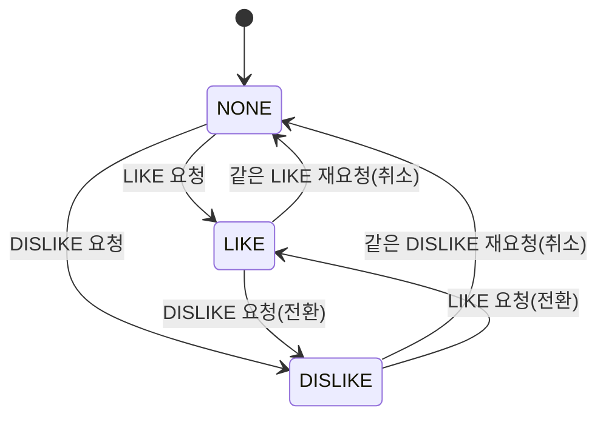
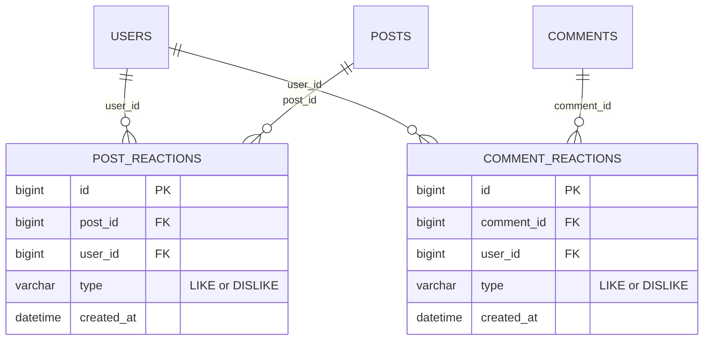
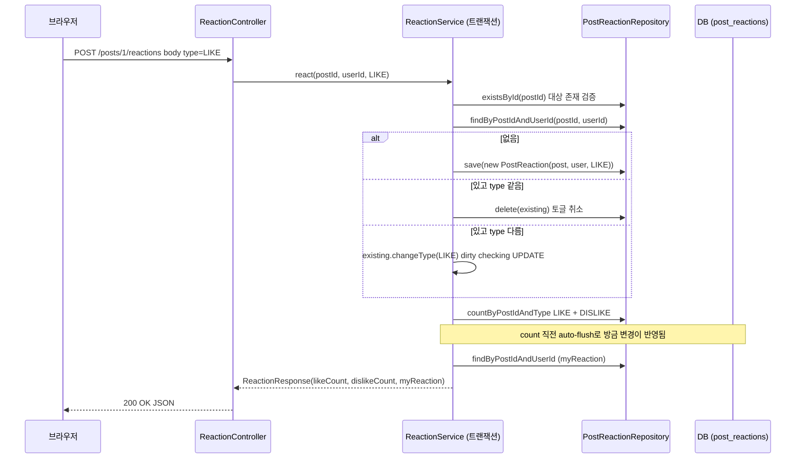

# 좋아요·싫어요 — 유튜브식 토글 반응 (단계 13)

- **과정명**: 강의용 Spring Boot 게시판 — 단계 13 (반응 · 게시글/댓글 좋아요·싫어요)
- **대상**: 단계 12(댓글 알림)까지 마친 수강생 — 여기서부터는 새 도메인 하나를 붙이되, "카운트를 어디에 두는가", "여러 상태(없음/좋아요/싫어요) 사이의 전이", "목록 API의 반응 카운트를 N+1 없이 조립하는 법"이 학습 포인트다. 단계 10에서 봤던 조회수(비정규화 컬럼)와 대비되는 **집계 쿼리 방식**의 트레이드오프를 몸으로 익힌다
- **브랜치**: `step13-reactions`
- **관련 코드**: `reaction/PostReaction`, `reaction/CommentReaction`(신규 — `@UniqueConstraint` + `changeType`), `reaction/ReactionType`(enum), `reaction/PostReactionRepository`, `reaction/CommentReactionRepository`(신규 — 집계·in 쿼리 + `CommentReactionCount` projection), `reaction/PostReactionSummary`, `reaction/CommentReactionSummary`(record), `reaction/ReactionService`(신규 — 토글 3분기 + 목록 집계), `reaction/ReactionController`(신규 — 2 엔드포인트), `reaction/dto/ReactionRequest`, `ReactionResponse`(record), `post/dto/PostResponse`(수정 — 반응 3필드 + `from` 시그니처 확장), `comment/dto/CommentResponse`(수정 — 반응 3필드 + `from(Comment, Map)` 시그니처), `post/PostService.getPost/update/create`(수정 — 반응 조립), `comment/CommentService.getComments/update/create`(수정 — viewerId 전파 + 반응 맵 주입), `comment/CommentController.getComments/update`(수정 — viewerId 주입)
- **선수 지식**: [COMMENT.md](COMMENT.md) — `@BatchSize` + `default_batch_fetch_size`로 목록 N+1 우회한 패턴(이번 단계는 그 위에 반응 집계 쿼리를 얹는다), [FILE-UPLOAD.md](FILE-UPLOAD.md) §6 — 조회수(view_count) 비정규화 컬럼과 "본인 조회 제외" 정책(반응은 이 두 결정과 다르게 간다 — 별도 테이블 집계 + 본인 반응 허용)
- **검증 상태**: `ReactionServiceTest` 11 케이스 신규 + 전체 130개 green (2026-07-26, commit `3894d3a`). `verify.sh` 전 구간(빌드+테스트+실기동 헬스체크) 통과. 문서의 코드는 실제 구현과 100% 일치한다

---

## 한눈에 보기 — 3분 요약

바쁘면 이 섹션만 읽어도 된다. 상세는 §1부터.

**무엇을 만들었나**: 게시글과 댓글 각각에 **좋아요/싫어요** 반응이 붙는다. 유튜브식 규칙 — 한 사용자는 한 대상에 **좋아요 또는 싫어요 하나만**, 같은 버튼을 다시 누르면 **취소**, 반대 버튼을 누르면 **전환**. 카운트는 별도 테이블(`post_reactions`, `comment_reactions`)의 집계 쿼리로 계산하고, "내가 지금 뭘 눌렀는지"는 로그인 사용자별로 다르게 응답에 실린다. 목록(댓글) 조회에서는 반응을 IN 집계 1번 + viewer 반응 IN 1번으로 묶어 N+1을 피한다.

**구현 지점 — 딱 5곳**:

| 층위 | 파일 | 역할 |
|------|------|------|
| 도메인 | `PostReaction`, `CommentReaction` | `@UniqueConstraint(대상_id, user_id)`로 "한 사람 한 반응" DB 보장 + `changeType` 전환 |
| 리포지토리 | `PostReactionRepository`, `CommentReactionRepository` | 토글 조회(`findByXxxIdAndUserId`), 카운트(`countByXxxIdAndType`), 목록 집계(`countByCommentIdIn` group by projection), viewer 일괄(`findByCommentIdInAndUserId`) |
| 서비스 | `ReactionService` | 토글 3분기(생성/취소/전환) + 게시글 단건 집계(`getPostReaction`) + 댓글 목록 집계(`getCommentReactions` — commentId→summary 맵) |
| 응답 | `PostResponse`(수정), `CommentResponse`(수정) | `likeCount`/`dislikeCount`/`myReaction` 3필드 추가, `from` 시그니처 확장 |
| 조립·노출 | `PostService`·`CommentService`(수정), `ReactionController`(신규 2엔드포인트) | 조회/수정/생성 응답에 반응 요약 주입 + 반응 토글 API 노출(인증 필요) |

**반응 상태 전이 — 유튜브 버튼과 정확히 같은 규칙**:



**데이터 모델 — 두 도메인이 각각 자기완결(대상 FK 하나씩)**:



**토글 처리 시퀀스** — 3분기 중 하나로 분기 후 갱신된 카운트를 즉시 반환:



**핵심 한 줄**: **한 사람 한 반응(상호배타)은 DB 유니크로 보장하고, 없음↔좋아요↔싫어요 3-상태 전이는 서비스의 `ifPresentOrElse` 3분기 하나가 담당한다.** 목록의 카운트는 별도 테이블을 IN 집계 쿼리 1번으로 묶어 N+1을 피한다.

---

## 학습 목표

이 문서를 끝내면 수강생은:

- 반응처럼 **여러 상태 사이를 전이하는 도메인**을 (a) 통합 다형성 vs (b) 별도 테이블로 나누는 결정의 근거를 설명할 수 있다
- `@UniqueConstraint`로 "한 사용자 한 반응"을 **DB가 보장**하도록 만들고, 그 덕분에 애플리케이션이 복잡한 락 없이 안전해지는 이유를 안다
- 유튜브식 토글(없음/좋아요/싫어요 3-상태) 전이 3분기를 `ifPresentOrElse`로 단순하게 표현하는 관용구와, 그 안에서 **취소=DELETE / 전환=UPDATE / 신규=INSERT**가 자연스레 나오는 흐름을 설명할 수 있다
- 카운트를 **별도 테이블 집계**로 계산하는 방식(반응)과 **비정규화 컬럼**에 누적하는 방식(조회수)의 트레이드오프(정확성·동시성 vs 조회 성능)를 비교하고, 이 프로젝트가 왜 반응에 전자를, 조회수에 후자를 택했는지 말할 수 있다
- 댓글 목록에서 각 댓글의 반응 카운트를 **N+1 없이** 얻는 두 축(집계 IN 쿼리 1번 + viewer 반응 IN 1번)을 코드로 확인하고, 페이지 안의 모든 comment id(최상위 + 대댓글)를 한 번에 모아 넘기는 이유를 안다
- 응답 DTO의 반응 3필드(`likeCount`/`dislikeCount`/`myReaction`)를 채우기 위해 `from` 시그니처가 확장되고, 호출부(create/update/getPost/getComments) 전부가 이에 맞춰 갱신되는 파급의 범위를 이해한다
- `myReaction`이 **뷰어별로 다른** 필드라는 점(비로그인 null · 로그인마다 다름)과, 그 때문에 캐시 정책이 왜 복잡해지는지 설명할 수 있다

---

## 코드 작성 순서 — 무엇을 먼저 짜는가

원칙은 단계 10·11·12와 같다: **의존의 역방향** — 남이 의존하는 밑바닥 부품(엔티티·enum·record)을 먼저 만들고, 그것을 조립하는 서비스·컨트롤러를 나중에, 기존 도메인 응답 스키마 확장(PostResponse/CommentResponse)과 그 파급(create/update/getPost/getComments 호출부)을 맨 끝에 둔다.

| 순서 | 파일 | 이 시점에 하는 일 | 왜 이 순서인가 |
|------|------|-----------------|--------------|
| 1 | `reaction/ReactionType.java` (신규) | enum `LIKE`, `DISLIKE` — 상호배타 두 값 | 엔티티·요청·응답·리포지토리가 모두 참조 |
| 2 | `reaction/PostReaction.java` (신규) | `@UniqueConstraint(post_id, user_id)` + `changeType` | 도메인 최하위. `ReactionType`만 참조 |
| 3 | `reaction/CommentReaction.java` (신규) | 위와 동일 구조, 대상만 Comment | 대칭 도메인. 파일이 갈리는 이유는 §1 |
| 4 | `reaction/dto/ReactionRequest.java`, `ReactionResponse.java` (신규) | request는 `@NotNull ReactionType type`, response는 `likeCount/dislikeCount/myReaction` | 컨트롤러·서비스 시그니처 필요 |
| 5 | `reaction/PostReactionSummary.java`, `CommentReactionSummary.java` (신규) | 서비스 내부 조립용 record — 응답 DTO와 형태 유사하지만 도메인 서비스 간 계약 | `PostService`·`CommentService`가 반응을 받아 응답에 조립 |
| 6 | `reaction/CommentReactionCount.java` (신규) | interface projection — commentId/type/cnt | 리포지토리 group by 결과 매핑 |
| 7 | `reaction/PostReactionRepository.java`, `CommentReactionRepository.java` (신규) | 토글 조회, 단건 카운트, 목록 group by IN, viewer 반응 IN | 서비스가 조립 |
| 8 | `reaction/ReactionService.java` (신규) | 토글 3분기 2벌(post/comment) + 게시글 단건 요약 + 댓글 목록 집계 | 2~7 부품을 조립 |
| 9 | `reaction/ReactionController.java` (신규) | POST 2엔드포인트, `@AuthenticationPrincipal` | 8을 호출하는 최상위 |
| 10 | `post/dto/PostResponse.java` (수정) | 반응 3필드 + `from(Post, likeCount, dislikeCount, myReaction)` | 반응이 응답에 실리는 계약 확장 |
| 11 | `comment/dto/CommentResponse.java` (수정) | 반응 3필드 + `from(Comment, Map<Long, CommentReactionSummary>)` | 목록 집계 결과를 재귀적으로 소비 |
| 12 | `post/PostService.java` (수정) | `getPost`/`update`/`create`가 `reactionService.getPostReaction(id, viewerId)` 호출 후 응답 조립 | 10의 새 계약을 채움. viewer 반영. `update`도 viewerId를 받도록 시그니처 확장 |
| 13 | `comment/CommentService.java` (수정) | `getComments(postId, viewerId, pageable)` — 페이지의 모든 id(최상위+대댓글) 수집 후 `getCommentReactions` 1회 호출, `create`·`update`도 viewerId로 반응 채움 | 11의 새 계약을 채움. N+1 회피 |
| 14 | `comment/CommentController.java`, `post/PostController.java` (수정) | 조회 API에 `@AuthenticationPrincipal` 추가(비로그인 null 허용), viewerId 서비스로 전파 | 서비스 시그니처 확장에 맞춰 컨트롤러 갱신 |
| 15 | `test/reaction/ReactionServiceTest.java` (신규, 11 케이스) | 토글/취소/전환/자기 반응 허용/집계/비로그인 myReaction=null/N+1 회피/에러 시나리오 | 완성된 동작 고정 |

> [!TIP]
> 큰 덩어리로 보면 **① enum/엔티티(1·2·3) → ② DTO/projection(4·5·6) → ③ 리포지토리(7) → ④ 서비스(8) → ⑤ 컨트롤러(9) → ⑥ 기존 응답 확장·호출부 파급(10~14) → ⑦ 테스트(15)**. 이번 단계에서 특히 큰 파급은 **⑥** — 반응이 응답에 실리는 순간 `PostResponse.from`·`CommentResponse.from` 시그니처가 바뀌고, 이걸 부르는 모든 지점(create/update/getPost/getComments)이 함께 갱신된다. IDE의 컴파일 에러가 파급 지점을 알려주므로 그걸 따라 손보는 것이 가장 빠르다.

---

## 1. 데이터 모델 — 왜 별도 테이블 2개인가

반응을 어디에 저장할지 두 가지 접근이 있다:

| 방식 | 스키마 | 특징 |
|------|--------|------|
| 통합 다형성(`reactions` 1개) | `reactions(id, target_type, target_id, user_id, type)` | 게시글/댓글이 한 테이블에 섞임 · 외래키 제약 걸 수 없음(target_id가 두 테이블 중 하나를 참조) · 유니크 제약도 `(target_type, target_id, user_id)`로 걸어야 함 |
| **별도 테이블 2개(선택)** | `post_reactions(post_id FK)` + `comment_reactions(comment_id FK)` | 각각 진짜 FK 제약 · 유니크 제약이 자연스러움 · 게시글/댓글 삭제 시 FK cascade로 반응도 정리 |

우리는 후자를 택했다. 근거는 **"제약을 스키마가 보장하게"** — 별도 FK로 두면 존재하지 않는 게시글/댓글에 반응이 붙는 상황이 원천 차단되고, 삭제 시 정리도 DB가 알아서 해준다(별도 트리거·애플리케이션 코드 불필요). 통합 방식이 얻는 이득("한 테이블")은 우리 도메인 크기에서 크지 않다.

두 엔티티는 대상 필드만 다르고 구조가 대칭이다. `PostReaction` (`PostReaction.java`):

```java
// 단계 13: 게시글 반응. (post, user) 유니크로 한 사용자가 한 글에 반응 1건만 갖게 강제한다.
// 토글 취소는 행 삭제, 전환(LIKE↔DISLIKE)은 changeType로 처리한다.
@Entity
@Table(name = "post_reactions", uniqueConstraints = @UniqueConstraint(
    name = "uk_post_reactions_post_user", columnNames = {"post_id", "user_id"}))
@Getter
@NoArgsConstructor(access = AccessLevel.PROTECTED)
public class PostReaction extends BaseTimeEntity {

  @Id
  @GeneratedValue(strategy = GenerationType.IDENTITY)
  private Long id;

  @ManyToOne(fetch = FetchType.LAZY)
  @JoinColumn(name = "post_id", nullable = false)
  private Post post;

  @ManyToOne(fetch = FetchType.LAZY)
  @JoinColumn(name = "user_id", nullable = false)
  private User user;

  @Enumerated(EnumType.STRING)
  @Column(nullable = false, length = 20)
  private ReactionType type;

  public PostReaction(Post post, User user, ReactionType type) {
    this.post = post;
    this.user = user;
    this.type = type;
  }

  // LIKE↔DISLIKE 전환. dirty checking으로 커밋 시 UPDATE 된다.
  public void changeType(ReactionType type) {
    this.type = type;
  }
}
```

`CommentReaction`(`CommentReaction.java`)은 위와 대상만 다른 완전 대칭 구조 — `Post` 자리에 `Comment`가 오고 유니크 컬럼이 `(comment_id, user_id)`가 될 뿐이다. 코드가 반복되어 보이지만, 이 반복이 **각각 진짜 FK로 묶여 있다**는 이득의 대가다.

포인트 셋:

- **`@UniqueConstraint(대상_id, user_id)`** — "한 사람 한 반응"의 상호배타를 **DB가 강제**한다. 애플리케이션이 조회→판단→저장 사이에 다른 요청이 끼어들어 같은 사용자의 반응이 두 건 생기려 해도 두 번째 INSERT에서 유니크 위반으로 실패한다. 서비스 코드는 이 안전망 위에서 단순한 3분기(§2)로 표현된다.
- **`ReactionType`은 `@Enumerated(STRING)`** — enum 순서를 바꾸면 ordinal 방식은 데이터가 다 뒤틀린다. 문자열 저장은 DB 로그·SQL 콘솔에서 눈으로 읽히고, 새 값 추가 시에도 기존 값이 안전하다.
- **`fetch = LAZY`** — 반응 자체는 카운트(집계)와 존재 여부(myReaction) 조회가 주라, `post`/`user` 엔티티까지 함께 로딩할 필요가 거의 없다.

`ReactionType` (`ReactionType.java`):

```java
// 게시글/댓글 반응의 종류. 상호배타(한 사용자는 한 대상에 LIKE 또는 DISLIKE 하나만).
public enum ReactionType {
  LIKE,
  DISLIKE
}
```

> [!IMPORTANT]
> 별도 테이블 2개의 진짜 가치는 **"DB가 무결성을 대신 지켜준다"** 이다. 유니크 제약·FK 제약이 데이터 계층에 새겨져 있으면, 애플리케이션 코드에 어떤 버그가 있어도 데이터가 이상해지지 않는다. 통합 방식은 이 안전망 대부분을 애플리케이션이 재구현해야 한다.

---

## 2. 유튜브식 토글 로직 — 없음/좋아요/싫어요 3-상태 전이

`ReactionService.react`의 핵심은 딱 3분기다 — **기존 반응이 없으면 생성, 같은 type이면 삭제(취소), 다른 type이면 전환**. 이 세 갈래를 `ifPresentOrElse` 관용구 하나로 표현한다.

`ReactionService.react` (`ReactionService.java`):

```java
// 게시글 반응 토글. 없으면 생성, 같은 type이면 삭제(취소), 다른 type이면 전환.
// JPQL 카운트 조회 직전 Hibernate가 pending 변경을 auto-flush 하므로 방금의 생성/삭제/전환이 카운트에 반영된다.
@Transactional
public ReactionResponse react(Long postId, Long userId, ReactionType type) {
  if (!postRepository.existsById(postId)) {
    throw new NotFoundException(ErrorCode.POST_NOT_FOUND);
  }
  postReactionRepository.findByPostIdAndUserId(postId, userId).ifPresentOrElse(
      existing -> {
        if (existing.getType() == type) {
          postReactionRepository.delete(existing);
        } else {
          existing.changeType(type);
        }
      },
      () -> {
        Post post = postRepository.getReferenceById(postId);
        User user = userRepository.getReferenceById(userId);
        postReactionRepository.save(new PostReaction(post, user, type));
      });
  return buildPostReactionResponse(postId, userId);
}
```

세 분기 각각의 사연:

| 조건 | 처리 | 왜 그 처리인가 |
|------|------|--------------|
| 기존 반응 없음 | `save(new PostReaction(...))` | 새 상태로 진입 (NONE → LIKE 또는 NONE → DISLIKE). `getReferenceById`로 proxy만 쓰고 실 로딩은 안 함 — 어차피 FK 컬럼만 채우면 됨 |
| 기존 반응 있음, type 같음 | `delete(existing)` | **같은 버튼을 다시 누르면 취소** (LIKE → NONE). 유튜브·인스타·페북 다 같은 UX 관용구 |
| 기존 반응 있음, type 다름 | `existing.changeType(type)` | **반대 버튼을 누르면 전환** (LIKE → DISLIKE). 새 행 만들지 않고 UPDATE 하나로 끝 — 유니크 제약 위반도 없음 |

전이표로 정리하면:

| 현재 상태 | LIKE 요청 | DISLIKE 요청 |
|-----------|-----------|--------------|
| NONE | INSERT (LIKE로 생성) → LIKE | INSERT (DISLIKE로 생성) → DISLIKE |
| LIKE | DELETE (취소) → NONE | UPDATE type=DISLIKE (전환) → DISLIKE |
| DISLIKE | UPDATE type=LIKE (전환) → LIKE | DELETE (취소) → NONE |

**`changeType`이 왜 세터가 아닌가** — 엔티티에서 임의 세터를 노출하면 어디서든 `post.setType(...)`으로 바뀔 수 있다. 반응 전환은 "정확히 이 시점에 이 목적으로만" 일어나는 상태 전이이므로 메서드 이름이 그 의도를 담아야 한다. dirty checking이 트랜잭션 커밋 시점에 UPDATE로 반영한다.

`CommentReaction`용 `reactToComment`도 정확히 같은 3분기 구조 — 대상만 `Comment`로 바뀐다(코드 반복은 두 도메인을 독립적으로 유지하는 대가로 감수).

**응답의 카운트가 방금 변경을 반영하는 이유**:

```java
// buildPostReactionResponse — react() 끝에서 호출
private ReactionResponse buildPostReactionResponse(Long postId, Long userId) {
  long likeCount = postReactionRepository.countByPostIdAndType(postId, ReactionType.LIKE);
  long dislikeCount = postReactionRepository.countByPostIdAndType(postId, ReactionType.DISLIKE);
  ReactionType myReaction = postReactionRepository.findByPostIdAndUserId(postId, userId)
      .map(PostReaction::getType)
      .orElse(null);
  return new ReactionResponse(likeCount, dislikeCount, myReaction);
}
```

`count...`는 JPQL이므로 Hibernate가 이 쿼리 실행 직전에 **auto-flush**한다 — 방금의 save/delete/changeType가 DB로 SYNC된 뒤 count가 실행되므로, 응답에는 방금 변경이 즉시 반영된다. 이 자동 flush 덕분에 우리는 "다시 조회하기 전에 flush 해야 하나?"를 신경 쓰지 않아도 된다.

> [!IMPORTANT]
> 반응처럼 **여러 상태 사이를 전이하는** 도메인은 "무엇을 저장할지"보다 "어떤 전이가 가능한지"를 먼저 정의한다. 우리 규칙은 유튜브 3-상태 그대로 — 없음/좋아요/싫어요. 이 세 상태 전이표가 결정되면 코드는 `ifPresentOrElse` 하나로 자연스럽게 풀린다. DB 유니크가 안전망이라 락도 필요 없다.

---

## 3. 카운트 방식 — 별도 테이블 집계 vs 비정규화 컬럼

카운트를 어떻게 계산할지는 두 가지 선택이 있다:

| 방식 | 예 | 조회 성능 | 정확성·동시성 | 저장·유지비용 |
|------|----|----------|-----------------|--------------|
| 비정규화 컬럼 | `posts.view_count` (단계 10) | O(1) — 컬럼 하나 읽기 | 갱신 경쟁 시 lost update 위험 — `UPDATE ... SET x = x + 1` 또는 락 필요 | 저렴, 계산 필요 없음 |
| **별도 테이블 집계** | `post_reactions` group by (단계 13) | count 쿼리 (인덱스 있으면 매우 빠름) | 항상 원본 행을 세므로 **정확** | 별도 테이블 유지, 조회마다 쿼리 |

**이 프로젝트는 두 방식을 의도적으로 다르게 골랐다**. 왜?

| 도메인 | 선택 | 근거 |
|--------|------|------|
| 조회수 (단계 10, `post.viewCount`) | 비정규화 컬럼 | **개인 상태가 없음** — "누가 봤는지"를 저장할 필요가 없고, 카운트 하나만 있으면 된다. 조회는 매우 잦고 정확성보다 응답 속도가 우선(±1 정도의 오차는 UX 영향 없음) |
| 반응 (단계 13, `post_reactions` count) | 별도 테이블 집계 | **개인 상태가 필요** — "내가 뭘 눌렀는지"(`myReaction`)를 응답에 실어야 하므로 사용자별 행이 어차피 있어야 한다. 그 행을 group by한 결과가 곧 카운트이므로 별도 컬럼을 두지 않는다 |

즉 **"사용자별 상태가 필요한가"** 하나가 방식을 갈랐다. 반응은 그 상태가 필수라 행이 있어야 하고, 그렇다면 카운트를 별도 컬럼으로 중복 저장할 이유가 없다(중복은 정합성 부채가 된다).

`Post.viewCount` (`Post.java`) — 조회수는 컬럼 하나:

```java
@Column(nullable = false)
private int viewCount;

public void increaseViewCount() {
  this.viewCount++;
}
```

`PostReactionRepository` — 반응은 group by count(방식이 다름):

```java
public interface PostReactionRepository extends JpaRepository<PostReaction, Long> {

  // 토글/전환 판단용 — 이 사용자가 이 글에 이미 남긴 반응(있으면 갱신/삭제, 없으면 새로 생성).
  Optional<PostReaction> findByPostIdAndUserId(Long postId, Long userId);

  // 단건 게시글의 LIKE/DISLIKE 개수(단건 상세 응답용).
  long countByPostIdAndType(Long postId, ReactionType type);
}
```

**트레이드오프의 실제 값** — 반응 카운트가 정말 뜨거워지면(예: 인기 글이 초당 수백 반응) 매 조회마다 count가 부담이 될 수 있다. 그때의 후속 옵션:

- **캐시 계층** — Redis 등에 `(postId, LIKE|DISLIKE) → count`를 두고 반응 변경 시 INCR/DECR. count 쿼리는 캐시 미스 시에만
- **비정규화 컬럼 병행** — `posts.like_count`를 두고 반응 이벤트로 갱신(정합성 부채 감수)
- **materialized view / summary table** — 배치로 카운트 스냅샷을 만들어 두고 조회는 거기서

이 프로젝트 규모에서는 group by count로 충분해 이 최적화들을 켜지 않았다. **필요할 때 필요한 만큼**이 원칙.

> [!NOTE]
> 조회수의 "본인 조회 제외"([FILE-UPLOAD.md](FILE-UPLOAD.md) §6, `PostService.getPost`의 `!post.isAuthor(viewerId)` 가드)와 반응의 **"본인 반응 허용"**(§6)은 정책 방향이 반대다. 조회수는 자기 조회로 부풀지 않게 하는 게 자연스럽고, 반응은 자기 글에 자기가 좋아요를 눌러도(예: 나중에 본인이 확인용으로) 이상하지 않다. 도메인마다 "본인 행위를 어떻게 취급할지"를 별개로 결정한다.

---

## 4. 조회 N+1 — 목록의 각 댓글마다 count 쿼리를 날리면 안 된다

댓글 목록 API(`GET /posts/{id}/comments`)에서 각 댓글의 반응 카운트를 채우려면 순진하게는 이렇게 될 수 있다:

```java
// ❌ 나쁜 예 — 각 댓글마다 count 쿼리 2회 + myReaction 조회 1회
for (Comment c : commentsInPage) {
  long like = reactionRepository.countByCommentIdAndType(c.getId(), LIKE);
  long dislike = reactionRepository.countByCommentIdAndType(c.getId(), DISLIKE);
  ReactionType my = reactionRepository.findByCommentIdAndUserId(c.getId(), viewerId)
      .map(CommentReaction::getType).orElse(null);
  // → 페이지에 10개 댓글, 각 원댓글에 대댓글 3개면 (10+30) * 3 = 120 쿼리
}
```

이것이 전형적인 **N+1**의 확장판이다. 게시글 상세는 댓글 하나라 상관없지만(다음 §5), **목록**은 반드시 잡아야 한다.

### 4-1. 두 축의 IN 쿼리 — 집계 1번 + viewer 반응 1번

`ReactionService.getCommentReactions` — 페이지의 모든 comment id를 한 번에 받아 두 쿼리만 실행:

```java
// 댓글 목록 반응 일괄 조회(N+1 회피 핵심). 집계 쿼리 1번 + viewer 반응 in 쿼리 1번으로 조립한다.
// CommentService가 페이지의 모든 comment id(최상위 + 대댓글)를 수집해 한 번만 호출한다.
@Transactional(readOnly = true)
public Map<Long, CommentReactionSummary> getCommentReactions(
    Collection<Long> commentIds, Long viewerId) {
  if (commentIds.isEmpty()) {
    return Map.of();
  }

  Map<Long, long[]> counts = new HashMap<>();
  for (CommentReactionCount row : commentReactionRepository.countByCommentIdIn(commentIds)) {
    long[] pair = counts.computeIfAbsent(row.getCommentId(), key -> new long[2]);
    if (row.getType() == ReactionType.LIKE) {
      pair[0] = row.getCnt();
    } else {
      pair[1] = row.getCnt();
    }
  }

  Map<Long, ReactionType> myReactions = new HashMap<>();
  if (viewerId != null) {
    List<CommentReaction> mine =
        commentReactionRepository.findByCommentIdInAndUserId(commentIds, viewerId);
    for (CommentReaction reaction : mine) {
      myReactions.put(reaction.getComment().getId(), reaction.getType());
    }
  }

  Map<Long, CommentReactionSummary> result = new HashMap<>();
  for (Long id : commentIds) {
    long[] pair = counts.getOrDefault(id, new long[2]);
    result.put(id, new CommentReactionSummary(pair[0], pair[1], myReactions.get(id)));
  }
  return result;
}
```

두 쿼리의 정체:

| 쿼리 | 반환 | 목적 |
|------|------|------|
| `countByCommentIdIn(commentIds)` | `List<CommentReactionCount>` (commentId, type, cnt) group by | 페이지 전체 댓글의 LIKE/DISLIKE 카운트를 한 번에 |
| `findByCommentIdInAndUserId(commentIds, viewerId)` | `List<CommentReaction>` | viewer가 이 댓글들에 남긴 반응 목록(myReaction 매핑) — viewerId가 null이면 실행 안 함 |

`CommentReactionRepository`의 정의(`CommentReactionRepository.java`):

```java
public interface CommentReactionRepository extends JpaRepository<CommentReaction, Long> {

  Optional<CommentReaction> findByCommentIdAndUserId(Long commentId, Long userId);

  long countByCommentIdAndType(Long commentId, ReactionType type);

  // 댓글 목록 N+1 회피용 집계 — commentId in (...) 한 번으로 (commentId, type)별 개수를 모은다.
  @Query("select r.comment.id as commentId, r.type as type, count(r) as cnt "
      + "from CommentReaction r where r.comment.id in :commentIds "
      + "group by r.comment.id, r.type")
  List<CommentReactionCount> countByCommentIdIn(@Param("commentIds") Collection<Long> commentIds);

  // viewer가 이 댓글들에 남긴 반응 일괄 조회(myReaction 매핑용) — in 쿼리 1번.
  List<CommentReaction> findByCommentIdInAndUserId(Collection<Long> commentIds, Long userId);
}
```

`CommentReactionCount`는 interface projection — group by 결과를 DTO로 매핑할 때 흔히 쓰는 관용구:

```java
// 댓글 목록 반응 집계 결과(interface projection). 댓글마다 쿼리를 날리는 N+1 대신,
// commentId in (...) 한 번으로 (commentId, type)별 개수를 받아 메모리에서 조립한다.
public interface CommentReactionCount {

  Long getCommentId();

  ReactionType getType();

  long getCnt();
}
```

Spring Data JPA가 select alias를 게터명(`getCommentId`/`getType`/`getCnt`)에 매핑한다. 별도 record 없이 인터페이스 하나로 group by 결과를 안전하게 받는다.

### 4-2. CommentService가 페이지의 모든 id를 수집해 넘긴다

`CommentService.getComments` — 최상위 + 대댓글 id를 한 리스트로 모아 서비스에 넘긴다:

```java
// 단계 13: viewerId 추가(반응의 myReaction 매핑용, 비로그인 null).
// 페이지의 모든 comment id(최상위 + 대댓글)를 모아 반응을 한 번에 집계(N+1 회피)한 뒤 응답에 주입한다.
@Transactional(readOnly = true)
public Page<CommentResponse> getComments(Long postId, Long viewerId, Pageable pageable) {
  if (!postRepository.existsById(postId)) {
    throw new NotFoundException(ErrorCode.POST_NOT_FOUND);
  }
  Page<Comment> page = commentRepository.findByPostIdAndParentIsNull(postId, pageable);

  List<Long> commentIds = new ArrayList<>();
  for (Comment root : page.getContent()) {
    commentIds.add(root.getId());
    // children은 @BatchSize로 IN 한 번에 로딩된다(트랜잭션 내라 안전).
    root.getChildren().forEach(reply -> commentIds.add(reply.getId()));
  }
  Map<Long, CommentReactionSummary> reactions =
      reactionService.getCommentReactions(commentIds, viewerId);

  return page.map(comment -> CommentResponse.from(comment, reactions));
}
```

여기서 `root.getChildren()`은 [COMMENT.md §4](COMMENT.md)에서 배운 `@BatchSize(100)`가 발동하는 지점 — 페이지 안의 모든 원댓글의 children이 IN 한 번으로 로딩된다. 그 결과 반환된 대댓글의 id까지 같은 리스트에 담아 반응 서비스에 넘긴다. **댓글/대댓글 총 N건에 대한 반응이 정확히 2쿼리(비로그인이면 1쿼리)로 끝난다**.

### 4-3. 쿼리 회계 — 페이지에 원댓글 10개 · 대댓글 30개 · 로그인 사용자 기준

| 쿼리 | 횟수 | 정체 |
|------|------|------|
| `findByPostIdAndParentIsNull` + `@EntityGraph(author)` | 1 | 최상위 댓글 페이지 + 각 author |
| children 배치 로딩 (`@BatchSize`) | 1 | 원댓글 10개의 children을 IN 한 번에 (총 30개 로딩) |
| 대댓글의 author 배치 로딩 (`default_batch_fetch_size`) | 1 | 30개 대댓글의 author를 IN 한 번에 |
| `countByCommentIdIn` (group by) | 1 | 40개 댓글의 LIKE/DISLIKE 카운트 집계 |
| `findByCommentIdInAndUserId` | 1 | viewer가 40개 댓글에 남긴 반응 |
| **합계** | **5** | 반응 없이 순진하게 짰다면 최소 (10 + 30) * 3 + 40 = 160 쿼리 |

`open-in-view=false` 환경에서 이 로딩이 안전한 이유는 [COMMENT.md §4-4](COMMENT.md)와 동일 — 서비스가 트랜잭션 안에서 `.map(comment -> CommentResponse.from(comment, reactions))`를 호출해 LAZY 접근을 모두 트랜잭션 경계 내에서 발동시킨다.

> [!IMPORTANT]
> **N+1은 카운트에서 다시 살아난다.** JPA 연관관계에서 잡았다고 방심하면 "각 댓글마다 카운트 쿼리"라는 새로운 N+1이 튀어나온다. 목록 API는 **페이지 안의 모든 대상 id를 한 번에 모아 IN 쿼리로 조립**하는 것이 원칙. viewer의 반응(myReaction)도 같은 방식으로 IN 한 번에 묶어야 한다.

---

## 5. 응답 확장 — 반응 3필드가 스며드는 파급 지점

반응이 조회 응답에 실리는 순간, 기존 응답 DTO의 계약이 바뀌고 그 계약을 채워야 하는 호출부(create/update/getPost/getComments) 전부가 함께 갱신된다. 이 파급의 범위를 아는 것이 "새 필드를 도입할 때" 나오는 문제를 미리 잡는 방법이다.

### 5-1. PostResponse — 반응 3필드 + `from` 시그니처 확장

`post/dto/PostResponse.java` (수정):

```java
public record PostResponse(
    Long id,
    Long boardId,
    String boardName,
    String authorUsername,
    String title,
    String content,
    int viewCount,
    List<PostImageResponse> images,
    long likeCount,
    long dislikeCount,
    ReactionType myReaction,
    LocalDateTime createdAt,
    LocalDateTime updatedAt
) {

  // 단계 13: 반응(likeCount/dislikeCount/myReaction)은 from(Post)만으로는 채울 수 없어(별도 테이블)
  // 서비스가 반응 요약을 조회해 넘긴다. 방금 만든/수정한 글은 반응이 없으므로 0/0/null을 전달하면 된다.
  // 주의: post.getImages()는 LAZY 컬렉션이므로 트랜잭션 내(fetch join 또는 영속 상태)에서 호출해야 한다.
  public static PostResponse from(
      Post post, long likeCount, long dislikeCount, ReactionType myReaction) {
    List<PostImageResponse> images = post.getImages().stream()
        .map(PostImageResponse::from)
        .toList();
    return new PostResponse(
        post.getId(),
        post.getBoard().getId(),
        post.getBoard().getName(),
        post.getAuthor().getUsername(),
        post.getTitle(),
        post.getContent(),
        post.getViewCount(),
        images,
        likeCount,
        dislikeCount,
        myReaction,
        post.getCreatedAt(),
        post.getUpdatedAt());
  }
}
```

**시그니처가 바뀐 이유** — 반응은 `Post` 엔티티만으로는 채울 수 없다(별도 테이블에서 count·조회해야 함). `PostResponse.from(Post)`로 두면 반응 필드가 항상 0/0/null이 되어 잘못된 응답이 나간다. 그래서 아예 시그니처를 확장해 "이 필드를 채우려면 반드시 서비스에서 값을 조립해 넘겨야 한다"는 것을 컴파일러가 강제하게 만들었다.

### 5-2. PostService.getPost — 조회에 반응 요약 조립

`post/PostService.java`:

```java
// 단계 10: 조회수는 "남이 볼 때"만 올린다 — 본인 글 조회는 자기 조회수를 부풀리지 않도록 제외.
// viewerId는 비로그인이면 null(GET /posts/{id}는 permitAll). isAuthor(null)은 false이므로
// 비로그인 조회는 자연히 "남"으로 취급되어 증가한다.
@Transactional
public PostResponse getPost(Long id, Long viewerId) {
  Post post = findPost(id);
  if (!post.isAuthor(viewerId)) {
    post.increaseViewCount(); // dirty checking으로 트랜잭션 커밋 시 UPDATE 실행
  }
  PostReactionSummary reaction = reactionService.getPostReaction(id, viewerId);
  return PostResponse.from(
      post, reaction.likeCount(), reaction.dislikeCount(), reaction.myReaction());
}
```

`reactionService.getPostReaction(id, viewerId)`가 담당하는 것 셋:

```java
// 게시글 단건 반응 요약(PostService.getPost가 호출). viewerId null이면 myReaction=null.
@Transactional(readOnly = true)
public PostReactionSummary getPostReaction(Long postId, Long viewerId) {
  long likeCount = postReactionRepository.countByPostIdAndType(postId, ReactionType.LIKE);
  long dislikeCount = postReactionRepository.countByPostIdAndType(postId, ReactionType.DISLIKE);
  ReactionType myReaction = viewerId == null ? null
      : postReactionRepository.findByPostIdAndUserId(postId, viewerId)
          .map(PostReaction::getType)
          .orElse(null);
  return new PostReactionSummary(likeCount, dislikeCount, myReaction);
}
```

**게시글 단건은 count 2회 + myReaction 1회 = 최대 3쿼리**. 목록의 N+1 걱정은 여기 없다(단건이니까).

### 5-3. update도 viewerId 전달 — 왜 필요한가

`PostService.update`도 반응을 채워 응답해야 한다. 안 그러면 UI가 수정 후 응답을 받아 "좋아요 0으로 리셋됐다"고 오해할 수 있다:

```java
// 수정 시점의 반응 현황을 함께 반환(수정으로 반응이 바뀌진 않지만 응답 일관성 유지).
// viewerId(=작성자)를 넘겨 myReaction까지 정확히 채운다.
PostReactionSummary reaction = reactionService.getPostReaction(id, viewerId);
return PostResponse.from(
    post, reaction.likeCount(), reaction.dislikeCount(), reaction.myReaction());
```

- **왜 viewerId를 안 넘기면 안 되나** — 안 넘기면 `myReaction`이 항상 null이 되어 "내가 좋아요 눌렀었는데 수정 후 응답에는 안 눌린 걸로" 보인다. 작성자(=viewer)가 자기 글에 좋아요를 눌렀다면 그 상태가 유지되어야 함.
- **create는 왜 안 넘기나** — 방금 만든 글은 반응이 없다(0/0/null이 항상 정확). 계산도 필요 없이 리터럴을 전달:

```java
// 방금 만든 글은 반응이 없으므로 0/0/null.
return PostResponse.from(saved, 0, 0, null);
```

### 5-4. CommentResponse — `from(Comment, Map)` 시그니처

`comment/dto/CommentResponse.java` (수정):

```java
public record CommentResponse(
    Long id,
    String authorUsername,
    String content,
    boolean deleted,
    long likeCount,
    long dislikeCount,
    ReactionType myReaction,
    LocalDateTime createdAt,
    List<CommentResponse> children
) {

  // soft delete된 댓글의 실제 내용은 노출하지 않도록 마스킹한다(트리 유지 목적상 행은 남기되 내용만 감춤).
  private static final String DELETED_CONTENT = "삭제된 댓글입니다";

  // 단계 13: 반응 요약은 서비스가 목록 전체를 집계(N+1 회피)해 commentId→summary 맵으로 주입한다.
  // children(대댓글)도 같은 맵에서 자신의 반응을 찾아 재귀적으로 채운다.
  // 주의: comment.getChildren()은 LAZY 컬렉션이므로 트랜잭션 내(@BatchSize 로딩 가능한 상태)에서 호출해야 한다.
  // 1단계 정책상 대댓글(children)의 children은 항상 비어 있다.
  public static CommentResponse from(Comment comment, Map<Long, CommentReactionSummary> reactions) {
    // 대댓글(비-root)의 children은 1단계 정책상 항상 비어 있으므로 접근조차 하지 않는다
    // (불필요한 빈 컬렉션 배치 로딩 방지). 최상위 댓글만 children을 매핑한다.
    List<CommentResponse> children = comment.isRoot()
        ? comment.getChildren().stream().map(child -> from(child, reactions)).toList()
        : List.of();
    CommentReactionSummary summary =
        reactions.getOrDefault(comment.getId(), CommentReactionSummary.empty());
    return new CommentResponse(
        comment.getId(),
        comment.getAuthor().getUsername(),
        comment.isDeleted() ? DELETED_CONTENT : comment.getContent(),
        comment.isDeleted(),
        summary.likeCount(),
        summary.dislikeCount(),
        summary.myReaction(),
        comment.getCreatedAt(),
        children);
  }
}
```

**두 가지 설계 결정**:

- **Map으로 한 번에 주입** — 각 댓글이 자기 반응을 찾을 때 `reactions.get(comment.getId())`로 O(1). 재귀적으로 children까지 같은 맵을 넘겨 대댓글의 반응도 자연스레 매핑된다.
- **`CommentReactionSummary.empty()` 폴백** — 아직 반응이 하나도 없는 댓글은 맵에 키가 없다. `getOrDefault`로 안전하게 0/0/null을 채운다:

```java
public record CommentReactionSummary(long likeCount, long dislikeCount, ReactionType myReaction) {

  private static final CommentReactionSummary EMPTY = new CommentReactionSummary(0, 0, null);

  public static CommentReactionSummary empty() {
    return EMPTY;
  }
}
```

`EMPTY` 상수 하나를 재사용해 GC 압박을 줄인다(record는 불변이라 안전하게 공유 가능).

### 5-5. CommentService.update — 개별 조회에도 viewerId

수정 API도 반응 필드를 응답해야 하므로 개별 조회를 한다:

```java
@Transactional
public CommentResponse update(Long id, Long viewerId, CommentUpdateRequest request) {
  Comment comment = findComment(id);
  if (comment.isDeleted()) {
    throw new BusinessException(ErrorCode.CANNOT_EDIT_DELETED);
  }
  comment.update(request.content());
  // 단계 13: 수정은 반응을 바꾸지 않지만, 응답 스키마가 반응 필드를 노출하므로
  // 실제 카운트/내 반응을 조회해 채운다(0으로 덮어써 UI가 깜빡이는 것 방지).
  var reactions = reactionService.getCommentReactions(List.of(comment.getId()), viewerId);
  return CommentResponse.from(comment, reactions);
}
```

`getCommentReactions(List.of(id), viewerId)`는 리스트 크기 1에서도 그대로 동작한다 — IN 쿼리가 값 하나짜리로 실행될 뿐. **create·update가 반응 요약을 조립하지 않으면 "수정 후 응답에서 좋아요 수가 0으로 리셋된 것처럼 보이는" 버그가 발생**한다. UI는 응답을 신뢰해 상태를 갱신하므로, 서버가 정확한 값을 실어 보내는 것이 유일한 방어선.

### 5-6. 컨트롤러의 viewer 주입 — 비로그인 대응

`CommentController.getComments` (수정):

```java
// 조회는 공개 — GET /api/v1/posts/** permitAll 규칙에 이미 포함된다(SecurityConfig).
// 단계 13: 로그인 사용자면 principal이 주입되어 myReaction을 채운다(비로그인은 null).
@GetMapping("/posts/{postId}/comments")
public Page<CommentResponse> getComments(
    @PathVariable Long postId,
    @AuthenticationPrincipal CustomUserDetails userDetails,
    @PageableDefault(size = 10, sort = "createdAt", direction = Sort.Direction.DESC)
    Pageable pageable) {
  Long viewerId = userDetails == null ? null : userDetails.getId();
  return commentService.getComments(postId, viewerId, pageable);
}
```

**`userDetails == null` 처리가 핵심** — 조회는 permitAll이라 비로그인도 도달한다. 익명 principal은 `CustomUserDetails` 타입이 아니므로 `@AuthenticationPrincipal`은 null을 주입한다. 이 null을 `viewerId`로 전달하면 `getCommentReactions`가 viewer 조회 쿼리를 실행하지 않고 `myReaction=null`로 응답한다.

`PostController.getPost`도 같은 패턴 — [FILE-UPLOAD.md §6](FILE-UPLOAD.md)의 조회수 정책에서 이미 도입된 `viewerId` 주입 코드에 반응 조립이 얹혔다.

---

## 6. 정책·인가 — 자기 반응 허용, user_id 기반 소유

### 6-1. 자기 반응 허용 — 조회수와 대비되는 결정

조회수는 본인 조회를 카운트에서 뺐다([FILE-UPLOAD.md §6](FILE-UPLOAD.md), `PostService.getPost`의 `!post.isAuthor(viewerId)` 가드). 반응은 반대로 **본인 반응을 허용**한다. 코드에도 특별한 예외 처리가 없다:

```java
// ReactionService.java 상단 주석
// 자기 글/댓글에 자기 반응도 허용한다(조회수와 달리 제외하지 않음).
```

**왜 정책이 다른가**:

| 도메인 | 본인 행위 | 이유 |
|--------|-----------|------|
| 조회수 | 카운트에서 제외 | 자기 조회는 "글이 얼마나 노출됐나"를 측정하는 지표와 관련 없음. 부풀리기만 함 |
| 반응 | 허용 (본인도 좋아요 가능) | 자기 글에 좋아요를 눌러도 UX상 어색하지 않고(체크 표시 유지 등), 카운트를 인위 조작할 수 있는 정도(1)가 미미. 제외하면 오히려 UI가 복잡("본인 글엔 버튼이 왜 없나?")해짐 |

테스트도 이 정책을 명시적으로 고정한다:

```java
// ReactionServiceTest.java
@Test
void should_allowSelfReaction_onOwnPost() {
  ReactionResponse response = reactionService.react(postId, author.getId(), ReactionType.LIKE);

  assertThat(response.likeCount()).isEqualTo(1);
  assertThat(response.myReaction()).isEqualTo(ReactionType.LIKE);
}
```

### 6-2. user_id 기반 — 남의 반응은 조작 불가

반응 조회·전환·취소의 대상은 항상 `(대상_id, loginUserId)`로 특정된다. 다른 사용자의 반응 id를 URL/body로 받는 API가 존재하지 않는다:

```java
// ReactionController.java
@PostMapping("/posts/{postId}/reactions")
public ReactionResponse reactToPost(
    @PathVariable Long postId,
    @AuthenticationPrincipal CustomUserDetails userDetails,
    @Valid @RequestBody ReactionRequest request) {
  return reactionService.react(postId, userDetails.getId(), request.type());
}
```

**서비스가 항상 `userDetails.getId()`만 신뢰**하고 body에서 user id를 받지 않으므로, 사용자는 오직 자기 반응만 조작할 수 있다. 별도의 소유권 검증 빈(`@commentSecurity.isAuthor` 같은 것)이 필요 없다 — "user_id로 조회했다"는 사실 자체가 소유권 검증.

### 6-3. 반응 API는 인증 필수

컨트롤러 상단 주석에도 있듯 — `SecurityConfig`의 `anyRequest().authenticated()`가 강제한다:

```java
// 단계 13: 반응 토글. SecurityConfig의 anyRequest().authenticated()로 로그인 강제되므로
// userDetails는 항상 주입된다(비로그인은 여기 도달 전 401). user_id로 자기 반응만 조작 가능.
```

이 프로젝트의 `SecurityConfig`는 `/auth/**`, `/api/oauth/**`, `GET /api/v1/boards/**`, `GET /api/v1/posts/**`, `GET /images/**` 등만 명시적으로 permitAll이고, `POST /api/v1/posts/{postId}/reactions`와 `POST /api/v1/comments/{commentId}/reactions`는 그 아래 `anyRequest().authenticated()`에 걸린다. 코드 한 줄 추가 없이 반응 API가 자동으로 로그인 필수가 됐다 — 이것이 [COMMENT.md §5](COMMENT.md)에서 봤던 "적절히 짜인 인가 정책은 새 도메인에 자동 적용된다"의 재확인.

| 엔드포인트 | 인가 | 근거 |
|-----------|------|------|
| POST `/api/v1/posts/{postId}/reactions` | 인증 필수 | `anyRequest().authenticated()` |
| POST `/api/v1/comments/{commentId}/reactions` | 인증 필수 | `anyRequest().authenticated()` |
| GET `/api/v1/posts/{id}` (반응 조회 포함) | 공개 | `GET /api/v1/posts/**` permitAll (비로그인은 myReaction=null) |
| GET `/api/v1/posts/{postId}/comments` (반응 조회 포함) | 공개 | 위 규칙에 포함 |

> [!TIP]
> "반응 조회는 공개, 반응 쓰기는 인증"이 자연스러운 이유는 카운트/상태는 누구나 봐도 되지만 남의 이름으로 좋아요를 눌러선 안 되기 때문이다. `myReaction`이 비로그인에서 null인 것도 같은 맥락 — "누가 뭘 눌렀는지"는 사용자 개인 상태라 로그인이 있어야 답할 수 있다.

---

## 7. 파일 요약

**신규**:

| 파일 | 역할 |
|------|------|
| `reaction/ReactionType` | enum `LIKE`, `DISLIKE` (상호배타 두 값) |
| `reaction/PostReaction` | 게시글 반응 엔티티 — `@UniqueConstraint(post_id, user_id)` + `changeType` |
| `reaction/CommentReaction` | 댓글 반응 엔티티 — 위와 대칭 구조(대상만 Comment) |
| `reaction/PostReactionRepository` | 토글 조회 + 단건 카운트 |
| `reaction/CommentReactionRepository` | 토글 조회 + 단건 카운트 + 목록 group by IN + viewer 반응 IN |
| `reaction/CommentReactionCount` | interface projection (commentId/type/cnt) — group by 결과 매핑 |
| `reaction/PostReactionSummary` | record — 게시글 단건 요약(likeCount/dislikeCount/myReaction) |
| `reaction/CommentReactionSummary` | record — 댓글 하나의 요약 + `empty()` 폴백 |
| `reaction/ReactionService` | 토글 3분기(post/comment) + `getPostReaction` + `getCommentReactions`(N+1 회피 집계) |
| `reaction/ReactionController` | POST 2엔드포인트(게시글/댓글 반응) |
| `reaction/dto/ReactionRequest` | `@NotNull ReactionType type` |
| `reaction/dto/ReactionResponse` | `likeCount`/`dislikeCount`/`myReaction` (myReaction은 취소 후 null) |
| `test/reaction/ReactionServiceTest` | 11 케이스 — 생성/취소/전환/자기 반응 허용/집계/비로그인/N+1 회피/에러 |

**수정**:

| 파일 | 변경 |
|------|------|
| `post/dto/PostResponse` | 반응 3필드 추가, `from(Post, likeCount, dislikeCount, myReaction)` 시그니처로 확장 |
| `comment/dto/CommentResponse` | 반응 3필드 추가, `from(Comment, Map<Long, CommentReactionSummary>)` 시그니처로 확장 |
| `post/PostService` | `getPost`에 `reactionService.getPostReaction(id, viewerId)` 호출 · `update`에 `viewerId` 파라미터 추가 후 반응 조립 · `create`는 방금 만든 글이라 0/0/null 리터럴 |
| `comment/CommentService` | `getComments`에 `viewerId` 파라미터 추가 + 페이지의 모든 comment id(최상위+대댓글) 수집 후 `getCommentReactions` 1회 · `create`는 방금 만든 댓글이라 `Map.of()` 전달 · `update`도 `viewerId` 파라미터 추가 |
| `post/PostController`, `comment/CommentController` | 조회 API에 `@AuthenticationPrincipal` 추가(비로그인 null) · `update`에도 viewerId 주입 |

---

## 8. 핵심 요약

> [!IMPORTANT]
> **DB 유니크가 "한 사람 한 반응"을 강제하고, 서비스는 3-상태 전이 3분기 하나로 표현한다.**
> 목록 API의 카운트는 페이지 안의 모든 id를 한 번에 수집해 IN 집계 쿼리 1번 + viewer 반응 IN 1번으로 조립 — 이 두 축을 잊으면 N+1이 카운트에서 부활한다.

| 구분 | 내용 |
|------|------|
| 모델링 | 별도 테이블 2개(`post_reactions`, `comment_reactions`) — 각각 진짜 FK + 유니크 제약. 통합 다형성 대신 DB가 무결성을 지키게 |
| 유니크 | `@UniqueConstraint(대상_id, user_id)` — "한 사람 한 반응"을 스키마가 강제. 애플리케이션이 락 없이 안전 |
| 토글 로직 | `ifPresentOrElse` 3분기 — 없음/생성, 같은 type/삭제(취소), 다른 type/전환(changeType) |
| 카운트 방식 | 별도 테이블 group by count. 조회수(비정규화 컬럼)와 다른 방향 — **사용자별 상태가 필요한지**가 갈랐다 |
| 자동 flush | 토글 직후의 count 쿼리 전에 Hibernate가 auto-flush → 응답에 즉시 반영, 수동 flush 불필요 |
| 목록 N+1 회피 | 페이지의 모든 comment id(최상위+대댓글) 수집 → `countByCommentIdIn`(group by) 1번 + `findByCommentIdInAndUserId` 1번 = 최대 2쿼리 |
| projection | `CommentReactionCount` interface projection으로 group by 결과 안전 매핑 |
| 응답 계약 확장 | `PostResponse.from` / `CommentResponse.from` 시그니처가 확장 → create/update/getPost/getComments 호출부 전체 갱신(IDE 컴파일 에러가 파급 지점 안내) |
| viewer 반영 | `myReaction`은 뷰어별로 다른 필드. 비로그인은 null, update는 반드시 viewerId 전달(0/null 덮어쓰기 방지) |
| 정책 대비 | 조회수는 본인 제외, 반응은 본인 허용. 도메인마다 "본인 행위 취급"을 별개 결정 |
| 인가 | body에 user id 받지 않음 → 항상 `userDetails.getId()`로 자기 반응만. `anyRequest().authenticated()`가 새 엔드포인트를 자동 커버 |

---

## curl로 실습하기 — 좋아요·싫어요 시나리오

앱이 기동된 상태(MySQL 포함)를 전제로, 로그인부터 좋아요→취소→전환→조회까지 한 흐름으로 따라간다. 반응 API는 JSON이라 multipart가 아니다. `POST_ID`는 실제 존재하는 게시글 id로 바꾼다.

### 준비 — 로그인

```bash
B=http://localhost:8090/api/v1

# 회원가입은 POST /auth/signup (이미 계정이 있다고 가정)
TOKEN=$(curl -s -X POST $B/auth/login -H 'Content-Type: application/json' \
  -d '{"username":"alice","password":"password123"}' | jq -r .accessToken)
```

### 게시글 좋아요 — 유튜브식 토글

```bash
# 1) 좋아요 (첫 요청 = 생성) → 200, likeCount=1, myReaction=LIKE
curl -s -X POST $B/posts/POST_ID/reactions \
  -H "Authorization: Bearer $TOKEN" -H 'Content-Type: application/json' \
  -d '{"type":"LIKE"}'
# → {"likeCount":1,"dislikeCount":0,"myReaction":"LIKE"}

# 2) 같은 좋아요 다시 (토글 취소) → likeCount=0, myReaction=null
curl -s -X POST $B/posts/POST_ID/reactions \
  -H "Authorization: Bearer $TOKEN" -H 'Content-Type: application/json' \
  -d '{"type":"LIKE"}'
# → {"likeCount":0,"dislikeCount":0,"myReaction":null}

# 3) 다시 좋아요 → likeCount=1, myReaction=LIKE
curl -s -X POST $B/posts/POST_ID/reactions \
  -H "Authorization: Bearer $TOKEN" -H 'Content-Type: application/json' \
  -d '{"type":"LIKE"}'

# 4) 싫어요로 전환 → likeCount=0, dislikeCount=1, myReaction=DISLIKE
curl -s -X POST $B/posts/POST_ID/reactions \
  -H "Authorization: Bearer $TOKEN" -H 'Content-Type: application/json' \
  -d '{"type":"DISLIKE"}'
# → {"likeCount":0,"dislikeCount":1,"myReaction":"DISLIKE"}
```

### 게시글 조회 — 반응이 응답에 실려 오는지 확인

```bash
# 5) 로그인 상태로 조회 → myReaction까지 채워짐
curl -s $B/posts/POST_ID -H "Authorization: Bearer $TOKEN"
# → {..., "likeCount":0, "dislikeCount":1, "myReaction":"DISLIKE", ...}

# 6) 비로그인 조회 (permitAll) → myReaction=null, 카운트는 그대로
curl -s $B/posts/POST_ID
# → {..., "likeCount":0, "dislikeCount":1, "myReaction":null, ...}
```

### 댓글 반응 — 목록에서 각 댓글의 반응 확인

```bash
# 7) 댓글 하나에 좋아요 (COMMENT_ID = 대상 댓글 id)
curl -s -X POST $B/comments/COMMENT_ID/reactions \
  -H "Authorization: Bearer $TOKEN" -H 'Content-Type: application/json' \
  -d '{"type":"LIKE"}'

# 8) 댓글 목록 조회 (로그인) → 각 댓글의 likeCount/dislikeCount/myReaction이 실려 있다
curl -s "$B/posts/POST_ID/comments?page=0&size=10" -H "Authorization: Bearer $TOKEN"
# → {"content":[
#      {"id":COMMENT_ID,"authorUsername":"...","content":"...","deleted":false,
#       "likeCount":1,"dislikeCount":0,"myReaction":"LIKE",
#       "children":[ ... 각각 반응 필드 채워짐 ... ]}
#    ], "page":{...}}

# 9) 비로그인 조회 → myReaction=null, 카운트는 그대로 노출
curl -s "$B/posts/POST_ID/comments?page=0&size=10"
```

### 인가 위반 — 인증 없이는 반응 불가

```bash
# (a) 토큰 없이 반응 시도 → 401
curl -s -o /dev/null -w "HTTP %{http_code}\n" -X POST $B/posts/POST_ID/reactions \
  -H 'Content-Type: application/json' -d '{"type":"LIKE"}'
# → 401

# (b) 없는 게시글에 반응 시도 → 404 POST_NOT_FOUND
curl -s -o /dev/null -w "HTTP %{http_code}\n" -X POST $B/posts/999999/reactions \
  -H "Authorization: Bearer $TOKEN" -H 'Content-Type: application/json' \
  -d '{"type":"LIKE"}'
# → 404

# (c) 잘못된 type 문자열 → 400 MALFORMED_REQUEST (Jackson enum 파싱 실패)
curl -s -o /dev/null -w "HTTP %{http_code}\n" -X POST $B/posts/POST_ID/reactions \
  -H "Authorization: Bearer $TOKEN" -H 'Content-Type: application/json' \
  -d '{"type":"HEART"}'
# → 400
```

> [!TIP]
> 흔한 실패 3가지 — (1) `Authorization: Bearer` 토큰 누락(401), (2) `type` 대문자 아닌 값(예: `"like"` → 400 — enum은 대소문자 구분), (3) 응답의 `myReaction`이 null이라고 놀라기(비로그인 조회거나 반응을 취소한 상태). 반응 API는 순수 JSON이라 multipart 주의사항은 없다.

---

## 부록. 자주 나오는 질문 (FAQ)

| 질문 | 답변 요약 |
|------|-----------|
| 좋아요를 어떻게 취소하나? | 같은 버튼(LIKE 상태에서 LIKE 요청)을 다시 누르면 취소된다 — 서비스가 `existing.getType() == type`을 감지해 `delete(existing)`. 응답의 `myReaction`이 null로 온다. 별도 취소 API가 없는 이유 — 유튜브식 UX 관용구에 맞추기 위함(버튼이 하나여야 함). |
| 좋아요와 싫어요가 동시에 되나? | 안 된다. `@UniqueConstraint(post_id, user_id)`가 DB 레벨에서 "한 사람 한 반응"을 강제한다. LIKE 상태에서 DISLIKE 요청을 하면 새 행이 생기지 않고 기존 행의 type이 UPDATE 될 뿐(전환). 애플리케이션 코드에 락이 없어도 안전한 이유가 이 유니크 제약이다. |
| 왜 게시글 반응과 댓글 반응을 별도 테이블로 만들었나? | (1) **진짜 FK 제약** — 존재하지 않는 대상에 반응이 붙지 않음, 게시글/댓글 삭제 시 cascade로 정리, (2) **유니크가 자연스러움** — `(post_id, user_id)` 하나 걸면 끝, (3) **인덱스가 단순** — 통합 테이블은 `(target_type, target_id, ...)`로 복합돼 조건별 인덱스 설계가 복잡해진다. 대칭 구조라 코드 반복은 있지만, 각각 자기 도메인에 밀착돼 있어 유지보수가 쉽다. |
| 목록 조회에 좋아요 수는 왜 없나? | 게시글 **목록**(`GET /boards/{id}/posts` → `PostListResponse`)에는 이번 단계에서 좋아요 필드를 넣지 않았다. 이유: (1) 목록은 첫 화면 로딩 부하가 크고 반응 카운트가 첫 노출 필수 정보가 아니다 — 상세로 들어가면 바로 보임, (2) 넣으려면 페이지의 모든 postId를 모아 IN 집계 쿼리를 하나 더 얹어야 하고 그 비용이 첫 페이지에 실려 로딩이 늦어진다. **댓글 목록**은 이미 반응 필드가 실려 있다(§4) — 댓글은 목록에서 반응을 바로 보는 UX가 필수라 판단. 필요해지면 게시글 목록에도 같은 IN 집계 패턴을 얹으면 된다. |
| 조회수는 컬럼(`posts.view_count`)인데 좋아요는 왜 count 쿼리인가? | 저장할 것이 다르기 때문이다. 조회수는 **사용자별 상태가 필요 없다**("누가 봤는지"는 저장 안 함) — 카운트만 있으면 되니 컬럼 하나가 자연스럽고 조회 성능도 O(1). 반응은 **사용자별 상태가 필수**(`myReaction`을 응답에 실어야 함) — 그러려면 어차피 사용자별 행이 있어야 하고, 그 행을 group by한 결과가 곧 카운트라 별도 컬럼을 두는 것은 중복(정합성 부채)이 된다. 즉 "사용자별 상태가 필요한가"가 방식을 갈랐다. |
| 동시에 더블클릭하면 어떻게 되나? | 두 요청이 서로 인터리브되어도 최악의 시나리오는 `@UniqueConstraint`에 걸려 두 번째 INSERT가 예외로 실패하는 것 — 데이터가 중복되지는 않는다. 브라우저 관점에선 어느 하나의 응답이 최종 상태(예: 취소 후)를 반환하고 다른 하나가 실패로 보일 뿐. UX적으로 좀 더 매끄럽게 하려면 프론트에서 버튼을 즉시 disable(요청 진행 중 재클릭 방지)하는 것이 자연스러운 방어. 서버는 이미 데이터 무결성이 지켜지므로 락을 걸지 않아도 된다. |
| 왜 `changeType`이라는 메서드로 UPDATE 하나? 세터 쓰면 안 되나? | 임의 세터를 노출하면 어디서든 `reaction.setType(...)`이 호출될 수 있어 "정확히 이 목적으로만 상태를 바꾼다"는 의도가 흐려진다. `changeType`이라는 이름은 "반응 전환이라는 하나의 상태 전이"를 의미하고, 서비스 코드에서도 그 의도가 그대로 읽힌다. dirty checking으로 트랜잭션 커밋 시 UPDATE가 발행되는 것은 세터와 같다 — 이름과 접근 통제 이슈다. |
| 반응 카운트를 캐시해도 되나? | 원리적으로는 가능하다(Redis 등). 하지만 `myReaction`은 뷰어별로 달라 캐시하기 어렵다 — "카운트만 캐시, myReaction은 매 요청 조회" 방식이 흔하다. 이 프로젝트는 규모상 캐시 없이 group by count로 충분해 도입하지 않았다. 캐시 도입 시엔 (a) 반응 변경 시 INCR/DECR로 갱신, (b) 캐시 미스 시 count 쿼리로 재구성, (c) 정합성이 어긋날 수 있어 주기적 재계산 배치가 필요하다는 트레이드오프를 감수한다. |
| 자기 글에 자기가 좋아요 눌러도 되나? | 된다. 조회수는 본인 조회를 제외(단계 10)했지만, 반응은 정책적으로 허용한다. 이유는 UX — 자기 글에 버튼이 안 보이면 오히려 어색하고("왜 나만 못 누르지?"), 카운트를 부풀리는 정도(1)가 미미하다. `ReactionServiceTest.should_allowSelfReaction_onOwnPost`가 이 정책을 고정한다. |
| 남의 반응을 조작할 수 있나? | 없다. 반응 API는 body에서 user id를 받지 않고, 항상 `userDetails.getId()`(로그인 사용자 자신)로만 조회·수정한다. `findByPostIdAndUserId(postId, userDetails.getId())`가 곧 소유권 검증 — "자기 것만 찾을 수 있다"가 스키마와 시그니처로 강제된다. `@commentSecurity.isAuthor` 같은 별도 검증 빈이 필요 없는 이유다. |
| `myReaction`이 왜 응답에 항상 실리나? 로그인 안 했는데 왜 null이라도 필드가? | 프론트가 "로그인 여부와 무관하게 필드 형태를 예측"할 수 있게 하기 위해서다. null이면 "반응 안 함/비로그인" 상태를 뜻하고, `"LIKE"`/`"DISLIKE"`면 현재 눌린 버튼을 표시한다. 필드가 없으면 프론트가 `undefined` 체크와 `null` 체크를 둘 다 해야 해 번거로워진다. record 필드는 null 허용이라 이 표현이 자연스럽다. |
| create/update에서 반응 필드를 왜 0으로 하드코딩하지 않고 조회하나? | create는 방금 만든 대상이라 반응이 없음이 자명해 `0, 0, null`(post) / `Map.of()`(comment)로 하드코딩한다. **update는 다르다** — 기존 반응이 이미 있을 수 있고, 응답에 정확한 값을 실어야 UI가 "수정 후 좋아요 수가 0으로 리셋됐다"고 오해하지 않는다. 그래서 `getPostReaction`/`getCommentReactions`를 호출해 실제 값을 채운다(§5-3, §5-5). |

