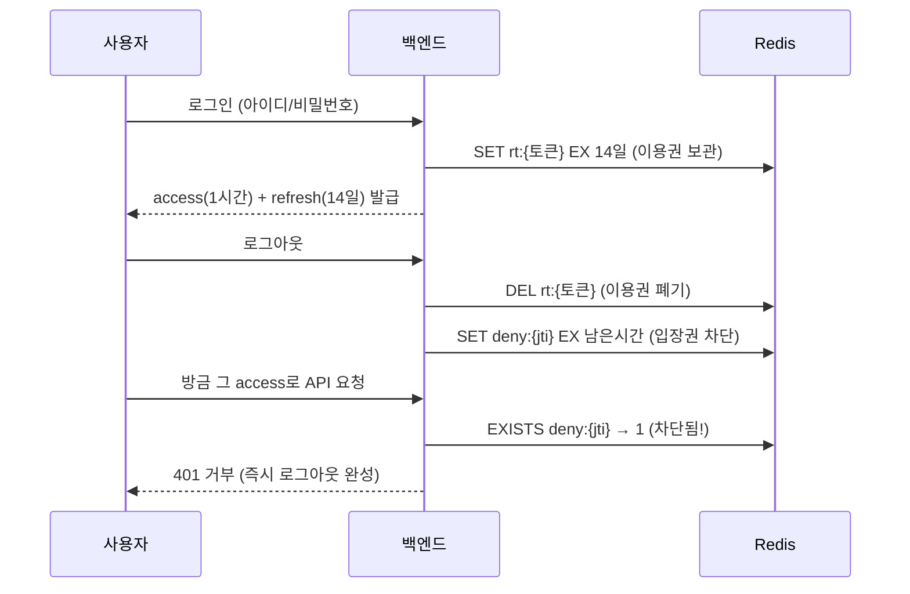

# Redis 기초 — 비전공자를 위한 첫걸음

> 이 문서는 **컴퓨터 전공 지식이 없어도** 읽을 수 있도록 쓴 Redis 입문 자료다.
> 설치(도커) → 기본 명령 → 유효기간(TTL) → 우리 게시판 프로젝트에서 직접 들여다보기까지,
> 모든 예제는 복사해서 그대로 실행할 수 있다.
> 우리 프로젝트에 Redis를 **어떻게 적용했는지**(설계·코드)는 [[REDIS-TOKEN]] 문서가 담당한다.

---

## 1. Redis가 뭔가요?

Redis는 **"이름표를 붙여 두는 초고속 보관함"** 이다.

일상 비유로 시작하자. 회사 로비의 **사물함**을 떠올려 보자.

- 사물함마다 **번호(이름표)** 가 붙어 있다 → Redis에서는 이걸 **key(키)** 라고 부른다.
- 사물함 안에 **물건** 을 넣는다 → Redis에서는 이걸 **value(값)** 라고 부른다.
- 필요할 때 번호만 대면 **즉시** 꺼내 준다 → Redis의 조회 속도.

그래서 Redis 사용법은 결국 딱 두 문장으로 요약된다.

| 하고 싶은 일 | 사물함 비유 | Redis 명령 |
|--------------|-------------|------------|
| 저장하기 | "37번 칸에 우산 넣어 주세요" | `SET 37번 우산` |
| 꺼내기 | "37번 칸에 뭐 있죠?" | `GET 37번` |

이런 방식을 **key-value 저장소**라고 부른다. 표(테이블)에 행과 열을 맞춰 넣는
MySQL 같은 데이터베이스보다 훨씬 단순한 구조다.

---

## 2. 왜 빠른가요? — 책상 위 vs 창고

컴퓨터에는 데이터를 두는 곳이 크게 두 군데 있다.

| | 메모리 (RAM) | 디스크 (SSD/HDD) |
|---|---|---|
| 비유 | **책상 위** 에 펼쳐 둔 서류 | **창고** 에 보관한 서류 상자 |
| 속도 | 손만 뻗으면 바로 (마이크로초) | 창고까지 다녀와야 함 (밀리초) |
| 전원이 꺼지면 | **사라진다** | 남는다 |
| 대표 제품 | **Redis** | MySQL, PostgreSQL |

Redis는 데이터를 **메모리에** 둔다. 그래서 MySQL보다 수십~수백 배 빠르지만,
서버가 꺼지면 내용이 사라질 수 있다는 약점이 있다.

> [!IMPORTANT]
> 그래서 Redis의 용도는 정해져 있다 — **"잠깐 기억했다가 잊어도 되는 것"**.
> 회원 정보나 게시글처럼 절대 잃으면 안 되는 데이터는 MySQL에,
> 로그인 상태·인증 토큰·조회수처럼 유효기간이 있거나 다시 만들 수 있는 데이터는 Redis에 둔다.
> 우리 프로젝트도 정확히 이 원칙을 따른다 (게시글 → MySQL, 토큰 → Redis).

---

## 3. 세상에서는 어디에 쓰나요?

- **캐시**: 자주 조회되는 결과를 Redis에 복사해 두고, DB 대신 즉시 응답 (뉴스 메인 화면 등)
- **로그인 상태 저장**: "이 사용자는 지금 로그인 중" 을 유효기간과 함께 기억
- **실시간 순위표**: 게임 랭킹, 실시간 검색어처럼 초 단위로 바뀌는 목록
- **선착순 처리**: 티켓팅·쿠폰 발급에서 "몇 번째 손님인지" 초고속으로 세기
- **우리 프로젝트**: 로그인 토큰 보관 + 로그아웃한 토큰 차단 ([[REDIS-TOKEN]], §9에서 소개)

---

## 4. 설치하기 — 도커 한 줄이면 끝

도커가 설치되어 있다면 Redis 설치는 명령 한 줄이다.

```bash
docker run -d --name my-redis redis:7-alpine
```

- `docker run -d`: 컨테이너를 백그라운드로 실행
- `--name my-redis`: 컨테이너 이름 (마음대로 지어도 됨)
- `redis:7-alpine`: Redis 7 버전의 초경량 이미지 (약 30MB)

잘 떴는지 확인:

```bash
docker ps --filter name=my-redis
```

이제 Redis와 대화할 수 있는 창구인 **redis-cli** 로 들어가 보자.
(cli = command line interface, "명령어로 대화하는 창")

```bash
docker exec -it my-redis redis-cli
```

프롬프트가 `127.0.0.1:6379>` 로 바뀌면 성공이다.
**6379** 는 Redis의 기본 포트 번호다. 첫인사를 건네 보자.

```
127.0.0.1:6379> PING
PONG
```

`PING` 을 보내면 `PONG` 으로 답한다 — "살아 있나요?" / "네, 살아 있어요!" 라는 뜻이다.
(우리 프로젝트의 docker-compose.yml도 이 `PING` 을 healthcheck로 쓴다.)

나가려면 `exit`, 실습이 끝나 컨테이너를 지우려면:

```bash
docker rm -f my-redis
```

> [!NOTE]
> **우리 프로젝트는 이미 Redis가 떠 있다.** `docker compose up -d` 를 하면
> `board-redis` 라는 이름의 컨테이너가 자동으로 실행된다. 그래서 §10 실습에서는
> `my-redis` 대신 `board-redis` 에 접속한다.

---

## 5. 기본 사용법 — 저장하고, 꺼내고, 지우기

redis-cli 안에서 그대로 따라 쳐 보자. (`127.0.0.1:6379>` 는 프롬프트이므로 입력하지 않는다)

### 5-1. SET — 저장하기

```
127.0.0.1:6379> SET greeting "안녕하세요"
OK
127.0.0.1:6379> SET lunch 김치찌개
OK
```

`SET 키 값` 형태다. `OK` 는 "잘 저장했어요" 라는 응답이다.
값에 띄어쓰기가 있으면 따옴표로 감싼다.

### 5-2. GET — 꺼내기

```
127.0.0.1:6379> GET lunch
"김치찌개"
127.0.0.1:6379> GET dinner
(nil)
```

없는 키를 물어보면 `(nil)` — "그런 사물함은 비어 있어요" 라는 뜻이다.
에러가 아니라 정상 응답이라는 점이 중요하다.

### 5-3. 덮어쓰기

같은 키에 다시 SET 하면 이전 값은 사라지고 새 값으로 바뀐다.

```
127.0.0.1:6379> SET lunch 돈까스
OK
127.0.0.1:6379> GET lunch
"돈까스"
```

### 5-4. DEL — 지우기, EXISTS — 있는지 확인

```
127.0.0.1:6379> DEL lunch
(integer) 1
127.0.0.1:6379> EXISTS lunch
(integer) 0
127.0.0.1:6379> EXISTS greeting
(integer) 1
```

- `DEL` 의 응답 `1` 은 "1개 지웠다"는 뜻 (없는 키를 지우면 `0`)
- `EXISTS` 는 있으면 `1`, 없으면 `0`

### 5-5. KEYS — 어떤 키들이 있는지 훑어보기

```
127.0.0.1:6379> SET user:1 김철수
OK
127.0.0.1:6379> SET user:2 이영희
OK
127.0.0.1:6379> KEYS user:*
1) "user:1"
2) "user:2"
127.0.0.1:6379> KEYS *
1) "user:1"
2) "user:2"
3) "greeting"
```

`*` 는 "아무거나" 라는 와일드카드다. `user:*` 는 "user: 로 시작하는 모든 키".

여기서 **Redis의 관례** 하나를 배웠다 — 키 이름에 콜론(`:`)을 넣어
`분류:번호` 처럼 계층을 표현한다. 폴더는 없지만 이름으로 폴더 흉내를 내는 것이다.
우리 프로젝트의 `rt:user:22` 같은 키도 이 관례를 따른 것이다.

> [!WARNING]
> `KEYS *` 는 **실습에서만** 쓰자. 키가 수백만 개인 운영 서버에서 실행하면
> 전체를 훑는 동안 Redis가 다른 요청을 처리하지 못한다. (운영에서는 `SCAN` 사용)

---

## 6. 유효기간(TTL) — Redis의 진짜 매력

Redis가 사랑받는 가장 큰 이유가 이 기능이다.
**키를 저장할 때 "몇 초 뒤에 자동으로 지워 주세요" 라고 예약**할 수 있다.

**주차권** 을 떠올리면 된다. 2시간짜리 주차권은 2시간이 지나면 저절로 무효가 된다.
주차장 직원이 일일이 돌아다니며 회수하지 않아도 된다.

### 6-1. EX 옵션 — 저장하면서 수명 정하기

```
127.0.0.1:6379> SET coupon "아메리카노 1잔 무료" EX 30
OK
```

`EX 30` = "30초 뒤 자동 삭제" (EX는 expire, '만료'의 약자).

### 6-2. TTL — 남은 수명 확인

TTL은 Time To Live, "살 수 있는 남은 시간" 이라는 뜻이다.

```
127.0.0.1:6379> TTL coupon
(integer) 27
127.0.0.1:6379> TTL coupon
(integer) 21
```

물어볼 때마다 숫자가 줄어든다. 30초가 지난 뒤에 다시 물어보면:

```
127.0.0.1:6379> GET coupon
(nil)
127.0.0.1:6379> TTL coupon
(integer) -2
```

쿠폰이 스스로 사라졌다! TTL의 특수 응답 두 가지는 기억해 두자.

| TTL 응답 | 의미 |
|----------|------|
| 양수 (예: 27) | 그 초 수만큼 뒤에 자동 삭제 |
| `-1` | 키는 있지만 유효기간이 **없음** (영구 보관) |
| `-2` | 그런 키가 **없음** (이미 사라졌거나 애초에 없음) |

### 6-3. EXPIRE — 이미 있는 키에 수명 붙이기

```
127.0.0.1:6379> SET notice "오늘 회식"
OK
127.0.0.1:6379> TTL notice
(integer) -1
127.0.0.1:6379> EXPIRE notice 60
(integer) 1
127.0.0.1:6379> TTL notice
(integer) 58
```

> [!IMPORTANT]
> 이 TTL이 **우리 프로젝트의 핵심 부품**이다. "로그인 유지 14일", "차단 목록은
> 토큰이 원래 죽는 시각까지만 보관" 같은 규칙을, 삭제 프로그램을 따로 짜지 않고
> Redis에게 통째로 맡긴다. MySQL이었다면 만료 데이터를 지우는 청소 작업을
> 우리가 직접 만들어 돌려야 했다.

---

## 7. 숫자 세기 — INCR

Redis는 값이 숫자면 **더하기를 대신 해 준다**.

```
127.0.0.1:6379> SET visitors 0
OK
127.0.0.1:6379> INCR visitors
(integer) 1
127.0.0.1:6379> INCR visitors
(integer) 2
127.0.0.1:6379> INCR visitors
(integer) 3
127.0.0.1:6379> GET visitors
"3"
```

`INCR` (increment, 증가)는 "읽고 → 1 더하고 → 저장" 을 **한 번에** 처리한다.
수천 명이 동시에 눌러도 숫자가 꼬이지 않아서, 조회수·좋아요·선착순 카운터에 널리 쓰인다.
(반대는 `DECR`)

---

## 8. 자료구조 맛보기 — 목록과 카드

지금까지 쓴 것은 **String**(문자열) 타입이다. Redis에는 몇 가지 타입이 더 있는데,
두 가지만 맛보자. (우리 프로젝트는 String만 사용하므로 가볍게 읽고 넘어가도 된다)

**List — 순서 있는 목록** (할 일 목록):

```
127.0.0.1:6379> RPUSH todo "장보기" "청소" "운동"
(integer) 3
127.0.0.1:6379> LRANGE todo 0 -1
1) "장보기"
2) "청소"
3) "운동"
```

`RPUSH` 는 오른쪽(뒤)에 추가, `LRANGE 키 0 -1` 은 "처음부터 끝까지 보여줘".

**Hash — 항목이 여러 개인 카드** (프로필 카드):

```
127.0.0.1:6379> HSET profile:kim name "김철수" age 30 city "서울"
(integer) 3
127.0.0.1:6379> HGET profile:kim city
"서울"
127.0.0.1:6379> HGETALL profile:kim
1) "name"
2) "김철수"
3) "age"
4) "30"
5) "city"
6) "서울"
```

키 하나 안에 `이름=값` 쌍을 여러 개 담는, 작은 서랍장 같은 구조다.

---

## 9. 우리 게시판 프로젝트에서 Redis가 하는 일

단계 15에서 우리는 Redis를 **로그인 토큰 금고**로 쓰기 시작했다. 등장인물은 두 명이다.

- **refresh token**: "로그인을 14일간 유지해 주는 장기 이용권". Redis에 **보관**한다.
- **access token**: "1시간짜리 입장권". 보관하지 않지만, 로그아웃하면 남은 시간 동안
  **차단 목록**에 올린다 (입장권 번호를 출입구에 붙여 두는 것).

Redis에는 딱 **세 종류의 키**가 생긴다.

| 키 모양 | 값 | 유효기간 | 뜻 |
|---------|-----|----------|-----|
| `rt:{refresh토큰}` | 사용자 번호 | 14일 (1209600초) | "이 이용권의 주인은 22번 사용자" |
| `rt:user:{사용자번호}` | refresh 토큰 | 14일 | "22번 사용자의 현재 이용권은 이것" (1인 1장 보장) |
| `deny:{jti}` | `"1"` | 토큰의 남은 수명 | "이 입장권 번호는 차단됨" (jti = 토큰마다 새겨진 일련번호) |

로그인부터 로그아웃까지의 흐름:



세 키 모두 §6에서 배운 **TTL** 덕분에 때가 되면 스스로 사라진다.
14일이 지난 이용권도, 원래 수명이 다한 차단 기록도 우리가 청소할 필요가 없다.

---

## 10. 수동 실습 — 서버가 하는 일을 내 손으로 구경하기

이제 §5~6에서 배운 명령만으로, 백엔드가 Redis에 무엇을 쓰고 지우는지 직접 확인해 보자.

**준비**: 프로젝트가 떠 있어야 한다.

```bash
docker compose up -d
docker ps --filter name=board-redis   # Up (healthy) 확인
```

### 10-1. Redis 안으로 들어가기

`board-redis` 는 보안상 바깥 포트를 열지 않았으므로, 컨테이너 안의 redis-cli로 들어간다.

```bash
docker exec -it board-redis redis-cli
```

```
127.0.0.1:6379> PING
PONG
127.0.0.1:6379> KEYS *
(empty array)
```

아직 아무도 로그인하지 않았다면 텅 비어 있다.

### 10-2. 로그인해서 키가 생기는 순간 목격하기

**다른 터미널**을 하나 더 열고 회원가입 + 로그인한다.
(이미 계정이 있으면 로그인만 하면 된다)

```bash
# 회원가입 (1회만)
curl -s -X POST http://localhost/api/v1/auth/signup \
  -H "Content-Type: application/json" \
  -d '{"username":"redisstudy","email":"redisstudy@test.com","password":"pass1234!","nickname":"레디스학생"}'

# 로그인 — refresh 토큰(쿠키)은 cookies.txt에 저장
curl -s -X POST http://localhost/api/v1/auth/login \
  -H "Content-Type: application/json" \
  -c cookies.txt \
  -d '{"username":"redisstudy","password":"pass1234!"}'
```

이제 redis-cli 터미널로 돌아가서:

```
127.0.0.1:6379> KEYS rt:*
1) "rt:user:23"
2) "rt:6f2a9c31-...(긴 문자열)..."
```

방금 로그인 한 번으로 §9의 표에서 본 **키 두 개**가 생겼다! 안을 들여다보자.

```
127.0.0.1:6379> GET rt:user:23
"6f2a9c31-...(긴 문자열)..."
127.0.0.1:6379> TTL rt:user:23
(integer) 1209581
```

- `GET`: 23번 사용자의 현재 refresh 토큰이 들어 있다 (서로를 가리키는 쌍둥이 키).
- `TTL`: 1209581초 ≈ **14일**. 로그인한 지 몇 초 지나서 1209600에서 조금 줄어 있다.

### 10-3. 다시 로그인하면? — 이용권은 1인 1장

같은 계정으로 로그인 curl을 한 번 더 실행한 뒤 키를 보자.

```
127.0.0.1:6379> KEYS rt:*
1) "rt:user:23"
2) "rt:e81b4d02-...(아까와 다른 문자열)..."
```

키는 여전히 2개다. 서버가 **옛 이용권을 지우고 새 이용권으로 교체**했기 때문이다
(`RedisRefreshTokenStore.save` 가 옛 `rt:` 키를 DEL 하고 새로 SET 한다).

### 10-4. 로그아웃 — 차단 목록이 생기는 순간

로그인 응답의 `accessToken` 값을 복사해서 로그아웃한다.

```bash
# 로그인해서 access 토큰을 변수에 담고
ACCESS=$(curl -s -X POST http://localhost/api/v1/auth/login \
  -H "Content-Type: application/json" -c cookies.txt \
  -d '{"username":"redisstudy","password":"pass1234!"}' | \
  python3 -c "import sys, json; print(json.load(sys.stdin)['accessToken'])")

# 그 토큰으로 로그아웃
curl -s -X POST http://localhost/api/v1/auth/logout \
  -H "Authorization: Bearer $ACCESS" -b cookies.txt -w "%{http_code}\n"
```

redis-cli에서:

```
127.0.0.1:6379> KEYS rt:*
(empty array)
127.0.0.1:6379> KEYS deny:*
1) "deny:0b7c4e9a-...(jti)..."
127.0.0.1:6379> TTL deny:0b7c4e9a-...
(integer) 3594
```

- `rt:*` 가 **사라졌다** — 이용권 폐기 (DEL).
- `deny:{jti}` 가 **새로 생겼다** — 방금 쓰던 입장권의 일련번호가 차단 목록에 올랐다.
- TTL이 약 3600초(1시간) — 그 입장권이 어차피 죽는 시각까지만 기억하면 되기 때문이다.

차단이 실제로 동작하는지 확인:

```bash
curl -s -o /dev/null -w "%{http_code}\n" \
  -H "Authorization: Bearer $ACCESS" http://localhost/api/v1/notifications
```

`401` — 아직 수명이 1시간 남은 멀쩡한 토큰인데도 **즉시 거부**된다.
이것이 단계 15가 만든 "진짜 로그아웃"이고, 그 실체는 방금 본 `deny:` 키 하나다.

### 10-5. 손으로 강제 로그아웃 시켜 보기 (관리자 놀이)

서버 코드를 거치지 않고, redis-cli에서 **직접 이용권을 찢어** 보자.
로그인만 다시 한 상태에서:

```
127.0.0.1:6379> GET rt:user:23
"e81b4d02-..."
127.0.0.1:6379> DEL rt:e81b4d02-... rt:user:23
(integer) 2
```

이제 이 사용자의 refresh 토큰은 금고에 없다. 브라우저(쿠키)가 토큰 연장을 시도하면:

```bash
curl -s -o /dev/null -w "%{http_code}\n" -b cookies.txt \
  -X POST http://localhost/api/v1/auth/reissue
```

`401` — 14일짜리 이용권이 남아 있어도 금고에서 지워지면 끝이다.
관리자가 특정 사용자를 강제 로그아웃시키는 기능도 원리는 이 `DEL` 두 줄이다.

### 10-6. (심화) deny 키의 jti는 어디서 왔나

access 토큰은 `머리.내용.서명` 세 부분을 점(`.`)으로 이은 문자열이고,
가운데 '내용'은 base64라는 방식으로 포장되어 있을 뿐 비밀이 아니다. 풀어 보면:

```bash
echo "$ACCESS" | cut -d '.' -f 2 | python3 -c "
import sys, base64, json
s = sys.stdin.read().strip()
data = base64.urlsafe_b64decode(s + '=' * (-len(s) % 4))
print(json.dumps(json.loads(data), indent=2, ensure_ascii=False))
"
```

```json
{
  "sub": "redisstudy",
  "jti": "0b7c4e9a-...",
  "iat": 1756425600,
  "exp": 1756429200
}
```

`jti` 값이 10-4에서 본 `deny:` 키의 뒷부분과 **정확히 일치**한다.
서버는 요청이 올 때마다 토큰에서 jti를 꺼내 `EXISTS deny:{jti}` 한 번으로 차단 여부를 판정한다.

---

## 11. 조심할 것들

- **`FLUSHALL` 은 절대 금지** — Redis의 **모든 키를 즉시 전부 삭제**하는 명령이다.
  우리 프로젝트에서 실행하면 전체 사용자가 한꺼번에 로그아웃된다. 비슷한 `FLUSHDB`도 마찬가지.
- **`KEYS *` 는 실습 전용** — §5-5의 경고 참고. 운영에서는 `SCAN`.
- **Redis는 사라질 수 있는 저장소다** — `board-redis` 가 재시작되면 토큰이 모두 사라진다.
  결과는 "전원 재로그인"일 뿐 데이터 유실이 아니므로 우리 용도에는 허용된 트레이드오프다
  (그래서 게시글·회원 정보는 여전히 MySQL에 있다).
- **우리 Redis에 비밀번호가 없는 이유** — `board-redis` 는 도커 내부 네트워크(board-db-net)
  전용이고 바깥 포트를 열지 않았다. 외부에 포트를 여는 순간 `requirepass` 설정이 필수가 된다.
- **`--maxmemory-policy noeviction`** — 메모리가 꽉 차면 아무 키나 지우는(=아무나 강제
  로그아웃되는) 사고를 막기 위해, 우리 compose는 "지우지 말고 쓰기를 거부하라"로 설정했다.

---

## 12. 명령 요약표

| 명령 | 하는 일 | 예 |
|------|---------|-----|
| `PING` | 살아 있는지 확인 | `PING` → `PONG` |
| `SET k v` | 저장 (덮어쓰기) | `SET lunch 김치찌개` |
| `SET k v EX n` | n초 수명과 함께 저장 | `SET coupon 무료 EX 30` |
| `GET k` | 조회 (없으면 nil) | `GET lunch` |
| `DEL k ...` | 삭제 | `DEL lunch` |
| `EXISTS k` | 있으면 1, 없으면 0 | `EXISTS lunch` |
| `KEYS 패턴` | 키 훑어보기 (실습 전용) | `KEYS rt:*` |
| `TTL k` | 남은 수명 (-1 영구, -2 없음) | `TTL coupon` |
| `EXPIRE k n` | 기존 키에 수명 부여 | `EXPIRE notice 60` |
| `INCR k` | 1 더하기 (동시성 안전) | `INCR visitors` |

다음 단계: 이 부품들이 실제 코드(`RedisRefreshTokenStore`, `RedisTokenDenylist`)에서
어떻게 조립되는지는 [[REDIS-TOKEN]] 에서 이어진다.
