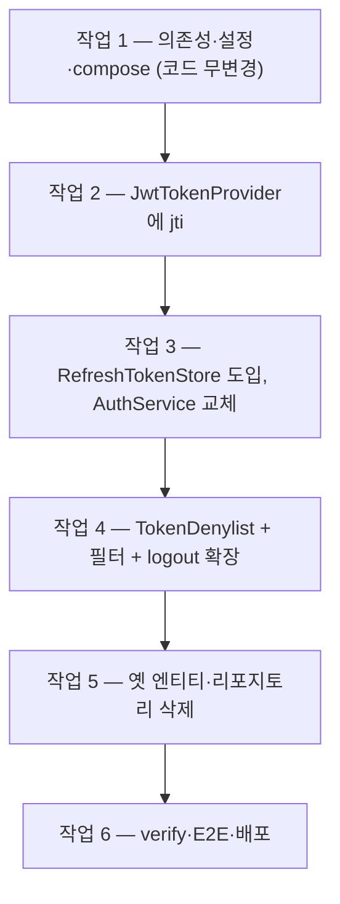

# 단계 15 따라하기 — 파일별·작업 순서별 구현 기록

> **무엇을 왜** 바꾸는지(설계·트레이드오프)는 [[REDIS-TOKEN]]이,
> Redis 명령 자체가 처음이라면 [[REDIS-BASICS]]가 선수 문서다.
> 이 문서는 **어느 파일에 어떤 코드를 어떤 순서로** 넣었는지의 재현 기록이다 —
> 단계 13까지 완성된 코드에서 시작해 그대로 따라 치면 같은 결과에 도달한다.
> 모든 스니펫은 머지된 실제 커밋(`7e592a5`)과 동일하다.

---

## 0. 작업 지도

여섯 작업의 순서와 의존 관계. 핵심 원칙은 **"매 작업이 끝날 때마다 컴파일되고 테스트가 green"** —
한 번에 다 바꾸고 한 번에 고치는 방식은 어디서 깨졌는지 알 수 없게 만든다.



| 작업 | 만드는 것 | 고치는 것 | 끝났을 때 상태 |
|------|-----------|-----------|----------------|
| 1 | compose `redis` 서비스 | `build.gradle`, `application.yaml`, `docker-compose.yml` | 앱 동작 불변, redis 컨테이너 healthy |
| 2 | — | `JwtTokenProvider` (+테스트 2개) | 토큰에 jti 실림, 전체 green |
| 3 | `RefreshTokenStore` + Redis/InMemory 구현 + `TestTokenStoreConfig` | `AuthService`, `ErrorCode`, 테스트 3파일 | refresh가 Redis로, 전체 green |
| 4 | `TokenDenylist` + Redis/InMemory 구현 | `JwtAuthenticationFilter`, `AuthController`, `AuthService.logout`, 테스트 2파일 | 로그아웃 즉시 401, 전체 green |
| 5 | — | `RefreshToken`·`RefreshTokenRepository` **삭제** | JPA 잔재 0, 전체 green |
| 6 | — | — | verify PASSED, E2E 실증, 배포 |

---

## 작업 1. 의존성·설정·인프라 — 코드는 한 줄도 안 바꾼다

먼저 발밑(인프라)부터 깐다. 이 작업이 끝나도 앱 동작은 완전히 동일하다 —
Redis 자동설정은 연결을 미리 만들지 않아, 붙는 코드가 없으면 있으나 마나이기 때문이다.

**① `build.gradle`** — dependencies 블록에 1줄:

```groovy
  // 단계 15: refresh token 저장소(TTL)·access denylist — Redis(StringRedisTemplate)
  implementation 'org.springframework.boot:spring-boot-starter-data-redis'
```

버전을 안 적는 이유·starter가 끌어오는 것들은 [[REDIS-TOKEN]] §E 참고.

**② `src/main/resources/application.yaml`** — `spring:` 아래 (`datasource:` 위):

```yaml
  # 단계 15: Redis — refresh token 저장소(TTL) + access token denylist.
  # 로컬 IDE 실행은 localhost, 도커/서버는 compose가 REDIS_HOST=redis 주입.
  data:
    redis:
      host: ${REDIS_HOST:localhost}
      port: ${REDIS_PORT:6379}
```

`DB_HOST` 패턴 그대로다 — Secret이 아니라 배선이므로 GitHub Secrets 변경도 없다.

**③ `docker-compose.yml`** — 서비스 하나 추가 + `app`에 두 줄:

```yaml
  # 단계 15: 토큰 저장소(refresh TTL + access denylist). 데이터 휘발 허용 설계라
  # compose가 수명주기를 관리한다(mysql-8과 달리 external 아님). host publish 없음(비공개).
  redis:
    image: redis:7-alpine
    container_name: board-redis
    # maxmemory 64mb: 2GB 인스턴스 예산 배려. noeviction: 토큰 임의 축출=강제 로그아웃이므로 금지
    command: ["redis-server", "--maxmemory", "64mb", "--maxmemory-policy", "noeviction"]
    networks:
      - board-db-net
    healthcheck:
      test: ["CMD", "redis-cli", "ping"]
      interval: 10s
      timeout: 3s
      retries: 6
    restart: unless-stopped
```

`app` 서비스에는:

```yaml
    depends_on:
      redis:
        condition: service_healthy   # 단계 15: 토큰 저장소가 준비된 뒤 앱 시작
    environment:
      REDIS_HOST: redis            # 단계 15: 같은 네트워크의 redis 서비스명
```

**체크포인트 1**:

```bash
./gradlew build                          # green — 코드 무변경이므로 당연
docker compose up -d redis
docker ps --filter name=board-redis      # (healthy)
docker exec board-redis redis-cli ping   # PONG
```

---

## 작업 2. `JwtTokenProvider` — 토큰에 이름표(jti)를 새긴다

denylist의 키가 될 **토큰 고유 식별자**를 먼저 준비한다. 이 작업만 떼어 앞세우는 이유:
발급 코드가 바뀌어도 **기존 토큰 검증에는 영향이 없어서**(클레임 추가는 하위 호환) 안전하게
먼저 배포·검증할 수 있는 독립 변경이기 때문이다.

**`src/main/java/com/example/board/auth/jwt/JwtTokenProvider.java`**

`createToken`의 빌더에 1줄 (수정 전에는 sub/iat/exp뿐이었다):

```java
    return Jwts.builder()
        .subject(username)                   // sub 클레임 = username
        .id(UUID.randomUUID().toString())    // jti = 토큰 고유 식별자 — denylist의 키 (단계 15)
        .issuedAt(now)                       // iat = 발급 시각
        .expiration(expiration)              // exp = 만료 시각
        .signWith(key)                       // 시크릿으로 서명 (위조 방지)
        .compact();
```

(`import java.util.UUID;` 추가)

이어서 클레임 조회 메서드. **수정 전** `getUsername`은 파싱 로직을 통째로 품고 있었다:

```java
  // 수정 전
  public String getUsername(String token) {
    return Jwts.parser()
        .verifyWith(key)
        .build()
        .parseSignedClaims(token)
        .getPayload()
        .getSubject();
  }
```

**수정 후** — 파싱을 `parseClaims`로 추출하고, jti·잔여수명 조회를 얹는다:

```java
  public String getUsername(String token) {
    return parseClaims(token).getSubject();
  }

  // 단계 15: 토큰 고유 식별자(jti) — 폐기(denylist) 등록·조회의 키
  public String getJti(String token) {
    return parseClaims(token).getId();
  }

  // 단계 15: 토큰의 남은 유효초 — denylist 항목의 TTL로 쓴다(자연 만료와 함께 키도 소멸)
  public long getRemainingSeconds(String token) {
    long remainMillis = parseClaims(token).getExpiration().getTime() - System.currentTimeMillis();
    return Math.max(1, remainMillis / 1000);   // 최소 1초 — 이미 만료 직전이어도 등록은 성립
  }

  private io.jsonwebtoken.Claims parseClaims(String token) {
    return Jwts.parser()
        .verifyWith(key)            // 서명 검증
        .build()
        .parseSignedClaims(token)   // 검증 실패·만료 시 예외 발생
        .getPayload();
  }
```

**테스트 추가** — `src/test/java/com/example/board/auth/jwt/JwtTokenProviderTest.java`:

```java
  // 단계 15: 토큰마다 고유 jti가 발급된다 — denylist의 키
  @Test
  void should_issueUniqueJti_perToken() {
    String t1 = provider.createToken("tester");
    String t2 = provider.createToken("tester");
    org.assertj.core.api.Assertions.assertThat(provider.getJti(t1)).isNotBlank();
    org.assertj.core.api.Assertions.assertThat(provider.getJti(t1))
        .isNotEqualTo(provider.getJti(t2));
  }

  // 단계 15: 남은 유효초는 denylist TTL로 쓰인다 — 0 < remaining ≤ 설정값
  @Test
  void should_returnRemainingSeconds_withinValidity() {
    String token = provider.createToken("tester");
    long remaining = provider.getRemainingSeconds(token);
    org.assertj.core.api.Assertions.assertThat(remaining).isPositive().isLessThanOrEqualTo(3600);
  }
```

**체크포인트 2**: `./gradlew test` — 전체 green (기존 테스트는 jti 추가에 무관심하다).

---

## 작업 3. `RefreshTokenStore` — refresh token이 MySQL을 떠나 Redis로 간다

가장 큰 작업. 순서가 중요하다: **인터페이스 → 두 구현 → 테스트 대체물 → 그다음에야 AuthService를 교체**한다.
갈아탈 곳을 다 지어 놓고 이사하는 순서라야 중간 상태에서도 항상 컴파일된다.

### 3-1. 인터페이스 (신규)

**`src/main/java/com/example/board/auth/token/RefreshTokenStore.java`**

```java
package com.example.board.auth.token;

import java.util.Optional;

// 단계 15: refresh token 저장소 추상화.
// 기존 RefreshTokenRepository(JPA)의 세 연산을 그대로 승계하되, 구현을 인터페이스 뒤로 숨긴다 —
// production은 Redis(TTL), 테스트는 InMemory로 갈아끼운다(단계 2에서 H2가 MySQL을 대신한 것과 같은 구도).
public interface RefreshTokenStore {

  // 사용자당 1개 불변식: 기존 토큰이 있으면 교체(옛 토큰은 즉시 무효)
  void save(Long userId, String token, long ttlSeconds);

  // 토큰으로 소유자 조회. 비어 있으면 "무효" — TTL이 만료 검사를 대신하므로 만료 분기가 따로 없다
  Optional<Long> findUserId(String token);

  // 로그아웃 — 이미 없어도 조용히 통과(멱등)
  void deleteByToken(String token);
}
```

### 3-2. Redis 구현 (신규)

**`src/main/java/com/example/board/auth/token/RedisRefreshTokenStore.java`**

```java
package com.example.board.auth.token;

import java.time.Duration;
import java.util.Optional;
import lombok.RequiredArgsConstructor;
import org.springframework.data.redis.core.StringRedisTemplate;
import org.springframework.stereotype.Component;

// 단계 15: refresh token의 Redis 구현 — 양방향 2키 1쌍 스키마.
//   rt:{token}       → userId   (reissue/logout의 findByToken 경로)
//   rt:user:{userId} → token    (재로그인 시 기존 토큰을 찾아 폐기 — 사용자당 1개 불변식)
// 두 키 모두 TTL 14일 — 만료되면 키가 사라지므로 "없음 = 무효" 하나로 단순해진다.
@Component
@RequiredArgsConstructor
public class RedisRefreshTokenStore implements RefreshTokenStore {

  private static final String TOKEN_KEY_PREFIX = "rt:";
  private static final String USER_KEY_PREFIX = "rt:user:";

  private final StringRedisTemplate redis;

  @Override
  public void save(Long userId, String token, long ttlSeconds) {
    // 기존 토큰이 있으면 먼저 폐기 — 옛 refresh token으로는 더 이상 재발급이 안 된다
    String oldToken = redis.opsForValue().get(USER_KEY_PREFIX + userId);
    if (oldToken != null) {
      redis.delete(TOKEN_KEY_PREFIX + oldToken);
    }
    Duration ttl = Duration.ofSeconds(ttlSeconds);
    redis.opsForValue().set(TOKEN_KEY_PREFIX + token, String.valueOf(userId), ttl);
    redis.opsForValue().set(USER_KEY_PREFIX + userId, token, ttl);
  }

  @Override
  public Optional<Long> findUserId(String token) {
    String userId = redis.opsForValue().get(TOKEN_KEY_PREFIX + token);
    return Optional.ofNullable(userId).map(Long::valueOf);
  }

  @Override
  public void deleteByToken(String token) {
    String userId = redis.opsForValue().get(TOKEN_KEY_PREFIX + token);
    redis.delete(TOKEN_KEY_PREFIX + token);
    if (userId != null) {
      redis.delete(USER_KEY_PREFIX + userId);
    }
  }
}
```

`StringRedisTemplate`은 starter가 자동으로 빈으로 등록해 주므로 그냥 주입받으면 된다.
[[REDIS-BASICS]] §5~6의 `SET`/`GET`/`DEL`/`EX`가 메서드로 바뀐 것뿐임을 눈여겨보자.

### 3-3. 테스트 대체물 (신규, `src/test` 쪽)

**`src/test/java/com/example/board/auth/token/InMemoryRefreshTokenStore.java`**

```java
package com.example.board.auth.token;

import java.util.Map;
import java.util.Optional;
import java.util.concurrent.ConcurrentHashMap;

// 단계 15: 테스트용 InMemory 구현 — H2가 MySQL을 대신하듯, 테스트에서 Redis를 대신한다.
// 저장소를 인터페이스 뒤로 숨긴 덕에 이렇게 갈아끼울 수 있다는 것 자체가 이 단계의 학습 포인트.
// TTL은 테스트 관점에서 의미가 없어 기록만 하고 강제하지 않는다(만료 시나리오 = 키 삭제로 표현).
public class InMemoryRefreshTokenStore implements RefreshTokenStore {

  private final Map<String, Long> tokenToUser = new ConcurrentHashMap<>();
  private final Map<Long, String> userToToken = new ConcurrentHashMap<>();

  @Override
  public void save(Long userId, String token, long ttlSeconds) {
    String old = userToToken.get(userId);
    if (old != null) {
      tokenToUser.remove(old);          // 사용자당 1개 — 기존 토큰 교체
    }
    tokenToUser.put(token, userId);
    userToToken.put(userId, token);
  }

  @Override
  public Optional<Long> findUserId(String token) {
    return Optional.ofNullable(tokenToUser.get(token));
  }

  @Override
  public void deleteByToken(String token) {
    Long userId = tokenToUser.remove(token);
    if (userId != null) {
      userToToken.remove(userId);
    }
  }

  // 테스트 격리용 — @Transactional 롤백은 인메모리 Map을 되돌리지 못하므로 직접 비운다
  public void clear() {
    tokenToUser.clear();
    userToToken.clear();
  }
}
```

**`src/test/java/com/example/board/support/TestTokenStoreConfig.java`** — 모든 `@SpringBootTest`가
자동으로 InMemory를 쓰게 만드는 스위치 (denylist 빈은 작업 4에서 추가된다):

```java
package com.example.board.support;

import com.example.board.auth.token.InMemoryRefreshTokenStore;
import com.example.board.auth.token.RefreshTokenStore;
import org.springframework.context.annotation.Bean;
import org.springframework.context.annotation.Configuration;
import org.springframework.context.annotation.Primary;

// 단계 15: 모든 @SpringBootTest 컨텍스트에서 Redis 구현을 InMemory로 대체한다.
// 테스트 클래스패스의 @Configuration은 BoardApplication 컴포넌트 스캔 범위(com.example.board)에
// 있어 자동으로 적용된다 — @Primary가 Redis 빈 대신 이 빈들을 주입시킨다.
// (test/resources의 H2 application.yaml이 MySQL을 대체하는 것과 같은 원리의 "테스트 대체물")
@Configuration
public class TestTokenStoreConfig {

  @Bean
  @Primary
  public RefreshTokenStore inMemoryRefreshTokenStore() {
    return new InMemoryRefreshTokenStore();
  }
}
```

**계약 테스트** — 어떤 구현이든 지켜야 할 규칙을 명세로 박아 둔다.
**`src/test/java/com/example/board/auth/token/RefreshTokenStoreContractTest.java`**:

```java
package com.example.board.auth.token;

import static org.assertj.core.api.Assertions.assertThat;

import org.junit.jupiter.api.Test;

// 단계 15: RefreshTokenStore "계약" 테스트 — 어떤 구현이든 지켜야 할 규칙을 InMemory로 검증.
// (Redis 구현은 같은 인터페이스라 로컬 compose E2E에서 동일 계약을 실증한다)
class RefreshTokenStoreContractTest {

  private final RefreshTokenStore store = new InMemoryRefreshTokenStore();

  @Test
  void should_findUserId_afterSave() {
    store.save(1L, "token-a", 60);
    assertThat(store.findUserId("token-a")).contains(1L);
  }

  @Test
  void should_invalidateOldToken_whenUserSavesAgain() {
    store.save(1L, "token-a", 60);
    store.save(1L, "token-b", 60);          // 재로그인 — 사용자당 1개 불변식
    assertThat(store.findUserId("token-a")).isEmpty();
    assertThat(store.findUserId("token-b")).contains(1L);
  }

  @Test
  void should_returnEmpty_whenTokenUnknownOrDeleted() {
    assertThat(store.findUserId("no-such")).isEmpty();
    store.save(1L, "token-a", 60);
    store.deleteByToken("token-a");
    assertThat(store.findUserId("token-a")).isEmpty();
    store.deleteByToken("token-a");          // 멱등 — 두 번 지워도 예외 없음
  }

  @Test
  void should_isolateUsers() {
    store.save(1L, "token-a", 60);
    store.save(2L, "token-b", 60);
    store.deleteByToken("token-a");
    assertThat(store.findUserId("token-b")).contains(2L);   // 남의 토큰은 무사
  }
}
```

### 3-4. `AuthService` 교체 — 이사 본번

**`src/main/java/com/example/board/auth/AuthService.java`**

필드 교체 (import에 `RefreshTokenStore` 추가, `LocalDateTime` 제거):

```java
  // 수정 전
  private final RefreshTokenRepository refreshTokenRepository;

  // 수정 후
  // 단계 15 처리에 의해 제거: RefreshTokenRepository(JPA) → RefreshTokenStore(Redis, TTL)
  private final RefreshTokenStore refreshTokenStore;
```

`issueRefreshToken` — upsert 로직이 통째로 사라진다:

```java
  // 수정 전
  private String issueRefreshToken(Long userId) {
    String token = UUID.randomUUID().toString();
    LocalDateTime expiresAt = LocalDateTime.now().plusSeconds(refreshTokenValiditySeconds);
    refreshTokenRepository.findByUserId(userId)
        .ifPresentOrElse(
            existing -> existing.update(token, expiresAt),
            () -> refreshTokenRepository.save(new RefreshToken(userId, token, expiresAt)));
    return token;
  }

  // 수정 후 — 만료는 저장소의 TTL이 관리한다(단계 15)
  private String issueRefreshToken(Long userId) {
    String token = UUID.randomUUID().toString();
    refreshTokenStore.save(userId, token, refreshTokenValiditySeconds);
    return token;
  }
```

`reissue` — **만료 분기가 소멸**하는 이 단계의 백미. 쓰기가 없어졌으니 `readOnly`로:

```java
  // 수정 전
  @Transactional
  public TokenPair reissue(String refreshToken) {
    RefreshToken stored = refreshTokenRepository.findByToken(refreshToken)
        .orElseThrow(() -> new UnauthorizedException(ErrorCode.INVALID_REFRESH_TOKEN));
    if (stored.isExpired()) {
      refreshTokenRepository.delete(stored);
      throw new UnauthorizedException(ErrorCode.EXPIRED_REFRESH_TOKEN);
    }
    User user = userRepository.findById(stored.getUserId())
        .orElseThrow(() -> new UnauthorizedException(ErrorCode.INVALID_REFRESH_TOKEN));
    ...

  // 수정 후
  @Transactional(readOnly = true)
  public TokenPair reissue(String refreshToken) {
    // 단계 15: 만료 분기(isExpired → EXPIRED_REFRESH_TOKEN)가 소멸했다 —
    // TTL이 지나면 키 자체가 사라지므로 "없음 = 무효" 한 가지로 단순해진다.
    Long userId = refreshTokenStore.findUserId(refreshToken)
        .orElseThrow(() -> new UnauthorizedException(ErrorCode.INVALID_REFRESH_TOKEN));
    User user = userRepository.findById(userId)
        .orElseThrow(() -> new UnauthorizedException(ErrorCode.INVALID_REFRESH_TOKEN));
    ...
```

`logout` — 이 작업에서는 저장소만 교체한다 (시그니처 확장은 작업 4):

```java
  public void logout(String refreshToken) {
    refreshTokenStore.deleteByToken(refreshToken);
  }
```

### 3-5. 딸린 정리

**`ErrorCode.java`** — 사용처가 사라진 상수는 지우지 않고 주석으로 봉인한다
(이전 단계 문서·수강생 코드가 참조할 수 있으므로):

```java
  // 단계 15 처리에 의해 미사용 — TTL 만료 시 키가 사라져 "없음=무효(INVALID)"로 단일화됨. 교육용으로 상수는 보존.
  EXPIRED_REFRESH_TOKEN(HttpStatus.UNAUTHORIZED, "만료된 refresh token입니다. 다시 로그인하세요."),
```

**`AuthServiceTest.java`** — 저장 검증을 저장소 인터페이스로 교체:

```java
  // 수정 전
  RefreshToken stored = refreshTokenRepository.findByUserId(userId).orElseThrow();
  assertThat(stored.getToken()).isEqualTo(tokens.refreshToken());
  assertThat(stored.isExpired()).isFalse();

  // 수정 후 — 단계 15: 저장소가 토큰→사용자 매핑을 보관한다 (만료는 TTL 관할이라 검사 항목이 아님)
  assertThat(refreshTokenStore.findUserId(tokens.refreshToken())).contains(userId);
```

같은 파일에서 두 가지가 더 바뀐다:

- `should_throwExpiredRefreshToken_when...` 테스트 **삭제** — 검증 대상 분기 자체가 소멸했다.
  "만료 = 키 부재 = INVALID"이므로 기존 not-found 테스트가 그 경로를 이미 커버한다.
- `@BeforeEach`로 인메모리 저장소 비우기 — **`@Transactional` 롤백은 DB만 되돌리고
  인메모리 Map은 못 되돌린다**는, 테스트 대체물의 대표적 함정:

```java
  // @Transactional 롤백은 인메모리 저장소를 되돌리지 못하므로 테스트마다 직접 비운다
  @BeforeEach
  void clearTokenStores() {
    ((InMemoryRefreshTokenStore) refreshTokenStore).clear();
  }
```

**`KakaoOAuthServiceTest.java`** — 같은 교체 1곳:

```java
  // 수정 전
  assertThat(refreshTokenRepository.findByToken(tokens.refreshToken())).isPresent();
  // 수정 후
  assertThat(refreshTokenStore.findUserId(tokens.refreshToken())).isPresent();
```

**체크포인트 3**: `./gradlew test` — 전체 green.
이 시점에 `RefreshToken`/`RefreshTokenRepository`는 **아무도 참조하지 않지만 아직 존재**한다(작업 5에서 삭제).

---

## 작업 4. `TokenDenylist` — 로그아웃이 "진짜"가 된다

### 4-1. 인터페이스 + 구현 (신규)

**`src/main/java/com/example/board/auth/token/TokenDenylist.java`**

```java
package com.example.board.auth.token;

// 단계 15: access token 즉시 폐기 목록(denylist).
// stateless JWT는 발급 후 만료까지 서버가 막을 수 없다는 한계(단계 2)를 해소한다 —
// 로그아웃 시 jti를 "남은 유효시간"만큼 등록하면, 토큰이 자연 만료되는 순간 키도 함께
// 사라지므로 목록이 무한히 쌓이지 않는다(자기정리). 매 요청 조회는 Redis라서 성립하는 비용.
public interface TokenDenylist {

  void deny(String jti, long remainingSeconds);

  boolean isDenied(String jti);
}
```

**`src/main/java/com/example/board/auth/token/RedisTokenDenylist.java`**

```java
package com.example.board.auth.token;

import java.time.Duration;
import lombok.RequiredArgsConstructor;
import org.springframework.data.redis.core.StringRedisTemplate;
import org.springframework.stereotype.Component;

// 단계 15: denylist의 Redis 구현 — deny:{jti} 키를 토큰의 남은 유효초만큼만 보관.
@Component
@RequiredArgsConstructor
public class RedisTokenDenylist implements TokenDenylist {

  private static final String KEY_PREFIX = "deny:";

  private final StringRedisTemplate redis;

  @Override
  public void deny(String jti, long remainingSeconds) {
    redis.opsForValue().set(KEY_PREFIX + jti, "1", Duration.ofSeconds(remainingSeconds));
  }

  @Override
  public boolean isDenied(String jti) {
    return Boolean.TRUE.equals(redis.hasKey(KEY_PREFIX + jti));
  }
}
```

**`src/test/java/com/example/board/auth/token/InMemoryTokenDenylist.java`**

```java
package com.example.board.auth.token;

import java.util.Set;
import java.util.concurrent.ConcurrentHashMap;

// 단계 15: 테스트용 denylist — TTL 없이 membership만 흉내낸다(TTL 소멸은 Redis 실구현·E2E가 검증).
public class InMemoryTokenDenylist implements TokenDenylist {

  private final Set<String> denied = ConcurrentHashMap.newKeySet();

  @Override
  public void deny(String jti, long remainingSeconds) {
    denied.add(jti);
  }

  @Override
  public boolean isDenied(String jti) {
    return denied.contains(jti);
  }

  public void clear() {
    denied.clear();
  }
}
```

**`TestTokenStoreConfig.java`** 에 두 번째 빈 추가:

```java
  @Bean
  @Primary
  public TokenDenylist inMemoryTokenDenylist() {
    return new InMemoryTokenDenylist();
  }
```

### 4-2. 필터 통합 — 검문소에 폐기 목록 대조 추가

**`src/main/java/com/example/board/auth/jwt/JwtAuthenticationFilter.java`**

필드·생성자에 `TokenDenylist` 추가:

```java
  // 단계 15: 폐기된 access token(로그아웃 등)을 즉시 거부하기 위한 denylist 조회
  private final TokenDenylist tokenDenylist;

  public JwtAuthenticationFilter(
      JwtTokenProvider tokenProvider,
      CustomUserDetailsService userDetailsService,
      TokenDenylist tokenDenylist,
      @Qualifier("handlerExceptionResolver") HandlerExceptionResolver handlerExceptionResolver) {
    ...
    this.tokenDenylist = tokenDenylist;
    ...
  }
```

핵심 조건 한 줄 — **수정 전**:

```java
      if (token != null && tokenProvider.validateToken(token)) {
```

**수정 후**:

```java
      // 단계 15: 서명·만료 검증 통과 후 denylist(폐기 목록)도 확인한다.
      // 폐기된 토큰이면 컨텍스트를 심지 않고 통과 → 뒷단 entryPoint가 401 (기존 "막지 않는" 설계 유지).
      // Redis 장애 시 여기서 예외 → 아래 내부 오류 분기(500, fail-closed) — denylist를 우회할 수 없다.
      if (token != null && tokenProvider.validateToken(token)
          && !tokenDenylist.isDenied(tokenProvider.getJti(token))) {
```

새 코드를 한 줄도 안 쓰고 fail-closed가 되는 이유는 [[REDIS-TOKEN]] §D 참고 —
단계 4에서 보강한 "내부 오류를 401로 둔갑시키지 않는" 3분기 구조가 그대로 재사용된다.

### 4-3. `logout` 확장 — refresh와 access를 한 번에 폐기

**`AuthService.java`** — 작업 3에서 저장소만 바꿔 둔 logout을 최종형으로:

```java
  // 로그아웃 = refresh 폐기 + access "즉시" 폐기(단계 15).
  // 기존에는 access가 만료(최대 1시간)까지 유효했지만, 이제 jti를 남은 수명만큼 denylist에
  // 등록해 다음 요청부터 401이 된다. 두 삭제 모두 이미 없어도 조용히 통과(멱등).
  public void logout(String refreshToken, String accessToken) {
    if (refreshToken != null) {
      refreshTokenStore.deleteByToken(refreshToken);
    }
    if (accessToken != null && tokenProvider.validateToken(accessToken)) {
      tokenDenylist.deny(
          tokenProvider.getJti(accessToken), tokenProvider.getRemainingSeconds(accessToken));
    }
  }
```

(필드에 `private final TokenDenylist tokenDenylist;` 추가)

**`AuthController.java`** — Authorization 헤더에서 access를 꺼내 함께 넘긴다.
프론트는 이미 로그아웃 요청에 이 헤더를 싣고 있었으므로 **프론트 무수정**:

```java
  // 수정 전
  @PostMapping("/logout")
  public ResponseEntity<Void> logout(
      @CookieValue(name = "refreshToken", required = false) String refreshToken) {
    if (refreshToken != null) {
      authService.logout(refreshToken);
    }
    ...

  // 수정 후
  @PostMapping("/logout")
  public ResponseEntity<Void> logout(
      @CookieValue(name = "refreshToken", required = false) String refreshToken,
      @RequestHeader(name = HttpHeaders.AUTHORIZATION, required = false) String authorization) {
    String accessToken = null;
    if (authorization != null && authorization.startsWith("Bearer ")) {
      accessToken = authorization.substring("Bearer ".length());
    }
    authService.logout(refreshToken, accessToken);
    ...
```

(`import org.springframework.web.bind.annotation.RequestHeader;` 추가)

### 4-4. 테스트

**`JwtAuthenticationFilterTest.java`** — 생성자 시그니처가 바뀌었으니 mock 추가:

```java
  @Mock TokenDenylist tokenDenylist;   // 단계 15: 폐기 목록

  private JwtAuthenticationFilter filter() {
    return new JwtAuthenticationFilter(
        tokenProvider, userDetailsService, tokenDenylist, handlerExceptionResolver);
  }
```

기존 "유효 토큰" 테스트들에는 stub 두 줄이 필요해진다 (안 주면 mock의 기본값
`isDenied=false`로 통과하지만, 명시가 의도를 드러낸다):

```java
    given(tokenProvider.getJti(any())).willReturn("jti-1");
    given(tokenDenylist.isDenied("jti-1")).willReturn(false);
```

**신규 테스트** — 이 단계의 핵심 동작:

```java
  // 단계 15: 폐기된 토큰(로그아웃된 access) — 유효 서명이어도 컨텍스트를 심지 않고 통과 → 뒷단 401.
  @Test
  void should_passThroughWithoutAuth_whenTokenDenylisted() throws Exception {
    MockHttpServletRequest request = withBearer();
    MockHttpServletResponse response = new MockHttpServletResponse();
    given(tokenProvider.validateToken(any())).willReturn(true);
    given(tokenProvider.getJti(any())).willReturn("jti-denied");
    given(tokenDenylist.isDenied("jti-denied")).willReturn(true);

    filter().doFilter(request, response, filterChain);

    assertThat(SecurityContextHolder.getContext().getAuthentication()).isNull();
    verify(filterChain).doFilter(request, response);
    verify(handlerExceptionResolver, never()).resolveException(any(), any(), any(), any());
  }
```

**`AuthServiceTest.java`** — logout 테스트를 새 시그니처·새 효과로:

```java
  @Test
  void should_deleteRefreshAndDenyAccess_whenLogout() {
    authService.signup(new SignupRequest("tester1", "tester1@example.com", "password123", "테스터"));
    TokenPair tokens = authService.login(new LoginRequest("tester1", "password123"));

    authService.logout(tokens.refreshToken(), tokens.accessToken());

    assertThat(refreshTokenStore.findUserId(tokens.refreshToken())).isEmpty();
    // 단계 15 핵심: access token이 만료 전이라도 "즉시" 폐기 목록에 오른다
    assertThat(tokenDenylist.isDenied(tokenProvider.getJti(tokens.accessToken()))).isTrue();
  }
```

(`@BeforeEach`의 clear에 `((InMemoryTokenDenylist) tokenDenylist).clear();` 한 줄 추가,
멱등 테스트는 `authService.logout("no-such-token", null);`로 수정)

**체크포인트 4**: `./gradlew test` — 전체 green. 기능적으로 단계 15가 완성된 시점이다.

---

## 작업 5. 잔재 삭제 — JPA 시대의 유물 정리

작업 3 이후 참조가 0이 된 두 파일을 삭제한다:

```bash
git rm src/main/java/com/example/board/auth/RefreshToken.java
git rm src/main/java/com/example/board/auth/RefreshTokenRepository.java
```

삭제된 것이 무엇이었는지 — `RefreshToken` 엔티티의 골격 (단계 4에서 만들었던):

```java
@Entity
@Table(name = "refresh_tokens")
public class RefreshToken extends BaseTimeEntity {
  private Long userId;          // unique — 사용자당 1개
  private String token;         // unique — 평문 UUID
  private LocalDateTime expiresAt;

  public boolean isExpired() { ... }          // → TTL이 대체
  public void update(String token, ...) { ... }  // → save의 교체 로직이 대체
}
```

엔티티의 세 요소가 어디로 갔는지가 이 단계의 요약이다:

| RefreshToken의 요소 | 단계 15에서의 행방 |
|---|---|
| `userId` unique (사용자당 1개) | `rt:user:{userId}` 키가 승계 |
| `expiresAt` + `isExpired()` | Redis TTL이 승계 — 검사 코드 소멸 |
| `update()` (upsert) | `save()`의 옛 키 삭제 + 새 키 등록 |

> [!NOTE]
> **MySQL의 `refresh_tokens` 테이블은 남는다** — `ddl-auto: update`는 매핑이 사라진
> 테이블을 지우지 않는다(생성만 하고 삭제는 안 하는 단방향). 코드가 더 이상 읽고 쓰지
> 않으므로 무해하며, 치우고 싶다면 수동으로 `DROP TABLE refresh_tokens;` 한다.

**체크포인트 5**: `./gradlew build` — 전체 green, `grep -r "RefreshTokenRepository" src/` 결과 0.

---

## 작업 6. 검증·배포

```bash
./scripts/verify.sh    # 빌드 + 전체 테스트 + 실기동 헬스체크 → === VERIFY PASSED ===
```

로컬 E2E — Redis **실구현**이 계약대로 도는지 눈으로 확인한다.
절차와 명령은 [[REDIS-BASICS]] §10에 그대로 있다 (로그인 → `KEYS rt:*` → 로그아웃 →
`deny:{jti}` 생성·같은 access 즉시 401). 핵심 실측값:

| 관찰 | 값 |
|---|---|
| `rt:user:{id}` TTL | 1209600초 (14일) |
| `deny:{jti}` TTL | 3598초 (access 잔여 수명) |
| 로그아웃 직후 같은 access | **즉시 401** (이전에는 최대 1시간 유효) |

이후 PR 머지 → GitHub Actions가 테스트·이미지 빌드·배포(GHCR pull)까지 자동 진행.
production E2E와 배포 중 발견된 nginx 502 함정(정적 `proxy_pass`의 IP 캐시)은
[[REDIS-TOKEN]] §H에 기록되어 있다.

---

## 부록: 최종 변경 요약 (커밋 `7e592a5`)

`git show --stat 7e592a5`의 재구성 — 22개 파일, +410 / −126:

| 분류 | 파일 |
|------|------|
| 신규 (main) | `auth/token/` 4개 — `RefreshTokenStore`, `RedisRefreshTokenStore`, `TokenDenylist`, `RedisTokenDenylist` |
| 신규 (test) | `InMemoryRefreshTokenStore`, `InMemoryTokenDenylist`, `RefreshTokenStoreContractTest`, `support/TestTokenStoreConfig` |
| 수정 (main) | `AuthService`, `AuthController`, `JwtTokenProvider`, `JwtAuthenticationFilter`, `ErrorCode`, `application.yaml`, `build.gradle`, `docker-compose.yml` |
| 수정 (test) | `AuthServiceTest`, `JwtAuthenticationFilterTest`, `JwtTokenProviderTest`, `KakaoOAuthServiceTest` |
| 삭제 | `RefreshToken`, `RefreshTokenRepository` |
