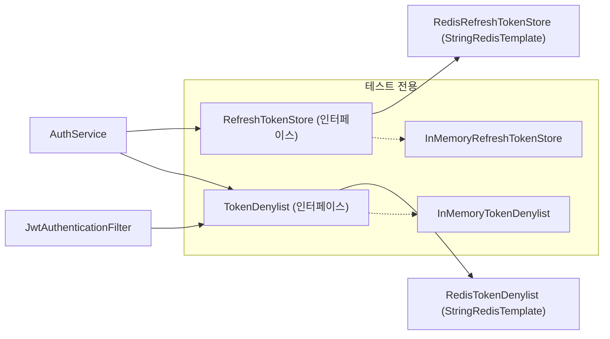

# Redis 토큰 저장소 — refresh 이관 + access 즉시 폐기 (단계 15)

- **과정명**: 강의용 Spring Boot 게시판 — 단계 15 (Redis 토큰 저장소)
- **작성일**: 2026-08-29(설계) · 2026-08-29(구현 완료) · **상태**: 완료
- **대상**: 단계 13(반응)까지 마치고 배포·보안 논의를 거친 수강생
- **목표 두 가지**:
  1. **refresh token 저장소를 MySQL → Redis(TTL)로 이관** — 세션성 데이터를 성격에 맞는 저장소로 옮기고, 만료 검사·청소 로직을 TTL로 소멸시킨다
  2. **access token denylist 도입** — 단계 2부터 안고 온 "stateless JWT는 개별 토큰을 즉시 폐기할 수 없다(최대 1시간 창)"는 한계를 해소한다. 로그아웃하면 access token도 그 즉시 죽는다

---

## 0. 왜 이 단계인가 — 서사

| 단계 | 쌓은 것 | 남긴 숙제 |
|---|---|---|
| 2 (JWT) | stateless access token | 발급된 토큰은 만료까지 못 막음 |
| 4 (REFRESH-TOKEN) | refresh를 DB에 저장(stateful) | 만료 행 청소 없음, `expiresAt` 수동 검사 |
| 5 (HTTPONLY-COOKIE) | refresh 전달 채널 확정 | — |
| **15 (이번)** | **저장소를 성격에 맞게 + 즉시 폐기** | 위 두 숙제를 한 번에 정리 |

핵심 통찰: refresh token은 **"잃어도 재로그인하면 되는 휘발성 세션 데이터"** 인데 영구 저장소(MySQL)에 있었다. denylist는 **"매 요청 조회 + 자동 소멸"** 이 요구라 애초에 RDB로는 부적합하다. 둘 다 Redis의 TTL이 정답인 자리다.

---

## A. 저장소 스키마 (Redis 키 설계)

> RDB 테이블 대신 **Redis 키 스키마**를 설계한다. 이 단계의 "스키마"다.

### 키: refresh token (양방향 2키 1쌍)

| 키 | 값 | TTL | 용도 |
|---|---|---|---|
| `rt:{token}` | `{userId}` | 14일(1209600s) | reissue/logout의 `findByToken` 대체 |
| `rt:user:{userId}` | `{token}` | 14일 | 재로그인 시 기존 토큰 폐기(사용자당 1개 정책 유지) |

- 발급: 기존 `rt:user:{userId}`가 가리키던 옛 `rt:{oldToken}` 삭제 → 새 2키 저장 (사용자당 1개 불변식)
- 재발급: `GET rt:{token}` → userId (없으면 만료·무효 — **TTL이 만료 검사를 대신한다**)
- 로그아웃: 2키 삭제 (멱등)

### 키: access token denylist

| 키 | 값 | TTL | 용도 |
|---|---|---|---|
| `deny:{jti}` | `"1"` | **해당 토큰의 남은 유효초** | 폐기된 access token 차단 |

- 로그아웃 시 현재 access token의 jti를 등록. TTL = `exp - now` 이므로 **토큰이 자연 만료되는 순간 키도 소멸** — 목록이 무한히 쌓이지 않는다(자기정리)
- 필터가 매 요청 `EXISTS deny:{jti}` 조회 — Redis라서 성립하는 비용

### 제거되는 것 (MySQL)

| 대상 | 처리 |
|---|---|
| `refresh_tokens` 테이블 | 제거 (엔티티 삭제로 이후 생성 안 됨; 기존 테이블은 수동 DROP 안내) |
| `RefreshToken` 엔티티, `RefreshTokenRepository` | 삭제 — 컨벤션대로 핵심 파일에 "단계 15 처리에 의해 제거" 주석 흔적 |

> [!IMPORTANT]
> **배포 시 1회성 영향**: 이관 순간 기존 refresh token이 모두 무효화되어 **전 사용자 재로그인 1회**가 필요하다. 마이그레이션 스크립트를 쓸 수도 있으나, 세션성 데이터의 특성상 "재로그인 1회"가 더 단순하고 정직한 선택이다(수업 포인트).

---

## B. 컴포넌트 설계 (Entity/JPA 대체)

이 단계는 엔티티가 **없어지는** 단계다. 대신 저장소 접근을 인터페이스로 추상화한다 — 테스트 전략(§E)의 근거가 된다.



### 신규 컴포넌트

| 컴포넌트 | 책임 | 비고 |
|---|---|---|
| `RefreshTokenStore` (인터페이스) | `save(userId, token, ttl)` / `findUserId(token)` / `deleteByToken(token)` | JPA 리포지토리의 세 연산을 그대로 승계 |
| `RedisRefreshTokenStore` | 위 §A 2키 스키마 구현 | `StringRedisTemplate` — 직렬화 복잡성 회피 |
| `TokenDenylist` (인터페이스) | `deny(jti, remainingTtl)` / `isDenied(jti)` | |
| `RedisTokenDenylist` | `deny:{jti}` 구현 | |
| `InMemory...` 2종 | `@TestConfiguration`용 Map 기반 구현 | H2가 MySQL을 대신하듯, 테스트에서 Redis를 대신 |

### 기존 컴포넌트 변경

| 컴포넌트 | 변경 | 이유 |
|---|---|---|
| `JwtTokenProvider` | `createToken`에 **`jti` 클레임(UUID) 추가** + `getJti(token)`, `getRemainingSeconds(token)` 추가 | denylist의 키가 될 토큰 고유 식별자. 현재 클레임은 sub/iat/exp뿐 |
| `AuthService` | `issueRefreshToken`·`reissue`·`logout`의 저장소 호출을 `RefreshTokenStore`로 교체. **`logout(refreshToken, accessToken)`으로 시그니처 확장** — access의 jti를 denylist에 등록 | 로그아웃 = refresh 폐기 + **access 즉시 폐기** |
| `AuthController` | logout에서 `Authorization` 헤더의 access token을 함께 전달 | |
| `JwtAuthenticationFilter` | `validateToken` 통과 후 **`isDenied(jti)`면 컨텍스트를 심지 않고 통과** → 뒷단 401 | 기존 "필터는 막지 않는다" 설계 유지 |
| `SecurityIntegrationTest` 등 | InMemory 구현 주입으로 기존 테스트 무수정 통과가 목표 | |

**만료 검사 로직의 소멸**: `RefreshToken.isExpired()`와 `EXPIRED_REFRESH_TOKEN` 분기가 사라진다 — TTL이 지나면 키 자체가 없으므로 "없음 = 무효" 한 가지로 단순해진다(§D 참고).

---

## C. REST API 명세 — 외부 계약 무변경, 의미 변화

**엔드포인트·요청·응답 형식은 하나도 바뀌지 않는다.** 이 단계의 미덕이다 — 저장소 교체가 API 소비자(React 프론트)에게 투명하다.

| 엔드포인트 | 외형 | 내부 의미 변화 |
|---|---|---|
| `POST /api/v1/auth/login` | 불변 | refresh 저장이 MySQL upsert → Redis 2키 |
| `POST /api/v1/auth/reissue` | 불변 | 만료 검사 → **키 부재 = 무효** 단일화 |
| `POST /api/v1/auth/logout` | 불변 (쿠키 + 기존처럼 Authorization 헤더 동봉) | refresh 삭제 + **access jti denylist 등록** ← 신규 효과 |
| 모든 보호 API | 불변 | 필터에 denylist 조회 1회 추가 |

**동작 변화를 체감하는 시나리오** (구현 후 검증 시나리오이기도 함):
```
로그인 → access로 GET /profiles/me 200
로그아웃 → 같은 access로 GET /profiles/me → (기존) 1시간 내 200 → (단계 15) 즉시 401
```

확장 여지(이번 범위 밖, 문서로만 남김): 관리자용 강제 폐기 API(`POST /api/v1/admin/users/{id}/revoke-tokens`) — denylist + `rt:user:{userId}` 삭제 조합으로 퇴사자·탈취 대응. 사용자별 즉시 차단은 tokenVersion 방식과의 비교도 후속 주제.

---

## D. 예외 처리 전략

새 ErrorCode 없이 기존 체계를 재사용한다.

| 상황 | 처리 | 코드 |
|---|---|---|
| reissue — `rt:{token}` 없음 (만료 포함) | `UnauthorizedException` | `INVALID_REFRESH_TOKEN` (401) |
| ~~reissue — 만료~~ | **분기 소멸** — TTL이 키를 지웠으므로 위와 동일 | `EXPIRED_REFRESH_TOKEN`은 사용처가 사라짐 → 상수는 "단계 15 처리에 의해 미사용" 주석으로 보존 |
| 보호 API — denylisted access | 필터가 컨텍스트를 안 심고 통과 → entryPoint | `LOGIN_REQUIRED` (401) — "폐기된 토큰"을 굳이 구별해 알려주지 않는다(정보 노출 최소화) |
| **Redis 장애** | 필터: 기존 3분기의 "예상치 못한 내부 오류" 경로 → `HandlerExceptionResolver` 위임 | `INTERNAL_ERROR` (500) — **단계 4 보강("내부 오류를 401로 둔갑시키지 않는다")이 그대로 재사용되는 지점** |

> [!IMPORTANT]
> **fail-closed 결정**: Redis가 죽으면 인증이 500으로 실패한다(fail-closed). denylist를 "조회 실패 시 통과"(fail-open)로 하면 가용성은 좋지만 **Redis를 죽이는 것만으로 폐기를 우회**할 수 있다. 보안 기능은 fail-closed가 원칙이고, 우리 필터의 기존 예외 설계가 자연스럽게 그 방향이다 — 별도 코드 없이 원칙이 지켜지는 구조를 확인하는 것이 이 절의 수업 포인트.

---

## E. 인프라·설정·테스트 전략

### compose — redis 서비스 추가

```yaml
  redis:
    image: redis:7-alpine
    container_name: board-redis
    command: ["redis-server", "--maxmemory", "64mb", "--maxmemory-policy", "noeviction"]
    networks:
      - board-db-net          # 앱과 같은 내부망, host publish 없음(mysql-8과 같은 격리 원칙)
    healthcheck:
      test: ["CMD", "redis-cli", "ping"]
      interval: 10s
      timeout: 3s
      retries: 6
    restart: unless-stopped
```

- `maxmemory 64mb` — 2GB 인스턴스 배려(스왑 사고의 교훈). 토큰 데이터는 이 한도에 한참 못 미침
- `noeviction` — 토큰 저장소에서 임의 축출(eviction)은 곧 강제 로그아웃이므로 금지. 캐시 용도(후속 단계)와 정책이 달라지는 지점
- `app`의 `depends_on`에 `redis: condition: service_healthy` 추가. deploy.sh는 무변경(compose가 함께 관리)
- 영속화(AOF)는 넣지 않는다 — 재시작 시 전원 재로그인을 수용(§A의 결정과 일관). 운영 전환 시 `--appendonly yes` 한 줄이 해법임을 명시

### 설정

```yaml
# application.yaml
spring:
  data:
    redis:
      host: ${REDIS_HOST:localhost}
      port: ${REDIS_PORT:6379}
```
- compose가 `REDIS_HOST: redis` 주입(기존 `DB_HOST` 패턴 그대로)
- `build.gradle`: `implementation 'org.springframework.boot:spring-boot-starter-data-redis'`

### 테스트 전략 — "H2 패턴"의 재현

| 계층 | 방법 |
|---|---|
| 기존 `@SpringBootTest` 전체 | `@TestConfiguration`으로 `InMemoryRefreshTokenStore`/`InMemoryTokenDenylist` 빈 등록 → **Redis 없이 통과** (테스트 yaml에 redis 자동설정 제외). CI(H2와 동일하게 외부 의존 0) 유지 |
| 신규 단위 테스트 | ① Store 계약 테스트(발급→조회→교체→삭제, 사용자당 1개 불변식) ② denylist 등록·TTL 계산 ③ 필터: denylisted → 컨텍스트 미설정 통과 ④ AuthService.logout이 두 저장소를 모두 호출 |
| Redis 실구현 검증 | 로컬 compose로 E2E(로그인→로그아웃→같은 access로 401 즉시 확인) — verify-loop의 기동 검증에 시나리오 추가 검토 |

Testcontainers 대신 인터페이스+InMemory를 택한 이유: CI 러너에서 도커 의존을 만들지 않고, **"저장소를 인터페이스 뒤로 숨기면 테스트가 저장소를 갈아끼울 수 있다"** 는 설계 원칙 자체가 이 단계의 학습 목표이기 때문(단계 2의 H2 스토리와 대구).

---

## F. 설계 결정사항 및 근거 (트레이드오프 기록)

| 결정 | 대안 | 선택 이유 |
|---|---|---|
| jti 클레임 추가 후 `deny:{jti}` | 토큰 전문 해시를 키로 | jti가 표준(RFC 7519) 필드고 키가 짧다. 기존 발급 토큰엔 jti가 없으므로 배포 직후 구토큰은 denylist 불가 — access 수명이 1시간이라 창이 자연 소멸 |
| refresh 2키(양방향) | 토큰만 저장하고 사용자당 1개 포기 | 단계 4의 "사용자당 1개" 불변식을 저장소가 바뀌어도 유지 — 요구가 저장소를 따라 변하면 안 된다는 원칙 |
| 회전(rotation) 없음 유지 | 이관 김에 회전 도입 | 단계 4의 명시적 보류를 존중 — 한 단계 한 주제. 회전은 후속 |
| fail-closed | fail-open | §D — 보안 기능의 원칙 + 기존 필터 설계와 무비용 정합 |
| AOF 미사용 | AOF 켜기 | 수업 단순성 + "세션 데이터는 잃어도 된다"는 §A 결정과 일관 |
| InMemory 테스트 대체 | Testcontainers | CI 도커 의존 회피 + 인터페이스 설계 교육 효과 |

---

## G. 구현 순서 (다음 세션 로드맵)

> 각 순서의 **파일별 실제 수정 코드(전/후)와 체크포인트**는 [[REDIS-TOKEN-WALKTHROUGH]]에 기록되어 있다.

1. 의존성·설정·compose(redis) — 기동 확인
2. `JwtTokenProvider` jti 추가(+기존 테스트 보강)
3. `RefreshTokenStore` 인터페이스 + InMemory + Redis 구현, `AuthService` 교체 — 기존 auth 테스트 green 유지
4. `TokenDenylist` + 필터 통합 + logout 확장
5. 엔티티·리포지토리 제거(주석 흔적), 테스트 전체 green
6. verify-loop 통과 → E2E(로그아웃 즉시 401) → 배포 → 강의 문서(status 완료로 갱신)

---

## H. 구현·검증 기록 (2026-08-29)

설계 그대로 구현되어 main에 머지·배포됐다(PR #6). 검증 결과:

| 검증 | 결과 |
|---|---|
| 전체 테스트 | green — 계약 테스트(사용자당 1개·멱등)·denylist 필터·jti 신규 포함, 기존 auth 테스트는 InMemory 대체로 무수정 통과 |
| verify.sh | PASSED (빌드+테스트+실기동) |
| 로컬 Redis E2E | 로그인 → 로그아웃 → **같은 access 즉시 401**. `rt:user:{id}` TTL=1209600s(14일), `deny:{jti}` TTL=3598s(잔여수명) 실측 |
| production E2E | 가입 201 → 로그인 200 → 로그아웃 204 → **같은 access 401** → 옛 refresh 401 |
| 무스왑 유지 | 배포 후 서버 Swap 0B, redis 컨테이너 healthy |

**구현 중 발견한 함정(교육 포인트)**: 백엔드 컨테이너만 재생성되는 배포(GHCR pull)에서
떠 있던 Nginx가 옛 컨테이너 IP를 캐시해 502가 났다. `proxy_pass`의 정적 호스트명은
기동 시 1회만 해석되기 때문 — `resolver 127.0.0.11` + 변수(`set $backend ...`)로
요청마다 재해석하도록 두 프론트의 nginx.conf를 수정해 해결했다([[FRONTEND-DEPLOY]] 참고).
