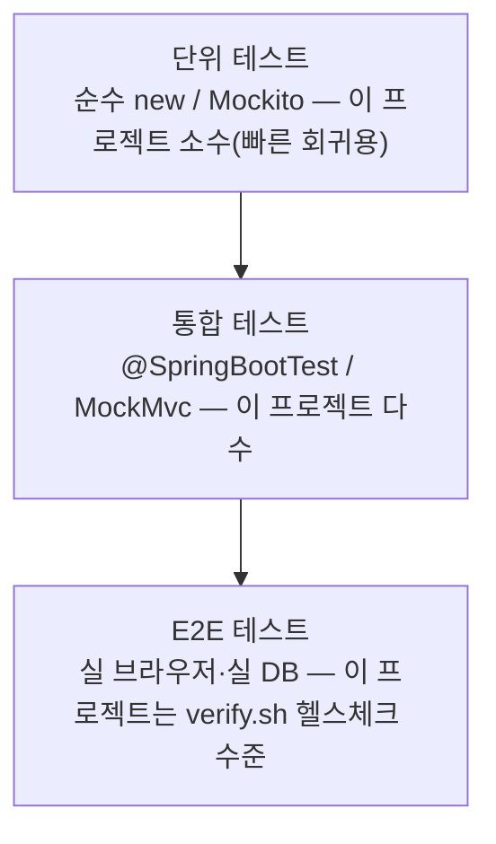
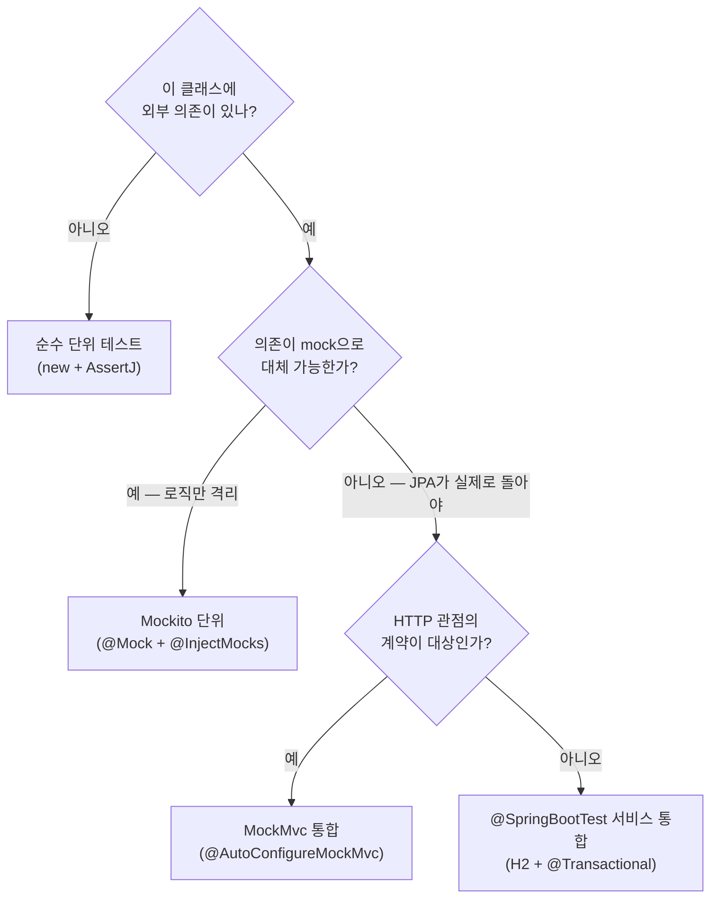

# 단위·통합 테스트 작성법 — 초급에서 중급까지

- **과정명**: 강의용 Spring Boot 게시판 — 테스트 코드 **작성** 강의
- **대상**: 지금까지 코드는 짜 봤지만 "테스트를 정식으로 학습한 적이 없는" 수강생. 이 프로젝트의 도메인(회원/게시글/OAuth)은 이미 익숙하다는 전제
- **선수 지식**: Java 문법(람다·제네릭), 이 저장소의 대략적 구조(`post/`, `auth/`, `global/`), 실행 방법은 [TESTING-GUIDE.md](TESTING-GUIDE.md)에서 이미 익혔다는 전제
- **관련 코드**: `src/test/java/` 전체, `build.gradle`(테스트 의존성), `src/test/resources/application.yaml`(H2 테스트 프로파일)
- **검증 상태**: 이 문서에 인용된 모든 스니펫은 저장소의 실 테스트 코드와 문자열 단위로 일치 (2026-07-25 기준, 총 테스트 파일 15개)
- **이 문서의 위치**: `TESTING-GUIDE.md`는 "테스트를 어떻게 **실행**하나"를 다루고, 이 문서는 "테스트를 어떻게 **작성**하나"를 다룬다 — 짝을 이루는 문서

---

## 한눈에 보기 — 3분 요약

바쁘면 이 섹션만 읽어도 된다. 상세는 §1부터.

**단위 테스트란**: 코드의 아주 작은 조각(주로 클래스 하나, 그 안의 메서드 하나)이 **예상대로 동작하는지**를 프로덕션과 무관한 환경에서 자동으로 확인하는 코드다. 왜 쓰나 — (1) **회귀 방지**: 리팩터할 때 부순 지점을 초 단위로 찾아준다, (2) **설계 피드백**: 테스트하기 어려운 코드는 대개 설계가 나쁘다(생성자 주입·순수 함수화의 압력), (3) **문서 역할**: `should_returnFalse_whenTokenExpired`처럼 메서드 이름 자체가 명세다.

**이 프로젝트의 테스트 유형 지도** — 아래 표의 순서가 학습 순서이기도 하다(단순→복잡):

| 유형 | 대표 파일 | 언제 쓰나 | 스프링 컨텍스트 |
|------|-----------|-----------|-----------------|
| 순수 단위 테스트 | `JwtTokenProviderTest`, `KakaoUserResponseTest`, `CookieOAuth2AuthorizationRequestRepositoryTest` | 외부 의존이 없는 값 객체·유틸·순수 로직 | 없음 (`new`로 생성) |
| Mockito 단위 테스트 | `CustomUserDetailsServiceTest` | 협력 객체가 있지만 그것을 가짜로 대체하고 로직만 격리하고 싶을 때 | 없음 (`@Mock` + `@InjectMocks`) |
| `@SpringBootTest` 통합 | `PostServiceTest`, `ProfileServiceTest`, `CustomOidcUserServiceTest` | 서비스 + JPA + 트랜잭션이 실제로 함께 도는지 확인 | 있음 (H2 인메모리 + 롤백) |
| MockMvc 웹 계층 통합 | `SecurityIntegrationTest`, `GlobalExceptionHandlerTest` | 컨트롤러 + Security + 예외 변환까지 HTTP 스타일로 검증 | 있음 (`@AutoConfigureMockMvc`) |
| 외부 자원/파일 | `FileStorageServiceTest` | 파일시스템·외부 API 등 통제 불가능한 것을 다룰 때 | 없음 (`@TempDir`) |

**테스트 피라미드** — 아래로 갈수록 느리고 부서지기 쉬우니 위쪽을 두껍게 쌓는다:



> [!IMPORTANT]
> 좋은 테스트의 조건은 세 가지 — **한 가지만 검증**, **이름이 명세**, **독립 실행**(다른 테스트와 순서 무관, 외부 상태에 의존하지 않음). 이 문서는 우리 저장소의 실제 테스트로 이 세 조건을 어떻게 지키는지 보여준다.

---

## 학습 목표

이 문서를 끝내면 수강생은:

- 단위 테스트와 통합 테스트, E2E 테스트의 차이를 우리 프로젝트의 실 파일로 설명할 수 있다
- JUnit 5의 `@Test`/`@BeforeEach`/`@AfterEach`와 AssertJ의 `assertThat`/`assertThatThrownBy`를 자유롭게 조합해 새 테스트를 작성할 수 있다
- Mockito의 `@Mock`/`@InjectMocks`/`given(...).willReturn(...)`으로 협력 객체를 가짜로 대체할 수 있다
- `@SpringBootTest + @Transactional` 조합이 왜 "실제 JPA는 돌지만 DB는 오염되지 않는"지 설명할 수 있다
- MockMvc로 HTTP 요청을 실 서버 없이 재현하고, `status()`/`jsonPath()`/`cookie()`로 응답을 검증할 수 있다
- `@TempDir`(파일 격리)와 delegate stub(외부 API 대체) — 통제 불가능한 자원을 테스트에서 다루는 두 가지 표준 기법을 구분해 쓸 수 있다
- 어떤 로직을 단위로 검증하고 어떤 것을 통합으로 검증할지, 트레이드오프(속도 vs 실제성)를 기준으로 판단할 수 있다

---

## 1. 단위 테스트란 — 정의와 왜 쓰나

### 1-1. 단위 vs 통합 vs E2E

용어부터 정리한다. 세 층위는 **테스트가 만지는 대상의 크기**로 갈린다:

| 층위 | 대상 | 대체하는 것 | 이 프로젝트 예 |
|------|------|-------------|----------------|
| 단위(unit) | 클래스 1개 (혹은 그 메서드 1개) | 협력 객체 전부 (mock·stub) 또는 아예 협력 없음 | `JwtTokenProviderTest`, `CustomUserDetailsServiceTest` |
| 통합(integration) | 여러 계층이 함께 도는 것 (서비스+JPA+트랜잭션, 컨트롤러+Security+예외처리) | 외부 시스템만 대체 (H2가 MySQL 대신, MockMvc가 실 HTTP 대신) | `PostServiceTest`, `SecurityIntegrationTest` |
| E2E | 실행 중인 앱 전체 (실 DB·실 브라우저) | 대체 없음 | `scripts/verify.sh`의 헬스체크, 실 브라우저 OAuth 로그인 |

경계는 늘 뿌옇다 — "H2로 하는 JPA 통합은 진짜 통합인가?" 같은 논쟁은 커뮤니티에서도 답이 갈린다. 실무에서는 **"내가 무엇을 대체했는지 명확히 말할 수 있으면 된다"**가 기준이다. 이름표에 집착할 필요는 없다.

### 1-2. 왜 쓰나 — 이 프로젝트에서 실제로 얻은 것

이 저장소는 단계 1~10을 지나오는 동안 여러 번 리팩터·변환·회귀를 겪었다. 그때마다 테스트가 해 준 일:

- **회귀 방지** — 단계 9에서 nonce attribute를 쿠키 저장 목록에서 빠뜨렸다가, 그것을 고친 뒤 `should_preserveNonce_whenOidcRequestRoundTrips`와 `should_haveNoNonceAttribute_whenPlainOAuth2RoundTrips` 두 테스트로 회귀를 고정. 다음에 저장 목록을 또 만질 때 무엇이 깨지면 안 되는지가 코드로 남는다.
- **설계 피드백** — `JwtTokenProvider`가 `new JwtTokenProvider(SECRET, 3600)`으로 곧장 생성 가능한 이유는 시크릿과 만료를 **생성자로 받기 때문**. 만약 `@Value`를 필드에 뿌려 두었다면 순수 단위 테스트가 아예 불가능하다. 테스트가 좋은 설계를 강제한다.
- **문서 역할** — 다음 두 이름은 그 자체로 계약이다:
  - `should_returnFalse_whenSignatureTampered` — "다른 키로 서명한 토큰은 거짓을 반환"
  - `should_return404ResourceNotFound_whenPathHasNoHandler` — "매핑 없는 URL은 500이 아니라 404"

### 1-3. FIRST 원칙 — 좋은 테스트의 5가지 조건

| 글자 | 뜻 | 이 프로젝트에서 어떻게 지키나 |
|------|-----|-----------------------------|
| Fast | 빨라야 한다 | 순수 단위(수 ms), 통합은 H2 인메모리(수백 ms), 실 브라우저 E2E는 별도 스크립트로 분리 |
| Isolated | 격리돼야 한다 | `@Transactional`로 DB 롤백, `@TempDir`로 파일 격리, `@AfterEach`로 delegate 원상복구 |
| Repeatable | 반복 실행해도 같은 결과 | 시간·랜덤 등 비결정 요소는 생성자로 주입하거나(예: `JwtTokenProvider(SECRET, -1)`로 만료 재현) 고정값 사용 |
| Self-validating | 사람이 로그를 읽지 않아도 pass/fail | `assertThat(...).isEqualTo(...)`이 실패 시 정확한 diff를 던진다 |
| Timely | 코드와 함께 작성 | 이 저장소의 각 단계 커밋은 프로덕션 코드와 테스트를 같은 커밋에 담는다 |

---

## 2. Spring의 테스트 준비 — 무엇이 이미 갖춰져 있나

### 2-1. `spring-boot-starter-test`가 가져오는 것

`build.gradle`에서 테스트 의존성은 딱 이렇게 선언돼 있다:

```groovy
testImplementation 'org.springframework.boot:spring-boot-starter-test'
testImplementation 'org.springframework.security:spring-security-test'
testRuntimeOnly 'com.h2database:h2'
testCompileOnly 'org.projectlombok:lombok'
testRuntimeOnly 'org.junit.platform:junit-platform-launcher'
testAnnotationProcessor 'org.projectlombok:lombok'
```

`spring-boot-starter-test` 이 한 줄이 **5개의 도구를 한 번에** 가져온다:

| 도구 | 역할 | 이 문서의 어디서 배우나 |
|------|------|------------------------|
| JUnit 5 (Jupiter) | 테스트 러너·라이프사이클 (`@Test`, `@BeforeEach`) | §3 |
| AssertJ | 유창한(fluent) 검증 API (`assertThat(...).isEqualTo(...)`) | §4 |
| Mockito | 협력 객체 mock/stub | §6 |
| Spring Test | `@SpringBootTest`, `@Autowired`, 컨텍스트 캐시 | §7 |
| MockMvc | 서블릿 컨테이너 없이 컨트롤러+Security까지 실행 | §8 |

`spring-security-test`는 별도로 하나 더 추가된다 — MockMvc 요청에 `.with(user(...))` 같은 인증 정보를 심는 유틸을 준다(이 프로젝트는 실 토큰을 발급해서 붙이므로 자주 쓰진 않는다).

### 2-2. H2를 `testRuntimeOnly`로 두는 이유

프로덕션 런타임에는 MySQL(`runtimeOnly 'com.mysql:mysql-connector-j'`)을 쓰지만, 테스트에는 **H2 인메모리**만 쓴다. `testRuntimeOnly`이라는 스코프의 의미가 그것이다 — 컴파일에는 없어도 되고, 테스트 실행 시에만 클래스패스에 있으면 된다. 이 조합의 이점:

- **속도** — 매 테스트가 새 스키마로 시작해도 밀리초 단위
- **격리** — 다른 개발자·CI 서버가 서로 다른 DB에 접속하지 않음
- **CI 친화** — 별도 DB 컨테이너 없이 `./gradlew test` 하나로 완결

전환은 `src/test/resources/application.yaml`이 담당한다 — 이 파일이 있으면 테스트 실행 시 `main/resources/application.yaml`을 덮어쓴다:

```yaml
spring:
  datasource:
    url: jdbc:h2:mem:board;MODE=MySQL;DB_CLOSE_DELAY=-1
    driver-class-name: org.h2.Driver
    username: sa
    password:
  jpa:
    hibernate:
      ddl-auto: create-drop
    open-in-view: false
```

- `MODE=MySQL` — H2에게 "MySQL 방언처럼 굴어라" 지시. `AUTO_INCREMENT`, 백틱 등 MySQL 문법을 이해하게 된다.
- `ddl-auto: create-drop` — 테스트 시작마다 스키마 재생성, 종료 시 삭제. 프로덕션은 `validate` + Flyway.

> [!NOTE]
> H2와 실제 MySQL은 100% 호환이 아니다 — 함수 몇 개, JSON 처리, 특정 SQL의 실행 계획 등이 다르다. 그래도 우리는 H2 통합 테스트에 가치를 둔다. 이유는 FAQ에서 상세히 다룬다.

### 2-3. 실행

```bash
./gradlew test              # 전체 실행
./gradlew test --tests "com.example.board.post.PostServiceTest"   # 클래스 하나
./gradlew test --tests "*.should_createPost_whenAuthorIsLoggedInUser"  # 메서드 하나
```

리포트: `build/reports/tests/test/index.html`. 실행 방법의 상세는 [TESTING-GUIDE.md](TESTING-GUIDE.md).

---

## 3. JUnit 5 기본 문법

### 3-1. 최소 골격 — `@Test`

우리 저장소에서 가장 단순한 테스트는 `JwtTokenProviderTest`다. 스프링 컨텍스트도 없고, 협력 객체도 없다. `new`로 만든 순수 객체 하나만 테스트한다:

```java
class JwtTokenProviderTest {

  private static final String SECRET =
      "bG9jYWwtZGV2LWp3dC1zZWNyZXQta2V5LWZvci1ib2FyZC1sZWN0dXJlLTI1Ng==";
  private static final String OTHER_SECRET =
      "YW5vdGhlci1zZWNyZXQta2V5LWZvci1qd3QtdGVzdC1ib2FyZC1sZWN0dXJlLTI1Ng==";

  private final JwtTokenProvider provider = new JwtTokenProvider(SECRET, 3600);

  @Test
  void should_roundTripUsername_whenCreateThenGetUsername() {
    String token = provider.createToken("tester1");

    assertThat(provider.getUsername(token)).isEqualTo("tester1");
    assertThat(provider.validateToken(token)).isTrue();
  }
}
```

**여기서 배울 4가지**:

- **클래스도 메서드도 `public`이 아니다** — JUnit 5는 package-private 접근으로 충분하다(리플렉션으로 호출). `public`을 남발하지 않는 것도 관습.
- **`@Test`만 있으면 실행 대상** — 다른 어노테이션 없음.
- **필드 초기화** — `new JwtTokenProvider(SECRET, 3600)`을 필드에서 곧장 만든다. 각 `@Test`마다 클래스 인스턴스가 새로 생성되므로 필드는 자동 초기화된다(테스트간 공유 없음).
- **`import static` 관례** — `import static org.assertj.core.api.Assertions.assertThat;` — assertThat만 static import해서 본문에서는 짧게 쓴다.

### 3-2. `@BeforeEach` — 테스트마다 반복되는 준비

준비(Given)가 여러 테스트에서 반복되면 `@BeforeEach`로 빼낸다. `CookieOAuth2AuthorizationRequestRepositoryTest`가 좋은 예:

```java
class CookieOAuth2AuthorizationRequestRepositoryTest {

  CookieOAuth2AuthorizationRequestRepository repository;

  @BeforeEach
  void setUp() {
    repository = new CookieOAuth2AuthorizationRequestRepository(new ObjectMapper(), false);
  }
  ...
}
```

- **매 `@Test` 실행 직전 호출** — JUnit 5의 라이프사이클 기본값. 즉 매 테스트는 새 `repository` 인스턴스를 받는다(격리 보장).
- **`@BeforeAll`은 static이며 한 번만 실행** — 무거운 자원(임베디드 서버 등)에나 쓴다. 이 프로젝트에는 등장하지 않는다.

### 3-3. `@DisplayName` 대신 메서드명 컨벤션 — `should_..._when...`

JUnit 5의 `@DisplayName("한글 설명")`도 좋지만, **이 프로젝트는 메서드 이름 자체를 명세로** 쓴다:

```
should_기대결과_when상황
```

`JwtTokenProviderTest`의 실제 이름들:

- `should_roundTripUsername_whenCreateThenGetUsername`
- `should_returnFalse_whenTokenExpired`
- `should_returnFalse_whenSignatureTampered`
- `should_returnFalse_whenTokenMalformed`

읽기만 해도 "무엇이 어떤 상황에서 어떻게 되어야 하는지"가 문장으로 조립된다. 실패 리포트에도 그대로 노출돼 원인 파악이 빠르다.

### 3-4. given-when-then 구조

한 테스트 안에서 세 단계로 흐름을 나눈다:

- **Given**: 상황 세팅 (준비된 객체·데이터)
- **When**: 검증 대상 동작 **한 번** 실행
- **Then**: 결과 검증

`CustomUserDetailsServiceTest`가 명료하다 — Given은 mock 세팅, When은 한 줄, Then은 assertThat 3개:

```java
@Test
void should_returnUserDetailsWithRoleAuthority_whenUserExists() {
  // Given
  User user = new User("tester1", "tester1@example.com", "encoded", Role.USER);
  given(userRepository.findByUsername("tester1")).willReturn(Optional.of(user));

  // When
  UserDetails userDetails = customUserDetailsService.loadUserByUsername("tester1");

  // Then
  assertThat(userDetails.getUsername()).isEqualTo("tester1");
  assertThat(userDetails.getPassword()).isEqualTo("encoded");
  assertThat(userDetails.getAuthorities())
      .extracting("authority")
      .containsExactly("ROLE_USER");
}
```

우리 저장소는 이 세 단계를 굳이 주석으로 표시하지는 않는다(코드 리듬으로 이미 드러남). 다만 **When은 한 줄**이라는 원칙은 지킨다 — 여러 동작을 한 테스트에서 검증하면 실패 시 무엇이 원인인지 흐려진다.

---

## 4. AssertJ로 검증 — 유창한 API

JUnit이 기본 제공하는 `Assertions.assertEquals(expected, actual)`도 있지만, 스프링 부트 시작 프로젝트는 표준으로 **AssertJ**를 얹는다. 이유는 두 가지 — (1) `assertThat(actual).isEqualTo(expected)` 순서가 자연스럽고, (2) 컬렉션·예외에 대한 API가 훨씬 풍부하다.

### 4-1. 값 비교의 기본

```java
assertThat(response.title()).isEqualTo("제목");                          // 값 동등
assertThat(response.viewCount()).isZero();                              // 0 확인 (== isEqualTo(0))
assertThat(refreshCookie).isNotNull();                                  // null 아님
assertThat(userDetails.getUsername()).isEqualTo("tester1");             // 문자열 동등
```

### 4-2. 컬렉션 — `hasSize` / `contains` / `extracting`

`PostServiceTest`의 실 예제:

```java
assertThat(updated.images()).hasSize(2);
assertThat(updated.images()).extracting("originalName").containsExactly("a.png", "b.png");
```

- `hasSize(n)` — 컬렉션 크기 검증
- `extracting("필드명")` — 각 원소에서 필드 하나만 뽑아 새 컬렉션으로 만든다
- `containsExactly(...)` — **순서까지 일치**해야 함
- `containsExactlyInAnyOrder(...)` — 원소는 같지만 순서 무관. `should_deleteAndAddImages_atOnce`에서 사용됨

### 4-3. 문자열

```java
assertThat(setCookie).contains("oauthRequest=").contains("HttpOnly").contains("SameSite=Lax");
assertThat(storedName).endsWith(".png");
assertThat(created.images().get(0).url()).startsWith("/images/");
assertThat(storedName).doesNotContain("..").doesNotContain("/");
```

여러 검증을 **체이닝**할 수 있는 것이 AssertJ의 매력이다. 실패 시 어느 체인에서 실패했는지 정확히 알려준다.

### 4-4. 예외 — `assertThatThrownBy`

예외 검증은 try/catch로 짜지 않는다. AssertJ의 함수형 API를 쓴다:

```java
// CustomUserDetailsServiceTest
assertThatThrownBy(() -> customUserDetailsService.loadUserByUsername("no-such-user"))
    .isInstanceOf(UsernameNotFoundException.class);
```

우리 저장소는 예외 안의 필드까지 검증하기도 한다. `PostServiceTest.should_rejectUpdate_whenFinalImageCountExceedsMax`가 실 예:

```java
assertThatThrownBy(() -> postService.update(
    created.id(), new PostUpdateRequest("제목", "내용", null), newImages))
    .isInstanceOf(BusinessException.class)
    .extracting(e -> ((BusinessException) e).getErrorCode())
    .isEqualTo(com.example.board.global.exception.ErrorCode.FILE_COUNT_EXCEEDED);
```

- `.isInstanceOf(BusinessException.class)` — 예외 타입 검증
- `.extracting(...)` — 예외에서 필드 하나 추출
- `.isEqualTo(...)` — 그 필드가 기대값과 같은지

**핵심**: `assertThatThrownBy`가 없다면 try/catch + `fail()` 조합으로 짜야 하는데, 예외가 안 나면 catch가 실행되지 않아 테스트가 통과해 버리는 사고가 흔하다. 함수형 API가 그 함정을 원천 차단한다.

---

## 5. 가장 단순한 단위 테스트 — 스프링 없이

여기까지가 초급 마무리다. 지금 무엇을 알았는지 정리하고, 첫 번째 단위 테스트 유형을 확실히 익힌다.

### 5-1. "협력이 없는 클래스"는 그냥 `new`

`JwtTokenProviderTest`, `CookieOAuth2AuthorizationRequestRepositoryTest`, `KakaoUserResponseTest` — 세 파일의 공통점은 **아무 어노테이션도 없다**는 것이다. `@ExtendWith`도, `@SpringBootTest`도, `@Mock`도 없다. `new`로 만들고 메서드를 호출한다.

`KakaoUserResponseTest`의 예 — Jackson으로 카카오 JSON을 역직렬화하는 DTO만 순수하게 검증한다:

```java
class KakaoUserResponseTest {

  private final ObjectMapper objectMapper = new ObjectMapper()
      .disable(DeserializationFeature.FAIL_ON_UNKNOWN_PROPERTIES);

  @Test
  void should_flattenNestedJson_whenFullResponse() throws Exception {
    String json = """
        {
          "id": 4614955682,
          "connected_at": "2026-07-03T10:00:00Z",
          "properties": {"nickname": "김은범"},
          "kakao_account": {
            "email": "user@example.com",
            "profile": {"nickname": "김은범"}
          }
        }
        """;

    KakaoUserResponse response = objectMapper.readValue(json, KakaoUserResponse.class);

    assertThat(response.getId()).isEqualTo(4614955682L);
    assertThat(response.getEmail()).isEqualTo("user@example.com");
    assertThat(response.getNickname()).isEqualTo("김은범");
  }
}
```

**왜 스프링을 안 띄우나** — 이 클래스가 검증하는 것은 "카카오의 중첩 JSON이 우리 DTO의 평면 필드로 풀리는가"뿐이다. 스프링 컨텍스트를 띄우는 순간 테스트 하나가 **초 단위**로 느려진다. 필요 없으면 안 띄우는 것이 정답.

### 5-2. 규칙 — 스프링을 언제 띄우고 언제 안 띄우나

| 상황 | 스프링 필요? | 근거 |
|------|-------------|------|
| 값 객체·유틸·순수 계산 | 아니오 | 협력이 없음. `new`가 최선 |
| 협력이 있지만 그것을 mock으로 대체 가능 | 아니오 | §6 Mockito 방식 |
| JPA 실제 쿼리·트랜잭션 롤백·`@Transactional` 프록시가 실제로 도는지 확인 | 예 | §7 `@SpringBootTest` |
| Security 필터·`@RestControllerAdvice`·컨트롤러 매핑까지 함께 검증 | 예 | §8 MockMvc |

경계선의 예 — `CookieOAuth2AuthorizationRequestRepositoryTest`는 Spring Security의 `OAuth2AuthorizationRequest`와 `MockHttpServletRequest/Response`를 쓰지만 **스프링 컨텍스트는 안 띄운다**. 이 두 클래스는 그냥 라이브러리 클래스이지 스프링 빈이 아니기 때문. "라이브러리 클래스를 임포트하는 것"과 "스프링 컨텍스트를 띄우는 것"은 다른 이야기다.

> [!TIP]
> "이 테스트는 스프링이 꼭 필요한가?"를 매번 자문하는 습관이 테스트 슈트의 총 실행 시간을 결정한다. 통합 테스트가 100개면 5분, 순수 단위 100개면 1초.

---

## 6. 협력 객체를 가짜로 — Mockito

여기서부터 중급이다. 실무 코드는 대부분 협력 객체(Repository, 외부 API 클라이언트 등)를 갖는다. 그것을 진짜로 부르면 통합 테스트가 되고, 가짜로 대체하면 단위 테스트가 유지된다. Mockito가 그 "가짜"를 만드는 표준 도구다.

### 6-1. 전체 예제 — `CustomUserDetailsServiceTest`

이 파일 하나에 Mockito 단위 테스트의 표준 골격이 다 들어 있다:

```java
@ExtendWith(MockitoExtension.class)
class CustomUserDetailsServiceTest {

  @Mock
  UserRepository userRepository;

  @InjectMocks
  CustomUserDetailsService customUserDetailsService;

  @Test
  void should_returnUserDetailsWithRoleAuthority_whenUserExists() {
    User user = new User("tester1", "tester1@example.com", "encoded", Role.USER);
    given(userRepository.findByUsername("tester1")).willReturn(Optional.of(user));

    UserDetails userDetails = customUserDetailsService.loadUserByUsername("tester1");

    assertThat(userDetails.getUsername()).isEqualTo("tester1");
    assertThat(userDetails.getPassword()).isEqualTo("encoded");
    assertThat(userDetails.getAuthorities())
        .extracting("authority")
        .containsExactly("ROLE_USER");
  }

  @Test
  void should_throwUsernameNotFoundException_whenUserMissing() {
    given(userRepository.findByUsername("no-such-user")).willReturn(Optional.empty());

    assertThatThrownBy(() -> customUserDetailsService.loadUserByUsername("no-such-user"))
        .isInstanceOf(UsernameNotFoundException.class);
  }
}
```

### 6-2. 세 가지 어노테이션 이해하기

| 어노테이션 | 역할 |
|-----------|------|
| `@ExtendWith(MockitoExtension.class)` | JUnit 5에게 "Mockito가 이 클래스의 라이프사이클에 개입한다" 알림 |
| `@Mock` | 이 필드에 **가짜 구현체**를 주입. 모든 메서드는 기본적으로 null/0/false 반환 |
| `@InjectMocks` | 이 필드는 **실제 구현체**를 만들되, 생성자 파라미터에 위의 `@Mock`을 자동으로 채워 넣음 |

즉 `customUserDetailsService`는 실제 `CustomUserDetailsService` 인스턴스이지만, 그 안의 `userRepository`는 Mockito가 만든 가짜다.

### 6-3. `given(...).willReturn(...)` — stubbing

가짜는 아무 것도 안 한다. 원하는 동작을 심는 것이 stubbing:

```java
given(userRepository.findByUsername("tester1")).willReturn(Optional.of(user));
```

"userRepository의 findByUsername이 정확히 문자열 `\"tester1\"`으로 호출되면, `Optional.of(user)`를 돌려줘라." Mockito의 옛 API는 `when(...).thenReturn(...)`이고, BDDMockito가 제공하는 `given(...).willReturn(...)`은 정확히 같은 것을 given-when-then 어투로 감싼 것뿐이다. 이 프로젝트는 후자를 쓴다.

### 6-4. 왜 Repository를 mock하나 — DB 없이 서비스 로직만

`CustomUserDetailsService`는 Spring Security가 로그인 시 호출하는 서비스다. 이 클래스의 **핵심 책임**은:

- DB에서 User를 찾는다 (있으면 UserDetails로 변환, 없으면 예외)
- 권한을 `ROLE_USER` 문자열로 노출한다

앞의 "DB에서 찾는" 부분은 `UserRepository`의 일이지 이 클래스의 일이 아니다. 그래서 mock으로 대체하고, 이 테스트는 **뒤의 변환 로직**만 격리해서 본다. DB가 없으니 밀리초 안에 끝나고, 실패하면 원인이 이 클래스에 있음이 100% 확실하다.

만약 여기를 `@SpringBootTest`로 통합 테스트로 짜면 어떻게 될까 — 테스트가 훨씬 느려지고, `UserRepository`의 JPA 매핑이 잘못돼도 이 테스트가 빨간 불이 뜬다. 즉 **실패의 지역성**이 나빠진다. 단위 테스트의 진짜 가치가 여기에 있다.

### 6-5. `verify(...)` — 호출됐는지 검증 (참고)

우리 저장소는 `verify`를 자주 쓰지 않는데(대부분 반환값 검증이 명료해서), Mockito에는 "메서드가 몇 번 호출됐는지" 자체를 검증하는 `verify`가 있다:

```java
verify(userRepository).findByUsername("tester1");           // 정확히 한 번
verify(userRepository, never()).save(any());                // 절대 호출되지 않음
verify(userRepository, times(2)).findByUsername(anyString()); // 두 번
```

값 반환이 없는 void 메서드(예: `emailSender.send(...)`가 실제로 불렸는지)에 특히 유용하다.

### 6-6. `@Mock` vs `@MockBean` — 자주 헷갈리는 지점

| 어노테이션 | 컨텍스트 | 어디에 등록 |
|-----------|----------|-------------|
| `@Mock` (Mockito) | 필요 없음 (`@ExtendWith(MockitoExtension.class)`) | 테스트 클래스 필드에만 |
| `@MockBean` (Spring Boot) | 필요 (`@SpringBootTest` 등) | **컨텍스트 안의 실 빈을 대체**해서 등록 — 다른 빈이 이걸 주입받게 됨 |

`@MockBean`은 §7에서 통합 테스트를 배운 뒤에나 등장한다. **단위 테스트에서는 `@Mock`이 정답이다** — 컨텍스트가 없으니 `@MockBean`을 쓸 이유가 없다.

---

## 7. 스프링 통합 테스트 — `@SpringBootTest` + `@Transactional`

Mockito로 격리하는 것도 좋지만, "실제 JPA가 도는지" "트랜잭션이 롤백되는지" "여러 계층이 조립되면 어떻게 되는지"는 mock으로 못 본다. 그래서 스프링을 **실제로 띄우는** 통합 테스트가 필요하다.

### 7-1. 골격 — `PostServiceTest`

```java
@SpringBootTest
@Transactional
class PostServiceTest {

  @Autowired
  PostService postService;

  @Autowired
  UserRepository userRepository;

  @Autowired
  BoardRepository boardRepository;

  User author;
  Board board;

  @BeforeEach
  void setUp() {
    author = userRepository.save(new User("author1", "author1@example.com", "encoded", Role.USER));
    board = boardRepository.save(new Board("자유게시판", "자유롭게 쓰는 곳"));
  }

  @Test
  void should_createPost_whenAuthorIsLoggedInUser() {
    PostResponse response =
        postService.create(board.getId(), author.getId(), new PostCreateRequest("제목", "내용"), null);

    assertThat(response.title()).isEqualTo("제목");
    assertThat(response.authorUsername()).isEqualTo("author1");
    assertThat(response.boardId()).isEqualTo(board.getId());
    assertThat(response.viewCount()).isZero();
  }
}
```

### 7-2. `@SpringBootTest`가 하는 일

- **컨텍스트 로딩** — 프로덕션과 같은 방식으로 애플리케이션 컨텍스트를 띄운다. 모든 `@Component`, `@Service`, `@Repository`, `@Configuration`이 살아난다.
- **자동 프로파일 오버라이드** — `src/test/resources/application.yaml`이 우선 로드되므로 DB는 H2, 시크릿은 테스트용 값을 쓴다(§2-2).
- **컨텍스트 캐시** — 같은 설정의 테스트 클래스들끼리는 컨텍스트를 **재사용**한다. 그래서 첫 테스트 클래스는 2~3초, 두 번째부터는 즉시.

### 7-3. `@Transactional`이 하는 일 — 자동 롤백

이 어노테이션이 테스트 클래스에 붙으면, 각 테스트 메서드가 **트랜잭션 안에서 실행되고 종료 시 롤백**된다. 즉:

- 테스트가 `userRepository.save(...)`로 DB에 INSERT를 걸어도
- 메서드가 끝나면 그 트랜잭션이 rollback되어 실제로는 DB에 남지 않음
- 다음 테스트는 깨끗한 DB 상태로 시작

**이 덕분에 얻는 것**:

1. 테스트간 **격리** — 앞 테스트가 만든 데이터가 뒤 테스트에 안 보임
2. 테스트 **반복 실행** 가능 — unique 제약 위반 없음
3. 테스트 **순서 무관** — 어느 것을 먼저 돌려도 결과 같음

### 7-4. `@Autowired`로 실제 빈 주입

mock이 아니라 **진짜** `PostService`, `UserRepository`가 주입된다. 이 안에는 진짜 JPA EntityManager가 들어 있고, H2에 실제 SQL이 나간다. Mockito 테스트와 대조가 극명하다:

| 항목 | Mockito 단위 (§6) | @SpringBootTest 통합 (§7) |
|------|-------------------|--------------------------|
| Repository | `@Mock` — 가짜 객체 | 실제 JPA Repository — 실제 쿼리 |
| DB | 없음 | H2 인메모리 |
| Service의 `@Transactional` | 안 도는 프록시 (그냥 원 객체) | 실제 트랜잭션 프록시 |
| 실행 시간 | 밀리초 | 수백 ms ~ 초 |
| 실패했을 때 원인 좁히기 | 이 클래스 안 | 여러 계층 어디든 |

### 7-5. 트레이드오프 — 속도 vs 실제성

- **Mockito 단위**: 빠르고 실패 원인이 명확하지만, "여러 계층을 조립했을 때 정말 되나?"는 못 잡는다
- **@SpringBootTest 통합**: 프로덕션에 가까운 실행 경로를 보지만, 실패 시 원인이 흐릴 수 있고 느리다

정답은 "둘 다 쓴다"이다. `CustomUserDetailsService`처럼 순수 변환 로직은 Mockito로, `PostService`처럼 JPA·트랜잭션·orphanRemoval 등이 얽힌 곳은 `@SpringBootTest`로. 판단 기준은 §10.

### 7-6. 다른 예 — `ProfileServiceTest`의 데이터 준비

여러 사용자를 두고 "내 것 수정"과 "남의 닉네임과 충돌" 같은 시나리오를 검증하려면 `@BeforeEach`에서 여러 개를 만든다:

```java
@BeforeEach
void setUp() {
  me = userRepository.save(new User("me1", "me1@example.com", "encoded", Role.USER));
  other = userRepository.save(new User("other1", "other1@example.com", "encoded", Role.USER));
  userProfileRepository.save(new UserProfile(me, "내닉네임", null));
  userProfileRepository.save(new UserProfile(other, "남의닉네임", null));
}

@Test
void should_throwDuplicateException_whenNicknameUsedByOther() {
  ProfileUpdateRequest request =
      new ProfileUpdateRequest("남의닉네임", null, null, null, null);

  assertThatThrownBy(() -> profileService.updateMyProfile(me.getId(), request))
      .isInstanceOf(DuplicateException.class);
}
```

- `@BeforeEach`에서 심은 두 사용자는 각 `@Test`마다 새로 만들어지고 롤백된다 — 매번 깨끗
- "내가 남의 닉네임을 쓰면 예외" — 도메인 규칙이 곧 테스트 이름에 반영됨

---

## 8. 웹 계층 테스트 — MockMvc

Service 통합은 봤다. 그런데 실무의 진짜 관심사는 **HTTP 관점**이다 — "이 URL로 POST하면 201이 오나?", "Bearer 토큰이 없으면 401이 나나?", "JSON 응답의 `code` 필드가 `POST_NOT_FOUND`인가?" — 이런 것들은 서비스 테스트로는 못 본다. MockMvc가 그 지점을 채운다.

### 8-1. 골격 — `SecurityIntegrationTest`

```java
@SpringBootTest
@AutoConfigureMockMvc
@Transactional
class SecurityIntegrationTest {

  @Autowired
  MockMvc mockMvc;

  @Autowired
  UserRepository userRepository;

  @Autowired
  JwtTokenProvider tokenProvider;

  String userToken;
  String adminToken;

  @BeforeEach
  void setUp() {
    User user = userRepository.save(
        new User("user1", "user1@example.com", passwordEncoder.encode("password123"), Role.USER));
    ...
    userToken = tokenProvider.createToken("user1");
    adminToken = tokenProvider.createToken("admin1");
  }
  ...
}
```

- `@AutoConfigureMockMvc` — `MockMvc` 빈을 등록해 `@Autowired`로 주입받게 해준다. 실 서블릿 컨테이너(Tomcat)는 안 뜬다 — DispatcherServlet만 mock으로 세운다.
- **실 토큰 발급** — Spring Security Test의 `.with(user(...))`를 안 쓰고, 진짜 `JwtTokenProvider`로 토큰을 만들어 `Authorization` 헤더에 실는다. 우리 인증 필터가 실제로 도는지까지 검증하는 셈.

### 8-2. 기본 검증 — `status()` / `jsonPath()`

```java
@Test
void should_return401_whenNoTokenOnProtectedEndpoint() throws Exception {
  mockMvc.perform(get("/api/v1/profiles/me"))
      .andExpect(status().isUnauthorized())
      .andExpect(jsonPath("$.code").value("LOGIN_REQUIRED"));
}
```

- `perform(get("..."))` — HTTP GET 요청 시뮬레이션
- `andExpect(status().isUnauthorized())` — 응답 상태 코드 검증(200/201/204/400/401/403/404 등 개별 메서드가 있다)
- `andExpect(jsonPath("$.code").value("..."))` — 응답 JSON에서 특정 경로의 값 검증. `$`는 root, `.code`는 필드

### 8-3. 요청 조립 — 헤더·본문·쿠키

```java
@Test
void should_return201_whenAdminCreatesBoard() throws Exception {
  String body = """
      {"name": "새게시판", "description": "설명"}
      """;

  mockMvc.perform(post("/api/v1/boards")
          .header(HttpHeaders.AUTHORIZATION, "Bearer " + adminToken)
          .contentType(MediaType.APPLICATION_JSON)
          .content(body))
      .andExpect(status().isCreated())
      .andExpect(jsonPath("$.name").value("새게시판"));
}
```

- `.header(...)` — HTTP 헤더
- `.contentType(MediaType.APPLICATION_JSON)` — Content-Type 지정
- `.content(body)` — 본문 문자열 (Text Block으로 JSON을 그대로 붙이는 관습)

쿠키는 이렇게 :

```java
mockMvc.perform(post("/api/v1/auth/reissue").cookie(refreshCookie))
    .andExpect(status().isOk())
    .andExpect(jsonPath("$.accessToken").isNotEmpty())
    .andExpect(jsonPath("$.refreshToken").doesNotExist());
```

### 8-4. 응답 쿠키 검증 — `cookie()`

우리는 refresh token을 본문이 아닌 httpOnly 쿠키로 내려주는 정책이 있다. 그것이 실제로 지켜지는지 검증:

```java
@Test
void should_setRefreshCookieAndReturnAccessOnly_whenLogin() throws Exception {
  mockMvc.perform(post("/api/v1/auth/login")
          .contentType(MediaType.APPLICATION_JSON)
          .content(loginBody("user1")))
      .andExpect(status().isOk())
      .andExpect(jsonPath("$.accessToken").isNotEmpty())
      .andExpect(jsonPath("$.tokenType").value("Bearer"))
      // 본문에는 refresh token이 없어야 한다(쿠키로만 전달)
      .andExpect(jsonPath("$.refreshToken").doesNotExist())
      // Set-Cookie: refreshToken=...; HttpOnly
      .andExpect(cookie().exists("refreshToken"))
      .andExpect(cookie().httpOnly("refreshToken", true))
      .andExpect(cookie().value("refreshToken", org.hamcrest.Matchers.not("")));
}
```

이 한 테스트가 검증하는 계약:

- 로그인 응답 상태 200
- 본문에 `accessToken` 있음, `tokenType`은 `Bearer`
- 본문에 `refreshToken` 없음 (쿠키로만 내려주는 정책)
- 응답 쿠키 `refreshToken` 존재, httpOnly, 값 있음

이 정도 계약을 서비스 테스트로 재현하려면 서비스 반환값 + ResponseCookie 조립까지 모두 봐야 하는데, MockMvc는 **HTTP 관점에서 통째로** 잡는다.

### 8-5. 응답 헤더 — `header()`

단계 10의 XSS/MIME sniffing 방어 헤더가 모든 응답에 실리는지 검증:

```java
@Test
void should_includeSecurityHeaders_onResponse() throws Exception {
  mockMvc.perform(get("/api/v1/boards"))
      .andExpect(status().isOk())
      .andExpect(header().string("X-Content-Type-Options", "nosniff"))
      .andExpect(header().string("Content-Security-Policy",
          "default-src 'none'; img-src 'self'; frame-ancestors 'none'"));
}
```

### 8-6. multipart 요청 — `multipart(...)` + `.file(...)`

단계 10 이후 update는 multipart로 바뀌었다. MockMvc의 multipart 헬퍼로 그것을 재현한다:

```java
@Test
void should_return200_whenAuthorUpdatesPost() throws Exception {
  mockMvc.perform(multipart(HttpMethod.PUT, "/api/v1/posts/{id}", postId)
          .file(postPart("수정 제목", "수정 내용"))
          .header(HttpHeaders.AUTHORIZATION, "Bearer " + userToken))
      .andExpect(status().isOk())
      .andExpect(jsonPath("$.title").value("수정 제목"));
}

private MockMultipartFile postPart(String title, String content) {
  String json = """
      {"title": "%s", "content": "%s"}
      """.formatted(title, content);
  return new MockMultipartFile(
      "post", "post", MediaType.APPLICATION_JSON_VALUE, json.getBytes());
}
```

- `multipart(HttpMethod.PUT, "/api/v1/posts/{id}", postId)` — PUT 메서드로 multipart 요청 조립 (기본 헬퍼는 POST라 명시 필요)
- `.file(MockMultipartFile)` — 파트 추가. `MockMultipartFile(name, filename, contentType, bytes)`의 4개 인자로 컨트롤러의 `@RequestPart("post")` 규격을 만족

### 8-7. `GlobalExceptionHandlerTest` — 예외 변환 계약

MockMvc의 진짜 매력은 `@RestControllerAdvice`가 예외를 응답 JSON으로 변환하는 지점까지 검증할 수 있다는 것이다:

```java
@SpringBootTest
@AutoConfigureMockMvc
class GlobalExceptionHandlerTest {

  @Autowired
  MockMvc mockMvc;

  @Test
  void should_return404WithErrorResponse_whenPostNotFound() throws Exception {
    mockMvc.perform(get("/api/v1/posts/999999"))
        .andExpect(status().isNotFound())
        .andExpect(jsonPath("$.code").value("POST_NOT_FOUND"))
        .andExpect(jsonPath("$.message").exists())
        .andExpect(jsonPath("$.timestamp").exists());
  }

  @Test
  void should_return400WithFieldErrors_whenSignupRequestInvalid() throws Exception {
    String invalidBody = """
        {"username": "ab", "email": "not-an-email", "password": "123", "nickname": ""}
        """;

    mockMvc.perform(post("/api/v1/auth/signup")
            .contentType(MediaType.APPLICATION_JSON)
            .content(invalidBody))
        .andExpect(status().isBadRequest())
        .andExpect(jsonPath("$.code").value("INVALID_INPUT"))
        .andExpect(jsonPath("$.errors").isArray());
  }
}
```

- 없는 글 조회 → 404 + `code=POST_NOT_FOUND` — Service의 `NotFoundException`을 GlobalExceptionHandler가 변환
- 잘못된 signup 요청 → 400 + `errors` 배열 — `@Valid` 검증 실패를 GlobalExceptionHandler가 변환

이 테스트가 없으면 "예외 응답 스키마"라는 계약이 코드로 존재하지 않는다. 클라이언트 팀이 의존하는 이 스키마를 실수로 바꾸는 사고를 이 파일이 막는다.

> [!NOTE]
> 이 클래스에는 `@Transactional`이 없다. 예외 변환은 DB 상태를 바꾸지 않기 때문에 굳이 롤백 처리를 강제할 필요가 없어서다. 하지만 `should_return400WithFieldErrors_whenSignupRequestInvalid`는 signup을 실 호출하므로, 검증 통과 케이스가 섞이면 회원 데이터가 남을 수 있다. 이 프로젝트는 검증 실패만 검증하므로 안전하다. 실무에서는 `@Transactional`을 붙이는 편이 안전하다.

---

## 9. 외부 자원 다루기 — 통제 불가능한 것

파일시스템, 네트워크, 시간, 랜덤 — 이런 것들은 테스트가 통제할 수 없다. 실제로 부르면 (1) 매번 결과가 달라지고, (2) 외부 상태를 오염시키고, (3) 오프라인/CI 환경에서 실패한다. 두 가지 표준 기법이 있다.

### 9-1. `@TempDir` — 파일시스템 격리

`FileStorageServiceTest`가 이 기법의 교과서 예제다:

```java
class FileStorageServiceTest {

  @TempDir
  Path tempDir;

  FileStorageService fileStorageService;

  @BeforeEach
  void setUp() {
    fileStorageService = new FileStorageService(tempDir.toString());
    fileStorageService.init();
  }

  @Test
  void should_storeImage_andCreateFileUnderRoot() {
    MockMultipartFile image = new MockMultipartFile(
        "images", "photo.png", MediaType.IMAGE_PNG_VALUE, new byte[] {1, 2, 3});

    String storedName = fileStorageService.store(image);

    assertThat(storedName).endsWith(".png");
    Path stored = tempDir.resolve(storedName);
    assertThat(Files.exists(stored)).isTrue();
  }
  ...
}
```

- `@TempDir` — JUnit이 각 테스트 클래스에 대해 **임시 디렉터리를 생성하고 종료 시 삭제**한다. 프로젝트 디렉터리도, `./uploads`도 오염되지 않는다.
- **`FileStorageService`에 생성자로 경로 주입** — 이게 가능하려면 서비스가 `@Value("${app.upload.dir}")`를 필드에 뿌리지 않고 **생성자에서 받아 두어야 한다**. 이 프로젝트가 실제로 그렇게 짜인 이유가 테스트 편의다(§1-2의 "설계 피드백" 회수).

**핵심 케이스 — path traversal** (교재의 하이라이트):

```java
@Test
void should_notEscapeRoot_whenOriginalNameContainsTraversal() {
  MockMultipartFile malicious = new MockMultipartFile(
      "images", "../../evil.png", MediaType.IMAGE_PNG_VALUE, new byte[] {1});

  String storedName = fileStorageService.store(malicious);

  assertThat(storedName).doesNotContain("..").doesNotContain("/");
  Path stored = tempDir.resolve(storedName).normalize();
  assertThat(stored.startsWith(tempDir)).isTrue();
  assertThat(Files.exists(stored)).isTrue();
}
```

- 악의적 원본명(`../../evil.png`)을 넘겨도 저장된 이름은 UUID뿐이라는 계약을 코드로 고정
- `stored.startsWith(tempDir).isTrue()` — 저장 경로가 tempDir을 벗어나지 않음을 재확인
- 이 테스트가 없다면 나중에 저장명 규칙을 리팩터할 때 실수로 원본명을 다시 쓰기 시작해도 아무도 안 잡아 준다

### 9-2. delegate stub — 외부 API 호출 대체

파일보다 더 통제 불가능한 것 — HTTP로 외부 API를 부르는 코드. 실제 부르면 오프라인이면 실패하고 CI에서 rate limit에 걸리고 데이터가 변한다. 이 프로젝트의 `CustomOidcUserService`는 실행 시 구글의 userinfo/JWK 엔드포인트를 정말로 호출한다. 테스트에서 그럴 수 없으니 **delegate를 stub으로 교체**한다.

`CustomOidcUserService`가 이 교체를 미리 준비해 두었다 — package-private 세터가 이 목적을 위해 존재한다:

```java
// CustomOidcUserService (프로덕션 코드)
private OAuth2UserService<OidcUserRequest, OidcUser> delegate = new OidcUserService();

// 테스트 전용 — 실제 구글 호출 없이 delegate를 stub으로 교체
void setDelegate(OAuth2UserService<OidcUserRequest, OidcUser> delegate) {
  this.delegate = delegate;
}
```

`CustomOidcUserServiceTest`가 이 문을 사용한다:

```java
@SpringBootTest
@Transactional
class CustomOidcUserServiceTest {

  @Autowired
  CustomOidcUserService customOidcUserService;
  ...

  @BeforeEach
  void stubDelegate() {
    // 표준 OidcUserService라면 id_token 서명 검증 후 DefaultOidcUser를 만든다 — 그 결과만 흉내 낸다.
    // DefaultOidcUser의 getAttributes()는 id_token claims, getName()은 sub이다.
    customOidcUserService.setDelegate(request ->
        new DefaultOidcUser(
            AuthorityUtils.createAuthorityList("OIDC_USER"), request.getIdToken()));
  }

  @AfterEach
  void restoreDelegate() {
    // customOidcUserService는 캐시된 컨텍스트의 싱글톤 — stub을 남기면 다른 테스트가 오염된다
    customOidcUserService.setDelegate(new OidcUserService());
  }
  ...
}
```

여기서 배울 두 가지 결정적 포인트:

**① `@BeforeEach`로 stub 심기**: 매 테스트 전에 delegate를 "실제 구글 호출 없이 즉시 DefaultOidcUser를 만드는" 람다로 바꾼다. `loadUser` 안에서는 이 stub이 호출되므로 네트워크 접근이 0.

**② `@AfterEach`로 원상복구 — 왜 필수인가**: `@SpringBootTest`는 컨텍스트를 **테스트 클래스 간에 캐시**한다(같은 설정이면 재사용). `customOidcUserService`는 그 컨텍스트의 싱글톤 빈이라, 테스트가 끝난 뒤 delegate가 stub인 채로 남으면 **다른 테스트 클래스가 그 stub을 상속받는다**. 그러면 뒤의 테스트가 실제 구글 호출을 기대하는데 stub 결과가 튀어나오거나, 이 클래스만 단독으로 돌릴 때는 통과하지만 전체 실행하면 실패하는 **재현이 어려운 오염**이 생긴다.

> [!WARNING]
> `@SpringBootTest`의 컨텍스트 캐시는 성능상 필수지만, **싱글톤 빈의 상태를 바꿨다면 반드시 되돌려라**. 이 프로젝트에서 delegate stub은 그 문법의 표준 예다. 원상복구는 stub을 쓰는 쪽의 예의다.

### 9-3. 두 기법의 대비

| 대상 | 기법 | 이 프로젝트 예 |
|------|------|----------------|
| 파일시스템 | `@TempDir` (JUnit이 임시 디렉터리 관리) | `FileStorageServiceTest` |
| 외부 API 호출 | delegate stub (프로덕션 코드에 교체 지점을 미리 열어 둠) | `CustomOidcUserServiceTest` |
| 협력 객체 (Repository 등) | Mockito `@Mock` | `CustomUserDetailsServiceTest` |
| 시간 | 생성자로 만료 초를 주입 → 음수로 만료 재현 | `JwtTokenProvider(SECRET, -1)` in `should_returnFalse_whenTokenExpired` |

핵심 원칙: **"통제 불가능한 것"을 프로덕션 코드가 **주입받도록** 설계해 두면, 테스트에서 그 지점을 바꿔치기할 수 있다.** JwtTokenProvider의 만료 초, FileStorageService의 저장 경로, CustomOidcUserService의 delegate — 셋 다 이 원칙을 지키고 있다.

---

## 10. 테스트 전략 — 무엇을 어떻게 나누나

### 10-1. 판단 매트릭스

새로운 코드에 테스트를 붙일 때 자문 순서:



### 10-2. 이 프로젝트가 실제로 어떻게 나뉘어 있나

15개 테스트 파일을 유형별로 분류하면 우리 팀이 어디에 무게를 두었는지 보인다:

| 유형 | 개수 | 파일 |
|------|------|------|
| 순수 단위 | 3 | `JwtTokenProviderTest`, `KakaoUserResponseTest`, `CookieOAuth2AuthorizationRequestRepositoryTest` |
| Mockito 단위 | 여러 (예: `CustomUserDetailsServiceTest`, `AuthServiceTest`, `KakaoOAuthServiceTest`) | Service 로직 격리 검증 |
| `@SpringBootTest` 통합 | 다수 (`PostServiceTest`, `ProfileServiceTest`, `CustomOAuth2UserServiceTest`, `CustomOidcUserServiceTest` 등) | JPA·트랜잭션·upsert 정책 |
| MockMvc | 2 (`SecurityIntegrationTest`, `GlobalExceptionHandlerTest`) | 보안·예외 응답 스키마 계약 |
| 외부 자원 | 1 (`FileStorageServiceTest`) | `@TempDir` 파일 격리 |
| 웹 계층 컨트롤러 | (`KakaoOAuthControllerTest`) | 컨트롤러 파라미터/응답 |

**해석**: 도메인 로직(회원가입, 게시글 CRUD, OAuth upsert)에는 `@SpringBootTest` 통합이 가장 많다 — JPA와 실제로 어울려야 의미 있는 것들이기 때문. 외부 자원·순수 값 객체·유틸에만 순수 단위가 붙었다. MockMvc는 "이것만은 HTTP 스타일로 못 박고 싶다"는 두 지점(보안 필터, 예외 스키마)에 집중.

이것이 정답이라는 뜻은 아니다. 팀·프로젝트마다 다른 비율이 정답일 수 있다. **의도적으로 선택된 비율**이라는 점이 중요하다.

### 10-3. 좋은 테스트의 조건 — 다시

문서 처음에 언급했던 세 조건을 실 예로 재확인한다:

| 조건 | 위반 예 | 이 프로젝트의 실 예 |
|------|---------|-------------------|
| 한 가지만 검증 | 한 테스트에서 `create` 다음 `update` 다음 `delete`까지 검증 → 실패 시 어디가 원인인지 모름 | `should_addImages_whenUpdatingPostWithNewImages`(추가만 봄), `should_deleteSpecificImage_whenDeleteImageIdsGiven`(삭제만 봄) — 두 케이스로 분리 |
| 이름이 명세 | `test1`, `testCreate` — 실패 리포트만 봐서는 뭐가 문제인지 모름 | `should_notDeleteOtherPostsImage_whenForeignRealIdGiven` — 이름만 봐도 회귀 방지 목적이 드러남 |
| 독립 실행 | 앞 테스트가 만든 데이터에 의존 | `@Transactional` 자동 롤백 + `@BeforeEach` 초기화로 순서 무관 보장 |

> [!IMPORTANT]
> 지금까지 배운 5개의 유형(순수/Mockito/@SpringBootTest/MockMvc/@TempDir·delegate stub)은 **도구**다. 도구 자체가 목표가 아니다. 목표는 세 조건 — 한 가지만 검증, 이름이 명세, 독립 실행 — 을 지키는 테스트 슈트다. 어느 유형이든 이 셋을 지키면 좋은 테스트다.

---

## 11. 파일 요약 — 어디를 열어 무엇을 배우나

수강생이 이 문서를 덮은 뒤 "실물을 보고 싶다"고 할 때 열 순서:

| 순서 | 파일 | 배울 것 |
|------|------|--------|
| 1 | `auth/jwt/JwtTokenProviderTest` | 순수 단위 — `new`로 만들고 AssertJ로 검증, 만료 재현 |
| 2 | `auth/oauth/dto/KakaoUserResponseTest` | Jackson 역직렬화만 순수 검증 (스프링 없음, ObjectMapper `new`) |
| 3 | `auth/oauth2/CookieOAuth2AuthorizationRequestRepositoryTest` | 스프링 라이브러리 클래스를 쓰지만 컨텍스트는 안 띄우는 예 |
| 4 | `auth/CustomUserDetailsServiceTest` | Mockito 단위 — `@Mock` + `@InjectMocks` + `given(...).willReturn(...)` |
| 5 | `post/PostServiceTest` | `@SpringBootTest + @Transactional` 통합 — H2에 실제 데이터가 들어가고 롤백되는 것 관찰 |
| 6 | `profile/ProfileServiceTest` | 위와 같은 골격, 데이터 준비를 여러 사용자로 확장한 예 |
| 7 | `auth/SecurityIntegrationTest` | MockMvc — 실 토큰 + 헤더/쿠키/multipart, 401/403/201 계약 |
| 8 | `global/exception/GlobalExceptionHandlerTest` | MockMvc + `@RestControllerAdvice` 예외 → 응답 JSON 스키마 검증 |
| 9 | `global/storage/FileStorageServiceTest` | `@TempDir`로 파일시스템 격리, path traversal 회귀 방어 |
| 10 | `auth/oauth2/CustomOidcUserServiceTest` | delegate stub 패턴 + `@AfterEach` 원상복구 (컨텍스트 오염 방지) |

---

## 12. 핵심 요약 한 장

> [!IMPORTANT]
> 단위 테스트는 **작고 빠른 회귀 방지**를 위한 것이고, 통합 테스트는 **여러 계층의 조립이 실제로 도는지** 확인하기 위한 것이다. 도구는 5가지지만 목표는 하나 — 한 가지만 검증, 이름이 명세, 독립 실행.

| 유형 | 어노테이션 | 언제 | 실 예 |
|------|-----------|------|-------|
| 순수 단위 | (없음) | 협력이 없거나 라이브러리 클래스만 씀 | `JwtTokenProviderTest`, `KakaoUserResponseTest`, `CookieOAuth2AuthorizationRequestRepositoryTest` |
| Mockito 단위 | `@ExtendWith(MockitoExtension.class)` + `@Mock` + `@InjectMocks` | 협력을 mock으로 대체하고 이 클래스 로직만 격리 | `CustomUserDetailsServiceTest` |
| @SpringBootTest 통합 | `@SpringBootTest` + `@Transactional` | JPA·트랜잭션·프록시가 실제로 도는지 확인 | `PostServiceTest`, `ProfileServiceTest` |
| MockMvc 웹 계층 | `@SpringBootTest` + `@AutoConfigureMockMvc` (+ `@Transactional`) | HTTP 관점의 계약(상태·JSON·헤더·쿠키) | `SecurityIntegrationTest`, `GlobalExceptionHandlerTest` |
| 외부 자원 | `@TempDir` / delegate stub + `@AfterEach` | 파일·네트워크·시간처럼 통제 불가능한 것 | `FileStorageServiceTest`, `CustomOidcUserServiceTest` |

핵심 문법 5개:

- 검증: `assertThat(...).isEqualTo/isNotNull/hasSize/contains/startsWith/endsWith`
- 예외: `assertThatThrownBy(() -> ...).isInstanceOf(...)`
- Mock stubbing: `given(mock.foo(arg)).willReturn(result)`
- MockMvc 요청: `mockMvc.perform(get/post/multipart(...).header(...).content(...))`
- MockMvc 검증: `.andExpect(status().isXxx()).andExpect(jsonPath("$.field").value(...))`

---

## 부록. 자주 나오는 질문 (FAQ)

| 질문 | 답변 요약 |
|------|-----------|
| `@SpringBootTest`는 느린데 왜 쓰나? | JPA·트랜잭션·프록시가 실제로 도는지, 여러 계층이 조립됐을 때 어떻게 되는지는 mock으로 못 본다. 첫 실행은 2~3초 걸려도 이후에는 **컨텍스트 캐시**로 즉시 시작한다(같은 설정끼리 재사용). 즉 "느린 것은 첫 클래스 하나뿐", 이후는 저렴. 대신 순수 로직에는 Mockito 단위나 순수 `new`로 나눠 실행 시간을 관리한다. |
| `@Transactional`을 붙이면 왜 롤백되나? | Spring Test가 붙는 순간, 각 테스트 메서드는 트랜잭션 안에서 실행되고 종료 시 자동 rollback된다(SpringExtension이 처리). 그래서 H2에 INSERT를 걸어도 실제로는 남지 않고, 다음 테스트는 깨끗한 상태로 시작. 이 덕분에 테스트 간 격리·반복 실행·순서 무관이 공짜로 얻어진다. 프로덕션의 `@Transactional`과 어노테이션은 같지만 동작은 다르다(프로덕션은 commit). |
| `@Mock`과 `@MockBean` 차이? | `@Mock`(Mockito)는 테스트 필드에만 존재하는 가짜 객체 — 컨텍스트가 필요 없다. `@MockBean`(Spring Boot Test)은 **컨텍스트 안의 실 빈을 대체**해서 등록 — 다른 빈들이 그 mock을 주입받는다. 순수 단위 테스트에는 `@Mock`, `@SpringBootTest` 통합에서 특정 빈만 대체하고 싶을 때 `@MockBean`. 이 프로젝트는 `@MockBean`을 거의 안 쓴다 — 통합 테스트는 진짜 빈을 그대로 쓰고, 대체가 필요한 지점(OidcUserService)은 delegate stub 패턴으로 풀었다. |
| given-when-then을 꼭 지켜야 하나? | 주석으로 // Given // When // Then을 붙일 필요는 없다. 이 프로젝트도 대부분 붙이지 않는다. 다만 **When은 한 줄**이라는 원칙은 지킨다 — 한 테스트에서 여러 동작을 하면 실패 시 원인이 흐려진다. 코드 리듬(빈 줄로 3단계 분리)만으로도 충분하다. |
| 테스트 이름을 왜 `should_..._when...`으로? | 실패 리포트에 그대로 노출되어 원인 파악이 빠르다. 예: `should_returnFalse_whenSignatureTampered`는 그 자체로 명세다("다른 키로 서명한 토큰은 false를 반환"). `@DisplayName("...")`로 한글 설명을 붙이는 방식도 있지만, 이 프로젝트는 파일 검색성(grep으로 특정 계약 찾기)과 일관성을 위해 메서드명 컨벤션을 택했다. |
| H2와 실제 MySQL이 다른데 통합 테스트가 의미 있나? | 100% 같지는 않다 — 몇몇 함수, JSON 처리, 실행 계획 등이 다르다. 그래도 H2 통합 테스트는 대부분의 회귀를 잡는다: (1) 엔티티 매핑·연관관계·orphanRemoval 등 JPA 계약, (2) `@Transactional` 프록시·롤백, (3) 쿼리 문법 대부분(우리는 `MODE=MySQL`로 대응). 방언 특유의 이슈는 CI에서 실 MySQL 컨테이너(Testcontainers)를 별도로 돌리거나 스테이징 환경에서 잡는 것이 정답 — 두 층위를 함께 쓴다. |
| MockMvc가 실제 서블릿 컨테이너(Tomcat)를 안 띄우는데 진짜 HTTP를 검증하는 게 맞나? | MockMvc는 DispatcherServlet과 필터 체인은 실제로 세운다 — 즉 Spring Security 필터, `@RestControllerAdvice`, 컨트롤러 매핑, 파라미터 바인딩까지 프로덕션과 같은 경로를 탄다. 네트워크 계층(소켓, HTTP 파싱)만 mock이다. 대부분의 웹 계층 검증은 MockMvc로 충분하고, 실제 소켓 관점까지 봐야 하는 것은 `@SpringBootTest(webEnvironment = RANDOM_PORT)` + `TestRestTemplate`을 쓴다(이 프로젝트에는 없다). |
| `@BeforeEach`와 `@BeforeAll`의 차이? 언제 뭘 쓰나? | `@BeforeEach`는 매 `@Test` 실행 직전 호출 — 각 테스트가 깨끗한 상태로 시작하도록 세팅. `@BeforeAll`은 클래스당 한 번 호출(정적 메서드) — 무거운 자원(임베디드 서버, 대용량 파일 생성) 초기화에나 쓴다. 이 프로젝트는 `@BeforeAll`을 안 쓴다. 데이터 세팅은 언제나 `@BeforeEach` — `@Transactional` 롤백으로 오염이 안 남기 때문에 매 테스트 재실행 비용이 낮다. |
| 왜 어떤 테스트는 스프링을 안 띄우고 어떤 건 띄우나 — 하나로 통일하면 안 되나? | 통일하면 슈트 전체 실행 시간이 비대해진다(모두 통합으로 하면 몇 분, 모두 단위로 하면 실제 계약 검증이 부족). 판단 기준은 §10-1의 매트릭스 — 외부 의존 없으면 순수 단위, mock으로 격리 가능하면 Mockito, JPA/트랜잭션이 필요하면 `@SpringBootTest`, HTTP 관점이 대상이면 MockMvc. "이 테스트가 검증하는 계약이 무엇인지"로 유형이 정해진다. |
| 통합 테스트에서 파일이 tmp에 남는데 어떡하나? | `PostServiceTest`가 이 문제를 갖고 있다 — `@Transactional`이 DB는 롤백하지만 파일시스템은 못 되돌린다. 해결 옵션: (a) 테스트 프로필에서 `app.upload.dir`을 `${java.io.tmpdir}/board-test-uploads`로 지정(이 프로젝트가 실제 선택한 방식 — 시스템 임시 디렉터리는 OS가 정리해준다), (b) `@AfterEach`에서 저장된 storedName을 명시적으로 삭제, (c) 통합 테스트 자체를 순수 단위로 축소(예: `FileStorageServiceTest`의 `@TempDir` 방식). 파일 관련 통합은 태생적으로 트랜잭션 밖이라는 한계를 받아들이는 것이 첫걸음이다. |
| `verify(...)`는 언제 쓰나 — 반환값 검증만으로 부족한 경우? | void 메서드(예: `emailSender.send(...)`)나 부수 효과가 반환값에 안 나타나는 경우에 쓴다. 우리 프로젝트는 대부분 반환값이 명확해서 `verify`를 거의 안 쓴다. 남용하면 "구현 세부사항에 결합된 취약한 테스트"가 된다 — 리팩터 시 로직은 그대로인데 호출 횟수가 바뀌면 테스트가 깨진다. **가능하면 반환값·상태 변화로 검증하고, 어쩔 수 없을 때만 `verify`.** |
| delegate stub 방식은 프로덕션 코드를 오염시키는 것 아닌가? | `CustomOidcUserService.setDelegate`가 package-private이라는 것이 답이다 — 외부에서는 못 부르고, 같은 패키지의 테스트만 접근 가능. 자바의 접근 제어를 활용해 "테스트 전용 문"을 만든 것. 대안은 (a) 프로덕션 코드를 안 건드리고 `@MockBean`으로 delegate 필드 자체를 교체(리플렉션 필요), (b) 이 필드를 생성자 주입으로 바꾸고 테스트에서 다른 구현을 주입 — 이 프로젝트는 setter를 택했다. 트레이드오프는 있지만, "테스트하기 쉬운 설계"라는 원칙에 부합한다. |
